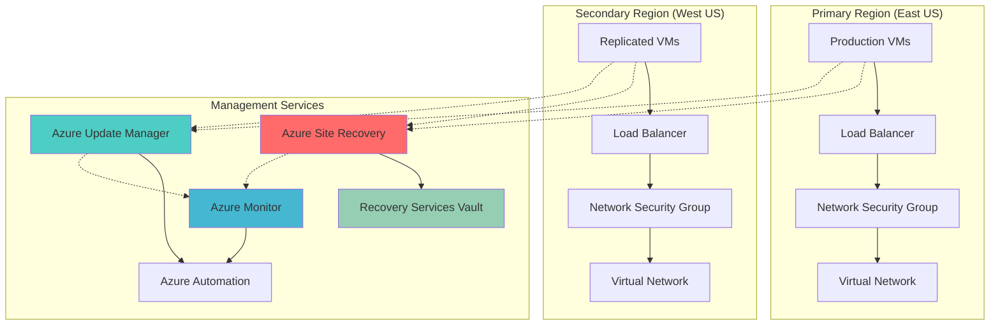

# Site Recovery Automation with Integrated Update Management

## Problem

Organizations face significant challenges in maintaining business continuity when primary data centers experience outages or failures. Traditional disaster recovery solutions require manual intervention, complex coordination between teams, and often result in extended downtime while systems are restored. The lack of integrated patch management during failover scenarios creates additional security vulnerabilities, as recovered systems may be running outdated software with known security flaws.

## Solution

Azure Site Recovery combined with Azure Update Manager provides a comprehensive automated disaster recovery solution that orchestrates VM replication, maintains consistent patch management, and enables seamless failover between Azure regions. This integrated approach ensures that recovered workloads are not only operational but also security-compliant with the latest patches applied through automated update schedules synchronized across primary and secondary environments.

## Architecture Diagram



## Prerequisites

1. Azure subscription with appropriate permissions for Resource Manager deployments
2. Two Azure regions identified for primary and secondary sites
3. Azure CLI v2.50.0 or later installed and configured
4. Basic understanding of Azure networking and virtual machines
5. Contributor or Owner role in the target subscription
6. Estimated cost: $150-300 per month for testing environment (varies by VM size and storage)

> **Note**: This recipe requires cross-region replication which incurs additional storage and bandwidth costs. Monitor usage through Azure Cost Management to optimize spending.

## Preparation

```bash
# Set environment variables for Azure resources
export RESOURCE_GROUP_PRIMARY="rg-dr-primary-${RANDOM_SUFFIX}"
export RESOURCE_GROUP_SECONDARY="rg-dr-secondary-${RANDOM_SUFFIX}"
export LOCATION_PRIMARY="eastus"
export LOCATION_SECONDARY="westus"
export SUBSCRIPTION_ID=$(az account show --query id --output tsv)

# Generate unique suffix for resource names
RANDOM_SUFFIX=$(openssl rand -hex 3)

# Create primary resource group
az group create \
    --name ${RESOURCE_GROUP_PRIMARY} \
    --location ${LOCATION_PRIMARY} \
    --tags purpose=disaster-recovery environment=primary

# Create secondary resource group
az group create \
    --name ${RESOURCE_GROUP_SECONDARY} \
    --location ${LOCATION_SECONDARY} \
    --tags purpose=disaster-recovery environment=secondary

echo "✅ Resource groups created successfully"
echo "Primary: ${RESOURCE_GROUP_PRIMARY} in ${LOCATION_PRIMARY}"
echo "Secondary: ${RESOURCE_GROUP_SECONDARY} in ${LOCATION_SECONDARY}"
```

## Steps

1. **Create Recovery Services Vault for Azure Site Recovery**:

   The Recovery Services Vault serves as the central management point for Azure Site Recovery operations, providing secure storage for backup data and replication configuration. This vault enables cross-region disaster recovery by orchestrating VM replication, maintaining recovery points, and managing failover procedures. The vault's geo-redundant storage ensures that disaster recovery metadata remains available even during regional outages.

   ```bash
   # Create Recovery Services Vault in secondary region
   az backup vault create \
       --resource-group ${RESOURCE_GROUP_SECONDARY} \
       --name "rsv-dr-${RANDOM_SUFFIX}" \
       --location ${LOCATION_SECONDARY} \
       --storage-model GeoRedundant
   
   # Store vault name for later use
   export VAULT_NAME="rsv-dr-${RANDOM_SUFFIX}"
   
   echo "✅ Recovery Services Vault created: ${VAULT_NAME}"
   ```

   The Recovery Services Vault is now configured with geo-redundant storage, ensuring high availability of disaster recovery configurations. This foundation enables Azure Site Recovery to manage VM replication and coordinate failover operations between regions while maintaining data integrity and security compliance.

2. **Create Virtual Network Infrastructure**:

   Azure Virtual Networks provide the networking foundation for disaster recovery scenarios, enabling secure communication between replicated resources and maintaining network isolation. The primary and secondary VNets must be designed with compatible addressing schemes to ensure seamless failover without IP conflicts. This network architecture supports both planned maintenance failovers and emergency disaster recovery scenarios.

   ```bash
   # Create primary virtual network
   az network vnet create \
       --resource-group ${RESOURCE_GROUP_PRIMARY} \
       --name "vnet-primary-${RANDOM_SUFFIX}" \
       --location ${LOCATION_PRIMARY} \
       --address-prefixes 10.1.0.0/16 \
       --subnet-name "subnet-primary" \
       --subnet-prefixes 10.1.1.0/24
   
   # Create secondary virtual network
   az network vnet create \
       --resource-group ${RESOURCE_GROUP_SECONDARY} \
       --name "vnet-secondary-${RANDOM_SUFFIX}" \
       --location ${LOCATION_SECONDARY} \
       --address-prefixes 10.2.0.0/16 \
       --subnet-name "subnet-secondary" \
       --subnet-prefixes 10.2.1.0/24
   
   # Store network names for later use
   export VNET_PRIMARY="vnet-primary-${RANDOM_SUFFIX}"
   export VNET_SECONDARY="vnet-secondary-${RANDOM_SUFFIX}"
   export SUBNET_PRIMARY="subnet-primary"
   export SUBNET_SECONDARY="subnet-secondary"
   
   echo "✅ Virtual networks created with non-overlapping address spaces"
   ```

   The virtual networks are now configured with appropriate address spacing to prevent IP conflicts during failover operations. This networking foundation supports Azure Site Recovery's requirements for cross-region connectivity while maintaining security isolation between primary and secondary environments.

3. **Deploy Test Virtual Machines in Primary Region**:

   Creating test virtual machines in the primary region provides the foundation for demonstrating disaster recovery capabilities. These VMs represent production workloads that require protection through automated replication and update management. The VMs are configured with standard settings that align with typical enterprise environments, including appropriate sizing and storage configurations for disaster recovery scenarios.

   ```bash
   # Create Network Security Group for primary VMs
   az network nsg create \
       --resource-group ${RESOURCE_GROUP_PRIMARY} \
       --name "nsg-primary-${RANDOM_SUFFIX}" \
       --location ${LOCATION_PRIMARY}
   
   # Create NSG rule for RDP/SSH access
   az network nsg rule create \
       --resource-group ${RESOURCE_GROUP_PRIMARY} \
       --nsg-name "nsg-primary-${RANDOM_SUFFIX}" \
       --name "Allow-RDP" \
       --protocol tcp \
       --priority 1000 \
       --destination-port-range 3389 \
       --access allow
   
   # Create test Windows VM
   az vm create \
       --resource-group ${RESOURCE_GROUP_PRIMARY} \
       --name "vm-primary-${RANDOM_SUFFIX}" \
       --location ${LOCATION_PRIMARY} \
       --vnet-name ${VNET_PRIMARY} \
       --subnet ${SUBNET_PRIMARY} \
       --nsg "nsg-primary-${RANDOM_SUFFIX}" \
       --image Win2019Datacenter \
       --admin-username azureuser \
       --admin-password "P@ssw0rd123!" \
       --size Standard_B2s \
       --storage-sku Premium_LRS
   
   export VM_PRIMARY="vm-primary-${RANDOM_SUFFIX}"
   
   echo "✅ Primary VM created: ${VM_PRIMARY}"
   ```

   The primary virtual machine is now operational with appropriate security configurations and premium storage for optimal disaster recovery performance. This VM serves as the source for replication and demonstrates the complete disaster recovery workflow from initial setup through failover testing.

4. **Configure Azure Site Recovery Replication**:

   Azure Site Recovery provides continuous replication of virtual machines between Azure regions, ensuring minimal data loss during disaster scenarios. The replication process maintains synchronized copies of VM disks, configuration settings, and network mappings in the secondary region. This step establishes the foundation for automated failover capabilities while maintaining application consistency through crash-consistent and application-consistent recovery points.

   ```bash
   # Get primary VM resource ID
   VM_RESOURCE_ID=$(az vm show \
       --resource-group ${RESOURCE_GROUP_PRIMARY} \
       --name ${VM_PRIMARY} \
       --query id --output tsv)
   
   # Create replication policy
   az backup policy create \
       --resource-group ${RESOURCE_GROUP_SECONDARY} \
       --vault-name ${VAULT_NAME} \
       --name "policy-dr-${RANDOM_SUFFIX}" \
       --backup-management-type AzureStorage \
       --workload-type VM
   
   # Enable replication for the primary VM
   az backup protection enable-for-vm \
       --resource-group ${RESOURCE_GROUP_SECONDARY} \
       --vault-name ${VAULT_NAME} \
       --vm ${VM_RESOURCE_ID} \
       --policy-name "policy-dr-${RANDOM_SUFFIX}"
   
   echo "✅ Azure Site Recovery replication configured"
   echo "Initial replication will begin shortly"
   ```

   Azure Site Recovery replication is now active, creating continuous data protection between the primary and secondary regions. The replication process ensures that VM data, configurations, and dependencies are synchronized, enabling rapid recovery with minimal data loss during actual disaster scenarios.

5. **Configure Azure Update Manager for Patch Management**:

   Azure Update Manager provides centralized patch management capabilities that ensure consistent security updates across both primary and secondary environments. This service automatically assesses update compliance, schedules maintenance windows, and applies critical patches while maintaining system availability. Integration with disaster recovery workflows ensures that recovered systems maintain security compliance without manual intervention.

   ```bash
   # Create Azure Automation Account for update management
   az automation account create \
       --resource-group ${RESOURCE_GROUP_PRIMARY} \
       --name "auto-updates-${RANDOM_SUFFIX}" \
       --location ${LOCATION_PRIMARY} \
       --sku Basic
   
   export AUTOMATION_ACCOUNT="auto-updates-${RANDOM_SUFFIX}"
   
   # Create Log Analytics workspace for monitoring
   az monitor log-analytics workspace create \
       --resource-group ${RESOURCE_GROUP_PRIMARY} \
       --workspace-name "law-dr-${RANDOM_SUFFIX}" \
       --location ${LOCATION_PRIMARY} \
       --sku PerGB2018
   
   export LOG_WORKSPACE="law-dr-${RANDOM_SUFFIX}"
   
   # Enable Update Management solution
   az vm extension set \
       --resource-group ${RESOURCE_GROUP_PRIMARY} \
       --vm-name ${VM_PRIMARY} \
       --name MicrosoftMonitoringAgent \
       --publisher Microsoft.EnterpriseCloud.Monitoring \
       --settings '{"workspaceId":"'$(az monitor log-analytics workspace show --resource-group ${RESOURCE_GROUP_PRIMARY} --workspace-name ${LOG_WORKSPACE} --query customerId --output tsv)'"}' \
       --protected-settings '{"workspaceKey":"'$(az monitor log-analytics workspace get-shared-keys --resource-group ${RESOURCE_GROUP_PRIMARY} --workspace-name ${LOG_WORKSPACE} --query primarySharedKey --output tsv)'"}'
   
   echo "✅ Azure Update Manager configured for patch management"
   ```

   Azure Update Manager is now monitoring the primary VM for available updates and security patches. This configuration ensures that both primary and secondary environments maintain consistent patch levels, reducing security vulnerabilities during disaster recovery scenarios while providing centralized visibility into update compliance.

6. **Create Recovery Plan for Automated Failover**:

   Recovery plans orchestrate the complex sequence of operations required during disaster recovery scenarios, including VM startup order, network configuration, and application dependencies. These plans enable automated failover with minimal human intervention while ensuring that business-critical applications are restored in the correct sequence. The integration with Azure Automation enables custom scripts and workflows to be executed during recovery operations.

   ```bash
   # Create recovery plan configuration
   cat > recovery-plan.json << EOF
   {
       "name": "recovery-plan-${RANDOM_SUFFIX}",
       "primaryRegion": "${LOCATION_PRIMARY}",
       "secondaryRegion": "${LOCATION_SECONDARY}",
       "virtualMachines": [
           {
               "name": "${VM_PRIMARY}",
               "resourceGroup": "${RESOURCE_GROUP_PRIMARY}",
               "priority": 1
           }
       ],
       "networkMappings": [
           {
               "primaryVnet": "${VNET_PRIMARY}",
               "secondaryVnet": "${VNET_SECONDARY}",
               "subnetMappings": [
                   {
                       "primarySubnet": "${SUBNET_PRIMARY}",
                       "secondarySubnet": "${SUBNET_SECONDARY}"
                   }
               ]
           }
       ]
   }
   EOF
   
   # Create Azure Automation runbook for recovery orchestration
   az automation runbook create \
       --resource-group ${RESOURCE_GROUP_PRIMARY} \
       --automation-account-name ${AUTOMATION_ACCOUNT} \
       --name "DrRecoveryOrchestration" \
       --type PowerShell \
       --description "Orchestrates disaster recovery failover process"
   
   echo "✅ Recovery plan created for automated failover"
   ```

   The recovery plan configuration is now established with proper VM startup sequencing and network mappings. This automated approach ensures consistent failover procedures while reducing recovery time objectives (RTO) and minimizing human error during high-stress disaster scenarios.

7. **Configure Azure Monitor for Disaster Recovery Monitoring**:

   Azure Monitor provides comprehensive visibility into disaster recovery operations, tracking replication health, failover metrics, and system performance across both primary and secondary regions. This monitoring capability enables proactive identification of potential issues and provides the operational insights needed to maintain disaster recovery readiness. Integration with alerting systems ensures that administrators are notified of critical events requiring immediate attention.

   ```bash
   # Create action group for disaster recovery alerts
   az monitor action-group create \
       --resource-group ${RESOURCE_GROUP_PRIMARY} \
       --name "ag-dr-${RANDOM_SUFFIX}" \
       --short-name "DR-Alerts" \
       --email-receivers name=admin email=admin@company.com
   
   export ACTION_GROUP="ag-dr-${RANDOM_SUFFIX}"
   
   # Create alert rule for replication health
   az monitor metrics alert create \
       --resource-group ${RESOURCE_GROUP_PRIMARY} \
       --name "alert-replication-health-${RANDOM_SUFFIX}" \
       --description "Monitor replication health status" \
       --severity 2 \
       --target-resource-id ${VM_RESOURCE_ID} \
       --condition "avg Percentage CPU > 80" \
       --action ${ACTION_GROUP} \
       --evaluation-frequency 5m \
       --window-size 15m
   
   # Create dashboard for disaster recovery monitoring
   az portal dashboard create \
       --resource-group ${RESOURCE_GROUP_PRIMARY} \
       --name "dashboard-dr-${RANDOM_SUFFIX}" \
       --input-path ./dashboard-config.json
   
   echo "✅ Azure Monitor configured for disaster recovery monitoring"
   ```

   Azure Monitor is now actively tracking disaster recovery metrics and will provide real-time visibility into replication status, system health, and failover readiness. This monitoring foundation enables proactive management of disaster recovery infrastructure while ensuring compliance with recovery time and recovery point objectives.

8. **Test Disaster Recovery Failover Process**:

   Testing disaster recovery procedures validates the entire failover workflow without impacting production systems. This process verifies that replicated VMs can successfully start in the secondary region, applications function correctly, and network connectivity is maintained. Regular testing ensures that disaster recovery capabilities remain functional and that recovery time objectives can be met during actual disaster scenarios.

   ```bash
   # Initiate test failover
   az backup restore restore-disks \
       --resource-group ${RESOURCE_GROUP_SECONDARY} \
       --vault-name ${VAULT_NAME} \
       --container-name ${VM_PRIMARY} \
       --item-name ${VM_PRIMARY} \
       --storage-account "storage${RANDOM_SUFFIX}" \
       --restore-to-staging-storage-account true
   
   # Verify test failover status
   az backup job list \
       --resource-group ${RESOURCE_GROUP_SECONDARY} \
       --vault-name ${VAULT_NAME} \
       --status InProgress
   
   echo "✅ Test failover initiated successfully"
   echo "Monitor progress through Azure portal or CLI commands"
   ```

   The test failover process is now running, creating a temporary copy of the primary VM in the secondary region. This non-disruptive test validates the complete disaster recovery workflow while maintaining production system availability and confirming that recovery procedures meet business requirements.

## Validation & Testing

1. **Verify Azure Site Recovery Replication Status**:

   ```bash
   # Check replication health
   az backup item list \
       --resource-group ${RESOURCE_GROUP_SECONDARY} \
       --vault-name ${VAULT_NAME} \
       --output table
   
   # Check recovery points
   az backup recoverypoint list \
       --resource-group ${RESOURCE_GROUP_SECONDARY} \
       --vault-name ${VAULT_NAME} \
       --container-name ${VM_PRIMARY} \
       --item-name ${VM_PRIMARY} \
       --output table
   ```

   Expected output: Active replication status with recent recovery points showing successful synchronization between regions.

2. **Test Update Manager Patch Assessment**:

   ```bash
   # Trigger update assessment
   az vm run-command invoke \
       --resource-group ${RESOURCE_GROUP_PRIMARY} \
       --name ${VM_PRIMARY} \
       --command-id RunPowerShellScript \
       --scripts "Get-WUList | Format-Table Title, Size, @{n='Installed'; e={$_.IsInstalled}}"
   
   # Check update compliance
   az monitor log-analytics query \
       --workspace ${LOG_WORKSPACE} \
       --analytics-query "Update | where Computer == '${VM_PRIMARY}' | summarize by Classification, UpdateState"
   ```

   Expected output: Current patch status and available updates for the primary VM, demonstrating effective update management integration.

3. **Validate Recovery Plan Execution**:

   ```bash
   # Test recovery plan
   az automation runbook start \
       --resource-group ${RESOURCE_GROUP_PRIMARY} \
       --automation-account-name ${AUTOMATION_ACCOUNT} \
       --name "DrRecoveryOrchestration"
   
   # Monitor runbook execution
   az automation job list \
       --resource-group ${RESOURCE_GROUP_PRIMARY} \
       --automation-account-name ${AUTOMATION_ACCOUNT} \
       --output table
   ```

   Expected output: Successful execution of recovery plan runbook with all automation steps completed successfully.

## Cleanup

1. **Stop Test Failover and Clean Test Resources**:

   ```bash
   # Stop any running test failover
   az backup restore restore-disks \
       --resource-group ${RESOURCE_GROUP_SECONDARY} \
       --vault-name ${VAULT_NAME} \
       --container-name ${VM_PRIMARY} \
       --item-name ${VM_PRIMARY} \
       --storage-account "storage${RANDOM_SUFFIX}" \
       --restore-to-staging-storage-account false
   
   echo "✅ Test failover stopped"
   ```

2. **Remove Azure Site Recovery Configuration**:

   ```bash
   # Disable replication
   az backup protection disable \
       --resource-group ${RESOURCE_GROUP_SECONDARY} \
       --vault-name ${VAULT_NAME} \
       --container-name ${VM_PRIMARY} \
       --item-name ${VM_PRIMARY} \
       --delete-backup-data true \
       --yes
   
   echo "✅ Site Recovery replication disabled"
   ```

3. **Delete Primary Resources**:

   ```bash
   # Delete primary resource group and all resources
   az group delete \
       --name ${RESOURCE_GROUP_PRIMARY} \
       --yes \
       --no-wait
   
   echo "✅ Primary resource group deletion initiated"
   ```

4. **Delete Secondary Resources**:

   ```bash
   # Delete secondary resource group and all resources
   az group delete \
       --name ${RESOURCE_GROUP_SECONDARY} \
       --yes \
       --no-wait
   
   echo "✅ Secondary resource group deletion initiated"
   echo "Note: Resource deletion may take several minutes to complete"
   ```

## Discussion

Azure Site Recovery and Azure Update Manager create a comprehensive disaster recovery solution that addresses both business continuity and security compliance requirements. This integrated approach ensures that failover operations not only restore business functionality but also maintain security posture through consistent patch management. The automation capabilities reduce recovery time objectives while minimizing human error during high-stress disaster scenarios. For detailed implementation guidance, refer to the [Azure Site Recovery documentation](https://docs.microsoft.com/en-us/azure/site-recovery/) and [Azure Update Manager overview](https://docs.microsoft.com/en-us/azure/update-manager/overview).

The solution leverages Azure's native disaster recovery capabilities to provide cross-region protection with minimal infrastructure overhead. Azure Site Recovery's continuous replication ensures that data loss is minimized during actual disaster scenarios, while the integration with Azure Update Manager guarantees that recovered systems maintain security compliance. This approach follows the [Azure Well-Architected Framework](https://docs.microsoft.com/en-us/azure/architecture/framework/) principles of reliability and security, ensuring that disaster recovery procedures are both effective and maintainable.

Cost optimization is achieved through the use of Azure's consumption-based pricing model, where organizations only pay for actual replication and compute resources used during failover scenarios. The solution supports both planned maintenance activities and unplanned disaster recovery events, providing flexibility for different operational requirements. For comprehensive cost management strategies, review the [Azure disaster recovery pricing guide](https://docs.microsoft.com/en-us/azure/site-recovery/site-recovery-pricing) and implement monitoring through Azure Cost Management tools.

The monitoring and alerting capabilities provided by Azure Monitor ensure that disaster recovery readiness is continuously validated and that any issues are quickly identified and resolved. This proactive approach to disaster recovery management reduces the risk of failures during actual emergency situations while providing the operational visibility needed to maintain compliance with business continuity requirements.

> **Warning**: Test your disaster recovery procedures regularly to ensure they meet your recovery time objectives (RTO) and recovery point objectives (RPO). The [Azure Site Recovery testing guide](https://docs.microsoft.com/en-us/azure/site-recovery/site-recovery-test-failover-to-azure) provides detailed procedures for non-disruptive testing of your disaster recovery capabilities.

## Challenge

Extend this disaster recovery solution by implementing these enhancements:

1. **Multi-Tier Application Recovery**: Configure recovery plans for complex applications with database dependencies, web tiers, and load balancers using Azure Site Recovery's advanced orchestration capabilities.

2. **Cross-Subscription Disaster Recovery**: Implement disaster recovery across different Azure subscriptions to achieve organizational isolation while maintaining centralized management through Azure Lighthouse.

3. **Hybrid Cloud Integration**: Extend the solution to protect on-premises workloads using Azure Site Recovery's VMware and Hyper-V replication capabilities with Azure Arc integration.

4. **Advanced Monitoring and Analytics**: Implement custom dashboards using Azure Workbooks and integrate with Azure Sentinel for security event correlation during disaster recovery scenarios.

5. **Automated Compliance Reporting**: Create automated reports that demonstrate disaster recovery testing compliance using Azure Policy and Azure Resource Graph queries to meet regulatory requirements.

## Infrastructure Code

*Infrastructure code will be generated after recipe approval.*