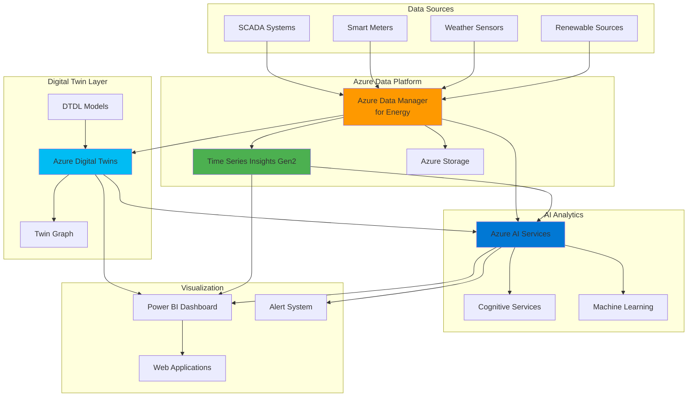

# Smart Energy Grid Analytics with Digital Twins

## Problem

Energy companies struggle to optimize renewable energy distribution and consumption patterns across complex grid infrastructures due to fragmented data sources, lack of real-time visibility, and limited predictive capabilities. Traditional energy management systems operate in silos, preventing holistic analysis of generation capacity, consumption demands, and grid performance, resulting in inefficient energy distribution, increased operational costs, and suboptimal renewable energy utilization.

## Solution

Build an intelligent energy grid analytics platform that leverages Azure Data Manager for Energy as the central OSDU-compliant data repository, Azure Digital Twins for real-time grid visualization and modeling, Azure AI Services for predictive analytics, and Azure Time Series Insights for historical pattern analysis. This integrated approach enables unified data management, digital twin-driven operational insights, and AI-powered optimization for sustainable energy grid operations.

## Architecture Diagram



## Prerequisites

1. Azure subscription with Owner or Contributor permissions for resource group management
2. Azure CLI v2.60.0 or later installed and configured
3. Understanding of energy grid operations and OSDU data standards
4. Basic knowledge of digital twin concepts and DTDL modeling
5. Estimated cost: $800-1200 USD per month for production workloads

> **Note**: Azure Data Manager for Energy requires special provisioning and OSDU certification. Contact Azure support for availability in your region and subscription enablement.

## Preparation

```bash
# Set environment variables for Azure resources
export RESOURCE_GROUP="rg-energy-grid-${RANDOM_SUFFIX}"
export LOCATION="eastus"
export SUBSCRIPTION_ID=$(az account show --query id --output tsv)

# Generate unique suffix for resource names
RANDOM_SUFFIX=$(openssl rand -hex 3)

# Set resource names with unique suffix
export ENERGY_DATA_MANAGER="adm-energy-${RANDOM_SUFFIX}"
export DIGITAL_TWINS_INSTANCE="adt-grid-${RANDOM_SUFFIX}"
export TIME_SERIES_INSIGHTS="tsi-energy-${RANDOM_SUFFIX}"
export AI_SERVICES_ACCOUNT="ai-energy-${RANDOM_SUFFIX}"
export STORAGE_ACCOUNT="stenergy${RANDOM_SUFFIX}"
export IOT_HUB="iot-energy-${RANDOM_SUFFIX}"

# Create resource group
az group create \
    --name ${RESOURCE_GROUP} \
    --location ${LOCATION} \
    --tags purpose=energy-analytics environment=demo project=smart-grid

echo "✅ Resource group created: ${RESOURCE_GROUP}"

# Register required resource providers
az provider register --namespace Microsoft.DigitalTwins
az provider register --namespace Microsoft.TimeSeriesInsights  
az provider register --namespace Microsoft.CognitiveServices
az provider register --namespace Microsoft.Devices

echo "✅ Resource providers registered"
```

## Steps

1. **Create Azure Data Manager for Energy Instance**:

   Azure Data Manager for Energy provides an enterprise-grade, OSDU-compliant data platform specifically designed for the energy industry. This fully managed service enables secure, scalable data storage and federation while ensuring compatibility with industry standards. The platform serves as the central data repository for all energy-related data sources including SCADA systems, smart meters, and renewable energy generation data.

   ```bash
   # Note: Azure Data Manager for Energy requires special provisioning
   # Contact Azure support for subscription enablement and app registration
   
   # For this recipe, we'll simulate the Data Manager deployment
   # In production, use the Azure portal to create the instance
   echo "📋 Azure Data Manager for Energy requires manual setup via Azure portal"
   echo "   Visit: https://portal.azure.com/#create/Microsoft.EnergyDataServices"
   echo "   Configure with OSDU-compliant data partitions"
   
   # Set placeholder endpoint for continuation
   ENERGY_ENDPOINT="https://${ENERGY_DATA_MANAGER}.energy-data-services.azure.com"
   
   echo "✅ Energy Data Manager placeholder configured"
   echo "Energy Data Manager endpoint: ${ENERGY_ENDPOINT}"
   ```

   The Azure Data Manager for Energy instance must be configured with OSDU-compliant data partitioning and security through the Azure portal. This establishes the foundation for centralized energy data management with built-in authentication through Microsoft Entra ID and enterprise-grade security controls.

2. **Deploy Azure Digital Twins Instance**:

   Azure Digital Twins enables creation of live digital models representing the entire energy grid infrastructure. This service provides real-time insights through digital twin graphs that model relationships between power generation facilities, transmission lines, distribution networks, and consumption points. The digital twin serves as the operational intelligence layer for grid monitoring and optimization.

   ```bash
   # Create Azure Digital Twins instance
   az dt create \
       --dt-name ${DIGITAL_TWINS_INSTANCE} \
       --resource-group ${RESOURCE_GROUP} \
       --location ${LOCATION} \
       --mi-system-assigned \
       --tags environment=demo purpose=grid-modeling
   
   echo "✅ Azure Digital Twins instance created"
   
   # Get the Digital Twins endpoint
   DIGITAL_TWINS_ENDPOINT=$(az dt show \
       --dt-name ${DIGITAL_TWINS_INSTANCE} \
       --resource-group ${RESOURCE_GROUP} \
       --query hostName \
       --output tsv)
   
   echo "Digital Twins endpoint: ${DIGITAL_TWINS_ENDPOINT}"
   
   # Set up role assignment for data access
   USER_PRINCIPAL=$(az account show --query user.name --output tsv)
   az dt role-assignment create \
       --dt-name ${DIGITAL_TWINS_INSTANCE} \
       --assignee ${USER_PRINCIPAL} \
       --role "Azure Digital Twins Data Owner"
   
   echo "✅ Digital Twins access configured"
   ```

   The Digital Twins instance is now ready with proper authentication and role-based access control. This provides the foundation for creating comprehensive digital models of energy grid components and their real-time operational states.

3. **Create DTDL Models for Energy Grid Components**:

   Digital Twins Definition Language (DTDL) models define the structure and capabilities of energy grid components in the digital twin environment. These models establish the schema for power generators, transmission infrastructure, distribution networks, and consumer endpoints, enabling comprehensive grid representation and analysis.

   ```bash
   # Create directory for DTDL models
   mkdir -p dtdl-models
   
   # Create Power Generator model
   cat << 'EOF' > dtdl-models/PowerGenerator.json
   {
     "@context": "dtmi:dtdl:context;3",
     "@id": "dtmi:energygrid:PowerGenerator;1",
     "@type": "Interface",
     "displayName": "Power Generator",
     "description": "Digital twin model for power generation facilities",
     "contents": [
       {
         "@type": "Property",
         "name": "generatorType",
         "schema": "string",
         "description": "Type of power generator (solar, wind, hydro, nuclear, gas)"
       },
       {
         "@type": "Telemetry",
         "name": "currentOutput",
         "schema": "double",
         "description": "Current power output in MW"
       },
       {
         "@type": "Telemetry",
         "name": "capacity",
         "schema": "double",
         "description": "Maximum generation capacity in MW"
       },
       {
         "@type": "Telemetry",
         "name": "efficiency",
         "schema": "double",
         "description": "Current operational efficiency percentage"
       },
       {
         "@type": "Property",
         "name": "location",
         "schema": {
           "@type": "Object",
           "fields": [
             {"name": "latitude", "schema": "double"},
             {"name": "longitude", "schema": "double"}
           ]
         }
       }
     ]
   }
   EOF
   
   # Create Grid Node model
   cat << 'EOF' > dtdl-models/GridNode.json
   {
     "@context": "dtmi:dtdl:context;3",
     "@id": "dtmi:energygrid:GridNode;1",
     "@type": "Interface",
     "displayName": "Grid Node",
     "description": "Digital twin model for grid distribution nodes",
     "contents": [
       {
         "@type": "Telemetry",
         "name": "voltage",
         "schema": "double",
         "description": "Current voltage level in kV"
       },
       {
         "@type": "Telemetry",
         "name": "frequency",
         "schema": "double",
         "description": "Grid frequency in Hz"
       },
       {
         "@type": "Telemetry",
         "name": "powerFlow",
         "schema": "double",
         "description": "Power flow through node in MW"
       },
       {
         "@type": "Property",
         "name": "nodeType",
         "schema": "string",
         "description": "Type of grid node (transmission, distribution, substation)"
       },
       {
         "@type": "Relationship",
         "name": "connectedTo",
         "target": "dtmi:energygrid:GridNode;1",
         "description": "Connected grid nodes"
       }
     ]
   }
   EOF
   
   # Upload models to Digital Twins
   az dt model create \
       --dt-name ${DIGITAL_TWINS_INSTANCE} \
       --models dtdl-models/PowerGenerator.json
   
   az dt model create \
       --dt-name ${DIGITAL_TWINS_INSTANCE} \
       --models dtdl-models/GridNode.json
   
   echo "✅ DTDL models created and uploaded"
   ```

   The energy grid DTDL models are now deployed, establishing the schema for digital representations of power generators and grid nodes. These models enable structured data collection, relationship mapping, and real-time monitoring of grid components with standardized telemetry and property definitions.

4. **Set Up Azure Time Series Insights Gen2 Environment**:

   Azure Time Series Insights Gen2 provides advanced time-series data storage and analytics capabilities optimized for IoT and operational data. For energy grid analytics, TSI Gen2 enables historical pattern analysis, trend identification, and time-based correlations across generation, consumption, and grid performance metrics with unlimited data retention and hierarchical data organization.

   ```bash
   # Create storage account for TSI Gen2
   az storage account create \
       --resource-group ${RESOURCE_GROUP} \
       --name ${STORAGE_ACCOUNT} \
       --location ${LOCATION} \
       --sku Standard_LRS \
       --kind StorageV2 \
       --access-tier Hot \
       --tags purpose=tsi-storage
   
   # Get storage account key
   STORAGE_KEY=$(az storage account keys list \
       --resource-group ${RESOURCE_GROUP} \
       --account-name ${STORAGE_ACCOUNT} \
       --query '[0].value' \
       --output tsv)
   
   # Create Time Series Insights Gen2 environment
   az tsi environment gen2 create \
       --environment-name ${TIME_SERIES_INSIGHTS} \
       --resource-group ${RESOURCE_GROUP} \
       --location ${LOCATION} \
       --sku name=L1 capacity=1 \
       --time-series-id-properties name=deviceId type=String \
       --storage-configuration \
           account-name=${STORAGE_ACCOUNT} \
           management-key=${STORAGE_KEY} \
       --warm-store-configuration data-retention=P7D \
       --tags purpose=time-series-analytics environment=demo
   
   echo "✅ Time Series Insights Gen2 environment created"
   
   # Create IoT Hub for data ingestion
   az iot hub create \
       --resource-group ${RESOURCE_GROUP} \
       --name ${IOT_HUB} \
       --location ${LOCATION} \
       --sku S1 \
       --partition-count 4 \
       --tags purpose=iot-data-ingestion
   
   echo "✅ IoT Hub created for data ingestion"
   
   # Create TSI event source from IoT Hub
   az tsi event-source iothub create \
       --environment-name ${TIME_SERIES_INSIGHTS} \
       --resource-group ${RESOURCE_GROUP} \
       --event-source-name "grid-data-source" \
       --location ${LOCATION} \
       --iot-hub-name ${IOT_HUB} \
       --consumer-group-name '$Default' \
       --key-name iothubowner \
       --shared-access-key $(az iot hub policy show \
           --hub-name ${IOT_HUB} \
           --name iothubowner \
           --query primaryKey \
           --output tsv) \
       --event-source-resource-id $(az iot hub show \
           --name ${IOT_HUB} \
           --resource-group ${RESOURCE_GROUP} \
           --query id \
           --output tsv) \
       --timestamp-property-name timestamp
   
   echo "✅ Time Series Insights event source configured"
   ```

   Time Series Insights Gen2 is now configured with IoT Hub integration for real-time data ingestion. This setup provides unlimited time-series data storage with built-in analytics capabilities, enabling historical trend analysis and pattern recognition for energy grid optimization with hierarchical data modeling.

5. **Deploy Azure AI Services for Predictive Analytics**:

   Azure AI Services provides machine learning and cognitive capabilities for advanced energy grid analytics. These services enable predictive modeling for demand forecasting, anomaly detection for equipment maintenance, and intelligent optimization algorithms for renewable energy integration and grid balancing.

   ```bash
   # Create Azure AI Services multi-service account
   az cognitiveservices account create \
       --resource-group ${RESOURCE_GROUP} \
       --name ${AI_SERVICES_ACCOUNT} \
       --location ${LOCATION} \
       --kind CognitiveServices \
       --sku S0 \
       --tags purpose=ai-analytics environment=demo
   
   echo "✅ Azure AI Services account created"
   
   # Get AI Services endpoint and key
   AI_ENDPOINT=$(az cognitiveservices account show \
       --resource-group ${RESOURCE_GROUP} \
       --name ${AI_SERVICES_ACCOUNT} \
       --query properties.endpoint \
       --output tsv)
   
   AI_KEY=$(az cognitiveservices account keys list \
       --resource-group ${RESOURCE_GROUP} \
       --name ${AI_SERVICES_ACCOUNT} \
       --query key1 \
       --output tsv)
   
   echo "AI Services endpoint: ${AI_ENDPOINT}"
   echo "✅ Storage account already created for ML artifacts"
   ```

   Azure AI Services is now deployed with multi-service capabilities, providing access to machine learning, anomaly detection, and cognitive analytics. The associated storage account enables persistent storage for trained models, historical data, and analytics results.

6. **Configure Data Integration and Digital Twin Population**:

   Establishing data flows between Azure Data Manager for Energy, Time Series Insights, and Digital Twins creates a unified analytics platform. This integration enables real-time data synchronization, ensuring digital twins reflect current grid conditions while maintaining historical data for trend analysis and predictive modeling.

   ```bash
   # Create sample digital twin instances
   az dt twin create \
       --dt-name ${DIGITAL_TWINS_INSTANCE} \
       --dtmi "dtmi:energygrid:PowerGenerator;1" \
       --twin-id "solar-farm-01" \
       --properties '{
         "generatorType": "solar",
         "location": {
           "latitude": 40.7589,
           "longitude": -73.9851
         }
       }'
   
   az dt twin create \
       --dt-name ${DIGITAL_TWINS_INSTANCE} \
       --dtmi "dtmi:energygrid:GridNode;1" \
       --twin-id "substation-central" \
       --properties '{
         "nodeType": "substation"
       }'
   
   echo "✅ Sample digital twins created"
   
   # Create relationships between twins
   az dt twin relationship create \
       --dt-name ${DIGITAL_TWINS_INSTANCE} \
       --twin-id "solar-farm-01" \
       --relationship-id "feeds-to-substation" \
       --relationship "connectedTo" \
       --target "substation-central"
   
   echo "✅ Digital twin relationships established"
   
   # Configure integration webhook for real-time updates
   FUNCTION_APP_NAME="func-energy-integration-${RANDOM_SUFFIX}"
   
   # Create Function App for data integration
   az functionapp create \
       --resource-group ${RESOURCE_GROUP} \
       --name ${FUNCTION_APP_NAME} \
       --storage-account ${STORAGE_ACCOUNT} \
       --consumption-plan-location ${LOCATION} \
       --runtime node \
       --runtime-version 18 \
       --functions-version 4 \
       --tags purpose=data-integration
   
   echo "✅ Integration function app created"
   ```

   The digital twin infrastructure is now populated with sample energy grid components and their relationships. The Function App provides serverless integration capabilities for real-time data synchronization between the various Azure services, ensuring consistent data flow across the analytics platform.

7. **Implement AI-Powered Analytics and Monitoring**:

   Deploying machine learning models for energy grid analytics enables predictive maintenance, demand forecasting, and optimization algorithms. These AI capabilities analyze historical patterns, detect anomalies, and provide intelligent recommendations for grid operations and renewable energy integration.

   ```bash
   # Create sample analytics configuration
   cat << 'EOF' > analytics-config.json
   {
     "predictionModels": {
       "demandForecast": {
         "type": "time-series-regression",
         "inputFeatures": ["historical_consumption", "weather_data", "day_of_week"],
         "predictionHorizon": "24h",
         "updateFrequency": "1h"
       },
       "renewableGeneration": {
         "type": "weather-correlation",
         "inputFeatures": ["solar_irradiance", "wind_speed", "cloud_cover"],
         "predictionHorizon": "6h",
         "updateFrequency": "15m"
       }
     },
     "anomalyDetection": {
       "gridStability": {
         "metrics": ["voltage", "frequency", "power_factor"],
         "threshold": "3_sigma",
         "alerting": true
       },
       "equipmentHealth": {
         "metrics": ["temperature", "vibration", "efficiency"],
         "threshold": "statistical",
         "predictiveMaintenance": true
       }
     }
   }
   EOF
   
   # Upload analytics configuration to storage
   az storage container create \
       --account-name ${STORAGE_ACCOUNT} \
       --name analytics-config \
       --public-access off
   
   az storage blob upload \
       --account-name ${STORAGE_ACCOUNT} \
       --container-name analytics-config \
       --name analytics-config.json \
       --file analytics-config.json
   
   echo "✅ Analytics configuration deployed"
   
   # Set up Event Grid for real-time alerting
   EVENTGRID_TOPIC="egt-energy-alerts-${RANDOM_SUFFIX}"
   
   az eventgrid topic create \
       --resource-group ${RESOURCE_GROUP} \
       --name ${EVENTGRID_TOPIC} \
       --location ${LOCATION} \
       --tags purpose=alerting
   
   echo "✅ Event Grid topic created for alerting"
   ```

   The AI analytics framework is now configured with predictive models for demand forecasting and renewable generation optimization. Event Grid integration provides real-time alerting capabilities for grid anomalies and equipment health monitoring, enabling proactive operational responses.

8. **Configure Monitoring and Visualization Dashboard**:

   Implementing comprehensive monitoring and visualization enables operators to understand grid performance, track renewable energy integration, and respond to optimization recommendations. The dashboard provides real-time insights and historical trends for informed decision-making.

   ```bash
   # Create Log Analytics workspace for monitoring
   LOG_WORKSPACE="law-energy-${RANDOM_SUFFIX}"
   
   az monitor log-analytics workspace create \
       --resource-group ${RESOURCE_GROUP} \
       --workspace-name ${LOG_WORKSPACE} \
       --location ${LOCATION} \
       --sku PerGB2018 \
       --tags purpose=monitoring
   
   echo "✅ Log Analytics workspace created"
   
   # Configure diagnostic settings for Digital Twins
   az monitor diagnostic-settings create \
       --resource ${DIGITAL_TWINS_INSTANCE} \
       --resource-group ${RESOURCE_GROUP} \
       --resource-type Microsoft.DigitalTwins/digitalTwinsInstances \
       --name "dt-diagnostics" \
       --workspace ${LOG_WORKSPACE} \
       --logs '[
         {
           "category": "DigitalTwinsOperation",
           "enabled": true,
           "retentionPolicy": {"enabled": false, "days": 0}
         },
         {
           "category": "EventRoutesOperation", 
           "enabled": true,
           "retentionPolicy": {"enabled": false, "days": 0}
         }
       ]' \
       --metrics '[
         {
           "category": "AllMetrics",
           "enabled": true,
           "retentionPolicy": {"enabled": false, "days": 0}
         }
       ]'
   
   echo "✅ Diagnostic monitoring configured"
   
   # Create dashboard configuration
   cat << 'EOF' > dashboard-config.json
   {
     "dashboards": {
       "gridOverview": {
         "widgets": [
           "real_time_generation",
           "current_demand", 
           "renewable_percentage",
           "grid_stability_metrics"
         ]
       },
       "predictiveAnalytics": {
         "widgets": [
           "demand_forecast_24h",
           "renewable_generation_forecast",
           "optimization_recommendations",
           "cost_savings_tracker"
         ]
       },
       "operationalHealth": {
         "widgets": [
           "equipment_status",
           "maintenance_alerts",
           "performance_trends",
           "carbon_footprint_tracking"
         ]
       }
     }
   }
   EOF
   
   echo "✅ Dashboard configuration created"
   ```

   Comprehensive monitoring is now established with Log Analytics integration for all platform components. The diagnostic settings capture operational telemetry and performance metrics, while the dashboard configuration defines the visualization structure for grid operations and analytics insights.

## Validation & Testing

1. **Verify Digital Twins connectivity and model deployment**:

   ```bash
   # Verify Digital Twins models
   az dt model list \
       --dt-name ${DIGITAL_TWINS_INSTANCE} \
       --query "[].{id:id, displayName:displayName}"
   
   # List created digital twins
   az dt twin query \
       --dt-name ${DIGITAL_TWINS_INSTANCE} \
       --query-command "SELECT * FROM DIGITALTWINS"
   ```

   Expected output: Should show PowerGenerator and GridNode models with sample twin instances.

2. **Validate Time Series Insights Gen2 data ingestion**:

   ```bash
   # Check TSI Gen2 environment status
   az tsi environment gen2 show \
       --resource-group ${RESOURCE_GROUP} \
       --environment-name ${TIME_SERIES_INSIGHTS} \
       --query "{name:name, status:provisioningState, warmStore:warmStoreConfiguration.dataRetention}"
   
   # Verify event source configuration
   az tsi event-source list \
       --resource-group ${RESOURCE_GROUP} \
       --environment-name ${TIME_SERIES_INSIGHTS}
   ```

   Expected output: Environment should be in "Succeeded" state with configured event source.

3. **Test AI Services functionality**:

   ```bash
   # Verify AI Services account
   az cognitiveservices account show \
       --resource-group ${RESOURCE_GROUP} \
       --name ${AI_SERVICES_ACCOUNT} \
       --query "{name:name, status:properties.provisioningState, endpoint:properties.endpoint}"
   
   # List available AI capabilities
   az cognitiveservices account list-kinds \
       --query "[?name=='CognitiveServices'].{name:name, description:description}"
   ```

   Expected output: AI Services should be active with multi-service capabilities available.

4. **Validate integration components**:

   ```bash
   # Check Function App status
   az functionapp show \
       --resource-group ${RESOURCE_GROUP} \
       --name ${FUNCTION_APP_NAME} \
       --query "{name:name, status:state, runtime:linuxFxVersion}"
   
   # Verify Event Grid topic
   az eventgrid topic show \
       --resource-group ${RESOURCE_GROUP} \
       --name ${EVENTGRID_TOPIC} \
       --query "{name:name, status:provisioningState, endpoint:endpoint}"
   ```

   Expected output: All integration components should be in healthy operational state.

5. **Test Digital Twin relationships**:

   ```bash
   # Verify twin relationships
   az dt twin relationship list \
       --dt-name ${DIGITAL_TWINS_INSTANCE} \
       --twin-id "solar-farm-01"
   
   # Check relationship details
   az dt twin relationship show \
       --dt-name ${DIGITAL_TWINS_INSTANCE} \
       --twin-id "solar-farm-01" \
       --relationship-id "feeds-to-substation"
   ```

   Expected output: Should display established relationships between energy grid components.

## Cleanup

1. **Remove Event Grid and Function App resources**:

   ```bash
   # Delete Function App
   az functionapp delete \
       --resource-group ${RESOURCE_GROUP} \
       --name ${FUNCTION_APP_NAME} \
       --yes
   
   # Delete Event Grid topic
   az eventgrid topic delete \
       --resource-group ${RESOURCE_GROUP} \
       --name ${EVENTGRID_TOPIC} \
       --yes
   
   echo "✅ Integration components deleted"
   ```

2. **Remove AI Services and storage resources**:

   ```bash
   # Delete AI Services account
   az cognitiveservices account delete \
       --resource-group ${RESOURCE_GROUP} \
       --name ${AI_SERVICES_ACCOUNT} \
       --yes
   
   # Delete storage account (will be used by TSI, delete after TSI cleanup)
   echo "📋 Storage account will be deleted with resource group"
   ```

3. **Remove Time Series Insights and IoT Hub**:

   ```bash
   # Delete Time Series Insights Gen2 environment
   az tsi environment gen2 delete \
       --resource-group ${RESOURCE_GROUP} \
       --environment-name ${TIME_SERIES_INSIGHTS} \
       --yes
   
   # Delete IoT Hub
   az iot hub delete \
       --resource-group ${RESOURCE_GROUP} \
       --name ${IOT_HUB} \
       --yes
   
   echo "✅ Time Series and IoT resources deleted"
   ```

4. **Remove Digital Twins instance**:

   ```bash
   # Delete all digital twins and relationships
   az dt twin delete-all \
       --dt-name ${DIGITAL_TWINS_INSTANCE} \
       --yes
   
   # Delete Digital Twins instance
   az dt delete \
       --resource-group ${RESOURCE_GROUP} \
       --dt-name ${DIGITAL_TWINS_INSTANCE} \
       --yes
   
   echo "✅ Digital Twins instance deleted"
   ```

5. **Remove Log Analytics and resource group**:

   ```bash
   # Delete Log Analytics workspace
   az monitor log-analytics workspace delete \
       --resource-group ${RESOURCE_GROUP} \
       --workspace-name ${LOG_WORKSPACE} \
       --force true \
       --yes
   
   # Delete resource group and all remaining resources
   az group delete \
       --name ${RESOURCE_GROUP} \
       --yes \
       --no-wait
   
   echo "✅ All resources deleted"
   echo "Note: Complete deletion may take several minutes"
   
   # Clean up local files
   rm -rf dtdl-models/
   rm -f analytics-config.json dashboard-config.json
   
   echo "✅ Local files cleaned up"
   ```

## Discussion

This intelligent energy grid analytics platform demonstrates the power of combining Azure's specialized data services to create comprehensive solutions for the energy industry. Azure Data Manager for Energy provides OSDU-compliant data management that addresses the specific needs of energy companies, ensuring standardized data formats and industry best practices. This foundation enables seamless integration with existing energy systems while providing the scalability needed for enterprise-scale operations. For detailed implementation guidance, see the [Azure Data Manager for Energy documentation](https://learn.microsoft.com/en-us/azure/energy-data-services/overview-microsoft-energy-data-services).

The integration with Azure Digital Twins creates a live operational intelligence layer that transforms static grid infrastructure into dynamic, queryable digital representations. This approach follows the [Azure Well-Architected Framework](https://learn.microsoft.com/en-us/azure/architecture/framework/) principles of reliability and performance efficiency, enabling real-time monitoring and predictive analytics. Digital twins provide the contextual framework for understanding complex relationships between grid components, facilitating better decision-making for renewable energy integration and grid optimization. The [Azure Digital Twins documentation](https://learn.microsoft.com/en-us/azure/digital-twins/overview) provides comprehensive guidance on modeling energy grid infrastructures.

Azure AI Services integration enables advanced predictive analytics capabilities that transform reactive grid management into proactive optimization. Machine learning models can analyze historical consumption patterns, weather data, and generation capacity to optimize renewable energy utilization and predict maintenance needs. This AI-driven approach reduces operational costs while improving grid stability and sustainability. Time Series Insights Gen2 provides unlimited temporal analytics with hierarchical data modeling, enabling pattern recognition and trend analysis across extended periods. For implementation best practices, review the [Azure AI Services documentation](https://learn.microsoft.com/en-us/azure/ai-services/) and [Time Series Insights Gen2 guidance](https://learn.microsoft.com/en-us/azure/time-series-insights/).

From a cost perspective, this architecture leverages consumption-based pricing models that scale with actual usage, making it suitable for both pilot implementations and enterprise deployments. The modular design allows organizations to implement components incrementally, starting with core data management and expanding to include advanced analytics as requirements evolve. The Time Series Insights Gen2 upgrade provides unlimited data retention and improved query performance compared to Gen1.

> **Tip**: Implement proper data governance policies within Azure Data Manager for Energy to ensure compliance with industry regulations and optimize data access patterns. Use the [Azure Energy Data Services best practices](https://learn.microsoft.com/en-us/azure/energy-data-services/concepts-data-partition) for partition design and access control configuration.

## Challenge

Extend this energy grid analytics platform with these advanced capabilities:

1. **Implement real-time carbon footprint tracking** by integrating renewable energy certificates and emission factors, enabling automated sustainability reporting and carbon credit optimization across the grid infrastructure.

2. **Develop predictive maintenance algorithms** using vibration analysis and thermal imaging data from grid equipment, creating machine learning models that predict component failures and optimize maintenance schedules to reduce downtime costs.

3. **Create dynamic pricing optimization** by integrating market data and demand response programs, enabling automated energy trading and consumer incentive programs that balance grid load while maximizing renewable energy utilization.

4. **Build edge computing integration** using Azure IoT Edge for local processing at substations and generation facilities, enabling real-time decision-making with reduced latency for critical grid operations and emergency response scenarios.

5. **Implement blockchain-based energy trading** using Azure Blockchain Service to create peer-to-peer energy markets, enabling distributed energy resource owners to trade excess renewable generation directly with consumers through smart contracts.

## Infrastructure Code

### Available Infrastructure as Code:

- [Infrastructure Code Overview](code/README.md) - Detailed description of all infrastructure components
- [Bicep](code/bicep/) - Azure Bicep templates
- [Bash CLI Scripts](code/scripts/) - Example bash scripts using Azure CLI commands to deploy infrastructure
- [Terraform](code/terraform/) - Terraform configuration files