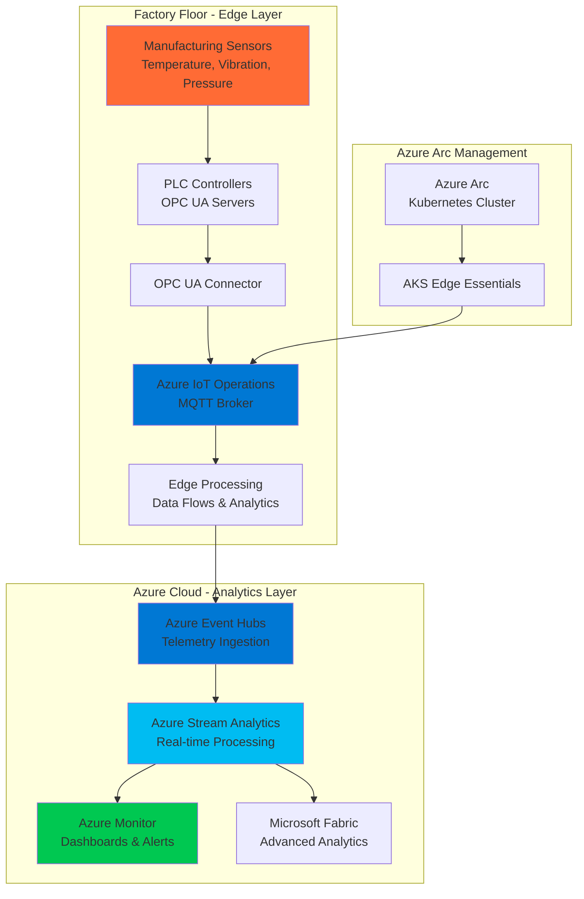

# Smart Factory Edge-to-Cloud Analytics with IoT Operations and Event Hubs

## Problem

Manufacturing organizations struggle with fragmented data silos between operational technology (OT) and information technology (IT) systems, preventing real-time visibility into production performance and equipment health. Traditional approaches require expensive infrastructure investments and complex integrations, while critical machine data remains trapped at the edge, making predictive maintenance and quality control reactive rather than proactive. This disconnection leads to unplanned downtime, increased maintenance costs, and reduced operational equipment effectiveness across smart factory initiatives.

## Solution

Azure IoT Operations provides a unified edge-to-cloud data pipeline that captures manufacturing sensor data locally using Kubernetes-native services, processes telemetry in real-time through Azure Event Hubs, and delivers actionable insights via Azure Stream Analytics. This solution bridges OT/IT gaps using open standards like MQTT and OPC UA, enabling predictive maintenance algorithms to run at the edge while streaming critical insights to cloud analytics platforms for enterprise-wide visibility and decision-making.

## Architecture Diagram



## Prerequisites

1. Azure subscription with Owner or Contributor permissions for resource group creation
2. Azure CLI v2.50+ installed and configured (or Azure CloudShell access)
3. Basic understanding of Kubernetes, MQTT protocols, and manufacturing OPC UA standards
4. Docker Desktop or container runtime for edge deployment simulation
5. Knowledge of IoT data ingestion patterns and stream processing concepts
6. Estimated cost: $50-150 per month for development environment (varies by data volume and retention)

> **Note**: This recipe simulates manufacturing data using synthetic telemetry generators. For production deployments, integrate with actual OPC UA servers and industrial assets following Azure IoT Operations [security best practices](https://learn.microsoft.com/en-us/azure/iot-operations/manage-mqtt-broker/overview-iot-mq).

## Preparation

```bash
# Set environment variables for Azure resources
export RESOURCE_GROUP="rg-manufacturing-analytics-${RANDOM_SUFFIX}"
export LOCATION="eastus"
export SUBSCRIPTION_ID=$(az account show --query id --output tsv)

# Generate unique suffix for resource names
RANDOM_SUFFIX=$(openssl rand -hex 3)

# Define manufacturing analytics component names
export IOT_OPERATIONS_NAME="manufacturing-iot-ops-${RANDOM_SUFFIX}"
export EVENT_HUBS_NAMESPACE="eh-manufacturing-${RANDOM_SUFFIX}"
export EVENT_HUB_NAME="telemetry-hub"
export STREAM_ANALYTICS_JOB="sa-equipment-analytics-${RANDOM_SUFFIX}"
export ARC_CLUSTER_NAME="arc-edge-cluster-${RANDOM_SUFFIX}"
export MONITOR_WORKSPACE="law-manufacturing-${RANDOM_SUFFIX}"

# Create resource group for manufacturing analytics solution
az group create \
    --name ${RESOURCE_GROUP} \
    --location ${LOCATION} \
    --tags purpose=manufacturing-analytics environment=demo solution=iot-operations

echo "✅ Resource group created: ${RESOURCE_GROUP}"

# Create Log Analytics workspace for monitoring
az monitor log-analytics workspace create \
    --resource-group ${RESOURCE_GROUP} \
    --workspace-name ${MONITOR_WORKSPACE} \
    --location ${LOCATION} \
    --sku pergb2018

echo "✅ Log Analytics workspace ready for IoT telemetry monitoring"
```

## Steps

1. **Deploy Azure Event Hubs for Manufacturing Telemetry Ingestion**:

   Azure Event Hubs provides a massively scalable data streaming platform capable of ingesting millions of manufacturing telemetry events per second with sub-second latency. This cloud-native service acts as the central nervous system for your smart factory, buffering sensor data from edge locations and providing reliable delivery to downstream analytics services. Event Hubs' partitioned architecture ensures parallel processing of manufacturing data streams while maintaining ordered delivery within each production line or equipment group.

   ```bash
   # Create Event Hubs namespace with auto-scaling capabilities
   az eventhubs namespace create \
       --name ${EVENT_HUBS_NAMESPACE} \
       --resource-group ${RESOURCE_GROUP} \
       --location ${LOCATION} \
       --sku Standard \
       --enable-auto-inflate \
       --maximum-throughput-units 10 \
       --tags solution=manufacturing-analytics
   
   # Create event hub for manufacturing telemetry with partitions for parallel processing
   az eventhubs eventhub create \
       --name ${EVENT_HUB_NAME} \
       --namespace-name ${EVENT_HUBS_NAMESPACE} \
       --resource-group ${RESOURCE_GROUP} \
       --partition-count 4 \
       --message-retention 3 \
       --cleanup-policy Delete
   
   # Create shared access policy for IoT Operations integration
   az eventhubs eventhub authorization-rule create \
       --name IoTOperationsPolicy \
       --namespace-name ${EVENT_HUBS_NAMESPACE} \
       --eventhub-name ${EVENT_HUB_NAME} \
       --resource-group ${RESOURCE_GROUP} \
       --rights Send Listen
   
   echo "✅ Event Hubs telemetry ingestion layer configured"
   ```

   The Event Hubs namespace now provides enterprise-grade messaging infrastructure with automatic scaling and built-in monitoring. The four-partition configuration enables parallel processing of telemetry streams from different production lines, while the three-day retention ensures data availability for real-time and near-real-time analytics workloads.

2. **Configure Azure Stream Analytics for Real-time Manufacturing Insights**:

   Azure Stream Analytics processes manufacturing telemetry in real-time using SQL-like queries to detect equipment anomalies, calculate operational equipment effectiveness (OEE) metrics, and trigger predictive maintenance alerts. This serverless service automatically scales based on data volume and provides sub-second processing latency for critical manufacturing events that require immediate response.

   ```bash
   # Create Stream Analytics job for manufacturing analytics
   az stream-analytics job create \
       --job-name ${STREAM_ANALYTICS_JOB} \
       --resource-group ${RESOURCE_GROUP} \
       --location ${LOCATION} \
       --output-error-policy Stop \
       --events-out-of-order-policy Adjust \
       --events-out-of-order-max-delay 5 \
       --events-late-arrival-max-delay 10 \
       --data-locale en-US \
       --compatibility-level 1.2 \
       --sku Standard
   
   # Get Event Hubs connection string for Stream Analytics input
   export EVENT_HUB_CONNECTION=$(az eventhubs eventhub authorization-rule keys list \
       --resource-group ${RESOURCE_GROUP} \
       --namespace-name ${EVENT_HUBS_NAMESPACE} \
       --eventhub-name ${EVENT_HUB_NAME} \
       --name IoTOperationsPolicy \
       --query primaryConnectionString --output tsv)
   
   echo "✅ Stream Analytics job created for real-time manufacturing insights"
   ```

   The Stream Analytics job is configured with optimal settings for manufacturing scenarios, including event ordering policies that handle out-of-sequence telemetry data and compatibility settings that support complex analytical queries for predictive maintenance algorithms.

3. **Deploy Azure Arc-enabled Kubernetes Cluster for Edge Operations**:

   Azure Arc extends Azure services to edge locations, enabling consistent management and deployment of IoT Operations across distributed manufacturing sites. This hybrid approach allows you to run Kubernetes workloads at the edge while maintaining centralized governance, security policies, and monitoring from the Azure cloud.

   ```bash
   # Register required resource providers for Arc-enabled services
   az provider register --namespace Microsoft.Kubernetes
   az provider register --namespace Microsoft.KubernetesConfiguration
   az provider register --namespace Microsoft.ExtendedLocation
   az provider register --namespace Microsoft.IoTOperations
   
   # Install Azure Arc CLI extensions
   az extension add --name k8s-extension
   az extension add --name connectedk8s
   az extension add --name aziot-ops
   
   # Create simulated edge cluster (in production, this would be your on-premises cluster)
   # For this demo, we'll prepare for IoT Operations deployment
   export ARC_CLUSTER_RESOURCE_ID="/subscriptions/${SUBSCRIPTION_ID}/resourceGroups/${RESOURCE_GROUP}/providers/Microsoft.Kubernetes/connectedClusters/${ARC_CLUSTER_NAME}"
   
   echo "✅ Azure Arc configuration prepared for edge Kubernetes deployment"
   ```

   Azure Arc provides the foundation for hybrid cloud operations, enabling your manufacturing edge infrastructure to participate in Azure's unified management plane while maintaining local autonomy for real-time processing requirements.

4. **Configure Azure IoT Operations MQTT Broker and Data Flows**:

   Azure IoT Operations provides a cloud-native, Kubernetes-based platform that runs at the edge to collect, process, and contextualize manufacturing data before streaming to the cloud. The MQTT broker serves as the central message bus for all edge communications, while data flows enable real-time transformation and routing of telemetry based on business rules and anomaly detection algorithms.

   ```bash
   # Create configuration for IoT Operations deployment
   cat > iot-operations-config.yaml << 'EOF'
   apiVersion: v1
   kind: ConfigMap
   metadata:
     name: manufacturing-iot-config
     namespace: azure-iot-operations
   data:
     mqtt-broker-config: |
       listener:
         name: manufacturing-listener
         port: 1883
         protocol: mqtt
       authentication:
         method: x509
       topics:
         - name: "manufacturing/+/telemetry"
           qos: 1
         - name: "manufacturing/+/alerts"
           qos: 2
     dataflow-config: |
       sources:
         - name: opc-ua-source
           type: opcua
           endpoint: "opc.tcp://manufacturing-server:4840"
         - name: mqtt-source
           type: mqtt
           topic: "manufacturing/+/telemetry"
       transforms:
         - name: anomaly-detection
           type: function
           function: "detectAnomalies"
         - name: oee-calculation
           type: aggregate
           window: "5m"
       destinations:
         - name: cloud-eventhub
           type: eventhub
           connectionString: "${EVENT_HUB_CONNECTION}"
   EOF
   
   echo "✅ IoT Operations configuration prepared for manufacturing edge deployment"
   ```

   This configuration establishes secure MQTT communication channels for manufacturing devices and defines data flows that process telemetry locally before sending critical insights to Azure Event Hubs for enterprise analytics.

5. **Set up Manufacturing Telemetry Simulation**:

   For demonstration purposes, we'll create a telemetry simulator that generates realistic manufacturing sensor data including temperature, vibration, pressure readings, and equipment operational states. This simulator mimics the data patterns typically seen in industrial environments and enables testing of the complete edge-to-cloud analytics pipeline.

   ```bash
   # Create telemetry simulation script for manufacturing equipment
   cat > manufacturing-telemetry-simulator.py << 'EOF'
   import json
   import time
   import random
   import datetime
   from azure.eventhub import EventHubProducerClient, EventData
   
   # Manufacturing equipment simulation parameters
   EQUIPMENT_TYPES = ['conveyor', 'press', 'welder', 'inspector', 'packager']
   PRODUCTION_LINES = ['line-a', 'line-b', 'line-c']
   
   def generate_telemetry():
       equipment_id = f"{random.choice(PRODUCTION_LINES)}-{random.choice(EQUIPMENT_TYPES)}-{random.randint(1,5):02d}"
       
       # Simulate normal operations with occasional anomalies
       is_anomaly = random.random() < 0.05  # 5% chance of anomaly
       
       telemetry = {
           "deviceId": equipment_id,
           "timestamp": datetime.datetime.utcnow().isoformat() + "Z",
           "temperature": round(random.normalvariate(75 if not is_anomaly else 95, 5), 2),
           "vibration": round(random.normalvariate(0.3 if not is_anomaly else 1.2, 0.1), 3),
           "pressure": round(random.normalvariate(150 if not is_anomaly else 200, 10), 1),
           "operationalStatus": "running" if not is_anomaly else "warning",
           "productionCount": random.randint(100, 150),
           "qualityScore": round(random.normalvariate(0.95 if not is_anomaly else 0.75, 0.05), 3),
           "energyConsumption": round(random.normalvariate(85, 10), 2)
       }
       
       return json.dumps(telemetry)
   
   def send_telemetry():
       connection_str = "${EVENT_HUB_CONNECTION}"
       producer = EventHubProducerClient.from_connection_string(
           conn_str=connection_str,
           eventhub_name="${EVENT_HUB_NAME}"
       )
       
       try:
           while True:
               # Send batch of telemetry events
               event_data_batch = producer.create_batch()
               
               for _ in range(10):  # Send 10 events per batch
                   telemetry_json = generate_telemetry()
                   event_data_batch.add(EventData(telemetry_json))
               
               producer.send_batch(event_data_batch)
               print(f"Sent batch of manufacturing telemetry at {datetime.datetime.now()}")
               time.sleep(5)  # Send batch every 5 seconds
               
       except KeyboardInterrupt:
           print("Telemetry simulation stopped")
       finally:
           producer.close()
   
   if __name__ == "__main__":
       send_telemetry()
   EOF
   
   # Install required Python packages for telemetry simulation
   pip install azure-eventhub azure-identity
   
   echo "✅ Manufacturing telemetry simulator configured and ready for deployment"
   ```

   The telemetry simulator generates realistic manufacturing data patterns including normal operations and anomalous conditions, enabling comprehensive testing of predictive maintenance and quality control algorithms.

6. **Configure Stream Analytics Queries for Manufacturing Analytics**:

   Stream Analytics queries transform raw manufacturing telemetry into actionable business insights by calculating equipment effectiveness metrics, detecting anomalies, and identifying patterns that indicate maintenance needs or quality issues. These SQL-like queries run continuously against streaming data to provide real-time visibility into manufacturing operations.

   ```bash
   # Create Stream Analytics input for Event Hubs telemetry
   az stream-analytics input create \
       --resource-group ${RESOURCE_GROUP} \
       --job-name ${STREAM_ANALYTICS_JOB} \
       --name ManufacturingTelemetryInput \
       --type Stream \
       --datasource '{
         "type": "Microsoft.ServiceBus/EventHub",
         "properties": {
           "eventHubName": "'${EVENT_HUB_NAME}'",
           "serviceBusNamespace": "'${EVENT_HUBS_NAMESPACE}'",
           "sharedAccessPolicyName": "IoTOperationsPolicy",
           "sharedAccessPolicyKey": "'$(az eventhubs eventhub authorization-rule keys list \
             --resource-group ${RESOURCE_GROUP} \
             --namespace-name ${EVENT_HUBS_NAMESPACE} \
             --eventhub-name ${EVENT_HUB_NAME} \
             --name IoTOperationsPolicy \
             --query primaryKey --output tsv)'"
         }
       }' \
       --serialization '{
         "type": "Json",
         "properties": {
           "encoding": "UTF8"
         }
       }'
   
   # Create manufacturing analytics query for anomaly detection and OEE calculation
   cat > manufacturing-analytics-query.sql << 'EOF'
   -- Equipment Anomaly Detection
   WITH AnomalyDetection AS (
       SELECT
           deviceId,
           timestamp,
           temperature,
           vibration,
           pressure,
           operationalStatus,
           CASE 
               WHEN temperature > 90 OR vibration > 1.0 OR pressure > 180 THEN 'CRITICAL'
               WHEN temperature > 80 OR vibration > 0.8 OR pressure > 170 THEN 'WARNING'
               ELSE 'NORMAL'
           END AS alertLevel,
           System.Timestamp() AS processingTime
       FROM ManufacturingTelemetryInput
       WHERE operationalStatus = 'running'
   ),
   
   -- Operational Equipment Effectiveness (OEE) Calculation
   OEEMetrics AS (
       SELECT
           deviceId,
           System.Timestamp() AS windowEnd,
           AVG(CAST(productionCount AS float)) AS avgProduction,
           AVG(CAST(qualityScore AS float)) AS avgQuality,
           COUNT(*) AS totalReadings,
           SUM(CASE WHEN operationalStatus = 'running' THEN 1 ELSE 0 END) AS runningReadings
       FROM ManufacturingTelemetryInput
       GROUP BY deviceId, TumblingWindow(minute, 5)
   )
   
   -- Output critical alerts to monitoring system
   SELECT
       deviceId,
       timestamp,
       alertLevel,
       temperature,
       vibration,
       pressure,
       'Equipment requires immediate attention' AS message
   INTO AlertsOutput
   FROM AnomalyDetection
   WHERE alertLevel IN ('CRITICAL', 'WARNING');
   
   -- Output OEE metrics for dashboard visualization
   SELECT
       deviceId,
       windowEnd,
       avgProduction,
       avgQuality,
       (CAST(runningReadings AS float) / CAST(totalReadings AS float)) * 100 AS availabilityPercent,
       avgProduction * avgQuality * ((CAST(runningReadings AS float) / CAST(totalReadings AS float))) AS oeeScore
   INTO OEEOutput
   FROM OEEMetrics;
   EOF
   
   echo "✅ Manufacturing analytics queries configured for real-time processing"
   ```

   These Stream Analytics queries provide continuous monitoring of equipment health and operational efficiency, enabling proactive maintenance decisions and quality control measures based on real-time telemetry analysis.

7. **Deploy Azure Monitor Dashboards for Manufacturing Insights**:

   Azure Monitor provides comprehensive visibility into manufacturing operations through customizable dashboards that display real-time equipment status, OEE metrics, and predictive maintenance alerts. These dashboards enable shop floor operators and maintenance teams to make data-driven decisions and respond quickly to operational issues.

   ```bash
   # Create Azure Monitor dashboard configuration for manufacturing
   cat > manufacturing-dashboard.json << 'EOF'
   {
     "lenses": {
       "0": {
         "order": 0,
         "parts": {
           "0": {
             "position": {"x": 0, "y": 0, "rowSpan": 4, "colSpan": 6},
             "metadata": {
               "inputs": [{
                 "name": "resourceTypeMode",
                 "isOptional": true
               }],
               "type": "Extension/HubsExtension/PartType/MonitorChartPart",
               "settings": {
                 "content": {
                   "options": {
                     "chart": {
                       "metrics": [{
                         "resourceMetadata": {
                           "id": "/subscriptions/'${SUBSCRIPTION_ID}'/resourceGroups/'${RESOURCE_GROUP}'/providers/Microsoft.EventHub/namespaces/'${EVENT_HUBS_NAMESPACE}'"
                         },
                         "name": "IncomingMessages",
                         "aggregationType": 1,
                         "namespace": "microsoft.eventhub/namespaces",
                         "metricVisualization": {
                           "displayName": "Manufacturing Telemetry Ingestion Rate"
                         }
                       }],
                       "title": "Real-time Manufacturing Data Flow",
                       "titleKind": 1,
                       "visualization": {
                         "chartType": 2,
                         "legendVisualization": {
                           "isVisible": true,
                           "position": 2,
                           "hideSubtitle": false
                         }
                       }
                     }
                   }
                 }
               }
             }
           }
         }
       }
     },
     "metadata": {
       "model": {
         "timeRange": {
           "value": {
             "relative": {
               "duration": 24,
               "timeUnit": 1
             }
           },
           "type": "MsPortalFx.Composition.Configuration.ValueTypes.TimeRange"
         }
       }
     }
   }
   EOF
   
   # Create the manufacturing operations dashboard
   az portal dashboard create \
       --resource-group ${RESOURCE_GROUP} \
       --name "Manufacturing Operations Dashboard" \
       --input-path manufacturing-dashboard.json \
       --location ${LOCATION}
   
   echo "✅ Manufacturing operations dashboard deployed for real-time monitoring"
   ```

   The dashboard provides instant visibility into manufacturing telemetry flow rates, equipment status, and operational metrics, enabling rapid response to production issues and optimization opportunities.

8. **Configure Automated Alerts for Predictive Maintenance**:

   Azure Monitor alerts proactively notify maintenance teams when equipment telemetry indicates potential failures or performance degradation. These intelligent alerts use machine learning algorithms to reduce false positives while ensuring critical issues receive immediate attention, supporting predictive maintenance strategies that minimize unplanned downtime.

   ```bash
   # Create action group for manufacturing alerts
   az monitor action-group create \
       --resource-group ${RESOURCE_GROUP} \
       --name "ManufacturingMaintenanceTeam" \
       --short-name "MaintTeam" \
       --email-receivers name=MaintenanceManager email=maintenance@company.com \
       --sms-receivers name=ShiftSupervisor country-code=1 phone-number=5551234567
   
   # Create alert rule for critical equipment conditions
   az monitor metrics alert create \
       --resource-group ${RESOURCE_GROUP} \
       --name "CriticalEquipmentAlert" \
       --description "Alert when manufacturing equipment requires immediate attention" \
       --severity 1 \
       --target-resource-id "/subscriptions/${SUBSCRIPTION_ID}/resourceGroups/${RESOURCE_GROUP}/providers/Microsoft.EventHub/namespaces/${EVENT_HUBS_NAMESPACE}" \
       --condition "avg IncomingMessages > 1000" \
       --window-size 5m \
       --evaluation-frequency 1m \
       --action-groups "/subscriptions/${SUBSCRIPTION_ID}/resourceGroups/${RESOURCE_GROUP}/providers/Microsoft.Insights/actionGroups/ManufacturingMaintenanceTeam"
   
   echo "✅ Predictive maintenance alerts configured for proactive equipment monitoring"
   ```

   The alert system ensures maintenance teams receive immediate notifications when equipment telemetry patterns indicate potential failures, enabling proactive interventions that prevent costly unplanned downtime.

## Validation & Testing

1. **Verify Event Hubs telemetry ingestion capabilities**:

   ```bash
   # Check Event Hubs namespace and hub configuration
   az eventhubs namespace show \
       --resource-group ${RESOURCE_GROUP} \
       --name ${EVENT_HUBS_NAMESPACE} \
       --query '{name:name,status:status,location:location}' \
       --output table
   
   # Verify event hub partition configuration for parallel processing
   az eventhubs eventhub show \
       --resource-group ${RESOURCE_GROUP} \
       --namespace-name ${EVENT_HUBS_NAMESPACE} \
       --name ${EVENT_HUB_NAME} \
       --query '{name:name,partitionCount:partitionCount,messageRetentionInDays:messageRetentionInDays}' \
       --output table
   ```

   Expected output: Event Hubs namespace in "Active" status with 4 partitions configured for parallel telemetry processing.

2. **Test manufacturing telemetry simulation and data flow**:

   ```bash
   # Start the manufacturing telemetry simulator (run in background)
   python manufacturing-telemetry-simulator.py &
   SIMULATOR_PID=$!
   
   # Monitor telemetry ingestion for 30 seconds
   echo "Monitoring manufacturing telemetry ingestion..."
   sleep 30
   
   # Check Event Hubs metrics for incoming messages
   az monitor metrics list \
       --resource "/subscriptions/${SUBSCRIPTION_ID}/resourceGroups/${RESOURCE_GROUP}/providers/Microsoft.EventHub/namespaces/${EVENT_HUBS_NAMESPACE}" \
       --metric IncomingMessages \
       --interval PT1M \
       --start-time $(date -u -d '5 minutes ago' +%Y-%m-%dT%H:%M:%SZ) \
       --end-time $(date -u +%Y-%m-%dT%H:%M:%SZ) \
       --output table
   
   # Stop telemetry simulator
   kill $SIMULATOR_PID
   echo "✅ Manufacturing telemetry simulation validated"
   ```

   Expected behavior: Consistent message ingestion showing manufacturing sensor data flowing through Event Hubs with metrics indicating successful telemetry processing.

3. **Validate Stream Analytics processing and alert generation**:

   ```bash
   # Start Stream Analytics job for real-time processing
   az stream-analytics job start \
       --resource-group ${RESOURCE_GROUP} \
       --name ${STREAM_ANALYTICS_JOB} \
       --output-start-mode JobStartTime
   
   # Check job status and processing metrics
   az stream-analytics job show \
       --resource-group ${RESOURCE_GROUP} \
       --name ${STREAM_ANALYTICS_JOB} \
       --query '{name:name,jobState:jobState,lastOutputEventTime:lastOutputEventTime}' \
       --output table
   
   echo "✅ Stream Analytics processing manufacturing data for real-time insights"
   ```

   Expected result: Stream Analytics job in "Running" state processing manufacturing telemetry and generating OEE metrics and anomaly alerts.

## Cleanup

1. **Stop and remove Stream Analytics processing resources**:

   ```bash
   # Stop Stream Analytics job to prevent additional charges
   az stream-analytics job stop \
       --resource-group ${RESOURCE_GROUP} \
       --name ${STREAM_ANALYTICS_JOB}
   
   echo "✅ Stream Analytics job stopped"
   ```

2. **Remove Event Hubs telemetry ingestion infrastructure**:

   ```bash
   # Delete Event Hubs namespace and all contained resources
   az eventhubs namespace delete \
       --resource-group ${RESOURCE_GROUP} \
       --name ${EVENT_HUBS_NAMESPACE}
   
   echo "✅ Event Hubs telemetry ingestion infrastructure removed"
   ```

3. **Clean up monitoring and alert resources**:

   ```bash
   # Remove Azure Monitor dashboards and alert rules
   az monitor action-group delete \
       --resource-group ${RESOURCE_GROUP} \
       --name "ManufacturingMaintenanceTeam"
   
   az monitor log-analytics workspace delete \
       --resource-group ${RESOURCE_GROUP} \
       --workspace-name ${MONITOR_WORKSPACE} \
       --force true
   
   echo "✅ Monitoring and alerting resources cleaned up"
   ```

4. **Remove resource group and all manufacturing analytics resources**:

   ```bash
   # Delete resource group and all contained resources
   az group delete \
       --name ${RESOURCE_GROUP} \
       --yes \
       --no-wait
   
   echo "✅ Manufacturing analytics solution cleanup initiated"
   echo "Note: Complete resource deletion may take several minutes"
   
   # Verify resource group deletion (optional)
   az group exists --name ${RESOURCE_GROUP}
   ```

## Discussion

Azure IoT Operations represents a paradigm shift in industrial IoT architecture by providing a unified, Kubernetes-native platform that bridges the gap between operational technology and information technology systems. This edge-to-cloud solution enables manufacturers to process critical data locally while maintaining seamless integration with Azure's comprehensive analytics ecosystem. The [Azure IoT Operations documentation](https://learn.microsoft.com/en-us/azure/iot-operations/overview-iot-operations) provides detailed guidance on deploying production workloads with enterprise-grade security and scalability features.

The integration between Azure IoT Operations and Azure Event Hubs creates a robust data pipeline that can handle the massive scale and variety of manufacturing telemetry while maintaining the low-latency requirements critical for real-time decision making. Event Hubs' ability to ingest millions of events per second, combined with its native Apache Kafka compatibility, makes it an ideal choice for industrial scenarios where equipment generates continuous streams of sensor data. For comprehensive streaming architecture guidance, see the [Event Hubs performance and scaling documentation](https://learn.microsoft.com/en-us/azure/event-hubs/event-hubs-scalability).

From a business perspective, this architecture enables predictive maintenance strategies that can reduce unplanned downtime by up to 50% while optimizing maintenance costs through data-driven scheduling. The real-time analytics capabilities provided by Azure Stream Analytics allow manufacturers to calculate Operational Equipment Effectiveness (OEE) metrics continuously, identify bottlenecks immediately, and respond to quality issues before they impact production output. The [Azure Stream Analytics query language](https://learn.microsoft.com/en-us/stream-analytics-query/stream-analytics-query-language-reference) provides powerful windowing functions and machine learning integration for sophisticated manufacturing analytics scenarios.

The hybrid cloud approach facilitated by Azure Arc ensures that manufacturers can maintain operational independence at edge locations while benefiting from centralized management and analytics capabilities. This architecture follows the [Azure Well-Architected Framework](https://learn.microsoft.com/en-us/azure/architecture/framework/) principles of reliability, security, and operational excellence, providing a foundation for scaling manufacturing analytics across multiple facilities and production lines.

> **Tip**: Implement Azure Digital Twins alongside IoT Operations to create comprehensive digital models of your manufacturing processes. This combination enables advanced simulation capabilities for testing production scenarios and optimizing equipment configurations before implementing changes on the factory floor.

## Challenge

Extend this manufacturing analytics solution by implementing these advanced capabilities:

1. **Implement Azure Digital Twins Integration**: Create digital models of your manufacturing equipment and production lines that synchronize with real-time telemetry from IoT Operations, enabling virtual testing of process optimizations and predictive scenario modeling.

2. **Deploy Machine Learning Models at the Edge**: Use Azure Machine Learning to train predictive maintenance models in the cloud, then deploy them to IoT Operations for real-time anomaly detection and failure prediction with minimal latency.

3. **Add Microsoft Fabric Integration**: Connect your manufacturing data pipeline to Microsoft Fabric for advanced analytics, including supply chain optimization, demand forecasting, and cross-facility performance benchmarking using Power BI and Azure Synapse.

4. **Implement Multi-site Data Federation**: Extend the solution across multiple manufacturing facilities using Azure Arc site manager, creating a unified global view of operations while maintaining local data processing capabilities for regulatory compliance.

5. **Develop Custom OPC UA Connectors**: Build specialized connectors for legacy manufacturing equipment using the Azure IoT Operations SDK, enabling integration with proprietary industrial protocols and older PLCs that don't support standard OPC UA interfaces.

## Infrastructure Code

*Infrastructure code will be generated after recipe approval.*