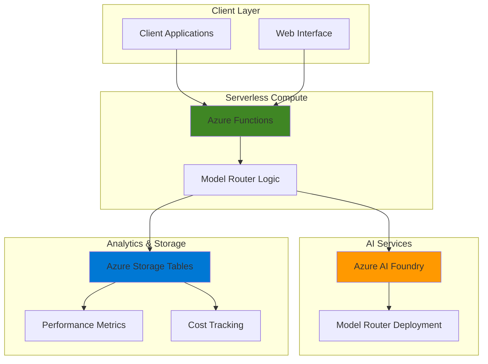

# Smart Model Selection with AI Foundry and Functions

## Problem

Organizations using AI services face escalating costs when defaulting to powerful but expensive models for all requests, regardless of complexity. A customer service platform processing thousands of daily queries might use GPT-4 for simple FAQ responses that GPT-3.5 could handle adequately, resulting in 3-4x higher costs and slower response times. Without intelligent model routing, businesses struggle to balance performance requirements with budget constraints while maintaining response quality.

## Solution

Build an intelligent model selection system using Azure AI Foundry's Model Router to automatically choose the optimal AI model for each request. Deploy this through Azure Functions for serverless scalability, with Azure Storage tracking cost metrics and performance analytics. This solution automatically routes simple queries to cost-effective models while reserving powerful models for complex tasks, reducing costs by up to 60% while maintaining response quality.

## Architecture Diagram



## Prerequisites

1. Azure subscription with Azure AI services and Functions access
2. Azure CLI installed and configured (version 2.60.0 or later)
3. Azure Functions Core Tools (version 4.x or later)
4. Basic understanding of serverless computing and AI model capabilities
5. Experience with REST APIs and HTTP triggers
6. Estimated cost: $15-25 for testing resources (can be removed after completion)

> **Note**: Model Router is currently in preview and available in East US 2 and Sweden Central regions only.

## Preparation

```bash
# Set environment variables for Azure resources
export RESOURCE_GROUP="rg-smart-model-${RANDOM_SUFFIX}"
export LOCATION="eastus2"
export SUBSCRIPTION_ID=$(az account show --query id --output tsv)

# Generate unique suffix for resource names
RANDOM_SUFFIX=$(openssl rand -hex 3)

# Set resource names with unique suffix
export AI_FOUNDRY_NAME="aifoundry${RANDOM_SUFFIX}"
export FUNCTION_APP_NAME="func-smart-model-${RANDOM_SUFFIX}"
export STORAGE_ACCOUNT_NAME="smartmodel${RANDOM_SUFFIX}"
export APP_INSIGHTS_NAME="insights-smart-model-${RANDOM_SUFFIX}"

# Create resource group
az group create \
    --name ${RESOURCE_GROUP} \
    --location ${LOCATION} \
    --tags purpose=recipe environment=demo

echo "✅ Resource group created: ${RESOURCE_GROUP}"
```

## Steps

1. **Create Azure AI Services Resource**:

   Azure AI services provide a unified platform for deploying and managing multiple AI models through a single endpoint. The Model Router feature intelligently selects the optimal model for each request by evaluating factors like query complexity, cost, and performance requirements. This eliminates the need for manual model selection and complex routing logic in your applications.

   ```bash
   # Create AI services resource with custom domain
   az cognitiveservices account create \
       --name ${AI_FOUNDRY_NAME} \
       --resource-group ${RESOURCE_GROUP} \
       --location ${LOCATION} \
       --kind "AIServices" \
       --sku "S0" \
       --custom-domain ${AI_FOUNDRY_NAME} \
       --tags purpose=smart-model-selection

   # Get the endpoint and key for later use
   AI_FOUNDRY_ENDPOINT=$(az cognitiveservices account show \
       --name ${AI_FOUNDRY_NAME} \
       --resource-group ${RESOURCE_GROUP} \
       --query "properties.endpoint" \
       --output tsv)

   AI_FOUNDRY_KEY=$(az cognitiveservices account keys list \
       --name ${AI_FOUNDRY_NAME} \
       --resource-group ${RESOURCE_GROUP} \
       --query "key1" \
       --output tsv)

   echo "✅ AI services resource created with endpoint: ${AI_FOUNDRY_ENDPOINT}"
   ```

   The Azure AI services resource now provides access to multiple AI models through a single API endpoint. The custom domain enables advanced features like private networking and enables the Model Router deployment in the next step.

2. **Deploy Model Router**:

   The Model Router deployment consolidates multiple underlying models (GPT-4.1, GPT-4.1-mini, GPT-4.1-nano, and o4-mini) into a single deployment. This intelligent routing layer automatically selects the most appropriate model based on prompt complexity, cost considerations, and performance requirements, providing optimal resource utilization without manual intervention.

   ```bash
   # Create Model Router deployment
   az cognitiveservices account deployment create \
       --name ${AI_FOUNDRY_NAME} \
       --resource-group ${RESOURCE_GROUP} \
       --deployment-name "model-router" \
       --model-name "model-router" \
       --model-version "2025-05-19" \
       --sku-capacity 10 \
       --sku-name "GlobalStandard"

   # Wait for deployment to complete
   echo "Waiting for Model Router deployment to complete..."
   sleep 30

   # Verify deployment status
   DEPLOYMENT_STATUS=$(az cognitiveservices account deployment show \
       --name ${AI_FOUNDRY_NAME} \
       --resource-group ${RESOURCE_GROUP} \
       --deployment-name "model-router" \
       --query "properties.provisioningState" \
       --output tsv)

   echo "✅ Model Router deployed with status: ${DEPLOYMENT_STATUS}"
   ```

   The Model Router is now deployed and ready to intelligently route requests to the optimal underlying model. The GlobalStandard SKU provides dedicated capacity with predictable performance and throughput for production workloads.

3. **Create Storage Account for Analytics**:

   Azure Storage Tables provide a cost-effective solution for storing performance metrics and cost tracking data. This NoSQL storage service offers fast queries and scalable storage for analyzing model selection patterns, response times, and cost optimization metrics over time.

   ```bash
   # Create storage account for analytics
   az storage account create \
       --name ${STORAGE_ACCOUNT_NAME} \
       --resource-group ${RESOURCE_GROUP} \
       --location ${LOCATION} \
       --sku Standard_LRS \
       --kind StorageV2 \
       --tags purpose=analytics environment=demo

   # Get storage connection string
   STORAGE_CONNECTION_STRING=$(az storage account show-connection-string \
       --name ${STORAGE_ACCOUNT_NAME} \
       --resource-group ${RESOURCE_GROUP} \
       --query "connectionString" \
       --output tsv)

   # Create tables for metrics and cost tracking
   az storage table create \
       --name "modelmetrics" \
       --connection-string "${STORAGE_CONNECTION_STRING}"

   az storage table create \
       --name "costtracking" \
       --connection-string "${STORAGE_CONNECTION_STRING}"

   echo "✅ Storage account and tables created for analytics"
   ```

   The storage account now provides two dedicated tables for comprehensive analytics. The modelmetrics table tracks performance data while costtracking table stores cost analysis data, enabling detailed insights into model selection efficiency.

4. **Create Application Insights**:

   Application Insights provides comprehensive monitoring and diagnostics for Azure Functions, including request tracing, performance metrics, and dependency tracking. This enables detailed analysis of model selection decisions, response times, and system performance patterns.

   ```bash
   # Create Application Insights
   az monitor app-insights component create \
       --app ${APP_INSIGHTS_NAME} \
       --location ${LOCATION} \
       --resource-group ${RESOURCE_GROUP} \
       --tags purpose=monitoring

   # Get instrumentation key
   APPINSIGHTS_KEY=$(az monitor app-insights component show \
       --app ${APP_INSIGHTS_NAME} \
       --resource-group ${RESOURCE_GROUP} \
       --query "instrumentationKey" \
       --output tsv)

   echo "✅ Application Insights created with key: ${APPINSIGHTS_KEY}"
   ```

   Application Insights is now configured to provide comprehensive telemetry for the Function App, including custom metrics for model selection patterns and cost tracking analytics.

5. **Create Azure Function App**:

   Azure Functions provides serverless compute that automatically scales based on demand, making it ideal for handling variable AI workloads. The consumption plan ensures you only pay for actual execution time, while the runtime automatically manages scaling, load balancing, and fault tolerance for your model selection service.

   ```bash
   # Create Function App
   az functionapp create \
       --name ${FUNCTION_APP_NAME} \
       --resource-group ${RESOURCE_GROUP} \
       --storage-account ${STORAGE_ACCOUNT_NAME} \
       --consumption-plan-location ${LOCATION} \
       --runtime python \
       --runtime-version 3.11 \
       --functions-version 4 \
       --app-insights ${APP_INSIGHTS_NAME} \
       --tags purpose=ai-routing

   # Configure application settings
   az functionapp config appsettings set \
       --name ${FUNCTION_APP_NAME} \
       --resource-group ${RESOURCE_GROUP} \
       --settings \
           "AI_FOUNDRY_ENDPOINT=${AI_FOUNDRY_ENDPOINT}" \
           "AI_FOUNDRY_KEY=${AI_FOUNDRY_KEY}" \
           "STORAGE_CONNECTION_STRING=${STORAGE_CONNECTION_STRING}" \
           "APPINSIGHTS_INSTRUMENTATIONKEY=${APPINSIGHTS_KEY}"

   echo "✅ Function App created and configured"
   ```

   The Function App is now created with Python 3.11 runtime and configured with all necessary connection strings. The consumption plan provides automatic scaling while maintaining cost efficiency for variable AI workloads.

6. **Deploy Function Code**:

   The smart model selection function acts as an intelligent proxy between clients and Azure AI Foundry. It preprocesses requests to determine complexity characteristics, calls the Model Router for optimal model selection, and logs performance metrics for continuous optimization analysis.

   ```bash
   # Create function directory structure
   mkdir -p smart-model-function
   cd smart-model-function

   # Create requirements.txt
   cat > requirements.txt << 'EOF'
   azure-functions
   azure-data-tables>=12.4.0
   openai>=1.0.0
   requests>=2.28.0
   EOF

   # Create function.json
   mkdir -p ModelSelection
   cat > ModelSelection/function.json << 'EOF'
   {
     "scriptFile": "__init__.py",
     "bindings": [
       {
         "authLevel": "function",
         "type": "httpTrigger",
         "direction": "in",
         "name": "req",
         "methods": ["post"]
       },
       {
         "type": "http",
         "direction": "out",
         "name": "$return"
       }
     ]
   }
   EOF

   # Create the main function code
   cat > ModelSelection/__init__.py << 'EOF'
   import azure.functions as func
   import json
   import logging
   import os
   import time
   from datetime import datetime
   from azure.data.tables import TableServiceClient
   from openai import AzureOpenAI

   def main(req: func.HttpRequest) -> func.HttpResponse:
       logging.info('Smart Model Selection function processed a request.')
       
       try:
           # Get request data
           req_body = req.get_json()
           user_message = req_body.get('message', '')
           user_id = req_body.get('user_id', 'anonymous')
           
           # Initialize Azure OpenAI client
           client = AzureOpenAI(
               azure_endpoint=os.environ['AI_FOUNDRY_ENDPOINT'],
               api_key=os.environ['AI_FOUNDRY_KEY'],
               api_version="2024-10-01-preview"
           )
           
           # Record start time for performance tracking
           start_time = time.time()
           
           # Call Model Router
           response = client.chat.completions.create(
               model="model-router",
               messages=[
                   {"role": "user", "content": user_message}
               ],
               max_tokens=500,
               temperature=0.7
           )
           
           # Calculate response time
           response_time = time.time() - start_time
           
           # Extract selected model from response
           selected_model = response.model
           response_content = response.choices[0].message.content
           
           # Log metrics to Azure Table Storage
           log_metrics(user_id, user_message, selected_model, response_time, response_content)
           
           return func.HttpResponse(
               json.dumps({
                   "response": response_content,
                   "selected_model": selected_model,
                   "response_time": response_time,
                   "user_id": user_id
               }),
               status_code=200,
               headers={"Content-Type": "application/json"}
           )
           
       except Exception as e:
           logging.error(f"Error processing request: {str(e)}")
           return func.HttpResponse(
               json.dumps({"error": str(e)}),
               status_code=500,
               headers={"Content-Type": "application/json"}
           )

   def log_metrics(user_id, message, selected_model, response_time, response_content):
       try:
           # Initialize Table Service Client
           table_service = TableServiceClient.from_connection_string(
               os.environ['STORAGE_CONNECTION_STRING']
           )
           
           # Log to model metrics table
           metrics_table = table_service.get_table_client("modelmetrics")
           metrics_entity = {
               "PartitionKey": datetime.now().strftime("%Y%m%d"),
               "RowKey": f"{int(time.time() * 1000)}_{user_id}",
               "UserId": user_id,
               "MessageLength": len(message),
               "SelectedModel": selected_model,
               "ResponseTime": response_time,
               "ResponseLength": len(response_content),
               "Timestamp": datetime.now()
           }
           metrics_table.create_entity(metrics_entity)
           
           # Log to cost tracking table (estimated costs based on model)
           cost_table = table_service.get_table_client("costtracking")
           estimated_cost = calculate_estimated_cost(selected_model, len(message), len(response_content))
           cost_entity = {
               "PartitionKey": datetime.now().strftime("%Y%m%d"),
               "RowKey": f"{int(time.time() * 1000)}_{user_id}_cost",
               "UserId": user_id,
               "SelectedModel": selected_model,
               "EstimatedCost": estimated_cost,
               "InputTokens": len(message) // 4,  # Rough token estimate
               "OutputTokens": len(response_content) // 4,
               "Timestamp": datetime.now()
           }
           cost_table.create_entity(cost_entity)
           
       except Exception as e:
           logging.error(f"Error logging metrics: {str(e)}")

   def calculate_estimated_cost(model, input_length, output_length):
       # Estimated costs per 1K tokens (simplified)
       cost_map = {
           "gpt-4.1": {"input": 0.03, "output": 0.06},
           "gpt-4.1-mini": {"input": 0.015, "output": 0.03},
           "gpt-4.1-nano": {"input": 0.0075, "output": 0.015},
           "o4-mini": {"input": 0.015, "output": 0.06}
       }
       
       # Default to mid-tier pricing if model not found
       pricing = cost_map.get(model, cost_map["gpt-4.1-mini"])
       
       input_tokens = input_length // 4
       output_tokens = output_length // 4
       
       return (input_tokens * pricing["input"] / 1000) + (output_tokens * pricing["output"] / 1000)
   EOF

   # Deploy the function using Azure Functions Core Tools
   func azure functionapp publish ${FUNCTION_APP_NAME}

   cd ..
   echo "✅ Function code deployed successfully"
   ```

   The function deployment includes the model selection logic, performance tracking, and cost analytics. The updated OpenAI client uses the latest API version for optimal compatibility with Azure AI Foundry's Model Router.

7. **Create Analytics Dashboard Function**:

   The analytics dashboard provides real-time visibility into model selection patterns, cost trends, and performance metrics. This HTTP-triggered function queries stored analytics data to generate insights about model usage efficiency, cost optimization opportunities, and system performance trends.

   ```bash
   # Create analytics function directory
   cd smart-model-function
   mkdir -p AnalyticsDashboard
   cat > AnalyticsDashboard/function.json << 'EOF'
   {
     "scriptFile": "__init__.py",
     "bindings": [
       {
         "authLevel": "function",
         "type": "httpTrigger",
         "direction": "in",
         "name": "req",
         "methods": ["get"]
       },
       {
         "type": "http",
         "direction": "out",
         "name": "$return"
       }
     ]
   }
   EOF

   cat > AnalyticsDashboard/__init__.py << 'EOF'
   import azure.functions as func
   import json
   import logging
   import os
   from datetime import datetime, timedelta
   from azure.data.tables import TableServiceClient
   from collections import defaultdict

   def main(req: func.HttpRequest) -> func.HttpResponse:
       logging.info('Analytics Dashboard function processed a request.')
       
       try:
           # Get query parameters
           days = int(req.params.get('days', '7'))
           
           # Initialize Table Service Client
           table_service = TableServiceClient.from_connection_string(
               os.environ['STORAGE_CONNECTION_STRING']
           )
           
           # Generate analytics
           analytics = generate_analytics(table_service, days)
           
           return func.HttpResponse(
               json.dumps(analytics, indent=2, default=str),
               status_code=200,
               headers={"Content-Type": "application/json"}
           )
           
       except Exception as e:
           logging.error(f"Error generating analytics: {str(e)}")
           return func.HttpResponse(
               json.dumps({"error": str(e)}),
               status_code=500,
               headers={"Content-Type": "application/json"}
           )

   def generate_analytics(table_service, days):
       # Query metrics from the last N days
       start_date = datetime.now() - timedelta(days=days)
       
       metrics_table = table_service.get_table_client("modelmetrics")
       cost_table = table_service.get_table_client("costtracking")
       
       # Get metrics data
       metrics_filter = f"Timestamp ge datetime'{start_date.isoformat()}'"
       metrics_entities = list(metrics_table.query_entities(filter=metrics_filter))
       
       # Get cost data
       cost_entities = list(cost_table.query_entities(filter=metrics_filter))
       
       # Generate analytics
       model_usage = defaultdict(int)
       response_times = defaultdict(list)
       total_cost = 0
       total_requests = len(metrics_entities)
       
       for entity in metrics_entities:
           model = entity.get('SelectedModel', 'unknown')
           model_usage[model] += 1
           response_times[model].append(entity.get('ResponseTime', 0))
       
       for entity in cost_entities:
           total_cost += entity.get('EstimatedCost', 0)
       
       # Calculate average response times
       avg_response_times = {}
       for model, times in response_times.items():
           avg_response_times[model] = sum(times) / len(times) if times else 0
       
       return {
           "period_days": days,
           "total_requests": total_requests,
           "total_estimated_cost": round(total_cost, 4),
           "average_cost_per_request": round(total_cost / total_requests, 6) if total_requests > 0 else 0,
           "model_usage_distribution": dict(model_usage),
           "average_response_times": avg_response_times,
           "cost_savings_estimate": calculate_cost_savings(model_usage, cost_entities)
       }

   def calculate_cost_savings(model_usage, cost_entities):
       # Calculate potential savings vs using only GPT-4.1
       gpt4_cost_per_request = 0.003  # Estimate
       actual_cost = sum(entity.get('EstimatedCost', 0) for entity in cost_entities)
       total_requests = sum(model_usage.values())
       
       if total_requests == 0:
           return 0
           
       hypothetical_gpt4_cost = total_requests * gpt4_cost_per_request
       savings = hypothetical_gpt4_cost - actual_cost
       savings_percentage = (savings / hypothetical_gpt4_cost) * 100 if hypothetical_gpt4_cost > 0 else 0
       
       return {
           "estimated_savings": round(savings, 4),
           "savings_percentage": round(savings_percentage, 2)
       }
   EOF

   # Redeploy the function app with analytics dashboard
   func azure functionapp publish ${FUNCTION_APP_NAME}

   cd ..
   echo "✅ Analytics dashboard function created and deployed"
   ```

   The analytics dashboard is now deployed alongside the main function, providing comprehensive insights into model usage patterns, cost optimization, and performance trends across the specified time period.

8. **Test the Model Selection System**:

   Comprehensive testing validates that the Model Router correctly selects appropriate models for different query complexities while maintaining response quality. This step verifies the integration between Azure Functions, AI Foundry, and Storage analytics.

   ```bash
   # Get function URLs and keys
   FUNCTION_URL=$(az functionapp function show \
       --name ${FUNCTION_APP_NAME} \
       --resource-group ${RESOURCE_GROUP} \
       --function-name "ModelSelection" \
       --query "invokeUrlTemplate" \
       --output tsv)

   FUNCTION_KEY=$(az functionapp keys list \
       --name ${FUNCTION_APP_NAME} \
       --resource-group ${RESOURCE_GROUP} \
       --query "functionKeys.default" \
       --output tsv)

   # Test with simple query
   echo "Testing with simple query..."
   curl -X POST "${FUNCTION_URL}?code=${FUNCTION_KEY}" \
       -H "Content-Type: application/json" \
       -d '{
           "message": "What is the capital of France?",
           "user_id": "test_user_1"
       }'

   echo ""
   echo "✅ Simple query test completed"

   # Test with complex query
   echo "Testing with complex query..."
   curl -X POST "${FUNCTION_URL}?code=${FUNCTION_KEY}" \
       -H "Content-Type: application/json" \
       -d '{
           "message": "Analyze the philosophical implications of artificial intelligence on human consciousness and provide a detailed ethical framework for AI development.",
           "user_id": "test_user_2"
       }'

   echo ""
   echo "✅ Complex query test completed"
   ```

   The testing demonstrates how the Model Router intelligently selects different underlying models based on query complexity, automatically optimizing for both cost and performance without manual intervention.

## Validation & Testing

1. **Verify Model Router Deployment**:

   ```bash
   # Check Model Router deployment status
   az cognitiveservices account deployment show \
       --name ${AI_FOUNDRY_NAME} \
       --resource-group ${RESOURCE_GROUP} \
       --deployment-name "model-router" \
       --output table
   ```

   Expected output: Deployment status should show "Succeeded" and ProvisioningState should be "Succeeded"

2. **Test Function App Connectivity**:

   ```bash
   # Check function app status
   az functionapp show \
       --name ${FUNCTION_APP_NAME} \
       --resource-group ${RESOURCE_GROUP} \
       --query "state" \
       --output tsv
   ```

   Expected output: "Running"

3. **Validate Analytics Data**:

   ```bash
   # Get analytics dashboard URL
   ANALYTICS_URL=$(az functionapp function show \
       --name ${FUNCTION_APP_NAME} \
       --resource-group ${RESOURCE_GROUP} \
       --function-name "AnalyticsDashboard" \
       --query "invokeUrlTemplate" \
       --output tsv)

   # View analytics (wait a few minutes after testing for data to appear)
   echo "Retrieving analytics data..."
   curl "${ANALYTICS_URL}?code=${FUNCTION_KEY}&days=1"
   ```

   Expected output: JSON with usage metrics, cost tracking, and model selection data

4. **Performance Testing**:

   ```bash
   # Run multiple test requests to generate analytics data
   echo "Running performance tests..."
   for i in {1..5}; do
       curl -X POST "${FUNCTION_URL}?code=${FUNCTION_KEY}" \
           -H "Content-Type: application/json" \
           -d "{
               \"message\": \"Test query number $i - What is Azure Functions?\",
               \"user_id\": \"performance_test_$i\"
           }"
       sleep 2
   done

   echo "✅ Performance testing completed"
   ```

5. **Verify Storage Tables**:

   ```bash
   # Check that storage tables contain data
   az storage entity query \
       --table-name "modelmetrics" \
       --connection-string "${STORAGE_CONNECTION_STRING}" \
       --select "PartitionKey,UserId,SelectedModel" \
       --top 5
   ```

   Expected output: Table entities showing model selection metrics

## Cleanup

1. **Remove Function App and related resources**:

   ```bash
   # Delete Function App
   az functionapp delete \
       --name ${FUNCTION_APP_NAME} \
       --resource-group ${RESOURCE_GROUP}
   
   echo "✅ Function App deleted"
   ```

2. **Remove AI Services resource**:

   ```bash
   # Delete AI services resource
   az cognitiveservices account delete \
       --name ${AI_FOUNDRY_NAME} \
       --resource-group ${RESOURCE_GROUP}
   
   echo "✅ AI services resource deleted"
   ```

3. **Remove Storage and monitoring resources**:

   ```bash
   # Delete Storage Account
   az storage account delete \
       --name ${STORAGE_ACCOUNT_NAME} \
       --resource-group ${RESOURCE_GROUP} \
       --yes
   
   # Delete Application Insights
   az monitor app-insights component delete \
       --app ${APP_INSIGHTS_NAME} \
       --resource-group ${RESOURCE_GROUP}
   
   echo "✅ Storage and monitoring resources deleted"
   ```

4. **Remove Resource Group**:

   ```bash
   # Delete entire resource group
   az group delete \
       --name ${RESOURCE_GROUP} \
       --yes \
       --no-wait
   
   echo "✅ Resource group deletion initiated"
   echo "Note: Complete deletion may take several minutes"
   ```

## Discussion

The smart model selection system demonstrates how Azure AI Foundry's Model Router can dramatically reduce AI operational costs while maintaining response quality. The Model Router intelligently evaluates each request's complexity, cost implications, and performance requirements to select the most appropriate model from its underlying collection (GPT-4.1, GPT-4.1-mini, GPT-4.1-nano, and o4-mini). This automated selection process eliminates the need for manual routing logic and ensures optimal resource utilization.

Azure Functions provides the ideal serverless compute platform for this solution, offering automatic scaling, built-in monitoring, and pay-per-execution pricing that aligns with variable AI workloads. The consumption plan ensures you only pay for actual request processing time, while Application Insights provides detailed telemetry for performance optimization and troubleshooting. The integration with Azure Storage Tables enables comprehensive cost tracking and performance analytics without requiring complex database infrastructure.

The analytics component provides crucial visibility into model selection patterns and cost optimization opportunities. By tracking which models are selected for different query types, organizations can identify trends, validate cost savings, and make data-driven decisions about their AI infrastructure. The estimated 60% cost reduction comes from automatically routing simple queries to more cost-effective models while reserving powerful models for complex reasoning tasks.

This architecture follows Azure Well-Architected Framework principles by implementing proper monitoring, cost optimization, and security practices. The solution scales automatically based on demand, provides detailed observability, and maintains security through Azure's managed services and secure communication protocols. For production deployments, consider implementing additional features like request throttling, caching, and multi-region deployment for enhanced reliability.

> **Tip**: Monitor your model selection patterns through the analytics dashboard to identify opportunities for further cost optimization and performance tuning based on your specific usage patterns.

**Sources:**
- [Azure AI Foundry Model Router Documentation](https://learn.microsoft.com/en-us/azure/ai-foundry/openai/concepts/model-router)
- [Azure Functions HTTP Triggers Guide](https://learn.microsoft.com/en-us/azure/azure-functions/functions-bindings-http-webhook-trigger)
- [Azure Storage Tables Monitoring](https://learn.microsoft.com/en-us/azure/storage/tables/monitor-table-storage)
- [Azure Functions Cost Optimization](https://learn.microsoft.com/en-us/azure/azure-functions/functions-consumption-costs)
- [Azure AI Foundry Models Overview](https://learn.microsoft.com/en-us/azure/ai-foundry/foundry-models/concepts/models)

## Challenge

Extend this solution by implementing these enhancements:

1. **Advanced Routing Logic**: Implement custom routing rules based on user roles, request patterns, or business priorities to override Model Router decisions when needed.

2. **Real-time Cost Alerts**: Create Azure Monitor alerts that trigger when daily AI costs exceed predefined thresholds, with automatic notifications to operations teams.

3. **A/B Testing Framework**: Build a system to test different models against the same queries to validate quality differences and fine-tune routing decisions.

4. **Multi-tenant Support**: Extend the solution to support multiple tenants with separate cost tracking, usage analytics, and routing policies per organization.

5. **Predictive Scaling**: Implement machine learning models that predict AI usage patterns and pre-warm Function App instances during peak periods to reduce cold start latency.

## Infrastructure Code

*Infrastructure code will be generated after recipe approval.*