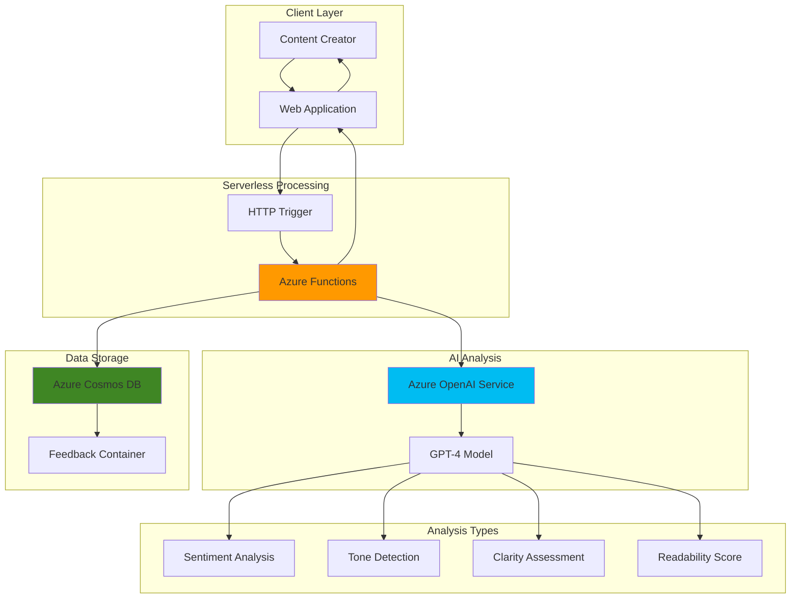

# Smart Writing Feedback System with OpenAI and Cosmos

## Problem

Content creators, technical writers, and business professionals struggle to maintain consistent writing quality across their documents, lacking real-time feedback on tone, clarity, readability, and sentiment. Traditional grammar checkers provide surface-level corrections but fail to analyze deeper aspects like audience appropriateness, emotional tone, or writing improvement patterns over time. This results in inconsistent communication quality, missed opportunities for audience engagement, and difficulty tracking writing skill development across projects and team members.

## Solution

Build an intelligent writing assistant using Azure OpenAI Service to analyze content for tone, clarity, readability, and sentiment, with Azure Cosmos DB storing detailed feedback and improvement tracking data, and Azure Functions orchestrating the serverless processing workflow. This solution provides comprehensive writing analysis that goes beyond basic grammar checking, delivering actionable insights while maintaining a historical record of writing patterns to enable data-driven improvement strategies.

## Architecture Diagram



## Prerequisites

1. Azure subscription with appropriate permissions to create OpenAI, Cosmos DB, and Functions resources
2. Azure CLI installed and configured (version 2.51.0 or later)
3. Basic understanding of serverless architecture and REST APIs
4. Knowledge of JSON data structures and NoSQL database concepts
5. Estimated cost: $15-25 per month for development/testing workloads

> **Note**: This configuration follows Azure Well-Architected Framework principles for serverless applications. Review the [Azure Architecture Center](https://docs.microsoft.com/en-us/azure/architecture/) for additional serverless patterns.

## Preparation

```bash
# Set environment variables for Azure resources
export RESOURCE_GROUP="rg-writing-feedback-${RANDOM_SUFFIX}"
export LOCATION="eastus"
export SUBSCRIPTION_ID=$(az account show --query id --output tsv)

# Generate unique suffix for resource names
RANDOM_SUFFIX=$(openssl rand -hex 3)

# Set resource names with unique suffix
export OPENAI_ACCOUNT="openai-writing-${RANDOM_SUFFIX}"
export COSMOS_ACCOUNT="cosmos-writing-${RANDOM_SUFFIX}"
export FUNCTION_APP="func-writing-${RANDOM_SUFFIX}"
export STORAGE_ACCOUNT="stwriting${RANDOM_SUFFIX}"

# Create resource group
az group create \
    --name ${RESOURCE_GROUP} \
    --location ${LOCATION} \
    --tags purpose=writing-feedback environment=demo

echo "✅ Resource group created: ${RESOURCE_GROUP}"
```

## Steps

1. **Create Azure OpenAI Service for intelligent text analysis**:

   Azure OpenAI Service provides enterprise-grade access to advanced language models with built-in responsible AI features and comprehensive security controls. The GPT-4 model excels at understanding context, tone, and sentiment in written content, making it ideal for comprehensive writing analysis that goes beyond traditional grammar checking.

   ```bash
   # Create Azure OpenAI service
   az cognitiveservices account create \
       --name ${OPENAI_ACCOUNT} \
       --resource-group ${RESOURCE_GROUP} \
       --location ${LOCATION} \
       --kind OpenAI \
       --sku S0 \
       --tags purpose=writing-analysis
   
   # Get the OpenAI endpoint and key
   export OPENAI_ENDPOINT=$(az cognitiveservices account show \
       --name ${OPENAI_ACCOUNT} \
       --resource-group ${RESOURCE_GROUP} \
       --query "properties.endpoint" --output tsv)
   
   export OPENAI_KEY=$(az cognitiveservices account keys list \
       --name ${OPENAI_ACCOUNT} \
       --resource-group ${RESOURCE_GROUP} \
       --query "key1" --output tsv)
   
   echo "✅ Azure OpenAI Service created: ${OPENAI_ACCOUNT}"
   ```

   The OpenAI service is now configured with enterprise security features and ready for model deployment. This foundation enables sophisticated natural language processing capabilities while maintaining data privacy and compliance requirements.

2. **Deploy GPT-4 model for advanced text analysis**:

   GPT-4 provides superior performance for complex text analysis tasks, including nuanced sentiment detection, tone assessment, and clarity evaluation. The model deployment process ensures dedicated capacity and consistent performance for your writing feedback system.

   ```bash
   # Deploy GPT-4 model for text analysis
   az cognitiveservices account deployment create \
       --name ${OPENAI_ACCOUNT} \
       --resource-group ${RESOURCE_GROUP} \
       --deployment-name gpt-4-writing-analysis \
       --model-name gpt-4o \
       --model-version "2024-11-20" \
       --model-format OpenAI \
       --sku-capacity 10 \
       --sku-name Standard
   
   # Wait for deployment completion
   echo "Waiting for GPT-4 model deployment..."
   sleep 30
   
   echo "✅ GPT-4 model deployed for writing analysis"
   ```

   The deployed GPT-4 model now provides dedicated processing capacity optimized for writing analysis tasks, ensuring consistent response times and reliable performance for your feedback system.

3. **Create Azure Cosmos DB for feedback data persistence**:

   Azure Cosmos DB provides globally-distributed, multi-model database capabilities with guaranteed low latency and automatic scaling. The NoSQL API is perfect for storing flexible feedback documents with varying structures, enabling efficient queries and analytics on writing patterns over time.

   ```bash
   # Create Cosmos DB account with NoSQL API
   az cosmosdb create \
       --name ${COSMOS_ACCOUNT} \
       --resource-group ${RESOURCE_GROUP} \
       --locations regionName=${LOCATION} \
       --default-consistency-level Session \
       --enable-automatic-failover false \
       --tags purpose=feedback-storage
   
   # Get Cosmos DB connection details
   export COSMOS_ENDPOINT=$(az cosmosdb show \
       --name ${COSMOS_ACCOUNT} \
       --resource-group ${RESOURCE_GROUP} \
       --query "documentEndpoint" --output tsv)
   
   export COSMOS_KEY=$(az cosmosdb keys list \
       --name ${COSMOS_ACCOUNT} \
       --resource-group ${RESOURCE_GROUP} \
       --query "primaryMasterKey" --output tsv)
   
   echo "✅ Cosmos DB account created: ${COSMOS_ACCOUNT}"
   ```

   Cosmos DB is now configured with session consistency for optimal read-write performance and cost efficiency, providing the scalable foundation for storing comprehensive writing feedback data.

4. **Configure Cosmos DB database and container for feedback storage**:

   Proper partition key design is crucial for Cosmos DB performance and cost optimization. Using userId as the partition key ensures even data distribution while enabling efficient queries for user-specific feedback history and writing improvement tracking.

   ```bash
   # Create database for writing feedback
   az cosmosdb sql database create \
       --account-name ${COSMOS_ACCOUNT} \
       --resource-group ${RESOURCE_GROUP} \
       --name WritingFeedbackDB \
       --throughput 400
   
   # Create container for feedback documents
   az cosmosdb sql container create \
       --account-name ${COSMOS_ACCOUNT} \
       --resource-group ${RESOURCE_GROUP} \
       --database-name WritingFeedbackDB \
       --name FeedbackContainer \
       --partition-key-path "/userId" \
       --throughput 400
   
   echo "✅ Cosmos DB database and container configured"
   ```

   The database structure now supports efficient feedback storage with optimal partitioning for user-centric queries, enabling fast retrieval of historical writing patterns and improvement metrics.

5. **Create Azure Storage Account for Functions runtime**:

   Azure Functions requires a storage account for runtime operations, including function code storage, trigger management, and logging. The storage account also enables advanced features like durable functions and provides reliable message queuing capabilities.

   ```bash
   # Create storage account for Functions
   az storage account create \
       --name ${STORAGE_ACCOUNT} \
       --resource-group ${RESOURCE_GROUP} \
       --location ${LOCATION} \
       --sku Standard_LRS \
       --kind StorageV2 \
       --tags purpose=functions-runtime
   
   # Get storage connection string
   export STORAGE_CONNECTION=$(az storage account show-connection-string \
       --name ${STORAGE_ACCOUNT} \
       --resource-group ${RESOURCE_GROUP} \
       --query "connectionString" --output tsv)
   
   echo "✅ Storage account created for Functions: ${STORAGE_ACCOUNT}"
   ```

   The storage account provides the necessary infrastructure for serverless function execution with reliable performance and cost-effective scaling based on actual usage patterns.

6. **Create Azure Functions App for serverless orchestration**:

   Azure Functions provides event-driven serverless compute with automatic scaling and pay-per-execution pricing. The consumption plan offers optimal cost efficiency for writing feedback workloads with variable usage patterns while maintaining responsive performance.

   ```bash
   # Create Function App with consumption plan
   az functionapp create \
       --name ${FUNCTION_APP} \
       --resource-group ${RESOURCE_GROUP} \
       --storage-account ${STORAGE_ACCOUNT} \
       --consumption-plan-location ${LOCATION} \
       --runtime node \
       --runtime-version 20 \
       --functions-version 4 \
       --tags purpose=writing-feedback-api
   
   echo "✅ Function App created: ${FUNCTION_APP}"
   ```

   The serverless function app is now ready to host the writing analysis API with automatic scaling capabilities and integrated monitoring through Azure Application Insights.

7. **Configure Function App settings with service connections**:

   Application settings provide secure configuration management for sensitive connection strings and API keys. These settings are encrypted at rest and injected as environment variables during function execution, following security best practices for serverless applications.

   ```bash
   # Configure application settings for integrations
   az functionapp config appsettings set \
       --name ${FUNCTION_APP} \
       --resource-group ${RESOURCE_GROUP} \
       --settings \
       "OPENAI_ENDPOINT=${OPENAI_ENDPOINT}" \
       "OPENAI_KEY=${OPENAI_KEY}" \
       "COSMOS_ENDPOINT=${COSMOS_ENDPOINT}" \
       "COSMOS_KEY=${COSMOS_KEY}" \
       "COSMOS_DATABASE=WritingFeedbackDB" \
       "COSMOS_CONTAINER=FeedbackContainer"
   
   echo "✅ Function App configured with service connections"
   ```

   The function app now has secure access to all required Azure services, enabling seamless integration between OpenAI analysis capabilities and Cosmos DB storage functionality.

8. **Deploy the writing analysis function code**:

   The function implements comprehensive writing analysis using structured prompts to extract multiple feedback dimensions. The code handles OpenAI API integration, response parsing, and Cosmos DB document creation with proper error handling and logging for production reliability.

   ```bash
   # Create function directory structure
   mkdir -p writing-feedback-function
   cd writing-feedback-function
   
   # Create package.json for dependencies
   cat > package.json << 'EOF'
   {
     "name": "writing-feedback-function",
     "version": "1.0.0",
     "description": "Smart writing feedback using Azure OpenAI and Cosmos DB",
     "main": "src/index.js",
     "dependencies": {
       "@azure/functions": "^4.5.0",
       "@azure/cosmos": "^4.1.1",
       "axios": "^1.7.0"
     }
   }
   EOF
   
   # Create the main function code
   cat > src/index.js << 'EOF'
   const { app } = require('@azure/functions');
   const { CosmosClient } = require('@azure/cosmos');
   const axios = require('axios');
   
   // Initialize Cosmos DB client
   const cosmosClient = new CosmosClient({
       endpoint: process.env.COSMOS_ENDPOINT,
       key: process.env.COSMOS_KEY
   });
   
   const database = cosmosClient.database(process.env.COSMOS_DATABASE);
   const container = database.container(process.env.COSMOS_CONTAINER);
   
   app.http('analyzeWriting', {
       methods: ['POST'],
       authLevel: 'function',
       handler: async (request, context) => {
           try {
               const requestBody = await request.json();
               const { text, userId, documentId } = requestBody;
               
               if (!text || !userId) {
                   return {
                       status: 400,
                       jsonBody: {
                           error: 'Missing required fields: text and userId'
                       }
                   };
               }
   
               // Analyze writing with OpenAI
               const analysis = await analyzeTextWithOpenAI(text);
               
               // Create feedback document
               const feedbackDoc = {
                   id: documentId || `feedback_${Date.now()}`,
                   userId: userId,
                   originalText: text,
                   analysis: analysis,
                   timestamp: new Date().toISOString(),
                   wordCount: text.split(/\s+/).length,
                   characterCount: text.length
               };
               
               // Store in Cosmos DB
               await container.items.create(feedbackDoc);
               
               context.log(`Writing analysis completed for user: ${userId}`);
               
               return {
                   status: 200,
                   jsonBody: {
                       success: true,
                       analysis: analysis,
                       documentId: feedbackDoc.id,
                       timestamp: feedbackDoc.timestamp
                   }
               };
               
           } catch (error) {
               context.log.error('Error processing writing analysis:', error);
               return {
                   status: 500,
                   jsonBody: {
                       error: 'Internal server error during analysis'
                   }
               };
           }
       }
   });
   
   async function analyzeTextWithOpenAI(text) {
       const prompt = `Analyze the following text for writing quality and provide feedback in JSON format:
   
   TEXT: "${text}"
   
   Please provide analysis in this exact JSON structure:
   {
       "sentiment": {
           "overall": "positive/negative/neutral",
           "confidence": 0.0-1.0,
           "details": "explanation"
       },
       "tone": {
           "primary": "professional/casual/formal/friendly/etc",
           "confidence": 0.0-1.0,
           "secondary_tones": ["tone1", "tone2"]
       },
       "clarity": {
           "score": 1-10,
           "issues": ["specific clarity problems"],
           "suggestions": ["specific improvements"]
       },
       "readability": {
           "grade_level": "estimated grade level",
           "complexity": "low/medium/high",
           "recommendations": ["readability improvements"]
       },
       "overall_feedback": {
           "strengths": ["positive aspects"],
           "areas_for_improvement": ["specific suggestions"],
           "overall_score": 1-10
       }
   }`;
   
       try {
           const response = await axios.post(
               `${process.env.OPENAI_ENDPOINT}/openai/deployments/gpt-4-writing-analysis/chat/completions?api-version=2024-10-21`,
               {
                   messages: [
                       {
                           role: "system",
                           content: "You are an expert writing analyst. Provide detailed, actionable feedback in valid JSON format only."
                       },
                       {
                           role: "user",
                           content: prompt
                       }
                   ],
                   max_tokens: 1500,
                   temperature: 0.3
               },
               {
                   headers: {
                       'Content-Type': 'application/json',
                       'api-key': process.env.OPENAI_KEY
                   }
               }
           );
           
           const content = response.data.choices[0].message.content;
           return JSON.parse(content);
           
       } catch (error) {
           console.error('OpenAI API error:', error);
           throw new Error('Failed to analyze text with OpenAI');
       }
   }
   EOF
   
   # Create host.json for function configuration
   cat > host.json << 'EOF'
   {
       "version": "2.0",
       "extensionBundle": {
           "id": "Microsoft.Azure.Functions.ExtensionBundle",
           "version": "[4.*, 5.0.0)"
       },
       "functionTimeout": "00:05:00",
       "logging": {
           "applicationInsights": {
               "samplingSettings": {
                   "isEnabled": true
               }
           }
       }
   }
   EOF
   
   echo "✅ Function code created with comprehensive writing analysis"
   ```

   The function code implements sophisticated writing analysis with structured JSON responses, proper error handling, and efficient data storage patterns optimized for querying and analytics.

## Validation & Testing

1. **Test the writing analysis function with sample content**:

   ```bash
   # Get the function URL and access key
   FUNCTION_URL=$(az functionapp function show \
       --name ${FUNCTION_APP} \
       --resource-group ${RESOURCE_GROUP} \
       --function-name analyzeWriting \
       --query "invokeUrlTemplate" --output tsv)
   
   FUNCTION_KEY=$(az functionapp keys list \
       --name ${FUNCTION_APP} \
       --resource-group ${RESOURCE_GROUP} \
       --query "functionKeys.default" --output tsv)
   
   # Test with sample business writing
   curl -X POST "${FUNCTION_URL}?code=${FUNCTION_KEY}" \
       -H "Content-Type: application/json" \
       -d '{
           "text": "I am writing to inform you that our quarterly results exceeded expectations. The team performed exceptionally well, and we should celebrate this achievement. Moving forward, I believe we can maintain this momentum with continued focus on customer satisfaction and innovation.",
           "userId": "test-user-001",
           "documentId": "sample-business-doc"
       }'
   ```

   Expected output: JSON response with sentiment analysis, tone assessment, clarity evaluation, readability metrics, and overall feedback scores.

2. **Verify data storage in Cosmos DB**:

   ```bash
   # Query the stored feedback document
   az cosmosdb sql query \
       --account-name ${COSMOS_ACCOUNT} \
       --resource-group ${RESOURCE_GROUP} \
       --database-name WritingFeedbackDB \
       --container-name FeedbackContainer \
       --query-text "SELECT * FROM c WHERE c.userId = 'test-user-001'"
   ```

   Expected output: Complete feedback document with analysis results, metadata, and timestamp information stored in Cosmos DB.

3. **Test error handling and edge cases**:

   ```bash
   # Test with missing required fields
   curl -X POST "${FUNCTION_URL}?code=${FUNCTION_KEY}" \
       -H "Content-Type: application/json" \
       -d '{"text": "Sample text without userId"}'
   
   # Test with empty text
   curl -X POST "${FUNCTION_URL}?code=${FUNCTION_KEY}" \
       -H "Content-Type: application/json" \
       -d '{"text": "", "userId": "test-user-002"}'
   ```

   Expected behavior: Proper error responses with descriptive messages and appropriate HTTP status codes.

## Cleanup

1. **Remove the Function App and associated resources**:

   ```bash
   # Delete Function App
   az functionapp delete \
       --name ${FUNCTION_APP} \
       --resource-group ${RESOURCE_GROUP}
   
   echo "✅ Function App deleted"
   ```

2. **Remove Azure OpenAI Service**:

   ```bash
   # Delete OpenAI service
   az cognitiveservices account delete \
       --name ${OPENAI_ACCOUNT} \
       --resource-group ${RESOURCE_GROUP}
   
   echo "✅ Azure OpenAI Service deleted"
   ```

3. **Remove Cosmos DB account**:

   ```bash
   # Delete Cosmos DB account
   az cosmosdb delete \
       --name ${COSMOS_ACCOUNT} \
       --resource-group ${RESOURCE_GROUP} \
       --yes
   
   echo "✅ Cosmos DB account deleted"
   ```

4. **Remove storage account and resource group**:

   ```bash
   # Delete storage account
   az storage account delete \
       --name ${STORAGE_ACCOUNT} \
       --resource-group ${RESOURCE_GROUP} \
       --yes
   
   # Delete resource group and all remaining resources
   az group delete \
       --name ${RESOURCE_GROUP} \
       --yes \
       --no-wait
   
   echo "✅ All resources deleted successfully"
   ```

## Discussion

This smart writing feedback system demonstrates the power of combining Azure's AI and data services to create sophisticated content analysis solutions. The architecture leverages Azure OpenAI Service's advanced language understanding capabilities to provide nuanced feedback that goes far beyond traditional grammar checking, analyzing sentiment, tone, clarity, and readability in ways that mirror human editorial expertise.

The choice of Azure Cosmos DB as the storage layer provides several key advantages for this use case. Its flexible NoSQL document model accommodates the varied structure of feedback data, while the partition key design using userId ensures efficient queries for user-specific analytics and historical tracking. The global distribution capabilities enable low-latency access for international teams, while the automatic scaling handles varying workloads without manual intervention. Additionally, Cosmos DB's analytical store integration enables advanced reporting and machine learning scenarios for identifying writing improvement patterns across users and content types.

Azure Functions serves as the perfect orchestration layer, providing serverless scalability that automatically adjusts to usage patterns while maintaining cost efficiency. The event-driven architecture enables real-time feedback generation while supporting batch processing scenarios for large document analysis. The integration with Application Insights provides comprehensive monitoring and logging, essential for production deployments where writing analysis reliability directly impacts user productivity and satisfaction.

The system's design follows modern AI application patterns by implementing structured prompting techniques that ensure consistent, actionable feedback. The JSON-based response format enables easy integration with various client applications, from web interfaces to mobile apps and IDE plugins. As documented in the [Azure OpenAI Service best practices](https://docs.microsoft.com/en-us/azure/ai-services/openai/concepts/system-message), the system message and prompt structure optimize for reliable, professional-quality analysis while maintaining cost efficiency through focused token usage.

> **Tip**: Monitor OpenAI token usage through Azure Monitor to optimize costs and implement caching strategies for frequently analyzed content patterns. Consider implementing rate limiting to prevent abuse while maintaining responsive performance for legitimate users.

## Challenge

Extend this solution by implementing these enhancements:

1. **User Dashboard and Analytics**: Create a web application using Azure Static Web Apps that displays writing improvement trends over time, comparing metrics across different document types and providing personalized recommendations based on historical patterns.

2. **Real-time Collaboration Features**: Integrate with Azure SignalR Service to enable real-time collaborative editing with live feedback updates, allowing teams to see writing suggestions and improvements as they type.

3. **Multi-language Support**: Extend the OpenAI prompts to handle multiple languages, implementing language detection and culturally-appropriate writing feedback that considers regional communication styles and preferences.

4. **Advanced Analytics Pipeline**: Build a data pipeline using Azure Synapse Analytics to identify organization-wide writing patterns, create predictive models for content performance, and generate insights for training and development programs.

5. **Integration with Productivity Tools**: Develop plugins for Microsoft Office 365, Google Workspace, or popular markdown editors that provide seamless writing feedback directly within existing workflows, using Microsoft Graph API or equivalent integration frameworks.

## Infrastructure Code

*Infrastructure code will be generated after recipe approval.*