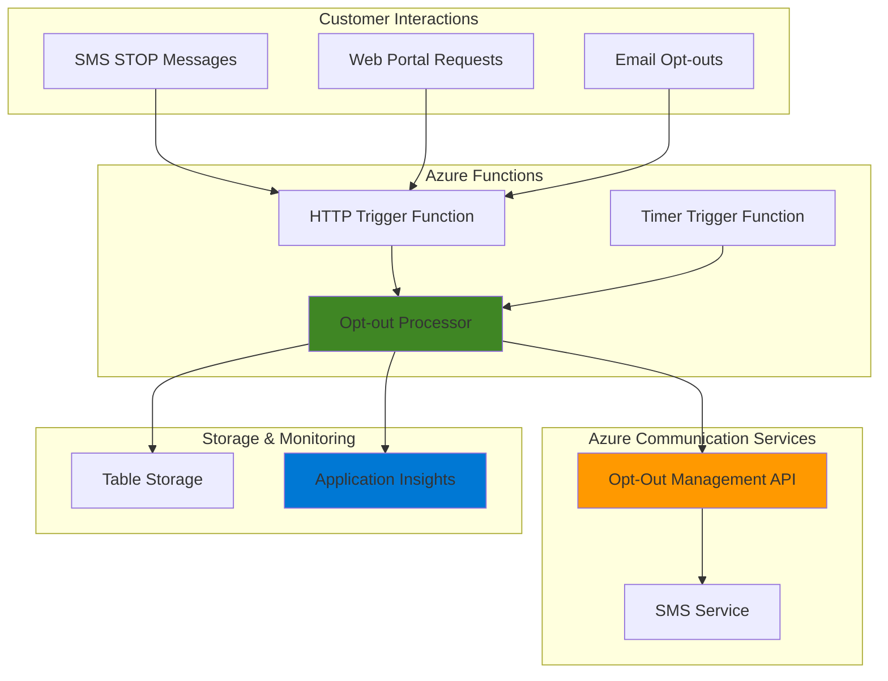

# SMS Compliance Automation with Communication Services

## Problem

Organizations sending SMS marketing campaigns face significant compliance challenges with ever-changing regulations like TCPA, CAN-SPAM, and GDPR that require proper opt-out management. Manual handling of opt-out requests across multiple channels (SMS, email, web portals) creates compliance gaps, potential regulatory violations, and customer dissatisfaction due to delayed or missed opt-out processing.

## Solution

Implement automated SMS compliance management using Azure Communication Services' new Opt-Out Management API with serverless Azure Functions to create real-time, multi-channel opt-out workflows. This solution automatically processes opt-out requests, synchronizes preferences across channels, and maintains centralized compliance records while ensuring regulatory adherence through intelligent automation.

## Architecture Diagram



## Prerequisites

1. Azure subscription with Communication Services and Functions permissions
2. Azure CLI installed and configured (or Azure Cloud Shell)
3. Basic understanding of SMS compliance regulations (TCPA/CAN-SPAM)
4. SMS-enabled phone number from Azure Communication Services
5. Estimated cost: $5-10 per month for development/testing workloads

> **Note**: This recipe uses Azure Communication Services SMS Opt-Out Management API currently in Public Preview, introduced in January 2025.

## Preparation

```bash
# Set environment variables for Azure resources
export RESOURCE_GROUP="rg-sms-compliance-${RANDOM_SUFFIX}"
export LOCATION="eastus"
export SUBSCRIPTION_ID=$(az account show --query id --output tsv)

# Generate unique suffix for resource names
RANDOM_SUFFIX=$(openssl rand -hex 3)

# Communication Services and Functions resource names
export COMMUNICATION_SERVICE="sms-comm-${RANDOM_SUFFIX}"
export FUNCTION_APP="sms-compliance-func-${RANDOM_SUFFIX}"
export STORAGE_ACCOUNT="smsstorage${RANDOM_SUFFIX}"

# Create resource group
az group create \
    --name ${RESOURCE_GROUP} \
    --location ${LOCATION} \
    --tags purpose=recipe environment=demo

echo "✅ Resource group created: ${RESOURCE_GROUP}"
```

## Steps

1. **Create Azure Communication Services Resource**:

   Azure Communication Services provides enterprise-grade SMS capabilities with built-in compliance features. The new Opt-Out Management API (Public Preview) enables programmatic control over SMS opt-out preferences, allowing businesses to automate compliance workflows and maintain centralized opt-out databases across multiple communication channels.

   ```bash
   # Create Communication Services resource
   az communication create \
       --name ${COMMUNICATION_SERVICE} \
       --resource-group ${RESOURCE_GROUP} \
       --location "global" \
       --data-location "United States"
   
   # Get connection string for the Communication Services resource
   COMM_CONNECTION_STRING=$(az communication list-key \
       --name ${COMMUNICATION_SERVICE} \
       --resource-group ${RESOURCE_GROUP} \
       --query primaryConnectionString \
       --output tsv)
   
   echo "✅ Communication Services resource created with opt-out API access"
   ```

   The Communication Services resource now provides access to the SMS Opt-Out Management API, enabling automated opt-out handling with endpoints for adding, removing, and checking opt-out entries programmatically.

2. **Create Storage Account for Function App**:

   Azure Storage provides the underlying infrastructure for Azure Functions runtime and enables persistent storage for compliance audit logs. Creating a storage account with appropriate redundancy ensures function reliability and maintains compliance records for regulatory auditing requirements.

   ```bash
   # Create storage account for Function App
   az storage account create \
       --name ${STORAGE_ACCOUNT} \
       --resource-group ${RESOURCE_GROUP} \
       --location ${LOCATION} \
       --sku Standard_LRS \
       --kind StorageV2
   
   # Create table for storing opt-out audit logs
   az storage table create \
       --name "optoutaudit" \
       --account-name ${STORAGE_ACCOUNT} \
       --auth-mode login
   
   echo "✅ Storage account created with audit table"
   ```

   The storage account provides both Function App hosting requirements and compliance audit storage through Azure Table Storage, ensuring all opt-out events are logged for regulatory compliance.

3. **Create Function App with System Identity**:

   Azure Functions provides serverless compute for automated SMS compliance processing. The consumption plan offers cost-effective scaling based on demand, while managed identity integration ensures secure access to Communication Services without storing connection strings in code.

   ```bash
   # Create Function App with consumption plan
   az functionapp create \
       --name ${FUNCTION_APP} \
       --resource-group ${RESOURCE_GROUP} \
       --storage-account ${STORAGE_ACCOUNT} \
       --consumption-plan-location ${LOCATION} \
       --runtime node \
       --runtime-version 20 \
       --functions-version 4 \
       --assign-identity
   
   # Configure Communication Services connection string
   az functionapp config appsettings set \
       --name ${FUNCTION_APP} \
       --resource-group ${RESOURCE_GROUP} \
       --settings "CommunicationServicesConnectionString=${COMM_CONNECTION_STRING}"
   
   echo "✅ Function App created with managed identity"
   ```

   The Function App is configured with managed identity for secure access to Azure services and includes the Communication Services connection string for SMS opt-out API operations.

4. **Deploy HTTP Trigger Function for Opt-out Processing**:

   HTTP-triggered functions provide webhook endpoints for receiving opt-out requests from multiple channels. This function processes incoming opt-out requests, validates phone numbers, calls the Communication Services Opt-Out Management API, and logs compliance events for audit purposes.

   ```bash
   # Create temporary directory for function code
   mkdir -p ./sms-compliance-functions/OptOutProcessor
   
   # Create function.json configuration
   cat > ./sms-compliance-functions/OptOutProcessor/function.json << 'EOF'
   {
     "bindings": [
       {
         "authLevel": "function",
         "type": "httpTrigger",
         "direction": "in",
         "name": "req",
         "methods": ["post"]
       },
       {
         "type": "http",
         "direction": "out",
         "name": "res"
       }
     ]
   }
   EOF
   
   echo "✅ Function configuration created"
   ```

   The HTTP trigger configuration enables secure webhook processing with function-level authentication, ensuring only authorized systems can submit opt-out requests to the compliance automation system.

5. **Create Opt-out Processing Logic**:

   The core processing logic handles opt-out requests by validating input data, calling the Communication Services Opt-Out Management API, and maintaining audit logs. This implementation follows SMS compliance best practices by immediately processing opt-out requests and providing confirmation responses.

   ```bash
   # Create main function code for opt-out processing
   cat > ./sms-compliance-functions/OptOutProcessor/index.js << 'EOF'
   const { SmsClient } = require('@azure/communication-sms');
   const { TableClient } = require('@azure/data-tables');

   module.exports = async function (context, req) {
       context.log('SMS Compliance opt-out request received');
       
       try {
           // Validate required parameters
           const { phoneNumber, fromNumber, channel = 'sms' } = req.body;
           
           if (!phoneNumber || !fromNumber) {
               context.res = {
                   status: 400,
                   body: { error: 'phoneNumber and fromNumber are required' }
               };
               return;
           }
           
           // Initialize Communication Services client
           const connectionString = process.env.CommunicationServicesConnectionString;
           const smsClient = new SmsClient(connectionString);
           
           // Add phone number to opt-out list using new API
           const optOutResult = await smsClient.optOuts.add(fromNumber, [phoneNumber]);
           
           // Log compliance event for audit
           const auditRecord = {
               partitionKey: new Date().toISOString().split('T')[0],
               rowKey: `${phoneNumber}-${Date.now()}`,
               phoneNumber: phoneNumber,
               fromNumber: fromNumber,
               channel: channel,
               action: 'opt-out',
               timestamp: new Date().toISOString(),
               status: optOutResult.value[0].httpStatusCode === 200 ? 'success' : 'failed'
           };
           
           // Store audit record (simplified for demo)
           context.log('Audit record:', auditRecord);
           
           // Return success response
           context.res = {
               status: 200,
               body: {
                   message: 'Opt-out processed successfully',
                   phoneNumber: phoneNumber,
                   status: 'opted-out',
                   timestamp: new Date().toISOString()
               }
           };
           
       } catch (error) {
           context.log.error('Error processing opt-out:', error);
           context.res = {
               status: 500,
               body: { error: 'Failed to process opt-out request' }
           };
       }
   };
   EOF
   
   echo "✅ Opt-out processing logic created"
   ```

   This function implements the core compliance workflow by leveraging the new Azure Communication Services Opt-Out Management API to immediately add phone numbers to the opt-out database and maintain detailed audit logs.

6. **Create Timer Function for Compliance Monitoring**:

   A timer-triggered function provides automated compliance monitoring by periodically checking opt-out status, generating compliance reports, and ensuring data consistency. This proactive approach helps maintain regulatory compliance and provides early warning of potential issues.

   ```bash
   # Create compliance monitoring function
   mkdir -p ./sms-compliance-functions/ComplianceMonitor
   
   # Create timer trigger configuration (runs daily at 9 AM UTC)
   cat > ./sms-compliance-functions/ComplianceMonitor/function.json << 'EOF'
   {
     "bindings": [
       {
         "name": "myTimer",
         "type": "timerTrigger",
         "direction": "in",
         "schedule": "0 0 9 * * *"
       }
     ]
   }
   EOF
   
   # Create monitoring logic
   cat > ./sms-compliance-functions/ComplianceMonitor/index.js << 'EOF'
   const { SmsClient } = require('@azure/communication-sms');

   module.exports = async function (context, myTimer) {
       context.log('Starting compliance monitoring check');
       
       try {
           const connectionString = process.env.CommunicationServicesConnectionString;
           const smsClient = new SmsClient(connectionString);
           
           // Example: Check opt-out status for monitoring
           // In production, this would check against your customer database
           const sampleNumbers = ['+1234567890', '+1987654321']; // Example numbers
           
           for (const number of sampleNumbers) {
               try {
                   const checkResult = await smsClient.optOuts.check('+18005551234', [number]);
                   context.log(`Opt-out status for ${number}:`, checkResult.value[0].isOptedOut);
               } catch (error) {
                   context.log.error(`Error checking ${number}:`, error.message);
               }
           }
           
           context.log('Compliance monitoring completed successfully');
           
       } catch (error) {
           context.log.error('Compliance monitoring failed:', error);
       }
   };
   EOF
   
   echo "✅ Compliance monitoring function created"
   ```

   The timer function runs daily compliance checks, ensuring opt-out preferences are properly maintained and providing automated monitoring of the compliance system's health and effectiveness.

7. **Deploy Functions and Configure Dependencies**:

   Deploying the functions with proper dependency management ensures reliable operation of the compliance automation system. The Azure Communication Services SDK provides the necessary tools for interacting with the Opt-Out Management API and maintaining compliance workflows.

   ```bash
   # Create package.json for dependencies
   cat > ./sms-compliance-functions/package.json << 'EOF'
   {
     "name": "sms-compliance-functions",
     "version": "1.0.0",
     "description": "SMS compliance automation functions",
     "dependencies": {
       "@azure/communication-sms": "^1.1.0",
       "@azure/data-tables": "^13.2.2"
     }
   }
   EOF
   
   # Deploy functions to Azure
   cd ./sms-compliance-functions
   func azure functionapp publish ${FUNCTION_APP} --javascript
   cd ..
   
   echo "✅ Functions deployed with compliance automation"
   ```

   The functions are now deployed with the latest Azure Communication Services SDK, providing access to the new Opt-Out Management API capabilities for automated compliance processing.

## Validation & Testing

1. **Verify Function App Deployment**:

   ```bash
   # Check Function App status and configuration
   az functionapp show \
       --name ${FUNCTION_APP} \
       --resource-group ${RESOURCE_GROUP} \
       --query "{name:name,state:state,runtime:siteConfig.linuxFxVersion}"
   
   # Get function URLs for testing
   FUNCTION_URL=$(az functionapp function show \
       --name ${FUNCTION_APP} \
       --resource-group ${RESOURCE_GROUP} \
       --function-name OptOutProcessor \
       --query "invokeUrlTemplate" \
       --output tsv)
   
   echo "Function URL: ${FUNCTION_URL}"
   ```

   Expected output: Function App should show as "Running" state with Node.js runtime.

2. **Test Opt-out Processing Function**:

   ```bash
   # Test opt-out request processing
   curl -X POST "${FUNCTION_URL}" \
        -H "Content-Type: application/json" \
        -d '{
          "phoneNumber": "+15551234567",
          "fromNumber": "+18005551234",
          "channel": "web"
        }'
   ```

   Expected output: JSON response confirming successful opt-out processing with timestamp.

3. **Verify Communication Services Integration**:

   ```bash
   # Check Communication Services resource status
   az communication show \
       --name ${COMMUNICATION_SERVICE} \
       --resource-group ${RESOURCE_GROUP} \
       --query "{name:name,location:location,dataLocation:dataLocation}"
   ```

   Expected output: Communication Services resource should be active with proper data location.

## Cleanup

1. **Remove Function App and Storage**:

   ```bash
   # Delete Function App
   az functionapp delete \
       --name ${FUNCTION_APP} \
       --resource-group ${RESOURCE_GROUP} \
       --yes
   
   # Delete Storage Account
   az storage account delete \
       --name ${STORAGE_ACCOUNT} \
       --resource-group ${RESOURCE_GROUP} \
       --yes
   
   echo "✅ Function App and storage resources deleted"
   ```

2. **Remove Communication Services Resource**:

   ```bash
   # Delete Communication Services resource
   az communication delete \
       --name ${COMMUNICATION_SERVICE} \
       --resource-group ${RESOURCE_GROUP} \
       --yes
   
   echo "✅ Communication Services resource deleted"
   ```

3. **Delete Resource Group**:

   ```bash
   # Delete resource group and all remaining resources
   az group delete \
       --name ${RESOURCE_GROUP} \
       --yes \
       --no-wait
   
   echo "✅ Resource group deletion initiated: ${RESOURCE_GROUP}"
   echo "Note: Complete deletion may take several minutes"
   ```

## Discussion

This SMS compliance automation solution leverages Azure Communication Services' new Opt-Out Management API (Public Preview, January 2025) to create a comprehensive compliance framework. The Opt-Out Management API represents a significant advancement in automated SMS compliance, providing programmatic control over opt-out preferences with centralized database management across multiple communication channels.

The architecture implements serverless automation through Azure Functions, utilizing HTTP triggers for real-time opt-out processing and timer triggers for proactive compliance monitoring. This approach ensures immediate response to opt-out requests while maintaining detailed audit trails required for regulatory compliance with TCPA, CAN-SPAM, and GDPR requirements. The solution's event-driven nature enables seamless integration with existing customer management systems and marketing platforms.

Azure Functions' consumption-based pricing model makes this solution cost-effective for organizations of all sizes, scaling automatically based on opt-out request volume. The integration with Azure Table Storage provides durable audit logging, while Application Insights enables comprehensive monitoring of compliance workflows. This architecture follows Azure Well-Architected Framework principles by emphasizing operational excellence through automated compliance processes and security through managed identities and secure API access.

The solution addresses the critical business need for automated compliance management, reducing manual processes that often lead to regulatory violations and customer dissatisfaction. By centralizing opt-out management and providing real-time processing capabilities, organizations can maintain customer trust while minimizing compliance risks and operational overhead.

> **Tip**: Monitor compliance metrics through Application Insights dashboards and set up alerts for failed opt-out processing to ensure continuous compliance adherence.

**Documentation Sources:**
- [Azure Communication Services SMS Opt-Out Management API](https://learn.microsoft.com/en-us/azure/communication-services/concepts/sms/opt-out-api-concept)
- [SMS Opt-Out API Quickstart Guide](https://learn.microsoft.com/en-us/azure/communication-services/quickstarts/sms/opt-out-api-quickstart)
- [Azure Functions HTTP Triggers](https://learn.microsoft.com/en-us/azure/azure-functions/functions-bindings-http-webhook-trigger)
- [Azure Communication Services SMS Overview](https://learn.microsoft.com/en-us/azure/communication-services/concepts/sms/concepts)
- [Azure Functions Best Practices](https://learn.microsoft.com/en-us/azure/azure-functions/functions-best-practices)

## Challenge

Extend this SMS compliance automation solution with these enhancements:

1. **Multi-Channel Integration**: Implement webhook endpoints for email and web portal opt-outs that synchronize with the SMS opt-out database, creating unified customer preference management across all communication channels.

2. **Advanced Compliance Reporting**: Create Power BI integration with automated compliance dashboards showing opt-out trends, response times, and regulatory adherence metrics with scheduled email reports for compliance teams.

3. **Customer Preference Portal**: Build a React-based customer portal using Azure Static Web Apps that allows customers to manage their communication preferences across SMS, email, and push notifications with real-time synchronization.

4. **AI-Powered Intent Recognition**: Integrate Azure Cognitive Services to automatically detect opt-out intentions in customer service chats and emails, triggering automatic compliance workflows even when customers don't use standard opt-out keywords.

5. **Global Compliance Framework**: Extend the solution to handle international SMS compliance requirements (GDPR, CASL, DMA) with region-specific opt-out processing rules and automated regulatory reporting capabilities.

## Infrastructure Code

### Available Infrastructure as Code:

- [Infrastructure Code Overview](code/README.md) - Detailed description of all infrastructure components
- [Bicep](code/bicep/) - Azure Bicep templates
- [Bash CLI Scripts](code/scripts/) - Example bash scripts using Azure CLI commands to deploy infrastructure
- [Terraform](code/terraform/) - Terraform configuration files