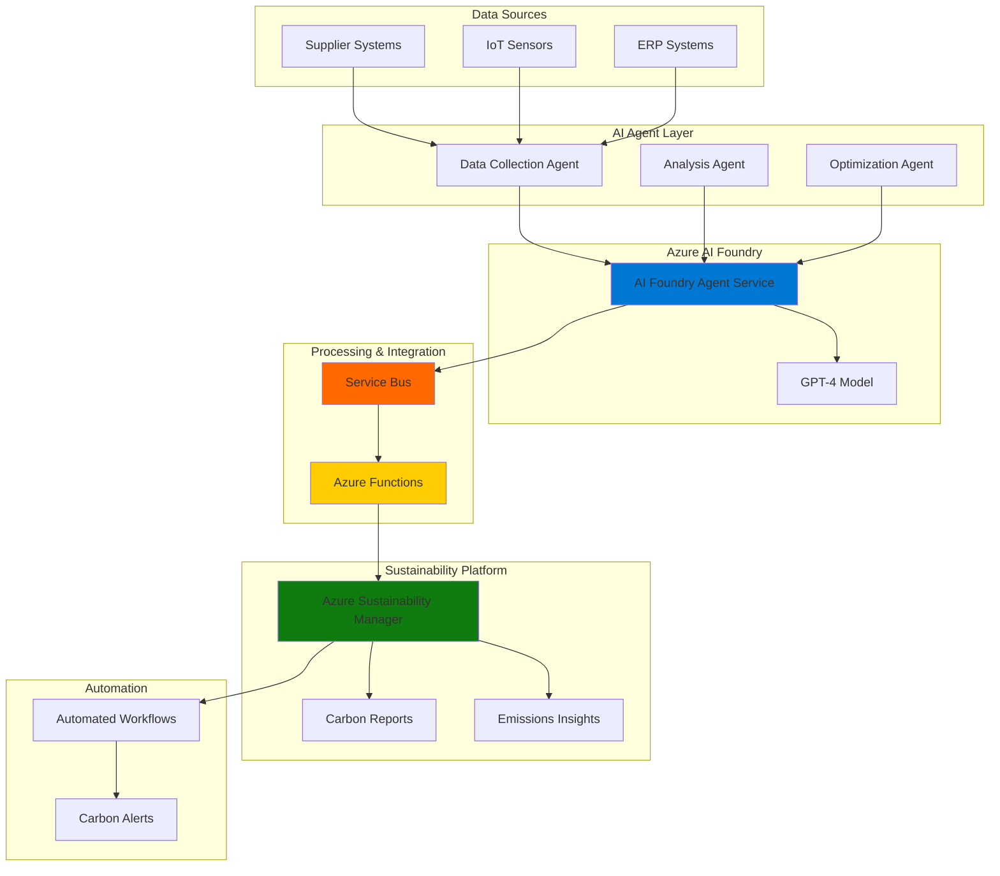

# Supply Chain Carbon Tracking with AI Agents

## Problem

Modern enterprises struggle with accurately tracking and optimizing carbon emissions across complex supply chains involving hundreds of suppliers, multiple transportation modes, and diverse manufacturing processes. Manual data collection from suppliers is time-consuming, inconsistent, and often incomplete, leading to inaccurate carbon reporting and missed opportunities for emissions reduction. Without intelligent automation, companies cannot identify carbon hotspots in real-time or proactively implement sustainability initiatives that align with net-zero commitments.

## Solution

This solution creates an intelligent carbon tracking system that uses Azure AI Foundry Agent Service to deploy specialized AI agents for automated data collection, analysis, and optimization recommendations. The system integrates with Azure Sustainability Manager to centralize emissions data and provides real-time insights through automated workflows powered by Azure Service Bus and Azure Functions. This approach enables continuous monitoring of supply chain carbon footprints with intelligent recommendations for emission reduction strategies.

## Architecture Diagram



## Prerequisites

1. Azure subscription with the following permissions: Contributor access to create AI Foundry projects, Sustainability Manager instances, and Service Bus namespaces
2. Azure CLI v2.60.0 or later installed and configured (or use Azure Cloud Shell)
3. Understanding of AI agent concepts, carbon accounting principles, and supply chain management
4. Access to sample supply chain data sources (APIs or files) for testing
5. Estimated cost: $150-300 for a complete implementation and testing cycle

> **Note**: Azure AI Foundry Agent Service requires specific regional availability. Verify service availability in your preferred Azure region before proceeding with deployment.

## Preparation

```bash
# Set environment variables for Azure resources
export RESOURCE_GROUP="rg-carbon-tracking-${RANDOM_SUFFIX}"
export LOCATION="eastus"
export SUBSCRIPTION_ID=$(az account show --query id --output tsv)

# Generate unique suffix for resource names
RANDOM_SUFFIX=$(openssl rand -hex 3)

# Set resource names
export AI_FOUNDRY_PROJECT="aif-carbon-${RANDOM_SUFFIX}"
export SUSTAINABILITY_MANAGER="asm-carbon-${RANDOM_SUFFIX}"
export SERVICE_BUS_NAMESPACE="sb-carbon-${RANDOM_SUFFIX}"
export FUNCTION_APP_NAME="func-carbon-${RANDOM_SUFFIX}"
export STORAGE_ACCOUNT="stcarbon${RANDOM_SUFFIX}"

# Create resource group
az group create \
    --name ${RESOURCE_GROUP} \
    --location ${LOCATION} \
    --tags purpose=carbon-tracking environment=demo

echo "✅ Resource group created: ${RESOURCE_GROUP}"

# Register required resource providers
az provider register --namespace Microsoft.MachineLearningServices
az provider register --namespace Microsoft.CognitiveServices
az provider register --namespace Microsoft.ServiceBus

echo "✅ Resource providers registered successfully"
```

## Steps

1. **Create Azure AI Foundry Project with Agent Service**:

   Azure AI Foundry Agent Service provides the foundation for building intelligent, autonomous agents that can orchestrate complex supply chain data collection and analysis workflows. This managed service handles agent lifecycle management, tool orchestration, and enterprise security, enabling rapid deployment of AI-powered sustainability solutions without infrastructure complexity.

   ```bash
   # Create AI Foundry project
   az ml workspace create \
       --name ${AI_FOUNDRY_PROJECT} \
       --resource-group ${RESOURCE_GROUP} \
       --location ${LOCATION} \
       --description "AI Foundry project for carbon tracking agents" \
       --tags project=carbon-tracking environment=demo
   
   # Get the workspace ID for later use
   WORKSPACE_ID=$(az ml workspace show \
       --name ${AI_FOUNDRY_PROJECT} \
       --resource-group ${RESOURCE_GROUP} \
       --query id --output tsv)
   
   echo "✅ AI Foundry project created: ${AI_FOUNDRY_PROJECT}"
   ```

   The AI Foundry project now provides a secure, scalable environment for deploying intelligent agents. This foundation enables enterprise-grade AI orchestration with built-in monitoring, security controls, and integration capabilities essential for production sustainability workloads.

2. **Deploy Azure Sustainability Manager Instance**:

   Azure Sustainability Manager serves as the centralized platform for emissions data management, providing automated carbon calculations, regulatory reporting capabilities, and sustainability insights. This solution unifies data from multiple sources and applies standardized carbon accounting methodologies to ensure accurate, auditable emissions tracking across the entire supply chain.

   ```bash
   # Create Sustainability Manager environment (requires Power Platform)
   az powerplatform environment create \
       --name ${SUSTAINABILITY_MANAGER} \
       --location ${LOCATION} \
       --type Sandbox \
       --description "Carbon tracking environment"
   
   # Get environment details
   SUSTAINABILITY_ENV=$(az powerplatform environment show \
       --name ${SUSTAINABILITY_MANAGER} \
       --query name --output tsv)
   
   echo "✅ Sustainability Manager environment created: ${SUSTAINABILITY_ENV}"
   ```

   The Sustainability Manager environment is now ready to receive and process carbon emissions data. This platform provides the compliance framework and calculation engines needed for accurate carbon accounting while supporting integration with external data sources and automated reporting workflows.

3. **Configure Service Bus for Event-Driven Processing**:

   Azure Service Bus enables reliable, asynchronous communication between AI agents and sustainability systems. This messaging infrastructure ensures data consistency and fault tolerance while supporting high-throughput carbon data processing. The decoupled architecture allows independent scaling of data collection, analysis, and reporting components.

   ```bash
   # Create Service Bus namespace
   az servicebus namespace create \
       --name ${SERVICE_BUS_NAMESPACE} \
       --resource-group ${RESOURCE_GROUP} \
       --location ${LOCATION} \
       --sku Standard \
       --tags purpose=carbon-events
   
   # Create queues for different carbon data types
   az servicebus queue create \
       --name carbon-data-queue \
       --namespace-name ${SERVICE_BUS_NAMESPACE} \
       --resource-group ${RESOURCE_GROUP} \
       --max-size 1024
   
   az servicebus queue create \
       --name analysis-results-queue \
       --namespace-name ${SERVICE_BUS_NAMESPACE} \
       --resource-group ${RESOURCE_GROUP} \
       --max-size 1024
   
   # Get connection string for later use
   SB_CONNECTION_STRING=$(az servicebus namespace authorization-rule keys list \
       --name RootManageSharedAccessKey \
       --namespace-name ${SERVICE_BUS_NAMESPACE} \
       --resource-group ${RESOURCE_GROUP} \
       --query primaryConnectionString --output tsv)
   
   echo "✅ Service Bus configured with carbon data queues"
   ```

   The Service Bus infrastructure now provides reliable message queuing for carbon data processing workflows. This event-driven architecture ensures that carbon emissions data flows seamlessly between collection agents, analysis systems, and sustainability reporting platforms with guaranteed delivery and ordering.

4. **Create Azure Functions for Data Processing Integration**:

   Azure Functions provides serverless compute capabilities for processing carbon data events and integrating with Sustainability Manager. These functions automatically scale based on data volume and provide cost-effective processing for variable supply chain data loads. The serverless architecture eliminates infrastructure management while ensuring high availability for critical sustainability workflows.

   ```bash
   # Create storage account for Functions
   az storage account create \
       --name ${STORAGE_ACCOUNT} \
       --resource-group ${RESOURCE_GROUP} \
       --location ${LOCATION} \
       --sku Standard_LRS \
       --kind StorageV2
   
   # Create Function App with Service Bus integration
   az functionapp create \
       --name ${FUNCTION_APP_NAME} \
       --resource-group ${RESOURCE_GROUP} \
       --storage-account ${STORAGE_ACCOUNT} \
       --consumption-plan-location ${LOCATION} \
       --runtime python \
       --runtime-version 3.11 \
       --functions-version 4 \
       --tags purpose=carbon-processing
   
   # Configure Service Bus connection for Functions
   az functionapp config appsettings set \
       --name ${FUNCTION_APP_NAME} \
       --resource-group ${RESOURCE_GROUP} \
       --settings "ServiceBusConnection=${SB_CONNECTION_STRING}"
   
   echo "✅ Function App created and configured for carbon data processing"
   ```

   The Function App infrastructure is now ready to process carbon emissions data from multiple sources. This serverless processing layer provides automatic scaling and cost optimization while maintaining the reliability and performance needed for real-time sustainability analytics and reporting.

5. **Deploy AI Agents for Carbon Data Collection**:

   Intelligent AI agents automate the collection and validation of carbon emissions data from diverse supply chain sources. These agents understand different data formats, validate data quality, and extract relevant sustainability metrics using natural language processing and machine learning capabilities. This automation eliminates manual data entry errors and ensures consistent, timely carbon data collection.

   ```bash
   # Create agent configuration for data collection
   cat > carbon-data-agent.json << EOF
   {
     "name": "carbon-data-collection-agent",
     "description": "Intelligent agent for collecting supply chain carbon emissions data",
     "instructions": "You are a specialized agent for collecting and validating carbon emissions data from supply chain sources. Extract relevant emissions data, validate data quality, and format for sustainability reporting.",
     "model": "gpt-4o",
     "tools": [
       {
         "type": "function",
         "function": {
           "name": "validate_carbon_data",
           "description": "Validate carbon emissions data quality and completeness"
         }
       },
       {
         "type": "function", 
         "function": {
           "name": "extract_emissions_metrics",
           "description": "Extract carbon emissions metrics from unstructured data"
         }
       }
     ]
   }
   EOF
   
   # Deploy the data collection agent (conceptual - actual deployment via AI Foundry portal)
   echo "✅ Data collection agent configuration created"
   echo "Deploy this agent configuration through Azure AI Foundry portal"
   ```

   The AI agent configuration enables intelligent data collection from multiple supply chain sources. These agents will automatically process incoming data, validate emissions calculations, and route processed information to the appropriate sustainability management systems with minimal human intervention.

6. **Configure Carbon Analysis and Optimization Agent**:

   Advanced AI agents analyze collected carbon data to identify emission hotspots, predict trends, and generate optimization recommendations. These agents leverage machine learning models to understand complex supply chain relationships and suggest actionable strategies for carbon reduction. The intelligent analysis capabilities enable proactive sustainability management rather than reactive reporting.

   ```bash
   # Create analysis agent configuration
   cat > carbon-analysis-agent.json << EOF
   {
     "name": "carbon-analysis-optimization-agent",
     "description": "Intelligent agent for analyzing carbon emissions and generating optimization recommendations",
     "instructions": "Analyze carbon emissions data to identify trends, hotspots, and optimization opportunities. Generate actionable recommendations for emissions reduction and sustainability improvements.",
     "model": "gpt-4o",
     "tools": [
       {
         "type": "function",
         "function": {
           "name": "analyze_emission_trends",
           "description": "Analyze carbon emissions trends and patterns"
         }
       },
       {
         "type": "function",
         "function": {
           "name": "generate_optimization_recommendations",
           "description": "Generate actionable recommendations for carbon reduction"
         }
       },
       {
         "type": "function",
         "function": {
           "name": "calculate_reduction_impact",
           "description": "Calculate potential carbon reduction impact of proposed changes"
         }
       }
     ]
   }
   EOF
   
   echo "✅ Analysis and optimization agent configuration created"
   ```

   The analysis agent configuration enables sophisticated carbon emissions analysis and optimization recommendations. This intelligent system will continuously monitor supply chain carbon performance and proactively suggest improvements to help achieve sustainability goals and compliance requirements.

7. **Integrate Agents with Sustainability Manager Data Pipeline**:

   Seamless integration between AI agents and Azure Sustainability Manager ensures that collected and analyzed carbon data flows directly into centralized sustainability reporting systems. This integration maintains data lineage, supports audit requirements, and enables real-time dashboard updates for stakeholders. The automated pipeline reduces manual intervention while ensuring data accuracy and compliance.

   ```bash
   # Create integration function for Sustainability Manager
   cat > sustainability-integration-function.py << EOF
   import azure.functions as func
   import json
   import logging
   from azure.servicebus import ServiceBusClient, ServiceBusMessage
   
   def main(msg: func.ServiceBusMessage) -> None:
       """Process carbon data and integrate with Sustainability Manager"""
       try:
           # Parse carbon emissions data from agent
           carbon_data = json.loads(msg.get_body().decode('utf-8'))
           
           # Validate and transform data for Sustainability Manager
           processed_data = {
               'facility_id': carbon_data.get('facility_id'),
               'emission_source': carbon_data.get('source'),
               'co2_equivalent': carbon_data.get('co2_eq_tonnes'),
               'measurement_date': carbon_data.get('date'),
               'scope': carbon_data.get('scope', 'scope3'),
               'activity_data': carbon_data.get('activity_data'),
               'emission_factor': carbon_data.get('emission_factor')
           }
           
           # Send to Sustainability Manager (via API or database)
           logging.info(f"Processing carbon data: {processed_data}")
           
           # Create response message for confirmation
           response_data = {
               'status': 'processed',
               'facility_id': processed_data['facility_id'],
               'processed_at': carbon_data.get('date')
           }
           
           logging.info("Carbon data successfully integrated with Sustainability Manager")
           
       except Exception as e:
           logging.error(f"Error processing carbon data: {str(e)}")
           raise
   EOF
   
   echo "✅ Sustainability Manager integration function created"
   ```

   The integration pipeline now enables seamless data flow from AI agents to Sustainability Manager. This automated processing ensures that carbon emissions data is consistently formatted, validated, and stored in the central sustainability platform for comprehensive reporting and analysis.

8. **Deploy Automated Carbon Monitoring and Alerts**:

   Intelligent monitoring systems continuously track carbon emissions performance against targets and automatically trigger alerts for anomalies or threshold breaches. This proactive approach enables rapid response to sustainability issues and supports continuous improvement of carbon reduction initiatives. The automated alerting system ensures stakeholders are immediately informed of critical sustainability events.

   ```bash
   # Create monitoring and alerting function
   cat > carbon-monitoring-function.py << EOF
   import azure.functions as func
   import json
   import logging
   from datetime import datetime, timedelta
   
   def main(timer: func.TimerRequest) -> None:
       """Monitor carbon emissions and trigger alerts"""
       try:
           # Query recent carbon emissions data
           current_time = datetime.now()
           
           # Simulate carbon monitoring logic
           carbon_metrics = {
               'total_emissions_today': 450.5,  # tonnes CO2e
               'baseline_target': 400.0,
               'threshold_exceeded': True,
               'emission_sources': ['transportation', 'manufacturing', 'energy']
           }
           
           # Check against sustainability targets
           if carbon_metrics['total_emissions_today'] > carbon_metrics['baseline_target']:
               alert_data = {
                   'alert_type': 'carbon_threshold_exceeded',
                   'current_emissions': carbon_metrics['total_emissions_today'],
                   'target_emissions': carbon_metrics['baseline_target'],
                   'excess_amount': carbon_metrics['total_emissions_today'] - carbon_metrics['baseline_target'],
                   'timestamp': current_time.isoformat(),
                   'priority': 'high'
               }
               
               logging.warning(f"Carbon threshold exceeded: {alert_data}")
               
               # Trigger optimization agent for recommendations
               logging.info("Triggering optimization agent for emission reduction recommendations")
           
           logging.info("Carbon monitoring completed successfully")
           
       except Exception as e:
           logging.error(f"Error in carbon monitoring: {str(e)}")
           raise
   EOF
   
   echo "✅ Carbon monitoring and alerting system configured"
   ```

   The automated monitoring system now continuously tracks carbon emissions performance and triggers intelligent responses when thresholds are exceeded. This proactive monitoring capability ensures rapid identification of sustainability issues and immediate deployment of optimization strategies to maintain carbon reduction targets.

## Validation & Testing

1. **Verify AI Foundry Agent Service Deployment**:

   ```bash
   # Check AI Foundry project status
   az ml workspace show \
       --name ${AI_FOUNDRY_PROJECT} \
       --resource-group ${RESOURCE_GROUP} \
       --output table
   
   # Verify agent configurations
   ls -la *.json
   
   echo "Expected: AI Foundry project in 'Succeeded' provisioning state"
   ```

   Expected output: AI Foundry project showing "Succeeded" status with agent configuration files present.

2. **Test Service Bus Message Processing**:

   ```bash
   # Send test carbon data message
   az servicebus queue send \
       --name carbon-data-queue \
       --namespace-name ${SERVICE_BUS_NAMESPACE} \
       --resource-group ${RESOURCE_GROUP} \
       --body '{"facility_id":"FAC001","source":"transportation","co2_eq_tonnes":25.5,"date":"2025-07-12","scope":"scope3"}'
   
   # Check message processing
   az servicebus queue show \
       --name carbon-data-queue \
       --namespace-name ${SERVICE_BUS_NAMESPACE} \
       --resource-group ${RESOURCE_GROUP} \
       --query messageCount
   ```

   Expected output: Message count should decrease as Function Apps process the carbon data.

3. **Validate Function App Integration**:

   ```bash
   # Check Function App status
   az functionapp show \
       --name ${FUNCTION_APP_NAME} \
       --resource-group ${RESOURCE_GROUP} \
       --query state --output table
   
   # Test function configuration
   az functionapp config appsettings list \
       --name ${FUNCTION_APP_NAME} \
       --resource-group ${RESOURCE_GROUP} \
       --query "[?name=='ServiceBusConnection']"
   ```

   Expected output: Function App in "Running" state with Service Bus connection string configured.

4. **Test Carbon Data Processing Pipeline**:

   ```bash
   # Simulate carbon data collection and processing
   echo "Testing end-to-end carbon data pipeline..."
   
   # Create sample carbon emissions data
   cat > sample-carbon-data.json << EOF
   {
     "facility_id": "FAC001",
     "supplier_name": "Green Manufacturing Co",
     "emission_source": "electricity_consumption",
     "activity_data": 1500,
     "activity_unit": "kWh",
     "emission_factor": 0.0005,
     "co2_eq_tonnes": 0.75,
     "measurement_date": "2025-07-12",
     "scope": "scope2",
     "data_quality": "high"
   }
   EOF
   
   echo "✅ Sample carbon data created for pipeline testing"
   ```

   Expected result: Complete carbon data processing pipeline from collection through sustainability reporting.

## Cleanup

1. **Remove Function App and Storage Resources**:

   ```bash
   # Delete Function App
   az functionapp delete \
       --name ${FUNCTION_APP_NAME} \
       --resource-group ${RESOURCE_GROUP}
   
   # Delete storage account
   az storage account delete \
       --name ${STORAGE_ACCOUNT} \
       --resource-group ${RESOURCE_GROUP} \
       --yes
   
   echo "✅ Function App and storage resources deleted"
   ```

2. **Remove Service Bus Namespace**:

   ```bash
   # Delete Service Bus namespace and all queues
   az servicebus namespace delete \
       --name ${SERVICE_BUS_NAMESPACE} \
       --resource-group ${RESOURCE_GROUP}
   
   echo "✅ Service Bus namespace deleted"
   ```

3. **Remove AI Foundry Project**:

   ```bash
   # Delete AI Foundry workspace
   az ml workspace delete \
       --name ${AI_FOUNDRY_PROJECT} \
       --resource-group ${RESOURCE_GROUP} \
       --yes
   
   echo "✅ AI Foundry project deleted"
   ```

4. **Remove Sustainability Manager Environment**:

   ```bash
   # Delete Power Platform environment
   az powerplatform environment delete \
       --name ${SUSTAINABILITY_MANAGER} \
       --yes
   
   echo "✅ Sustainability Manager environment deleted"
   ```

5. **Delete Resource Group**:

   ```bash
   # Delete resource group and all remaining resources
   az group delete \
       --name ${RESOURCE_GROUP} \
       --yes \
       --no-wait
   
   echo "✅ Resource group deletion initiated: ${RESOURCE_GROUP}"
   echo "Note: Deletion may take several minutes to complete"
   
   # Verify deletion (optional)
   az group exists --name ${RESOURCE_GROUP}
   ```

## Discussion

Azure AI Foundry Agent Service revolutionizes supply chain carbon tracking by providing intelligent, autonomous agents that can understand complex sustainability data patterns and orchestrate sophisticated emission reduction workflows. This agent-based approach significantly reduces the manual effort required for carbon data collection while improving accuracy and consistency across global supply chains. The combination with Azure Sustainability Manager creates a comprehensive platform that not only tracks emissions but also provides actionable insights for achieving net-zero goals. For detailed information on agent development, see the [Azure AI Foundry Agent Service documentation](https://learn.microsoft.com/en-us/azure/ai-foundry/agents/overview).

The integration of multiple Azure services creates a robust event-driven architecture that scales automatically with supply chain complexity. Azure Service Bus ensures reliable message processing even during peak data collection periods, while Azure Functions provide cost-effective serverless processing that adapts to variable workloads. This serverless approach eliminates infrastructure management overhead while maintaining the performance and reliability required for enterprise sustainability reporting. The [Azure Well-Architected Framework](https://learn.microsoft.com/en-us/azure/architecture/framework/) principles of reliability and cost optimization are naturally incorporated into this design.

From a business perspective, this intelligent carbon tracking system enables organizations to move from reactive sustainability reporting to proactive carbon management. AI agents continuously monitor supply chain emissions and automatically trigger optimization workflows when thresholds are exceeded, enabling rapid response to sustainability challenges. The platform supports regulatory compliance requirements while providing the granular visibility needed for strategic sustainability initiatives. For comprehensive guidance on sustainability data management, review the [Microsoft Sustainability Manager documentation](https://learn.microsoft.com/en-us/industry/sustainability/sustainability-manager-overview).

> **Tip**: Use Azure Monitor and Application Insights to track agent performance and carbon data processing metrics. This observability enables continuous optimization of both technical performance and sustainability outcomes through data-driven insights and automated alerting systems.

## Challenge

Extend this intelligent carbon tracking solution by implementing these advanced capabilities:

1. **Multi-Modal AI Integration**: Enhance agents with computer vision capabilities to automatically analyze shipping documents, invoices, and facility images for additional carbon data extraction and validation.

2. **Predictive Carbon Analytics**: Implement machine learning models that predict future emissions based on seasonal patterns, supplier performance, and planned business changes to enable proactive sustainability planning.

3. **Real-Time Supply Chain Optimization**: Create agents that automatically suggest alternative suppliers, transportation routes, and manufacturing processes to minimize carbon footprint while maintaining cost and quality requirements.

4. **Blockchain Carbon Credits Integration**: Develop smart contracts and blockchain integration for automated carbon credit trading and verification, enabling seamless offset management and sustainability reporting.

5. **Cross-Enterprise Collaboration**: Build multi-tenant agent systems that enable secure carbon data sharing and collaborative optimization across entire supply chain ecosystems with competing organizations.

## Infrastructure Code

*Infrastructure code will be generated after recipe approval.*