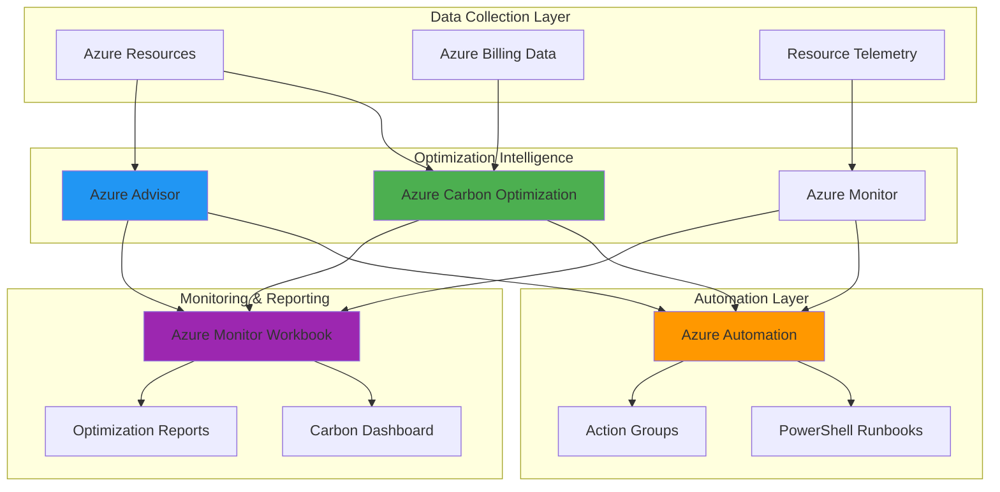

# Sustainable Workload Optimization for Carbon Reduction

## Problem

Organizations face increasing pressure to reduce their carbon footprint while maintaining operational efficiency and controlling cloud costs. Traditional monitoring approaches only focus on performance and cost metrics, missing the environmental impact of cloud resources. Without automated optimization capabilities, IT teams struggle to identify underutilized resources that contribute to unnecessary carbon emissions, leading to both environmental waste and increased operational expenses.

## Solution

This solution creates an intelligent workload optimization system that leverages Azure Carbon Optimization for granular emissions tracking and Azure Advisor for AI-driven recommendations. By combining these services with Azure Monitor for comprehensive observability and Azure Automation for automated remediation, organizations can achieve continuous optimization that reduces both carbon emissions and costs while maintaining performance standards.

## Architecture Diagram



## Prerequisites

1. Azure account with appropriate permissions for subscription management
2. Azure CLI v2.50.0 or later installed and configured (or Azure CloudShell)
3. PowerShell 7.0 or later for runbook development
4. Understanding of Azure resource management and monitoring concepts
5. Knowledge of sustainability metrics and carbon footprint analysis
6. Estimated cost: $15-25 per month for automation resources and monitoring

> **Note**: Azure Carbon Optimization is available at no additional cost in the Azure portal. Ensure you have at least Contributor role on the subscription to access carbon optimization data and create automation resources.

## Preparation

```bash
# Generate unique suffix for resource names first
RANDOM_SUFFIX=$(openssl rand -hex 3)

# Set environment variables for Azure resources
export RESOURCE_GROUP="rg-carbon-optimization-${RANDOM_SUFFIX}"
export LOCATION="eastus"
export SUBSCRIPTION_ID=$(az account show --query id --output tsv)
export AUTOMATION_ACCOUNT="aa-carbon-opt-${RANDOM_SUFFIX}"
export WORKSPACE_NAME="law-carbon-opt-${RANDOM_SUFFIX}"
export WORKBOOK_NAME="carbon-optimization-dashboard"

# Create resource group with sustainability tags
az group create \
    --name ${RESOURCE_GROUP} \
    --location ${LOCATION} \
    --tags purpose=sustainability environment=production \
           project=carbon-optimization

# Create Log Analytics workspace for monitoring
az monitor log-analytics workspace create \
    --resource-group ${RESOURCE_GROUP} \
    --workspace-name ${WORKSPACE_NAME} \
    --location ${LOCATION} \
    --sku pergb2018

# Store workspace ID for later use
export WORKSPACE_ID=$(az monitor log-analytics workspace show \
    --resource-group ${RESOURCE_GROUP} \
    --workspace-name ${WORKSPACE_NAME} \
    --query customerId --output tsv)

echo "✅ Foundation resources created successfully"
echo "   Resource Group: ${RESOURCE_GROUP}"
echo "   Log Analytics Workspace: ${WORKSPACE_NAME}"
```

## Steps

1. **Configure Azure Carbon Optimization Access**:

   Azure Carbon Optimization provides granular emissions tracking at the resource level, enabling organizations to understand their environmental impact down to individual Azure services. This foundational step ensures proper role-based access control and establishes the baseline for carbon emissions monitoring across your Azure footprint.

   ```bash
   # Enable Carbon Optimization Reader role for monitoring
   az role assignment create \
       --assignee $(az ad signed-in-user show --query id --output tsv) \
       --role "Carbon Optimization Reader" \
       --scope "/subscriptions/${SUBSCRIPTION_ID}"
   
   # Wait for role assignment to propagate
   echo "Waiting for role assignment to propagate..."
   sleep 30
   
   # Verify carbon optimization access with REST API
   az rest --method GET \
       --url "https://management.azure.com/providers/Microsoft.Carbon/carbonEmissionReports?api-version=2025-04-01" \
       --query "value" \
       --output table
   
   echo "✅ Carbon Optimization access configured"
   ```

   The Carbon Optimization Reader role provides the necessary permissions to access emissions data while maintaining security through least-privilege access. This role enables automated systems to retrieve carbon metrics without broader administrative permissions.

2. **Create Azure Automation Account with Managed Identity**:

   Azure Automation provides the orchestration platform for intelligent workload optimization, enabling automated responses to carbon optimization recommendations. The managed identity ensures secure authentication to Azure services without storing credentials, following Azure security best practices.

   ```bash
   # Create Azure Automation account with system-assigned managed identity
   az automation account create \
       --resource-group ${RESOURCE_GROUP} \
       --name ${AUTOMATION_ACCOUNT} \
       --location ${LOCATION} \
       --assign-identity \
       --tags purpose=sustainability automation-type=carbon-optimization
   
   # Get the managed identity principal ID
   export IDENTITY_PRINCIPAL_ID=$(az automation account show \
       --resource-group ${RESOURCE_GROUP} \
       --name ${AUTOMATION_ACCOUNT} \
       --query identity.principalId --output tsv)
   
   # Grant managed identity permissions for resource management
   az role assignment create \
       --assignee ${IDENTITY_PRINCIPAL_ID} \
       --role "Contributor" \
       --scope "/subscriptions/${SUBSCRIPTION_ID}"
   
   # Grant Carbon Optimization Reader role to managed identity
   az role assignment create \
       --assignee ${IDENTITY_PRINCIPAL_ID} \
       --role "Carbon Optimization Reader" \
       --scope "/subscriptions/${SUBSCRIPTION_ID}"
   
   echo "✅ Automation account created with managed identity"
   ```

   The Automation account now has the necessary permissions to read carbon optimization data and perform resource optimization actions. This automated approach ensures consistent enforcement of sustainability policies without manual intervention.

3. **Deploy Carbon Optimization Monitoring Runbook**:

   This PowerShell runbook integrates with Azure Carbon Optimization APIs to collect emissions data and generate optimization recommendations. The runbook processes carbon metrics alongside Azure Advisor recommendations to create comprehensive sustainability insights.

   ```bash
   # Create PowerShell runbook for carbon monitoring
   cat > carbon-monitoring-runbook.ps1 << 'EOF'
   param(
       [Parameter(Mandatory=$true)]
       [string]$SubscriptionId,
       [Parameter(Mandatory=$true)]
       [string]$WorkspaceId
   )
   
   try {
       # Connect using managed identity
       Connect-AzAccount -Identity
       Select-AzSubscription -SubscriptionId $SubscriptionId
       
       # Get carbon emissions data using REST API
       $carbonEndpoint = "https://management.azure.com/providers/Microsoft.Carbon/carbonEmissionReports?api-version=2025-04-01"
       $headers = @{
           'Authorization' = "Bearer $((Get-AzAccessToken).Token)"
           'Content-Type' = 'application/json'
       }
       
       $carbonData = Invoke-RestMethod -Uri $carbonEndpoint -Headers $headers -Method GET
       
       # Get Azure Advisor recommendations
       $advisorRecommendations = Get-AzAdvisorRecommendation | Where-Object { 
           $_.Category -eq "Cost" -or $_.Category -eq "Performance" -or $_.Category -eq "OperationalExcellence" 
       }
       
       # Process carbon optimization opportunities
       $processedCount = 0
       foreach ($recommendation in $advisorRecommendations) {
           $carbonImpact = @{
               RecommendationId = $recommendation.RecommendationId
               ResourceId = $recommendation.ResourceId
               ImpactedValue = $recommendation.ImpactedValue
               Category = $recommendation.Category
               CarbonSavingsEstimate = [math]::Round(($recommendation.ImpactedValue * 0.4), 2)
               OptimizationAction = $recommendation.ShortDescription.DisplayName
               Timestamp = (Get-Date).ToString("yyyy-MM-ddTHH:mm:ssZ")
               SubscriptionId = $SubscriptionId
           }
           
           # Convert to JSON and send to Log Analytics
           $json = $carbonImpact | ConvertTo-Json -Depth 10 -Compress
           
           # Use REST API to send data to Log Analytics
           $logEndpoint = "https://${WorkspaceId}.ods.opinsights.azure.com/api/logs?api-version=2016-04-01"
           
           try {
               Invoke-RestMethod -Uri $logEndpoint -Method POST -Body $json -Headers $headers -ContentType "application/json"
               $processedCount++
           }
           catch {
               Write-Warning "Failed to send data to Log Analytics: $($_.Exception.Message)"
           }
       }
       
       Write-Output "Carbon optimization analysis completed. Processed $processedCount recommendations."
   }
   catch {
       Write-Error "Error in carbon monitoring runbook: $($_.Exception.Message)"
       throw
   }
   EOF
   
   # Import the runbook
   az automation runbook create \
       --resource-group ${RESOURCE_GROUP} \
       --automation-account-name ${AUTOMATION_ACCOUNT} \
       --name "CarbonOptimizationMonitoring" \
       --type PowerShell \
       --description "Monitor carbon emissions and generate optimization recommendations"
   
   # Import runbook content
   az automation runbook replace-content \
       --resource-group ${RESOURCE_GROUP} \
       --automation-account-name ${AUTOMATION_ACCOUNT} \
       --name "CarbonOptimizationMonitoring" \
       --content @carbon-monitoring-runbook.ps1
   
   # Publish the runbook
   az automation runbook publish \
       --resource-group ${RESOURCE_GROUP} \
       --automation-account-name ${AUTOMATION_ACCOUNT} \
       --name "CarbonOptimizationMonitoring"
   
   echo "✅ Carbon monitoring runbook deployed and published"
   ```

   The runbook now provides automated carbon emissions analysis with integration to Azure Advisor recommendations. This creates a comprehensive view of optimization opportunities that consider both environmental impact and cost efficiency.

4. **Configure Automated Remediation Runbook**:

   This runbook implements automated responses to carbon optimization recommendations, such as rightsizing virtual machines and shutting down idle resources. The automation follows safety protocols to prevent disruption of critical workloads while maximizing environmental benefits.

   ```bash
   # Create automated remediation runbook
   cat > automated-remediation-runbook.ps1 << 'EOF'
   param(
       [Parameter(Mandatory=$true)]
       [string]$SubscriptionId,
       [Parameter(Mandatory=$true)]
       [string]$RecommendationId,
       [Parameter(Mandatory=$true)]
       [string]$ResourceId,
       [Parameter(Mandatory=$true)]
       [string]$OptimizationAction
   )
   
   try {
       # Connect using managed identity
       Connect-AzAccount -Identity
       Select-AzSubscription -SubscriptionId $SubscriptionId
       
       # Parse resource information
       $resourceInfo = Get-AzResource -ResourceId $ResourceId -ErrorAction SilentlyContinue
       
       if (-not $resourceInfo) {
           Write-Warning "Resource not found: $ResourceId"
           return
       }
       
       # Apply optimization based on recommendation type
       switch -Wildcard ($OptimizationAction) {
           "*idle virtual machine*" {
               if ($resourceInfo.ResourceType -eq "Microsoft.Compute/virtualMachines") {
                   $vm = Get-AzVM -ResourceGroupName $resourceInfo.ResourceGroupName -Name $resourceInfo.ResourceName -Status
                   $isRunning = $vm.Statuses | Where-Object { $_.Code -eq "PowerState/running" }
                   
                   if ($isRunning -and -not $vm.Tags.ContainsKey("DoNotStop")) {
                       Stop-AzVM -ResourceGroupName $resourceInfo.ResourceGroupName -Name $resourceInfo.ResourceName -Force
                       Write-Output "Virtual machine $($resourceInfo.ResourceName) stopped for carbon optimization"
                   }
                   else {
                       Write-Output "Virtual machine $($resourceInfo.ResourceName) cannot be stopped (protected or already stopped)"
                   }
               }
           }
           "*rightsize*" {
               if ($resourceInfo.ResourceType -eq "Microsoft.Compute/virtualMachines") {
                   Write-Output "Rightsizing recommendation logged for $($resourceInfo.ResourceName). Manual review required."
               }
           }
           "*unused storage*" {
               if ($resourceInfo.ResourceType -eq "Microsoft.Storage/storageAccounts") {
                   Write-Output "Storage cleanup recommendation logged for $($resourceInfo.ResourceName). Manual review required."
               }
           }
           default {
               Write-Output "Unhandled optimization action: $OptimizationAction for resource $ResourceId"
           }
       }
       
       # Log optimization action
       Write-Output "Optimization action completed: $OptimizationAction for resource $ResourceId"
   }
   catch {
       Write-Error "Error in remediation runbook: $($_.Exception.Message)"
       throw
   }
   EOF
   
   # Import the remediation runbook
   az automation runbook create \
       --resource-group ${RESOURCE_GROUP} \
       --automation-account-name ${AUTOMATION_ACCOUNT} \
       --name "AutomatedCarbonRemediation" \
       --type PowerShell \
       --description "Automated remediation for carbon optimization recommendations"
   
   # Import runbook content
   az automation runbook replace-content \
       --resource-group ${RESOURCE_GROUP} \
       --automation-account-name ${AUTOMATION_ACCOUNT} \
       --name "AutomatedCarbonRemediation" \
       --content @automated-remediation-runbook.ps1
   
   # Publish the runbook
   az automation runbook publish \
       --resource-group ${RESOURCE_GROUP} \
       --automation-account-name ${AUTOMATION_ACCOUNT} \
       --name "AutomatedCarbonRemediation"
   
   echo "✅ Automated remediation runbook deployed"
   ```

   The remediation runbook provides intelligent automation that can safely optimize resources based on carbon impact analysis. This ensures continuous improvement of environmental performance while maintaining operational stability.

5. **Create Scheduled Monitoring Job**:

   Regular monitoring ensures continuous optimization by running carbon analysis on a scheduled basis. This creates a feedback loop where new optimization opportunities are identified and addressed automatically, maintaining optimal environmental performance.

   ```bash
   # Create schedule for daily carbon monitoring
   az automation schedule create \
       --resource-group ${RESOURCE_GROUP} \
       --automation-account-name ${AUTOMATION_ACCOUNT} \
       --name "DailyCarbonMonitoring" \
       --frequency "Day" \
       --interval 1 \
       --start-time "$(date -u -d '+1 hour' '+%Y-%m-%dT%H:00:00Z')" \
       --description "Daily carbon optimization monitoring"
   
   # Link runbook to schedule with proper parameters
   az automation job-schedule create \
       --resource-group ${RESOURCE_GROUP} \
       --automation-account-name ${AUTOMATION_ACCOUNT} \
       --runbook-name "CarbonOptimizationMonitoring" \
       --schedule-name "DailyCarbonMonitoring" \
       --parameters "SubscriptionId=${SUBSCRIPTION_ID}" \
                   "WorkspaceId=${WORKSPACE_ID}"
   
   echo "✅ Scheduled monitoring job configured"
   ```

   The daily monitoring schedule ensures consistent carbon optimization analysis without manual intervention. This creates a sustainable approach to environmental management that continuously improves over time.

6. **Configure Azure Monitor Workbook for Carbon Optimization**:

   Azure Monitor Workbooks provide comprehensive visualization of carbon optimization metrics, combining emissions data with cost and performance insights. This creates a unified dashboard for tracking environmental impact and optimization progress.

   ```bash
   # Create workbook template for carbon optimization dashboard
   cat > carbon-optimization-workbook.json << 'EOF'
   {
       "version": "Notebook/1.0",
       "items": [
           {
               "type": 1,
               "content": {
                   "json": "# Carbon Optimization Dashboard\n\nThis workbook provides comprehensive insights into your Azure carbon footprint and optimization opportunities based on Azure Advisor recommendations and automated analysis."
               }
           },
           {
               "type": 3,
               "content": {
                   "version": "KqlItem/1.0",
                   "query": "AdvisorRecommendation\n| where TimeGenerated >= ago(30d)\n| where Category in (\"Cost\", \"Performance\", \"OperationalExcellence\")\n| extend CarbonImpact = ImpactedValue * 0.4\n| summarize TotalCarbonSavings = sum(CarbonImpact) by bin(TimeGenerated, 1d)\n| render timechart",
                   "size": 0,
                   "title": "Estimated Carbon Savings Opportunities (30 Days)",
                   "queryType": 0,
                   "resourceType": "microsoft.operationalinsights/workspaces"
               }
           },
           {
               "type": 3,
               "content": {
                   "version": "KqlItem/1.0",
                   "query": "AdvisorRecommendation\n| where TimeGenerated >= ago(7d)\n| where Category in (\"Cost\", \"Performance\", \"OperationalExcellence\")\n| summarize Count = count() by Category\n| render piechart",
                   "size": 0,
                   "title": "Optimization Opportunities by Category",
                   "queryType": 0,
                   "resourceType": "microsoft.operationalinsights/workspaces"
               }
           }
       ]
   }
   EOF
   
   # Import the workbook using Azure REST API since az monitor workbook create is not available
   WORKBOOK_RESOURCE_ID="/subscriptions/${SUBSCRIPTION_ID}/resourceGroups/${RESOURCE_GROUP}/providers/Microsoft.Insights/workbooks/${WORKBOOK_NAME}"
   
   cat > workbook-payload.json << EOF
   {
       "kind": "shared",
       "location": "${LOCATION}",
       "properties": {
           "displayName": "Carbon Optimization Dashboard",
           "serializedData": "$(cat carbon-optimization-workbook.json | jq -c . | sed 's/"/\\"/g')",
           "category": "workbook",
           "description": "Comprehensive carbon optimization monitoring and insights"
       }
   }
   EOF
   
   az rest --method PUT \
       --url "https://management.azure.com${WORKBOOK_RESOURCE_ID}?api-version=2021-03-08" \
       --body @workbook-payload.json
   
   echo "✅ Carbon optimization workbook deployed"
   ```

   The workbook provides real-time visibility into carbon optimization progress, enabling data-driven decision making for sustainability initiatives. This visualization helps stakeholders understand the environmental impact of optimization efforts.

7. **Set Up Automated Alerts for High Carbon Impact**:

   Automated alerting ensures immediate response to high carbon impact scenarios, enabling rapid intervention when environmental thresholds are exceeded. This proactive approach prevents environmental waste and maintains optimal sustainability performance.

   ```bash
   # Create action group for carbon optimization alerts
   az monitor action-group create \
       --resource-group ${RESOURCE_GROUP} \
       --name "CarbonOptimizationAlerts" \
       --short-name "CarbonOpt" \
       --action email "admin@company.com" "CarbonAlert"
   
   # Create log alert for optimization opportunities
   cat > alert-rule.json << EOF
   {
       "location": "${LOCATION}",
       "properties": {
           "description": "Alert when carbon optimization opportunities exceed threshold",
           "severity": 2,
           "enabled": true,
           "scopes": [
               "/subscriptions/${SUBSCRIPTION_ID}/resourceGroups/${RESOURCE_GROUP}/providers/Microsoft.OperationalInsights/workspaces/${WORKSPACE_NAME}"
           ],
           "evaluationFrequency": "PT5M",
           "windowSize": "PT15M",
           "criteria": {
               "allOf": [
                   {
                       "query": "AdvisorRecommendation | where TimeGenerated >= ago(15m) and Category in ('Cost', 'Performance') | summarize Count = count() | where Count > 10",
                       "timeAggregation": "Count",
                       "operator": "GreaterThan",
                       "threshold": 0
                   }
               ]
           },
           "actions": [
               {
                   "actionGroupId": "/subscriptions/${SUBSCRIPTION_ID}/resourceGroups/${RESOURCE_GROUP}/providers/microsoft.insights/actionGroups/CarbonOptimizationAlerts"
               }
           ]
       }
   }
   EOF
   
   az rest --method PUT \
       --url "https://management.azure.com/subscriptions/${SUBSCRIPTION_ID}/resourceGroups/${RESOURCE_GROUP}/providers/Microsoft.Insights/scheduledQueryRules/HighCarbonImpactAlert?api-version=2021-08-01" \
       --body @alert-rule.json
   
   echo "✅ Carbon optimization alerts configured"
   ```

   The alert system provides immediate notification of high-impact carbon optimization opportunities, enabling rapid response to environmental concerns. This ensures continuous attention to sustainability goals.

## Validation & Testing

1. **Verify Carbon Optimization Data Access**:

   ```bash
   # Test carbon optimization API access
   az rest --method GET \
       --url "https://management.azure.com/providers/Microsoft.Carbon/carbonEmissionReports?api-version=2025-04-01" \
       --query "value" \
       --output table
   
   # Check Carbon Optimization Reader role assignment
   az role assignment list \
       --assignee $(az ad signed-in-user show --query id --output tsv) \
       --scope "/subscriptions/${SUBSCRIPTION_ID}" \
       --query "[?roleDefinitionName=='Carbon Optimization Reader']"
   ```

   Expected output: Carbon emissions report data showing access to carbon optimization APIs.

2. **Test Automation Account Functionality**:

   ```bash
   # Verify automation account and managed identity
   az automation account show \
       --resource-group ${RESOURCE_GROUP} \
       --name ${AUTOMATION_ACCOUNT} \
       --query "{name:name, identity:identity.type, state:state}" \
       --output table
   
   # Test runbook execution
   az automation runbook start \
       --resource-group ${RESOURCE_GROUP} \
       --automation-account-name ${AUTOMATION_ACCOUNT} \
       --name "CarbonOptimizationMonitoring" \
       --parameters "SubscriptionId=${SUBSCRIPTION_ID}" \
                   "WorkspaceId=${WORKSPACE_ID}"
   
   # Check runbook job status
   az automation job list \
       --resource-group ${RESOURCE_GROUP} \
       --automation-account-name ${AUTOMATION_ACCOUNT} \
       --query "[0].{jobId:jobId, status:status, startTime:startTime}"
   ```

   Expected output: Runbook execution completing successfully with carbon optimization data collected.

3. **Validate Monitoring and Alerting**:

   ```bash
   # Check Log Analytics workspace connection
   az monitor log-analytics workspace show \
       --resource-group ${RESOURCE_GROUP} \
       --workspace-name ${WORKSPACE_NAME} \
       --query "{name:name, customerId:customerId, provisioningState:provisioningState}"
   
   # Verify alert rules are active
   az rest --method GET \
       --url "https://management.azure.com/subscriptions/${SUBSCRIPTION_ID}/resourceGroups/${RESOURCE_GROUP}/providers/Microsoft.Insights/scheduledQueryRules?api-version=2021-08-01" \
       --query "value[].{name:name, enabled:properties.enabled}"
   ```

   Expected output: Log Analytics workspace accessible with active alert rules configured.

## Cleanup

1. **Remove monitoring and alert resources**:

   ```bash
   # Delete alert rules
   az rest --method DELETE \
       --url "https://management.azure.com/subscriptions/${SUBSCRIPTION_ID}/resourceGroups/${RESOURCE_GROUP}/providers/Microsoft.Insights/scheduledQueryRules/HighCarbonImpactAlert?api-version=2021-08-01"
   
   # Delete action group
   az monitor action-group delete \
       --resource-group ${RESOURCE_GROUP} \
       --name "CarbonOptimizationAlerts"
   
   echo "✅ Monitoring and alerting resources removed"
   ```

2. **Clean up automation resources**:

   ```bash
   # Delete automation account (includes runbooks and schedules)
   az automation account delete \
       --resource-group ${RESOURCE_GROUP} \
       --name ${AUTOMATION_ACCOUNT} \
       --yes
   
   # Delete workbook
   az rest --method DELETE \
       --url "https://management.azure.com/subscriptions/${SUBSCRIPTION_ID}/resourceGroups/${RESOURCE_GROUP}/providers/Microsoft.Insights/workbooks/${WORKBOOK_NAME}?api-version=2021-03-08"
   
   echo "✅ Automation resources cleaned up"
   ```

3. **Remove foundational resources**:

   ```bash
   # Delete Log Analytics workspace
   az monitor log-analytics workspace delete \
       --resource-group ${RESOURCE_GROUP} \
       --workspace-name ${WORKSPACE_NAME} \
       --yes
   
   # Delete resource group and all remaining resources
   az group delete \
       --name ${RESOURCE_GROUP} \
       --yes \
       --no-wait
   
   echo "✅ All resources cleaned up"
   echo "Note: Resource group deletion may take several minutes to complete"
   ```

## Discussion

Azure Carbon Optimization represents a significant advancement in cloud sustainability, providing granular visibility into the environmental impact of cloud workloads. By integrating carbon emissions data with Azure Advisor recommendations and Azure Automation capabilities, organizations can achieve continuous optimization that balances performance, cost, and environmental responsibility. This solution follows the [Azure Well-Architected Framework sustainability pillar](https://learn.microsoft.com/en-us/azure/architecture/framework/sustainability/) principles, emphasizing efficient resource utilization and environmental stewardship.

The integration of Azure Carbon Optimization with Azure Advisor creates a powerful feedback loop where cost optimization recommendations are evaluated for their environmental impact. This dual optimization approach ensures that sustainability initiatives don't compromise operational efficiency, and cost optimization efforts contribute to environmental goals. The [Azure Carbon Optimization service](https://learn.microsoft.com/en-us/azure/carbon-optimization/overview) provides comprehensive guidance on interpreting emissions data and implementing optimization strategies at no additional cost.

Azure Automation provides the orchestration layer that transforms insights into action, enabling automated responses to carbon optimization opportunities. The managed identity authentication ensures secure automation without storing credentials, following Azure security best practices. For comprehensive automation guidance, refer to the [Azure Automation documentation](https://learn.microsoft.com/en-us/azure/automation/automation-intro) and [Azure Automation runbook best practices](https://learn.microsoft.com/en-us/azure/automation/automation-runbook-best-practices).

The monitoring and alerting capabilities provided by Azure Monitor ensure continuous visibility into environmental performance, enabling proactive management of carbon emissions. The workbook visualization helps stakeholders understand the impact of optimization efforts and make data-driven decisions about sustainability initiatives. For advanced monitoring scenarios, explore the [Azure Monitor documentation](https://learn.microsoft.com/en-us/azure/azure-monitor/) and [Azure Monitor workbook templates](https://learn.microsoft.com/en-us/azure/azure-monitor/visualize/workbooks-overview).

> **Tip**: Configure carbon optimization thresholds based on your organization's sustainability goals and regulatory requirements. The [Microsoft sustainability commitment](https://www.microsoft.com/corporate-responsibility/sustainability) provides context for enterprise-level environmental initiatives and can guide your optimization targets.

## Challenge

Extend this solution by implementing these advanced sustainability features:

1. **Multi-Cloud Carbon Tracking**: Integrate carbon optimization data from other cloud providers to create a unified environmental dashboard using Azure Monitor and custom data connectors with Power BI.

2. **Predictive Carbon Analytics**: Implement machine learning models using Azure Machine Learning to predict future carbon emissions based on workload patterns, seasonal variations, and resource utilization trends.

3. **Automated Sustainability Reporting**: Create automated reports for sustainability compliance using Azure Logic Apps and Power BI to generate executive dashboards and regulatory reports that align with ESG frameworks.

4. **Carbon-Aware Scheduling**: Develop intelligent workload scheduling that considers regional carbon intensity data to run compute-intensive tasks during periods of lower grid carbon emissions using Azure Batch and regional availability.

5. **Sustainable Architecture Recommendations**: Build a recommendation engine that suggests carbon-optimized Azure architecture patterns based on workload characteristics, business requirements, and real-time emissions data.

## Infrastructure Code

### Available Infrastructure as Code:

- [Infrastructure Code Overview](code/README.md) - Detailed description of all infrastructure components
- [Bicep](code/bicep/) - Azure Bicep templates
- [Bash CLI Scripts](code/scripts/) - Example bash scripts using Azure CLI commands to deploy infrastructure
- [Terraform](code/terraform/) - Terraform configuration files