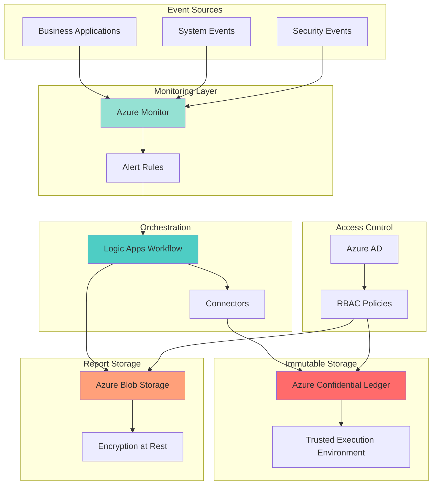

# Tamper-Proof Compliance Reporting with Confidential Ledger

## Problem

Organizations face increasing regulatory requirements to maintain tamper-proof audit trails and generate compliance reports for auditors. Traditional logging systems are vulnerable to tampering, lack cryptographic verification, and require manual compilation of audit reports, leading to compliance risks and operational overhead.

## Solution

Build an automated compliance reporting system using Azure Confidential Ledger for immutable audit logs, Azure Logic Apps for workflow orchestration, Azure Monitor for violation detection, and Azure Blob Storage for encrypted report storage. This creates a cryptographically secure, automated compliance infrastructure.

## Architecture Diagram



## Prerequisites

1. Azure subscription with appropriate permissions to create resources
2. Azure CLI v2 installed and configured (or Azure CloudShell)
3. Basic understanding of compliance requirements and audit trails
4. Familiarity with JSON and REST APIs
5. Estimated cost: $150-200/month (based on moderate usage)

> **Note**: Azure Confidential Ledger is now SOC 2 Type II compliant and generally available with pricing at ~$3/day per instance starting March 2025.

## Preparation

```bash
# Set environment variables for Azure resources
export RESOURCE_GROUP="rg-compliance-${RANDOM_SUFFIX}"
export LOCATION="eastus"
export SUBSCRIPTION_ID=$(az account show --query id --output tsv)

# Generate unique suffix for resource names
RANDOM_SUFFIX=$(openssl rand -hex 3)

# Create resource group
az group create \
    --name ${RESOURCE_GROUP} \
    --location ${LOCATION} \
    --tags purpose=compliance environment=demo

# Set additional environment variables
export ACL_NAME="acl-${RANDOM_SUFFIX}"
export STORAGE_ACCOUNT="stcompliance${RANDOM_SUFFIX}"
export LOGIC_APP_NAME="la-compliance-${RANDOM_SUFFIX}"
export WORKSPACE_NAME="law-compliance-${RANDOM_SUFFIX}"

echo "✅ Resource group created: ${RESOURCE_GROUP}"
```

## Steps

1. **Create Azure Confidential Ledger Instance**:

   Azure Confidential Ledger provides a tamper-proof, cryptographically verifiable data store running in hardware-backed secure enclaves. This ensures that audit logs cannot be modified even by privileged users or Microsoft, making it ideal for regulatory compliance scenarios where data integrity is paramount.

   ```bash
   # Create Confidential Ledger instance
   az confidentialledger create \
       --name ${ACL_NAME} \
       --resource-group ${RESOURCE_GROUP} \
       --location ${LOCATION} \
       --ledger-type Private
   
   # Get the ledger endpoint
   LEDGER_ENDPOINT=$(az confidentialledger show \
       --name ${ACL_NAME} \
       --resource-group ${RESOURCE_GROUP} \
       --query "properties.ledgerUri" \
       --output tsv)
   
   echo "✅ Confidential Ledger created: ${LEDGER_ENDPOINT}"
   ```

   The Confidential Ledger is now running in a Trusted Execution Environment (TEE), providing cryptographic guarantees that your audit data remains immutable and verifiable. This foundation ensures compliance with strict regulatory requirements for audit trail integrity.

2. **Configure Azure Monitor and Log Analytics**:

   Azure Monitor serves as the central nervous system for compliance monitoring, collecting events from various sources and triggering automated workflows when violations occur. The Log Analytics workspace provides powerful query capabilities for analyzing compliance patterns and generating insights.

   ```bash
   # Create Log Analytics workspace
   az monitor log-analytics workspace create \
       --name ${WORKSPACE_NAME} \
       --resource-group ${RESOURCE_GROUP} \
       --location ${LOCATION}
   
   # Get workspace ID for configuration
   WORKSPACE_ID=$(az monitor log-analytics workspace show \
       --name ${WORKSPACE_NAME} \
       --resource-group ${RESOURCE_GROUP} \
       --query id \
       --output tsv)
   
   # Create action group for alerts
   az monitor action-group create \
       --name ag-compliance \
       --resource-group ${RESOURCE_GROUP} \
       --short-name compliance
   
   echo "✅ Monitoring infrastructure configured"
   ```

3. **Deploy Storage Account for Compliance Reports**:

   Azure Blob Storage provides secure, encrypted storage for generated compliance reports. With built-in encryption at rest and integration with Azure AD for access control, it ensures that sensitive compliance documentation remains protected while being accessible to authorized auditors.

   ```bash
   # Create storage account with encryption
   az storage account create \
       --name ${STORAGE_ACCOUNT} \
       --resource-group ${RESOURCE_GROUP} \
       --location ${LOCATION} \
       --sku Standard_LRS \
       --encryption-services blob \
       --https-only true \
       --min-tls-version TLS1_2
   
   # Create container for compliance reports
   az storage container create \
       --name compliance-reports \
       --account-name ${STORAGE_ACCOUNT} \
       --auth-mode login \
       --public-access off
   
   # Enable blob versioning for audit trail
   az storage account blob-service-properties update \
       --account-name ${STORAGE_ACCOUNT} \
       --enable-versioning true
   
   echo "✅ Secure storage configured for compliance reports"
   ```

4. **Create Logic Apps Workflow for Automation**:

   Azure Logic Apps provides the orchestration layer that automates the entire compliance reporting process. It connects monitoring alerts to ledger recording, report generation, and distribution, eliminating manual processes while ensuring consistent, timely compliance reporting.

   ```bash
   # Create Logic App
   az logic workflow create \
       --name ${LOGIC_APP_NAME} \
       --resource-group ${RESOURCE_GROUP} \
       --location ${LOCATION} \
       --definition '{
         "definition": {
           "$schema": "https://schema.management.azure.com/providers/Microsoft.Logic/schemas/2016-06-01/workflowdefinition.json#",
           "actions": {},
           "contentVersion": "1.0.0.0",
           "outputs": {},
           "triggers": {}
         }
       }'
   
   # Get Logic App identity for RBAC
   LOGIC_APP_IDENTITY=$(az logic workflow show \
       --name ${LOGIC_APP_NAME} \
       --resource-group ${RESOURCE_GROUP} \
       --query identity.principalId \
       --output tsv)
   
   echo "✅ Logic App workflow created"
   ```

5. **Configure RBAC Permissions**:

   Role-Based Access Control (RBAC) ensures that only authorized services and users can access sensitive compliance data. By implementing least-privilege access, we maintain security boundaries while enabling automated workflows to function seamlessly across services.

   ```bash
   # Grant Logic App access to Confidential Ledger
   az role assignment create \
       --assignee ${LOGIC_APP_IDENTITY} \
       --role "Confidential Ledger Contributor" \
       --scope "/subscriptions/${SUBSCRIPTION_ID}/resourceGroups/${RESOURCE_GROUP}/providers/Microsoft.ConfidentialLedger/ledgers/${ACL_NAME}"
   
   # Grant Logic App access to Storage Account
   az role assignment create \
       --assignee ${LOGIC_APP_IDENTITY} \
       --role "Storage Blob Data Contributor" \
       --scope "/subscriptions/${SUBSCRIPTION_ID}/resourceGroups/${RESOURCE_GROUP}/providers/Microsoft.Storage/storageAccounts/${STORAGE_ACCOUNT}"
   
   # Grant Logic App access to Monitor
   az role assignment create \
       --assignee ${LOGIC_APP_IDENTITY} \
       --role "Monitoring Reader" \
       --resource-group ${RESOURCE_GROUP}
   
   echo "✅ RBAC permissions configured"
   ```

6. **Create Compliance Alert Rules**:

   Alert rules in Azure Monitor detect compliance violations in real-time by analyzing incoming event data against predefined criteria. These rules trigger the Logic Apps workflow, ensuring immediate response to compliance issues and maintaining continuous regulatory adherence.

   ```bash
   # Create sample compliance alert rule
   az monitor metrics alert create \
       --name alert-compliance-violation \
       --resource-group ${RESOURCE_GROUP} \
       --scopes ${WORKSPACE_ID} \
       --condition "avg Percentage CPU > 90" \
       --window-size 5m \
       --evaluation-frequency 1m \
       --action ag-compliance \
       --description "Compliance threshold violation detected"
   
   # Create log-based alert for security events
   az monitor scheduled-query rule create \
       --name alert-security-events \
       --resource-group ${RESOURCE_GROUP} \
       --location ${LOCATION} \
       --action ag-compliance \
       --condition 'count > 5' \
       --data-source ${WORKSPACE_ID} \
       --query 'SecurityEvent | where EventID == 4625'
   
   echo "✅ Compliance monitoring alerts configured"
   ```

7. **Configure Logic App Workflow Details**:

   The Logic App workflow orchestrates the complete compliance reporting lifecycle, from event detection to report generation. By integrating with multiple Azure services through managed connectors, it creates a seamless, automated compliance pipeline that scales with your organization's needs.

   ```bash
   # Update Logic App with compliance workflow
   WORKFLOW_DEFINITION=$(cat <<EOF
   {
     "definition": {
       "\$schema": "https://schema.management.azure.com/providers/Microsoft.Logic/schemas/2016-06-01/workflowdefinition.json#",
       "contentVersion": "1.0.0.0",
       "triggers": {
         "When_Alert_Triggered": {
           "type": "Request",
           "kind": "Http"
         }
       },
       "actions": {
         "Record_to_Ledger": {
           "type": "Http",
           "inputs": {
             "method": "POST",
             "uri": "${LEDGER_ENDPOINT}/app/transactions",
             "headers": {
               "Content-Type": "application/json"
             },
             "body": {
               "contents": "@{triggerBody()}"
             }
           }
         },
         "Generate_Report": {
           "type": "Compose",
           "inputs": {
             "timestamp": "@{utcNow()}",
             "alertData": "@{triggerBody()}",
             "ledgerResponse": "@{body('Record_to_Ledger')}"
           },
           "runAfter": {
             "Record_to_Ledger": ["Succeeded"]
           }
         },
         "Save_to_Blob": {
           "type": "ApiConnection",
           "inputs": {
             "host": {
               "connection": {
                 "name": "@parameters('\$connections')['azureblob']['connectionId']"
               }
             },
             "method": "post",
             "path": "/v2/datasets/@{encodeURIComponent('${STORAGE_ACCOUNT}')}/files",
             "body": "@{outputs('Generate_Report')}"
           },
           "runAfter": {
             "Generate_Report": ["Succeeded"]
           }
         }
       }
     }
   }
EOF
   )
   
   # Update Logic App with workflow
   az logic workflow update \
       --name ${LOGIC_APP_NAME} \
       --resource-group ${RESOURCE_GROUP} \
       --definition "${WORKFLOW_DEFINITION}"
   
   echo "✅ Compliance workflow automation configured"
   ```

   The workflow now automatically captures compliance events, records them immutably in the Confidential Ledger, generates structured reports, and stores them securely for audit purposes. This end-to-end automation reduces compliance overhead while ensuring regulatory requirements are consistently met.

## Validation & Testing

1. Verify Confidential Ledger is operational:

   ```bash
   # Check ledger status
   az confidentialledger show \
       --name ${ACL_NAME} \
       --resource-group ${RESOURCE_GROUP} \
       --query "properties.provisioningState" \
       --output tsv
   ```

   Expected output: `Succeeded`

2. Test Logic App workflow execution:

   ```bash
   # Get Logic App trigger URL
   TRIGGER_URL=$(az logic workflow show \
       --name ${LOGIC_APP_NAME} \
       --resource-group ${RESOURCE_GROUP} \
       --query "accessEndpoint" \
       --output tsv)
   
   # Send test compliance event
   curl -X POST ${TRIGGER_URL} \
       -H "Content-Type: application/json" \
       -d '{
         "alertType": "ComplianceViolation",
         "severity": "High",
         "description": "Test compliance event",
         "timestamp": "'$(date -u +"%Y-%m-%dT%H:%M:%SZ")'"
       }'
   ```

3. Verify report generation in Blob Storage:

   ```bash
   # List compliance reports
   az storage blob list \
       --container-name compliance-reports \
       --account-name ${STORAGE_ACCOUNT} \
       --output table
   ```

## Cleanup

1. Delete resource group and all contained resources:

   ```bash
   # Delete resource group and all contained resources
   az group delete \
       --name ${RESOURCE_GROUP} \
       --yes \
       --no-wait
   
   echo "✅ Resource group deletion initiated: ${RESOURCE_GROUP}"
   echo "Note: Deletion may take several minutes to complete"
   ```

2. Verify deletion (optional):

   ```bash
   az group exists --name ${RESOURCE_GROUP}
   ```

## Discussion

Azure Confidential Ledger represents a paradigm shift in compliance reporting by providing cryptographically verifiable, immutable audit trails that satisfy the most stringent regulatory requirements. Running in hardware-backed secure enclaves with a minimalistic Trusted Computing Base (TCB), it ensures that no entity—including cloud administrators—can tamper with recorded data. This aligns with the [Azure Well-Architected Framework](https://docs.microsoft.com/en-us/azure/architecture/framework/) security pillar by implementing defense-in-depth at the hardware level. For detailed implementation guidance, see the [Azure Confidential Ledger documentation](https://docs.microsoft.com/en-us/azure/confidential-ledger/).

The integration with Azure Logic Apps transforms manual compliance processes into automated, consistent workflows that scale effortlessly. Logic Apps' extensive connector ecosystem enables integration with existing enterprise systems while maintaining low-code simplicity. This approach follows the [Azure Integration Services best practices](https://docs.microsoft.com/en-us/azure/architecture/reference-architectures/enterprise-integration/basic-enterprise-integration) for building reliable, maintainable integration solutions. The serverless execution model ensures cost efficiency, charging only for actual workflow runs.

From a compliance perspective, this architecture addresses key regulatory challenges including data integrity, audit trail immutability, and automated reporting. The combination of Confidential Ledger's cryptographic guarantees and Logic Apps' workflow automation reduces compliance overhead while improving accuracy and timeliness. For organizations subject to regulations like SOX, HIPAA, or GDPR, this solution provides demonstrable evidence of compliance controls. Review the [Azure compliance documentation](https://docs.microsoft.com/en-us/azure/compliance/) for industry-specific guidance.

> **Tip**: Configure Azure Monitor workbooks to visualize compliance trends over time, helping identify patterns and proactively address potential violations before they occur. See the [Azure Monitor workbooks documentation](https://docs.microsoft.com/en-us/azure/azure-monitor/visualize/workbooks-overview) for creating custom compliance dashboards.

## Challenge

Extend this solution by implementing these enhancements:

1. Add Azure Key Vault integration to manage cryptographic keys for additional data encryption layers
2. Implement Azure Event Grid to enable real-time compliance event streaming to multiple subscribers
3. Create Power BI dashboards that connect to Blob Storage for interactive compliance reporting
4. Develop custom Logic Apps connectors for integration with third-party GRC (Governance, Risk, and Compliance) platforms
5. Implement multi-region replication for Confidential Ledger data to ensure global compliance coverage

## Infrastructure Code

*Infrastructure code will be generated after recipe approval.*