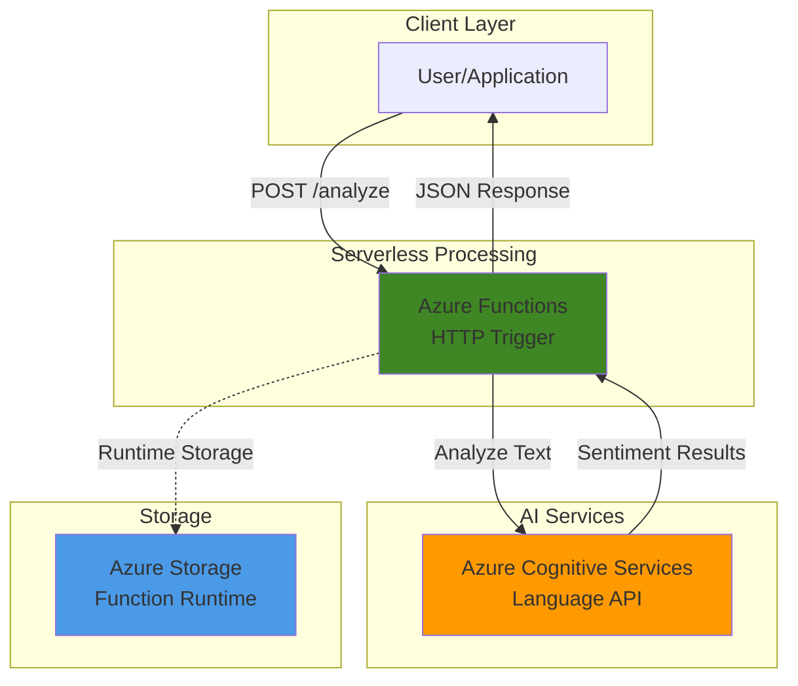

# Text Sentiment Analysis with Cognitive Services

## Problem

Organizations receive massive volumes of customer feedback through reviews, support tickets, and social media comments but lack efficient ways to understand sentiment at scale. Manual analysis is time-consuming and inconsistent, while traditional keyword-based approaches miss context and nuance, leading to missed opportunities for customer experience improvement and delayed responses to negative sentiment.

## Solution

Build a serverless sentiment analysis application using Azure Cognitive Services Language API for intelligent text processing and Azure Functions for scalable, event-driven architecture. This solution automatically analyzes text sentiment with confidence scores, providing real-time insights into customer opinions while leveraging Azure's managed AI services to handle complex natural language understanding tasks.

## Architecture Diagram



## Prerequisites

1. Azure account with appropriate permissions to create Cognitive Services and Functions resources
2. Azure CLI installed and configured (version 2.55.0 or later)
3. Azure Functions Core Tools (version 4.x) for local development
4. Basic understanding of REST APIs and JSON data structures
5. Familiarity with serverless computing concepts
6. Estimated cost: $0.50-$2.00 for testing (includes Function App consumption plan and Language API calls)

> **Note**: Azure Cognitive Services Language API provides 5,000 free transactions per month, making this recipe cost-effective for learning and small-scale applications.

## Preparation

```bash
# Set environment variables for Azure resources
export RESOURCE_GROUP="rg-sentiment-${RANDOM_SUFFIX}"
export LOCATION="eastus"
export SUBSCRIPTION_ID=$(az account show --query id --output tsv)

# Generate unique suffix for resource names
RANDOM_SUFFIX=$(openssl rand -hex 3)

# Create resource group
az group create \
    --name ${RESOURCE_GROUP} \
    --location ${LOCATION} \
    --tags purpose=recipe environment=demo

echo "✅ Resource group created: ${RESOURCE_GROUP}"

# Set additional environment variables
export LANGUAGE_SERVICE_NAME="lang-sentiment-${RANDOM_SUFFIX}"
export FUNCTION_APP_NAME="func-sentiment-${RANDOM_SUFFIX}"
export STORAGE_ACCOUNT_NAME="stsentiment${RANDOM_SUFFIX}"
```

## Steps

1. **Create Azure Cognitive Services Language Resource**:

   Azure AI Language provides advanced sentiment analysis capabilities with confidence scores and opinion mining features. The service uses machine learning models trained on diverse text data to identify positive, negative, neutral, and mixed sentiments at both document and sentence levels, enabling accurate understanding of customer opinions and feedback.

   ```bash
   # Create Cognitive Services Language resource
   az cognitiveservices account create \
       --name ${LANGUAGE_SERVICE_NAME} \
       --resource-group ${RESOURCE_GROUP} \
       --location ${LOCATION} \
       --kind TextAnalytics \
       --sku S0 \
       --custom-domain ${LANGUAGE_SERVICE_NAME} \
       --tags purpose=sentiment-analysis

   # Get the endpoint and key
   export LANGUAGE_ENDPOINT=$(az cognitiveservices account show \
       --name ${LANGUAGE_SERVICE_NAME} \
       --resource-group ${RESOURCE_GROUP} \
       --query properties.endpoint \
       --output tsv)

   export LANGUAGE_KEY=$(az cognitiveservices account keys list \
       --name ${LANGUAGE_SERVICE_NAME} \
       --resource-group ${RESOURCE_GROUP} \
       --query key1 \
       --output tsv)

   echo "✅ Language service created with endpoint: ${LANGUAGE_ENDPOINT}"
   ```

   The Language service is now configured with Standard pricing tier, providing 1,000 transactions per minute and enhanced accuracy for sentiment analysis. This setup enables production-ready text processing with automatic scaling and global availability across Azure regions.

2. **Create Storage Account for Function App**:

   Azure Functions requires a storage account for runtime operations, function metadata, and trigger management. This foundational component enables the serverless architecture to maintain state, handle execution context, and provide monitoring capabilities for your sentiment analysis function.

   ```bash
   # Create storage account for Functions
   az storage account create \
       --name ${STORAGE_ACCOUNT_NAME} \
       --resource-group ${RESOURCE_GROUP} \
       --location ${LOCATION} \
       --sku Standard_LRS \
       --kind StorageV2 \
       --access-tier Hot

   # Get storage connection string
   export STORAGE_CONNECTION=$(az storage account show-connection-string \
       --name ${STORAGE_ACCOUNT_NAME} \
       --resource-group ${RESOURCE_GROUP} \
       --query connectionString \
       --output tsv)

   echo "✅ Storage account created: ${STORAGE_ACCOUNT_NAME}"
   ```

   The storage account uses locally redundant storage (LRS) for cost optimization during development and testing. The Hot access tier ensures fast access to function metadata and runtime files while maintaining cost efficiency for serverless workloads.

3. **Create Azure Function App**:

   Azure Functions provides serverless compute platform that automatically scales based on demand, eliminating infrastructure management while ensuring cost-effective processing. The consumption plan charges only for function execution time, making it ideal for intermittent sentiment analysis workloads with variable traffic patterns.

   ```bash
   # Create Function App with Python runtime
   az functionapp create \
       --name ${FUNCTION_APP_NAME} \
       --resource-group ${RESOURCE_GROUP} \
       --storage-account ${STORAGE_ACCOUNT_NAME} \
       --consumption-plan-location ${LOCATION} \
       --runtime python \
       --runtime-version 3.11 \
       --functions-version 4 \
       --os-type Linux

   echo "✅ Function App created: ${FUNCTION_APP_NAME}"
   ```

   The Function App is configured with Python 3.11 runtime (currently GA) and Functions version 4, providing access to the latest Azure Functions features and Python SDK capabilities for seamless integration with Azure Cognitive Services and improved performance.

4. **Configure Function App Settings**:

   Application settings in Azure Functions act as environment variables, securely storing configuration values like API keys and endpoints. This approach follows Azure security best practices by separating configuration from code and enabling different settings across development, staging, and production environments.

   ```bash
   # Configure application settings
   az functionapp config appsettings set \
       --name ${FUNCTION_APP_NAME} \
       --resource-group ${RESOURCE_GROUP} \
       --settings \
           "LANGUAGE_ENDPOINT=${LANGUAGE_ENDPOINT}" \
           "LANGUAGE_KEY=${LANGUAGE_KEY}" \
           "FUNCTIONS_WORKER_RUNTIME=python"

   echo "✅ Function App configured with Language service settings"
   ```

   These settings are encrypted at rest and made available to your function code as environment variables. The separation of configuration from code enables secure deployment practices and easy management of different environments without code changes.

5. **Create the Sentiment Analysis Function**:

   The HTTP-triggered function processes text input and returns structured sentiment analysis results. Using Azure's Python SDK, the function leverages the Language service's advanced natural language processing capabilities to provide confidence scores, sentence-level analysis, and opinion mining for comprehensive text understanding.

   ```bash
   # Create local function project directory
   mkdir sentiment-function && cd sentiment-function

   # Initialize function project with Python runtime
   func init --worker-runtime python --model V2
   func new --name analyze_sentiment --template "HTTP trigger"

   echo "✅ Function project structure created"
   ```

   The function project uses the v2 programming model, which provides improved developer experience with decorators and simplified function definitions. This approach enables cleaner code structure and better integration with Azure services.

6. **Implement Sentiment Analysis Logic**:

   The function implementation uses the Azure AI Language SDK to perform sentiment analysis with advanced features like confidence scoring and opinion mining. The code handles error cases, validates input, and returns standardized JSON responses for consistent API behavior.

   ```bash
   # Create the function code
   cat > analyze_sentiment/function_app.py << 'EOF'
import azure.functions as func
import json
import logging
import os
from azure.ai.textanalytics import TextAnalyticsClient
from azure.core.credentials import AzureKeyCredential

app = func.FunctionApp(http_auth_level=func.AuthLevel.ANONYMOUS)

def get_text_analytics_client():
    """Initialize and return Text Analytics client"""
    endpoint = os.environ.get('LANGUAGE_ENDPOINT')
    key = os.environ.get('LANGUAGE_KEY')
    
    if not endpoint or not key:
        raise ValueError("Missing Language service configuration")
    
    credential = AzureKeyCredential(key)
    return TextAnalyticsClient(endpoint=endpoint, credential=credential)

@app.route(route="analyze", methods=["POST"])
def analyze_sentiment(req: func.HttpRequest) -> func.HttpResponse:
    """Analyze sentiment of input text"""
    try:
        # Parse request body
        req_body = req.get_json()
        if not req_body:
            return func.HttpResponse(
                json.dumps({"error": "Request body is required"}),
                status_code=400,
                mimetype="application/json"
            )
        
        # Validate input
        text = req_body.get('text', '').strip()
        if not text:
            return func.HttpResponse(
                json.dumps({"error": "Text field is required"}),
                status_code=400,
                mimetype="application/json"
            )
        
        # Initialize client and analyze sentiment
        client = get_text_analytics_client()
        documents = [text]
        
        # Perform sentiment analysis with opinion mining
        response = client.analyze_sentiment(
            documents=documents,
            show_opinion_mining=True
        )
        
        # Process results
        result = response[0]
        
        if result.is_error:
            return func.HttpResponse(
                json.dumps({"error": f"Analysis failed: {result.error}"}),
                status_code=500,
                mimetype="application/json"
            )
        
        # Format response
        sentiment_result = {
            "text": text,
            "sentiment": result.sentiment,
            "confidence_scores": {
                "positive": round(result.confidence_scores.positive, 3),
                "neutral": round(result.confidence_scores.neutral, 3),
                "negative": round(result.confidence_scores.negative, 3)
            },
            "sentences": []
        }
        
        # Add sentence-level analysis
        for sentence in result.sentences:
            sentence_data = {
                "text": sentence.text,
                "sentiment": sentence.sentiment,
                "confidence_scores": {
                    "positive": round(sentence.confidence_scores.positive, 3),
                    "neutral": round(sentence.confidence_scores.neutral, 3),
                    "negative": round(sentence.confidence_scores.negative, 3)
                }
            }
            sentiment_result["sentences"].append(sentence_data)
        
        return func.HttpResponse(
            json.dumps(sentiment_result, indent=2),
            status_code=200,
            mimetype="application/json"
        )
        
    except ValueError as ve:
        logging.error(f"Configuration error: {ve}")
        return func.HttpResponse(
            json.dumps({"error": "Service configuration error"}),
            status_code=500,
            mimetype="application/json"
        )
    except Exception as e:
        logging.error(f"Unexpected error: {e}")
        return func.HttpResponse(
            json.dumps({"error": "Internal server error"}),
            status_code=500,
            mimetype="application/json"
        )
EOF

   echo "✅ Function code created"
   ```

   The function uses proper error handling and logging to provide clear feedback for debugging and monitoring. The implementation follows Azure Functions best practices with efficient resource usage and comprehensive input validation for production readiness.

7. **Configure Dependencies**:

   The requirements.txt file specifies the Azure AI Language SDK and other dependencies needed for sentiment analysis. Using specific version pinning ensures consistent behavior across deployments while the azure-ai-textanalytics package provides the latest Language service features.

   ```bash
   # Create requirements file
   cat > requirements.txt << 'EOF'
azure-functions
azure-ai-textanalytics>=5.3.0
azure-core>=1.24.0
EOF

   echo "✅ Dependencies configured"
   ```

   These dependencies include the core Azure Functions runtime, the latest Text Analytics SDK with sentiment analysis capabilities, and Azure core libraries for authentication and service communication. Version constraints ensure compatibility and stability.

8. **Deploy Function to Azure**:

   The deployment process packages your function code and dependencies, uploads them to Azure, and configures the runtime environment. Azure handles the infrastructure provisioning, scaling configuration, and integration with the Language service automatically.

   ```bash
   # Deploy function to Azure
   func azure functionapp publish ${FUNCTION_APP_NAME}

   # Get function URL using correct syntax
   export FUNCTION_URL=$(az functionapp function show \
       --resource-group ${RESOURCE_GROUP} \
       --name ${FUNCTION_APP_NAME} \
       --function-name analyze_sentiment \
       --query invokeUrlTemplate \
       --output tsv)

   echo "✅ Function deployed successfully"
   echo "Function URL: ${FUNCTION_URL}"
   ```

   The deployment includes automatic dependency resolution, environment variable configuration, and health checks to ensure the function is ready to receive requests. The invoke URL provides the endpoint for calling your sentiment analysis API.

## Validation & Testing

1. **Test with Positive Sentiment**:

   ```bash
   # Test positive sentiment analysis
   curl -X POST "${FUNCTION_URL}" \
       -H "Content-Type: application/json" \
       -d '{
           "text": "I absolutely love this product! The quality is outstanding and customer service was excellent."
       }'
   ```

   Expected output: JSON response with sentiment "positive" and high positive confidence score (>0.8).

2. **Test with Negative Sentiment**:

   ```bash
   # Test negative sentiment analysis
   curl -X POST "${FUNCTION_URL}" \
       -H "Content-Type: application/json" \
       -d '{
           "text": "This service is terrible. I am very disappointed with the poor quality and slow response times."
       }'
   ```

   Expected output: JSON response with sentiment "negative" and high negative confidence score.

3. **Test with Mixed Sentiment**:

   ```bash
   # Test mixed sentiment analysis
   curl -X POST "${FUNCTION_URL}" \
       -H "Content-Type: application/json" \
       -d '{
           "text": "The product quality is excellent, but the delivery was delayed and packaging was damaged."
       }'
   ```

   Expected output: JSON response showing sentence-level sentiment analysis with mixed overall sentiment.

4. **Verify Function Logs**:

   ```bash
   # Stream function logs in real-time
   az functionapp logs tail \
       --name ${FUNCTION_APP_NAME} \
       --resource-group ${RESOURCE_GROUP}
   ```

   This command displays real-time execution logs to help debug issues and monitor function performance during testing.

## Cleanup

1. **Remove Resource Group**:

   ```bash
   # Delete resource group and all contained resources
   az group delete \
       --name ${RESOURCE_GROUP} \
       --yes \
       --no-wait

   echo "✅ Resource group deletion initiated: ${RESOURCE_GROUP}"
   echo "Note: Deletion may take several minutes to complete"
   ```

2. **Clean Local Files**:

   ```bash
   # Remove local function files
   cd .. && rm -rf sentiment-function

   # Clear environment variables
   unset RESOURCE_GROUP LOCATION LANGUAGE_SERVICE_NAME
   unset FUNCTION_APP_NAME STORAGE_ACCOUNT_NAME
   unset LANGUAGE_ENDPOINT LANGUAGE_KEY FUNCTION_URL

   echo "✅ Local cleanup completed"
   ```

## Discussion

This solution demonstrates the power of combining Azure's managed AI services with serverless computing to create scalable, cost-effective sentiment analysis applications. The Azure Cognitive Services Language API uses advanced machine learning models that can understand context, sarcasm, and nuanced expressions that traditional keyword-based approaches miss. With confidence scores ranging from 0 to 1, businesses can set thresholds for automated routing - for example, routing feedback with negative sentiment scores above 0.8 directly to customer service teams.

The serverless architecture with Azure Functions provides several key advantages for sentiment analysis workloads. The consumption plan ensures you only pay for actual usage, making it cost-effective for variable workloads like social media monitoring or customer feedback processing. Automatic scaling handles traffic spikes during product launches or viral social media events without manual intervention. The HTTP trigger pattern makes integration simple - any application can POST JSON data to analyze sentiment in real-time.

Azure's approach to sentiment analysis goes beyond simple positive/negative classification. The service provides sentence-level analysis, enabling applications to understand complex feedback like "The product quality is excellent, but shipping was slow." Opinion mining capabilities can identify specific aspects (product, shipping) and their associated sentiments, providing granular insights for business intelligence. According to [Microsoft's documentation](https://learn.microsoft.com/en-us/azure/ai-services/language-service/sentiment-opinion-mining/overview), the service achieves high accuracy in sentiment classification across multiple languages and domains.

For production deployments, consider implementing Azure Key Vault for secure credential management, Application Insights for comprehensive monitoring and analytics, and Azure API Management for rate limiting and API governance. The Language service supports batch processing for analyzing multiple documents simultaneously, improving efficiency for high-volume scenarios while following [Azure Well-Architected Framework](https://learn.microsoft.com/en-us/azure/architecture/framework/) principles.

> **Tip**: Use Azure Monitor and Application Insights to track sentiment analysis trends over time, enabling proactive customer experience management and early detection of product or service issues.

## Challenge

Extend this solution by implementing these enhancements:

1. **Multi-language Support**: Modify the function to detect input language automatically using the Language Detection API, then perform sentiment analysis in the detected language for global customer feedback processing.

2. **Batch Processing Integration**: Add Azure Service Bus queue integration to process multiple text documents asynchronously, enabling high-volume sentiment analysis for social media monitoring or survey responses.

3. **Real-time Dashboard**: Create a Power BI dashboard that visualizes sentiment trends over time, integrating with Azure Event Hubs for real-time data streaming and automated alerts for significant sentiment changes.

4. **Advanced Opinion Mining**: Enhance the function to extract and analyze specific aspects mentioned in text (product features, service quality, pricing) using the opinion mining capabilities for detailed business intelligence.

5. **Integration with Customer Systems**: Connect the sentiment analysis to CRM systems like Dynamics 365 or Salesforce, automatically updating customer records with sentiment scores and triggering workflows for negative feedback management.

## Infrastructure Code

### Available Infrastructure as Code:

- [Infrastructure Code Overview](code/README.md) - Detailed description of all infrastructure components
- [Bicep](code/bicep/) - Azure Bicep templates
- [Bash CLI Scripts](code/scripts/) - Example bash scripts using Azure CLI commands to deploy infrastructure
- [Terraform](code/terraform/) - Terraform configuration files