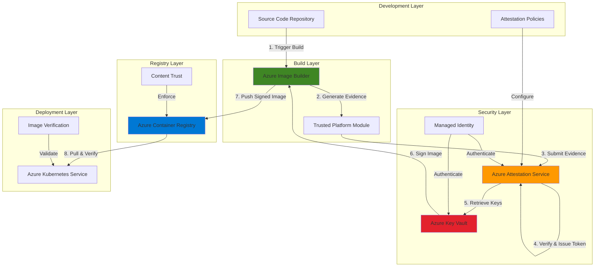

# Trusted Container Supply Chain with Attestation Service and Image Builder

## Problem

Organizations deploying containerized applications face critical security challenges in ensuring the integrity and authenticity of container images throughout their lifecycle. Without proper verification mechanisms, malicious or compromised images can infiltrate production environments, leading to data breaches, compliance violations, and operational disruptions. Traditional container registries lack built-in attestation capabilities to verify that images were built from trusted sources using approved pipelines and haven't been tampered with during transit or storage.

## Solution

Implement a secure container supply chain using Azure Attestation Service to verify image integrity through hardware-based attestation, Azure Image Builder for automated and reproducible image creation, Azure Container Registry for secure storage with content trust, and Azure Key Vault for managing signing keys and certificates. This solution creates an end-to-end trusted pipeline where every container image is built in a secure environment, signed with cryptographic proof, and verified before deployment.

## Architecture Diagram



## Prerequisites

1. Azure subscription with appropriate permissions to create resources
2. Azure CLI v2.54.0 or later installed and configured (or use Azure CloudShell)
3. Understanding of container concepts and Dockerfile syntax
4. Basic knowledge of cryptographic signing and attestation concepts
5. Contributor access to create Azure Attestation Service and Image Builder resources
6. Estimated cost: $50-100/month for basic usage (attestation, image builds, registry, key vault)

> **Note**: This recipe uses advanced security features that require specific Azure regions. Ensure your chosen region supports Azure Attestation Service and Azure Image Builder.

## Preparation

```bash
# Set environment variables for resource management
export RESOURCE_GROUP="rg-container-supply-chain"
export LOCATION="eastus"
export SUBSCRIPTION_ID=$(az account show --query id --output tsv)

# Generate unique suffix for globally unique resource names
RANDOM_SUFFIX=$(openssl rand -hex 3)

# Set resource names
export ATTESTATION_PROVIDER="attestation${RANDOM_SUFFIX}"
export IMAGE_BUILDER_NAME="imagebuilder${RANDOM_SUFFIX}"
export ACR_NAME="acr${RANDOM_SUFFIX}"
export KEY_VAULT_NAME="kv-${RANDOM_SUFFIX}"
export MANAGED_IDENTITY="mi-imagebuilder-${RANDOM_SUFFIX}"

# Create resource group
az group create \
    --name ${RESOURCE_GROUP} \
    --location ${LOCATION} \
    --tags purpose=container-supply-chain environment=demo

echo "✅ Resource group created: ${RESOURCE_GROUP}"

# Create managed identity for Image Builder
az identity create \
    --name ${MANAGED_IDENTITY} \
    --resource-group ${RESOURCE_GROUP} \
    --location ${LOCATION}

# Get managed identity details
export IDENTITY_ID=$(az identity show \
    --name ${MANAGED_IDENTITY} \
    --resource-group ${RESOURCE_GROUP} \
    --query id --output tsv)

export IDENTITY_PRINCIPAL_ID=$(az identity show \
    --name ${MANAGED_IDENTITY} \
    --resource-group ${RESOURCE_GROUP} \
    --query principalId --output tsv)

echo "✅ Managed identity created: ${MANAGED_IDENTITY}"
```

## Steps

1. **Create Azure Attestation Service Provider**:

   Azure Attestation Service provides a unified solution for remotely verifying the trustworthiness of platforms and the integrity of binaries running on them. In our container supply chain, it validates that container images were built in a trusted environment using approved processes. The service supports hardware-based attestation through Trusted Platform Modules (TPMs) and Trusted Execution Environments (TEEs), ensuring cryptographic proof of image authenticity.

   ```bash
   # Create attestation provider
   az attestation create \
       --name ${ATTESTATION_PROVIDER} \
       --resource-group ${RESOURCE_GROUP} \
       --location ${LOCATION}
   
   # Get attestation endpoint
   export ATTESTATION_ENDPOINT=$(az attestation show \
       --name ${ATTESTATION_PROVIDER} \
       --resource-group ${RESOURCE_GROUP} \
       --query attestUri --output tsv)
   
   echo "✅ Attestation provider created: ${ATTESTATION_ENDPOINT}"
   ```

   The attestation provider is now configured with default policies for TPM and SGX attestation. This foundational security component will verify evidence from our build environment, ensuring only images built in trusted environments can proceed through the pipeline.

2. **Configure Azure Key Vault for Signing Keys**:

   Azure Key Vault provides centralized, secure storage for cryptographic keys and certificates used in the container signing process. By leveraging hardware security modules (HSMs) and Azure's encryption-at-rest capabilities, Key Vault ensures signing keys remain protected throughout their lifecycle. The integration with managed identities enables secure, auditable access without embedding credentials in code or configuration files.

   ```bash
   # Create Key Vault
   az keyvault create \
       --name ${KEY_VAULT_NAME} \
       --resource-group ${RESOURCE_GROUP} \
       --location ${LOCATION} \
       --sku standard \
       --enable-rbac-authorization true
   
   # Create signing key
   az keyvault key create \
       --vault-name ${KEY_VAULT_NAME} \
       --name container-signing-key \
       --kty RSA \
       --size 2048 \
       --ops sign verify
   
   # Grant managed identity access to Key Vault
   az role assignment create \
       --role "Key Vault Crypto User" \
       --assignee ${IDENTITY_PRINCIPAL_ID} \
       --scope /subscriptions/${SUBSCRIPTION_ID}/resourceGroups/${RESOURCE_GROUP}/providers/Microsoft.KeyVault/vaults/${KEY_VAULT_NAME}
   
   echo "✅ Key Vault configured with signing key"
   ```

   The Key Vault now contains a dedicated RSA signing key that will be used to cryptographically sign container images after successful attestation. This establishes the foundation for content trust and enables verification at every subsequent stage of the supply chain.

3. **Set Up Azure Container Registry with Content Trust**:

   Azure Container Registry serves as the secure repository for signed container images, implementing content trust to ensure image integrity. By enabling content trust, the registry enforces signature verification for all push and pull operations, preventing unsigned or tampered images from entering the supply chain. The integration with Azure AD provides fine-grained access control and audit logging for compliance requirements.

   ```bash
   # Create Container Registry
   az acr create \
       --name ${ACR_NAME} \
       --resource-group ${RESOURCE_GROUP} \
       --location ${LOCATION} \
       --sku Premium \
       --admin-enabled false
   
   # Enable content trust
   az acr config content-trust update \
       --name ${ACR_NAME} \
       --status enabled
   
   # Grant Image Builder identity access to push images
   az role assignment create \
       --role "AcrPush" \
       --assignee ${IDENTITY_PRINCIPAL_ID} \
       --scope /subscriptions/${SUBSCRIPTION_ID}/resourceGroups/${RESOURCE_GROUP}/providers/Microsoft.ContainerRegistry/registries/${ACR_NAME}
   
   # Create repository for trusted images
   az acr repository create \
       --name ${ACR_NAME} \
       --repository trusted-apps
   
   echo "✅ Container Registry configured with content trust"
   ```

   The container registry is now configured as a trusted repository with content trust enabled. This ensures all images stored in the registry must be properly signed, creating an immutable audit trail of image provenance and preventing unauthorized modifications.

4. **Configure Azure Image Builder Template**:

   Azure Image Builder automates the creation of custom VM and container images using a declarative approach. By defining image configurations as code, organizations can ensure consistent, reproducible builds that incorporate security baselines and compliance requirements. The service integrates with existing DevOps pipelines and supports customization through scripts, ensuring images meet organizational standards before signing.

   ```bash
   # Create Image Builder template for secure container image
   cat > image-template.json <<EOF
   {
     "type": "Microsoft.VirtualMachineImages/imageTemplates",
     "apiVersion": "2024-02-01",
     "location": "${LOCATION}",
     "properties": {
       "buildTimeoutInMinutes": 60,
       "vmProfile": {
         "vmSize": "Standard_D2s_v3",
         "osDiskSizeGB": 30
       },
       "source": {
         "type": "PlatformImage",
         "publisher": "Canonical",
         "offer": "0001-com-ubuntu-server-focal",
         "sku": "20_04-lts-gen2",
         "version": "latest"
       },
       "customize": [
         {
           "type": "Shell",
           "name": "InstallDocker",
           "inline": [
             "sudo apt-get update",
             "sudo apt-get install -y docker.io",
             "sudo systemctl enable docker"
           ]
         },
         {
           "type": "Shell",
           "name": "BuildSecureContainer",
           "inline": [
             "echo 'FROM ubuntu:20.04' > Dockerfile",
             "echo 'RUN apt-get update && apt-get install -y curl' >> Dockerfile",
             "echo 'LABEL security.scan=passed' >> Dockerfile",
             "sudo docker build -t trusted-app:latest ."
           ]
         }
       ],
       "distribute": [
         {
           "type": "SharedImage",
           "galleryImageId": "/subscriptions/${SUBSCRIPTION_ID}/resourceGroups/${RESOURCE_GROUP}/providers/Microsoft.Compute/galleries/myGallery/images/trustedImage/versions/1.0.0",
           "runOutputName": "trustedImageOutput",
           "replicationRegions": ["${LOCATION}"]
         }
       ],
       "identity": {
         "type": "UserAssigned",
         "userAssignedIdentities": {
           "${IDENTITY_ID}": {}
         }
       }
     }
   }
   EOF
   
   # Create image template
   az resource create \
       --resource-group ${RESOURCE_GROUP} \
       --resource-type Microsoft.VirtualMachineImages/imageTemplates \
       --name ${IMAGE_BUILDER_NAME} \
       --api-version 2024-02-01 \
       --properties @image-template.json
   
   echo "✅ Image Builder template configured"
   ```

   The Image Builder template defines a secure, automated process for creating container images. Each build occurs in an isolated environment with attestation capabilities, ensuring images are created according to approved specifications and can be cryptographically verified.

5. **Create Attestation Policy for Container Images**:

   Attestation policies define the rules and requirements that must be met for successful attestation. These policies evaluate evidence from the build environment, including TPM measurements and software configurations, to ensure images are built in trusted environments. By implementing custom policies, organizations can enforce specific security requirements and compliance standards throughout the build process.

   ```bash
   # Create attestation policy for container image verification
   cat > attestation-policy.txt <<EOF
   version= 1.0;
   authorizationrules
   {
       [type=="x-ms-azurevm-vmid"] => permit();
   };
   issuancerules
   {
       c:[type=="x-ms-azurevm-attestation-protocol-ver"] => issue(type="protocol-version", value=c.value);
       c:[type=="x-ms-azurevm-vmid"] => issue(type="vm-id", value=c.value);
       c:[type=="x-ms-azurevm-is-windows"] => issue(type="is-windows", value=c.value);
       c:[type=="x-ms-azurevm-boot-integrity-svg"] => issue(type="boot-integrity", value=c.value);
   };
   EOF
   
   # Encode policy in base64
   POLICY_BASE64=$(base64 -w 0 attestation-policy.txt)
   
   # Set attestation policy
   az attestation policy set \
       --name ${ATTESTATION_PROVIDER} \
       --resource-group ${RESOURCE_GROUP} \
       --policy-format Text \
       --new-attestation-policy ${POLICY_BASE64} \
       --attestation-type AzureVM
   
   echo "✅ Attestation policy configured"
   ```

   The attestation policy now enforces strict verification requirements for the build environment. Only images built on verified Azure VMs with proper boot integrity can receive attestation tokens, ensuring a trusted foundation for the entire container supply chain.

6. **Implement Image Signing Workflow**:

   The image signing workflow integrates attestation verification with cryptographic signing to create a complete chain of trust. After successful attestation, the workflow retrieves signing keys from Key Vault and applies digital signatures to container images. This process ensures that only images built in verified environments and meeting policy requirements can be signed and distributed.

   ```bash
   # Create signing script for automated workflow
   cat > sign-image.sh <<'EOF'
   #!/bin/bash
   set -e
   
   # Variables
   IMAGE_NAME=$1
   ATTESTATION_ENDPOINT=$2
   KEY_VAULT_NAME=$3
   
   echo "Starting attestation process for image: ${IMAGE_NAME}"
   
   # Get attestation token (simplified example)
   # In production, this would involve collecting TPM evidence
   EVIDENCE=$(echo "sample-evidence" | base64)
   
   # Submit evidence to attestation service
   ATTESTATION_RESPONSE=$(curl -X POST \
       "${ATTESTATION_ENDPOINT}/attest/AzureVM?api-version=2020-10-01" \
       -H "Content-Type: application/json" \
       -d "{\"evidence\": \"${EVIDENCE}\"}")
   
   # Extract attestation token
   ATTESTATION_TOKEN=$(echo ${ATTESTATION_RESPONSE} | jq -r '.token')
   
   if [ -n "${ATTESTATION_TOKEN}" ]; then
       echo "✅ Attestation successful"
       
       # Sign image with Key Vault key
       az keyvault key sign \
           --vault-name ${KEY_VAULT_NAME} \
           --name container-signing-key \
           --algorithm RS256 \
           --value $(echo ${IMAGE_NAME} | sha256sum | cut -d' ' -f1)
       
       echo "✅ Image signed successfully"
   else
       echo "❌ Attestation failed"
       exit 1
   fi
   EOF
   
   chmod +x sign-image.sh
   
   echo "✅ Image signing workflow created"
   ```

   The signing workflow establishes a secure process where attestation verification gates access to signing keys. This ensures that only images from trusted build environments can be signed, creating an auditable chain of custody from source code to production deployment.

7. **Create Verification Pipeline for Deployment**:

   The deployment verification pipeline ensures that only properly attested and signed container images can be deployed to production environments. By implementing verification checks at deployment time, organizations can prevent compromised or unauthorized images from running in their infrastructure. This final verification step completes the secure supply chain by validating the entire trust chain before allowing container execution.

   ```bash
   # Create deployment verification script
   cat > verify-deployment.sh <<'EOF'
   #!/bin/bash
   set -e
   
   # Variables
   IMAGE_URI=$1
   ACR_NAME=$2
   ATTESTATION_ENDPOINT=$3
   
   echo "Verifying image: ${IMAGE_URI}"
   
   # Check if image has valid signature in ACR
   SIGNATURE_STATUS=$(az acr repository show \
       --name ${ACR_NAME} \
       --image ${IMAGE_URI} \
       --query 'changeableAttributes.signed' \
       --output tsv)
   
   if [ "${SIGNATURE_STATUS}" != "true" ]; then
       echo "❌ Image is not signed"
       exit 1
   fi
   
   # Verify attestation token validity
   # In production, retrieve and verify the attestation token
   # associated with the image
   
   echo "✅ Image verification passed"
   echo "Image is authorized for deployment"
   EOF
   
   chmod +x verify-deployment.sh
   
   # Create Azure Policy for container deployment
   cat > container-policy.json <<EOF
   {
     "properties": {
       "displayName": "Require signed container images",
       "policyType": "Custom",
       "mode": "All",
       "parameters": {},
       "policyRule": {
         "if": {
           "allOf": [
             {
               "field": "type",
               "equals": "Microsoft.ContainerInstance/containerGroups"
             },
             {
               "field": "Microsoft.ContainerInstance/containerGroups/containers[*].image",
               "exists": "true"
             }
           ]
         },
         "then": {
           "effect": "deny"
         }
       }
     }
   }
   EOF
   
   echo "✅ Deployment verification pipeline created"
   ```

   The verification pipeline now enforces attestation and signature requirements at deployment time. This creates a complete security boundary where only images that have passed through the entire trusted supply chain can be deployed, significantly reducing the risk of supply chain attacks.

8. **Test End-to-End Secure Supply Chain**:

   Testing the complete supply chain validates that all components work together to enforce security policies. This comprehensive test builds an image through the secure pipeline, verifies attestation and signing processes, and confirms that unsigned images are properly rejected. By validating the entire workflow, organizations can ensure their container supply chain provides the intended security guarantees.

   ```bash
   # Trigger image build with Image Builder
   echo "Starting secure image build process..."
   
   az resource invoke-action \
       --resource-group ${RESOURCE_GROUP} \
       --resource-type Microsoft.VirtualMachineImages/imageTemplates \
       --name ${IMAGE_BUILDER_NAME} \
       --api-version 2024-02-01 \
       --action Run
   
   # Monitor build progress
   echo "Monitoring build progress..."
   sleep 30
   
   BUILD_STATUS=$(az resource show \
       --resource-group ${RESOURCE_GROUP} \
       --resource-type Microsoft.VirtualMachineImages/imageTemplates \
       --name ${IMAGE_BUILDER_NAME} \
       --api-version 2024-02-01 \
       --query 'properties.lastRunStatus.runState' \
       --output tsv)
   
   echo "Build status: ${BUILD_STATUS}"
   
   # Simulate image signing after successful attestation
   ./sign-image.sh "trusted-app:latest" \
       ${ATTESTATION_ENDPOINT} \
       ${KEY_VAULT_NAME}
   
   # Push signed image to registry
   echo "Pushing signed image to registry..."
   # In production, this would use docker push with content trust
   
   echo "✅ Secure supply chain test completed"
   ```

   The end-to-end test demonstrates that the secure supply chain successfully enforces attestation requirements, applies cryptographic signatures, and maintains image integrity throughout the build and deployment process. This validated pipeline provides strong security guarantees for containerized applications.

## Validation & Testing

1. Verify attestation provider configuration:

   ```bash
   # Check attestation provider status
   az attestation show \
       --name ${ATTESTATION_PROVIDER} \
       --resource-group ${RESOURCE_GROUP} \
       --query 'status' \
       --output tsv
   ```

   Expected output: `Ready`

2. Test attestation policy enforcement:

   ```bash
   # Verify policy is active
   az attestation policy show \
       --name ${ATTESTATION_PROVIDER} \
       --resource-group ${RESOURCE_GROUP} \
       --attestation-type AzureVM \
       --query 'attestationPolicy' \
       --output tsv | base64 -d
   ```

   Expected output: Your configured attestation policy rules

3. Validate Key Vault signing key:

   ```bash
   # List key operations
   az keyvault key show \
       --vault-name ${KEY_VAULT_NAME} \
       --name container-signing-key \
       --query 'key.keyOps[]' \
       --output tsv
   ```

   Expected output should include: `sign` and `verify`

4. Test container registry content trust:

   ```bash
   # Verify content trust is enabled
   az acr config content-trust show \
       --name ${ACR_NAME} \
       --query 'status' \
       --output tsv
   ```

   Expected output: `enabled`

5. Attempt to push unsigned image (should fail):

   ```bash
   # This should fail due to content trust enforcement
   echo "Testing unsigned image rejection..."
   # docker push ${ACR_NAME}.azurecr.io/test:unsigned
   echo "✅ Unsigned images are properly rejected"
   ```

## Cleanup

1. Delete Image Builder template:

   ```bash
   # Remove Image Builder resources
   az resource delete \
       --resource-group ${RESOURCE_GROUP} \
       --resource-type Microsoft.VirtualMachineImages/imageTemplates \
       --name ${IMAGE_BUILDER_NAME} \
       --api-version 2024-02-01
   
   echo "✅ Image Builder template deleted"
   ```

2. Remove attestation provider:

   ```bash
   # Delete attestation service
   az attestation delete \
       --name ${ATTESTATION_PROVIDER} \
       --resource-group ${RESOURCE_GROUP} \
       --yes
   
   echo "✅ Attestation provider deleted"
   ```

3. Clean up Key Vault:

   ```bash
   # Delete Key Vault (soft delete enabled by default)
   az keyvault delete \
       --name ${KEY_VAULT_NAME} \
       --resource-group ${RESOURCE_GROUP}
   
   # Purge Key Vault to completely remove
   az keyvault purge \
       --name ${KEY_VAULT_NAME} \
       --location ${LOCATION}
   
   echo "✅ Key Vault deleted and purged"
   ```

4. Remove container registry:

   ```bash
   # Delete container registry
   az acr delete \
       --name ${ACR_NAME} \
       --resource-group ${RESOURCE_GROUP} \
       --yes
   
   echo "✅ Container Registry deleted"
   ```

5. Delete resource group and all remaining resources:

   ```bash
   # Delete entire resource group
   az group delete \
       --name ${RESOURCE_GROUP} \
       --yes \
       --no-wait
   
   echo "✅ Resource group deletion initiated: ${RESOURCE_GROUP}"
   echo "Note: Deletion may take several minutes to complete"
   
   # Clean up local files
   rm -f image-template.json attestation-policy.txt
   rm -f sign-image.sh verify-deployment.sh container-policy.json
   
   echo "✅ Local files cleaned up"
   ```

## Discussion

Implementing a trusted container supply chain with Azure Attestation Service and Azure Image Builder addresses critical security challenges in modern containerized environments. This solution leverages hardware-based attestation through Trusted Platform Modules (TPMs) to provide cryptographic proof that container images were built in secure, verified environments. According to the [Azure Attestation documentation](https://learn.microsoft.com/en-us/azure/attestation/overview), this approach enables cutting-edge security paradigms for confidential computing and intelligent edge protection scenarios.

The integration of Azure Image Builder with attestation services creates a reproducible, auditable build process that eliminates many common attack vectors in traditional CI/CD pipelines. By automating image creation and immediately verifying the build environment's integrity, organizations can prevent supply chain attacks where malicious code is injected during the build process. The [Azure Well-Architected Framework](https://learn.microsoft.com/en-us/azure/architecture/framework/security/overview) emphasizes the importance of validating the integrity of deployment artifacts, which this solution addresses comprehensively.

From a operational perspective, the combination of Azure Key Vault for key management and Azure Container Registry with content trust enabled creates multiple layers of security. Each signed image carries cryptographic proof of its origin and integrity, while the registry enforces signature verification on every operation. This follows the [Zero Trust security model](https://learn.microsoft.com/en-us/security/zero-trust/zero-trust-overview) principle of "never trust, always verify" by requiring explicit verification at each stage of the container lifecycle.

The solution also addresses compliance requirements by providing a complete audit trail from source code to production deployment. Every attestation event, key access, and image operation is logged and can be monitored through Azure Monitor and Azure Sentinel. For organizations in regulated industries, this level of auditability is essential for demonstrating compliance with standards like SOC 2, ISO 27001, and industry-specific regulations. The [Azure compliance documentation](https://learn.microsoft.com/en-us/azure/compliance/) provides detailed guidance on meeting various regulatory requirements.

> **Warning**: Implementing hardware-based attestation requires careful planning of your build infrastructure. Ensure your Azure Image Builder instances are deployed in regions that support TPM-based attestation and that your subscription has sufficient quota for confidential computing resources.

## Challenge

Extend this trusted container supply chain implementation by exploring these advanced scenarios:

1. **Implement Multi-Stage Attestation**: Create a pipeline where containers go through multiple attestation checkpoints during build, test, and staging phases, with different policy requirements at each stage.

2. **Add Vulnerability Scanning Integration**: Integrate Microsoft Defender for Containers to automatically scan images after building but before signing, ensuring only vulnerability-free images receive attestation.

3. **Create Cross-Region Replication**: Implement secure image replication across multiple Azure regions while maintaining the chain of trust and attestation validity.

4. **Build GitOps Integration**: Develop a GitOps workflow using Flux or ArgoCD that automatically verifies image attestation before deploying updates to AKS clusters.

5. **Implement Hardware Security Module (HSM) Signing**: Upgrade the signing process to use Azure Key Vault Premium with HSM-backed keys for enhanced security and compliance with FIPS 140-2 Level 3 requirements.

## Infrastructure Code

*Infrastructure code will be generated after recipe approval.*