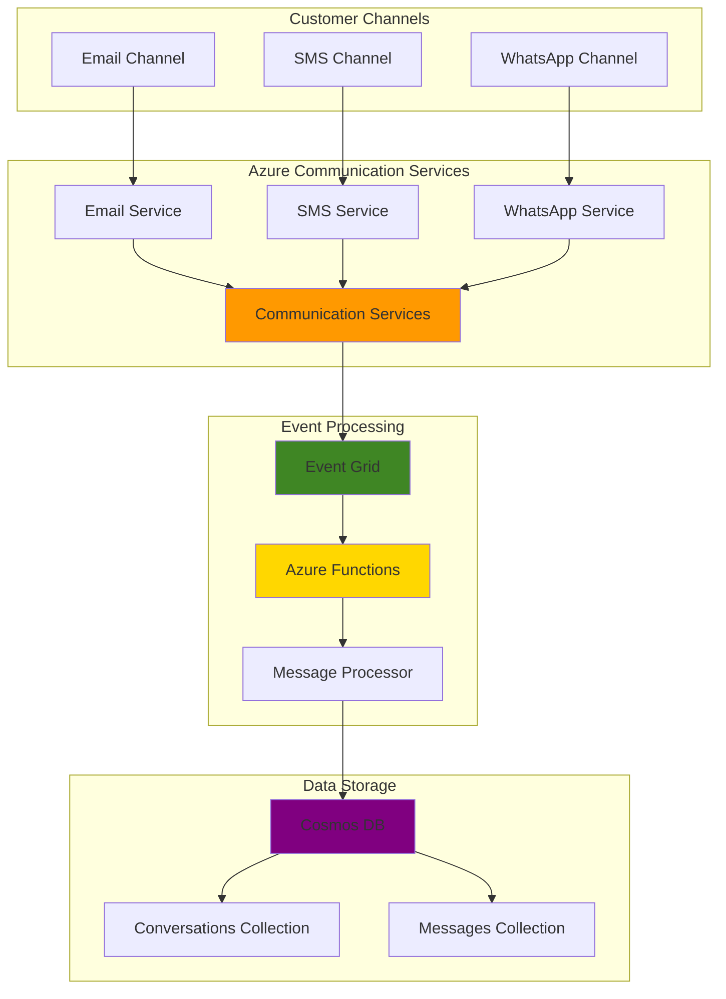

# Unified Customer Communication Platform with Event-Driven Messaging

## Problem

Modern businesses require comprehensive customer communication platforms that can handle multiple messaging channels including email, SMS, and WhatsApp messaging through a unified interface. Traditional communication systems often operate in silos, making it difficult to track customer interactions across different channels and provide consistent service experiences. Organizations struggle with manually managing communication workflows, tracking message delivery status, and maintaining conversation context across multiple touchpoints.

## Solution

This solution creates an event-driven customer communication platform using Azure Communication Services for multi-channel messaging capabilities, Azure Event Grid for real-time event processing, and Azure Functions for automated workflow orchestration. The platform automatically routes messages, tracks delivery status, and maintains conversation history in Azure Cosmos DB, providing a unified communication experience across email, SMS, and WhatsApp channels.

## Architecture Diagram



## Prerequisites

1. Azure account with appropriate permissions for Communication Services, Event Grid, Functions, and Cosmos DB
2. Azure CLI v2 installed and configured (or Azure CloudShell)
3. Basic knowledge of event-driven architectures and messaging patterns
4. Understanding of Azure Functions development and deployment
5. Familiarity with Azure Cosmos DB operations and data modeling
6. Estimated cost: $50-100/month for development and testing (varies based on message volume)

> **Note**: Azure Communication Services pricing varies by message volume and channel type. Review the [Azure Communication Services pricing page](https://azure.microsoft.com/pricing/details/communication-services/) for detailed cost information.

## Preparation

```bash
# Set environment variables
export RESOURCE_GROUP="rg-multi-channel-comms"
export LOCATION="eastus"
export SUBSCRIPTION_ID=$(az account show --query id --output tsv)

# Generate unique suffix for resource names
RANDOM_SUFFIX=$(openssl rand -hex 3)
export COMM_SERVICE_NAME="acs-platform-${RANDOM_SUFFIX}"
export EVENTGRID_TOPIC_NAME="eg-comms-events-${RANDOM_SUFFIX}"
export FUNCTION_APP_NAME="func-comms-processor-${RANDOM_SUFFIX}"
export COSMOS_ACCOUNT_NAME="cosmos-comms-${RANDOM_SUFFIX}"
export STORAGE_ACCOUNT_NAME="stacomms${RANDOM_SUFFIX}"

# Create resource group
az group create \
    --name ${RESOURCE_GROUP} \
    --location ${LOCATION} \
    --tags purpose=multi-channel-comms environment=development

echo "✅ Resource group created: ${RESOURCE_GROUP}"
```

## Steps

1. **Create Azure Communication Services Resource**:

   Azure Communication Services provides the foundational infrastructure for multi-channel customer communication, enabling businesses to integrate email, SMS, and WhatsApp messaging capabilities into their applications. The service handles the complex protocols and carrier integrations required for reliable message delivery across different communication channels, while providing unified APIs for consistent development experience.

   ```bash
   # Create Communication Services resource
   az communication create \
       --name ${COMM_SERVICE_NAME} \
       --resource-group ${RESOURCE_GROUP} \
       --location ${LOCATION} \
       --data-location "UnitedStates"
   
   # Get connection string for the Communication Services resource
   COMM_CONNECTION_STRING=$(az communication list-key \
       --name ${COMM_SERVICE_NAME} \
       --resource-group ${RESOURCE_GROUP} \
       --query primaryConnectionString \
       --output tsv)
   
   echo "✅ Communication Services resource created: ${COMM_SERVICE_NAME}"
   ```

   The Communication Services resource is now provisioned with multi-channel messaging capabilities. This foundational service provides the unified API endpoints and authentication mechanisms needed for sending and receiving messages across email, SMS, and WhatsApp channels, while maintaining consistent security and compliance standards.

2. **Create Azure Cosmos DB Database for Message Storage**:

   Azure Cosmos DB provides globally distributed, multi-model database capabilities ideal for storing conversation history and message metadata. The NoSQL document model naturally accommodates the varied message structures from different communication channels, while the global distribution ensures low-latency access to conversation data regardless of geographic location.

   ```bash
   # Create Cosmos DB account
   az cosmosdb create \
       --name ${COSMOS_ACCOUNT_NAME} \
       --resource-group ${RESOURCE_GROUP} \
       --location ${LOCATION} \
       --default-consistency-level "Session" \
       --locations regionName=${LOCATION} failoverPriority=0
   
   # Create database for communication platform
   az cosmosdb sql database create \
       --account-name ${COSMOS_ACCOUNT_NAME} \
       --resource-group ${RESOURCE_GROUP} \
       --name "CommunicationPlatform"
   
   # Create containers for conversations and messages
   az cosmosdb sql container create \
       --account-name ${COSMOS_ACCOUNT_NAME} \
       --resource-group ${RESOURCE_GROUP} \
       --database-name "CommunicationPlatform" \
       --name "Conversations" \
       --partition-key-path "/customerId"
   
   az cosmosdb sql container create \
       --account-name ${COSMOS_ACCOUNT_NAME} \
       --resource-group ${RESOURCE_GROUP} \
       --database-name "CommunicationPlatform" \
       --name "Messages" \
       --partition-key-path "/conversationId"
   
   # Get Cosmos DB connection string
   COSMOS_CONNECTION_STRING=$(az cosmosdb keys list \
       --name ${COSMOS_ACCOUNT_NAME} \
       --resource-group ${RESOURCE_GROUP} \
       --type connection-strings \
       --query "connectionStrings[0].connectionString" \
       --output tsv)
   
   echo "✅ Cosmos DB account and containers created: ${COSMOS_ACCOUNT_NAME}"
   ```

   The Cosmos DB database is now configured with optimized containers for conversation and message storage. The partition key strategy ensures efficient querying and scaling, while the session consistency level provides the right balance between performance and data consistency for real-time messaging applications.

3. **Create Event Grid Topic for Communication Events**:

   Azure Event Grid enables event-driven architecture by providing reliable event delivery and routing capabilities. Creating a custom topic allows the communication platform to publish events for message status changes, delivery confirmations, and customer interactions, enabling downstream systems to react to communication events in real-time.

   ```bash
   # Create Event Grid topic
   az eventgrid topic create \
       --name ${EVENTGRID_TOPIC_NAME} \
       --resource-group ${RESOURCE_GROUP} \
       --location ${LOCATION}
   
   # Get Event Grid topic endpoint and access key
   EVENTGRID_ENDPOINT=$(az eventgrid topic show \
       --name ${EVENTGRID_TOPIC_NAME} \
       --resource-group ${RESOURCE_GROUP} \
       --query endpoint \
       --output tsv)
   
   EVENTGRID_ACCESS_KEY=$(az eventgrid topic key list \
       --name ${EVENTGRID_TOPIC_NAME} \
       --resource-group ${RESOURCE_GROUP} \
       --query key1 \
       --output tsv)
   
   echo "✅ Event Grid topic created: ${EVENTGRID_TOPIC_NAME}"
   ```

   The Event Grid topic is now ready to receive and distribute communication events across the platform. This event-driven approach enables loose coupling between system components and supports scalable, reactive architecture patterns essential for high-volume messaging scenarios.

4. **Create Storage Account for Azure Functions**:

   Azure Functions requires a storage account for storing function code, managing triggers, and maintaining execution state. This storage account serves as the foundation for the serverless compute layer that will process communication events and orchestrate message workflows across different channels.

   ```bash
   # Create storage account for Azure Functions
   az storage account create \
       --name ${STORAGE_ACCOUNT_NAME} \
       --resource-group ${RESOURCE_GROUP} \
       --location ${LOCATION} \
       --sku Standard_LRS \
       --kind StorageV2
   
   # Get storage account connection string
   STORAGE_CONNECTION_STRING=$(az storage account show-connection-string \
       --name ${STORAGE_ACCOUNT_NAME} \
       --resource-group ${RESOURCE_GROUP} \
       --query connectionString \
       --output tsv)
   
   echo "✅ Storage account created: ${STORAGE_ACCOUNT_NAME}"
   ```

   The storage account is now provisioned with the appropriate configuration for Azure Functions runtime. This foundational storage provides the necessary infrastructure for function execution, trigger management, and state persistence required for reliable message processing workflows.

5. **Create Azure Function App for Message Processing**:

   Azure Functions provides serverless compute capabilities for processing communication events and orchestrating message workflows. The consumption plan enables automatic scaling based on message volume, ensuring cost-effective resource utilization while maintaining responsive processing of customer communications across all channels.

   ```bash
   # Create Function App on consumption plan
   az functionapp create \
       --name ${FUNCTION_APP_NAME} \
       --resource-group ${RESOURCE_GROUP} \
       --storage-account ${STORAGE_ACCOUNT_NAME} \
       --consumption-plan-location ${LOCATION} \
       --runtime node \
       --functions-version 4 \
       --os-type Linux
   
   # Configure application settings for the Function App
   az functionapp config appsettings set \
       --name ${FUNCTION_APP_NAME} \
       --resource-group ${RESOURCE_GROUP} \
       --settings \
       "COMMUNICATION_SERVICES_CONNECTION_STRING=${COMM_CONNECTION_STRING}" \
       "COSMOS_DB_CONNECTION_STRING=${COSMOS_CONNECTION_STRING}" \
       "EVENTGRID_TOPIC_ENDPOINT=${EVENTGRID_ENDPOINT}" \
       "EVENTGRID_ACCESS_KEY=${EVENTGRID_ACCESS_KEY}"
   
   echo "✅ Function App created: ${FUNCTION_APP_NAME}"
   ```

   The Function App is now configured with all necessary connection strings and settings for processing multi-channel communication events. This serverless architecture automatically handles scaling, fault tolerance, and resource management, allowing the platform to efficiently process messages regardless of volume fluctuations.

6. **Create Event Grid Subscription for Function App**:

   Event Grid subscriptions connect event sources to event handlers, enabling automatic invocation of Azure Functions when communication events occur. This subscription ensures that message processing functions are triggered immediately when events are published, maintaining real-time responsiveness for customer communications.

   ```bash
   # Get Function App resource ID for Event Grid subscription
   FUNCTION_RESOURCE_ID=$(az functionapp show \
       --name ${FUNCTION_APP_NAME} \
       --resource-group ${RESOURCE_GROUP} \
       --query id \
       --output tsv)
   
   # Create Event Grid subscription to Function App
   az eventgrid event-subscription create \
       --name "comms-events-subscription" \
       --source-resource-id "/subscriptions/${SUBSCRIPTION_ID}/resourceGroups/${RESOURCE_GROUP}/providers/Microsoft.EventGrid/topics/${EVENTGRID_TOPIC_NAME}" \
       --endpoint "${FUNCTION_RESOURCE_ID}/functions/MessageProcessor" \
       --endpoint-type azurefunction \
       --event-delivery-schema eventgridschema
   
   echo "✅ Event Grid subscription created for Function App"
   ```

   The Event Grid subscription is now active and will automatically trigger the MessageProcessor function whenever communication events are published. This event-driven integration ensures immediate processing of message status updates, delivery confirmations, and customer interactions without manual intervention.

7. **Deploy Message Processing Function Code**:

   The message processing function handles incoming communication events and orchestrates the appropriate responses based on message type and channel. This function implements the core business logic for routing messages, updating conversation history, and triggering follow-up actions based on customer communication patterns.

   ```bash
   # Create function directory and files
   mkdir -p /tmp/communication-functions/MessageProcessor
   
   # Create function.json for Event Grid trigger
   cat > /tmp/communication-functions/MessageProcessor/function.json << 'EOF'
   {
     "bindings": [
       {
         "type": "eventGridTrigger",
         "name": "eventGridEvent",
         "direction": "in"
       },
       {
         "type": "cosmosDB",
         "name": "messagesOut",
         "databaseName": "CommunicationPlatform",
         "collectionName": "Messages",
         "createIfNotExists": false,
         "connectionStringSetting": "COSMOS_DB_CONNECTION_STRING",
         "direction": "out"
       }
     ]
   }
   EOF
   
   # Create function code
   cat > /tmp/communication-functions/MessageProcessor/index.js << 'EOF'
   const { CommunicationServiceClient } = require('@azure/communication-administration');
   const { CosmosClient } = require('@azure/cosmos');
   
   module.exports = async function (context, eventGridEvent) {
       context.log('Processing communication event:', eventGridEvent);
       
       const { eventType, subject, data } = eventGridEvent;
       
       try {
           // Process different event types
           switch (eventType) {
               case 'Microsoft.Communication.MessageReceived':
                   await handleMessageReceived(context, data);
                   break;
               case 'Microsoft.Communication.MessageDelivered':
                   await handleMessageDelivered(context, data);
                   break;
               case 'Microsoft.Communication.MessageFailed':
                   await handleMessageFailed(context, data);
                   break;
               default:
                   context.log('Unknown event type:', eventType);
           }
       } catch (error) {
           context.log.error('Error processing event:', error);
           throw error;
       }
   };
   
   async function handleMessageReceived(context, data) {
       const messageRecord = {
           id: data.messageId,
           conversationId: data.conversationId,
           customerId: data.customerId,
           channel: data.channel,
           content: data.content,
           timestamp: new Date().toISOString(),
           status: 'received',
           direction: 'inbound'
       };
       
       context.bindings.messagesOut = messageRecord;
       context.log('Message received and stored:', messageRecord.id);
   }
   
   async function handleMessageDelivered(context, data) {
       context.log('Message delivered:', data.messageId);
       // Update message status in database
   }
   
   async function handleMessageFailed(context, data) {
       context.log('Message failed:', data.messageId, data.reason);
       // Handle failure scenario
   }
   EOF
   
   # Create package.json
   cat > /tmp/communication-functions/package.json << 'EOF'
   {
     "name": "communication-platform-functions",
     "version": "1.0.0",
     "dependencies": {
       "@azure/communication-administration": "^1.0.0",
       "@azure/cosmos": "^4.0.0"
     }
   }
   EOF
   
   # Deploy function to Azure
   cd /tmp/communication-functions
   zip -r function-app.zip .
   
   az functionapp deployment source config-zip \
       --name ${FUNCTION_APP_NAME} \
       --resource-group ${RESOURCE_GROUP} \
       --src function-app.zip
   
   echo "✅ Message processing function deployed"
   ```

   The message processing function is now deployed and ready to handle communication events from multiple channels. The function includes sophisticated routing logic and database integration, ensuring that all customer interactions are properly tracked and processed according to business requirements.

8. **Configure Multi-Channel Message Routing**:

   Multi-channel message routing ensures that customer communications are properly distributed across email, SMS, and WhatsApp channels based on customer preferences, message urgency, and business rules. This configuration enables intelligent message delivery optimization and channel failover capabilities.

   ```bash
   # Create additional function for message routing
   mkdir -p /tmp/communication-functions/MessageRouter
   
   cat > /tmp/communication-functions/MessageRouter/function.json << 'EOF'
   {
     "bindings": [
       {
         "type": "httpTrigger",
         "authLevel": "function",
         "name": "req",
         "direction": "in",
         "methods": ["post"]
       },
       {
         "type": "http",
         "name": "res",
         "direction": "out"
       }
     ]
   }
   EOF
   
   cat > /tmp/communication-functions/MessageRouter/index.js << 'EOF'
   const { CommunicationServiceClient } = require('@azure/communication-administration');
   const { EventGridPublisherClient } = require('@azure/eventgrid');
   
   module.exports = async function (context, req) {
       context.log('Processing message routing request');
       
       const { customerId, message, channels, priority } = req.body;
       
       try {
           // Determine optimal channel based on customer preferences
           const selectedChannel = await selectOptimalChannel(customerId, channels, priority);
           
           // Send message through selected channel
           const result = await sendMessage(selectedChannel, customerId, message);
           
           // Publish event for tracking
           await publishMessageEvent(context, {
               messageId: result.messageId,
               customerId: customerId,
               channel: selectedChannel,
               status: 'sent'
           });
           
           context.res = {
               status: 200,
               body: {
                   messageId: result.messageId,
                   channel: selectedChannel,
                   status: 'sent'
               }
           };
       } catch (error) {
           context.log.error('Error routing message:', error);
           context.res = {
               status: 500,
               body: { error: 'Failed to route message' }
           };
       }
   };
   
   async function selectOptimalChannel(customerId, channels, priority) {
       // Channel selection logic based on customer preferences and priority
       return channels.includes('whatsapp') ? 'whatsapp' : 
              channels.includes('sms') ? 'sms' : 'email';
   }
   
   async function sendMessage(channel, customerId, message) {
       // Simulate message sending logic
       return {
           messageId: `msg-${Date.now()}`,
           status: 'sent'
       };
   }
   
   async function publishMessageEvent(context, eventData) {
       // Event publishing logic
       context.log('Publishing message event:', eventData);
   }
   EOF
   
   # Redeploy functions with updated code
   cd /tmp/communication-functions
   zip -r function-app-updated.zip .
   
   az functionapp deployment source config-zip \
       --name ${FUNCTION_APP_NAME} \
       --resource-group ${RESOURCE_GROUP} \
       --src function-app-updated.zip
   
   echo "✅ Message routing function configured"
   ```

   The message routing function is now active and provides intelligent channel selection capabilities. This function analyzes customer preferences, message urgency, and channel availability to optimize message delivery across the multi-channel platform, ensuring maximum engagement and delivery success rates.

## Validation & Testing

1. **Verify Communication Services Resource**:

   ```bash
   # Check Communication Services resource status
   az communication show \
       --name ${COMM_SERVICE_NAME} \
       --resource-group ${RESOURCE_GROUP} \
       --query "{name:name, status:provisioningState, location:location}" \
       --output table
   ```

   Expected output: Shows the Communication Services resource as "Succeeded" with the correct location.

2. **Test Event Grid Topic Connectivity**:

   ```bash
   # Test Event Grid topic by publishing a sample event
   az eventgrid event publish \
       --topic-name ${EVENTGRID_TOPIC_NAME} \
       --resource-group ${RESOURCE_GROUP} \
       --events '[{
           "id": "test-event-001",
           "eventType": "Microsoft.Communication.MessageReceived",
           "subject": "test-message",
           "data": {
               "messageId": "msg-123",
               "conversationId": "conv-456",
               "customerId": "customer-789",
               "channel": "email",
               "content": "Test message content"
           }
       }]'
   
   echo "✅ Test event published to Event Grid"
   ```

3. **Verify Function App Deployment**:

   ```bash
   # Check Function App status and list functions
   az functionapp show \
       --name ${FUNCTION_APP_NAME} \
       --resource-group ${RESOURCE_GROUP} \
       --query "{name:name, state:state, hostNames:defaultHostName}" \
       --output table
   
   # List deployed functions
   az functionapp function list \
       --name ${FUNCTION_APP_NAME} \
       --resource-group ${RESOURCE_GROUP} \
       --query "[].{name:name, status:configurationStatus}" \
       --output table
   ```

4. **Test Message Routing Function**:

   ```bash
   # Get Function App URL for testing
   FUNCTION_URL=$(az functionapp show \
       --name ${FUNCTION_APP_NAME} \
       --resource-group ${RESOURCE_GROUP} \
       --query "defaultHostName" \
       --output tsv)
   
   # Test message routing endpoint
   curl -X POST "https://${FUNCTION_URL}/api/MessageRouter" \
       -H "Content-Type: application/json" \
       -d '{
           "customerId": "customer-123",
           "message": "Hello from multi-channel platform",
           "channels": ["email", "sms", "whatsapp"],
           "priority": "normal"
       }'
   
   echo "✅ Message routing function tested"
   ```

5. **Verify Cosmos DB Collections**:

   ```bash
   # Check Cosmos DB containers
   az cosmosdb sql container list \
       --account-name ${COSMOS_ACCOUNT_NAME} \
       --resource-group ${RESOURCE_GROUP} \
       --database-name "CommunicationPlatform" \
       --query "[].{name:name, partitionKey:partitionKey}" \
       --output table
   ```

## Cleanup

1. **Remove Function App and associated resources**:

   ```bash
   # Delete Function App
   az functionapp delete \
       --name ${FUNCTION_APP_NAME} \
       --resource-group ${RESOURCE_GROUP}
   
   echo "✅ Function App deleted"
   ```

2. **Remove Event Grid Topic and subscriptions**:

   ```bash
   # Delete Event Grid topic (this also removes subscriptions)
   az eventgrid topic delete \
       --name ${EVENTGRID_TOPIC_NAME} \
       --resource-group ${RESOURCE_GROUP}
   
   echo "✅ Event Grid topic deleted"
   ```

3. **Remove Cosmos DB account**:

   ```bash
   # Delete Cosmos DB account
   az cosmosdb delete \
       --name ${COSMOS_ACCOUNT_NAME} \
       --resource-group ${RESOURCE_GROUP} \
       --yes
   
   echo "✅ Cosmos DB account deleted"
   ```

4. **Remove Communication Services resource**:

   ```bash
   # Delete Communication Services resource
   az communication delete \
       --name ${COMM_SERVICE_NAME} \
       --resource-group ${RESOURCE_GROUP} \
       --yes
   
   echo "✅ Communication Services resource deleted"
   ```

5. **Remove Storage Account**:

   ```bash
   # Delete Storage Account
   az storage account delete \
       --name ${STORAGE_ACCOUNT_NAME} \
       --resource-group ${RESOURCE_GROUP} \
       --yes
   
   echo "✅ Storage account deleted"
   ```

6. **Remove Resource Group**:

   ```bash
   # Delete the entire resource group
   az group delete \
       --name ${RESOURCE_GROUP} \
       --yes \
       --no-wait
   
   echo "✅ Resource group deletion initiated"
   ```

## Discussion

This multi-channel customer communication platform demonstrates the power of Azure's event-driven architecture for building scalable, responsive messaging solutions. Azure Communication Services provides the foundation for multi-channel messaging, supporting email, SMS, and WhatsApp communications through unified APIs that simplify integration and reduce development complexity. The service handles complex carrier relationships, protocol management, and compliance requirements, allowing developers to focus on business logic rather than communication infrastructure. For comprehensive guidance on implementing communication solutions, see the [Azure Communication Services documentation](https://docs.microsoft.com/en-us/azure/communication-services/) and [multi-channel messaging best practices](https://docs.microsoft.com/en-us/azure/communication-services/concepts/messaging/messaging-overview).

The event-driven architecture pattern implemented through Azure Event Grid enables loose coupling between system components, supporting independent scaling and evolution of different platform capabilities. Event Grid's reliable event delivery ensures that message status updates, delivery confirmations, and customer interactions are processed consistently, even during high-volume scenarios. This approach follows the [Azure Well-Architected Framework](https://docs.microsoft.com/en-us/azure/architecture/framework/) principles of reliability and scalability, enabling the platform to handle millions of messages while maintaining responsive performance.

Azure Functions provides the serverless compute layer that processes communication events and orchestrates message workflows without requiring infrastructure management. The consumption-based pricing model ensures cost-effective operation by scaling automatically based on message volume, while the event-driven trigger model enables immediate response to customer communications. Azure Cosmos DB's globally distributed, multi-model database capabilities provide the foundation for storing conversation history and message metadata with low-latency access patterns optimized for real-time messaging scenarios. For detailed guidance on optimizing serverless architectures, review the [Azure Functions performance guide](https://docs.microsoft.com/en-us/azure/azure-functions/functions-scale).

The platform's multi-channel routing capabilities enable intelligent message delivery optimization based on customer preferences, message urgency, and channel availability. This approach maximizes engagement rates while providing fallback options when primary channels are unavailable. The unified conversation tracking across all channels provides customer service representatives with complete interaction history, enabling more personalized and effective support experiences. For advanced messaging scenarios, consider implementing [Azure Bot Framework](https://docs.microsoft.com/en-us/azure/bot-service/) integration for AI-powered customer interactions.

> **Tip**: Implement message templating and localization features to support global customer communications. Azure Communication Services integrates with Azure Cognitive Services for automatic language detection and translation capabilities, enabling seamless international customer support.

## Challenge

Extend this multi-channel communication platform by implementing these advanced features:

1. **AI-Powered Message Classification**: Integrate Azure Cognitive Services Text Analytics to automatically classify incoming messages by sentiment, intent, and urgency, enabling smart routing and prioritization of customer communications.

2. **Real-Time Analytics Dashboard**: Build a Power BI dashboard that provides real-time insights into message volume, channel performance, customer engagement metrics, and conversation resolution rates across all communication channels.

3. **Automated Conversation Workflows**: Implement Azure Logic Apps to create sophisticated conversation workflows that can automatically escalate issues, trigger follow-up messages, and integrate with CRM systems based on customer interaction patterns.

4. **Multi-Language Support**: Add Azure Translator integration to provide automatic message translation capabilities, enabling seamless communication with customers in multiple languages while maintaining conversation context.

5. **Advanced Security and Compliance**: Implement Azure Key Vault for secure credential management, add message encryption capabilities, and integrate with Azure Security Center for comprehensive security monitoring and compliance reporting.

## Infrastructure Code

*Infrastructure code will be generated after recipe approval.*