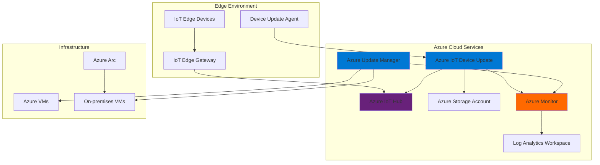

# Unified Edge-to-Cloud Security Updates with IoT Device Update and Update Manager

## Problem

Organizations managing large-scale IoT deployments face critical challenges in maintaining security across distributed edge devices and cloud infrastructure. Manual firmware updates on edge devices lead to security vulnerabilities, while disconnected patch management between edge and cloud environments creates operational gaps and compliance risks. Without coordinated update orchestration, organizations struggle to ensure consistent security posture across their hybrid infrastructure, resulting in potential security breaches and regulatory violations.

## Solution

Azure IoT Device Update and Azure Update Manager work together to create a unified security update orchestration system that seamlessly coordinates firmware updates for IoT edge devices with infrastructure patch management across hybrid cloud environments. This integrated approach provides automated rollback capabilities, compliance monitoring, and synchronized security updates from edge to cloud, ensuring comprehensive security coverage while minimizing operational overhead and maintaining business continuity.

## Architecture Diagram



## Prerequisites

1. Azure subscription with appropriate permissions for IoT Hub, Device Update, and Update Manager
2. Azure CLI version 2.30.0 or later installed and configured
3. Basic understanding of IoT device management and firmware update processes
4. Knowledge of Azure virtual machine management and patch deployment
5. One or more IoT Edge devices or simulated devices for testing
6. Estimated cost: $50-100/month for testing environment (includes IoT Hub, storage, and VM costs)

> **Note**: This recipe requires devices capable of running the Azure IoT Device Update agent. For testing purposes, you can use the Device Update simulator or Raspberry Pi reference implementation.

## Preparation

```bash
# Set environment variables for Azure resources
export RESOURCE_GROUP="rg-iot-updates-${RANDOM_SUFFIX}"
export LOCATION="eastus"
export SUBSCRIPTION_ID=$(az account show --query id --output tsv)

# Generate unique suffix for resource names
RANDOM_SUFFIX=$(openssl rand -hex 3)

# Set resource names
export IOT_HUB_NAME="iothub-${RANDOM_SUFFIX}"
export DEVICE_UPDATE_ACCOUNT="deviceupdate-${RANDOM_SUFFIX}"
export DEVICE_UPDATE_INSTANCE="deviceupdate-instance-${RANDOM_SUFFIX}"
export STORAGE_ACCOUNT="stdevupdate${RANDOM_SUFFIX}"
export LOG_ANALYTICS_WORKSPACE="law-iot-updates-${RANDOM_SUFFIX}"
export VM_NAME="vm-update-test-${RANDOM_SUFFIX}"

# Create resource group
az group create \
    --name ${RESOURCE_GROUP} \
    --location ${LOCATION} \
    --tags purpose=iot-updates environment=demo

echo "✅ Resource group created: ${RESOURCE_GROUP}"

# Create Log Analytics workspace for monitoring
az monitor log-analytics workspace create \
    --resource-group ${RESOURCE_GROUP} \
    --workspace-name ${LOG_ANALYTICS_WORKSPACE} \
    --location ${LOCATION}

echo "✅ Log Analytics workspace created: ${LOG_ANALYTICS_WORKSPACE}"
```

## Steps

1. **Create Azure IoT Hub for Device Connectivity**:

   Azure IoT Hub serves as the central communication hub for IoT devices, providing secure, bidirectional communication between devices and cloud services. This foundational service enables device-to-cloud telemetry, cloud-to-device commands, and device twin management. For Device Update scenarios, IoT Hub manages the device identity, authentication, and orchestrates the update deployment workflow through device twin properties.

   ```bash
   # Create IoT Hub with standard tier for device update features
   az iot hub create \
       --name ${IOT_HUB_NAME} \
       --resource-group ${RESOURCE_GROUP} \
       --location ${LOCATION} \
       --sku S1 \
       --unit 1 \
       --tags purpose=device-updates

   # Get IoT Hub connection string
   IOT_HUB_CONNECTION_STRING=$(az iot hub connection-string show \
       --hub-name ${IOT_HUB_NAME} \
       --resource-group ${RESOURCE_GROUP} \
       --query connectionString --output tsv)

   echo "✅ IoT Hub created: ${IOT_HUB_NAME}"
   ```

   The IoT Hub now provides secure device connectivity with built-in security features including per-device authentication, message-level security, and integration with Azure Active Directory. This establishes the foundation for coordinated device management and update orchestration.

2. **Create Storage Account for Update Artifacts**:

   Azure Storage provides secure, scalable storage for firmware update packages and deployment artifacts. Device Update requires a dedicated storage account to store update manifests, firmware images, and deployment logs. The storage account enables versioning, access control, and global distribution of update packages while maintaining security and compliance requirements.

   ```bash
   # Create storage account for device update artifacts
   az storage account create \
       --name ${STORAGE_ACCOUNT} \
       --resource-group ${RESOURCE_GROUP} \
       --location ${LOCATION} \
       --sku Standard_LRS \
       --kind StorageV2 \
       --access-tier Hot \
       --https-only true \
       --min-tls-version TLS1_2

   # Get storage account connection string
   STORAGE_CONNECTION_STRING=$(az storage account show-connection-string \
       --name ${STORAGE_ACCOUNT} \
       --resource-group ${RESOURCE_GROUP} \
       --query connectionString --output tsv)

   echo "✅ Storage account created: ${STORAGE_ACCOUNT}"
   ```

   The storage account is configured with security best practices including HTTPS-only access and TLS 1.2 minimum encryption. This secure storage foundation supports the update artifact lifecycle from upload to deployment across distributed edge devices.

3. **Create Device Update Account and Instance**:

   Azure IoT Device Update requires a dedicated account and instance to manage firmware updates across your IoT device fleet. The Device Update service provides over-the-air update capabilities with support for both package-based and image-based updates. This service integrates with IoT Hub to orchestrate update deployments while providing monitoring, rollback capabilities, and compliance tracking.

   ```bash
   # Create Device Update account
   az iot du account create \
       --account ${DEVICE_UPDATE_ACCOUNT} \
       --resource-group ${RESOURCE_GROUP} \
       --location ${LOCATION} \
       --tags purpose=firmware-updates

   # Get IoT Hub resource ID for Device Update instance
   IOT_HUB_RESOURCE_ID=$(az iot hub show \
       --name ${IOT_HUB_NAME} \
       --resource-group ${RESOURCE_GROUP} \
       --query id --output tsv)

   # Create Device Update instance linked to IoT Hub
   az iot du instance create \
       --account ${DEVICE_UPDATE_ACCOUNT} \
       --instance ${DEVICE_UPDATE_INSTANCE} \
       --resource-group ${RESOURCE_GROUP} \
       --iothub-ids ${IOT_HUB_RESOURCE_ID}

   echo "✅ Device Update account and instance created"
   ```

   The Device Update service is now configured to manage firmware updates for devices connected to your IoT Hub. This enables centralized update management with built-in security features, deployment tracking, and automated rollback capabilities for failed updates.

4. **Configure Update Manager for Infrastructure Patching**:

   Azure Update Manager provides unified patch management for Azure VMs, on-premises machines, and multi-cloud environments through Azure Arc. This service enables scheduled maintenance windows, compliance tracking, and automated patching workflows. By integrating Update Manager with your IoT infrastructure, you create a comprehensive security update strategy that covers both edge devices and supporting infrastructure.

   ```bash
   # Create a test VM for demonstrating Update Manager
   az vm create \
       --name ${VM_NAME} \
       --resource-group ${RESOURCE_GROUP} \
       --image Ubuntu2204 \
       --size Standard_B2s \
       --admin-username azureuser \
       --generate-ssh-keys \
       --location ${LOCATION}

   # Enable Update Manager for the VM by setting patch mode
   az vm update \
       --name ${VM_NAME} \
       --resource-group ${RESOURCE_GROUP} \
       --set "osProfile.linuxConfiguration.patchSettings.patchMode=AutomaticByPlatform"

   echo "✅ Update Manager configured for infrastructure patching"
   ```

   Update Manager is now configured to provide automated patch management for your infrastructure components. This creates a unified security update strategy that coordinates both IoT device firmware updates and infrastructure patching within defined maintenance windows.

5. **Set Up Device Update Agent Simulation**:

   The Device Update agent runs on IoT devices to handle firmware update downloads, installations, and status reporting. For testing purposes, we'll configure a simulated device that demonstrates the update workflow. In production environments, this agent would be deployed on actual IoT Edge devices or embedded systems.

   ```bash
   # Create a simulated device identity in IoT Hub
   az iot hub device-identity create \
       --hub-name ${IOT_HUB_NAME} \
       --device-id "sim-device-001" \
       --resource-group ${RESOURCE_GROUP}

   # Get device connection string
   DEVICE_CONNECTION_STRING=$(az iot hub device-identity connection-string show \
       --hub-name ${IOT_HUB_NAME} \
       --device-id "sim-device-001" \
       --resource-group ${RESOURCE_GROUP} \
       --query connectionString --output tsv)

   # Configure device for Device Update
   az iot hub device-twin update \
       --hub-name ${IOT_HUB_NAME} \
       --device-id "sim-device-001" \
       --desired '{
         "deviceUpdate": {
           "service": {
             "workflow": {
               "action": 255,
               "id": "workflow-001"
             }
           }
         }
       }'

   echo "✅ Device Update agent simulation configured"
   ```

   The simulated device is now registered with IoT Hub and configured to receive Device Update commands. This establishes the communication channel for firmware update orchestration and status reporting between the device and cloud services.

6. **Create Sample Update Package**:

   Device Update requires properly formatted update packages that include manifests, firmware images, and installation instructions. The update package format supports both application-specific updates and full system images. This step demonstrates creating a sample update package that can be deployed to devices through the Device Update service.

   ```bash
   # Create a sample update manifest
   mkdir -p ~/device-updates

   cat > ~/device-updates/sample-update-manifest.json << 'EOF'
   {
     "updateId": {
       "provider": "Contoso",
       "name": "SecurityPatch",
       "version": "1.0.0"
     },
     "description": "Security patch update for IoT devices",
     "compatibility": [
       {
         "deviceManufacturer": "Contoso",
         "deviceModel": "IoTDevice"
       }
     ],
     "instructions": {
       "steps": [
         {
           "handler": "microsoft/script:1",
           "files": ["install-security-patch.sh"],
           "handlerProperties": {
             "scriptFileName": "install-security-patch.sh",
             "arguments": "--security-patch"
           }
         }
       ]
     },
     "files": [
       {
         "filename": "install-security-patch.sh",
         "sizeInBytes": 1024,
         "hashes": {
           "sha256": "sample-hash-value"
         }
       }
     ]
   }
   EOF

   # Create a sample installation script
   cat > ~/device-updates/install-security-patch.sh << 'EOF'
   #!/bin/bash
   echo "Installing security patch..."
   echo "Security patch installed successfully"
   exit 0
   EOF

   echo "✅ Sample update package created"
   ```

   The update package includes a structured manifest that defines the update metadata, compatibility requirements, and installation instructions. This package format enables consistent deployment across different device types while maintaining security and verification capabilities.

7. **Configure Monitoring and Alerting**:

   Azure Monitor provides comprehensive monitoring capabilities for both Device Update and Update Manager operations. By configuring custom dashboards and alerts, you can track update deployment status, identify failures, and maintain compliance across your hybrid infrastructure. This monitoring setup enables proactive management of your update orchestration system.

   ```bash
   # Create monitoring dashboard for update operations
   az portal dashboard create \
       --resource-group ${RESOURCE_GROUP} \
       --name "IoT-Updates-Dashboard" \
       --location ${LOCATION} \
       --metadata '{
         "title": "IoT Edge to Cloud Updates",
         "description": "Monitoring dashboard for Device Update and Update Manager operations"
       }'

   # Configure alert rule for failed updates
   az monitor metrics alert create \
       --name "DeviceUpdateFailures" \
       --resource-group ${RESOURCE_GROUP} \
       --scopes "/subscriptions/${SUBSCRIPTION_ID}/resourceGroups/${RESOURCE_GROUP}/providers/Microsoft.DeviceUpdate/accounts/${DEVICE_UPDATE_ACCOUNT}" \
       --condition "count static > 0" \
       --description "Alert when device updates fail" \
       --evaluation-frequency 5m \
       --window-size 15m \
       --severity 2

   echo "✅ Monitoring and alerting configured"
   ```

   The monitoring system now provides real-time visibility into update operations across both edge devices and cloud infrastructure. This comprehensive monitoring enables rapid response to update failures and maintains operational visibility across your hybrid environment.

8. **Set Up Update Orchestration Workflow**:

   The final step creates an orchestrated workflow that coordinates updates between Device Update and Update Manager. This workflow ensures that infrastructure patching and device firmware updates are properly sequenced to maintain service availability while applying security updates. The orchestration logic handles dependencies, rollback scenarios, and compliance reporting.

   ```bash
   # Create a logic app for update orchestration
   az logic workflow create \
       --name "update-orchestration-workflow" \
       --resource-group ${RESOURCE_GROUP} \
       --location ${LOCATION} \
       --definition '{
         "triggers": {
           "manual": {
             "type": "Request",
             "kind": "Http"
           }
         },
         "actions": {
           "checkInfrastructure": {
             "type": "Http",
             "inputs": {
               "method": "GET",
               "uri": "https://management.azure.com/subscriptions/'${SUBSCRIPTION_ID}'/resourceGroups/'${RESOURCE_GROUP}'/providers/Microsoft.Maintenance/updates"
             }
           },
           "deployDeviceUpdates": {
             "type": "Http",
             "inputs": {
               "method": "POST",
               "uri": "https://management.azure.com/subscriptions/'${SUBSCRIPTION_ID}'/resourceGroups/'${RESOURCE_GROUP}'/providers/Microsoft.DeviceUpdate/accounts/'${DEVICE_UPDATE_ACCOUNT}'/instances/'${DEVICE_UPDATE_INSTANCE}'/deployments"
             },
             "runAfter": {
               "checkInfrastructure": ["Succeeded"]
             }
           }
         }
       }'

   echo "✅ Update orchestration workflow created"
   ```

   The orchestration workflow now coordinates updates across your entire infrastructure, ensuring that both edge devices and cloud resources receive security updates in a coordinated manner. This workflow supports complex deployment scenarios while maintaining system availability and security compliance.

## Validation & Testing

1. **Verify Device Update Configuration**:

   ```bash
   # Check Device Update account status
   az iot du account show \
       --account ${DEVICE_UPDATE_ACCOUNT} \
       --resource-group ${RESOURCE_GROUP} \
       --output table

   # Verify device registration
   az iot hub device-identity show \
       --hub-name ${IOT_HUB_NAME} \
       --device-id "sim-device-001" \
       --resource-group ${RESOURCE_GROUP}
   ```

   Expected output: Device Update account shows "Succeeded" provisioning state, and device identity shows "enabled" status.

2. **Test Update Manager Capabilities**:

   ```bash
   # Check VM patch compliance
   az vm assess-patches \
       --name ${VM_NAME} \
       --resource-group ${RESOURCE_GROUP}

   # Verify Update Manager configuration
   az vm show \
       --name ${VM_NAME} \
       --resource-group ${RESOURCE_GROUP} \
       --query "osProfile.linuxConfiguration.patchSettings"
   ```

   Expected output: Patch assessment shows available updates, and patch mode is set to "AutomaticByPlatform".

3. **Validate Monitoring Setup**:

   ```bash
   # Check monitoring workspace
   az monitor log-analytics workspace show \
       --resource-group ${RESOURCE_GROUP} \
       --workspace-name ${LOG_ANALYTICS_WORKSPACE}

   # Verify alert rules
   az monitor metrics alert list \
       --resource-group ${RESOURCE_GROUP} \
       --output table
   ```

   Expected output: Log Analytics workspace shows "Succeeded" provisioning state, and alert rules are listed with "Enabled" status.

## Cleanup

1. **Remove Logic App and Monitoring Resources**:

   ```bash
   # Delete logic app workflow
   az logic workflow delete \
       --name "update-orchestration-workflow" \
       --resource-group ${RESOURCE_GROUP} \
       --yes

   # Delete monitoring alerts
   az monitor metrics alert delete \
       --name "DeviceUpdateFailures" \
       --resource-group ${RESOURCE_GROUP}

   echo "✅ Orchestration and monitoring resources deleted"
   ```

2. **Remove Azure IoT Resources**:

   ```bash
   # Delete device identity
   az iot hub device-identity delete \
       --hub-name ${IOT_HUB_NAME} \
       --device-id "sim-device-001" \
       --resource-group ${RESOURCE_GROUP}

   # Delete Device Update resources
   az iot du instance delete \
       --account ${DEVICE_UPDATE_ACCOUNT} \
       --instance ${DEVICE_UPDATE_INSTANCE} \
       --resource-group ${RESOURCE_GROUP} \
       --yes

   az iot du account delete \
       --account ${DEVICE_UPDATE_ACCOUNT} \
       --resource-group ${RESOURCE_GROUP} \
       --yes

   echo "✅ IoT and Device Update resources deleted"
   ```

3. **Remove Infrastructure Resources**:

   ```bash
   # Delete test VM
   az vm delete \
       --name ${VM_NAME} \
       --resource-group ${RESOURCE_GROUP} \
       --yes

   # Delete IoT Hub
   az iot hub delete \
       --name ${IOT_HUB_NAME} \
       --resource-group ${RESOURCE_GROUP}

   # Delete storage account
   az storage account delete \
       --name ${STORAGE_ACCOUNT} \
       --resource-group ${RESOURCE_GROUP} \
       --yes

   echo "✅ Infrastructure resources deleted"
   ```

4. **Remove Resource Group**:

   ```bash
   # Delete resource group and all remaining resources
   az group delete \
       --name ${RESOURCE_GROUP} \
       --yes \
       --no-wait

   echo "✅ Resource group deletion initiated: ${RESOURCE_GROUP}"
   echo "Note: Complete deletion may take several minutes"
   ```

## Discussion

Azure IoT Device Update and Azure Update Manager create a powerful combination for orchestrating security updates across hybrid edge-to-cloud environments. This integrated approach addresses the complex challenges of maintaining security posture across distributed IoT deployments while ensuring infrastructure compliance. The Device Update service provides over-the-air update capabilities with built-in security features, rollback mechanisms, and compliance tracking, while Update Manager delivers comprehensive patch management for supporting infrastructure. For detailed implementation guidance, see the [Azure IoT Device Update documentation](https://docs.microsoft.com/en-us/azure/iot-hub-device-update/) and [Azure Update Manager overview](https://docs.microsoft.com/en-us/azure/update-manager/overview).

The orchestration workflow enables synchronized updates that maintain service availability while applying critical security patches. This approach is particularly valuable for industries with strict compliance requirements, such as manufacturing, healthcare, and energy, where device downtime must be minimized while maintaining security standards. The integration with Azure Monitor provides comprehensive visibility into update operations, enabling proactive identification of issues and ensuring compliance with security policies. For scaling considerations and best practices, refer to the [Azure IoT Hub device management guide](https://docs.microsoft.com/en-us/azure/iot-hub/iot-hub-device-management-overview).

From an operational perspective, this solution reduces the complexity of managing updates across hybrid environments by providing a unified control plane for both edge devices and cloud infrastructure. The automated rollback capabilities ensure that failed updates don't compromise device availability, while the monitoring integration provides real-time visibility into update status across thousands of devices. Cost optimization is achieved through efficient update distribution and scheduling capabilities that minimize bandwidth usage and operational overhead. For comprehensive architectural guidance, review the [Azure Well-Architected Framework for IoT](https://docs.microsoft.com/en-us/azure/architecture/framework/iot/iot-overview).

> **Tip**: Use Azure Policy integration with Update Manager to enforce consistent patch management policies across your hybrid infrastructure. This ensures compliance with security standards while automating routine maintenance tasks. For complex deployments, consider implementing gradual rollout strategies using device groups to minimize risk during large-scale updates.

## Challenge

Extend this solution by implementing these enhancements:

1. **Advanced Rollback Automation**: Implement automated rollback triggers based on device health metrics and telemetry data, with custom rollback policies for different device types and criticality levels.

2. **Multi-Region Update Orchestration**: Deploy the solution across multiple Azure regions with automated failover capabilities and region-specific update scheduling based on business requirements.

3. **Compliance Dashboard Integration**: Create custom Power BI dashboards that integrate with Azure Monitor to provide executive-level visibility into security compliance across the entire IoT infrastructure.

4. **Predictive Update Scheduling**: Implement machine learning models that predict optimal update windows based on device usage patterns, reducing business impact while maintaining security posture.

5. **Third-Party Integration**: Extend the orchestration workflow to integrate with external security scanning tools and vulnerability management platforms for comprehensive security automation.

## Infrastructure Code

*Infrastructure code will be generated after recipe approval.*