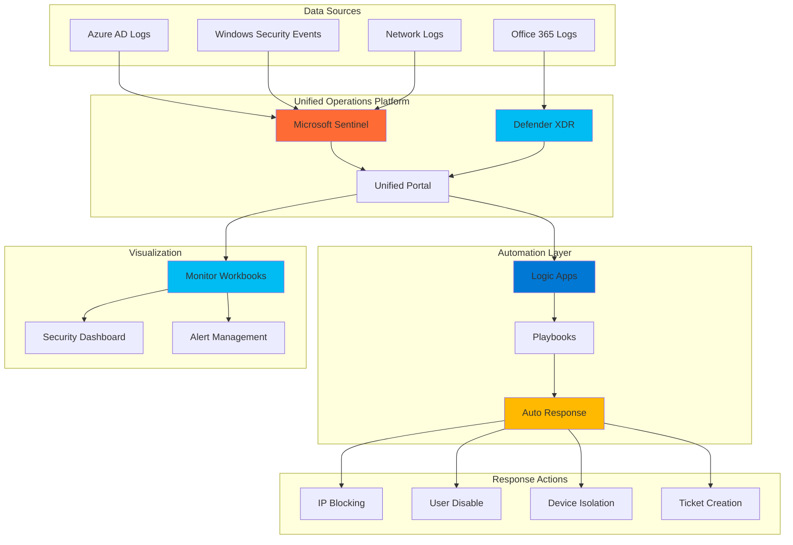

# Unified Security Incident Response with Sentinel and Defender XDR

## Problem

Security operations teams face overwhelming alert volumes and complex threat landscapes that require rapid response times, often within minutes for critical incidents. Traditional security incident response relies on manual processes that introduce delays, increase human error rates, and fail to provide unified visibility across multiple security data sources. Organizations struggle to correlate security events from different systems, leading to missed threat patterns and inadequate response coordination that can result in successful cyberattacks and significant business impact.

## Solution

Build an automated security incident response system using Azure's unified security operations platform that combines Microsoft Sentinel's SIEM capabilities with Microsoft Defender XDR's threat detection, Azure Logic Apps for workflow automation, and Azure Monitor Workbooks for real-time visualization. This integrated approach enables automatic threat detection, intelligent alert correlation, automated response workflows, and comprehensive security operations dashboards that empower security teams to respond faster and more effectively to emerging threats.

## Architecture Diagram



## Prerequisites

1. Azure subscription with Global Administrator or Security Administrator privileges
2. Microsoft Sentinel workspace with data connectors configured
3. Microsoft Defender XDR onboarded to the Azure AD tenant
4. Azure CLI v2.60.0 or higher installed and configured
5. Security operations team knowledge of incident response procedures
6. Estimated cost: $200-500 per month depending on data ingestion volume and automation frequency

> **Note**: The unified security operations platform requires both Microsoft Sentinel and Defender XDR to be properly configured. Review the [Microsoft Sentinel documentation](https://learn.microsoft.com/en-us/azure/sentinel/) for comprehensive setup guidance.

## Preparation

```bash
# Set environment variables for Azure resources
export RESOURCE_GROUP="rg-security-ops-${RANDOM_SUFFIX}"
export LOCATION="eastus"
export SUBSCRIPTION_ID=$(az account show --query id --output tsv)
export WORKSPACE_NAME="law-security-${RANDOM_SUFFIX}"
export SENTINEL_NAME="sentinel-${RANDOM_SUFFIX}"
export LOGIC_APP_NAME="la-incident-response-${RANDOM_SUFFIX}"

# Generate unique suffix for resource names
RANDOM_SUFFIX=$(openssl rand -hex 3)

# Create resource group for security operations
az group create \
    --name ${RESOURCE_GROUP} \
    --location ${LOCATION} \
    --tags purpose=security-operations environment=production

echo "✅ Resource group created: ${RESOURCE_GROUP}"

# Enable required resource providers
az provider register --namespace Microsoft.SecurityInsights
az provider register --namespace Microsoft.Logic
az provider register --namespace Microsoft.OperationalInsights

echo "✅ Resource providers registered for security operations"
```

## Steps

1. **Create Log Analytics Workspace for Security Data**:

   Azure Log Analytics provides the foundational data platform for Microsoft Sentinel's SIEM capabilities. This workspace serves as the centralized repository for all security logs, events, and telemetry data from across your environment. The workspace enables advanced analytics, correlation rules, and long-term data retention required for effective security operations and compliance requirements.

   ```bash
   # Create Log Analytics workspace for Sentinel
   az monitor log-analytics workspace create \
       --resource-group ${RESOURCE_GROUP} \
       --workspace-name ${WORKSPACE_NAME} \
       --location ${LOCATION} \
       --sku pergb2018 \
       --retention-time 90 \
       --tags component=security-workspace

   # Get workspace resource ID for Sentinel configuration
   WORKSPACE_ID=$(az monitor log-analytics workspace show \
       --resource-group ${RESOURCE_GROUP} \
       --workspace-name ${WORKSPACE_NAME} \
       --query id --output tsv)

   echo "✅ Log Analytics workspace created with 90-day retention"
   echo "Workspace ID: ${WORKSPACE_ID}"
   ```

   The Log Analytics workspace is now configured with 90-day retention and per-GB pricing tier, providing the scalable foundation for security data collection. This workspace will automatically integrate with Microsoft Sentinel to enable advanced threat detection and security analytics capabilities.

2. **Deploy Microsoft Sentinel SIEM Solution**:

   Microsoft Sentinel is Azure's cloud-native Security Information and Event Management (SIEM) solution that provides intelligent security analytics across your enterprise. By enabling Sentinel on the Log Analytics workspace, you activate advanced threat detection, investigation capabilities, and automated response features that form the core of modern security operations centers.

   ```bash
   # Enable Microsoft Sentinel on the workspace
   az sentinel workspace create \
       --resource-group ${RESOURCE_GROUP} \
       --workspace-name ${WORKSPACE_NAME}

   # Configure Sentinel settings and enable UEBA
   az rest \
       --method PUT \
       --uri "https://management.azure.com${WORKSPACE_ID}/providers/Microsoft.SecurityInsights/settings/Ueba?api-version=2025-06-01" \
       --body '{
         "kind": "Ueba",
         "properties": {
           "dataSources": ["AuditLogs", "AzureActivity", "SecurityEvent", "SigninLogs"]
         }
       }'

   echo "✅ Microsoft Sentinel enabled with UEBA analytics"
   ```

   Microsoft Sentinel is now active and configured with User and Entity Behavior Analytics (UEBA) to detect anomalous user behavior patterns. This foundational SIEM capability enables advanced threat detection across multiple data sources and provides the platform for automated security operations.

3. **Configure Data Connectors for Comprehensive Coverage**:

   Data connectors are essential for ingesting security telemetry from various sources into Microsoft Sentinel. These connectors enable real-time data collection from Azure AD, security events, Office 365, and other critical systems. Proper data connector configuration ensures comprehensive visibility across your security landscape and enables effective threat detection and response.

   ```bash
   # Enable Azure AD connector for identity security
   az rest \
       --method PUT \
       --uri "https://management.azure.com${WORKSPACE_ID}/providers/Microsoft.SecurityInsights/dataConnectors/azuread-${RANDOM_SUFFIX}?api-version=2025-06-01" \
       --body '{
         "kind": "AzureActiveDirectory",
         "properties": {
           "dataTypes": {
             "signInLogs": { "state": "Enabled" },
             "auditLogs": { "state": "Enabled" }
           }
         }
       }'

   # Enable Azure Activity connector for resource monitoring
   az rest \
       --method PUT \
       --uri "https://management.azure.com${WORKSPACE_ID}/providers/Microsoft.SecurityInsights/dataConnectors/azureactivity-${RANDOM_SUFFIX}?api-version=2025-06-01" \
       --body '{
         "kind": "AzureActivity",
         "properties": {
           "dataTypes": {
             "azureActivity": { "state": "Enabled" }
           }
         }
       }'

   # Enable Security Events connector for Windows logs
   az rest \
       --method PUT \
       --uri "https://management.azure.com${WORKSPACE_ID}/providers/Microsoft.SecurityInsights/dataConnectors/securityevents-${RANDOM_SUFFIX}?api-version=2025-06-01" \
       --body '{
         "kind": "SecurityEvents",
         "properties": {
           "dataTypes": {
             "securityEvents": { "state": "Enabled" }
           }
         }
       }'

   echo "✅ Data connectors configured for comprehensive security coverage"
   ```

   The data connectors are now actively ingesting security telemetry from Azure AD sign-ins, audit logs, Azure activity, and Windows security events. This comprehensive data collection provides the foundation for effective threat detection and enables correlation across multiple security domains.

4. **Create Analytics Rules for Threat Detection**:

   Analytics rules in Microsoft Sentinel define the logic for detecting security threats and generating incidents. These rules use KQL (Kusto Query Language) to analyze ingested data and identify suspicious patterns, anomalies, and known attack techniques. Well-designed analytics rules are crucial for effective threat detection and reducing false positive alerts.

   ```bash
   # Create rule for suspicious sign-in attempts
   az rest \
       --method PUT \
       --uri "https://management.azure.com${WORKSPACE_ID}/providers/Microsoft.SecurityInsights/alertRules/suspicious-signin-${RANDOM_SUFFIX}?api-version=2025-06-01" \
       --body '{
         "kind": "Scheduled",
         "properties": {
           "displayName": "Multiple Failed Sign-in Attempts",
           "description": "Detects multiple failed sign-in attempts from same user",
           "severity": "Medium",
           "enabled": true,
           "query": "SigninLogs | where ResultType != 0 | summarize FailedAttempts = count() by UserPrincipalName, bin(TimeGenerated, 5m) | where FailedAttempts >= 5",
           "queryFrequency": "PT5M",
           "queryPeriod": "PT5M",
           "triggerOperator": "GreaterThan",
           "triggerThreshold": 0,
           "suppressionDuration": "PT1H",
           "suppressionEnabled": false,
           "tactics": ["CredentialAccess"],
           "eventGroupingSettings": {
             "aggregationKind": "SingleAlert"
           }
         }
       }'

   # Create rule for privilege escalation detection
   az rest \
       --method PUT \
       --uri "https://management.azure.com${WORKSPACE_ID}/providers/Microsoft.SecurityInsights/alertRules/privilege-escalation-${RANDOM_SUFFIX}?api-version=2025-06-01" \
       --body '{
         "kind": "Scheduled",
         "properties": {
           "displayName": "Privilege Escalation Detected",
           "description": "Detects potential privilege escalation activities",
           "severity": "High",
           "enabled": true,
           "query": "AuditLogs | where OperationName in (\"Add member to role\", \"Add app role assignment\") | where ResultType == \"success\"",
           "queryFrequency": "PT10M",
           "queryPeriod": "PT10M",
           "triggerOperator": "GreaterThan",
           "triggerThreshold": 0,
           "suppressionDuration": "PT1H",
           "suppressionEnabled": false,
           "tactics": ["PrivilegeEscalation"],
           "eventGroupingSettings": {
             "aggregationKind": "AlertPerResult"
           }
         }
       }'

   echo "✅ Analytics rules created for threat detection"
   ```

   The analytics rules are now monitoring for suspicious sign-in patterns and privilege escalation activities with appropriate severity levels and suppression settings. These rules will automatically generate incidents when threats are detected, enabling rapid security response.

5. **Configure Unified Security Operations Platform Integration**:

   The unified security operations platform brings together Microsoft Sentinel and Defender XDR capabilities in a single portal experience. This integration enables security analysts to investigate incidents, hunt for threats, and manage security operations from one centralized interface while maintaining full functionality from both platforms.

   ```bash
   # Enable Sentinel in Defender portal (unified operations)
   az rest \
       --method POST \
       --uri "https://management.azure.com${WORKSPACE_ID}/providers/Microsoft.SecurityInsights/onboardingStates/default?api-version=2025-06-01" \
       --body '{
         "properties": {
           "customerManagedKey": false
         }
       }'

   # Configure XDR data connector in Sentinel
   az rest \
       --method PUT \
       --uri "https://management.azure.com${WORKSPACE_ID}/providers/Microsoft.SecurityInsights/dataConnectors/defender-xdr-${RANDOM_SUFFIX}?api-version=2025-06-01" \
       --body '{
         "kind": "MicrosoftThreatIntelligence",
         "properties": {
           "dataTypes": {
             "microsoftDefenderThreatIntelligence": {
               "state": "Enabled",
               "lookbackPeriod": "P7D"
             }
           }
         }
       }'

   echo "✅ Unified security operations platform configured"
   echo "Access unified portal at: https://security.microsoft.com"
   ```

   The unified security operations platform is now configured, enabling seamless integration between Sentinel and Defender XDR. Security teams can now access both SIEM and XDR capabilities through the unified portal at security.microsoft.com for streamlined security operations.

6. **Create Logic App for Automated Incident Response**:

   Azure Logic Apps provides the automation platform for orchestrating security incident response workflows. This serverless integration platform enables automated responses to security incidents, including blocking malicious IPs, disabling compromised user accounts, and creating service tickets. Automated response capabilities are essential for rapid threat containment and reducing mean time to response.

   ```bash
   # Create Logic App for incident response automation
   az logic workflow create \
       --resource-group ${RESOURCE_GROUP} \
       --name ${LOGIC_APP_NAME} \
       --location ${LOCATION} \
       --definition '{
         "$schema": "https://schema.management.azure.com/schemas/2016-06-01/Microsoft.Logic.json",
         "contentVersion": "1.0.0.0",
         "triggers": {
           "When_a_response_to_an_Azure_Sentinel_alert_is_triggered": {
             "type": "ApiConnectionWebhook",
             "inputs": {
               "host": {
                 "connection": {
                   "name": "@parameters(\"$connections\")[\"azuresentinel\"][\"connectionId\"]"
                 }
               },
               "body": {
                 "callback_url": "@{listCallbackUrl()}"
               },
               "path": "/subscribe"
             }
           }
         },
         "actions": {
           "Initialize_response_variable": {
             "type": "InitializeVariable",
             "inputs": {
               "variables": [{
                 "name": "ResponseActions",
                 "type": "String",
                 "value": "Incident processed automatically"
               }]
             }
           },
           "Check_incident_severity": {
             "type": "Switch",
             "expression": "@triggerBody()?[\"Severity\"]",
             "cases": {
               "High": {
                 "case": "High",
                 "actions": {
                   "Send_high_severity_notification": {
                     "type": "Http",
                     "inputs": {
                       "method": "POST",
                       "uri": "https://hooks.slack.com/services/YOUR_WEBHOOK",
                       "body": {
                         "text": "High severity incident detected: @{triggerBody()?[\"Title\"]}"
                       }
                     }
                   }
                 }
               }
             },
             "default": {
               "actions": {
                 "Log_standard_response": {
                   "type": "Http",
                   "inputs": {
                     "method": "POST",
                     "uri": "https://your-logging-endpoint.com/log",
                     "body": {
                       "incident": "@{triggerBody()?[\"Title\"]}",
                       "severity": "@{triggerBody()?[\"Severity\"]}"
                     }
                   }
                 }
               }
             }
           }
         }
       }'

   echo "✅ Logic App created for automated incident response"
   echo "Logic App Name: ${LOGIC_APP_NAME}"
   ```

   The Logic App is now configured to automatically trigger on Sentinel incidents and execute appropriate response actions based on severity levels. This automation framework can be extended to include additional response actions such as user account management, IP blocking, and ticketing system integration.

7. **Create Security Playbook for Automated Response Actions**:

   Security playbooks in Microsoft Sentinel are specialized Logic Apps that provide standardized, automated responses to specific types of security incidents. These playbooks implement security best practices and enable consistent response procedures while reducing manual intervention and human error during critical security events.

   ```bash
   # Create connection for Azure AD management
   az rest \
       --method PUT \
       --uri "https://management.azure.com/subscriptions/${SUBSCRIPTION_ID}/resourceGroups/${RESOURCE_GROUP}/providers/Microsoft.Web/connections/azuread-${RANDOM_SUFFIX}?api-version=2016-06-01" \
       --body '{
         "properties": {
           "displayName": "Azure AD Connection",
           "api": {
             "id": "/subscriptions/'${SUBSCRIPTION_ID}'/providers/Microsoft.Web/locations/'${LOCATION}'/managedApis/azuread"
           }
         }
       }'

   # Create playbook for user account response
   az logic workflow create \
       --resource-group ${RESOURCE_GROUP} \
       --name "playbook-user-response-${RANDOM_SUFFIX}" \
       --location ${LOCATION} \
       --definition '{
         "$schema": "https://schema.management.azure.com/schemas/2016-06-01/Microsoft.Logic.json",
         "contentVersion": "1.0.0.0",
         "triggers": {
           "manual": {
             "type": "Request",
             "kind": "Http",
             "inputs": {
               "schema": {
                 "type": "object",
                 "properties": {
                   "incidentId": { "type": "string" },
                   "userPrincipalName": { "type": "string" },
                   "action": { "type": "string" }
                 }
               }
             }
           }
         },
         "actions": {
           "Parse_incident_data": {
             "type": "ParseJson",
             "inputs": {
               "content": "@triggerBody()",
               "schema": {
                 "type": "object",
                 "properties": {
                   "incidentId": { "type": "string" },
                   "userPrincipalName": { "type": "string" },
                   "action": { "type": "string" }
                 }
               }
             }
           },
           "Condition_check_action": {
             "type": "If",
             "expression": {
               "and": [{
                 "equals": ["@body(\"Parse_incident_data\")?[\"action\"]", "disable_user"]
               }]
             },
             "actions": {
               "Add_incident_comment": {
                 "type": "Http",
                 "inputs": {
                   "method": "POST",
                   "uri": "https://management.azure.com'${WORKSPACE_ID}'/providers/Microsoft.SecurityInsights/incidents/@{body(\"Parse_incident_data\")?[\"incidentId\"]}/comments/@{guid()}?api-version=2025-06-01",
                   "headers": {
                     "Authorization": "Bearer @{variables(\"AuthToken\")}"
                   },
                   "body": {
                     "properties": {
                       "message": "Automated response: User account @{body(\"Parse_incident_data\")?[\"userPrincipalName\"]} flagged for review"
                     }
                   }
                 }
               }
             }
           }
         }
       }'

   echo "✅ Security playbook created for user account response"
   ```

   The security playbook is now configured to automatically respond to user-related security incidents with appropriate actions based on incident severity and type. This playbook can be triggered manually or automatically from Sentinel analytics rules to ensure consistent security response procedures.

8. **Deploy Azure Monitor Workbook for Security Operations Dashboard**:

   Azure Monitor Workbooks provide interactive, customizable dashboards for security operations teams. These workbooks combine data from multiple sources including Sentinel, Defender XDR, and Azure Monitor to create comprehensive security visibility dashboards that enable real-time monitoring, trend analysis, and operational reporting for effective security operations management.

   ```bash
   # Create security operations workbook
   az rest \
       --method PUT \
       --uri "https://management.azure.com/subscriptions/${SUBSCRIPTION_ID}/resourceGroups/${RESOURCE_GROUP}/providers/Microsoft.Insights/workbooks/security-ops-${RANDOM_SUFFIX}?api-version=2022-04-01" \
       --body '{
         "location": "'${LOCATION}'",
         "kind": "shared",
         "properties": {
           "displayName": "Security Operations Dashboard",
           "serializedData": "{\"version\":\"Notebook/1.0\",\"items\":[{\"type\":1,\"content\":{\"json\":\"## Security Operations Overview\\n\\nThis dashboard provides real-time visibility into security incidents, threat trends, and response metrics.\"},\"name\":\"text - 0\"},{\"type\":3,\"content\":{\"version\":\"KqlItem/1.0\",\"query\":\"SecurityIncident\\n| where TimeGenerated >= ago(24h)\\n| summarize Count = count() by Severity\\n| render piechart\",\"size\":0,\"title\":\"Incidents by Severity (24h)\",\"queryType\":0,\"resourceType\":\"microsoft.operationalinsights/workspaces\",\"crossComponentResources\":[\"/subscriptions/'${SUBSCRIPTION_ID}'/resourceGroups/'${RESOURCE_GROUP}'/providers/Microsoft.OperationalInsights/workspaces/'${WORKSPACE_NAME}'\"]},\"name\":\"query - 1\"},{\"type\":3,\"content\":{\"version\":\"KqlItem/1.0\",\"query\":\"SigninLogs\\n| where TimeGenerated >= ago(24h)\\n| where ResultType != 0\\n| summarize FailedSignins = count() by bin(TimeGenerated, 1h)\\n| render timechart\",\"size\":0,\"title\":\"Failed Sign-ins Trend (24h)\",\"queryType\":0,\"resourceType\":\"microsoft.operationalinsights/workspaces\",\"crossComponentResources\":[\"/subscriptions/'${SUBSCRIPTION_ID}'/resourceGroups/'${RESOURCE_GROUP}'/providers/Microsoft.OperationalInsights/workspaces/'${WORKSPACE_NAME}'\"]},\"name\":\"query - 2\"},{\"type\":3,\"content\":{\"version\":\"KqlItem/1.0\",\"query\":\"SecurityIncident\\n| where TimeGenerated >= ago(7d)\\n| summarize IncidentCount = count() by Status\\n| render barchart\",\"size\":0,\"title\":\"Incident Status Distribution (7d)\",\"queryType\":0,\"resourceType\":\"microsoft.operationalinsights/workspaces\",\"crossComponentResources\":[\"/subscriptions/'${SUBSCRIPTION_ID}'/resourceGroups/'${RESOURCE_GROUP}'/providers/Microsoft.OperationalInsights/workspaces/'${WORKSPACE_NAME}'\"]},\"name\":\"query - 3\"}],\"fallbackResourceIds\":[\"/subscriptions/'${SUBSCRIPTION_ID}'/resourceGroups/'${RESOURCE_GROUP}'/providers/Microsoft.OperationalInsights/workspaces/'${WORKSPACE_NAME}'\"],\"fromTemplateId\":\"sentinel-UserAndEntityBehaviorAnalytics\"}"
         }
       }'

   # Get workbook details for access
   WORKBOOK_ID=$(az rest \
       --method GET \
       --uri "https://management.azure.com/subscriptions/${SUBSCRIPTION_ID}/resourceGroups/${RESOURCE_GROUP}/providers/Microsoft.Insights/workbooks?api-version=2022-04-01" \
       --query "value[?contains(properties.displayName, 'Security Operations')].id" \
       --output tsv)

   echo "✅ Security operations workbook deployed"
   echo "Workbook ID: ${WORKBOOK_ID}"
   echo "Access workbook in Azure portal under Monitor > Workbooks"
   ```

   The Azure Monitor Workbook is now deployed with pre-configured security visualizations including incident severity distribution, failed sign-in trends, and incident status tracking. This dashboard provides security operations teams with real-time visibility into their security posture and incident response metrics.

## Validation & Testing

1. **Verify Sentinel workspace and data ingestion**:

   ```bash
   # Check Sentinel workspace status
   az sentinel workspace show \
       --resource-group ${RESOURCE_GROUP} \
       --workspace-name ${WORKSPACE_NAME}

   # Verify data connectors are collecting data
   az monitor log-analytics query \
       --workspace ${WORKSPACE_ID} \
       --analytics-query "union withsource=TableName *
       | where TimeGenerated > ago(1h)
       | summarize Count = count() by TableName
       | order by Count desc" \
       --output table
   ```

   Expected output: Active workspace with data flowing from configured connectors including SigninLogs, AuditLogs, and SecurityEvent tables.

2. **Test analytics rules and incident generation**:

   ```bash
   # Check if analytics rules are running
   az rest \
       --method GET \
       --uri "https://management.azure.com${WORKSPACE_ID}/providers/Microsoft.SecurityInsights/alertRules?api-version=2025-06-01" \
       --query "value[].{Name:properties.displayName, Enabled:properties.enabled, LastModified:properties.lastModifiedUtc}"

   # Query recent incidents
   az monitor log-analytics query \
       --workspace ${WORKSPACE_ID} \
       --analytics-query "SecurityIncident
       | where TimeGenerated > ago(24h)
       | project Title, Severity, Status, CreatedTime
       | order by CreatedTime desc" \
       --output table
   ```

   Expected output: Active analytics rules with recent incident generation showing proper threat detection capabilities.

3. **Validate Logic App automation workflow**:

   ```bash
   # Check Logic App run history
   az logic workflow show \
       --resource-group ${RESOURCE_GROUP} \
       --name ${LOGIC_APP_NAME} \
       --query "{Name:name, State:state, Location:location}"

   # Test playbook webhook endpoint
   PLAYBOOK_URL=$(az logic workflow show \
       --resource-group ${RESOURCE_GROUP} \
       --name "playbook-user-response-${RANDOM_SUFFIX}" \
       --query "accessEndpoint" --output tsv)

   echo "Playbook webhook URL available for testing: ${PLAYBOOK_URL}"
   ```

   Expected output: Active Logic App with accessible webhook endpoint for automated incident response testing.

4. **Verify workbook dashboard functionality**:

   ```bash
   # Validate workbook deployment
   az rest \
       --method GET \
       --uri "https://management.azure.com/subscriptions/${SUBSCRIPTION_ID}/resourceGroups/${RESOURCE_GROUP}/providers/Microsoft.Insights/workbooks?api-version=2022-04-01" \
       --query "value[?contains(properties.displayName, 'Security Operations')].{Name:properties.displayName, Location:location, ResourceId:id}"
   ```

   Expected output: Successfully deployed workbook with configured security dashboards accessible through Azure portal.

## Cleanup

1. **Remove Analytics Rules and Sentinel Configuration**:

   ```bash
   # Delete analytics rules
   az rest \
       --method DELETE \
       --uri "https://management.azure.com${WORKSPACE_ID}/providers/Microsoft.SecurityInsights/alertRules/suspicious-signin-${RANDOM_SUFFIX}?api-version=2025-06-01"

   az rest \
       --method DELETE \
       --uri "https://management.azure.com${WORKSPACE_ID}/providers/Microsoft.SecurityInsights/alertRules/privilege-escalation-${RANDOM_SUFFIX}?api-version=2025-06-01"

   echo "✅ Analytics rules deleted"
   ```

2. **Delete Logic Apps and Automation Resources**:

   ```bash
   # Delete Logic Apps
   az logic workflow delete \
       --resource-group ${RESOURCE_GROUP} \
       --name ${LOGIC_APP_NAME} \
       --yes

   az logic workflow delete \
       --resource-group ${RESOURCE_GROUP} \
       --name "playbook-user-response-${RANDOM_SUFFIX}" \
       --yes

   echo "✅ Logic Apps and playbooks deleted"
   ```

3. **Remove Workbook and Monitoring Resources**:

   ```bash
   # Delete workbook
   az rest \
       --method DELETE \
       --uri "https://management.azure.com/subscriptions/${SUBSCRIPTION_ID}/resourceGroups/${RESOURCE_GROUP}/providers/Microsoft.Insights/workbooks/security-ops-${RANDOM_SUFFIX}?api-version=2022-04-01"

   echo "✅ Security operations workbook deleted"
   ```

4. **Delete Sentinel workspace and resource group**:

   ```bash
   # Delete entire resource group and all contained resources
   az group delete \
       --name ${RESOURCE_GROUP} \
       --yes \
       --no-wait

   echo "✅ Resource group deletion initiated: ${RESOURCE_GROUP}"
   echo "Note: Complete deletion may take 10-15 minutes"

   # Clear environment variables
   unset RESOURCE_GROUP WORKSPACE_NAME SENTINEL_NAME LOGIC_APP_NAME
   ```

## Discussion

The unified security operations platform represents a significant advancement in security operations center (SOC) capabilities by bringing together best-of-breed SIEM and XDR technologies in a single, cohesive experience. Microsoft Sentinel's cloud-native SIEM capabilities provide comprehensive log collection, advanced analytics, and threat hunting features, while Defender XDR delivers endpoint detection, email security, and identity protection in one integrated platform. This combination enables security teams to achieve complete visibility across their digital estate while maintaining operational efficiency through unified workflows and shared context across security tools, as detailed in the [Microsoft Unified Security Operations documentation](https://learn.microsoft.com/en-us/security/operations/siem-xdr-overview).

Azure Logic Apps integration provides the critical automation layer that transforms reactive security operations into proactive, intelligent response systems. The serverless automation platform enables organizations to implement consistent response procedures, reduce mean time to response (MTTR), and free security analysts to focus on high-value investigative work rather than manual tasks. Logic Apps' extensive connector ecosystem allows integration with virtually any system in the security stack, enabling comprehensive incident response workflows that span multiple tools and platforms. For comprehensive automation guidance, review the [Azure Logic Apps security automation patterns](https://learn.microsoft.com/en-us/azure/logic-apps/logic-apps-securing-a-logic-app).

Azure Monitor Workbooks enhance security operations by providing real-time visibility into security metrics, trends, and operational performance through customizable, interactive dashboards. These workbooks enable security leaders to track key performance indicators (KPIs), identify patterns in threat activity, and demonstrate the effectiveness of security investments to stakeholders. The ability to combine data from multiple sources creates a single pane of glass for security operations, improving situational awareness and enabling data-driven decision making. Implementation should follow the [Azure Monitor Workbooks best practices](https://learn.microsoft.com/en-us/azure/azure-monitor/visualize/workbooks-overview) for optimal performance and user experience.

> **Tip**: Implement gradual automation rollout by starting with low-risk response actions and progressively adding more sophisticated automated responses as confidence in the system grows. Monitor automation performance using Azure Monitor metrics and continuously refine playbooks based on operational experience and threat landscape changes.

## Challenge

Extend this automated security incident response system by implementing these advanced capabilities:

1. **Multi-Cloud Security Integration**: Expand the solution to include AWS CloudTrail and Google Cloud Audit logs through custom connectors, enabling unified security operations across hybrid and multi-cloud environments with consistent incident response procedures.

2. **AI-Enhanced Threat Hunting**: Integrate Azure OpenAI Service to provide natural language querying capabilities for threat hunting and automated incident summary generation, enabling security analysts to interact with security data using conversational AI.

3. **Advanced SOAR Orchestration**: Implement complex incident response workflows that include external threat intelligence enrichment, automated forensic data collection, and integration with enterprise ticketing systems like ServiceNow or Jira.

4. **Compliance Automation**: Build automated compliance reporting workflows that map security incidents to regulatory requirements (SOX, PCI-DSS, GDPR) and automatically generate compliance documentation and audit trails.

5. **Threat Intelligence Integration**: Connect the platform with external threat intelligence feeds and implement automated indicator-of-compromise (IoC) blocking and threat hunting based on emerging threat intelligence data.

## Infrastructure Code

*Infrastructure code will be generated after recipe approval.*