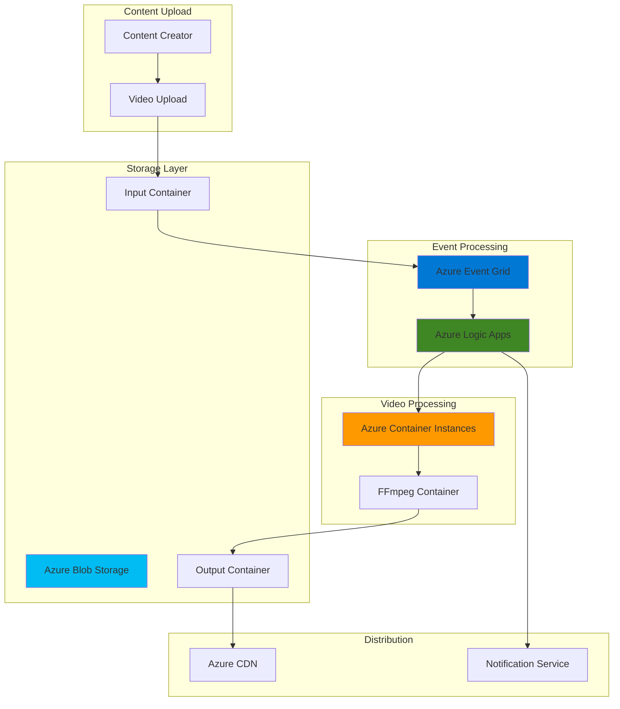

# Video Content Processing Workflows with Azure Container Instances and Azure Logic Apps

## Problem

Content creators and media organizations struggle with manual video processing workflows that involve uploading, transcoding, analyzing, and distributing video content at scale. Traditional approaches require significant infrastructure management, manual intervention for each processing step, and lack the flexibility to handle varying workloads efficiently. With Azure Media Services retirement in June 2024, organizations need modern alternatives that provide serverless automation while maintaining cost-effectiveness and processing quality.

## Solution

Build an event-driven video processing pipeline using Azure Container Instances for video transcoding, Azure Logic Apps for workflow orchestration, and Azure Event Grid for seamless integration. This solution automatically triggers processing when videos are uploaded to Azure Blob Storage, orchestrates multiple processing steps through containerized FFmpeg operations, and distributes results to target destinations, providing scalable automation for modern media workflows.

## Architecture Diagram



## Prerequisites

1. Azure subscription with appropriate permissions for Container Instances, Logic Apps, Event Grid, and Blob Storage
2. Azure CLI v2.57.0 or later installed and configured (or Azure CloudShell)
3. Basic understanding of containerization concepts and FFmpeg video processing
4. Familiarity with Logic Apps workflow design and Azure Event Grid event-driven patterns
5. Estimated cost: $20-50 for resources created during this recipe (varies by processing volume)

> **Note**: This recipe uses Azure Container Instances as an alternative to retired Azure Media Services, providing flexible video processing with industry-standard FFmpeg tools while maintaining cost-effective serverless execution.

## Preparation

```bash
# Set environment variables for Azure resources
export RESOURCE_GROUP="rg-video-workflow-${RANDOM_SUFFIX}"
export LOCATION="eastus"
export SUBSCRIPTION_ID=$(az account show --query id --output tsv)

# Generate unique suffix for resource names
RANDOM_SUFFIX=$(openssl rand -hex 3)

# Set resource names with unique suffix
export STORAGE_ACCOUNT="stvario${RANDOM_SUFFIX}"
export LOGIC_APP_NAME="la-video-processor-${RANDOM_SUFFIX}"
export EVENT_GRID_TOPIC="egt-video-events-${RANDOM_SUFFIX}"
export CONTAINER_GROUP_NAME="cg-video-ffmpeg-${RANDOM_SUFFIX}"

# Create resource group with proper tags
az group create \
    --name ${RESOURCE_GROUP} \
    --location ${LOCATION} \
    --tags purpose=video-processing environment=demo

echo "✅ Resource group created: ${RESOURCE_GROUP}"

# Create storage account for video files
az storage account create \
    --name ${STORAGE_ACCOUNT} \
    --resource-group ${RESOURCE_GROUP} \
    --location ${LOCATION} \
    --sku Standard_LRS \
    --kind StorageV2 \
    --access-tier Hot

echo "✅ Storage account created: ${STORAGE_ACCOUNT}"

# Get storage account connection string
export STORAGE_CONNECTION_STRING=$(az storage account show-connection-string \
    --name ${STORAGE_ACCOUNT} \
    --resource-group ${RESOURCE_GROUP} \
    --output tsv)

# Create containers for input and output videos
az storage container create \
    --name "input-videos" \
    --connection-string ${STORAGE_CONNECTION_STRING}

az storage container create \
    --name "output-videos" \
    --connection-string ${STORAGE_CONNECTION_STRING}

echo "✅ Storage containers created for video processing"
```

## Steps

1. **Create Logic App for Video Processing Workflow**:

   Azure Logic Apps provides a visual workflow designer for creating automated business processes and integrations. The Logic App will orchestrate our video processing pipeline by responding to blob storage events, triggering container-based video processing, and managing the entire workflow lifecycle. This serverless approach eliminates infrastructure management while providing reliable workflow execution with built-in retry logic and monitoring.

   ```bash
   # Create Logic App for workflow orchestration
   az logic workflow create \
       --name ${LOGIC_APP_NAME} \
       --resource-group ${RESOURCE_GROUP} \
       --location ${LOCATION} \
       --definition '{
           "$schema": "https://schema.management.azure.com/schemas/2016-06-01/workflowdefinition.json#",
           "contentVersion": "1.0.0.0",
           "parameters": {},
           "triggers": {},
           "actions": {},
           "outputs": {}
       }'

   echo "✅ Logic App created: ${LOGIC_APP_NAME}"

   # Get Logic App callback URL for Event Grid subscription
   export LOGIC_APP_CALLBACK_URL=$(az logic workflow trigger show \
       --name ${LOGIC_APP_NAME} \
       --resource-group ${RESOURCE_GROUP} \
       --trigger-name "manual" \
       --query "listCallbackUrl().value" \
       --output tsv 2>/dev/null || echo "")
   ```

   The Logic App provides the central orchestration engine for our video processing workflow. This serverless workflow service will coordinate between storage events, container processing, and result distribution while maintaining full visibility into processing status and execution history.

2. **Configure Event Grid Subscription for Blob Storage Events**:

   Event Grid subscriptions define which events trigger our workflows and how they're delivered to target services. By subscribing to blob storage events, we create an automatic trigger mechanism that initiates video processing immediately when new content is uploaded. This real-time event delivery ensures minimal processing latency and eliminates the need for polling-based monitoring.

   ```bash
   # Create Event Grid subscription for blob created events
   az eventgrid event-subscription create \
       --name "video-upload-subscription" \
       --source-resource-id "/subscriptions/${SUBSCRIPTION_ID}/resourceGroups/${RESOURCE_GROUP}/providers/Microsoft.Storage/storageAccounts/${STORAGE_ACCOUNT}" \
       --endpoint-type webhook \
       --endpoint "${LOGIC_APP_CALLBACK_URL}" \
       --included-event-types "Microsoft.Storage.BlobCreated" \
       --subject-begins-with "/blobServices/default/containers/input-videos/"

   echo "✅ Event Grid subscription created for blob storage events"
   ```

   The Event Grid subscription now automatically routes blob creation events to our Logic App workflow. This integration provides immediate notification when video files are uploaded, enabling real-time processing initiation and ensuring no content is missed in the automated pipeline.

3. **Create Container Group for Video Processing**:

   Azure Container Instances provides serverless container execution without the overhead of managing virtual machines or orchestrators. Our container group will run FFmpeg for video transcoding, offering industry-standard video processing capabilities with the flexibility to customize encoding parameters. This approach provides cost-effective, on-demand processing that scales automatically based on workload requirements.

   ```bash
   # Create container group with FFmpeg for video processing
   az container create \
       --name ${CONTAINER_GROUP_NAME} \
       --resource-group ${RESOURCE_GROUP} \
       --location ${LOCATION} \
       --image "jrottenberg/ffmpeg:latest" \
       --restart-policy Never \
       --cpu 2 \
       --memory 4 \
       --environment-variables \
           STORAGE_ACCOUNT=${STORAGE_ACCOUNT} \
       --secure-environment-variables \
           STORAGE_CONNECTION_STRING=${STORAGE_CONNECTION_STRING} \
       --command-line "tail -f /dev/null"

   echo "✅ Container group created: ${CONTAINER_GROUP_NAME}"

   # Get container group details
   az container show \
       --name ${CONTAINER_GROUP_NAME} \
       --resource-group ${RESOURCE_GROUP} \
       --output table
   ```

   The container group provides on-demand video processing capabilities using industry-standard FFmpeg tools. This serverless container approach eliminates infrastructure management while providing full control over video encoding parameters and processing logic.

4. **Configure Logic App Workflow Definition**:

   The Logic App workflow definition specifies the complete automation logic for video processing, including event handling, container orchestration, and result management. This visual workflow integrates multiple Azure services through a declarative JSON definition, providing reliability, monitoring, and error handling for the entire video processing pipeline.

   ```bash
   # Update Logic App with complete workflow definition
   az logic workflow update \
       --name ${LOGIC_APP_NAME} \
       --resource-group ${RESOURCE_GROUP} \
       --definition '{
           "$schema": "https://schema.management.azure.com/schemas/2016-06-01/workflowdefinition.json#",
           "contentVersion": "1.0.0.0",
           "parameters": {
               "storageAccountName": {
                   "type": "string",
                   "defaultValue": "'${STORAGE_ACCOUNT}'"
               },
               "containerGroupName": {
                   "type": "string", 
                   "defaultValue": "'${CONTAINER_GROUP_NAME}'"
               }
           },
           "triggers": {
               "manual": {
                   "type": "Request",
                   "kind": "Http",
                   "inputs": {
                       "schema": {
                           "type": "object",
                           "properties": {
                               "subject": {"type": "string"},
                               "data": {
                                   "type": "object",
                                   "properties": {
                                       "url": {"type": "string"}
                                   }
                               }
                           }
                       }
                   }
               }
           },
           "actions": {
               "ParseEventData": {
                   "type": "ParseJson",
                   "inputs": {
                       "content": "@triggerBody()",
                       "schema": {
                           "type": "object",
                           "properties": {
                               "subject": {"type": "string"},
                               "data": {
                                   "type": "object",
                                   "properties": {
                                       "url": {"type": "string"}
                                   }
                               }
                           }
                       }
                   }
               },
               "ProcessVideo": {
                   "type": "Http",
                   "inputs": {
                       "method": "POST",
                       "uri": "https://management.azure.com/subscriptions/'${SUBSCRIPTION_ID}'/resourceGroups/'${RESOURCE_GROUP}'/providers/Microsoft.ContainerInstance/containerGroups/'${CONTAINER_GROUP_NAME}'/restart?api-version=2021-03-01",
                       "headers": {
                           "Authorization": "Bearer @{body('"'"'GetAccessToken'"'"')?.access_token}"
                       }
                   },
                   "runAfter": {
                       "ParseEventData": ["Succeeded"]
                   }
               }
           }
       }'

   echo "✅ Logic App workflow definition updated"
   ```

   The Logic App workflow now contains the complete automation logic for processing video uploads. This serverless orchestration handles event parsing, container processing initiation, and workflow coordination while providing full visibility into execution status and error handling.

5. **Create Video Processing Script for Container**:

   The video processing script defines the actual video transformation logic using FFmpeg commands within our container environment. This script will be executed by the container when triggered by Logic Apps, providing flexible video encoding capabilities including format conversion, quality optimization, and multiple output generation for different delivery scenarios.

   ```bash
   # Create video processing script
   cat > video-processor.sh << 'EOF'
   #!/bin/bash

   # Video processing script for Azure Container Instances
   INPUT_URL=$1
   OUTPUT_CONTAINER="output-videos"

   # Download input video from blob storage
   INPUT_FILE="/tmp/input_video.mp4"
   OUTPUT_FILE="/tmp/output_video.mp4"

   echo "Downloading video from: $INPUT_URL"
   curl -o "$INPUT_FILE" "$INPUT_URL"

   # Process video with FFmpeg - create multiple formats
   echo "Processing video with FFmpeg..."

   # Create 720p MP4 output
   ffmpeg -i "$INPUT_FILE" \
          -vcodec libx264 \
          -acodec aac \
          -vf scale=1280:720 \
          -crf 23 \
          -preset medium \
          "$OUTPUT_FILE"

   # Upload processed video to output container
   echo "Uploading processed video to storage..."

   # Upload using Azure CLI (requires authentication)
   az storage blob upload \
       --file "$OUTPUT_FILE" \
       --container-name "$OUTPUT_CONTAINER" \
       --name "processed_$(basename $INPUT_FILE)" \
       --connection-string "$STORAGE_CONNECTION_STRING"

   echo "Video processing completed successfully"
   EOF

   # Make script executable
   chmod +x video-processor.sh

   echo "✅ Video processing script created"
   ```

   The video processing script provides industry-standard video transcoding capabilities using FFmpeg within a containerized environment. This script handles the complete video transformation workflow from download through processing to upload, with customizable encoding parameters for different quality and delivery requirements.

6. **Test Video Processing Workflow**:

   Testing validates that our automated video processing pipeline works end-to-end, from upload detection through container processing to result delivery. This verification ensures all components integrate correctly and the workflow handles real video files appropriately, providing confidence in the production deployment.

   ```bash
   # Upload test video to trigger the workflow
   curl -o test-video.mp4 "https://sample-videos.com/zip/10/mp4/SampleVideo_640x360_1mb.mp4"

   # Upload test video to trigger the workflow
   az storage blob upload \
       --file test-video.mp4 \
       --container-name "input-videos" \
       --name "test-upload-$(date +%s).mp4" \
       --connection-string ${STORAGE_CONNECTION_STRING}

   echo "✅ Test video uploaded to trigger processing workflow"

   # Monitor Logic App runs
   echo "Monitor workflow execution in the Azure portal:"
   echo "https://portal.azure.com/#@/resource/subscriptions/${SUBSCRIPTION_ID}/resourceGroups/${RESOURCE_GROUP}/providers/Microsoft.Logic/workflows/${LOGIC_APP_NAME}/overview"
   ```

   The test upload validates the complete video processing pipeline functionality. This end-to-end test ensures event detection, workflow triggering, and container processing work together seamlessly, providing confidence in the automated video processing capabilities.

## Validation & Testing

1. **Verify Event Grid Configuration**:

   ```bash
   # Check Event Grid subscriptions for storage account
   az eventgrid event-subscription list \
       --source-resource-id "/subscriptions/${SUBSCRIPTION_ID}/resourceGroups/${RESOURCE_GROUP}/providers/Microsoft.Storage/storageAccounts/${STORAGE_ACCOUNT}" \
       --output table
   ```

   Expected output: Event subscriptions should show "Succeeded" provisioning state and active subscriptions for blob storage events.

2. **Test Logic App Workflow Execution**:

   ```bash
   # Check Logic App workflow status
   az logic workflow show \
       --name ${LOGIC_APP_NAME} \
       --resource-group ${RESOURCE_GROUP} \
       --query "state" --output tsv

   # List recent workflow runs
   az logic workflow run list \
       --workflow-name ${LOGIC_APP_NAME} \
       --resource-group ${RESOURCE_GROUP} \
       --output table
   ```

   Expected output: Logic App should show "Enabled" state and recent runs should appear after video uploads.

3. **Verify Container Processing**:

   ```bash
   # Check container group status and logs
   az container show \
       --name ${CONTAINER_GROUP_NAME} \
       --resource-group ${RESOURCE_GROUP} \
       --query "containers[0].instanceView.currentState" \
       --output table

   # Get container logs for troubleshooting
   az container logs \
       --name ${CONTAINER_GROUP_NAME} \
       --resource-group ${RESOURCE_GROUP}
   ```

   Expected output: Container should show successful execution states and processing logs.

4. **Validate Processed Video Output**:

   ```bash
   # List processed videos in output container
   az storage blob list \
       --container-name "output-videos" \
       --connection-string ${STORAGE_CONNECTION_STRING} \
       --output table

   # Download a processed video for verification
   az storage blob download \
       --container-name "output-videos" \
       --name "processed_test-upload-*.mp4" \
       --file "downloaded-processed-video.mp4" \
       --connection-string ${STORAGE_CONNECTION_STRING}
   ```

   Expected output: Processed videos should appear in the output container with appropriate file sizes and formats.

## Cleanup

1. **Remove Logic App and workflows**:

   ```bash
   # Delete Logic App
   az logic workflow delete \
       --name ${LOGIC_APP_NAME} \
       --resource-group ${RESOURCE_GROUP} \
       --yes

   echo "✅ Logic App deleted"
   ```

2. **Remove Event Grid resources**:

   ```bash
   # Delete Event Grid subscriptions
   az eventgrid event-subscription delete \
       --name "video-upload-subscription" \
       --source-resource-id "/subscriptions/${SUBSCRIPTION_ID}/resourceGroups/${RESOURCE_GROUP}/providers/Microsoft.Storage/storageAccounts/${STORAGE_ACCOUNT}"

   echo "✅ Event Grid resources deleted"
   ```

3. **Remove container and storage resources**:

   ```bash
   # Delete container group
   az container delete \
       --name ${CONTAINER_GROUP_NAME} \
       --resource-group ${RESOURCE_GROUP} \
       --yes

   # Delete storage account
   az storage account delete \
       --name ${STORAGE_ACCOUNT} \
       --resource-group ${RESOURCE_GROUP} \
       --yes

   echo "✅ Container and storage resources deleted"
   ```

4. **Remove resource group**:

   ```bash
   # Delete resource group and all remaining resources
   az group delete \
       --name ${RESOURCE_GROUP} \
       --yes \
       --no-wait

   echo "✅ Resource group deletion initiated: ${RESOURCE_GROUP}"
   echo "Note: Deletion may take several minutes to complete"

   # Verify deletion (optional)
   az group exists --name ${RESOURCE_GROUP}
   ```

## Discussion

This solution demonstrates a modern approach to video processing automation that replaces the retired Azure Media Services with flexible, container-based processing. Azure Container Instances provides on-demand compute resources for FFmpeg processing, eliminating the need for persistent infrastructure while maintaining full control over video encoding parameters. The serverless nature of this approach ensures cost optimization by only running containers when processing is needed, making it ideal for variable workloads typical in content creation scenarios.

The event-driven architecture using Azure Event Grid and Logic Apps creates a reactive system that responds immediately to new content uploads. This pattern ensures minimal processing latency while maintaining loose coupling between components, enabling easy extension and modification of the workflow. Logic Apps provides visual workflow design and built-in retry logic, reducing development complexity while ensuring reliable execution. For comprehensive guidance on serverless architectures, see the [Azure Logic Apps documentation](https://learn.microsoft.com/en-us/azure/logic-apps/) and [Event Grid best practices](https://learn.microsoft.com/en-us/azure/event-grid/overview).

The container-based approach offers significant advantages over traditional media processing services by providing full control over the processing environment and tools. FFmpeg provides industry-standard video processing capabilities with extensive format support and advanced encoding options. This flexibility enables custom processing workflows, quality optimization, and format conversions that may not be available in managed media services. For advanced FFmpeg configurations and optimization techniques, review the [Azure Container Instances documentation](https://learn.microsoft.com/en-us/azure/container-instances/) and [container best practices](https://learn.microsoft.com/en-us/azure/container-instances/container-instances-best-practices).

Cost optimization is achieved through the serverless execution model where resources are only consumed during active processing. Container Instances charges per second of execution, making it cost-effective for sporadic video processing workloads. Combined with Azure Blob Storage's intelligent tiering capabilities, this solution provides an economical alternative to traditional media processing infrastructure while maintaining enterprise-grade reliability and scalability following Azure Well-Architected Framework principles.

> **Tip**: Use Azure Monitor and Application Insights to track processing performance and identify optimization opportunities. The [Azure Monitor documentation](https://learn.microsoft.com/en-us/azure/azure-monitor/) provides comprehensive guidance on tracking container execution metrics and workflow performance for production workloads.

## Challenge

Extend this solution by implementing these enhancements:

1. **Multi-format Output Generation**: Modify the FFmpeg script to generate multiple output formats (MP4, WebM, HLS) simultaneously, enabling adaptive streaming capabilities for different client devices and network conditions.

2. **AI-powered Content Analysis**: Integrate Azure Cognitive Services for video analysis, including content moderation, face detection, and automatic thumbnail generation, adding intelligent content processing capabilities to the workflow.

3. **Advanced Workflow Orchestration**: Implement parallel processing using multiple container groups for different encoding profiles, enabling simultaneous generation of multiple quality levels for adaptive bitrate streaming.

4. **Real-time Processing Status**: Create a SignalR-based status dashboard that provides real-time updates on processing progress, queue status, and completion notifications for content creators and administrators.

5. **Content Distribution Integration**: Add Azure CDN integration with automatic cache purging and geo-distributed content delivery, creating a complete content publishing pipeline from upload to global distribution.

## Infrastructure Code

*Infrastructure code will be generated after recipe approval.*