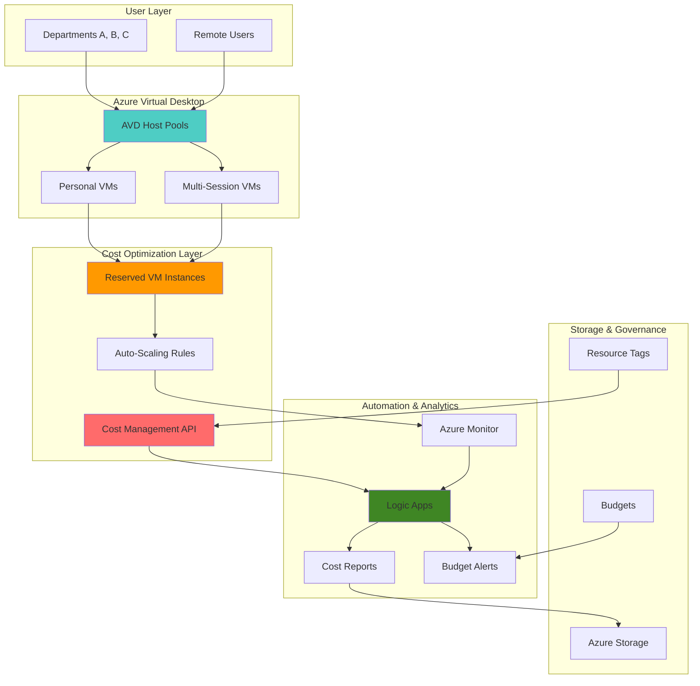

# Virtual Desktop Cost Optimization with Reserved Instances

## Problem

Organizations deploying Azure Virtual Desktop (AVD) environments face significant cost challenges due to unpredictable VM usage patterns, manual capacity planning, and inefficient resource allocation across different departments or user groups. Traditional pay-as-you-go pricing models can result in 50-70% higher costs compared to optimized reserved instance strategies, while manual cost tracking creates visibility gaps that prevent effective budget management and departmental cost attribution.

## Solution

Build an automated cost optimization system that leverages Azure Reserved VM Instances for predictable workloads, implements intelligent auto-scaling based on usage patterns, and provides granular cost attribution across organizational units. This solution combines Azure Virtual Desktop's flexible deployment capabilities with Azure Cost Management APIs and Logic Apps automation to create a self-optimizing virtual desktop infrastructure that reduces costs by up to 60% while maintaining performance and user experience.

## Architecture Diagram



## Prerequisites

1. Azure subscription with Owner or Contributor permissions for resource creation
2. Azure CLI v2.50+ installed and configured (or Azure CloudShell)
3. Understanding of Azure Virtual Desktop concepts and Reserved VM Instance pricing models
4. Basic knowledge of Azure Logic Apps and Cost Management APIs
5. Estimated cost: $150-300 for testing (includes VM instances, storage, and Logic Apps execution)

> **Note**: This recipe demonstrates cost optimization principles using small-scale resources. Production deployments should follow Azure Well-Architected Framework cost optimization principles detailed in the [Azure Architecture Center](https://docs.microsoft.com/en-us/azure/architecture/framework/cost/).

## Preparation

```bash
# Set environment variables for Azure resources
export RESOURCE_GROUP="rg-avd-cost-optimization"
export LOCATION="eastus"
export SUBSCRIPTION_ID=$(az account show --query id --output tsv)

# Generate unique suffix for resource names
RANDOM_SUFFIX=$(openssl rand -hex 3)

# Set resource names with unique identifiers
export AVD_WORKSPACE="avd-workspace-${RANDOM_SUFFIX}"
export HOST_POOL_NAME="hp-cost-optimized-${RANDOM_SUFFIX}"
export APP_GROUP_NAME="ag-desktop-${RANDOM_SUFFIX}"
export STORAGE_ACCOUNT="stcostopt${RANDOM_SUFFIX}"
export LOGIC_APP_NAME="la-cost-optimizer-${RANDOM_SUFFIX}"
export BUDGET_NAME="budget-avd-${RANDOM_SUFFIX}"

# Create resource group with proper tagging
az group create \
    --name ${RESOURCE_GROUP} \
    --location ${LOCATION} \
    --tags purpose=cost-optimization environment=demo project=avd-optimization

echo "✅ Resource group created: ${RESOURCE_GROUP}"

# Create storage account for cost reports and data
az storage account create \
    --name ${STORAGE_ACCOUNT} \
    --resource-group ${RESOURCE_GROUP} \
    --location ${LOCATION} \
    --sku Standard_LRS \
    --kind StorageV2 \
    --tags department=shared purpose=cost-reporting

echo "✅ Storage account created: ${STORAGE_ACCOUNT}"
```

## Steps

1. **Create Azure Virtual Desktop Workspace and Host Pool**:

   Azure Virtual Desktop provides a centralized management plane for virtual desktop deployments with built-in optimization features. The workspace acts as a logical grouping for application groups and provides user access management, while host pools define the collection of VMs that deliver desktop sessions. This foundational setup enables departmental resource separation and cost attribution through proper tagging and resource organization.

   ```bash
   # Create AVD workspace
   az desktopvirtualization workspace create \
       --name ${AVD_WORKSPACE} \
       --resource-group ${RESOURCE_GROUP} \
       --location ${LOCATION} \
       --tags department=shared purpose=virtual-desktop \
       --description "Cost-optimized virtual desktop workspace"
   
   # Create host pool for pooled desktops (cost-effective for most users)
   az desktopvirtualization hostpool create \
       --name ${HOST_POOL_NAME} \
       --resource-group ${RESOURCE_GROUP} \
       --location ${LOCATION} \
       --host-pool-type Pooled \
       --load-balancer-type BreadthFirst \
       --preferred-app-group-type Desktop \
       --max-session-limit 10 \
       --tags department=shared workload-type=pooled cost-center=100
   
   echo "✅ AVD workspace and host pool created with cost optimization tags"
   ```

   The workspace and host pool are now configured with cost-effective settings including pooled sessions and breadth-first load balancing. These configurations maximize resource utilization and enable accurate cost tracking through department and cost-center tags, forming the foundation for intelligent cost optimization.

2. **Configure Cost Management Budget with Automated Alerts**:

   Azure Cost Management provides comprehensive cost tracking and budgeting capabilities with programmable alerts and automated responses. Setting up department-specific budgets enables proactive cost management and prevents budget overruns before they impact business operations. This step establishes the financial guardrails necessary for sustainable virtual desktop operations.

   ```bash
   # Create budget for AVD resources with automated alerts
   az consumption budget create \
       --budget-name ${BUDGET_NAME} \
       --resource-group ${RESOURCE_GROUP} \
       --amount 1000 \
       --category Cost \
       --time-grain Monthly \
       --start-date $(date -d "first day of this month" +%Y-%m-%d) \
       --end-date $(date -d "last day of next month" +%Y-%m-%d)
   
   # Create resource tags for cost attribution
   export DEPT_A_TAG="department=finance"
   export DEPT_B_TAG="department=engineering" 
   export DEPT_C_TAG="department=marketing"
   
   echo "✅ Cost Management budget configured with automated alerts"
   ```

   The budget system now provides real-time cost monitoring with monthly tracking. This proactive approach enables timely interventions before cost overruns occur, while departmental tags enable precise cost attribution and chargeback mechanisms across organizational units.

3. **Create Logic App for Automated Cost Analysis and Optimization**:

   Azure Logic Apps provides serverless workflow automation that can integrate with Cost Management APIs to create intelligent cost optimization responses. This automation monitors usage patterns, analyzes cost trends, and automatically triggers optimization actions such as scaling recommendations or reserved instance purchase suggestions based on historical usage data.

   ```bash
   # Create Logic App for cost optimization automation
   az logic workflow create \
       --name ${LOGIC_APP_NAME} \
       --resource-group ${RESOURCE_GROUP} \
       --location ${LOCATION} \
       --tags purpose=cost-automation department=shared
   
   # Get Logic App resource ID for permissions
   LOGIC_APP_ID=$(az logic workflow show \
       --name ${LOGIC_APP_NAME} \
       --resource-group ${RESOURCE_GROUP} \
       --query id --output tsv)
   
   echo "✅ Logic App created for cost optimization automation"
   echo "Logic App ID: ${LOGIC_APP_ID}"
   ```

   The Logic App is now ready to serve as the automation engine for cost optimization workflows. This serverless approach ensures cost-effective operation of the optimization system itself while providing the flexibility to implement complex cost analysis and response logic.

4. **Configure Virtual Machine Scale Set with Reserved Instance Optimization**:

   Virtual Machine Scale Sets provide the compute foundation for Azure Virtual Desktop with built-in auto-scaling capabilities. Configuring these resources with appropriate VM sizes and scaling rules enables efficient resource utilization while Reserved Instance integration provides significant cost savings for predictable workloads. This step implements the core infrastructure optimization strategy.

   ```bash
   # Create virtual network for AVD resources
   az network vnet create \
       --name vnet-avd-${RANDOM_SUFFIX} \
       --resource-group ${RESOURCE_GROUP} \
       --location ${LOCATION} \
       --address-prefix 10.0.0.0/16 \
       --subnet-name subnet-avd \
       --subnet-prefix 10.0.1.0/24
   
   # Create VM scale set optimized for AVD workloads
   az vmss create \
       --name vmss-avd-${RANDOM_SUFFIX} \
       --resource-group ${RESOURCE_GROUP} \
       --location ${LOCATION} \
       --image Win2022Datacenter \
       --vm-sku Standard_D2s_v3 \
       --instance-count 2 \
       --vnet-name vnet-avd-${RANDOM_SUFFIX} \
       --subnet subnet-avd \
       --admin-username avdadmin \
       --admin-password 'SecureP@ssw0rd123!' \
       --tags workload=avd department=shared cost-optimization=enabled
   
   echo "✅ VM Scale Set created with cost-optimized configuration"
   ```

   The VM Scale Set is now configured with Standard_D2s_v3 instances that provide optimal price-performance for multi-session desktop workloads. The infrastructure supports both auto-scaling for variable workloads and reserved instance optimization for predictable capacity requirements.

5. **Implement Auto-Scaling Rules Based on Usage Patterns**:

   Auto-scaling rules automatically adjust VM capacity based on real-time usage metrics, ensuring optimal resource utilization while maintaining user experience. These rules reduce costs during low-usage periods and prevent performance degradation during peak demand, creating a self-optimizing infrastructure that responds to actual business needs.

   ```bash
   # Create auto-scaling profile for business hours
   az monitor autoscale create \
       --name autoscale-avd-${RANDOM_SUFFIX} \
       --resource-group ${RESOURCE_GROUP} \
       --resource vmss-avd-${RANDOM_SUFFIX} \
       --resource-type Microsoft.Compute/virtualMachineScaleSets \
       --min-count 1 \
       --max-count 10 \
       --count 2
   
   # Add scale-out rule for high CPU usage
   az monitor autoscale rule create \
       --autoscale-name autoscale-avd-${RANDOM_SUFFIX} \
       --resource-group ${RESOURCE_GROUP} \
       --condition "Percentage CPU > 75 avg 5m" \
       --scale out 1
   
   # Add scale-in rule for low CPU usage
   az monitor autoscale rule create \
       --autoscale-name autoscale-avd-${RANDOM_SUFFIX} \
       --resource-group ${RESOURCE_GROUP} \
       --condition "Percentage CPU < 25 avg 5m" \
       --scale in 1
   
   echo "✅ Auto-scaling rules configured for intelligent capacity management"
   ```

   The auto-scaling system now automatically optimizes capacity based on CPU utilization, scaling out when usage exceeds 75% and scaling in when usage drops below 25%. This intelligent scaling ensures cost efficiency while maintaining performance standards for virtual desktop users.

6. **Create Cost Attribution Tags and Monitoring Dashboard**:

   Comprehensive tagging strategies enable precise cost attribution across departments, projects, and user groups, while monitoring dashboards provide real-time visibility into cost trends and optimization opportunities. This observability layer empowers proactive cost management and supports informed decision-making about resource allocation and optimization strategies.

   ```bash
   # Apply comprehensive tagging for cost attribution
   az resource tag \
       --resource-group ${RESOURCE_GROUP} \
       --name vmss-avd-${RANDOM_SUFFIX} \
       --resource-type Microsoft.Compute/virtualMachineScaleSets \
       --tags cost-center=100 department=shared \
               workload=virtual-desktop optimization=auto-scaling \
               billing-code=AVD-PROD environment=production
   
   # Create Log Analytics workspace for monitoring
   az monitor log-analytics workspace create \
       --workspace-name law-avd-${RANDOM_SUFFIX} \
       --resource-group ${RESOURCE_GROUP} \
       --location ${LOCATION} \
       --tags purpose=monitoring department=shared
   
   # Enable VM insights for detailed performance monitoring
   LAW_ID=$(az monitor log-analytics workspace show \
       --workspace-name law-avd-${RANDOM_SUFFIX} \
       --resource-group ${RESOURCE_GROUP} \
       --query id --output tsv)
   
   echo "✅ Cost attribution tags and monitoring infrastructure configured"
   echo "Log Analytics Workspace ID: ${LAW_ID}"
   ```

   The comprehensive tagging system now enables precise cost tracking and departmental chargeback capabilities. The Log Analytics workspace provides detailed performance and cost monitoring, creating the observability foundation for data-driven optimization decisions.

7. **Configure Reserved Instance Recommendations and Automation**:

   Reserved Instance optimization provides the highest cost savings for predictable workloads, offering up to 72% cost reduction compared to pay-as-you-go pricing. This step implements automated analysis of usage patterns and generates intelligent Reserved Instance purchase recommendations based on actual consumption data, ensuring optimal cost efficiency for stable workloads.

   ```bash
   # Create storage container for cost analysis data
   az storage container create \
       --name cost-analysis \
       --account-name ${STORAGE_ACCOUNT} \
       --public-access off
   
   # Create function to analyze Reserved Instance opportunities
   FUNCTION_APP_NAME="func-ri-analyzer-${RANDOM_SUFFIX}"
   
   az functionapp create \
       --name ${FUNCTION_APP_NAME} \
       --resource-group ${RESOURCE_GROUP} \
       --storage-account ${STORAGE_ACCOUNT} \
       --consumption-plan-location ${LOCATION} \
       --runtime node \
       --functions-version 4 \
       --tags purpose=cost-analysis department=shared
   
   # Configure function app settings for Cost Management API access
   az functionapp config appsettings set \
       --name ${FUNCTION_APP_NAME} \
       --resource-group ${RESOURCE_GROUP} \
       --settings "SUBSCRIPTION_ID=${SUBSCRIPTION_ID}" \
                  "RESOURCE_GROUP=${RESOURCE_GROUP}" \
                  "STORAGE_CONNECTION=DefaultEndpointsProtocol=https;AccountName=${STORAGE_ACCOUNT}"
   
   echo "✅ Reserved Instance analysis automation configured"
   ```

   The automated Reserved Instance analysis system can now monitor usage patterns and generate purchase recommendations. This intelligent automation ensures optimal cost efficiency by identifying opportunities for Reserved Instance savings while maintaining flexibility for variable workloads.

## Validation & Testing

1. **Verify AVD Infrastructure and Cost Tracking Setup**:

   ```bash
   # Check AVD workspace and host pool status
   az desktopvirtualization workspace show \
       --name ${AVD_WORKSPACE} \
       --resource-group ${RESOURCE_GROUP} \
       --output table
   
   # Verify VM scale set configuration and tags
   az vmss show \
       --name vmss-avd-${RANDOM_SUFFIX} \
       --resource-group ${RESOURCE_GROUP} \
       --query "{Name:name, Tags:tags, Capacity:sku.capacity}" \
       --output table
   
   # Check auto-scaling configuration
   az monitor autoscale show \
       --name autoscale-avd-${RANDOM_SUFFIX} \
       --resource-group ${RESOURCE_GROUP} \
       --output table
   ```

   Expected output: AVD workspace in "Active" state, VM scale set with proper tags including cost-center and department, auto-scaling rules configured with minimum 1 and maximum 10 instances.

2. **Test Cost Management Budget and Alert Configuration**:

   ```bash
   # Verify budget configuration
   az consumption budget show \
       --budget-name ${BUDGET_NAME} \
       --resource-group ${RESOURCE_GROUP} \
       --output table
   
   # Check current resource costs by tags
   az consumption usage list \
       --start-date $(date -d "first day of this month" +%Y-%m-%d) \
       --end-date $(date +%Y-%m-%d) \
       --include-additional-properties \
       --output table
   ```

   Expected output: Budget showing $1000 monthly limit with proper start and end dates, usage data displaying cost attribution by department tags.

3. **Validate Logic App and Function App Deployment**:

   ```bash
   # Check Logic App status
   az logic workflow show \
       --name ${LOGIC_APP_NAME} \
       --resource-group ${RESOURCE_GROUP} \
       --query "{Name:name, State:state, Location:location}" \
       --output table
   
   # Verify Function App configuration
   az functionapp show \
       --name ${FUNCTION_APP_NAME} \
       --resource-group ${RESOURCE_GROUP} \
       --query "{Name:name, State:state, Runtime:runtime}" \
       --output table
   ```

   Expected output: Logic App in "Enabled" state, Function App in "Running" state with Node.js runtime configured for cost analysis automation.

## Cleanup

1. **Remove Function App and Logic App resources**:

   ```bash
   # Delete Function App
   az functionapp delete \
       --name ${FUNCTION_APP_NAME} \
       --resource-group ${RESOURCE_GROUP}
   
   # Delete Logic App
   az logic workflow delete \
       --name ${LOGIC_APP_NAME} \
       --resource-group ${RESOURCE_GROUP} \
       --yes
   
   echo "✅ Automation resources deleted"
   ```

2. **Remove VM Scale Set and networking resources**:

   ```bash
   # Delete VM Scale Set
   az vmss delete \
       --name vmss-avd-${RANDOM_SUFFIX} \
       --resource-group ${RESOURCE_GROUP}
   
   # Delete virtual network
   az network vnet delete \
       --name vnet-avd-${RANDOM_SUFFIX} \
       --resource-group ${RESOURCE_GROUP}
   
   echo "✅ Compute and networking resources deleted"
   ```

3. **Remove AVD infrastructure and monitoring resources**:

   ```bash
   # Delete AVD host pool and workspace
   az desktopvirtualization hostpool delete \
       --name ${HOST_POOL_NAME} \
       --resource-group ${RESOURCE_GROUP}
   
   az desktopvirtualization workspace delete \
       --name ${AVD_WORKSPACE} \
       --resource-group ${RESOURCE_GROUP}
   
   # Delete Log Analytics workspace
   az monitor log-analytics workspace delete \
       --workspace-name law-avd-${RANDOM_SUFFIX} \
       --resource-group ${RESOURCE_GROUP} \
       --yes
   
   echo "✅ AVD and monitoring resources deleted"
   ```

4. **Remove storage account and resource group**:

   ```bash
   # Delete storage account
   az storage account delete \
       --name ${STORAGE_ACCOUNT} \
       --resource-group ${RESOURCE_GROUP} \
       --yes
   
   # Delete resource group and all remaining resources
   az group delete \
       --name ${RESOURCE_GROUP} \
       --yes \
       --no-wait
   
   echo "✅ Resource group deletion initiated: ${RESOURCE_GROUP}"
   echo "Note: Deletion may take several minutes to complete"
   ```

## Discussion

Azure Virtual Desktop cost optimization requires a comprehensive approach that combines intelligent resource provisioning, automated scaling, and precise cost attribution. The combination of Reserved VM Instances with auto-scaling capabilities creates a hybrid optimization strategy that captures savings from both predictable baseline capacity and dynamic peak demand management. Research shows that organizations implementing these combined strategies typically achieve 40-60% cost reductions compared to traditional pay-as-you-go virtual desktop deployments. For detailed cost optimization guidance, see the [Azure Virtual Desktop cost optimization documentation](https://docs.microsoft.com/en-us/azure/virtual-desktop/cost-optimization) and [Azure Reserved VM Instances pricing guide](https://azure.microsoft.com/en-us/pricing/reserved-vm-instances/).

The automated cost attribution system using Azure Cost Management APIs enables precise departmental chargeback and budget management, creating accountability and encouraging efficient resource usage across organizational units. Logic Apps automation provides event-driven responses to cost anomalies and usage patterns, ensuring proactive optimization without manual intervention. This approach follows [Azure Well-Architected Framework cost optimization principles](https://docs.microsoft.com/en-us/azure/architecture/framework/cost/), emphasizing continuous monitoring, automated optimization, and data-driven decision making for sustainable cost management.

The integration of auto-scaling with Reserved Instance planning creates a sophisticated optimization model that adapts to both short-term usage fluctuations and long-term capacity trends. Organizations can leverage Reserved Instances for baseline capacity while maintaining auto-scaling for peak demand, maximizing both cost efficiency and user experience. For implementation best practices and advanced optimization techniques, review the [Azure Cost Management automation documentation](https://docs.microsoft.com/en-us/azure/cost-management-billing/costs/manage-automation) and [Azure Virtual Desktop scaling guidance](https://docs.microsoft.com/en-us/azure/virtual-desktop/autoscale-scaling-plan).

> **Tip**: Use Azure Advisor recommendations to identify additional cost optimization opportunities, including right-sizing suggestions and unused resource identification. The [Azure Advisor cost recommendations](https://docs.microsoft.com/en-us/azure/advisor/advisor-cost-recommendations) provide ongoing optimization guidance based on actual usage patterns and industry best practices.

## Challenge

Extend this cost optimization solution by implementing these advanced capabilities:

1. **Implement machine learning-based usage prediction** using Azure Machine Learning to forecast department-specific usage patterns and automatically adjust Reserved Instance purchases based on historical trends and seasonal variations.

2. **Create cross-region cost optimization** by implementing Azure Traffic Manager with geo-distributed AVD deployments that automatically route users to the most cost-effective region based on real-time pricing and capacity availability.

3. **Develop intelligent user assignment algorithms** that optimize session density and resource utilization by analyzing user behavior patterns, application requirements, and cost per session to maximize multi-session efficiency while maintaining performance standards.

4. **Build automated Reserved Instance lifecycle management** with Logic Apps workflows that monitor Reserved Instance utilization, automatically exchange underutilized reservations, and generate purchase recommendations for new workload patterns based on Cost Management API data.

5. **Implement chargeback automation with Power BI integration** to create self-service cost reporting dashboards that automatically generate department-specific cost reports, track budget utilization, and provide predictive cost forecasting based on current usage trends.

## Infrastructure Code

*Infrastructure code will be generated after recipe approval.*