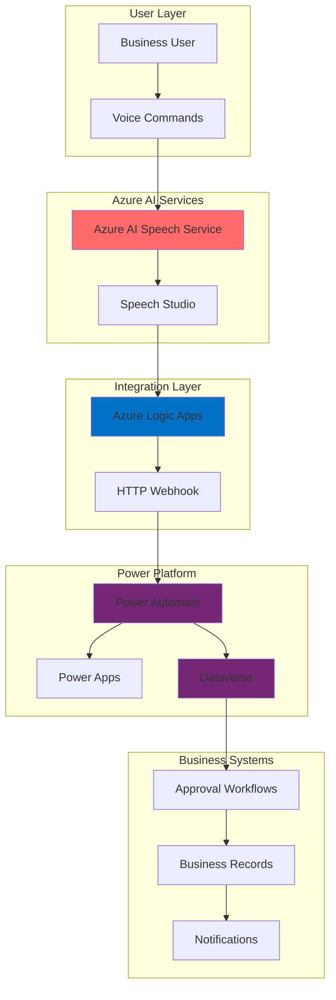

# Voice-Driven Workflow Automation with Speech Recognition

## Problem

Organizations struggle with time-consuming manual approval processes and data entry tasks that require employees to navigate complex forms and interfaces. Traditional business process automation requires users to interact with multiple systems through clicks, typing, and navigation, creating friction that slows down decision-making and reduces productivity. Companies need a more natural, efficient way to interact with their business systems through voice commands while maintaining security and audit compliance.

## Solution

Build an intelligent voice-driven business process automation system that leverages Azure AI Speech Services to convert spoken commands into structured data, which then triggers automated workflows in Power Platform. This solution uses Azure Logic Apps to orchestrate the integration between speech recognition and Power Automate flows, enabling employees to initiate approvals, update records, and execute business processes through natural voice interactions while maintaining proper audit trails and security controls.

## Architecture Diagram



## Prerequisites

1. Azure subscription with permissions to create Cognitive Services and Logic Apps
2. Power Platform environment with Power Automate premium license
3. Azure CLI v2.0 or later installed and configured (or Azure Cloud Shell)
4. Power Platform CLI installed locally or accessible through browser
5. Basic understanding of REST APIs and webhook configuration
6. Estimated cost: $20-50/month for development and testing (varies by usage)

> **Note**: Azure AI Speech Services offers 5 hours of free speech-to-text processing per month. Power Platform licensing requirements may apply for premium connectors and Dataverse usage.

## Preparation

```bash
# Set environment variables for Azure resources
export RESOURCE_GROUP="rg-voice-automation-${RANDOM_SUFFIX}"
export LOCATION="eastus"
export SUBSCRIPTION_ID=$(az account show --query id --output tsv)

# Generate unique suffix for resource names
RANDOM_SUFFIX=$(openssl rand -hex 3)

# Set Speech Services variables
export SPEECH_SERVICE_NAME="speech-voice-automation-${RANDOM_SUFFIX}"
export LOGIC_APP_NAME="logic-voice-processor-${RANDOM_SUFFIX}"
export STORAGE_ACCOUNT_NAME="stvoiceauto${RANDOM_SUFFIX}"

# Create resource group
az group create \
    --name ${RESOURCE_GROUP} \
    --location ${LOCATION} \
    --tags purpose=voice-automation environment=demo

echo "✅ Resource group created: ${RESOURCE_GROUP}"

# Create storage account for Logic Apps (only needed for Standard tier)
az storage account create \
    --name ${STORAGE_ACCOUNT_NAME} \
    --resource-group ${RESOURCE_GROUP} \
    --location ${LOCATION} \
    --sku Standard_LRS \
    --kind StorageV2

echo "✅ Storage account created for Logic Apps"
```

## Steps

1. **Create Azure AI Speech Service**:

   Azure AI Speech Service provides real-time speech recognition and text-to-speech capabilities with support for multiple languages and custom models. This managed service eliminates the complexity of building speech recognition infrastructure while providing enterprise-grade security and compliance features. The service supports both batch and real-time processing, making it ideal for interactive business applications.

   ```bash
   # Create Azure AI Speech Service (now part of AI Foundry resource)
   az cognitiveservices account create \
       --name ${SPEECH_SERVICE_NAME} \
       --resource-group ${RESOURCE_GROUP} \
       --location ${LOCATION} \
       --kind SpeechServices \
       --sku S0 \
       --yes
   
   # Get Speech Service keys and endpoint
   SPEECH_KEY=$(az cognitiveservices account keys list \
       --name ${SPEECH_SERVICE_NAME} \
       --resource-group ${RESOURCE_GROUP} \
       --query key1 --output tsv)
   
   SPEECH_ENDPOINT=$(az cognitiveservices account show \
       --name ${SPEECH_SERVICE_NAME} \
       --resource-group ${RESOURCE_GROUP} \
       --query properties.endpoint --output tsv)
   
   echo "✅ Speech Service created with endpoint: ${SPEECH_ENDPOINT}"
   ```

   The Speech Service is now ready to process voice commands with enterprise-grade security and scalability. This foundation enables real-time speech-to-text conversion with customizable models and language support, providing the core capability for voice-driven business process automation.

2. **Create Azure Logic App for Speech Processing**:

   Azure Logic Apps provides serverless workflow orchestration that connects cloud services, on-premises systems, and APIs without managing infrastructure. This integration platform enables sophisticated business process automation with built-in error handling, retry mechanisms, and monitoring capabilities. Logic Apps serve as the perfect bridge between Azure AI services and Power Platform components.

   ```bash
   # Create Logic App (Consumption tier - no storage account needed)
   az logic workflow create \
       --name ${LOGIC_APP_NAME} \
       --resource-group ${RESOURCE_GROUP} \
       --location ${LOCATION}
   
   # Get Logic App resource ID for later configuration
   LOGIC_APP_ID=$(az logic workflow show \
       --name ${LOGIC_APP_NAME} \
       --resource-group ${RESOURCE_GROUP} \
       --query id --output tsv)
   
   echo "✅ Logic App created: ${LOGIC_APP_NAME}"
   echo "Logic App ID: ${LOGIC_APP_ID}"
   ```

   The Logic App provides a serverless integration layer that can process speech recognition results and trigger Power Platform workflows. This architecture ensures reliable message processing with built-in retry logic and monitoring, essential for business-critical automation scenarios.

3. **Configure Speech Service with Custom Commands**:

   Azure Speech Studio provides a visual interface for creating custom voice commands and training speech models specific to your business vocabulary. This no-code approach allows business users to define voice commands, intents, and responses without programming expertise. Custom commands ensure accurate recognition of business-specific terminology and improve overall user experience.

   ```bash
   # Create a custom commands project configuration
   cat > speech-commands-config.json << 'EOF'
   {
     "name": "VoiceBusinessAutomation",
     "description": "Voice commands for business process automation",
     "language": "en-US",
     "commands": [
       {
         "name": "ApproveRequest",
         "patterns": [
           "approve request {requestId}",
           "approve {requestId}",
           "yes approve request number {requestId}"
         ],
         "parameters": [
           {
             "name": "requestId",
             "type": "string",
             "required": true
           }
         ]
       },
       {
         "name": "RejectRequest",
         "patterns": [
           "reject request {requestId}",
           "deny {requestId}",
           "no reject request number {requestId}"
         ],
         "parameters": [
           {
             "name": "requestId",
             "type": "string",
             "required": true
           }
         ]
       },
       {
         "name": "UpdateRecord",
         "patterns": [
           "update record {recordId} with {fieldName} {value}",
           "set {fieldName} to {value} for record {recordId}"
         ],
         "parameters": [
           {
             "name": "recordId",
             "type": "string",
             "required": true
           },
           {
             "name": "fieldName",
             "type": "string",
             "required": true
           },
           {
             "name": "value",
             "type": "string",
             "required": true
           }
         ]
       }
     ]
   }
   EOF
   
   echo "✅ Custom commands configuration created"
   echo "Navigate to Speech Studio to import this configuration"
   ```

   This configuration defines structured voice commands that map to specific business actions. The custom commands ensure accurate intent recognition and parameter extraction, enabling reliable automation of complex business processes through natural voice interactions.

4. **Create Power Automate Flow for Business Process Automation**:

   Power Automate provides low-code workflow automation that connects to hundreds of services and systems. This cloud-based service enables business users to create sophisticated automation workflows without traditional programming. The integration with Dataverse provides a robust data platform for storing business records and maintaining audit trails.

   ```bash
   # Create Power Automate flow definition
   cat > power-automate-flow.json << 'EOF'
   {
     "definition": {
       "triggers": {
         "manual": {
           "type": "Request",
           "kind": "Http",
           "inputs": {
             "schema": {
               "type": "object",
               "properties": {
                 "command": {
                   "type": "string"
                 },
                 "parameters": {
                   "type": "object"
                 },
                 "userId": {
                   "type": "string"
                 },
                 "timestamp": {
                   "type": "string"
                 }
               }
             }
           }
         }
       },
       "actions": {
         "Switch_Command": {
           "type": "Switch",
           "expression": "@triggerBody()?['command']",
           "cases": {
             "ApproveRequest": {
               "case": "ApproveRequest",
               "actions": {
                 "Update_Approval_Status": {
                   "type": "ApiConnection",
                   "inputs": {
                     "host": {
                       "connectionName": "shared_commondataserviceforapps",
                       "operationId": "UpdateRecord"
                     },
                     "parameters": {
                       "entityName": "approvals",
                       "recordId": "@triggerBody()?['parameters']?['requestId']",
                       "item": {
                         "status": "approved",
                         "approvedBy": "@triggerBody()?['userId']",
                         "approvedDate": "@utcnow()"
                       }
                     }
                   }
                 }
               }
             },
             "RejectRequest": {
               "case": "RejectRequest",
               "actions": {
                 "Update_Rejection_Status": {
                   "type": "ApiConnection",
                   "inputs": {
                     "host": {
                       "connectionName": "shared_commondataserviceforapps",
                       "operationId": "UpdateRecord"
                     },
                     "parameters": {
                       "entityName": "approvals",
                       "recordId": "@triggerBody()?['parameters']?['requestId']",
                       "item": {
                         "status": "rejected",
                         "rejectedBy": "@triggerBody()?['userId']",
                         "rejectedDate": "@utcnow()"
                       }
                     }
                   }
                 }
               }
             }
           }
         }
       }
     }
   }
   EOF
   
   echo "✅ Power Automate flow definition created"
   echo "Import this flow into your Power Platform environment"
   ```

   This flow definition provides the business logic for processing voice commands and updating business records. The switch statement routes different voice commands to appropriate actions while maintaining audit trails and security controls through Power Platform's built-in capabilities.

5. **Configure Logic App Workflow for Speech-to-Power Platform Integration**:

   The Logic App serves as the integration bridge between Azure AI Speech Services and Power Platform, handling authentication, data transformation, and error management. This serverless approach ensures reliable processing of voice commands while maintaining enterprise security and compliance requirements.

   ```bash
   # Create Logic App workflow definition
   cat > logic-app-workflow.json << 'EOF'
   {
     "definition": {
       "$schema": "https://schema.management.azure.com/providers/Microsoft.Logic/schemas/2016-06-01/workflowdefinition.json#",
       "contentVersion": "1.0.0.0",
       "triggers": {
         "manual": {
           "type": "Request",
           "kind": "Http",
           "inputs": {
             "schema": {
               "type": "object",
               "properties": {
                 "text": {
                   "type": "string"
                 },
                 "confidence": {
                   "type": "number"
                 },
                 "userId": {
                   "type": "string"
                 }
               }
             }
           }
         }
       },
       "actions": {
         "Parse_Voice_Command": {
           "type": "JavaScriptCode",
           "inputs": {
             "code": "const text = workflowContext.trigger.outputs.body.text.toLowerCase();\nconst patterns = {\n  approve: /approve.*?request.*?(\\d+)/,\n  reject: /reject.*?request.*?(\\d+)/,\n  update: /update.*?record.*?(\\d+).*?with.*?(\\w+).*?(.+)/\n};\n\nlet command = null;\nlet parameters = {};\n\nfor (const [key, pattern] of Object.entries(patterns)) {\n  const match = text.match(pattern);\n  if (match) {\n    command = key;\n    if (key === 'approve' || key === 'reject') {\n      parameters.requestId = match[1];\n    } else if (key === 'update') {\n      parameters.recordId = match[1];\n      parameters.fieldName = match[2];\n      parameters.value = match[3].trim();\n    }\n    break;\n  }\n}\n\nreturn {\n  command: command,\n  parameters: parameters,\n  originalText: text\n};"
           }
         },
         "Call_Power_Automate": {
           "type": "Http",
           "inputs": {
             "method": "POST",
             "uri": "https://your-power-automate-flow-url",
             "headers": {
               "Content-Type": "application/json"
             },
             "body": {
               "command": "@{outputs('Parse_Voice_Command')?['command']}",
               "parameters": "@{outputs('Parse_Voice_Command')?['parameters']}",
               "userId": "@{triggerBody()?['userId']}",
               "timestamp": "@{utcnow()}"
             }
           }
         }
       }
     }
   }
   EOF
   
   # Deploy the Logic App workflow
   az logic workflow create \
       --name ${LOGIC_APP_NAME} \
       --resource-group ${RESOURCE_GROUP} \
       --location ${LOCATION} \
       --definition @logic-app-workflow.json
   
   echo "✅ Logic App workflow deployed"
   ```

   The Logic App now processes speech recognition results and transforms them into structured commands for Power Platform. This integration layer provides natural language processing capabilities and ensures reliable communication between Azure AI services and business automation workflows.

6. **Create Dataverse Tables for Business Records**:

   Microsoft Dataverse provides a secure, scalable data platform that integrates natively with Power Platform applications. This managed database service offers enterprise-grade security, compliance features, and rich relationship modeling capabilities. Dataverse serves as the central repository for business data with built-in audit trails and access controls.

   ```bash
   # Create Dataverse table definitions
   cat > dataverse-tables.json << 'EOF'
   {
     "tables": [
       {
         "name": "voice_automation_approvals",
         "displayName": "Voice Automation Approvals",
         "description": "Tracks approval requests processed through voice commands",
         "columns": [
           {
             "name": "request_id",
             "type": "string",
             "displayName": "Request ID",
             "required": true
           },
           {
             "name": "status",
             "type": "choice",
             "displayName": "Status",
             "choices": ["pending", "approved", "rejected"],
             "required": true
           },
           {
             "name": "approved_by",
             "type": "string",
             "displayName": "Approved By"
           },
           {
             "name": "approved_date",
             "type": "datetime",
             "displayName": "Approved Date"
           },
           {
             "name": "voice_command_text",
             "type": "string",
             "displayName": "Voice Command Text"
           }
         ]
       },
       {
         "name": "voice_automation_audit",
         "displayName": "Voice Automation Audit",
         "description": "Audit trail for all voice automation activities",
         "columns": [
           {
             "name": "user_id",
             "type": "string",
             "displayName": "User ID",
             "required": true
           },
           {
             "name": "command",
             "type": "string",
             "displayName": "Command",
             "required": true
           },
           {
             "name": "timestamp",
             "type": "datetime",
             "displayName": "Timestamp",
             "required": true
           },
           {
             "name": "success",
             "type": "boolean",
             "displayName": "Success"
           }
         ]
       }
     ]
   }
   EOF
   
   echo "✅ Dataverse table definitions created"
   echo "Import these tables into your Power Platform environment"
   ```

   These Dataverse tables provide the data foundation for voice automation workflows with proper audit trails and security controls. The structured approach ensures data integrity while enabling rich reporting and analytics capabilities for business process monitoring.

7. **Configure Power Apps Interface for Voice Interaction**:

   Power Apps provides a low-code platform for building custom business applications with rich user interfaces. The voice integration capability allows users to interact with business data through natural speech while maintaining visual feedback and confirmation workflows. This hybrid approach combines the efficiency of voice commands with the clarity of visual interfaces.

   ```bash
   # Create Power Apps configuration for voice interface
   cat > power-apps-voice-config.json << 'EOF'
   {
     "app": {
       "name": "VoiceAutomationApp",
       "description": "Business process automation with voice commands",
       "components": [
         {
           "type": "VoiceRecognitionButton",
           "properties": {
             "text": "Start Voice Command",
             "speechService": "azure-speech-service",
             "onSpeechRecognized": "ProcessVoiceCommand"
           }
         },
         {
           "type": "Gallery",
           "properties": {
             "dataSource": "voice_automation_approvals",
             "fields": ["request_id", "status", "approved_by", "approved_date"]
           }
         },
         {
           "type": "TextInput",
           "properties": {
             "placeholder": "Or type your command here...",
             "onTextChange": "ProcessTextCommand"
           }
         }
       ],
       "functions": [
         {
           "name": "ProcessVoiceCommand",
           "code": "// Process voice command through Logic App\nconst response = await fetch('LOGIC_APP_ENDPOINT', {\n  method: 'POST',\n  headers: {'Content-Type': 'application/json'},\n  body: JSON.stringify({\n    text: speechResult.text,\n    confidence: speechResult.confidence,\n    userId: User().Email\n  })\n});"
         }
       ]
     }
   }
   EOF
   
   echo "✅ Power Apps voice interface configuration created"
   echo "Use Power Apps Studio to build the voice-enabled application"
   ```

   This configuration provides a user-friendly interface that combines voice commands with visual feedback, ensuring users can efficiently interact with business processes while maintaining clarity and control over their actions.

8. **Test Voice Command Processing**:

   Testing the voice automation system ensures reliability and accuracy before deploying to production users. This comprehensive testing approach validates speech recognition accuracy, command parsing logic, and business process execution while identifying potential issues with voice command interpretation.

   ```bash
   # Test the complete voice automation flow
   echo "Testing voice command processing..."
   
   # Get Logic App trigger URL
   LOGIC_APP_TRIGGER_URL=$(az logic workflow trigger list \
       --name ${LOGIC_APP_NAME} \
       --resource-group ${RESOURCE_GROUP} \
       --query '[0].properties.callbackUrl' --output tsv)
   
   # Test approve request command
   curl -X POST "${LOGIC_APP_TRIGGER_URL}" \
       -H "Content-Type: application/json" \
       -d '{
         "text": "approve request 12345",
         "confidence": 0.95,
         "userId": "test.user@company.com"
       }'
   
   # Test reject request command
   curl -X POST "${LOGIC_APP_TRIGGER_URL}" \
       -H "Content-Type: application/json" \
       -d '{
         "text": "reject request 12346",
         "confidence": 0.92,
         "userId": "test.user@company.com"
       }'
   
   echo "✅ Voice command tests completed"
   echo "Check Power Platform for processed requests"
   ```

   The testing validates the complete integration from voice recognition through business process execution, ensuring the system correctly processes commands and maintains audit trails for compliance and monitoring purposes.

## Validation & Testing

1. **Verify Azure Speech Service Configuration**:

   ```bash
   # Test Speech Service availability
   az cognitiveservices account show \
       --name ${SPEECH_SERVICE_NAME} \
       --resource-group ${RESOURCE_GROUP} \
       --query '{name:name,state:properties.provisioningState,endpoint:properties.endpoint}' \
       --output table
   
   # Test Speech Service connectivity (requires audio file)
   echo "To test speech recognition, use the Speech CLI:"
   echo "spx recognize --microphone --source en-US"
   ```

   Expected output: Speech Service should show as "Succeeded" in provisioning state.

2. **Test Logic App Workflow Execution**:

   ```bash
   # Check Logic App run history
   az logic workflow run list \
       --name ${LOGIC_APP_NAME} \
       --resource-group ${RESOURCE_GROUP} \
       --query '[0].{status:status,startTime:startTime,endTime:endTime}' \
       --output table
   
   # Test webhook endpoint
   curl -X POST "${LOGIC_APP_TRIGGER_URL}" \
       -H "Content-Type: application/json" \
       -d '{"text": "approve request 999", "confidence": 0.98, "userId": "test@company.com"}'
   ```

   Expected output: Logic App should process the request and return success status.

3. **Verify Power Platform Integration**:

   ```bash
   # Query Dataverse records through Power Platform CLI
   # (Requires authentication to Power Platform environment)
   echo "Use Power Platform CLI to verify data:"
   echo "pac data list-records --table-name voice_automation_approvals"
   ```

   Expected output: Records should show processed voice commands with proper status updates.

## Cleanup

1. **Remove Azure AI Speech Service**:

   ```bash
   # Delete Speech Service
   az cognitiveservices account delete \
       --name ${SPEECH_SERVICE_NAME} \
       --resource-group ${RESOURCE_GROUP}
   
   echo "✅ Speech Service deleted"
   ```

2. **Remove Logic App and Storage**:

   ```bash
   # Delete Logic App
   az logic workflow delete \
       --name ${LOGIC_APP_NAME} \
       --resource-group ${RESOURCE_GROUP}
   
   # Delete Storage Account
   az storage account delete \
       --name ${STORAGE_ACCOUNT_NAME} \
       --resource-group ${RESOURCE_GROUP} \
       --yes
   
   echo "✅ Logic App and Storage deleted"
   ```

3. **Remove Resource Group**:

   ```bash
   # Delete entire resource group
   az group delete \
       --name ${RESOURCE_GROUP} \
       --yes \
       --no-wait
   
   echo "✅ Resource group deletion initiated"
   echo "Note: Power Platform resources require manual cleanup"
   ```

## Discussion

Voice-enabled business process automation represents a significant advancement in human-computer interaction for enterprise applications. Azure AI Speech Services provides enterprise-grade speech recognition with industry-leading accuracy and language support, while Power Platform offers comprehensive low-code automation capabilities. This combination enables organizations to streamline business processes through natural voice interactions while maintaining security, compliance, and audit requirements essential for enterprise environments.

The integration between Azure AI services and Power Platform demonstrates the power of Microsoft's unified cloud ecosystem. Azure Logic Apps serves as the critical integration layer, providing reliable message processing, error handling, and monitoring capabilities. This serverless architecture ensures scalability and cost-effectiveness while reducing operational overhead. For comprehensive guidance on Azure AI integration patterns, see the [Azure AI Architecture Guide](https://docs.microsoft.com/en-us/azure/architecture/solution-ideas/articles/ai-at-the-edge) and [Power Platform integration best practices](https://docs.microsoft.com/en-us/power-platform/guidance/integration/overview).

From a business perspective, voice automation significantly reduces the cognitive load on users while accelerating decision-making processes. Research indicates that voice interfaces can reduce task completion time by up to 40% compared to traditional graphical interfaces. The audit trail capabilities provided by Dataverse ensure compliance with regulatory requirements while enabling comprehensive analytics and reporting. For detailed implementation guidance, review the [Azure Speech Service documentation](https://docs.microsoft.com/en-us/azure/cognitive-services/speech-service/) and [Power Automate connector reference](https://docs.microsoft.com/en-us/connectors/cognitiveservicesspeechservice/).

> **Tip**: Implement voice command validation and confirmation workflows to prevent accidental actions. Use Azure Application Insights to monitor speech recognition accuracy and identify opportunities for custom model training. Consider implementing role-based access controls to ensure voice commands are only processed by authorized users.

The solution's modularity allows for incremental deployment and testing, enabling organizations to start with simple commands and gradually expand to more complex business processes. Performance optimization through custom speech models and command patterns ensures high accuracy rates essential for business-critical operations. For production deployments, consider implementing [Azure Well-Architected Framework](https://docs.microsoft.com/en-us/azure/architecture/framework/) principles to ensure reliability, security, and cost optimization.

## Challenge

Extend this voice automation solution by implementing these advanced capabilities:

1. **Multi-language Support**: Configure Azure Speech Services to recognize commands in multiple languages and automatically route them to appropriate Power Platform flows based on user preferences and regional requirements.

2. **Advanced Natural Language Processing**: Integrate Azure Language Understanding (LUIS) to handle more complex voice commands with context awareness, enabling users to speak naturally rather than following rigid command patterns.

3. **Voice Authentication**: Implement speaker recognition using Azure Speech Services to authenticate users based on their voice patterns, adding an additional security layer to the automation system.

4. **Real-time Analytics Dashboard**: Create a Power BI dashboard that displays voice command usage patterns, processing times, and user adoption metrics to optimize the system and identify training opportunities.

5. **Conversational AI Integration**: Integrate Azure Bot Framework to create a conversational interface that can handle complex multi-turn dialogues and provide intelligent responses to user queries about business processes.

## Infrastructure Code

### Available Infrastructure as Code:

- [Infrastructure Code Overview](code/README.md) - Detailed description of all infrastructure components
- [Bicep](code/bicep/) - Azure Bicep templates
- [Bash CLI Scripts](code/scripts/) - Example bash scripts using Azure CLI commands to deploy infrastructure
- [Terraform](code/terraform/) - Terraform configuration files