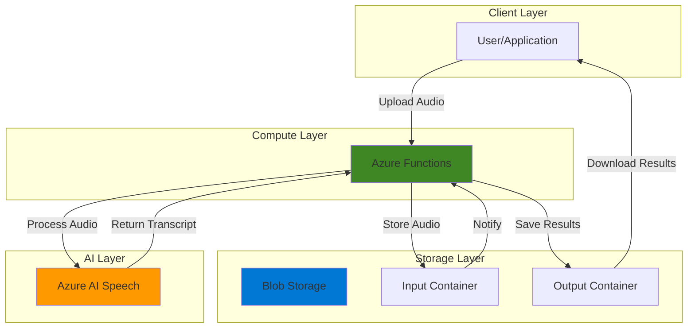

# Voice Recording Analysis with AI Speech and Functions

## Problem

Organizations need to process voice recordings from meetings, interviews, or customer calls to extract text for analysis and documentation. Manual transcription is time-consuming and error-prone, while existing solutions often require complex infrastructure setup and ongoing maintenance. Teams struggle with scalable voice-to-text processing that can handle various audio formats while maintaining cost efficiency.

## Solution

Build a serverless voice-to-text service using Azure AI Speech Services, Azure Functions, and Blob Storage. This solution automatically processes uploaded audio files, converts speech to text using AI, and stores results in accessible format. The serverless architecture ensures cost-effective scaling while Azure AI Speech provides enterprise-grade accuracy with support for multiple languages and audio formats.

## Architecture Diagram



## Prerequisites

1. Azure account with permissions to create AI services, Functions, and Storage
2. Azure CLI installed and configured (or Azure Cloud Shell)
3. Azure Functions Core Tools 4.x for deployment
4. Basic understanding of REST APIs and JSON
5. Audio file for testing (WAV, MP3, or similar format)
6. Estimated cost: $1-5 for testing (pay-per-use for Speech and minimal storage costs)

> **Note**: Azure AI Speech Services offer generous free tier limits for initial testing and development.

## Preparation

```bash
# Set environment variables for Azure resources
export LOCATION="eastus"
export SUBSCRIPTION_ID=$(az account show --query id --output tsv)

# Generate unique suffix for resource names
RANDOM_SUFFIX=$(openssl rand -hex 3)

# Set resource names with unique suffix
export RESOURCE_GROUP="rg-voice-analysis-${RANDOM_SUFFIX}"
export STORAGE_ACCOUNT="voicestorage${RANDOM_SUFFIX}"
export SPEECH_SERVICE="voice-speech-${RANDOM_SUFFIX}"
export FUNCTION_APP="voice-function-${RANDOM_SUFFIX}"

# Create resource group
az group create \
    --name ${RESOURCE_GROUP} \
    --location ${LOCATION} \
    --tags purpose=recipe environment=demo

echo "✅ Resource group created: ${RESOURCE_GROUP}"
```

## Steps

1. **Create Storage Account for Audio Files**:

   Azure Blob Storage provides massively scalable object storage optimized for unstructured data like audio files. This foundational component stores input audio files and output transcription results with built-in redundancy and global accessibility. The standard tier provides cost-effective storage for audio processing workflows while ensuring durability and availability.

   ```bash
   # Create storage account
   az storage account create \
       --name ${STORAGE_ACCOUNT} \
       --resource-group ${RESOURCE_GROUP} \
       --location ${LOCATION} \
       --sku Standard_LRS \
       --kind StorageV2

   # Get storage connection string
   STORAGE_CONNECTION=$(az storage account show-connection-string \
       --name ${STORAGE_ACCOUNT} \
       --resource-group ${RESOURCE_GROUP} \
       --query connectionString --output tsv)

   echo "✅ Storage account created: ${STORAGE_ACCOUNT}"
   ```

2. **Create Blob Containers for Input and Output**:

   Organizing audio files and transcripts in separate containers provides clear data flow and enables different access policies. The input container receives uploaded audio files, while the output container stores processed transcription results. This separation supports workflow automation and result retrieval patterns while maintaining security boundaries.

   ```bash
   # Create container for audio input files
   az storage container create \
       --name "audio-input" \
       --connection-string "${STORAGE_CONNECTION}" \
       --public-access off

   # Create container for transcript output
   az storage container create \
       --name "transcripts" \
       --connection-string "${STORAGE_CONNECTION}" \
       --public-access off

   echo "✅ Blob containers created for audio processing"
   ```

3. **Create Azure AI Speech Service**:

   Azure AI Speech Services provides enterprise-grade speech-to-text capabilities with support for 100+ languages and various audio formats. The service offers fast transcription with sub-real-time processing and built-in noise reduction. This cognitive service eliminates the complexity of building custom speech recognition models while delivering production-ready accuracy with advanced features like punctuation and profanity filtering.

   ```bash
   # Create Speech service
   az cognitiveservices account create \
       --name ${SPEECH_SERVICE} \
       --resource-group ${RESOURCE_GROUP} \
       --location ${LOCATION} \
       --kind SpeechServices \
       --sku F0

   # Get Speech service key and endpoint
   SPEECH_KEY=$(az cognitiveservices account keys list \
       --name ${SPEECH_SERVICE} \
       --resource-group ${RESOURCE_GROUP} \
       --query key1 --output tsv)

   SPEECH_ENDPOINT=$(az cognitiveservices account show \
       --name ${SPEECH_SERVICE} \
       --resource-group ${RESOURCE_GROUP} \
       --query properties.endpoint --output tsv)

   echo "✅ Speech service created: ${SPEECH_SERVICE}"
   ```

4. **Create Azure Function App**:

   Azure Functions provides serverless compute that automatically scales based on demand without infrastructure management. The consumption plan ensures cost-effective operation by charging only for actual execution time. This serverless architecture handles unpredictable voice processing workloads while maintaining high availability and performance through Azure's managed platform.

   ```bash
   # Create Function App with consumption plan
   az functionapp create \
       --name ${FUNCTION_APP} \
       --resource-group ${RESOURCE_GROUP} \
       --storage-account ${STORAGE_ACCOUNT} \
       --consumption-plan-location ${LOCATION} \
       --runtime python \
       --runtime-version 3.11 \
       --functions-version 4 \
       --os-type linux

   echo "✅ Function App created: ${FUNCTION_APP}"
   ```

5. **Configure Function App Settings**:

   Application settings provide secure configuration management for Azure Functions, storing connection strings and API keys as environment variables. These settings enable the function to authenticate with Azure AI Speech and Blob Storage services without hardcoding credentials in source code, following Azure security best practices and the principle of least privilege.

   ```bash
   # Configure Speech service connection
   az functionapp config appsettings set \
       --name ${FUNCTION_APP} \
       --resource-group ${RESOURCE_GROUP} \
       --settings \
           "SPEECH_KEY=${SPEECH_KEY}" \
           "SPEECH_REGION=${LOCATION}" \
           "SPEECH_ENDPOINT=${SPEECH_ENDPOINT}" \
           "STORAGE_CONNECTION=${STORAGE_CONNECTION}"

   echo "✅ Function App configured with service connections"
   ```

6. **Deploy Function Code for Voice Processing**:

   The Azure Function implements the core voice processing logic using the Python v2 programming model, integrating Azure AI Speech Services with Blob Storage through HTTP triggers. This modern approach provides cleaner code organization and better performance. The function handles file download, speech recognition, and result storage in a single operation.

   ```bash
   # Create function code directory
   mkdir -p /tmp/voice-function
   cd /tmp/voice-function

   # Initialize Functions project
   func init . --python

   # Create requirements.txt for Python dependencies
   cat > requirements.txt << 'EOF'
   azure-functions
   azure-storage-blob>=12.0.0
   azure-cognitiveservices-speech>=1.40.0
   requests
   EOF

   # Create function with HTTP trigger
   func new --name transcribe --template "HTTP trigger" \
       --authlevel "function"

   # Create function_app.py with improved error handling
   cat > function_app.py << 'EOF'
   import azure.functions as func
   import azure.cognitiveservices.speech as speechsdk
   import json
   import os
   import tempfile
   import logging
   from azure.storage.blob import BlobServiceClient

   app = func.FunctionApp()

   @app.route(route="transcribe", methods=["POST"])
   def transcribe_audio(req: func.HttpRequest) -> func.HttpResponse:
       """
       Process uploaded audio file and return transcription
       """
       try:
           # Get configuration from app settings
           speech_key = os.environ.get("SPEECH_KEY")
           speech_region = os.environ.get("SPEECH_REGION")
           storage_connection = os.environ.get("STORAGE_CONNECTION")
           
           if not all([speech_key, speech_region, storage_connection]):
               return func.HttpResponse(
                   json.dumps({"error": "Missing required configuration"}),
                   status_code=500,
                   mimetype="application/json"
               )
           
           # Parse request for audio file info
           try:
               req_body = req.get_json()
               if not req_body:
                   return func.HttpResponse(
                       json.dumps({"error": "Request body required"}),
                       status_code=400,
                       mimetype="application/json"
                   )
               
               audio_filename = req_body.get('filename')
               language = req_body.get('language', 'en-US')
               
           except Exception as e:
               return func.HttpResponse(
                   json.dumps({"error": f"Invalid JSON: {str(e)}"}),
                   status_code=400,
                   mimetype="application/json"
               )
           
           if not audio_filename:
               return func.HttpResponse(
                   json.dumps({"error": "filename required"}),
                   status_code=400,
                   mimetype="application/json"
               )
           
           # Configure Speech service
           speech_config = speechsdk.SpeechConfig(
               subscription=speech_key, 
               region=speech_region
           )
           speech_config.speech_recognition_language = language
           speech_config.enable_dictation()
           
           # Download audio file from blob storage
           blob_service = BlobServiceClient.from_connection_string(
               storage_connection
           )
           blob_client = blob_service.get_blob_client(
               container="audio-input", 
               blob=audio_filename
           )
           
           # Check if blob exists
           if not blob_client.exists():
               return func.HttpResponse(
                   json.dumps({"error": f"Audio file not found: {audio_filename}"}),
                   status_code=404,
                   mimetype="application/json"
               )
           
           # Create temporary file for processing
           with tempfile.NamedTemporaryFile(delete=False, suffix=".wav") as temp_file:
               temp_file.write(blob_client.download_blob().readall())
               temp_file_path = temp_file.name
           
           try:
               # Process audio with Speech service
               audio_input = speechsdk.AudioConfig(filename=temp_file_path)
               recognizer = speechsdk.SpeechRecognizer(
                   speech_config=speech_config, 
                   audio_config=audio_input
               )
               
               # Perform speech recognition
               result = recognizer.recognize_once()
               
               # Process recognition result
               if result.reason == speechsdk.ResultReason.RecognizedSpeech:
                   # Calculate confidence score
                   confidence_score = "high" if len(result.text) > 10 else "medium"
                   
                   transcript = {
                       "filename": audio_filename,
                       "transcript": result.text,
                       "language": language,
                       "confidence": confidence_score,
                       "status": "success",
                       "duration_processed": "N/A"
                   }
                   
                   # Save transcript to output container
                   transcript_filename = f"{os.path.splitext(audio_filename)[0]}_transcript.json"
                   transcript_blob = blob_service.get_blob_client(
                       container="transcripts",
                       blob=transcript_filename
                   )
                   transcript_blob.upload_blob(
                       json.dumps(transcript, indent=2),
                       overwrite=True
                   )
                   
                   return func.HttpResponse(
                       json.dumps(transcript),
                       status_code=200,
                       mimetype="application/json"
                   )
               
               elif result.reason == speechsdk.ResultReason.NoMatch:
                   return func.HttpResponse(
                       json.dumps({
                           "error": "No speech detected in audio file",
                           "reason": "NoMatch"
                       }),
                       status_code=400,
                       mimetype="application/json"
                   )
               
               else:
                   return func.HttpResponse(
                       json.dumps({
                           "error": "Speech recognition failed",
                           "reason": str(result.reason),
                           "details": result.error_details if hasattr(result, 'error_details') else None
                       }),
                       status_code=400,
                       mimetype="application/json"
                   )
                   
           finally:
               # Clean up temporary file
               try:
                   os.unlink(temp_file_path)
               except Exception as cleanup_error:
                   logging.warning(f"Failed to cleanup temp file: {cleanup_error}")
               
       except Exception as e:
           logging.error(f"Transcription error: {str(e)}")
           return func.HttpResponse(
               json.dumps({"error": f"Processing failed: {str(e)}"}),
               status_code=500,
               mimetype="application/json"
           )
   EOF

   # Deploy function to Azure
   func azure functionapp publish ${FUNCTION_APP}

   echo "✅ Function deployed for voice processing"
   ```

## Validation & Testing

1. **Upload Test Audio File**:

   ```bash
   # Create a simple test audio file reference
   # Note: Replace with actual audio file for real testing
   TEST_AUDIO="test-audio.wav"
   
   # Upload audio file to input container (using sample path)
   # For actual testing, use: az storage blob upload with real audio file
   echo "Upload your audio file using:"
   echo "az storage blob upload \\"
   echo "    --container-name \"audio-input\" \\"
   echo "    --file \"/path/to/your/audio.wav\" \\"
   echo "    --name \"${TEST_AUDIO}\" \\"
   echo "    --connection-string \"\${STORAGE_CONNECTION}\""
   ```

2. **Test Function Endpoint**:

   ```bash
   # Get function URL with function key
   FUNCTION_URL=$(az functionapp function show \
       --name ${FUNCTION_APP} \
       --resource-group ${RESOURCE_GROUP} \
       --function-name transcribe \
       --query invokeUrlTemplate --output tsv)

   # Get function key for authentication
   FUNCTION_KEY=$(az functionapp keys list \
       --name ${FUNCTION_APP} \
       --resource-group ${RESOURCE_GROUP} \
       --query functionKeys.default --output tsv)

   # Test transcription function with authentication
   curl -X POST "${FUNCTION_URL}?code=${FUNCTION_KEY}" \
       -H "Content-Type: application/json" \
       -d "{\"filename\": \"${TEST_AUDIO}\", \"language\": \"en-US\"}"
   ```

   Expected output: JSON response with transcribed text and metadata

3. **Verify Transcript Storage**:

   ```bash
   # List transcripts in output container
   az storage blob list \
       --container-name "transcripts" \
       --connection-string "${STORAGE_CONNECTION}" \
       --output table

   # Download and view transcript
   TRANSCRIPT_NAME="${TEST_AUDIO%.*}_transcript.json"
   az storage blob download \
       --container-name "transcripts" \
       --name "${TRANSCRIPT_NAME}" \
       --file "transcript-result.json" \
       --connection-string "${STORAGE_CONNECTION}"

   cat transcript-result.json
   ```

## Cleanup

1. **Remove Function App and Associated Resources**:

   ```bash
   # Delete Function App
   az functionapp delete \
       --name ${FUNCTION_APP} \
       --resource-group ${RESOURCE_GROUP}

   echo "✅ Function App deleted"
   ```

2. **Remove AI and Storage Services**:

   ```bash
   # Delete Speech service
   az cognitiveservices account delete \
       --name ${SPEECH_SERVICE} \
       --resource-group ${RESOURCE_GROUP}

   # Delete Storage Account
   az storage account delete \
       --name ${STORAGE_ACCOUNT} \
       --resource-group ${RESOURCE_GROUP} \
       --yes

   echo "✅ AI and Storage services removed"
   ```

3. **Remove Resource Group**:

   ```bash
   # Delete resource group and all remaining resources
   az group delete \
       --name ${RESOURCE_GROUP} \
       --yes \
       --no-wait

   echo "✅ Resource group deletion initiated: ${RESOURCE_GROUP}"
   echo "Note: Deletion may take several minutes to complete"
   ```

## Discussion

This serverless voice analysis solution demonstrates Azure's integrated AI and compute services working together to solve real-world speech processing challenges. Azure AI Speech Services provides enterprise-grade transcription capabilities with support for over 100 languages, custom speech models, and advanced features like automatic punctuation, profanity filtering, and real-time diarization. The service's fast transcription API delivers results synchronously and faster than real-time, making it ideal for interactive applications and batch processing scenarios.

Azure Functions serves as the orchestration layer, providing serverless compute that automatically scales based on demand. The consumption-based pricing model ensures cost efficiency by charging only for actual execution time, while the platform manages all infrastructure concerns including high availability, security patching, and performance optimization. The HTTP trigger pattern with function key authentication enables secure integration with web applications, mobile apps, or automated workflows while maintaining enterprise security standards.

The architecture follows Azure Well-Architected Framework principles by implementing proper separation of concerns, secure credential management through application settings, and efficient resource utilization. Blob Storage provides durable, scalable storage for both input audio files and output transcripts, with built-in redundancy and access control. This design supports various workflow patterns from simple file upload processing to complex multi-stage audio analysis pipelines with automated triggers and notifications.

Performance considerations include the Azure AI Speech service's ability to process audio faster than real-time playback, typically delivering transcription results in seconds for moderate-length recordings. The function's cold start latency is minimized through Azure's improved cold start performance and can be further optimized using premium hosting plans for production workloads requiring consistent low latency. The solution also supports multiple audio formats including WAV, MP3, and FLAC with automatic format detection.

For more information about Azure AI Speech capabilities, see the [Azure AI Speech documentation](https://learn.microsoft.com/en-us/azure/ai-services/speech-service/). Azure Functions integration patterns are detailed in the [Azure Functions scenarios documentation](https://learn.microsoft.com/en-us/azure/azure-functions/functions-scenarios). The [speech-to-text REST API guide](https://learn.microsoft.com/en-us/azure/ai-services/speech-service/rest-speech-to-text) provides comprehensive information about speech processing options and best practices.

> **Tip**: Use Azure Monitor and Application Insights for comprehensive logging and performance monitoring of your voice processing functions, enabling proactive optimization and troubleshooting.

## Challenge

Extend this solution by implementing these enhancements:

1. **Add Multi-Language Detection**: Implement automatic language identification using Azure AI Speech's language detection capabilities, then process audio in the detected language without manual configuration.

2. **Implement Speaker Diarization**: Enhance the transcription to identify multiple speakers in the audio, providing timestamped segments with speaker labels for meeting transcriptions using real-time diarization features.

3. **Create Batch Processing Pipeline**: Build a blob trigger-based function that automatically processes audio files as they're uploaded, eliminating the need for manual API calls and enabling automated workflows with Azure Event Grid integration.

4. **Add Real-Time Streaming Support**: Integrate Azure SignalR Service to provide real-time transcription updates for live audio streams, enabling interactive voice applications with WebSocket connections.

5. **Implement Custom Speech Models**: Create domain-specific speech models using Azure AI Speech's custom speech training capabilities to improve accuracy for industry-specific terminology, accents, or acoustic environments.

## Infrastructure Code

### Available Infrastructure as Code:

- [Infrastructure Code Overview](code/README.md) - Detailed description of all infrastructure components
- [Bicep](code/bicep/) - Azure Bicep templates
- [Bash CLI Scripts](code/scripts/) - Example bash scripts using Azure CLI commands to deploy infrastructure
- [Terraform](code/terraform/) - Terraform configuration files