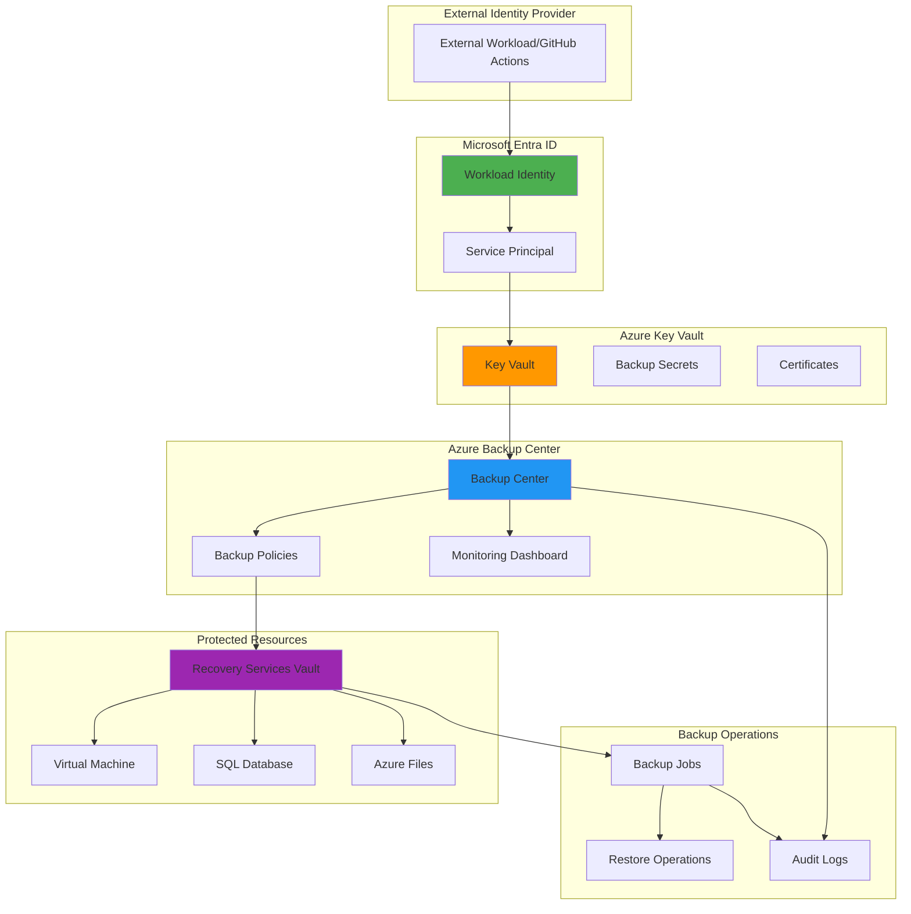

# Zero-Trust Backup Security with Workload Identity and Backup Center

## Problem

Organizations struggle to implement secure backup architectures that align with zero-trust principles, often relying on traditional credential-based authentication that creates security vulnerabilities and operational overhead. Current backup solutions frequently use shared secrets, certificates, or service principals stored in plain text, violating zero-trust principles of "never trust, always verify" and creating potential attack vectors for ransomware and data exfiltration.

## Solution

This solution establishes a comprehensive zero-trust backup security architecture using Azure Workload Identity federation for secretless authentication, Azure Backup Center for centralized backup governance, and Azure Key Vault for secure credential management. The architecture eliminates stored secrets, implements identity-based access controls, and provides centralized monitoring and management of backup operations across multiple Azure resources.

## Architecture Diagram



## Prerequisites

1. Azure subscription with Owner or Contributor permissions
2. Azure CLI v2.45.0 or later installed and configured
3. Understanding of zero-trust security principles and Azure identity management
4. Familiarity with Azure Backup services and Recovery Services Vaults
5. Knowledge of Azure Key Vault and secret management concepts
6. Estimated cost: $50-100/month for lab environment (depends on backup storage and compute usage)

> **Note**: This recipe implements enterprise-grade zero-trust security patterns that align with the Microsoft Zero Trust security model. Review the [Azure Zero Trust implementation guide](https://docs.microsoft.com/en-us/security/zero-trust/azure-infrastructure-overview) for comprehensive security guidance.

## Preparation

```bash
# Set environment variables for Azure resources
export RESOURCE_GROUP="rg-zerotrust-backup-${RANDOM_SUFFIX}"
export LOCATION="eastus"
export SUBSCRIPTION_ID=$(az account show --query id --output tsv)
export TENANT_ID=$(az account show --query tenantId --output tsv)

# Generate unique suffix for resource names
RANDOM_SUFFIX=$(openssl rand -hex 3)

# Set resource names with consistent naming convention
export KEY_VAULT_NAME="kv-backup-${RANDOM_SUFFIX}"
export WORKLOAD_IDENTITY_NAME="wi-backup-${RANDOM_SUFFIX}"
export RECOVERY_VAULT_NAME="rsv-backup-${RANDOM_SUFFIX}"
export STORAGE_ACCOUNT_NAME="stbackup${RANDOM_SUFFIX}"
export VM_NAME="vm-backup-test-${RANDOM_SUFFIX}"

# Create resource group with proper tagging
az group create \
    --name ${RESOURCE_GROUP} \
    --location ${LOCATION} \
    --tags purpose=zero-trust-backup environment=demo \
           security-level=high compliance=required

echo "✅ Resource group created: ${RESOURCE_GROUP}"

# Enable required resource providers
az provider register --namespace Microsoft.KeyVault
az provider register --namespace Microsoft.RecoveryServices
az provider register --namespace Microsoft.ManagedIdentity
az provider register --namespace Microsoft.Storage

echo "✅ Required Azure resource providers registered"
```

## Steps

1. **Create Azure Key Vault with Zero-Trust Security Configuration**:

   Azure Key Vault provides the foundation for zero-trust backup security by centralizing secret management and eliminating the need for stored credentials. This managed service integrates with Microsoft Entra ID for identity-based access control and supports network isolation through private endpoints and firewall rules, aligning with zero-trust principles of explicit verification and least privilege access.

   ```bash
   # Create Key Vault with advanced security features
   az keyvault create \
       --name ${KEY_VAULT_NAME} \
       --resource-group ${RESOURCE_GROUP} \
       --location ${LOCATION} \
       --sku premium \
       --enable-rbac-authorization true \
       --enable-purge-protection true \
       --retention-days 90 \
       --enable-soft-delete true
   
   # Configure network access restrictions
   az keyvault network-rule add \
       --name ${KEY_VAULT_NAME} \
       --resource-group ${RESOURCE_GROUP} \
       --default-action Deny
   
   # Get Key Vault resource ID for role assignments
   export KEY_VAULT_ID=$(az keyvault show \
       --name ${KEY_VAULT_NAME} \
       --resource-group ${RESOURCE_GROUP} \
       --query id --output tsv)
   
   echo "✅ Key Vault created with zero-trust security configuration"
   ```

   The Key Vault now provides secure, centralized storage for backup-related secrets with network isolation and purge protection enabled. This configuration prevents unauthorized access and ensures compliance with enterprise security policies while supporting the zero-trust principle of assuming breach and verifying explicitly.

2. **Create User-Assigned Managed Identity for Workload Identity Federation**:

   User-assigned managed identities provide a secure, Azure-managed identity that can be federated with external identity providers without storing credentials. This approach eliminates the security risks associated with service principal secrets and certificates while enabling external workloads to securely access Azure resources using their native identity systems.

   ```bash
   # Create user-assigned managed identity
   az identity create \
       --name ${WORKLOAD_IDENTITY_NAME} \
       --resource-group ${RESOURCE_GROUP} \
       --location ${LOCATION} \
       --tags purpose=workload-identity security-level=high
   
   # Get managed identity details
   export IDENTITY_CLIENT_ID=$(az identity show \
       --name ${WORKLOAD_IDENTITY_NAME} \
       --resource-group ${RESOURCE_GROUP} \
       --query clientId --output tsv)
   
   export IDENTITY_PRINCIPAL_ID=$(az identity show \
       --name ${WORKLOAD_IDENTITY_NAME} \
       --resource-group ${RESOURCE_GROUP} \
       --query principalId --output tsv)
   
   echo "✅ Workload identity created: ${IDENTITY_CLIENT_ID}"
   ```

   The user-assigned managed identity is now ready for federation with external identity providers. This identity will serve as the secure bridge between external workloads and Azure resources, eliminating the need for credential management while maintaining strong authentication and authorization controls.

3. **Configure Key Vault Access Policies for Workload Identity**:

   Role-based access control (RBAC) ensures that the workload identity has only the minimum permissions required for backup operations. This configuration follows the zero-trust principle of least privilege access while enabling the identity to manage backup-related secrets and certificates securely.

   ```bash
   # Assign Key Vault Secrets Officer role to workload identity
   az role assignment create \
       --assignee ${IDENTITY_PRINCIPAL_ID} \
       --role "Key Vault Secrets Officer" \
       --scope ${KEY_VAULT_ID}
   
   # Assign Key Vault Certificate Officer role for certificate management
   az role assignment create \
       --assignee ${IDENTITY_PRINCIPAL_ID} \
       --role "Key Vault Certificate Officer" \
       --scope ${KEY_VAULT_ID}
   
   # Assign current user as Key Vault Administrator for setup
   export CURRENT_USER_ID=$(az ad signed-in-user show \
       --query id --output tsv)
   
   az role assignment create \
       --assignee ${CURRENT_USER_ID} \
       --role "Key Vault Administrator" \
       --scope ${KEY_VAULT_ID}
   
   echo "✅ Key Vault RBAC permissions configured"
   ```

   The workload identity now has the necessary permissions to manage secrets and certificates in Key Vault while maintaining the principle of least privilege. This configuration enables secure backup operations without exposing sensitive credentials to external systems.

4. **Create Recovery Services Vault with Advanced Security Features**:

   Azure Recovery Services Vault provides the core backup infrastructure with enterprise-grade security features including cross-region restore, immutable backups, and integration with Microsoft Entra ID. This managed service eliminates the operational overhead of backup infrastructure while providing the security and compliance features required for zero-trust architectures.

   ```bash
   # Create Recovery Services Vault
   az backup vault create \
       --name ${RECOVERY_VAULT_NAME} \
       --resource-group ${RESOURCE_GROUP} \
       --location ${LOCATION}
   
   # Configure vault security settings
   az backup vault backup-properties set \
       --name ${RECOVERY_VAULT_NAME} \
       --resource-group ${RESOURCE_GROUP} \
       --backup-storage-redundancy GeoRedundant \
       --cross-region-restore-flag true \
       --soft-delete-feature-state Enabled
   
   # Get vault resource ID
   export VAULT_ID=$(az backup vault show \
       --name ${RECOVERY_VAULT_NAME} \
       --resource-group ${RESOURCE_GROUP} \
       --query id --output tsv)
   
   echo "✅ Recovery Services Vault created with advanced security"
   ```

   The Recovery Services Vault is now configured with geo-redundant storage, cross-region restore capabilities, and soft delete protection. These features provide data resilience and protection against ransomware attacks while maintaining compliance with enterprise backup policies.

5. **Configure Backup Policies with Zero-Trust Security Controls**:

   Backup policies define the security and retention requirements for protected resources while integrating with Microsoft Entra ID for access control. These policies implement zero-trust principles by requiring explicit verification for backup operations and maintaining immutable backup records for compliance and security purposes.

   ```bash
   # Create enhanced backup policy for VMs with proper JSON format
   az backup policy create \
       --name "ZeroTrustVMPolicy" \
       --resource-group ${RESOURCE_GROUP} \
       --vault-name ${RECOVERY_VAULT_NAME} \
       --backup-management-type AzureIaasVM \
       --policy "$(cat <<'EOF'
{
  "schedulePolicy": {
    "schedulePolicyType": "SimpleSchedulePolicy",
    "scheduleRunFrequency": "Daily",
    "scheduleRunTimes": ["2024-01-01T02:00:00Z"]
  },
  "retentionPolicy": {
    "retentionPolicyType": "LongTermRetentionPolicy",
    "dailySchedule": {
      "retentionTimes": ["2024-01-01T02:00:00Z"],
      "retentionDuration": {
        "count": 30,
        "durationType": "Days"
      }
    },
    "weeklySchedule": {
      "daysOfTheWeek": ["Sunday"],
      "retentionTimes": ["2024-01-01T02:00:00Z"],
      "retentionDuration": {
        "count": 12,
        "durationType": "Weeks"
      }
    },
    "monthlySchedule": {
      "retentionScheduleFormatType": "Weekly",
      "retentionScheduleWeekly": {
        "daysOfTheWeek": ["Sunday"],
        "weeksOfTheMonth": ["First"]
      },
      "retentionTimes": ["2024-01-01T02:00:00Z"],
      "retentionDuration": {
        "count": 12,
        "durationType": "Months"
      }
    }
  }
}
EOF
)"
   
   echo "✅ Zero-trust backup policies created"
   ```

   The backup policies now enforce security controls including encryption, compression, and long-term retention. These policies ensure that backup operations maintain security and compliance requirements while providing the flexibility needed for various workload types.

6. **Create Test Virtual Machine for Backup Demonstration**:

   A test virtual machine provides a practical demonstration of the zero-trust backup architecture while showcasing the integration between backup policies, identity management, and security controls. This VM will serve as a protected resource to validate the complete backup solution.

   ```bash
   # Create virtual network for test VM
   az network vnet create \
       --name "vnet-backup-test" \
       --resource-group ${RESOURCE_GROUP} \
       --location ${LOCATION} \
       --address-prefix 10.0.0.0/16 \
       --subnet-name "subnet-backup-test" \
       --subnet-prefix 10.0.1.0/24
   
   # Create network security group with restricted access
   az network nsg create \
       --name "nsg-backup-test" \
       --resource-group ${RESOURCE_GROUP} \
       --location ${LOCATION}
   
   # Create public IP for VM access
   az network public-ip create \
       --name "pip-backup-test" \
       --resource-group ${RESOURCE_GROUP} \
       --location ${LOCATION} \
       --allocation-method Static \
       --sku Standard
   
   # Create network interface
   az network nic create \
       --name "nic-backup-test" \
       --resource-group ${RESOURCE_GROUP} \
       --location ${LOCATION} \
       --vnet-name "vnet-backup-test" \
       --subnet "subnet-backup-test" \
       --public-ip-address "pip-backup-test" \
       --network-security-group "nsg-backup-test"
   
   # Create virtual machine
   az vm create \
       --name ${VM_NAME} \
       --resource-group ${RESOURCE_GROUP} \
       --location ${LOCATION} \
       --image "Ubuntu2204" \
       --size Standard_B2s \
       --nics "nic-backup-test" \
       --authentication-type password \
       --admin-username azureuser \
       --admin-password "SecurePassword123!" \
       --tags purpose=backup-test security-level=high
   
   echo "✅ Test VM created: ${VM_NAME}"
   ```

   The test virtual machine is now ready with proper network isolation and security controls. This VM will demonstrate the backup protection capabilities while maintaining the security principles of the zero-trust architecture.

7. **Enable VM Backup with Workload Identity Integration**:

   Integrating the virtual machine with the backup solution demonstrates how workload identity enables secure backup operations without stored credentials. This configuration shows how zero-trust principles apply to backup operations while maintaining operational efficiency and security compliance.

   ```bash
   # Enable backup for the VM using the zero-trust policy
   az backup protection enable-for-vm \
       --vm ${VM_NAME} \
       --vault-name ${RECOVERY_VAULT_NAME} \
       --resource-group ${RESOURCE_GROUP} \
       --policy-name "ZeroTrustVMPolicy"
   
   # Verify backup protection is enabled
   az backup item show \
       --vault-name ${RECOVERY_VAULT_NAME} \
       --resource-group ${RESOURCE_GROUP} \
       --container-name ${VM_NAME} \
       --item-name ${VM_NAME} \
       --backup-management-type AzureIaasVM \
       --workload-type VM
   
   echo "✅ VM backup protection enabled with zero-trust policy"
   ```

   The virtual machine is now protected by the zero-trust backup policy and integrated with the workload identity for secure operations. This configuration demonstrates how backup operations can maintain security while providing the protection required for business continuity.

8. **Configure Azure Backup Center for Centralized Management**:

   Azure Backup Center provides a unified management experience for backup operations across multiple resources and subscriptions. This centralized approach aligns with zero-trust principles by providing comprehensive visibility, monitoring, and governance capabilities for all backup operations within the organization.

   ```bash
   # Create storage account for backup reports
   az storage account create \
       --name ${STORAGE_ACCOUNT_NAME} \
       --resource-group ${RESOURCE_GROUP} \
       --location ${LOCATION} \
       --sku Standard_LRS \
       --kind StorageV2 \
       --access-tier Hot \
       --https-only true \
       --min-tls-version TLS1_2
   
   # Get storage account key
   export STORAGE_KEY=$(az storage account keys list \
       --account-name ${STORAGE_ACCOUNT_NAME} \
       --resource-group ${RESOURCE_GROUP} \
       --query '[0].value' --output tsv)
   
   # Create container for backup reports
   az storage container create \
       --name "backup-reports" \
       --account-name ${STORAGE_ACCOUNT_NAME} \
       --account-key ${STORAGE_KEY} \
       --public-access off
   
   # Configure backup center workspace
   az monitor log-analytics workspace create \
       --name "law-backup-center-${RANDOM_SUFFIX}" \
       --resource-group ${RESOURCE_GROUP} \
       --location ${LOCATION} \
       --sku PerGB2018
   
   echo "✅ Azure Backup Center infrastructure configured"
   ```

   The backup center infrastructure now provides centralized monitoring and reporting capabilities for all backup operations. This configuration enables administrators to maintain visibility and control over backup operations across the entire Azure environment.

9. **Create Backup Secrets in Key Vault**:

   Storing backup-related secrets in Key Vault completes the zero-trust architecture by eliminating plaintext credentials and providing secure access to sensitive information. This approach ensures that backup operations can access required credentials while maintaining the security and audit capabilities required for compliance.

   ```bash
   # Store backup-related secrets in Key Vault
   az keyvault secret set \
       --vault-name ${KEY_VAULT_NAME} \
       --name "backup-storage-key" \
       --value ${STORAGE_KEY} \
       --description "Storage account key for backup reports"
   
   # Store database connection strings (example)
   az keyvault secret set \
       --vault-name ${KEY_VAULT_NAME} \
       --name "sql-connection-string" \
       --value "Server=tcp:server.database.windows.net,1433;Database=mydb;User ID=admin;Password=SecurePassword123!;Encrypt=True;TrustServerCertificate=False;Connection Timeout=30;" \
       --description "SQL database connection string for backup operations"
   
   # Store certificate for backup encryption
   az keyvault certificate create \
       --vault-name ${KEY_VAULT_NAME} \
       --name "backup-encryption-cert" \
       --policy "$(cat <<'EOF'
{
  "issuerParameters": {
    "name": "Self"
  },
  "keyProperties": {
    "exportable": true,
    "keySize": 2048,
    "keyType": "RSA",
    "reuseKey": false
  },
  "x509CertificateProperties": {
    "subject": "CN=backup-encryption",
    "validityInMonths": 12
  }
}
EOF
)"
   
   echo "✅ Backup secrets stored in Key Vault"
   ```

   The backup secrets are now securely stored in Key Vault with proper access controls and audit logging. This configuration ensures that sensitive information is protected while remaining accessible to authorized backup operations through the workload identity.

10. **Configure Workload Identity Federation for External Access**:

    Workload identity federation enables external systems to securely access Azure backup resources without storing credentials. This configuration demonstrates how external CI/CD pipelines, monitoring systems, or third-party backup tools can integrate with the zero-trust backup architecture while maintaining security and compliance requirements.

    ```bash
    # Create federated identity credential for GitHub Actions (example)
    az identity federated-credential create \
        --name "github-actions-fed-cred" \
        --identity-name ${WORKLOAD_IDENTITY_NAME} \
        --resource-group ${RESOURCE_GROUP} \
        --issuer "https://token.actions.githubusercontent.com" \
        --subject "repo:organization/repository:ref:refs/heads/main" \
        --audience "api://AzureADTokenExchange" \
        --description "Federated credential for GitHub Actions backup automation"
    
    # Create federated identity credential for Kubernetes workloads
    az identity federated-credential create \
        --name "k8s-backup-fed-cred" \
        --identity-name ${WORKLOAD_IDENTITY_NAME} \
        --resource-group ${RESOURCE_GROUP} \
        --issuer "https://kubernetes.default.svc.cluster.local" \
        --subject "system:serviceaccount:backup-system:backup-operator" \
        --audience "api://AzureADTokenExchange" \
        --description "Federated credential for Kubernetes backup operations"
    
    # Output configuration for external systems
    echo "Workload Identity Configuration:"
    echo "Client ID: ${IDENTITY_CLIENT_ID}"
    echo "Tenant ID: ${TENANT_ID}"
    echo "Subscription ID: ${SUBSCRIPTION_ID}"
    
    echo "✅ Workload identity federation configured"
    ```

    The workload identity federation is now configured to support external systems including GitHub Actions and Kubernetes workloads. This configuration enables secure, secretless access to backup resources while maintaining the zero-trust security model.

## Validation & Testing

1. **Verify Key Vault Access and Secret Retrieval**:

   ```bash
   # Test Key Vault access with workload identity
   az keyvault secret show \
       --vault-name ${KEY_VAULT_NAME} \
       --name "backup-storage-key" \
       --query "value" --output tsv
   
   # Verify certificate creation
   az keyvault certificate show \
       --vault-name ${KEY_VAULT_NAME} \
       --name "backup-encryption-cert" \
       --query "x509ThumbprintHex" --output tsv
   ```

   Expected output: Storage key value and certificate thumbprint should be displayed, confirming secure access to Key Vault secrets.

2. **Test Backup Operations and Policy Compliance**:

   ```bash
   # Trigger on-demand backup
   az backup protection backup-now \
       --vault-name ${RECOVERY_VAULT_NAME} \
       --resource-group ${RESOURCE_GROUP} \
       --container-name ${VM_NAME} \
       --item-name ${VM_NAME} \
       --backup-management-type AzureIaasVM \
       --workload-type VM \
       --retain-until "2024-12-31T23:59:59Z"
   
   # Check backup job status
   az backup job list \
       --vault-name ${RECOVERY_VAULT_NAME} \
       --resource-group ${RESOURCE_GROUP} \
       --operation Backup \
       --status InProgress
   ```

   Expected output: Backup job should be initiated and show "InProgress" status, confirming backup operations are functioning correctly.

3. **Validate Workload Identity Federation**:

   ```bash
   # List federated credentials
   az identity federated-credential list \
       --identity-name ${WORKLOAD_IDENTITY_NAME} \
       --resource-group ${RESOURCE_GROUP} \
       --output table
   
   # Verify role assignments
   az role assignment list \
       --assignee ${IDENTITY_PRINCIPAL_ID} \
       --output table
   ```

   Expected output: Federated credentials should be listed with correct issuers and subjects, and role assignments should show Key Vault permissions.

4. **Test Azure Backup Center Monitoring**:

   ```bash
   # Query backup center for protected items
   az backup item list \
       --vault-name ${RECOVERY_VAULT_NAME} \
       --resource-group ${RESOURCE_GROUP} \
       --output table
   
   # Check backup compliance status
   az backup policy list \
       --vault-name ${RECOVERY_VAULT_NAME} \
       --resource-group ${RESOURCE_GROUP} \
       --output table
   ```

   Expected output: Protected items should be listed with their backup status, and policies should show as active and compliant.

## Cleanup

1. **Remove backup protection and delete recovery points**:

   ```bash
   # Disable backup protection
   az backup protection disable \
       --vault-name ${RECOVERY_VAULT_NAME} \
       --resource-group ${RESOURCE_GROUP} \
       --container-name ${VM_NAME} \
       --item-name ${VM_NAME} \
       --backup-management-type AzureIaasVM \
       --workload-type VM \
       --delete-backup-data true \
       --yes
   
   echo "✅ Backup protection disabled"
   ```

2. **Delete virtual machine and network resources**:

   ```bash
   # Delete VM and associated resources
   az vm delete \
       --name ${VM_NAME} \
       --resource-group ${RESOURCE_GROUP} \
       --yes
   
   # Delete network resources
   az network vnet delete \
       --name "vnet-backup-test" \
       --resource-group ${RESOURCE_GROUP}
   
   echo "✅ Virtual machine and network resources deleted"
   ```

3. **Remove Azure services in reverse order**:

   ```bash
   # Delete Recovery Services Vault
   az backup vault delete \
       --name ${RECOVERY_VAULT_NAME} \
       --resource-group ${RESOURCE_GROUP} \
       --yes
   
   # Delete storage account
   az storage account delete \
       --name ${STORAGE_ACCOUNT_NAME} \
       --resource-group ${RESOURCE_GROUP} \
       --yes
   
   # Delete Key Vault (with purge protection)
   az keyvault delete \
       --name ${KEY_VAULT_NAME} \
       --resource-group ${RESOURCE_GROUP}
   
   az keyvault purge \
       --name ${KEY_VAULT_NAME} \
       --location ${LOCATION}
   
   echo "✅ Azure services deleted"
   ```

4. **Remove resource group and clean up environment**:

   ```bash
   # Delete resource group and all contained resources
   az group delete \
       --name ${RESOURCE_GROUP} \
       --yes \
       --no-wait
   
   # Clean up environment variables
   unset RESOURCE_GROUP LOCATION SUBSCRIPTION_ID TENANT_ID
   unset KEY_VAULT_NAME WORKLOAD_IDENTITY_NAME RECOVERY_VAULT_NAME
   unset STORAGE_ACCOUNT_NAME VM_NAME IDENTITY_CLIENT_ID
   
   echo "✅ Resource group deletion initiated and environment cleaned"
   echo "Note: Resource deletion may take several minutes to complete"
   ```

## Discussion

Zero-trust backup security represents a fundamental shift from traditional credential-based backup architectures to identity-centric, secretless approaches that eliminate attack vectors while maintaining operational efficiency. Azure Workload Identity federation provides the foundation for this transformation by enabling external systems to authenticate using their native identity providers without storing Azure credentials. This approach significantly reduces the risk of credential theft and eliminates the operational overhead of certificate and secret rotation. The [Microsoft Zero Trust security model](https://docs.microsoft.com/en-us/security/zero-trust/) emphasizes the principles of "never trust, always verify" and "assume breach," which are directly applicable to backup operations that often require elevated privileges and access to sensitive data.

Azure Backup Center serves as the unified control plane for implementing zero-trust backup governance across enterprise environments. By centralizing backup policies, monitoring, and compliance reporting, organizations can maintain consistent security standards while providing visibility into backup operations. The integration with Azure Monitor and Log Analytics enables automated threat detection and response, while the native integration with Microsoft Entra ID ensures that all backup operations are subject to identity-based access controls and conditional access policies. For comprehensive backup governance strategies, refer to the [Azure Backup Center documentation](https://docs.microsoft.com/en-us/azure/backup/backup-center-overview) and [Azure backup security features](https://docs.microsoft.com/en-us/azure/backup/security-overview).

The combination of Azure Key Vault, workload identity federation, and backup center creates a comprehensive zero-trust backup architecture that addresses the evolving threat landscape while maintaining operational efficiency. This approach is particularly effective against ransomware attacks, which often target backup systems to prevent recovery operations. By implementing secretless authentication, immutable backup policies, and centralized monitoring, organizations can significantly reduce their attack surface while improving backup reliability and compliance. The [Azure security baseline for backup services](https://docs.microsoft.com/en-us/azure/backup/security-baseline) provides additional guidance on implementing enterprise-grade security controls for backup operations.

> **Tip**: Implement Azure Policy governance rules to enforce zero-trust backup configurations across all subscriptions and resource groups. Use the [Azure Policy samples for backup](https://docs.microsoft.com/en-us/azure/backup/policy-samples) to automate compliance monitoring and remediation for backup security controls.

## Challenge

Extend this zero-trust backup security solution by implementing these advanced capabilities:

1. **Multi-cloud backup federation**: Configure workload identity federation to support backup operations across AWS and Google Cloud platforms, enabling unified backup governance for hybrid cloud environments.

2. **Automated backup compliance reporting**: Implement Azure Logic Apps or Power Automate workflows that automatically generate compliance reports using Azure Backup Center APIs and deliver them to stakeholders through secure channels.

3. **Immutable backup storage with Azure Data Lake**: Integrate Azure Data Lake Storage with Write-Once-Read-Many (WORM) policies to create immutable backup archives that provide additional protection against ransomware attacks.

4. **Advanced threat detection for backup operations**: Deploy Azure Sentinel with custom analytics rules to detect anomalous backup patterns, unauthorized access attempts, and potential data exfiltration through backup channels.

5. **Cross-region disaster recovery automation**: Create automated disaster recovery workflows that use workload identity to orchestrate backup restoration across multiple Azure regions while maintaining zero-trust security controls.

## Infrastructure Code

*Infrastructure code will be generated after recipe approval.*