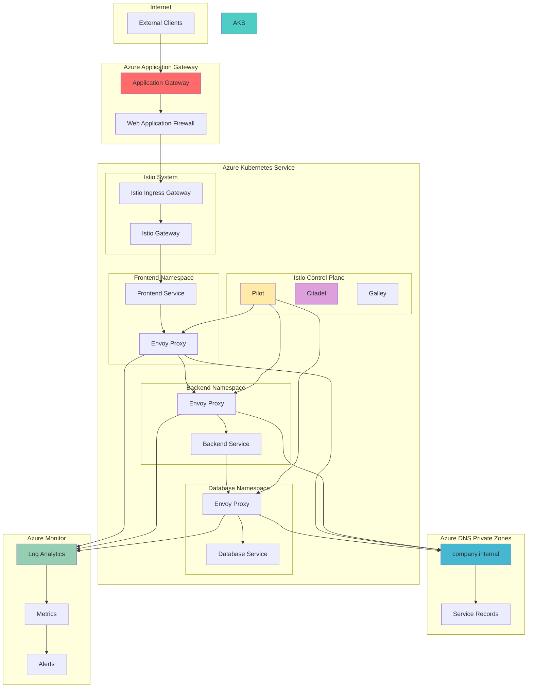

# Zero-Trust Microservices Segmentation with Service Mesh

## Problem

Enterprise microservices architectures face significant challenges in implementing fine-grained network segmentation and service discovery at scale. Traditional network security approaches cannot effectively manage complex service-to-service communication patterns, leading to security vulnerabilities, compliance gaps, and operational complexity. Without proper network segmentation, services can communicate freely across the cluster, creating potential attack vectors and making it difficult to enforce security policies, monitor traffic flows, and maintain regulatory compliance in multi-tenant environments.

## Solution

This solution implements advanced network segmentation using Azure Kubernetes Service (AKS) with Istio service mesh for zero-trust networking, Azure DNS Private Zones for secure service discovery, and Azure Application Gateway for controlled ingress traffic. The architecture establishes microsegmentation through Istio's network policies, enables secure internal DNS resolution via private zones, and provides comprehensive monitoring through Azure Monitor. This approach ensures that service-to-service communication is encrypted, authenticated, and authorized while maintaining operational visibility and compliance controls.

## Architecture Diagram



## Prerequisites

1. Azure subscription with Owner or Contributor access
2. Azure CLI v2.50.0 or later installed and configured
3. kubectl command-line tool installed
4. Basic understanding of Kubernetes, Istio service mesh, and DNS concepts
5. Familiarity with Azure networking and security concepts
6. Estimated cost: $50-100/day for AKS cluster, Application Gateway, and DNS zones

> **Note**: This recipe requires advanced Kubernetes and networking knowledge. Ensure you understand service mesh concepts and DNS resolution before proceeding.

## Preparation

```bash
# Set environment variables for Azure resources
export RESOURCE_GROUP="rg-advanced-network-segmentation"
export LOCATION="eastus"
export SUBSCRIPTION_ID=$(az account show --query id --output tsv)
export AKS_CLUSTER_NAME="aks-service-mesh-cluster"
export DNS_ZONE_NAME="company.internal"
export APP_GATEWAY_NAME="agw-service-mesh"
export VNET_NAME="vnet-service-mesh"
export LOG_ANALYTICS_NAME="log-advanced-networking"

# Generate unique suffix for resource names
RANDOM_SUFFIX=$(openssl rand -hex 3)
export STORAGE_ACCOUNT_NAME="stadvnet${RANDOM_SUFFIX}"

# Create resource group
az group create \
    --name ${RESOURCE_GROUP} \
    --location ${LOCATION} \
    --tags purpose=advanced-networking environment=demo

echo "✅ Resource group created: ${RESOURCE_GROUP}"

# Create Log Analytics workspace for monitoring
az monitor log-analytics workspace create \
    --resource-group ${RESOURCE_GROUP} \
    --workspace-name ${LOG_ANALYTICS_NAME} \
    --location ${LOCATION} \
    --sku PerGB2018

export LOG_ANALYTICS_ID=$(az monitor log-analytics workspace show \
    --resource-group ${RESOURCE_GROUP} \
    --workspace-name ${LOG_ANALYTICS_NAME} \
    --query id --output tsv)

echo "✅ Log Analytics workspace created: ${LOG_ANALYTICS_NAME}"
```

## Steps

1. **Create Virtual Network Infrastructure**:

   Virtual networks provide the foundational layer for network segmentation in Azure. This step creates a dedicated VNet with multiple subnets to isolate different tiers of the application architecture. The subnet design follows security best practices by separating AKS nodes, application gateway, and private endpoints into distinct network segments with appropriate network security group rules.

   ```bash
   # Create virtual network with multiple subnets
   az network vnet create \
       --resource-group ${RESOURCE_GROUP} \
       --name ${VNET_NAME} \
       --address-prefixes 10.0.0.0/16 \
       --location ${LOCATION}

   # Create subnet for AKS cluster
   az network vnet subnet create \
       --resource-group ${RESOURCE_GROUP} \
       --vnet-name ${VNET_NAME} \
       --name aks-subnet \
       --address-prefixes 10.0.1.0/24

   # Create subnet for Application Gateway
   az network vnet subnet create \
       --resource-group ${RESOURCE_GROUP} \
       --vnet-name ${VNET_NAME} \
       --name appgw-subnet \
       --address-prefixes 10.0.2.0/24

   # Create subnet for private endpoints
   az network vnet subnet create \
       --resource-group ${RESOURCE_GROUP} \
       --vnet-name ${VNET_NAME} \
       --name private-endpoints-subnet \
       --address-prefixes 10.0.3.0/24

   echo "✅ Virtual network infrastructure created"
   ```

   The virtual network now provides isolated network segments for each component. This foundation enables secure communication between services while maintaining network boundaries essential for advanced segmentation strategies.

2. **Create AKS Cluster with Istio Service Mesh**:

   Azure Kubernetes Service with Istio service mesh provides the core platform for implementing zero-trust networking and advanced traffic management. The Istio add-on delivers managed service mesh capabilities including mutual TLS, traffic policies, and observability without requiring manual Istio installation and configuration.

   ```bash
   # Get subnet ID for AKS cluster
   AKS_SUBNET_ID=$(az network vnet subnet show \
       --resource-group ${RESOURCE_GROUP} \
       --vnet-name ${VNET_NAME} \
       --name aks-subnet \
       --query id --output tsv)

   # Create AKS cluster with Istio service mesh addon
   az aks create \
       --resource-group ${RESOURCE_GROUP} \
       --name ${AKS_CLUSTER_NAME} \
       --location ${LOCATION} \
       --node-count 3 \
       --node-vm-size Standard_D4s_v3 \
       --vnet-subnet-id ${AKS_SUBNET_ID} \
       --enable-addons monitoring \
       --workspace-resource-id ${LOG_ANALYTICS_ID} \
       --enable-managed-identity \
       --enable-cluster-autoscaler \
       --min-count 2 \
       --max-count 10 \
       --kubernetes-version 1.30.0

   # Enable Istio service mesh addon
   az aks mesh enable \
       --resource-group ${RESOURCE_GROUP} \
       --name ${AKS_CLUSTER_NAME}

   echo "✅ AKS cluster created with Istio service mesh"
   ```

   The AKS cluster now includes the Istio service mesh addon, providing automated sidecar injection, traffic management, and security policies. This managed service mesh eliminates the operational overhead of maintaining Istio while providing enterprise-grade networking capabilities.

3. **Configure kubectl and Verify Istio Installation**:

   Proper kubectl configuration and Istio verification ensure that the service mesh is correctly installed and operational. This step validates that all Istio components are running and ready to enforce network policies and traffic management rules across the cluster.

   ```bash
   # Configure kubectl to connect to AKS cluster
   az aks get-credentials \
       --resource-group ${RESOURCE_GROUP} \
       --name ${AKS_CLUSTER_NAME} \
       --overwrite-existing

   # Verify Istio installation
   kubectl get pods -n aks-istio-system

   # Check Istio version and configuration
   kubectl get mutatingwebhookconfiguration istio-sidecar-injector \
       -o jsonpath='{.metadata.labels.istio\.io/rev}'

   # Verify Istio gateway and virtual services CRDs
   kubectl get crd | grep istio

   echo "✅ Istio service mesh verified and operational"
   ```

   The verification confirms that Istio control plane components are healthy and custom resource definitions are properly installed. This ensures that the service mesh infrastructure is ready for advanced network segmentation configurations.

4. **Create Azure DNS Private Zone**:

   Azure DNS Private Zones provide secure, internal DNS resolution for services within the AKS cluster and connected virtual networks. This enables service discovery without exposing internal service names to the public internet, supporting zero-trust networking principles and compliance requirements.

   ```bash
   # Create private DNS zone for internal service discovery
   az network private-dns zone create \
       --resource-group ${RESOURCE_GROUP} \
       --name ${DNS_ZONE_NAME}

   # Link private DNS zone to virtual network
   az network private-dns link vnet create \
       --resource-group ${RESOURCE_GROUP} \
       --zone-name ${DNS_ZONE_NAME} \
       --name vnet-link \
       --virtual-network ${VNET_NAME} \
       --registration-enabled false

   # Create DNS records for service discovery
   az network private-dns record-set a create \
       --resource-group ${RESOURCE_GROUP} \
       --zone-name ${DNS_ZONE_NAME} \
       --name frontend-service

   az network private-dns record-set a create \
       --resource-group ${RESOURCE_GROUP} \
       --zone-name ${DNS_ZONE_NAME} \
       --name backend-service

   az network private-dns record-set a create \
       --resource-group ${RESOURCE_GROUP} \
       --zone-name ${DNS_ZONE_NAME} \
       --name database-service

   echo "✅ Private DNS zone created and linked to virtual network"
   ```

   The private DNS zone now provides secure internal name resolution for microservices. This DNS infrastructure supports service discovery patterns while maintaining security boundaries and enabling advanced network segmentation policies.

5. **Deploy Application Namespaces with Network Policies**:

   Kubernetes namespaces combined with Istio network policies create logical boundaries for microservices segmentation. This approach implements defense-in-depth security by isolating services into separate namespaces and controlling inter-service communication through granular network policies.

   ```bash
   # Create application namespaces
   kubectl create namespace frontend
   kubectl create namespace backend
   kubectl create namespace database

   # Enable Istio sidecar injection for each namespace
   kubectl label namespace frontend istio-injection=enabled
   kubectl label namespace backend istio-injection=enabled
   kubectl label namespace database istio-injection=enabled

   # Create network policies for namespace isolation
   cat <<EOF | kubectl apply -f -
   apiVersion: networking.k8s.io/v1
   kind: NetworkPolicy
   metadata:
     name: deny-all
     namespace: frontend
   spec:
     podSelector: {}
     policyTypes:
     - Ingress
     - Egress
   ---
   apiVersion: networking.k8s.io/v1
   kind: NetworkPolicy
   metadata:
     name: deny-all
     namespace: backend
   spec:
     podSelector: {}
     policyTypes:
     - Ingress
     - Egress
   ---
   apiVersion: networking.k8s.io/v1
   kind: NetworkPolicy
   metadata:
     name: deny-all
     namespace: database
   spec:
     podSelector: {}
     policyTypes:
     - Ingress
     - Egress
   EOF

   echo "✅ Application namespaces created with network policies"
   ```

   The namespaces now provide logical segmentation with default-deny network policies. This zero-trust approach ensures that all communication must be explicitly authorized, forming the foundation for advanced network segmentation controls.

6. **Deploy Sample Microservices with Istio Configuration**:

   Sample microservices demonstrate practical implementation of service mesh networking patterns. These services showcase how Istio automatically injects sidecars, manages service-to-service communication, and enables advanced traffic management capabilities in a real-world scenario.

   ```bash
   # Deploy frontend service
   cat <<EOF | kubectl apply -f -
   apiVersion: apps/v1
   kind: Deployment
   metadata:
     name: frontend-service
     namespace: frontend
   spec:
     replicas: 2
     selector:
       matchLabels:
         app: frontend
     template:
       metadata:
         labels:
           app: frontend
           version: v1
       spec:
         containers:
         - name: frontend
           image: nginx:1.21
           ports:
           - containerPort: 80
           env:
           - name: BACKEND_URL
             value: "http://backend-service.${DNS_ZONE_NAME}"
   ---
   apiVersion: v1
   kind: Service
   metadata:
     name: frontend-service
     namespace: frontend
   spec:
     selector:
       app: frontend
     ports:
     - port: 80
       targetPort: 80
   EOF

   # Deploy backend service
   cat <<EOF | kubectl apply -f -
   apiVersion: apps/v1
   kind: Deployment
   metadata:
     name: backend-service
     namespace: backend
   spec:
     replicas: 3
     selector:
       matchLabels:
         app: backend
     template:
       metadata:
         labels:
           app: backend
           version: v1
       spec:
         containers:
         - name: backend
           image: httpd:2.4
           ports:
           - containerPort: 80
           env:
           - name: DATABASE_URL
             value: "http://database-service.${DNS_ZONE_NAME}"
   ---
   apiVersion: v1
   kind: Service
   metadata:
     name: backend-service
     namespace: backend
   spec:
     selector:
       app: backend
     ports:
     - port: 80
       targetPort: 80
   EOF

   # Deploy database service
   cat <<EOF | kubectl apply -f -
   apiVersion: apps/v1
   kind: Deployment
   metadata:
     name: database-service
     namespace: database
   spec:
     replicas: 1
     selector:
       matchLabels:
         app: database
     template:
       metadata:
         labels:
           app: database
           version: v1
       spec:
         containers:
         - name: database
           image: postgres:13
           ports:
           - containerPort: 5432
           env:
           - name: POSTGRES_DB
             value: "appdb"
           - name: POSTGRES_USER
             value: "appuser"
           - name: POSTGRES_PASSWORD
             value: "apppassword"
   ---
   apiVersion: v1
   kind: Service
   metadata:
     name: database-service
     namespace: database
   spec:
     selector:
       app: database
     ports:
     - port: 5432
       targetPort: 5432
   EOF

   echo "✅ Sample microservices deployed with Istio sidecar injection"
   ```

   The microservices are now running with Istio sidecars automatically injected, enabling zero-trust networking, traffic management, and observability. Each service communicates through encrypted channels managed by the service mesh.

7. **Configure Istio Traffic Management and Security Policies**:

   Istio traffic management and security policies provide fine-grained control over service-to-service communication. These policies implement zero-trust networking by requiring explicit authorization for all traffic flows, enabling advanced segmentation patterns that align with security and compliance requirements.

   ```bash
   # Create Istio authorization policies for service segmentation
   cat <<EOF | kubectl apply -f -
   apiVersion: security.istio.io/v1beta1
   kind: AuthorizationPolicy
   metadata:
     name: frontend-policy
     namespace: frontend
   spec:
     selector:
       matchLabels:
         app: frontend
     rules:
     - from:
       - source:
           namespaces: ["aks-istio-system"]
     - to:
       - operation:
           methods: ["GET", "POST"]
   ---
   apiVersion: security.istio.io/v1beta1
   kind: AuthorizationPolicy
   metadata:
     name: backend-policy
     namespace: backend
   spec:
     selector:
       matchLabels:
         app: backend
     rules:
     - from:
       - source:
           namespaces: ["frontend"]
     - to:
       - operation:
           methods: ["GET", "POST"]
   ---
   apiVersion: security.istio.io/v1beta1
   kind: AuthorizationPolicy
   metadata:
     name: database-policy
     namespace: database
   spec:
     selector:
       matchLabels:
         app: database
     rules:
     - from:
       - source:
           namespaces: ["backend"]
     - to:
       - operation:
           methods: ["GET", "POST"]
   EOF

   # Create destination rules for traffic management
   cat <<EOF | kubectl apply -f -
   apiVersion: networking.istio.io/v1beta1
   kind: DestinationRule
   metadata:
     name: frontend-destination
     namespace: frontend
   spec:
     host: frontend-service
     trafficPolicy:
       tls:
         mode: ISTIO_MUTUAL
   ---
   apiVersion: networking.istio.io/v1beta1
   kind: DestinationRule
   metadata:
     name: backend-destination
     namespace: backend
   spec:
     host: backend-service
     trafficPolicy:
       tls:
         mode: ISTIO_MUTUAL
   ---
   apiVersion: networking.istio.io/v1beta1
   kind: DestinationRule
   metadata:
     name: database-destination
     namespace: database
   spec:
     host: database-service
     trafficPolicy:
       tls:
         mode: ISTIO_MUTUAL
   EOF

   echo "✅ Istio security and traffic management policies configured"
   ```

   The authorization policies now enforce strict access controls between services, allowing only necessary communication paths. Mutual TLS encryption ensures all service-to-service communication is encrypted and authenticated, implementing zero-trust networking principles.

8. **Create Azure Application Gateway for Secure Ingress**:

   Azure Application Gateway provides enterprise-grade ingress capabilities with integrated Web Application Firewall (WAF) protection. This component controls external access to the service mesh while maintaining security boundaries and enabling advanced traffic management at the edge.

   ```bash
   # Create public IP for Application Gateway
   az network public-ip create \
       --resource-group ${RESOURCE_GROUP} \
       --name appgw-public-ip \
       --location ${LOCATION} \
       --allocation-method Static \
       --sku Standard

   # Create Application Gateway with WAF
   az network application-gateway create \
       --resource-group ${RESOURCE_GROUP} \
       --name ${APP_GATEWAY_NAME} \
       --location ${LOCATION} \
       --vnet-name ${VNET_NAME} \
       --subnet appgw-subnet \
       --capacity 2 \
       --sku WAF_v2 \
       --public-ip-address appgw-public-ip \
       --priority 1000

   # Wait for Istio ingress gateway service to be ready
   echo "Waiting for Istio ingress gateway to be ready..."
   kubectl wait --for=condition=available --timeout=300s \
       deployment/istio-ingressgateway -n aks-istio-system

   # Get Istio ingress gateway service IP
   ISTIO_INGRESS_IP=$(kubectl get service istio-ingressgateway \
       -n aks-istio-system \
       -o jsonpath='{.status.loadBalancer.ingress[0].ip}')

   # Configure backend pool for Istio ingress gateway
   az network application-gateway address-pool create \
       --resource-group ${RESOURCE_GROUP} \
       --gateway-name ${APP_GATEWAY_NAME} \
       --name istio-backend-pool \
       --servers ${ISTIO_INGRESS_IP}

   echo "✅ Application Gateway configured with WAF protection"
   ```

   The Application Gateway now provides secure ingress with WAF protection, routing external traffic to the Istio ingress gateway. This architecture ensures that all external requests pass through security filtering before reaching the service mesh.

9. **Configure DNS Resolution and Service Discovery**:

   DNS resolution configuration enables seamless service discovery across the cluster while maintaining security boundaries. This step updates DNS records to reflect actual service endpoints and configures CoreDNS to resolve private zone names, supporting microservices communication patterns.

   ```bash
   # Get service cluster IPs for DNS record updates
   FRONTEND_CLUSTER_IP=$(kubectl get service frontend-service \
       -n frontend \
       -o jsonpath='{.spec.clusterIP}')
   
   BACKEND_CLUSTER_IP=$(kubectl get service backend-service \
       -n backend \
       -o jsonpath='{.spec.clusterIP}')
   
   DATABASE_CLUSTER_IP=$(kubectl get service database-service \
       -n database \
       -o jsonpath='{.spec.clusterIP}')

   # Update DNS records with actual service IPs
   az network private-dns record-set a add-record \
       --resource-group ${RESOURCE_GROUP} \
       --zone-name ${DNS_ZONE_NAME} \
       --record-set-name frontend-service \
       --ipv4-address ${FRONTEND_CLUSTER_IP}

   az network private-dns record-set a add-record \
       --resource-group ${RESOURCE_GROUP} \
       --zone-name ${DNS_ZONE_NAME} \
       --record-set-name backend-service \
       --ipv4-address ${BACKEND_CLUSTER_IP}

   az network private-dns record-set a add-record \
       --resource-group ${RESOURCE_GROUP} \
       --zone-name ${DNS_ZONE_NAME} \
       --record-set-name database-service \
       --ipv4-address ${DATABASE_CLUSTER_IP}

   # Configure CoreDNS for private zone resolution
   cat <<EOF | kubectl apply -f -
   apiVersion: v1
   kind: ConfigMap
   metadata:
     name: coredns-custom
     namespace: kube-system
   data:
     company.server: |
       ${DNS_ZONE_NAME}:53 {
         errors
         cache 30
         forward . 168.63.129.16
       }
   EOF

   # Restart CoreDNS to apply configuration
   kubectl rollout restart deployment coredns -n kube-system

   echo "✅ DNS resolution configured for service discovery"
   ```

   The DNS configuration now supports both internal service discovery through private zones and external resolution through Azure DNS. This hybrid approach enables secure service-to-service communication while maintaining connectivity to external services.

10. **Configure Istio Gateway for External Access**:

    Istio Gateway provides the entry point for external traffic into the service mesh, working in conjunction with Azure Application Gateway to create a comprehensive ingress solution. This configuration establishes secure, controlled access to microservices while maintaining service mesh security policies.

    ```bash
    # Create Istio Gateway for external access
    cat <<EOF | kubectl apply -f -
    apiVersion: networking.istio.io/v1beta1
    kind: Gateway
    metadata:
      name: frontend-gateway
      namespace: frontend
    spec:
      selector:
        istio: ingressgateway
      servers:
      - port:
          number: 80
          name: http
          protocol: HTTP
        hosts:
        - "*"
    ---
    apiVersion: networking.istio.io/v1beta1
    kind: VirtualService
    metadata:
      name: frontend-virtualservice
      namespace: frontend
    spec:
      hosts:
      - "*"
      gateways:
      - frontend-gateway
      http:
      - match:
        - uri:
            prefix: /
        route:
        - destination:
            host: frontend-service
            port:
              number: 80
    EOF

    # Verify gateway configuration
    kubectl get gateway,virtualservice -n frontend

    echo "✅ Istio Gateway configured for external access"
    ```

    The Istio Gateway now provides controlled access to the frontend service while maintaining service mesh security policies. This configuration ensures that external requests are properly routed through the service mesh with full observability and security controls.

11. **Enable Comprehensive Monitoring and Observability**:

    Comprehensive monitoring provides visibility into service mesh operations, network traffic patterns, and security policy enforcement. This observability foundation enables proactive management of the advanced network segmentation solution and supports compliance reporting requirements.

    ```bash
    # Enable Istio telemetry and monitoring addons
    kubectl apply -f https://raw.githubusercontent.com/istio/istio/release-1.20/samples/addons/prometheus.yaml
    kubectl apply -f https://raw.githubusercontent.com/istio/istio/release-1.20/samples/addons/grafana.yaml
    kubectl apply -f https://raw.githubusercontent.com/istio/istio/release-1.20/samples/addons/jaeger.yaml
    kubectl apply -f https://raw.githubusercontent.com/istio/istio/release-1.20/samples/addons/kiali.yaml

    # Configure Azure Monitor integration for service mesh metrics
    cat <<EOF | kubectl apply -f -
    apiVersion: v1
    kind: ConfigMap
    metadata:
      name: container-azm-ms-agentconfig
      namespace: kube-system
    data:
      schema-version: v1
      config-version: ver1
      log-data-collection-settings: |
        [log_collection_settings]
          [log_collection_settings.stdout]
            enabled = true
            exclude_namespaces = ["kube-system"]
          [log_collection_settings.stderr]
            enabled = true
            exclude_namespaces = ["kube-system"]
          [log_collection_settings.env_var]
            enabled = true
          [log_collection_settings.enrich_container_logs]
            enabled = true
      prometheus-data-collection-settings: |
        [prometheus_data_collection_settings.cluster]
          interval = "1m"
          monitor_kubernetes_pods = true
          monitor_kubernetes_pods_namespaces = ["aks-istio-system", "frontend", "backend", "database"]
    EOF

    # Create metric alert for high latency
    az monitor metrics alert create \
        --name "High Service Mesh Latency" \
        --resource-group ${RESOURCE_GROUP} \
        --scopes ${LOG_ANALYTICS_ID} \
        --condition "avg ContainerInsights_CL_latency_average_d > 1000" \
        --description "Alert when service mesh latency exceeds 1 second" \
        --evaluation-frequency 5m \
        --window-size 10m

    echo "✅ Comprehensive monitoring and observability configured"
    ```

    The monitoring solution now provides full visibility into service mesh operations, including traffic patterns, security policy enforcement, and performance metrics. This observability foundation supports operational excellence and compliance requirements.

## Validation & Testing

1. **Verify Service Mesh Network Segmentation**:

   ```bash
   # Check Istio sidecar injection status
   kubectl get pods -n frontend -o wide
   kubectl get pods -n backend -o wide
   kubectl get pods -n database -o wide

   # Verify each pod has 2 containers (app + sidecar)
   kubectl describe pod -n frontend -l app=frontend
   ```

   Expected output: Each pod should show 2/2 containers running with Istio sidecar proxy.

2. **Test DNS Resolution and Service Discovery**:

   ```bash
   # Test internal DNS resolution
   kubectl run test-dns --image=busybox --rm -it --restart=Never -- \
       nslookup frontend-service.company.internal

   # Test service connectivity through service mesh
   kubectl exec -n frontend deploy/frontend-service -- \
       curl -s http://backend-service.company.internal
   ```

   Expected output: DNS resolution should return private IP addresses and service calls should succeed.

3. **Validate Network Security Policies**:

   ```bash
   # Test unauthorized access (should fail)
   kubectl exec -n database deploy/database-service -- \
       curl -s http://frontend-service.company.internal

   # Test authorized access (should succeed)
   kubectl exec -n backend deploy/backend-service -- \
       curl -s http://database-service.company.internal
   ```

   Expected output: Unauthorized access should fail while authorized access succeeds.

4. **Verify External Access Through Application Gateway**:

   ```bash
   # Get Application Gateway public IP
   APPGW_PUBLIC_IP=$(az network public-ip show \
       --resource-group ${RESOURCE_GROUP} \
       --name appgw-public-ip \
       --query ipAddress --output tsv)

   # Test external access
   curl -s http://${APPGW_PUBLIC_IP}
   ```

   Expected output: Should return response from frontend service through the service mesh.

5. **Monitor Service Mesh Metrics**:

   ```bash
   # Check Istio telemetry
   kubectl port-forward -n istio-system svc/kiali 20001:20001 &
   kubectl port-forward -n istio-system svc/grafana 3000:3000 &

   # Access Kiali dashboard at http://localhost:20001
   # Access Grafana dashboard at http://localhost:3000

   echo "✅ Monitoring dashboards accessible"
   ```

## Cleanup

1. **Remove Application Gateway and networking resources**:

   ```bash
   # Delete Application Gateway
   az network application-gateway delete \
       --resource-group ${RESOURCE_GROUP} \
       --name ${APP_GATEWAY_NAME}

   # Delete public IP
   az network public-ip delete \
       --resource-group ${RESOURCE_GROUP} \
       --name appgw-public-ip

   echo "✅ Application Gateway resources deleted"
   ```

2. **Remove Istio configurations and sample applications**:

   ```bash
   # Delete Istio configurations
   kubectl delete gateway,virtualservice,destinationrule,authorizationpolicy --all -n frontend
   kubectl delete gateway,virtualservice,destinationrule,authorizationpolicy --all -n backend
   kubectl delete gateway,virtualservice,destinationrule,authorizationpolicy --all -n database

   # Delete sample applications
   kubectl delete namespace frontend backend database

   echo "✅ Istio configurations and applications deleted"
   ```

3. **Remove DNS Private Zone**:

   ```bash
   # Delete private DNS zone
   az network private-dns zone delete \
       --resource-group ${RESOURCE_GROUP} \
       --name ${DNS_ZONE_NAME} \
       --yes

   echo "✅ Private DNS zone deleted"
   ```

4. **Remove AKS cluster and virtual network**:

   ```bash
   # Delete AKS cluster
   az aks delete \
       --resource-group ${RESOURCE_GROUP} \
       --name ${AKS_CLUSTER_NAME} \
       --yes --no-wait

   # Delete virtual network
   az network vnet delete \
       --resource-group ${RESOURCE_GROUP} \
       --name ${VNET_NAME}

   echo "✅ AKS cluster and virtual network deletion initiated"
   ```

5. **Remove resource group and all remaining resources**:

   ```bash
   # Delete resource group and all contained resources
   az group delete \
       --name ${RESOURCE_GROUP} \
       --yes \
       --no-wait

   echo "✅ Resource group deletion initiated: ${RESOURCE_GROUP}"
   echo "Note: Complete deletion may take 10-15 minutes"
   ```

## Discussion

Advanced network segmentation with Azure Service Mesh and DNS Private Zones represents a sophisticated approach to implementing zero-trust networking in modern microservices architectures. This solution addresses the fundamental challenge of securing service-to-service communication while maintaining operational flexibility and observability. The Istio service mesh provides comprehensive traffic management, security policies, and observability capabilities that are essential for enterprise-grade deployments, as detailed in the [Azure Kubernetes Service documentation](https://learn.microsoft.com/en-us/azure/aks/istio-about).

The integration of Azure DNS Private Zones creates a secure service discovery mechanism that eliminates the need for external DNS lookups while maintaining internal network boundaries. This approach follows Azure Well-Architected Framework principles by implementing security in depth, operational excellence, and reliability patterns. The combination of Kubernetes network policies, Istio authorization policies, and Azure networking controls creates multiple layers of security that align with zero-trust networking principles, as outlined in the [Azure security documentation](https://learn.microsoft.com/en-us/azure/security/fundamentals/network-overview).

From an operational perspective, this architecture provides comprehensive observability through Azure Monitor integration, Istio telemetry, and third-party monitoring tools like Kiali and Grafana. The monitoring capabilities enable proactive identification of security policy violations, performance issues, and compliance gaps. The solution's scalability is enhanced by AKS cluster autoscaling and Istio's efficient traffic management, ensuring that network segmentation controls don't become performance bottlenecks as the system grows. For detailed guidance on monitoring and observability, refer to the [Azure Monitor documentation](https://learn.microsoft.com/en-us/azure/azure-monitor/containers/container-insights-overview).

The cost implications of this advanced networking solution should be carefully considered, as it involves multiple Azure services including AKS, Application Gateway, DNS Private Zones, and Azure Monitor. However, the security and operational benefits often justify the investment, particularly in regulated industries where compliance requirements mandate strict network segmentation. Organizations should leverage Azure Cost Management tools to monitor and optimize resource usage while maintaining the security posture provided by this architecture.

> **Tip**: Implement gradual rollout of authorization policies using Istio's dry-run mode to validate network segmentation rules before enforcement. This approach minimizes the risk of breaking existing service communications while establishing zero-trust networking controls.

## Challenge

Extend this advanced network segmentation solution by implementing these sophisticated enhancements:

1. **Multi-Cluster Service Mesh Federation**: Implement Istio multi-cluster deployment across multiple AKS clusters in different Azure regions, enabling secure service-to-service communication across clusters with centralized policy management and observability.

2. **Advanced Traffic Management with Canary Deployments**: Configure Istio traffic splitting capabilities to implement automated canary deployments with traffic shifting based on success metrics, integrating with Azure DevOps for CI/CD pipeline automation.

3. **Certificate Management and Rotation**: Implement automated certificate lifecycle management using Azure Key Vault and Istio's certificate management capabilities, ensuring continuous security through automated certificate rotation and compliance reporting.

4. **Service Mesh Security Hardening**: Enhance security posture by implementing Istio security best practices including service account-based authentication, fine-grained RBAC policies, and integration with Azure Active Directory for identity-based access controls.

5. **Compliance and Audit Logging**: Develop comprehensive audit logging and compliance reporting capabilities using Azure Policy, Azure Security Center, and Istio access logs to meet regulatory requirements and security governance standards.

## Infrastructure Code

### Available Infrastructure as Code:

- [Infrastructure Code Overview](code/README.md) - Detailed description of all infrastructure components
- [Bicep](code/bicep/) - Azure Bicep templates
- [Bash CLI Scripts](code/scripts/) - Example bash scripts using Azure CLI commands to deploy infrastructure
- [Terraform](code/terraform/) - Terraform configuration files