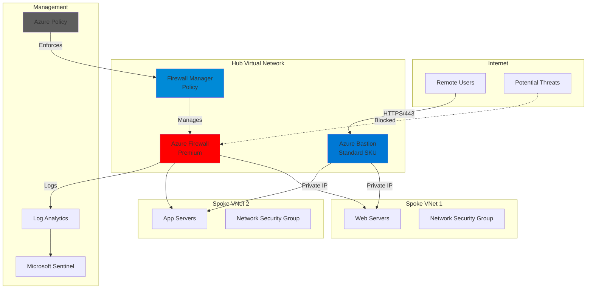

# Zero-Trust Remote Access with Bastion and Firewall Manager

## Problem

Organizations struggle to provide secure remote access to cloud resources while traditional VPN solutions expose management ports (RDP/SSH) to the internet, creating significant security vulnerabilities. Security teams need centralized policy management across multiple virtual networks, but managing individual firewall rules and network security groups becomes complex and error-prone at scale.

## Solution

Deploy Azure Bastion for secure, browser-based remote access that eliminates public IP exposure, combined with Azure Firewall Manager for centralized security policy management across hub-spoke architectures. This zero-trust approach ensures all access is verified, encrypted, and governed by consistent security policies.

## Architecture Diagram



## Prerequisites

1. Azure subscription with Contributor role permissions
2. Azure CLI v2.55 or later installed (or use Azure Cloud Shell)
3. Understanding of Azure networking concepts (VNets, peering, NSGs)
4. Knowledge of zero-trust security principles
5. Estimated cost: ~$1,100/month (Bastion Standard: ~$145, Firewall Premium: ~$955 base fee plus usage)

> **Note**: This recipe uses Azure Firewall Premium for advanced threat protection. Consider Standard SKU (~$180/month base fee) for basic requirements.

## Preparation

```bash
# Set environment variables for Azure resources
export LOCATION="eastus"
export RESOURCE_GROUP="rg-zerotrust-${RANDOM_SUFFIX}"
export HUB_VNET="vnet-hub"
export SPOKE1_VNET="vnet-spoke-prod"
export SPOKE2_VNET="vnet-spoke-dev"

# Generate unique suffix for resource names
RANDOM_SUFFIX=$(openssl rand -hex 3)

# Create resource group
az group create \
    --name ${RESOURCE_GROUP} \
    --location ${LOCATION} \
    --tags purpose=zero-trust-demo environment=production

# Store subscription ID for later use
SUBSCRIPTION_ID=$(az account show --query id --output tsv)

echo "✅ Resource group created: ${RESOURCE_GROUP}"
```

## Steps

1. **Create Hub Virtual Network with Subnets**:

   Azure hub-spoke architecture centralizes security controls and shared services in the hub VNet while isolating workloads in spoke VNets. This design follows zero-trust principles by enforcing all traffic to flow through security inspection points. The hub requires specific subnets for Azure Bastion (AzureBastionSubnet) and Azure Firewall (AzureFirewallSubnet) with exact naming conventions for proper service integration.

   ```bash
   # Create hub virtual network
   az network vnet create \
       --resource-group ${RESOURCE_GROUP} \
       --name ${HUB_VNET} \
       --address-prefix 10.0.0.0/16 \
       --location ${LOCATION}
   
   # Create Azure Bastion subnet (must be named AzureBastionSubnet)
   az network vnet subnet create \
       --resource-group ${RESOURCE_GROUP} \
       --vnet-name ${HUB_VNET} \
       --name AzureBastionSubnet \
       --address-prefix 10.0.1.0/26
   
   # Create Azure Firewall subnet (must be named AzureFirewallSubnet)
   az network vnet subnet create \
       --resource-group ${RESOURCE_GROUP} \
       --vnet-name ${HUB_VNET} \
       --name AzureFirewallSubnet \
       --address-prefix 10.0.2.0/24
   
   echo "✅ Hub VNet created with required subnets"
   ```

   The hub VNet now contains dedicated subnets for security services. The /26 subnet for Bastion supports up to 64 IP addresses and allows for future scaling, while the /24 firewall subnet provides capacity for availability zone deployment and potential expansion.

2. **Deploy Azure Bastion in Standard SKU**:

   Azure Bastion Standard SKU provides enterprise features including native client support, file transfer capabilities, and session recording. Unlike Basic SKU, Standard supports up to 50 concurrent sessions per scale unit and enables connectivity to VMs in peered VNets. The service automatically handles TLS encryption and certificate management, eliminating the need for jump box maintenance and reducing the attack surface.

   ```bash
   # Create public IP for Bastion (must use Standard SKU)
   az network public-ip create \
       --resource-group ${RESOURCE_GROUP} \
       --name pip-bastion-${RANDOM_SUFFIX} \
       --sku Standard \
       --allocation-method Static \
       --location ${LOCATION}
   
   # Deploy Azure Bastion with Standard SKU
   az network bastion create \
       --name bastion-${RANDOM_SUFFIX} \
       --resource-group ${RESOURCE_GROUP} \
       --vnet-name ${HUB_VNET} \
       --public-ip-address pip-bastion-${RANDOM_SUFFIX} \
       --location ${LOCATION} \
       --sku Standard \
       --scale-units 2
   
   echo "✅ Azure Bastion deployed with Standard features"
   ```

   Bastion is now operational and ready to provide secure RDP/SSH access. The Standard SKU with 2 scale units supports up to 100 concurrent sessions, ensuring adequate capacity for remote access scenarios while maintaining security isolation.

3. **Create Spoke Virtual Networks**:

   Spoke VNets isolate different workload environments following the principle of least privilege. This segmentation prevents lateral movement between environments if one is compromised. Each spoke maintains its own network security boundaries while relying on the hub for shared security services such as firewall inspection and secure remote access.

   ```bash
   # Create production spoke VNet
   az network vnet create \
       --resource-group ${RESOURCE_GROUP} \
       --name ${SPOKE1_VNET} \
       --address-prefix 10.1.0.0/16 \
       --location ${LOCATION}
   
   # Create subnet for production workloads
   az network vnet subnet create \
       --resource-group ${RESOURCE_GROUP} \
       --vnet-name ${SPOKE1_VNET} \
       --name snet-prod-workload \
       --address-prefix 10.1.1.0/24
   
   # Create development spoke VNet
   az network vnet create \
       --resource-group ${RESOURCE_GROUP} \
       --name ${SPOKE2_VNET} \
       --address-prefix 10.2.0.0/16 \
       --location ${LOCATION}
   
   # Create subnet for development workloads
   az network vnet subnet create \
       --resource-group ${RESOURCE_GROUP} \
       --vnet-name ${SPOKE2_VNET} \
       --name snet-dev-workload \
       --address-prefix 10.2.1.0/24
   
   echo "✅ Spoke VNets created for workload isolation"
   ```

   The spoke VNets are now established with dedicated address spaces that prevent IP conflicts. This foundation enables proper network segmentation while allowing controlled connectivity through the central hub.

4. **Configure VNet Peering for Hub-Spoke Connectivity**:

   VNet peering establishes private connectivity between hub and spoke networks using Microsoft's backbone infrastructure. This configuration enables Bastion in the hub to reach VMs in spokes while maintaining network isolation. The peering must be bidirectional for proper routing and includes forwarded traffic support for firewall scenarios.

   ```bash
   # Get VNet resource IDs for peering configuration
   HUB_VNET_ID=$(az network vnet show \
       --resource-group ${RESOURCE_GROUP} \
       --name ${HUB_VNET} \
       --query id --output tsv)
   
   SPOKE1_VNET_ID=$(az network vnet show \
       --resource-group ${RESOURCE_GROUP} \
       --name ${SPOKE1_VNET} \
       --query id --output tsv)
   
   SPOKE2_VNET_ID=$(az network vnet show \
       --resource-group ${RESOURCE_GROUP} \
       --name ${SPOKE2_VNET} \
       --query id --output tsv)
   
   # Create peering from hub to spoke1
   az network vnet peering create \
       --resource-group ${RESOURCE_GROUP} \
       --name hub-to-spoke1 \
       --vnet-name ${HUB_VNET} \
       --remote-vnet ${SPOKE1_VNET_ID} \
       --allow-vnet-access \
       --allow-forwarded-traffic
   
   # Create peering from spoke1 to hub
   az network vnet peering create \
       --resource-group ${RESOURCE_GROUP} \
       --name spoke1-to-hub \
       --vnet-name ${SPOKE1_VNET} \
       --remote-vnet ${HUB_VNET_ID} \
       --allow-vnet-access \
       --allow-forwarded-traffic
   
   # Create peering from hub to spoke2
   az network vnet peering create \
       --resource-group ${RESOURCE_GROUP} \
       --name hub-to-spoke2 \
       --vnet-name ${HUB_VNET} \
       --remote-vnet ${SPOKE2_VNET_ID} \
       --allow-vnet-access \
       --allow-forwarded-traffic
   
   # Create peering from spoke2 to hub
   az network vnet peering create \
       --resource-group ${RESOURCE_GROUP} \
       --name spoke2-to-hub \
       --vnet-name ${SPOKE2_VNET} \
       --remote-vnet ${HUB_VNET_ID} \
       --allow-vnet-access \
       --allow-forwarded-traffic
   
   echo "✅ VNet peering established between hub and spokes"
   ```

   Bidirectional peering is now active, enabling secure communication between the hub and spoke networks. This connectivity foundation supports both Bastion access and centralized firewall inspection.

5. **Deploy Azure Firewall with Premium Features**:

   Azure Firewall Premium provides advanced threat protection with features like TLS inspection, IDPS (Intrusion Detection and Prevention), and URL filtering. This managed service scales automatically and provides built-in high availability across availability zones. The firewall acts as the central security inspection point for all network traffic flowing between subnets and to the internet.

   ```bash
   # Create public IP for firewall (Standard SKU required)
   az network public-ip create \
       --resource-group ${RESOURCE_GROUP} \
       --name pip-firewall-${RANDOM_SUFFIX} \
       --sku Standard \
       --allocation-method Static \
       --location ${LOCATION}
   
   # Create Azure Firewall with Premium tier
   az network firewall create \
       --name fw-${RANDOM_SUFFIX} \
       --resource-group ${RESOURCE_GROUP} \
       --location ${LOCATION} \
       --vnet-name ${HUB_VNET} \
       --public-ip pip-firewall-${RANDOM_SUFFIX} \
       --sku AZFW_VNet \
       --tier Premium \
       --threat-intel-mode Alert
   
   # Get firewall private IP for routing configuration
   FW_PRIVATE_IP=$(az network firewall show \
       --name fw-${RANDOM_SUFFIX} \
       --resource-group ${RESOURCE_GROUP} \
       --query "ipConfigurations[0].privateIpAddress" \
       --output tsv)
   
   echo "✅ Azure Firewall deployed with private IP: ${FW_PRIVATE_IP}"
   ```

   The Azure Firewall Premium is now deployed and ready to inspect traffic with advanced threat protection capabilities. The private IP address will be used for routing configuration to ensure all spoke traffic flows through the firewall.

6. **Create Firewall Policy with Zero-Trust Rules**:

   Azure Firewall Manager enables centralized policy management across multiple firewalls. The hierarchical policy structure supports inheritance, allowing base security policies to be enforced organization-wide while permitting local customizations. This approach ensures consistent security posture while maintaining operational flexibility through policy-as-code principles.

   ```bash
   # Create base firewall policy with Premium features
   az network firewall policy create \
       --name fwpolicy-zerotrust-${RANDOM_SUFFIX} \
       --resource-group ${RESOURCE_GROUP} \
       --location ${LOCATION} \
       --sku Premium \
       --threat-intel-mode Alert \
       --idps-mode Alert
   
   # Create rule collection group for organizing rules
   az network firewall policy rule-collection-group create \
       --name rcg-zerotrust \
       --policy-name fwpolicy-zerotrust-${RANDOM_SUFFIX} \
       --resource-group ${RESOURCE_GROUP} \
       --priority 100
   
   # Add application rule for Windows Update (essential for security)
   az network firewall policy rule-collection-group collection \
       add-filter-collection \
       --collection-priority 100 \
       --name app-rules-windows \
       --policy-name fwpolicy-zerotrust-${RANDOM_SUFFIX} \
       --resource-group ${RESOURCE_GROUP} \
       --rcg-name rcg-zerotrust \
       --action Allow \
       --rule-name AllowWindowsUpdate \
       --rule-type ApplicationRule \
       --source-addresses "10.1.0.0/16" "10.2.0.0/16" \
       --protocols Http=80 Https=443 \
       --target-fqdns "*.update.microsoft.com" "*.windowsupdate.com"
   
   # Add network rule for Azure services access
   az network firewall policy rule-collection-group collection \
       add-filter-collection \
       --collection-priority 200 \
       --name net-rules-azure \
       --policy-name fwpolicy-zerotrust-${RANDOM_SUFFIX} \
       --resource-group ${RESOURCE_GROUP} \
       --rcg-name rcg-zerotrust \
       --action Allow \
       --rule-name AllowAzureServices \
       --rule-type NetworkRule \
       --source-addresses "10.1.0.0/16" "10.2.0.0/16" \
       --destination-addresses "AzureCloud.EastUS" \
       --destination-ports 443 \
       --ip-protocols TCP
   
   # Associate policy with firewall
   az network firewall update \
       --name fw-${RANDOM_SUFFIX} \
       --resource-group ${RESOURCE_GROUP} \
       --firewall-policy fwpolicy-zerotrust-${RANDOM_SUFFIX}
   
   echo "✅ Firewall policy created with zero-trust rules"
   ```

   The firewall policy now enforces strict egress controls with allow-listed traffic only. This deny-by-default approach ensures that all network flows are explicitly authorized and inspected for threats using Premium IDPS capabilities.

7. **Configure Network Security Groups for Defense in Depth**:

   Network Security Groups provide microsegmentation at the subnet and NIC level, implementing defense-in-depth beyond the firewall. These stateful rules ensure that even if traffic passes the firewall, additional controls restrict lateral movement. The NSGs specifically allow only Bastion-originated connections to management ports, preventing direct internet access attempts.

   ```bash
   # Create NSG for production workloads
   az network nsg create \
       --resource-group ${RESOURCE_GROUP} \
       --name nsg-prod-workload \
       --location ${LOCATION}
   
   # Allow RDP access only from AzureBastionSubnet
   az network nsg rule create \
       --resource-group ${RESOURCE_GROUP} \
       --nsg-name nsg-prod-workload \
       --name AllowBastionRDP \
       --priority 100 \
       --direction Inbound \
       --access Allow \
       --protocol Tcp \
       --source-address-prefixes 10.0.1.0/26 \
       --source-port-ranges '*' \
       --destination-address-prefixes '*' \
       --destination-port-ranges 3389
   
   # Allow SSH access only from AzureBastionSubnet
   az network nsg rule create \
       --resource-group ${RESOURCE_GROUP} \
       --nsg-name nsg-prod-workload \
       --name AllowBastionSSH \
       --priority 110 \
       --direction Inbound \
       --access Allow \
       --protocol Tcp \
       --source-address-prefixes 10.0.1.0/26 \
       --source-port-ranges '*' \
       --destination-address-prefixes '*' \
       --destination-port-ranges 22
   
   # Deny all other inbound traffic (explicit deny rule)
   az network nsg rule create \
       --resource-group ${RESOURCE_GROUP} \
       --nsg-name nsg-prod-workload \
       --name DenyAllInbound \
       --priority 4096 \
       --direction Inbound \
       --access Deny \
       --protocol '*' \
       --source-address-prefixes '*' \
       --source-port-ranges '*' \
       --destination-address-prefixes '*' \
       --destination-port-ranges '*'
   
   # Associate NSG with production subnet
   az network vnet subnet update \
       --resource-group ${RESOURCE_GROUP} \
       --vnet-name ${SPOKE1_VNET} \
       --name snet-prod-workload \
       --network-security-group nsg-prod-workload
   
   echo "✅ Network security groups configured for zero-trust access"
   ```

   Network security groups now provide subnet-level protection, ensuring that only authorized Bastion traffic can reach management ports. This creates multiple layers of security enforcement.

8. **Implement Azure Policy for Compliance**:

   Azure Policy ensures continuous compliance by preventing non-compliant resources from being created. This governance layer enforces organizational standards such as mandatory NSGs on subnets and restrictions on public IP assignments. Policy-as-code enables version control and audit trails for security requirements, supporting compliance frameworks.

   ```bash
   # Create policy definition for requiring NSGs on subnets
   az policy definition create \
       --name require-nsg-on-subnet \
       --rules '{
         "if": {
           "allOf": [
             {
               "field": "type",
               "equals": "Microsoft.Network/virtualNetworks/subnets"
             },
             {
               "field": "Microsoft.Network/virtualNetworks/subnets/networkSecurityGroup.id",
               "exists": "false"
             },
             {
               "field": "name",
               "notIn": ["AzureBastionSubnet", "AzureFirewallSubnet"]
             }
           ]
         },
         "then": {
           "effect": "deny"
         }
       }' \
       --description "Require NSG on all subnets except Bastion and Firewall" \
       --display-name "Enforce NSG on Subnets"
   
   # Create policy assignment at resource group scope
   az policy assignment create \
       --name nsg-enforcement \
       --scope "/subscriptions/${SUBSCRIPTION_ID}/resourceGroups/${RESOURCE_GROUP}" \
       --policy require-nsg-on-subnet \
       --display-name "Enforce NSG on Subnets"
   
   echo "✅ Azure Policy configured for security compliance"
   ```

   Azure Policy enforcement is now active, preventing the creation of subnets without proper security controls. This governance layer maintains consistent security standards across the environment.

9. **Configure Route Tables for Forced Tunneling**:

   User-defined routes (UDRs) force all traffic through the Azure Firewall, preventing direct internet access from workloads. This ensures that even if a VM is compromised, it cannot establish unauthorized outbound connections. The 0.0.0.0/0 route overrides Azure's default internet routing, creating a security chokepoint for all traffic inspection.

   ```bash
   # Create route table for spoke subnets
   az network route-table create \
       --resource-group ${RESOURCE_GROUP} \
       --name rt-spoke-workloads \
       --location ${LOCATION}
   
   # Add route to force all traffic through firewall
   az network route-table route create \
       --resource-group ${RESOURCE_GROUP} \
       --route-table-name rt-spoke-workloads \
       --name route-to-firewall \
       --address-prefix 0.0.0.0/0 \
       --next-hop-type VirtualAppliance \
       --next-hop-ip-address ${FW_PRIVATE_IP}
   
   # Associate route table with production subnet
   az network vnet subnet update \
       --resource-group ${RESOURCE_GROUP} \
       --vnet-name ${SPOKE1_VNET} \
       --name snet-prod-workload \
       --route-table rt-spoke-workloads
   
   # Associate route table with development subnet
   az network vnet subnet update \
       --resource-group ${RESOURCE_GROUP} \
       --vnet-name ${SPOKE2_VNET} \
       --name snet-dev-workload \
       --route-table rt-spoke-workloads
   
   echo "✅ Route tables configured for forced tunneling"
   ```

   Forced tunneling is now implemented, ensuring all outbound traffic flows through the central firewall for inspection and logging. This prevents data exfiltration and unauthorized communication.

10. **Enable Monitoring and Threat Detection**:

    Comprehensive logging and monitoring are essential for zero-trust architectures. Azure Monitor collects logs from all security components, while Microsoft Sentinel provides SIEM capabilities for threat detection and response. This visibility enables security teams to detect anomalies and respond to incidents quickly with automated playbooks.

    ```bash
    # Create Log Analytics workspace for centralized logging
    az monitor log-analytics workspace create \
        --resource-group ${RESOURCE_GROUP} \
        --workspace-name law-zerotrust-${RANDOM_SUFFIX} \
        --location ${LOCATION}
    
    # Get workspace resource ID for diagnostic settings
    WORKSPACE_ID=$(az monitor log-analytics workspace show \
        --resource-group ${RESOURCE_GROUP} \
        --workspace-name law-zerotrust-${RANDOM_SUFFIX} \
        --query id --output tsv)
    
    # Enable diagnostic settings for Bastion
    az monitor diagnostic-settings create \
        --name diag-bastion \
        --resource $(az network bastion show \
            --name bastion-${RANDOM_SUFFIX} \
            --resource-group ${RESOURCE_GROUP} \
            --query id --output tsv) \
        --workspace ${WORKSPACE_ID} \
        --logs '[{"category": "BastionAuditLogs", "enabled": true}]' \
        --metrics '[{"category": "AllMetrics", "enabled": true}]'
    
    # Enable diagnostic settings for Firewall
    az monitor diagnostic-settings create \
        --name diag-firewall \
        --resource $(az network firewall show \
            --name fw-${RANDOM_SUFFIX} \
            --resource-group ${RESOURCE_GROUP} \
            --query id --output tsv) \
        --workspace ${WORKSPACE_ID} \
        --logs '[
            {"category": "AzureFirewallApplicationRule", "enabled": true},
            {"category": "AzureFirewallNetworkRule", "enabled": true},
            {"category": "AzureFirewallDnsProxy", "enabled": true}
        ]' \
        --metrics '[{"category": "AllMetrics", "enabled": true}]'
    
    echo "✅ Monitoring and logging enabled for all security components"
    ```

    The zero-trust remote access solution is now fully deployed with comprehensive monitoring. All components are configured to log security events, enabling continuous monitoring, threat detection, and compliance verification.

## Validation & Testing

1. Verify Bastion deployment and connectivity:

   ```bash
   # Check Bastion provisioning status
   az network bastion show \
       --name bastion-${RANDOM_SUFFIX} \
       --resource-group ${RESOURCE_GROUP} \
       --query "provisioningState" \
       --output tsv
   ```

   Expected output: `Succeeded`

2. Test VNet peering connectivity:

   ```bash
   # Verify all peering connections are established
   az network vnet peering list \
       --resource-group ${RESOURCE_GROUP} \
       --vnet-name ${HUB_VNET} \
       --output table
   ```

   Expected output: All peerings should show `Connected` status

3. Validate firewall policy application:

   ```bash
   # Check firewall rule collections are properly configured
   az network firewall policy rule-collection-group show \
       --name rcg-zerotrust \
       --policy-name fwpolicy-zerotrust-${RANDOM_SUFFIX} \
       --resource-group ${RESOURCE_GROUP} \
       --query "ruleCollections[].name" \
       --output tsv
   ```

   Expected output: `app-rules-windows` and `net-rules-azure`

4. Verify security compliance with Azure Policy:

   ```bash
   # Check policy compliance state for NSG enforcement
   az policy state list \
       --resource-group ${RESOURCE_GROUP} \
       --query "[?policyAssignmentName=='nsg-enforcement'].complianceState" \
       --output tsv
   ```

   Expected output: `Compliant` for all resources

## Cleanup

1. Remove policy assignments:

   ```bash
   # Delete Azure Policy assignment
   az policy assignment delete \
       --name nsg-enforcement \
       --scope "/subscriptions/${SUBSCRIPTION_ID}/resourceGroups/${RESOURCE_GROUP}"
   
   echo "✅ Policy assignments removed"
   ```

2. Delete diagnostic settings:

   ```bash
   # Remove Bastion diagnostic settings
   az monitor diagnostic-settings delete \
       --name diag-bastion \
       --resource $(az network bastion show \
           --name bastion-${RANDOM_SUFFIX} \
           --resource-group ${RESOURCE_GROUP} \
           --query id --output tsv)
   
   # Remove Firewall diagnostic settings
   az monitor diagnostic-settings delete \
       --name diag-firewall \
       --resource $(az network firewall show \
           --name fw-${RANDOM_SUFFIX} \
           --resource-group ${RESOURCE_GROUP} \
           --query id --output tsv)
   
   echo "✅ Diagnostic settings removed"
   ```

3. Delete all resources:

   ```bash
   # Delete resource group and all contained resources
   az group delete \
       --name ${RESOURCE_GROUP} \
       --yes \
       --no-wait
   
   echo "✅ Resource group deletion initiated: ${RESOURCE_GROUP}"
   echo "Note: Deletion may take 15-20 minutes to complete"
   ```

## Discussion

Zero-trust remote access fundamentally changes how organizations approach security by eliminating implicit trust based on network location. Azure Bastion and Azure Firewall Manager work together to create a comprehensive security solution that verifies every connection and inspects all traffic. This architecture follows the principles outlined in the [Azure Well-Architected Framework](https://docs.microsoft.com/en-us/azure/architecture/framework/) and Microsoft's [Zero Trust deployment guide](https://docs.microsoft.com/en-us/security/zero-trust/deploy/overview).

The combination of Azure Bastion's secure connectivity and Firewall Manager's centralized policy management addresses key enterprise requirements. Bastion eliminates the need for public IPs on VMs, reducing the attack surface by preventing direct internet exposure of management ports. Meanwhile, Firewall Manager enables consistent security policies across multiple virtual networks, essential for maintaining security posture at scale. For detailed implementation guidance, refer to the [Azure Bastion documentation](https://docs.microsoft.com/en-us/azure/bastion/bastion-overview) and [Azure Firewall Manager overview](https://docs.microsoft.com/en-us/azure/firewall-manager/overview).

From a cost optimization perspective, this solution provides significant value compared to traditional approaches. While the initial investment in Premium SKUs represents a substantial monthly cost (approximately $1,100), the operational savings from reduced security incidents, simplified management, and eliminated VPN infrastructure often justify the expense. Organizations can start with Standard SKUs and upgrade as requirements evolve. The [Azure Firewall pricing guide](https://azure.microsoft.com/pricing/details/azure-firewall/) provides detailed cost breakdowns for capacity planning.

> **Tip**: Enable Azure Bastion session recording (available in Premium SKU) to maintain audit trails of all remote access sessions. See the [session recording documentation](https://docs.microsoft.com/en-us/azure/bastion/session-recording) for configuration details.

## Challenge

Extend this solution by implementing these enhancements:

1. Deploy Azure Bastion in multiple regions with Traffic Manager for geo-redundancy and disaster recovery scenarios
2. Integrate Azure AD Privileged Identity Management (PIM) for just-in-time access to Bastion sessions with approval workflows
3. Implement Azure Firewall threat intelligence feeds and custom IDPS rules for industry-specific threats and compliance requirements
4. Create automated incident response using Microsoft Sentinel playbooks triggered by suspicious Bastion access patterns or firewall alerts
5. Deploy Azure Private Endpoints for PaaS services and configure Firewall DNS proxy for FQDN-based filtering with advanced URL categorization

## Infrastructure Code

*Infrastructure code will be generated after recipe approval.*