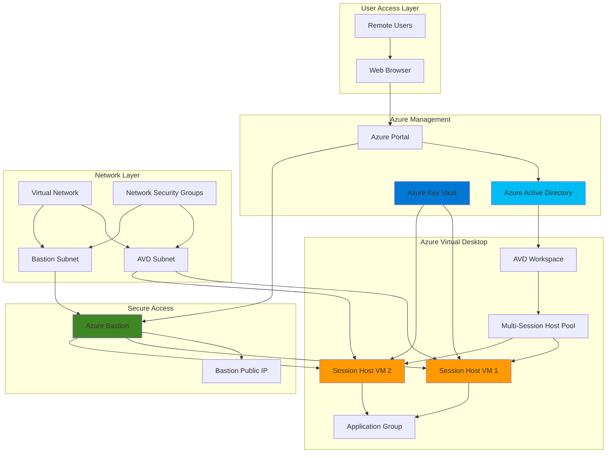

# Zero-Trust Virtual Desktop Infrastructure with Azure Virtual Desktop and Bastion

## Problem

Organizations implementing remote work strategies face significant challenges in providing secure, scalable desktop environments that support multiple concurrent users while maintaining performance and security isolation. Traditional VDI solutions often struggle with complex networking configurations, certificate management overhead, and the need for secure administrative access that doesn't expose virtual machines to the public internet. These challenges result in increased operational complexity, security vulnerabilities, and high infrastructure costs.

## Solution

Azure Virtual Desktop provides a comprehensive multi-session Windows desktop experience with built-in security and scalability, while Azure Bastion eliminates the need for public IP addresses by providing secure RDP/SSH access through the Azure portal. This combination creates a zero-trust architecture where session hosts remain isolated from the internet while supporting multiple concurrent users with automatic certificate provisioning through Azure Key Vault, ensuring enterprise-grade security and operational efficiency.

## Architecture Diagram



## Prerequisites

1. Azure subscription with appropriate permissions for Virtual Desktop and networking resources
2. Azure CLI v2.61.0 or later installed and configured (or use Azure Cloud Shell)
3. Basic understanding of Azure networking concepts and virtual desktop infrastructure
4. Azure Active Directory tenant with user accounts for desktop access
5. Estimated cost: $150-300/month for 2 session hosts, storage, and networking (varies by region and usage)

> **Note**: This recipe requires sufficient Azure quota for D4s_v3 virtual machines and standard networking components. Verify your subscription limits before proceeding.

## Preparation

```bash
# Set environment variables for Azure resources
export RESOURCE_GROUP="rg-avd-infra-${RANDOM_SUFFIX}"
export LOCATION="eastus"
export SUBSCRIPTION_ID=$(az account show --query id --output tsv)

# Generate unique suffix for resource names
RANDOM_SUFFIX=$(openssl rand -hex 3)

# Set Azure Virtual Desktop specific variables
export VNET_NAME="vnet-avd-${RANDOM_SUFFIX}"
export AVD_SUBNET_NAME="subnet-avd-hosts"
export BASTION_SUBNET_NAME="AzureBastionSubnet"
export HOSTPOOL_NAME="hp-multi-session-${RANDOM_SUFFIX}"
export WORKSPACE_NAME="ws-remote-desktop-${RANDOM_SUFFIX}"
export APPGROUP_NAME="ag-desktop-${RANDOM_SUFFIX}"
export KEYVAULT_NAME="kv-avd-${RANDOM_SUFFIX}"

# Create resource group
az group create \
    --name ${RESOURCE_GROUP} \
    --location ${LOCATION} \
    --tags purpose=virtual-desktop environment=production

echo "✅ Resource group created: ${RESOURCE_GROUP}"

# Create Azure Key Vault for certificate management
az keyvault create \
    --name ${KEYVAULT_NAME} \
    --resource-group ${RESOURCE_GROUP} \
    --location ${LOCATION} \
    --sku standard \
    --enable-rbac-authorization true \
    --tags component=security purpose=certificate-management

echo "✅ Key Vault created: ${KEYVAULT_NAME}"
```

## Steps

1. **Create Virtual Network Infrastructure**:

   Azure Virtual Network provides the foundational networking layer for Azure Virtual Desktop, enabling secure communication between session hosts and supporting services. The network design separates AVD resources from administrative access through dedicated subnets, following network segmentation best practices that enhance security while maintaining operational efficiency.

   ```bash
   # Create virtual network with AVD and Bastion subnets
   az network vnet create \
       --name ${VNET_NAME} \
       --resource-group ${RESOURCE_GROUP} \
       --location ${LOCATION} \
       --address-prefixes "10.0.0.0/16" \
       --subnet-name ${AVD_SUBNET_NAME} \
       --subnet-prefixes "10.0.1.0/24" \
       --tags component=networking purpose=virtual-desktop
   
   # Create dedicated subnet for Azure Bastion
   az network vnet subnet create \
       --name ${BASTION_SUBNET_NAME} \
       --resource-group ${RESOURCE_GROUP} \
       --vnet-name ${VNET_NAME} \
       --address-prefixes "10.0.2.0/27"
   
   echo "✅ Virtual network infrastructure created"
   ```

   The virtual network now provides isolated network segments for AVD session hosts and secure administrative access. The /27 subnet for Azure Bastion meets the minimum size requirement while the /24 subnet for AVD hosts allows for future scaling of the desktop infrastructure.

2. **Configure Network Security Groups**:

   Network Security Groups (NSGs) provide stateful packet filtering capabilities that control traffic flow between subnets and resources. For Azure Virtual Desktop, NSGs ensure that session hosts can communicate with required Azure services while blocking unnecessary traffic, implementing a defense-in-depth security approach.

   ```bash
   # Create NSG for AVD subnet
   az network nsg create \
       --name "nsg-avd-hosts" \
       --resource-group ${RESOURCE_GROUP} \
       --location ${LOCATION} \
       --tags component=security purpose=network-filtering
   
   # Allow Azure Virtual Desktop service traffic
   az network nsg rule create \
       --name "AllowAVDServiceTraffic" \
       --nsg-name "nsg-avd-hosts" \
       --resource-group ${RESOURCE_GROUP} \
       --priority 1000 \
       --access Allow \
       --direction Outbound \
       --protocol Tcp \
       --destination-port-ranges 443 \
       --destination-address-prefixes "WindowsVirtualDesktop"
   
   # Allow Azure Bastion communication
   az network nsg rule create \
       --name "AllowBastionInbound" \
       --nsg-name "nsg-avd-hosts" \
       --resource-group ${RESOURCE_GROUP} \
       --priority 1100 \
       --access Allow \
       --direction Inbound \
       --protocol Tcp \
       --source-address-prefixes "10.0.2.0/27" \
       --destination-port-ranges 3389 22
   
   # Associate NSG with AVD subnet
   az network vnet subnet update \
       --name ${AVD_SUBNET_NAME} \
       --resource-group ${RESOURCE_GROUP} \
       --vnet-name ${VNET_NAME} \
       --network-security-group "nsg-avd-hosts"
   
   echo "✅ Network security groups configured"
   ```

   The NSG configuration now provides granular network access control, allowing only necessary traffic to reach session hosts while maintaining connectivity to Azure Virtual Desktop services and secure administrative access through Azure Bastion.

3. **Deploy Azure Bastion for Secure Administrative Access**:

   Azure Bastion provides secure, agentless RDP and SSH access to virtual machines without requiring public IP addresses or VPN connections. This PaaS service eliminates the need to expose session hosts to the internet while providing encrypted access through the Azure portal, significantly reducing the attack surface.

   ```bash
   # Create public IP for Azure Bastion
   az network public-ip create \
       --name "pip-bastion-${RANDOM_SUFFIX}" \
       --resource-group ${RESOURCE_GROUP} \
       --location ${LOCATION} \
       --allocation-method Static \
       --sku Standard \
       --tags component=networking purpose=bastion-access
   
   # Deploy Azure Bastion
   az network bastion create \
       --name "bastion-avd-${RANDOM_SUFFIX}" \
       --resource-group ${RESOURCE_GROUP} \
       --location ${LOCATION} \
       --vnet-name ${VNET_NAME} \
       --public-ip-address "pip-bastion-${RANDOM_SUFFIX}" \
       --sku Basic \
       --tags component=security purpose=secure-access
   
   echo "✅ Azure Bastion deployed successfully"
   ```

   Azure Bastion is now operational and provides secure access to session hosts through the Azure portal. This eliminates the need for public IP addresses on session hosts while maintaining full administrative capabilities for infrastructure management.

4. **Create Azure Virtual Desktop Host Pool**:

   Azure Virtual Desktop host pools define the collection of session hosts that serve as the compute resources for user sessions. Multi-session host pools enable multiple users to share session host resources efficiently, optimizing cost while maintaining performance isolation through Windows 11 Enterprise multi-session capabilities.

   ```bash
   # Create AVD host pool for multi-session desktops
   az desktopvirtualization hostpool create \
       --name ${HOSTPOOL_NAME} \
       --resource-group ${RESOURCE_GROUP} \
       --location ${LOCATION} \
       --host-pool-type Pooled \
       --load-balancer-type BreadthFirst \
       --max-session-limit 10 \
       --preferred-app-group-type Desktop \
       --start-vm-on-connect false \
       --tags component=virtual-desktop purpose=multi-session
   
   # Get host pool registration token
   export REGISTRATION_TOKEN=$(az desktopvirtualization hostpool \
       retrieve-registration-token \
       --name ${HOSTPOOL_NAME} \
       --resource-group ${RESOURCE_GROUP} \
       --query token --output tsv)
   
   echo "✅ Host pool created: ${HOSTPOOL_NAME}"
   ```

   The host pool is now configured to support up to 10 concurrent sessions per host with breadth-first load balancing, ensuring optimal resource distribution across available session hosts while maintaining user experience consistency.

5. **Deploy Multi-Session Virtual Machines**:

   Session host virtual machines provide the compute resources for user desktop sessions. Windows 11 Enterprise multi-session enables multiple users to share a single VM while maintaining session isolation, combining the familiar Windows desktop experience with the efficiency of shared infrastructure.

   ```bash
   # Create first session host VM
   az vm create \
       --name "vm-avd-host-01-${RANDOM_SUFFIX}" \
       --resource-group ${RESOURCE_GROUP} \
       --location ${LOCATION} \
       --image "MicrosoftWindowsDesktop:Windows-11:win11-22h2-ent:latest" \
       --size Standard_D4s_v3 \
       --admin-username "avdadmin" \
       --admin-password "$(openssl rand -base64 32)" \
       --vnet-name ${VNET_NAME} \
       --subnet ${AVD_SUBNET_NAME} \
       --nsg "nsg-avd-hosts" \
       --public-ip-address "" \
       --tags component=session-host purpose=multi-session-desktop
   
   # Create second session host VM
   az vm create \
       --name "vm-avd-host-02-${RANDOM_SUFFIX}" \
       --resource-group ${RESOURCE_GROUP} \
       --location ${LOCATION} \
       --image "MicrosoftWindowsDesktop:Windows-11:win11-22h2-ent:latest" \
       --size Standard_D4s_v3 \
       --admin-username "avdadmin" \
       --admin-password "$(openssl rand -base64 32)" \
       --vnet-name ${VNET_NAME} \
       --subnet ${AVD_SUBNET_NAME} \
       --nsg "nsg-avd-hosts" \
       --public-ip-address "" \
       --tags component=session-host purpose=multi-session-desktop
   
   echo "✅ Session host VMs created successfully"
   ```

   Two session host VMs are now deployed with Windows 11 Enterprise multi-session, providing the foundation for a scalable virtual desktop infrastructure that can support up to 20 concurrent user sessions across both hosts.

6. **Configure Session Hosts with AVD Agent**:

   The Azure Virtual Desktop agent enables session hosts to register with the host pool and participate in user session management. This agent handles session brokering, load balancing, and communication with the Azure Virtual Desktop service, making session hosts discoverable and manageable through automated installation.

   ```bash
   # Download and install AVD agent on first session host
   az vm run-command invoke \
       --name "vm-avd-host-01-${RANDOM_SUFFIX}" \
       --resource-group ${RESOURCE_GROUP} \
       --command-id RunPowerShellScript \
       --scripts "
         # Download and install Azure Virtual Desktop Agent
         Invoke-WebRequest -Uri 'https://go.microsoft.com/fwlink/?linkid=2310011' \
           -OutFile 'C:\AVDAgent.msi'
         Start-Process msiexec.exe -ArgumentList '/i', 'C:\AVDAgent.msi', \
           '/quiet', '/qn', '/norestart', '/passive', \
           'REGISTRATIONTOKEN=${REGISTRATION_TOKEN}' -Wait
         
         # Download and install Azure Virtual Desktop Agent Bootloader
         Invoke-WebRequest -Uri 'https://go.microsoft.com/fwlink/?linkid=2311028' \
           -OutFile 'C:\AVDBootloader.msi'
         Start-Process msiexec.exe -ArgumentList '/i', 'C:\AVDBootloader.msi', \
           '/quiet', '/qn', '/norestart', '/passive' -Wait
         
         Restart-Computer -Force
       "
   
   # Download and install AVD agent on second session host
   az vm run-command invoke \
       --name "vm-avd-host-02-${RANDOM_SUFFIX}" \
       --resource-group ${RESOURCE_GROUP} \
       --command-id RunPowerShellScript \
       --scripts "
         # Download and install Azure Virtual Desktop Agent
         Invoke-WebRequest -Uri 'https://go.microsoft.com/fwlink/?linkid=2310011' \
           -OutFile 'C:\AVDAgent.msi'
         Start-Process msiexec.exe -ArgumentList '/i', 'C:\AVDAgent.msi', \
           '/quiet', '/qn', '/norestart', '/passive', \
           'REGISTRATIONTOKEN=${REGISTRATION_TOKEN}' -Wait
         
         # Download and install Azure Virtual Desktop Agent Bootloader
         Invoke-WebRequest -Uri 'https://go.microsoft.com/fwlink/?linkid=2311028' \
           -OutFile 'C:\AVDBootloader.msi'
         Start-Process msiexec.exe -ArgumentList '/i', 'C:\AVDBootloader.msi', \
           '/quiet', '/qn', '/norestart', '/passive' -Wait
         
         Restart-Computer -Force
       "
   
   echo "✅ AVD agents installed on session hosts"
   ```

   The session hosts are now registered with the host pool and ready to accept user sessions. The AVD agents handle session management, load balancing, and provide the necessary communication channel with Azure Virtual Desktop services using the latest production version.

7. **Create Application Group and Workspace**:

   Application groups define which applications or desktop sessions are available to users, while workspaces provide the user-facing interface for accessing these resources. This separation enables granular access control and simplifies user experience by presenting a unified interface for virtual desktop resources.

   ```bash
   # Create desktop application group
   az desktopvirtualization applicationgroup create \
       --name ${APPGROUP_NAME} \
       --resource-group ${RESOURCE_GROUP} \
       --location ${LOCATION} \
       --application-group-type Desktop \
       --host-pool-arm-path "/subscriptions/${SUBSCRIPTION_ID}/resourceGroups/${RESOURCE_GROUP}/providers/Microsoft.DesktopVirtualization/hostPools/${HOSTPOOL_NAME}" \
       --tags component=virtual-desktop purpose=application-access
   
   # Create AVD workspace
   az desktopvirtualization workspace create \
       --name ${WORKSPACE_NAME} \
       --resource-group ${RESOURCE_GROUP} \
       --location ${LOCATION} \
       --application-group-references "/subscriptions/${SUBSCRIPTION_ID}/resourceGroups/${RESOURCE_GROUP}/providers/Microsoft.DesktopVirtualization/applicationGroups/${APPGROUP_NAME}" \
       --tags component=virtual-desktop purpose=user-interface
   
   echo "✅ Application group and workspace created"
   ```

   Users now have access to a unified workspace that provides desktop sessions from the multi-session host pool. The application group configuration ensures that users receive full desktop experiences with access to all installed applications and system resources.

8. **Configure Azure Key Vault Integration**:

   Azure Key Vault provides centralized certificate and secret management for the virtual desktop infrastructure. This integration enables automated certificate provisioning, secure storage of administrative credentials, and compliance with enterprise security policies without manual certificate management overhead.

   ```bash
   # Create certificate for AVD services
   az keyvault certificate create \
       --vault-name ${KEYVAULT_NAME} \
       --name "avd-ssl-cert" \
       --policy "@-" <<EOF
{
  "issuerParameters": {
    "name": "Self"
  },
  "keyProperties": {
    "exportable": true,
    "keySize": 2048,
    "keyType": "RSA",
    "reuseKey": false
  },
  "secretProperties": {
    "contentType": "application/x-pkcs12"
  },
  "x509CertificateProperties": {
    "subject": "CN=avd-${RANDOM_SUFFIX}.${LOCATION}.cloudapp.azure.com",
    "validityInMonths": 12
  }
}
EOF
   
   # Store session host administrator password
   az keyvault secret set \
       --vault-name ${KEYVAULT_NAME} \
       --name "avd-admin-password" \
       --value "$(openssl rand -base64 32)"
   
   echo "✅ Key Vault integration configured"
   ```

   The Key Vault now provides secure certificate management and credential storage for the virtual desktop infrastructure. This centralized approach ensures consistent security policies and simplifies certificate lifecycle management across all session hosts.

## Validation & Testing

1. **Verify host pool registration**:

   ```bash
   # Check host pool status and session host count
   az desktopvirtualization hostpool show \
       --name ${HOSTPOOL_NAME} \
       --resource-group ${RESOURCE_GROUP} \
       --query '{name:name,hostPoolType:hostPoolType,loadBalancerType:loadBalancerType,maxSessionLimit:maxSessionLimit}' \
       --output table
   
   # List registered session hosts
   az desktopvirtualization sessionhost list \
       --host-pool-name ${HOSTPOOL_NAME} \
       --resource-group ${RESOURCE_GROUP} \
       --query '[].{name:name,status:status,sessions:sessions,allowNewSession:allowNewSession}' \
       --output table
   ```

   Expected output: Host pool should show "Pooled" type with 2 registered session hosts in "Available" status.

2. **Test Azure Bastion connectivity**:

   ```bash
   # Verify Bastion deployment status
   az network bastion show \
       --name "bastion-avd-${RANDOM_SUFFIX}" \
       --resource-group ${RESOURCE_GROUP} \
       --query '{name:name,provisioningState:provisioningState,dnsName:dnsName}' \
       --output table
   
   # Test connectivity to session hosts (manual verification required)
   echo "Navigate to Azure Portal > Virtual Machines > Select session host > Connect via Bastion"
   ```

3. **Validate workspace accessibility**:

   ```bash
   # Check workspace configuration
   az desktopvirtualization workspace show \
       --name ${WORKSPACE_NAME} \
       --resource-group ${RESOURCE_GROUP} \
       --query '{name:name,applicationGroupReferences:applicationGroupReferences}' \
       --output table
   
   # Verify application group association
   az desktopvirtualization applicationgroup show \
       --name ${APPGROUP_NAME} \
       --resource-group ${RESOURCE_GROUP} \
       --query '{name:name,applicationGroupType:applicationGroupType,hostPoolArmPath:hostPoolArmPath}' \
       --output table
   ```

4. **Test Key Vault integration**:

   ```bash
   # Verify certificate creation
   az keyvault certificate show \
       --vault-name ${KEYVAULT_NAME} \
       --name "avd-ssl-cert" \
       --query '{name:name,enabled:attributes.enabled,expires:attributes.expires}' \
       --output table
   
   # Confirm secret storage
   az keyvault secret list \
       --vault-name ${KEYVAULT_NAME} \
       --query '[].{name:name,enabled:attributes.enabled}' \
       --output table
   ```

## Cleanup

1. **Remove Azure Virtual Desktop resources**:

   ```bash
   # Delete application group
   az desktopvirtualization applicationgroup delete \
       --name ${APPGROUP_NAME} \
       --resource-group ${RESOURCE_GROUP} \
       --yes
   
   # Delete workspace
   az desktopvirtualization workspace delete \
       --name ${WORKSPACE_NAME} \
       --resource-group ${RESOURCE_GROUP} \
       --yes
   
   # Delete host pool
   az desktopvirtualization hostpool delete \
       --name ${HOSTPOOL_NAME} \
       --resource-group ${RESOURCE_GROUP} \
       --yes
   
   echo "✅ AVD resources deleted"
   ```

2. **Remove virtual machines and networking**:

   ```bash
   # Delete session host VMs
   az vm delete \
       --name "vm-avd-host-01-${RANDOM_SUFFIX}" \
       --resource-group ${RESOURCE_GROUP} \
       --yes --no-wait
   
   az vm delete \
       --name "vm-avd-host-02-${RANDOM_SUFFIX}" \
       --resource-group ${RESOURCE_GROUP} \
       --yes --no-wait
   
   # Delete Azure Bastion
   az network bastion delete \
       --name "bastion-avd-${RANDOM_SUFFIX}" \
       --resource-group ${RESOURCE_GROUP} \
       --yes --no-wait
   
   echo "✅ Virtual machines and Bastion deleted"
   ```

3. **Remove Key Vault and resource group**:

   ```bash
   # Delete Key Vault
   az keyvault delete \
       --name ${KEYVAULT_NAME} \
       --resource-group ${RESOURCE_GROUP}
   
   # Delete resource group and all remaining resources
   az group delete \
       --name ${RESOURCE_GROUP} \
       --yes \
       --no-wait
   
   echo "✅ Resource group deletion initiated: ${RESOURCE_GROUP}"
   echo "Note: Complete cleanup may take several minutes"
   ```

## Discussion

Azure Virtual Desktop with Azure Bastion creates a comprehensive virtual desktop infrastructure that addresses modern remote work security and scalability requirements. The multi-session capability of Windows 11 Enterprise enables efficient resource utilization while maintaining user experience consistency, making it ideal for organizations needing cost-effective desktop virtualization. Azure Bastion's zero-trust approach eliminates the need for public IP addresses on session hosts, significantly reducing attack surface while maintaining full administrative access through encrypted connections. For detailed implementation guidance, see the [Azure Virtual Desktop documentation](https://learn.microsoft.com/en-us/azure/virtual-desktop/) and [Azure Bastion overview](https://learn.microsoft.com/en-us/azure/bastion/bastion-overview).

The architecture implements defense-in-depth security principles through multiple layers of protection including network segmentation, identity-based access control, and encrypted communications. Azure Key Vault integration provides enterprise-grade certificate management and secret storage, eliminating manual certificate lifecycle management while ensuring compliance with security policies. The session isolation capabilities of Windows 11 Enterprise multi-session ensure that each user operates in a secure, dedicated environment despite sharing underlying compute resources. This approach follows the [Azure Well-Architected Framework](https://learn.microsoft.com/en-us/azure/architecture/framework/) principles of security, reliability, and cost optimization.

From an operational perspective, this solution provides automated scaling capabilities through Azure Virtual Desktop's built-in load balancing and session management features. The breadth-first load balancing ensures optimal resource distribution across available session hosts, while the configurable session limits prevent resource exhaustion. Azure Monitor integration enables comprehensive monitoring of user sessions, resource utilization, and performance metrics, providing insights for capacity planning and optimization. For monitoring best practices, review the [Azure Virtual Desktop monitoring guide](https://learn.microsoft.com/en-us/azure/virtual-desktop/monitoring).

Cost optimization is achieved through the efficient multi-session architecture and Azure's consumption-based pricing model. Organizations can optimize costs by implementing appropriate session limits, utilizing Azure Reserved Instances for predictable workloads, and leveraging Azure Cost Management tools for ongoing optimization. The solution's scalability enables organizations to start with minimal resources and expand based on actual demand, ensuring cost-effective growth. For comprehensive cost management strategies, see the [Azure cost optimization documentation](https://learn.microsoft.com/en-us/azure/cost-management-billing/cost-management-billing-overview).

> **Tip**: Use Azure Monitor Workbooks to create custom dashboards for tracking virtual desktop usage patterns, session performance, and resource utilization. The [Azure Virtual Desktop Insights](https://learn.microsoft.com/en-us/azure/virtual-desktop/insights) provides pre-built monitoring solutions tailored for virtual desktop environments.

## Challenge

Extend this virtual desktop infrastructure by implementing these enhancements:

1. **Implement Auto-scaling with Azure Automation**: Create Azure Automation runbooks that automatically scale session hosts based on user demand, implementing start/stop schedules and dynamic capacity management to optimize costs during off-peak hours.

2. **Deploy FSLogix Profile Containers**: Integrate Azure Files or Azure NetApp Files with FSLogix to provide persistent user profiles and application data, enabling seamless user experience across multiple session hosts with fast login times.

3. **Configure Azure Monitor Application Insights**: Implement comprehensive monitoring and alerting for user session performance, application responsiveness, and infrastructure health using custom metrics and automated remediation workflows.

4. **Establish Multi-Region Disaster Recovery**: Design and implement a secondary Azure Virtual Desktop deployment in a different region with Azure Site Recovery for session host disaster recovery and Azure Traffic Manager for automatic failover capabilities.

5. **Integrate with Microsoft Endpoint Manager**: Configure Intune policies for Windows 11 Enterprise multi-session management, including security baselines, application deployment, and compliance monitoring across all session hosts.

## Infrastructure Code

### Available Infrastructure as Code:

- [Infrastructure Code Overview](code/README.md) - Detailed description of all infrastructure components
- [Bicep](code/bicep/) - Azure Bicep templates
- [Bash CLI Scripts](code/scripts/) - Example bash scripts using Azure CLI commands to deploy infrastructure
- [Terraform](code/terraform/) - Terraform configuration files