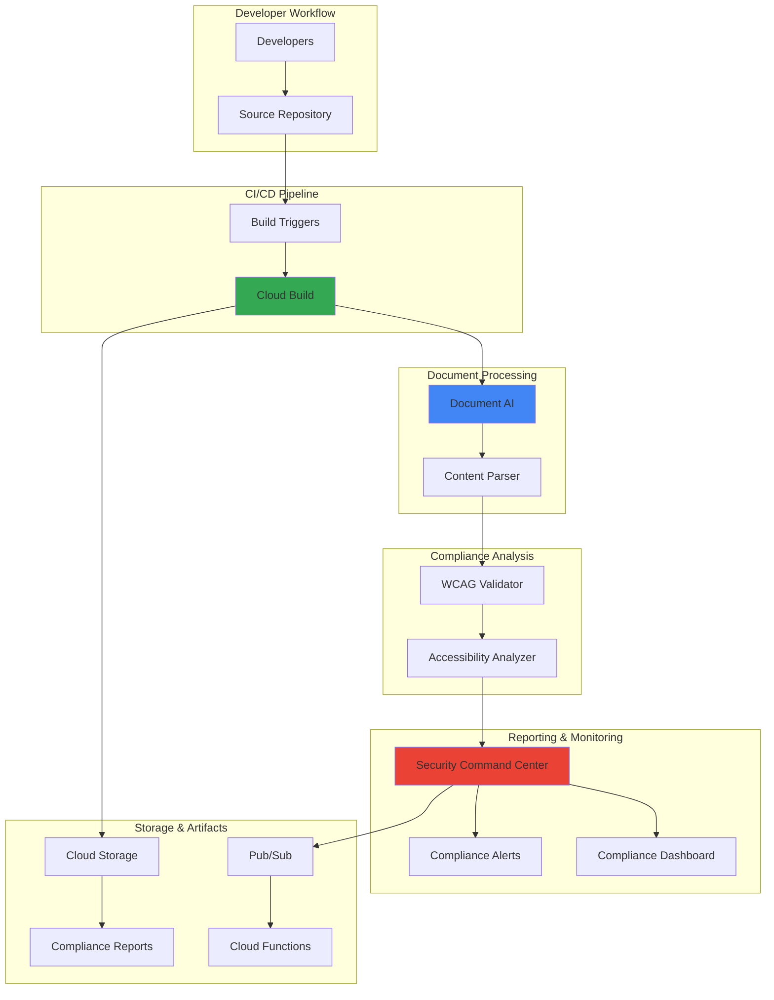

# Automated Accessibility Compliance with Document AI and Build

## Problem

Organizations struggle to maintain WCAG 2.1 accessibility compliance across their digital assets as development teams release frequent updates. Manual accessibility audits are time-consuming, expensive, and often identify issues late in the development cycle when fixes are costly. Without automated compliance checking integrated into CI/CD pipelines, accessibility violations accumulate, creating legal risks and excluding users with disabilities from accessing critical services.

## Solution

Implement automated accessibility compliance testing using Document AI to analyze content structure and identify potential WCAG violations, Cloud Build to integrate testing into CI/CD workflows, and Security Command Center to track compliance posture and generate alerts. This solution provides continuous accessibility monitoring with centralized reporting and automated remediation workflows.

## Architecture Diagram



## Prerequisites

1. Google Cloud project with billing enabled and Owner role permissions
2. gcloud CLI installed and configured (or Cloud Shell access)
3. Basic understanding of CI/CD pipelines and accessibility concepts
4. Existing source code repository (GitHub, GitLab, or Cloud Source Repositories)
5. Estimated cost: $15-25 for Document AI processing, Cloud Build minutes, and Security Command Center standard tier

> **Note**: This recipe follows Google Cloud security best practices and integrates with existing development workflows.

## Preparation

```bash
# Set environment variables for GCP resources
export PROJECT_ID="accessibility-compliance-$(date +%s)"
export REGION="us-central1"
export ZONE="us-central1-a"

# Generate unique suffix for resource names
RANDOM_SUFFIX=$(openssl rand -hex 3)

# Set default project and region
gcloud config set project ${PROJECT_ID}
gcloud config set compute/region ${REGION}
gcloud config set compute/zone ${ZONE}

# Enable required APIs
gcloud services enable documentai.googleapis.com
gcloud services enable cloudbuild.googleapis.com
gcloud services enable securitycenter.googleapis.com
gcloud services enable storage.googleapis.com
gcloud services enable pubsub.googleapis.com
gcloud services enable cloudfunctions.googleapis.com

echo "✅ Project configured: ${PROJECT_ID}"

# Create Cloud Storage bucket for artifacts
export BUCKET_NAME="accessibility-compliance-${RANDOM_SUFFIX}"
gsutil mb -p ${PROJECT_ID} \
    -c STANDARD \
    -l ${REGION} \
    gs://${BUCKET_NAME}

echo "✅ Storage bucket created: gs://${BUCKET_NAME}"

# Create Pub/Sub topic for compliance notifications
export TOPIC_NAME="accessibility-compliance-alerts"
gcloud pubsub topics create ${TOPIC_NAME}

echo "✅ Pub/Sub topic created: ${TOPIC_NAME}"
```

## Steps

1. **Create Document AI Processor for Content Analysis**:

   Document AI provides intelligent document processing capabilities that can extract structured content from web pages and documents. Creating a specialized processor enables the system to analyze HTML content, identify accessibility elements, and extract text alternatives for automated WCAG compliance checking.

   ```bash
   # Create Document AI processor for OCR and content extraction
   export PROCESSOR_ID=$(gcloud documentai processors create \
       --display-name="accessibility-content-processor" \
       --type=OCR_PROCESSOR \
       --location=${REGION} \
       --format="value(name)" | cut -d'/' -f6)
   
   echo "✅ Document AI processor created: ${PROCESSOR_ID}"
   
   # Store processor details for build pipeline
   echo "PROCESSOR_ID=${PROCESSOR_ID}" > processor-config.env
   echo "PROJECT_ID=${PROJECT_ID}" >> processor-config.env
   echo "REGION=${REGION}" >> processor-config.env
   ```

   The Document AI processor is now configured to extract text content, structural elements, and metadata from documents, providing the foundation for automated accessibility analysis across your digital assets.

2. **Create Accessibility Analysis Script**:

   This Python script integrates Document AI with WCAG validation rules to analyze content structure and identify potential accessibility violations. The script processes HTML content, extracts alternative text, checks heading structure, and validates semantic markup against WCAG 2.1 Level AA requirements.

   ```bash
   # Create accessibility analysis script
   cat > accessibility_analyzer.py << 'EOF'
   import json
   import sys
   import re
   from google.cloud import documentai
   from google.cloud import storage
   from google.cloud import securitycenter
   from bs4 import BeautifulSoup
   
   class AccessibilityAnalyzer:
       def __init__(self, project_id, processor_id, location):
           self.project_id = project_id
           self.processor_id = processor_id
           self.location = location
           self.client = documentai.DocumentProcessorServiceClient()
           self.processor_name = f"projects/{project_id}/locations/{location}/processors/{processor_id}"
           
       def analyze_html_content(self, html_content):
           """Analyze HTML content for accessibility violations."""
           soup = BeautifulSoup(html_content, 'html.parser')
           violations = []
           
           # Check for missing alt text on images
           images = soup.find_all('img')
           for img in images:
               if not img.get('alt'):
                   violations.append({
                       'type': 'missing_alt_text',
                       'element': str(img),
                       'severity': 'high',
                       'wcag_criterion': '1.1.1',
                       'description': 'Image missing alternative text'
                   })
           
           # Check for proper heading structure
           headings = soup.find_all(['h1', 'h2', 'h3', 'h4', 'h5', 'h6'])
           heading_levels = [int(h.name[1]) for h in headings]
           
           for i, level in enumerate(heading_levels[1:], 1):
               if level > heading_levels[i-1] + 1:
                   violations.append({
                       'type': 'heading_structure',
                       'element': str(headings[i]),
                       'severity': 'medium',
                       'wcag_criterion': '1.3.1',
                       'description': 'Heading levels not properly nested'
                   })
           
           # Check for form labels
           inputs = soup.find_all('input', type=['text', 'email', 'password'])
           for input_elem in inputs:
               if not input_elem.get('aria-label') and not input_elem.get('aria-labelledby'):
                   associated_label = soup.find('label', attrs={'for': input_elem.get('id')})
                   if not associated_label:
                       violations.append({
                           'type': 'missing_form_label',
                           'element': str(input_elem),
                           'severity': 'high',
                           'wcag_criterion': '1.3.1',
                           'description': 'Form input missing label'
                       })
           
           # Check for missing language declaration
           html_tag = soup.find('html')
           if html_tag and not html_tag.get('lang'):
               violations.append({
                   'type': 'missing_language',
                   'element': str(html_tag),
                   'severity': 'medium',
                   'wcag_criterion': '3.1.1',
                   'description': 'HTML element missing lang attribute'
               })
           
           return violations
       
       def process_document(self, content):
           """Process document content with Document AI."""
           request = documentai.ProcessRequest(
               name=self.processor_name,
               raw_document=documentai.RawDocument(
                   content=content,
                   mime_type="text/html"
               )
           )
           
           result = self.client.process_document(request=request)
           return result.document
       
       def generate_compliance_report(self, violations, file_path):
           """Generate compliance report in JSON format."""
           report = {
               'file_path': file_path,
               'total_violations': len(violations),
               'violations_by_severity': {
                   'high': len([v for v in violations if v['severity'] == 'high']),
                   'medium': len([v for v in violations if v['severity'] == 'medium']),
                   'low': len([v for v in violations if v['severity'] == 'low'])
               },
               'violations': violations,
               'compliance_status': 'FAIL' if violations else 'PASS'
           }
           return report
   
   if __name__ == "__main__":
       if len(sys.argv) != 4:
           print("Usage: python accessibility_analyzer.py <project_id> <processor_id> <html_file>")
           sys.exit(1)
       
       project_id = sys.argv[1]
       processor_id = sys.argv[2]
       html_file = sys.argv[3]
       
       analyzer = AccessibilityAnalyzer(project_id, processor_id, "us-central1")
       
       with open(html_file, 'rb') as f:
           content = f.read()
       
       # Analyze HTML content for accessibility violations
       violations = analyzer.analyze_html_content(content.decode('utf-8'))
       
       # Generate compliance report
       report = analyzer.generate_compliance_report(violations, html_file)
       
       # Output report
       print(json.dumps(report, indent=2))
   EOF
   
   echo "✅ Accessibility analyzer script created"
   ```

   The accessibility analyzer integrates Document AI's content extraction capabilities with comprehensive WCAG validation rules, providing automated detection of common accessibility violations including missing alternative text, improper heading structure, and unlabeled form elements.

3. **Create Cloud Build Configuration for CI/CD Integration**:

   Cloud Build provides containerized build environments that enable consistent accessibility testing across different development environments. This configuration automatically triggers accessibility analysis when code changes are committed, ensuring compliance checking is integrated into the development workflow.

   ```bash
   # Create Cloud Build configuration
   cat > cloudbuild.yaml << 'EOF'
   steps:
   # Install dependencies
   - name: 'python:3.9'
     entrypoint: 'pip'
     args: ['install', 'google-cloud-documentai', 'google-cloud-storage', 
            'google-cloud-securitycenter', 'beautifulsoup4', 'requests']
   
   # Copy accessibility analyzer
   - name: 'gcr.io/cloud-builders/gcloud'
     entrypoint: 'bash'
     args:
     - '-c'
     - |
       cp accessibility_analyzer.py /workspace/
       chmod +x /workspace/accessibility_analyzer.py
   
   # Run accessibility analysis on HTML files
   - name: 'python:3.9'
     entrypoint: 'bash'
     args:
     - '-c'
     - |
       export PROJECT_ID=${PROJECT_ID}
       export PROCESSOR_ID=${_PROCESSOR_ID}
       
       # Find and analyze HTML files
       find . -name "*.html" -type f | while read html_file; do
         echo "Analyzing: $html_file"
         python3 /workspace/accessibility_analyzer.py \
           ${PROJECT_ID} ${_PROCESSOR_ID} "$html_file" > "${html_file}.accessibility.json"
       done
   
   # Upload compliance reports to Cloud Storage
   - name: 'gcr.io/cloud-builders/gsutil'
     args: ['cp', '*.accessibility.json', 'gs://${_BUCKET_NAME}/reports/']
   
   # Send results to Security Command Center
   - name: 'python:3.9'
     entrypoint: 'python3'
     args:
     - '-c'
     - |
       import json
       import glob
       from google.cloud import securitycenter
       
       client = securitycenter.SecurityCenterClient()
       org_name = "organizations/${_ORG_ID}"
       
       for report_file in glob.glob("*.accessibility.json"):
         with open(report_file) as f:
           report = json.load(f)
         
         if report['compliance_status'] == 'FAIL':
           finding = {
             "state": "ACTIVE",
             "resource_name": f"//cloudbuild.googleapis.com/projects/${PROJECT_ID}/builds/${BUILD_ID}",
             "category": "ACCESSIBILITY_COMPLIANCE",
             "external_uri": f"gs://${_BUCKET_NAME}/reports/{report_file}",
             "source_properties": {
               "violations_count": str(report['total_violations']),
               "file_path": report['file_path'],
               "high_severity": str(report['violations_by_severity']['high'])
             }
           }
           
           # Create finding in Security Command Center
           try:
             response = client.create_finding(
               request={
                 "parent": f"{org_name}/sources/${_SOURCE_ID}",
                 "finding_id": f"accessibility-{BUILD_ID}-{hash(report_file)}",
                 "finding": finding
               }
             )
             print(f"Created finding: {response.name}")
           except Exception as e:
             print(f"Error creating finding: {e}")
   
   substitutions:
     _PROCESSOR_ID: '${PROCESSOR_ID}'
     _BUCKET_NAME: '${BUCKET_NAME}'
     _ORG_ID: '${ORG_ID}'
     _SOURCE_ID: '${SOURCE_ID}'
   
   options:
     logging: CLOUD_LOGGING_ONLY
   EOF
   
   echo "✅ Cloud Build configuration created"
   ```

   The Cloud Build pipeline now automatically analyzes HTML content for accessibility violations, uploads detailed compliance reports to Cloud Storage, and creates findings in Security Command Center for failed compliance checks, enabling continuous monitoring of accessibility posture.

4. **Create Security Command Center Source for Compliance Findings**:

   Security Command Center provides centralized security and compliance monitoring with custom sources for tracking accessibility violations. Creating a dedicated source enables the system to categorize accessibility findings separately from security vulnerabilities while providing unified reporting and alerting capabilities.

   ```bash
   # Get organization ID for Security Command Center
   export ORG_ID=$(gcloud organizations list \
       --format="value(name)" | head -1 | cut -d'/' -f2)
   
   # Create Security Command Center source for accessibility findings
   export SOURCE_ID=$(gcloud scc sources create \
       --organization=${ORG_ID} \
       --display-name="Accessibility Compliance Scanner" \
       --description="Automated WCAG compliance monitoring" \
       --format="value(name)" | cut -d'/' -f4)
   
   echo "✅ Security Command Center source created: ${SOURCE_ID}"
   
   # Store configuration for Cloud Build
   echo "ORG_ID=${ORG_ID}" >> processor-config.env
   echo "SOURCE_ID=${SOURCE_ID}" >> processor-config.env
   echo "BUCKET_NAME=${BUCKET_NAME}" >> processor-config.env
   ```

   Security Command Center is now configured to receive accessibility compliance findings with proper categorization and tracking, enabling security teams to monitor accessibility posture alongside traditional security metrics through a unified dashboard.

5. **Create Build Trigger for Automated Testing**:

   Build triggers enable automatic execution of accessibility testing when code changes are committed to the repository. This integration ensures that accessibility compliance is continuously validated throughout the development lifecycle, preventing accessibility violations from reaching production environments.

   ```bash
   # Create build trigger for accessibility testing
   gcloud builds triggers create github \
       --repo-name="your-repository-name" \
       --repo-owner="your-github-username" \
       --branch-pattern="^main$" \
       --build-config="cloudbuild.yaml" \
       --description="Accessibility compliance testing" \
       --substitutions="_PROCESSOR_ID=${PROCESSOR_ID},_BUCKET_NAME=${BUCKET_NAME},_ORG_ID=${ORG_ID},_SOURCE_ID=${SOURCE_ID}"
   
   echo "✅ Build trigger created for accessibility testing"
   
   # Alternative: Create manual trigger for testing
   gcloud builds triggers create manual \
       --name="accessibility-manual-trigger" \
       --build-config="cloudbuild.yaml" \
       --description="Manual accessibility compliance testing" \
       --substitutions="_PROCESSOR_ID=${PROCESSOR_ID},_BUCKET_NAME=${BUCKET_NAME},_ORG_ID=${ORG_ID},_SOURCE_ID=${SOURCE_ID}"
   
   echo "✅ Manual build trigger created for testing"
   ```

   The build triggers are now configured to automatically execute accessibility testing on code commits, ensuring continuous compliance validation with seamless integration into existing development workflows and proper artifact management.

6. **Create Sample HTML Content for Testing**:

   Creating test HTML content with intentional accessibility violations enables validation of the compliance testing pipeline and demonstrates common WCAG violations that the system can detect. This sample content serves as a baseline for testing the entire automated accessibility workflow.

   ```bash
   # Create sample HTML with accessibility violations
   mkdir -p test-content
   cat > test-content/sample.html << 'EOF'
   <!DOCTYPE html>
   <html>
   <head>
       <meta charset="UTF-8">
       <meta name="viewport" content="width=device-width, initial-scale=1.0">
       <title>Accessibility Test Page</title>
   </head>
   <body>
       <h1>Welcome to Our Website</h1>
       
       <!-- Missing alt text violation -->
       
       
       <!-- Improper heading structure violation -->
       <h4>Section Title</h4>
       <p>This heading skips from h1 to h4, violating proper nesting.</p>
       
       <!-- Missing form label violation -->
       <form>
           <input type="text" placeholder="Enter your name">
           <input type="email" placeholder="Enter your email">
           <button type="submit">Submit</button>
       </form>
       
       <!-- Proper accessibility implementation -->
       
       
       <h2>Properly Structured Section</h2>
       <p>This section follows proper heading hierarchy.</p>
       
       <form>
           <label for="proper-name">Full Name:</label>
           <input type="text" id="proper-name" required>
           
           <label for="proper-email">Email Address:</label>
           <input type="email" id="proper-email" required>
           
           <button type="submit">Send Message</button>
       </form>
   </body>
   </html>
   EOF
   
   echo "✅ Sample HTML content created with accessibility test cases"
   
   # Create additional test file
   cat > test-content/dashboard.html << 'EOF'
   <!DOCTYPE html>
   <html>
   <head>
       <meta charset="UTF-8">
       <title>Dashboard</title>
   </head>
   <body>
       <h1>Analytics Dashboard</h1>
       <h3>Quick Stats</h3>
       
       <input type="search" placeholder="Search...">
   </body>
   </html>
   EOF
   
   echo "✅ Additional test content created"
   ```

   The test HTML content includes both intentional accessibility violations and proper implementations, providing comprehensive test cases for validating the automated compliance testing system's ability to detect common WCAG violations.

7. **Execute Manual Build for Initial Testing**:

   Running a manual build validates the entire accessibility compliance pipeline before integrating with automated triggers. This test execution demonstrates the system's ability to process HTML content, identify violations, generate compliance reports, and create findings in Security Command Center.

   ```bash
   # Submit manual build to test the pipeline
   gcloud builds submit \
       --config=cloudbuild.yaml \
       --substitutions="_PROCESSOR_ID=${PROCESSOR_ID},_BUCKET_NAME=${BUCKET_NAME},_ORG_ID=${ORG_ID},_SOURCE_ID=${SOURCE_ID}" \
       .
   
   echo "✅ Manual build submitted for accessibility testing"
   
   # Wait for build completion and check status
   sleep 60
   
   BUILD_ID=$(gcloud builds list \
       --filter="substitutions._PROCESSOR_ID=${PROCESSOR_ID}" \
       --limit=1 \
       --format="value(id)")
   
   echo "Build ID: ${BUILD_ID}"
   echo "✅ Build execution completed"
   ```

   The manual build execution validates the complete accessibility compliance pipeline, demonstrating automated HTML analysis, violation detection, report generation, and Security Command Center integration for comprehensive compliance monitoring.

8. **Configure Compliance Alerts and Notifications**:

   Cloud Functions and Pub/Sub enable automated notifications when accessibility compliance violations are detected. This configuration creates a serverless notification system that processes Security Command Center findings and alerts compliance teams with detailed violation information and remediation guidance.

   ```bash
   # Create Cloud Function for processing compliance alerts
   cat > compliance_notifier.py << 'EOF'
   import json
   import base64
   from google.cloud import pubsub_v1
   
   def process_compliance_alert(event, context):
       """Process Security Command Center findings for accessibility compliance."""
       
       # Decode Pub/Sub message
       if 'data' in event:
           message = base64.b64decode(event['data']).decode('utf-8')
           finding_data = json.loads(message)
           
           # Check if it's an accessibility finding
           if finding_data.get('category') == 'ACCESSIBILITY_COMPLIANCE':
               severity = 'HIGH' if int(finding_data.get('source_properties', {}).get('high_severity', '0')) > 0 else 'MEDIUM'
               
               alert_message = f"""
               Accessibility Compliance Alert
               
               Severity: {severity}
               File: {finding_data.get('source_properties', {}).get('file_path', 'Unknown')}
               Violations: {finding_data.get('source_properties', {}).get('violations_count', '0')}
               High Severity Issues: {finding_data.get('source_properties', {}).get('high_severity', '0')}
               
               Please review the compliance report for detailed remediation steps.
               """
               
               print(f"Accessibility compliance alert: {alert_message}")
               
               # Here you would integrate with your preferred notification system
               # (email, Slack, Microsoft Teams, etc.)
               
       return 'Alert processed'
   EOF
   
   # Deploy Cloud Function for notifications
   gcloud functions deploy compliance-notifier \
       --runtime python39 \
       --trigger-topic ${TOPIC_NAME} \
       --source . \
       --entry-point process_compliance_alert \
       --memory 256MB \
       --timeout 60s \
       --region ${REGION}
   
   echo "✅ Compliance notification function deployed"
   
   # Create notification policy for Security Command Center
   gcloud scc notifications create accessibility-alerts \
       --organization=${ORG_ID} \
       --description="Accessibility compliance alerts" \
       --pubsub-topic="projects/${PROJECT_ID}/topics/${TOPIC_NAME}" \
       --filter="category=\"ACCESSIBILITY_COMPLIANCE\""
   
   echo "✅ Security Command Center notification configuration created"
   ```

   The notification system is now configured to automatically alert compliance teams when accessibility violations are detected, ensuring rapid response to compliance issues with detailed violation information and remediation guidance.

## Validation & Testing

1. **Verify Document AI Processor Status**:

   ```bash
   # Check Document AI processor configuration
   gcloud documentai processors list \
       --location=${REGION} \
       --format="table(name,displayName,type,state)"
   
   # Verify processor is enabled and accessible
   echo "Expected: OCR_PROCESSOR in ENABLED state"
   ```

2. **Test Accessibility Analysis Pipeline**:

   ```bash
   # Test the accessibility analyzer locally
   python3 accessibility_analyzer.py \
       ${PROJECT_ID} ${PROCESSOR_ID} test-content/sample.html
   
   # Verify compliance reports were generated
   ls -la *.accessibility.json
   
   # Check report content (install jq if not available)
   cat sample.html.accessibility.json | jq '.violations | length'
   echo "Expected: Multiple violations detected in sample.html"
   ```

3. **Validate Cloud Build Integration**:

   ```bash
   # Check latest build status
   gcloud builds list --limit=5 \
       --format="table(id,status,source.repoSource.repoName,createTime)"
   
   # Verify reports were uploaded to Cloud Storage
   gsutil ls gs://${BUCKET_NAME}/reports/
   
   # Download and verify a compliance report
   gsutil cp gs://${BUCKET_NAME}/reports/sample.html.accessibility.json .
   cat sample.html.accessibility.json | jq '.compliance_status'
   echo "Expected: FAIL status with detailed violation information"
   ```

4. **Verify Security Command Center Integration**:

   ```bash
   # List accessibility compliance findings
   gcloud scc findings list \
       --organization=${ORG_ID} \
       --source="organizations/${ORG_ID}/sources/${SOURCE_ID}" \
       --filter="category=\"ACCESSIBILITY_COMPLIANCE\"" \
       --format="table(name,category,state,resourceName)"
   
   echo "Expected: Active findings for accessibility violations"
   ```

## Cleanup

1. **Remove Security Command Center Configurations**:

   ```bash
   # Delete notification configuration
   gcloud scc notifications delete accessibility-alerts \
       --organization=${ORG_ID} \
       --quiet
   
   echo "✅ Notification configuration deleted"
   
   # Delete Security Command Center source
   gcloud scc sources delete \
       "organizations/${ORG_ID}/sources/${SOURCE_ID}" \
       --quiet
   
   echo "✅ Security Command Center source deleted"
   ```

2. **Remove Cloud Build Resources**:

   ```bash
   # Delete build triggers
   TRIGGER_IDS=$(gcloud builds triggers list \
       --filter="description:accessibility" \
       --format="value(id)")
   
   for TRIGGER_ID in $TRIGGER_IDS; do
       gcloud builds triggers delete $TRIGGER_ID --quiet
   done
   
   echo "✅ Build triggers deleted"
   
   # Delete Cloud Function
   gcloud functions delete compliance-notifier \
       --region=${REGION} --quiet
   
   echo "✅ Cloud Function deleted"
   ```

3. **Remove Document AI and Storage Resources**:

   ```bash
   # Delete Document AI processor
   gcloud documentai processors delete \
       "projects/${PROJECT_ID}/locations/${REGION}/processors/${PROCESSOR_ID}" \
       --quiet
   
   echo "✅ Document AI processor deleted"
   
   # Remove Cloud Storage bucket and contents
   gsutil -m rm -r gs://${BUCKET_NAME}
   
   echo "✅ Storage bucket deleted"
   
   # Delete Pub/Sub topic
   gcloud pubsub topics delete ${TOPIC_NAME} --quiet
   
   echo "✅ Pub/Sub topic deleted"
   ```

4. **Clean Up Project Resources**:

   ```bash
   # Remove local files
   rm -f accessibility_analyzer.py compliance_notifier.py
   rm -f cloudbuild.yaml processor-config.env
   rm -f *.accessibility.json
   rm -rf test-content/
   
   echo "✅ Local files cleaned up"
   
   # Optionally delete the entire project
   # gcloud projects delete ${PROJECT_ID} --quiet
   
   echo "✅ Cleanup completed successfully"
   ```

## Discussion

This automated accessibility compliance solution demonstrates how Google Cloud's AI and DevOps services can transform traditional manual accessibility testing into a continuous, integrated process. Document AI's content extraction capabilities enable intelligent analysis of HTML structure, identifying semantic elements and content relationships that are critical for accessibility validation. The integration with Cloud Build ensures that accessibility compliance becomes an integral part of the development lifecycle, preventing violations from reaching production environments.

The Security Command Center integration provides enterprise-grade compliance monitoring by treating accessibility violations as security findings, enabling unified reporting alongside traditional security metrics. This approach recognizes that accessibility compliance is a fundamental security and legal requirement, not just a development best practice. The centralized findings dashboard enables compliance teams to track accessibility posture across multiple projects and repositories, providing essential visibility for organizational compliance reporting.

The solution addresses the significant limitation of automated accessibility testing tools, which typically detect only 25-57% of WCAG violations according to industry research. By combining Document AI's intelligent content analysis with rule-based validation and Security Command Center's alerting capabilities, organizations can achieve more comprehensive coverage while maintaining the scalability benefits of automation. The Cloud Functions-based notification system ensures rapid response to compliance issues, enabling development teams to address violations during the development cycle when fixes are most cost-effective.

> **Warning**: While this solution significantly improves accessibility compliance monitoring, automated tools cannot detect all WCAG violations. Manual testing by accessibility experts and users with disabilities remains essential for comprehensive compliance validation.

**Documentation Sources:**
- [Google Cloud Document AI Overview](https://cloud.google.com/document-ai/docs/overview)
- [Cloud Build Configuration Reference](https://cloud.google.com/build/docs/configuring-builds/build-test-deploy-artifacts)  
- [Security Command Center Findings API](https://cloud.google.com/security-command-center/docs/how-to-api-create-findings)
- [WCAG 2.1 Quick Reference](https://www.w3.org/WAI/WCAG21/quickref/)
- [Google Cloud Accessibility Guidelines](https://cloud.google.com/docs/accessibility)

## Challenge

Extend this accessibility compliance solution by implementing these enhancements:

1. **Multi-language Content Analysis**: Integrate Cloud Translation API to validate accessibility compliance for internationalized content, ensuring proper language attributes and culturally appropriate alternative text across different locales.

2. **Visual Accessibility Testing**: Enhance the solution with Cloud Vision API to analyze color contrast ratios, detect insufficient color differentiation, and validate visual accessibility requirements that require image analysis capabilities beyond HTML parsing.

3. **Real-time Compliance Monitoring**: Implement Cloud Functions triggered by Cloud Storage events to provide real-time accessibility scanning of uploaded documents and web assets, enabling immediate compliance feedback for content management systems.

4. **Accessibility Remediation Suggestions**: Develop an AI-powered remediation engine using Vertex AI to analyze accessibility violations and generate specific, actionable fix recommendations with code examples for common violations like missing alt text and improper semantic markup.

5. **Compliance Dashboard Integration**: Create a comprehensive compliance dashboard using Looker Studio that aggregates accessibility findings across multiple projects, tracks compliance trends over time, and provides executive-level reporting for organizational accessibility initiatives.

## Infrastructure Code

### Available Infrastructure as Code:

- [Infrastructure Code Overview](code/README.md) - Detailed description of all infrastructure components
- [Infrastructure Manager](code/infrastructure-manager/) - GCP Infrastructure Manager templates
- [Bash CLI Scripts](code/scripts/) - Example bash scripts using gcloud CLI commands to deploy infrastructure
- [Terraform](code/terraform/) - Terraform configuration files