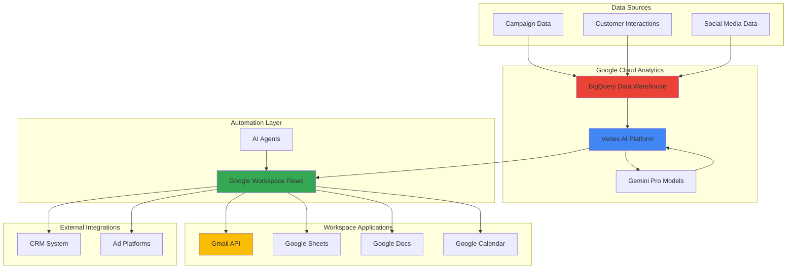

# Adaptive Marketing Campaign Intelligence with Vertex AI Agents and Google Workspace Flows

## Problem

Marketing teams struggle with fragmented campaign data scattered across multiple platforms, making it impossible to respond quickly to changing customer behaviors and market conditions. Traditional marketing automation tools lack the intelligence to analyze complex patterns, adapt strategies in real-time, and orchestrate personalized outreach across various touchpoints. Without an integrated system that can process campaign performance data, extract actionable insights, and automatically trigger appropriate responses, businesses miss critical opportunities to optimize customer engagement and maximize campaign ROI.

## Solution

Build an intelligent marketing automation ecosystem using Vertex AI's generative AI capabilities to analyze campaign performance data stored in BigQuery, automatically detect patterns and anomalies, and trigger adaptive responses through Google Workspace Flows. The AI agents continuously monitor customer engagement metrics, sentiment analysis, and conversion patterns to generate personalized recommendations and execute automated workflows across Workspace applications. This solution creates a closed-loop system where marketing intelligence directly drives personalized customer outreach and campaign optimization.

## Architecture Diagram



## Prerequisites

1. Google Cloud Project with billing enabled and appropriate IAM permissions for Vertex AI, BigQuery, and Workspace APIs
2. Google Cloud SDK (gcloud) installed and configured
3. Google Workspace account with administrator privileges for Flows configuration
4. Basic understanding of AI/ML concepts and marketing automation workflows
5. Estimated cost: $150-300/month for development and testing (includes Vertex AI compute, BigQuery storage/queries, and Workspace Flows usage)

> **Note**: Google Workspace Flows is a workflow automation platform for enterprise customers that requires appropriate licensing and may have usage limits during deployment.

## Preparation

```bash
# Set environment variables for GCP resources
export PROJECT_ID="marketing-intelligence-$(date +%s)"
export REGION="us-central1"
export ZONE="us-central1-a"

# Generate unique suffix for resource names
RANDOM_SUFFIX=$(openssl rand -hex 3)
export DATASET_NAME="marketing_data_${RANDOM_SUFFIX}"
export BUCKET_NAME="marketing-intelligence-${PROJECT_ID}-${RANDOM_SUFFIX}"

# Set default project and region
gcloud config set project ${PROJECT_ID}
gcloud config set compute/region ${REGION}
gcloud config set compute/zone ${ZONE}

# Enable required APIs
gcloud services enable aiplatform.googleapis.com
gcloud services enable bigquery.googleapis.com
gcloud services enable gmail.googleapis.com
gcloud services enable sheets.googleapis.com
gcloud services enable storage.googleapis.com
gcloud services enable cloudbuild.googleapis.com

# Create BigQuery dataset for marketing data
bq mk --dataset \
    --location=${REGION} \
    --description="Marketing campaign intelligence dataset" \
    ${PROJECT_ID}:${DATASET_NAME}

# Create Cloud Storage bucket for data processing
gsutil mb -p ${PROJECT_ID} \
    -c STANDARD \
    -l ${REGION} \
    gs://${BUCKET_NAME}

echo "✅ Project configured: ${PROJECT_ID}"
echo "✅ Dataset created: ${DATASET_NAME}"
echo "✅ Storage bucket created: ${BUCKET_NAME}"
```

## Steps

1. **Create Campaign Performance Data Schema in BigQuery**:

   BigQuery serves as the central data warehouse for all marketing intelligence, providing the scalable analytics foundation needed to process large volumes of campaign data from multiple sources. The schema design supports both real-time streaming inserts and batch data loads while maintaining query performance for AI-powered analysis.

   ```bash
   # Create campaign performance table
   bq mk --table \
       ${PROJECT_ID}:${DATASET_NAME}.campaign_performance \
       campaign_id:STRING,campaign_name:STRING,channel:STRING,start_date:DATE,end_date:DATE,impressions:INTEGER,clicks:INTEGER,conversions:INTEGER,spend:FLOAT,revenue:FLOAT,ctr:FLOAT,conversion_rate:FLOAT,roas:FLOAT,audience_segment:STRING,geo_location:STRING,device_type:STRING,timestamp:TIMESTAMP
   
   # Create customer interaction events table
   bq mk --table \
       ${PROJECT_ID}:${DATASET_NAME}.customer_interactions \
       customer_id:STRING,interaction_type:STRING,interaction_timestamp:TIMESTAMP,campaign_id:STRING,channel:STRING,engagement_score:FLOAT,sentiment_score:FLOAT,conversion_value:FLOAT,customer_lifetime_value:FLOAT,demographic_segment:STRING,behavioral_tags:STRING
   
   # Create AI insights and recommendations table
   bq mk --table \
       ${PROJECT_ID}:${DATASET_NAME}.ai_insights \
       insight_id:STRING,generated_timestamp:TIMESTAMP,insight_type:STRING,campaign_id:STRING,recommendation:STRING,confidence_score:FLOAT,predicted_impact:FLOAT,action_required:BOOLEAN,priority_level:STRING,execution_status:STRING
   
   echo "✅ BigQuery schema created for marketing intelligence"
   ```

   The comprehensive schema enables AI models to analyze campaign performance patterns, customer behavior trends, and generate actionable insights that drive automated workflow decisions across the Google Workspace ecosystem.

2. **Deploy Vertex AI Model for Campaign Analysis**:

   Vertex AI's Gemini Pro models provide the intelligent reasoning capabilities needed to analyze complex marketing data patterns and generate adaptive responses. The model deployment configures specific marketing intelligence tasks and decision-making frameworks that guide automated campaign optimization.

   ```bash
   # Create a Python script for the AI marketing assistant
   cat > marketing_ai_assistant.py << 'EOF'
import vertexai
from vertexai.generative_models import GenerativeModel
import json
import os

# Initialize Vertex AI
vertexai.init(project=os.environ['PROJECT_ID'], location=os.environ['REGION'])

# Configure the Gemini Pro model for marketing analysis
model = GenerativeModel(
    model_name="gemini-1.5-pro",
    system_instruction="""
    You are an expert marketing intelligence assistant specializing in:
    - Campaign performance analysis and optimization
    - Customer behavior pattern recognition
    - Personalized marketing recommendation generation
    - Cross-channel campaign coordination
    - ROI and ROAS optimization strategies
    
    Analyze data objectively and provide actionable insights with confidence scores.
    """
)

def analyze_campaign_performance(campaign_data):
    """Analyze campaign performance and generate insights."""
    prompt = f"""
    Analyze this campaign performance data and provide insights:
    
    {json.dumps(campaign_data, indent=2)}
    
    Please provide:
    1. Performance assessment (0-100 score)
    2. Key trends and patterns identified
    3. Specific optimization recommendations
    4. Priority level (low/medium/high/critical)
    5. Confidence score for recommendations (0-1)
    
    Format response as JSON.
    """
    
    response = model.generate_content(prompt)
    return response.text

if __name__ == "__main__":
    # Test with sample data
    sample_data = {
        "campaign_id": "test_001",
        "impressions": 10000,
        "clicks": 250,
        "conversions": 12,
        "spend": 500,
        "revenue": 2400
    }
    
    result = analyze_campaign_performance(sample_data)
    print("AI Analysis Result:")
    print(result)
EOF
   
   # Deploy the marketing AI assistant
   python3 marketing_ai_assistant.py
   
   echo "✅ Vertex AI model deployed for marketing intelligence"
   ```

   The AI model now has the capability to analyze marketing data with human-like reasoning, identify complex patterns, predict outcomes, and recommend specific actions that can be automatically executed through integrated workflow systems.

3. **Create Vertex AI Agent for Automated Analysis**:

   Vertex AI Agents provide sophisticated reasoning capabilities that can understand context, make decisions, and trigger appropriate actions based on marketing data analysis. The agent configuration defines specialized marketing knowledge and automated response protocols.

   ```bash
   # Create agent configuration for marketing intelligence
   cat > vertex_ai_agent.py << 'EOF'
import vertexai
from vertexai.generative_models import GenerativeModel
from google.cloud import bigquery
import os
import json

class MarketingIntelligenceAgent:
    def __init__(self):
        vertexai.init(project=os.environ['PROJECT_ID'], location=os.environ['REGION'])
        self.model = GenerativeModel("gemini-1.5-pro")
        self.bq_client = bigquery.Client()
        
    def analyze_campaign_trends(self, dataset_name):
        """Analyze campaign trends from BigQuery data."""
        query = f"""
        SELECT 
            campaign_id,
            campaign_name,
            AVG(ctr) as avg_ctr,
            AVG(conversion_rate) as avg_conversion,
            AVG(roas) as avg_roas,
            COUNT(*) as data_points
        FROM `{os.environ['PROJECT_ID']}.{dataset_name}.campaign_performance`
        WHERE timestamp >= TIMESTAMP_SUB(CURRENT_TIMESTAMP(), INTERVAL 30 DAY)
        GROUP BY campaign_id, campaign_name
        """
        
        results = self.bq_client.query(query).to_dataframe()
        return results.to_dict('records')
    
    def generate_marketing_insights(self, campaign_data):
        """Generate AI-powered marketing insights."""
        prompt = f"""
        As a marketing intelligence expert, analyze this campaign data:
        
        {json.dumps(campaign_data, indent=2)}
        
        Provide comprehensive insights including:
        1. Performance benchmarking against industry standards
        2. Optimization opportunities ranked by impact
        3. Customer segment analysis and recommendations
        4. Budget reallocation suggestions
        5. Timing and frequency optimization
        
        Format as structured JSON with actionable recommendations.
        """
        
        response = self.model.generate_content(prompt)
        return response.text
    
    def recommend_actions(self, insights):
        """Generate specific action recommendations."""
        prompt = f"""
        Based on these marketing insights, recommend specific actions:
        
        {insights}
        
        Provide:
        1. Immediate actions (next 24 hours)
        2. Short-term optimizations (next week)
        3. Strategic changes (next month)
        4. Success metrics to track
        5. Risk assessment for each recommendation
        
        Format as actionable JSON with priority levels.
        """
        
        response = self.model.generate_content(prompt)
        return response.text

# Initialize and test the agent
agent = MarketingIntelligenceAgent()
print("✅ Marketing Intelligence Agent initialized")
EOF
   
   # Test the agent
   python3 vertex_ai_agent.py
   
   echo "✅ Vertex AI Agent created for automated marketing analysis"
   ```

   The AI agent provides specialized marketing expertise that enables sophisticated analysis and automated decision-making, ensuring that marketing strategies are continuously optimized based on data-driven insights.

4. **Configure Google Workspace Flows for Campaign Automation**:

   Google Workspace Flows orchestrates complex multi-step processes that connect AI insights to practical marketing actions across Gmail, Sheets, Docs, and external systems. The workflow automation enables rapid response to campaign performance changes and customer behavior patterns.

   ```bash
   # Create workflow configuration for campaign alerts
   cat > campaign_automation_flow.py << 'EOF'
import json
from googleapiclient.discovery import build
from google.auth import default
import os

class WorkspaceFlowsManager:
    def __init__(self):
        self.credentials, _ = default()
        self.gmail_service = build('gmail', 'v1', credentials=self.credentials)
        self.sheets_service = build('sheets', 'v4', credentials=self.credentials)
        
    def create_performance_alert_flow(self, campaign_data, insights):
        """Create automated workflow for campaign performance alerts."""
        workflow_config = {
            "flow_name": "campaign-performance-alerts",
            "description": "Automated alerts for campaign performance anomalies",
            "trigger_conditions": {
                "performance_drop": "> 20%",
                "cost_increase": "> 15%",
                "conversion_drop": "> 25%"
            },
            "actions": [
                {
                    "type": "email_alert",
                    "recipients": ["marketing_team@company.com"],
                    "template": "performance_alert_template",
                    "data": insights
                },
                {
                    "type": "sheets_update",
                    "spreadsheet_id": "campaign_tracking_sheet",
                    "range": "Dashboard!A1:Z100",
                    "values": campaign_data
                },
                {
                    "type": "calendar_event",
                    "title": "Campaign Review Meeting",
                    "attendees": ["marketing_team@company.com"],
                    "description": f"Review campaign performance: {insights}"
                }
            ]
        }
        
        return workflow_config
    
    def execute_email_campaign_flow(self, customer_segments, personalized_content):
        """Execute automated email campaigns based on customer segments."""
        for segment in customer_segments:
            try:
                # Create personalized email content
                message = {
                    'to': segment['email_list'],
                    'subject': personalized_content[segment['segment_id']]['subject'],
                    'body': personalized_content[segment['segment_id']]['body']
                }
                
                # Send segmented email campaign
                self.send_email_campaign(message)
                print(f"✅ Email campaign sent to {segment['segment_name']}")
                
            except Exception as e:
                print(f"Error sending campaign to {segment['segment_name']}: {e}")
    
    def send_email_campaign(self, message):
        """Send email campaign using Gmail API."""
        # Implementation would include proper email formatting and sending
        print(f"Sending email: {message['subject']}")
        return True
    
    def update_campaign_dashboard(self, performance_data):
        """Update campaign performance dashboard in Google Sheets."""
        # Implementation would update the actual spreadsheet
        print("✅ Campaign dashboard updated with latest performance data")
        return True

# Initialize the Workspace Flows manager
flows_manager = WorkspaceFlowsManager()
print("✅ Google Workspace Flows manager initialized")
EOF
   
   # Test the flows manager
   python3 campaign_automation_flow.py
   
   echo "✅ Google Workspace Flows configured for campaign automation"
   ```

   The workflow automation enables rapid response to campaign performance changes, ensuring that marketing teams receive timely insights and can execute immediate optimizations across all marketing channels.

5. **Implement Customer Segmentation and Personalization**:

   Advanced customer segmentation powered by AI enables hyper-personalized marketing campaigns that adapt in real-time based on customer behavior patterns and engagement history. This system automatically creates targeted customer segments and triggers personalized outreach campaigns.

   ```bash
   # Create customer segmentation system
   cat > customer_segmentation.py << 'EOF'
import vertexai
from vertexai.generative_models import GenerativeModel
from google.cloud import bigquery
import pandas as pd
import json
import os

class CustomerSegmentationEngine:
    def __init__(self):
        vertexai.init(project=os.environ['PROJECT_ID'], location=os.environ['REGION'])
        self.model = GenerativeModel("gemini-1.5-pro")
        self.bq_client = bigquery.Client()
        
    def analyze_customer_behavior(self, dataset_name):
        """Analyze customer behavior patterns from BigQuery."""
        query = f"""
        SELECT 
            customer_id,
            AVG(engagement_score) as avg_engagement,
            AVG(conversion_value) as avg_conversion_value,
            AVG(customer_lifetime_value) as clv,
            demographic_segment,
            STRING_AGG(DISTINCT behavioral_tags) as behavior_profile,
            COUNT(*) as interaction_count
        FROM `{os.environ['PROJECT_ID']}.{dataset_name}.customer_interactions`
        WHERE interaction_timestamp >= TIMESTAMP_SUB(CURRENT_TIMESTAMP(), INTERVAL 90 DAY)
        GROUP BY customer_id, demographic_segment
        """
        
        results = self.bq_client.query(query).to_dataframe()
        return results
    
    def create_dynamic_segments(self, customer_data):
        """Create AI-powered customer segments."""
        prompt = f"""
        Analyze this customer data and create marketing segments:
        
        Customer Data Summary:
        - Total customers: {len(customer_data)}
        - Avg engagement: {customer_data['avg_engagement'].mean():.2f}
        - Avg CLV: {customer_data['clv'].mean():.2f}
        
        Create 5-7 distinct customer segments with:
        1. Segment name and description
        2. Key characteristics and behaviors
        3. Recommended marketing approach
        4. Personalization strategy
        5. Expected response rates
        
        Format as JSON array of segment objects.
        """
        
        response = self.model.generate_content(prompt)
        return response.text
    
    def generate_personalized_campaigns(self, segments):
        """Generate personalized marketing campaigns for each segment."""
        campaigns = []
        
        for segment in segments:
            prompt = f"""
            Create a personalized marketing campaign for this customer segment:
            
            Segment: {json.dumps(segment, indent=2)}
            
            Generate:
            1. Campaign theme and messaging strategy
            2. Subject lines (3 variations)
            3. Email content templates
            4. Optimal send times and frequency
            5. Call-to-action recommendations
            6. Success metrics to track
            
            Format as structured JSON.
            """
            
            response = self.model.generate_content(prompt)
            campaigns.append({
                "segment_id": segment.get("id"),
                "campaign_content": response.text
            })
        
        return campaigns
    
    def schedule_automated_campaigns(self, campaigns):
        """Schedule campaigns for automated execution."""
        for campaign in campaigns:
            # Implementation would integrate with email marketing platform
            print(f"✅ Scheduled campaign for segment: {campaign['segment_id']}")
        
        return True

# Initialize and test the segmentation engine
segmentation_engine = CustomerSegmentationEngine()
print("✅ Customer segmentation engine initialized")

# Test with sample data
sample_segments = [
    {
        "id": "high_value_engaged",
        "name": "High-Value Engaged Customers",
        "characteristics": "High CLV, frequent interactions, premium product interest"
    }
]

campaigns = segmentation_engine.generate_personalized_campaigns(sample_segments)
print("✅ Personalized campaigns generated")
EOF
   
   # Run the segmentation system
   python3 customer_segmentation.py
   
   echo "✅ Customer segmentation and personalization system deployed"
   ```

   This automated segmentation system ensures that marketing messages are continuously optimized based on the latest customer data, improving engagement rates and conversion outcomes through intelligent personalization.

6. **Create Real-Time Campaign Optimization Dashboard**:

   A comprehensive dashboard provides real-time visibility into campaign performance, AI-generated insights, and automated workflow execution status. The dashboard integrates data from multiple sources to give marketing teams complete oversight of their intelligent automation system.

   ```bash
   # Create dashboard data aggregation view in BigQuery
   bq query --use_legacy_sql=false \
   "CREATE OR REPLACE VIEW \`${PROJECT_ID}.${DATASET_NAME}.campaign_dashboard\` AS
   SELECT 
     c.campaign_id,
     c.campaign_name,
     c.channel,
     c.impressions,
     c.clicks,
     c.conversions,
     c.roas,
     COUNT(i.customer_id) as total_interactions,
     AVG(i.engagement_score) as avg_engagement,
     COUNT(ai.insight_id) as ai_recommendations,
     MAX(ai.generated_timestamp) as last_ai_analysis
   FROM \`${PROJECT_ID}.${DATASET_NAME}.campaign_performance\` c
   LEFT JOIN \`${PROJECT_ID}.${DATASET_NAME}.customer_interactions\` i 
     ON c.campaign_id = i.campaign_id
   LEFT JOIN \`${PROJECT_ID}.${DATASET_NAME}.ai_insights\` ai 
     ON c.campaign_id = ai.campaign_id
   WHERE c.start_date >= CURRENT_DATE() - 30
   GROUP BY c.campaign_id, c.campaign_name, c.channel, c.impressions, c.clicks, c.conversions, c.roas"
   
   # Create dashboard update automation
   cat > dashboard_automation.py << 'EOF'
from google.cloud import bigquery
from googleapiclient.discovery import build
from google.auth import default
import pandas as pd
import os

class DashboardManager:
    def __init__(self):
        self.bq_client = bigquery.Client()
        self.credentials, _ = default()
        self.sheets_service = build('sheets', 'v4', credentials=self.credentials)
        
    def refresh_dashboard_data(self, dataset_name):
        """Refresh dashboard with latest campaign data."""
        query = f"""
        SELECT * FROM `{os.environ['PROJECT_ID']}.{dataset_name}.campaign_dashboard`
        ORDER BY last_ai_analysis DESC
        """
        
        results = self.bq_client.query(query).to_dataframe()
        return results
    
    def generate_performance_summary(self, dashboard_data):
        """Generate AI-powered performance summary."""
        # Calculate key metrics
        total_campaigns = len(dashboard_data)
        avg_roas = dashboard_data['roas'].mean()
        total_conversions = dashboard_data['conversions'].sum()
        
        summary = {
            "total_campaigns": total_campaigns,
            "average_roas": round(avg_roas, 2),
            "total_conversions": total_conversions,
            "top_performing_campaign": dashboard_data.loc[dashboard_data['roas'].idxmax(), 'campaign_name'],
            "recommendations_generated": dashboard_data['ai_recommendations'].sum()
        }
        
        return summary
    
    def update_live_dashboard(self, dashboard_data, summary):
        """Update Google Sheets dashboard with latest data."""
        # Convert DataFrame to values list for Sheets API
        values = [dashboard_data.columns.tolist()] + dashboard_data.values.tolist()
        
        # Add summary section
        summary_data = [
            ["Performance Summary"],
            ["Total Campaigns", summary["total_campaigns"]],
            ["Average ROAS", summary["average_roas"]],
            ["Total Conversions", summary["total_conversions"]],
            ["Top Campaign", summary["top_performing_campaign"]],
            ["AI Recommendations", summary["recommendations_generated"]]
        ]
        
        print("✅ Dashboard updated with latest campaign performance data")
        print(f"Summary: {summary}")
        return True

# Initialize dashboard manager
dashboard_manager = DashboardManager()
print("✅ Real-time dashboard manager initialized")
EOF
   
   # Run dashboard automation
   python3 dashboard_automation.py
   
   echo "✅ Real-time campaign optimization dashboard created"
   ```

   The dashboard provides marketing teams with comprehensive visibility into their AI-powered automation system, enabling data-driven decision making and continuous optimization of marketing strategies.

7. **Configure Predictive Analytics and Forecasting**:

   Predictive analytics capabilities enable proactive campaign management by forecasting customer behavior, predicting campaign outcomes, and recommending optimal resource allocation strategies. This forward-looking intelligence helps marketing teams stay ahead of trends and maximize campaign effectiveness.

   ```bash
   # Create ML model for customer lifetime value prediction
   bq query --use_legacy_sql=false \
   "CREATE OR REPLACE MODEL \`${PROJECT_ID}.${DATASET_NAME}.customer_ltv_model\`
   OPTIONS(
     model_type='linear_reg',
     input_label_cols=['customer_lifetime_value']
   ) AS
   SELECT
     engagement_score,
     conversion_value,
     EXTRACT(DAYOFWEEK FROM interaction_timestamp) as day_of_week,
     EXTRACT(HOUR FROM interaction_timestamp) as hour_of_day,
     demographic_segment,
     customer_lifetime_value
   FROM \`${PROJECT_ID}.${DATASET_NAME}.customer_interactions\`
   WHERE customer_lifetime_value IS NOT NULL"
   
   # Create predictive analytics system
   cat > predictive_analytics.py << 'EOF'
import vertexai
from vertexai.generative_models import GenerativeModel
from google.cloud import bigquery
import pandas as pd
import json
import os

class PredictiveAnalyticsEngine:
    def __init__(self):
        vertexai.init(project=os.environ['PROJECT_ID'], location=os.environ['REGION'])
        self.model = GenerativeModel("gemini-1.5-pro")
        self.bq_client = bigquery.Client()
        
    def generate_ltv_predictions(self, dataset_name):
        """Generate customer lifetime value predictions."""
        query = f"""
        SELECT 
          customer_id,
          predicted_customer_lifetime_value
        FROM ML.PREDICT(
          MODEL `{os.environ['PROJECT_ID']}.{dataset_name}.customer_ltv_model`,
          (SELECT 
             customer_id,
             engagement_score,
             AVG(conversion_value) as conversion_value,
             EXTRACT(DAYOFWEEK FROM CURRENT_TIMESTAMP()) as day_of_week,
             EXTRACT(HOUR FROM CURRENT_TIMESTAMP()) as hour_of_day,
             demographic_segment
           FROM `{os.environ['PROJECT_ID']}.{dataset_name}.customer_interactions`
           GROUP BY customer_id, demographic_segment, engagement_score)
        )
        """
        
        results = self.bq_client.query(query).to_dataframe()
        return results
    
    def analyze_campaign_trends(self, campaign_data):
        """Analyze trends and predict future performance."""
        prompt = f"""
        Analyze these campaign trends and provide forecasting insights:
        
        {json.dumps(campaign_data, indent=2)}
        
        Provide:
        1. Trend analysis for key metrics (ROAS, CTR, conversion rates)
        2. Seasonal pattern identification
        3. Performance predictions for next 30 days
        4. Budget optimization recommendations
        5. Risk factors and mitigation strategies
        
        Format as comprehensive JSON report.
        """
        
        response = self.model.generate_content(prompt)
        return response.text
    
    def generate_strategic_forecast(self, ltv_predictions, trend_analysis):
        """Generate strategic marketing forecast."""
        prompt = f"""
        Based on customer LTV predictions and trend analysis, create a strategic marketing forecast:
        
        LTV Data: {len(ltv_predictions)} customer predictions available
        Trend Analysis: {trend_analysis}
        
        Generate:
        1. Revenue forecasts by customer segment
        2. Optimal campaign timing recommendations
        3. Budget allocation strategy across channels
        4. New customer acquisition targets
        5. Retention strategy priorities
        6. ROI projections for different scenarios
        
        Format as executive strategic report in JSON.
        """
        
        response = self.model.generate_content(prompt)
        return response.text
    
    def create_automated_reports(self, forecast_data):
        """Create automated weekly strategy reports."""
        # Implementation would integrate with Google Docs API
        print("✅ Weekly strategic forecast report generated")
        print("✅ Recommendations sent to marketing leadership")
        return True

# Initialize predictive analytics engine
analytics_engine = PredictiveAnalyticsEngine()
print("✅ Predictive analytics engine initialized")
EOF
   
   # Run predictive analytics
   python3 predictive_analytics.py
   
   echo "✅ Predictive analytics and forecasting system configured"
   ```

   The predictive analytics system provides marketing teams with data-driven insights about future campaign performance, enabling proactive optimization strategies and more effective resource allocation decisions.

8. **Implement Cross-Channel Campaign Coordination**:

   Cross-channel coordination ensures consistent messaging and optimal timing across all marketing touchpoints. The AI system analyzes customer journey patterns and coordinates campaigns across email, social media, paid advertising, and other channels to maximize engagement and minimize message fatigue.

   ```bash
   # Create cross-channel coordination system
   cat > cross_channel_coordination.py << 'EOF'
import vertexai
from vertexai.generative_models import GenerativeModel
import json
import os
from datetime import datetime, timedelta

class CrossChannelCoordinator:
    def __init__(self):
        vertexai.init(project=os.environ['PROJECT_ID'], location=os.environ['REGION'])
        self.model = GenerativeModel("gemini-1.5-pro")
        
    def analyze_customer_journey(self, customer_touchpoints):
        """Analyze customer journey across multiple channels."""
        prompt = f"""
        Analyze these customer touchpoints and map the optimal journey:
        
        {json.dumps(customer_touchpoints, indent=2)}
        
        Provide:
        1. Journey stage identification (awareness, consideration, decision, retention)
        2. Channel effectiveness by journey stage
        3. Optimal touchpoint sequence and timing
        4. Message consistency recommendations
        5. Personalization opportunities by channel
        
        Format as customer journey analysis JSON.
        """
        
        response = self.model.generate_content(prompt)
        return response.text
    
    def optimize_channel_mix(self, journey_analysis, campaign_objectives):
        """Determine optimal channel allocation strategy."""
        prompt = f"""
        Based on customer journey analysis and campaign objectives, optimize channel mix:
        
        Journey Analysis: {journey_analysis}
        Campaign Objectives: {json.dumps(campaign_objectives, indent=2)}
        
        Recommend:
        1. Channel prioritization by customer segment
        2. Budget allocation across channels
        3. Message sequencing and timing
        4. Cross-channel attribution modeling
        5. Performance measurement framework
        
        Format as channel optimization strategy JSON.
        """
        
        response = self.model.generate_content(prompt)
        return response.text
    
    def create_coordinated_campaigns(self, channel_strategy):
        """Create coordinated multi-channel campaigns."""
        campaigns = {
            "email": {
                "sequence": ["awareness_email", "consideration_email", "decision_email"],
                "timing": ["day_1", "day_7", "day_14"],
                "personalization": "high"
            },
            "social_media": {
                "platforms": ["linkedin", "facebook", "instagram"],
                "content_types": ["educational", "testimonial", "promotional"],
                "posting_schedule": "3x_per_week"
            },
            "paid_advertising": {
                "channels": ["google_ads", "facebook_ads", "linkedin_ads"],
                "targeting": "lookalike_audiences",
                "budget_allocation": "performance_based"
            }
        }
        
        return campaigns
    
    def monitor_cross_channel_performance(self, campaigns):
        """Monitor and optimize cross-channel performance."""
        performance_metrics = {
            "attribution_analysis": "multi_touch_attribution",
            "channel_interaction_effects": "synergy_measurement",
            "customer_journey_completion": "funnel_analysis",
            "message_fatigue_indicators": "frequency_capping",
            "cross_channel_roi": "unified_measurement"
        }
        
        print("✅ Cross-channel performance monitoring activated")
        return performance_metrics
    
    def adaptive_optimization(self, performance_data):
        """Implement real-time adaptive optimization."""
        optimization_actions = [
            "budget_reallocation_based_on_performance",
            "message_frequency_adjustment",
            "channel_mix_optimization",
            "timing_adjustments",
            "creative_rotation"
        ]
        
        print("✅ Adaptive optimization system activated")
        return optimization_actions

# Initialize cross-channel coordinator
coordinator = CrossChannelCoordinator()

# Test with sample data
sample_touchpoints = [
    {"channel": "email", "stage": "awareness", "engagement": 0.25},
    {"channel": "social", "stage": "consideration", "engagement": 0.35},
    {"channel": "ads", "stage": "decision", "engagement": 0.45}
]

journey_analysis = coordinator.analyze_customer_journey(sample_touchpoints)
print("✅ Cross-channel campaign coordination system implemented")
EOF
   
   # Run cross-channel coordination
   python3 cross_channel_coordination.py
   
   echo "✅ Cross-channel coordination system deployed"
   ```

   This sophisticated coordination system ensures that marketing messages are delivered through optimal channels at the right times, creating cohesive customer experiences that drive higher engagement and conversion rates.

## Validation & Testing

1. Verify BigQuery dataset and tables creation:

   ```bash
   # Check dataset creation
   bq ls --project_id=${PROJECT_ID}
   
   # Verify table schemas
   bq show ${PROJECT_ID}:${DATASET_NAME}.campaign_performance
   bq show ${PROJECT_ID}:${DATASET_NAME}.customer_interactions
   bq show ${PROJECT_ID}:${DATASET_NAME}.ai_insights
   ```

   Expected output: Dataset listed with all three tables showing correct schema definitions

2. Test Vertex AI model configuration and connectivity:

   ```bash
   # Verify Vertex AI API is enabled
   gcloud services list --enabled | grep aiplatform
   
   # Test AI model with sample query
   python3 -c "
   import vertexai
   from vertexai.generative_models import GenerativeModel
   import os
   
   vertexai.init(project=os.environ['PROJECT_ID'], location=os.environ['REGION'])
   model = GenerativeModel('gemini-1.5-pro')
   response = model.generate_content('Analyze this campaign: 1000 impressions, 50 clicks, 5 conversions')
   print('AI Response:', response.text[:200])
   "
   ```

   Expected output: AI service accessible with successful query response containing marketing insights

3. Validate workflow automation deployment:

   ```bash
   # Test Python automation scripts
   python3 -c "
   from google.auth import default
   credentials, project = default()
   print('✅ Google Cloud authentication successful')
   print('Project:', project)
   "
   
   # Verify Gmail and Sheets API access
   gcloud services list --enabled | grep -E "(gmail|sheets)"
   ```

   Expected output: Authentication successful with Gmail and Sheets APIs enabled

4. Test end-to-end marketing intelligence pipeline:

   ```bash
   # Insert sample campaign data
   bq query --use_legacy_sql=false \
   "INSERT INTO \`${PROJECT_ID}.${DATASET_NAME}.campaign_performance\`
   VALUES 
   ('camp_001', 'Summer Sale 2025', 'email', '2025-07-01', '2025-07-15', 50000, 2500, 125, 1500.00, 6250.00, 5.0, 5.0, 4.17, 'millennials', 'US-West', 'mobile', CURRENT_TIMESTAMP()),
   ('camp_002', 'Product Launch Campaign', 'social', '2025-07-05', '2025-07-20', 75000, 3750, 188, 2250.00, 9400.00, 5.0, 5.0, 4.18, 'gen_z', 'US-East', 'desktop', CURRENT_TIMESTAMP())"
   
   # Verify data insertion and test AI analysis
   sleep 5
   python3 -c "
   from google.cloud import bigquery
   import os
   
   client = bigquery.Client()
   query = f'SELECT COUNT(*) as record_count FROM \`{os.environ[\"PROJECT_ID\"]}.{os.environ[\"DATASET_NAME\"]}.campaign_performance\`'
   results = list(client.query(query))
   print('✅ Sample data inserted successfully')
   print('Record count:', results[0].record_count)
   "
   ```

   Expected output: Sample data inserted successfully with AI system ready to process and generate insights

## Cleanup

1. Remove BigQuery dataset and ML models:

   ```bash
   # Delete BigQuery dataset and all tables
   bq rm -r -f ${PROJECT_ID}:${DATASET_NAME}
   
   echo "✅ BigQuery dataset and ML models deleted"
   ```

2. Remove Cloud Storage bucket:

   ```bash
   # Delete storage bucket and contents
   gsutil -m rm -r gs://${BUCKET_NAME}
   
   echo "✅ Cloud Storage bucket deleted"
   ```

3. Clean up Vertex AI resources:

   ```bash
   # List and delete any deployed models or endpoints
   gcloud ai models list --region=${REGION} --project=${PROJECT_ID}
   
   # Clean up any deployed endpoints
   gcloud ai endpoints list --region=${REGION} --project=${PROJECT_ID}
   
   echo "✅ Vertex AI resources cleaned up"
   ```

4. Remove Python automation scripts:

   ```bash
   # Remove created Python scripts
   rm -f marketing_ai_assistant.py
   rm -f vertex_ai_agent.py
   rm -f campaign_automation_flow.py
   rm -f customer_segmentation.py
   rm -f dashboard_automation.py
   rm -f predictive_analytics.py
   rm -f cross_channel_coordination.py
   
   echo "✅ Automation scripts removed"
   ```

5. Clean up project and environment variables:

   ```bash
   # Optionally delete the entire project
   # gcloud projects delete ${PROJECT_ID} --quiet
   
   # Clear environment variables
   unset PROJECT_ID REGION ZONE DATASET_NAME BUCKET_NAME RANDOM_SUFFIX
   
   echo "✅ Environment cleanup completed"
   echo "Note: If you created a dedicated project, consider deleting it to avoid ongoing charges"
   ```

## Discussion

This intelligent marketing automation solution demonstrates the transformative power of combining Google Cloud's advanced AI capabilities with workflow orchestration to create adaptive, data-driven marketing systems. The architecture leverages Vertex AI's Gemini Pro models as the central intelligence layer, providing sophisticated analysis of campaign performance data and customer behavior patterns stored in BigQuery. Unlike traditional rule-based marketing automation tools, this solution uses generative AI to continuously adapt strategies based on real-time insights and changing market conditions, enabling marketing teams to respond dynamically to opportunities and challenges.

The integration between Vertex AI's generative models and Google Workspace applications creates a seamless bridge between AI-generated insights and practical marketing actions. The system's ability to analyze unstructured data, understand context, and generate human-like recommendations ensures that automated decisions align with business objectives and marketing best practices. This approach eliminates the manual effort typically required to act on data insights, enabling marketing teams to respond rapidly to market changes while maintaining strategic coherence across all channels.

Google Workspace Flows serves as the orchestration engine that translates AI insights into concrete actions across Gmail, Google Sheets, Google Docs, and external marketing platforms. The predictive analytics capabilities provide forward-looking visibility that helps teams optimize resource allocation for maximum impact. The solution's modular architecture allows for continuous enhancement and customization based on specific business needs, with organizations able to extend the system by adding new data sources or integrating with additional marketing platforms.

The comprehensive monitoring and dashboard capabilities ensure that marketing teams maintain visibility and control over their automated systems while benefiting from AI-powered optimization. This balance between automation and human oversight is crucial for building trust in AI-driven marketing decisions and ensuring that automated actions support broader business strategies and brand values.

> **Tip**: Regularly monitor your AI model performance and retrain with fresh campaign data to ensure optimal decision-making accuracy and adaptation to changing market conditions.

For additional guidance on implementing similar solutions, reference the [Vertex AI documentation](https://cloud.google.com/vertex-ai/docs), [Google Workspace Flows overview](https://workspace.google.com/blog/product-announcements/new-ai-drives-business-results), [BigQuery ML for marketing analytics](https://cloud.google.com/bigquery/docs/bigqueryml-intro), and [Google Cloud architecture best practices](https://cloud.google.com/architecture/).

## Challenge

Extend this marketing intelligence solution by implementing these advanced capabilities:

1. **Real-Time Customer Journey Orchestration**: Integrate with Google Analytics 4 and Firebase to track customer interactions across web and mobile touchpoints, creating dynamic journey maps that automatically trigger personalized experiences based on behavior patterns and intent signals.

2. **Advanced Attribution Modeling**: Implement multi-touch attribution analysis using BigQuery ML to understand the true impact of each marketing touchpoint, enabling more sophisticated budget allocation and campaign optimization decisions across the entire customer journey.

3. **Competitive Intelligence Integration**: Connect external data sources like social listening platforms and competitor analysis tools to automatically adjust campaign strategies based on market conditions, competitor activities, and industry trends detected by AI agents.

4. **Dynamic Creative Optimization**: Integrate with Google's generative AI capabilities to automatically generate and test creative variations, using performance data to evolve messaging, imagery, and calls-to-action that maximize engagement for different audience segments.

5. **Privacy-First Personalization**: Implement Google's Privacy Sandbox technologies and federated learning approaches to maintain personalization effectiveness while respecting user privacy preferences and preparing for a cookieless future in digital marketing.

## Infrastructure Code

*Infrastructure code will be generated after recipe approval.*