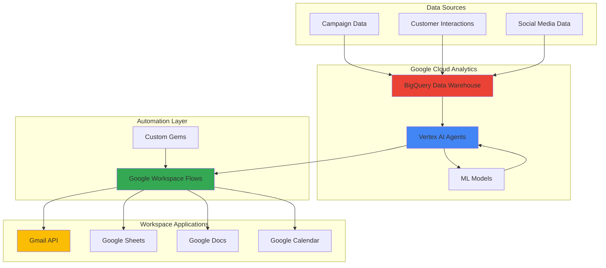

# Adaptive Marketing Campaign Intelligence with Vertex AI Agents and Google Workspace Flows

This Terraform configuration deploys a comprehensive marketing intelligence solution on Google Cloud Platform, combining Vertex AI for intelligent campaign analysis with Google Workspace Flows for automated marketing workflows.

## Overview

The solution creates an intelligent marketing automation ecosystem that:

- **Analyzes Campaign Performance**: Uses BigQuery for scalable data warehousing and analytics
- **Provides AI-Powered Insights**: Leverages Vertex AI agents to identify patterns and optimization opportunities  
- **Automates Marketing Workflows**: Integrates with Google Workspace APIs for automated responses
- **Enables Real-Time Dashboards**: Creates comprehensive views of campaign performance and AI insights
- **Supports Predictive Analytics**: Includes ML models for customer lifetime value prediction

## Architecture



## Infrastructure Components

### Data Layer
- **BigQuery Dataset**: Scalable data warehouse for marketing analytics
- **Campaign Performance Table**: Stores campaign metrics and KPIs
- **Customer Interactions Table**: Tracks customer engagement across touchpoints
- **AI Insights Table**: Stores AI-generated recommendations and actions
- **Dashboard View**: Real-time aggregated analytics view
- **ML Model**: Customer lifetime value prediction model

### Storage Layer
- **Cloud Storage Bucket**: Secure storage for data processing and model artifacts
- **Sample Data**: Pre-loaded sample datasets for testing and validation

### Compute Layer
- **Vertex AI Workbench**: Jupyter-based development environment for data science
- **Service Accounts**: Secure authentication for automated workflows

### Security Layer
- **IAM Roles**: Least-privilege access controls
- **Custom IAM Role**: Specialized permissions for marketing automation
- **Encryption**: Data encryption at rest with optional customer-managed keys

### Monitoring Layer
- **Cloud Monitoring**: System health and performance monitoring
- **Alert Policies**: Automated alerts for anomalies and failures
- **Notification Channels**: Email-based alerting system

## Prerequisites

Before deploying this infrastructure, ensure you have:

1. **Google Cloud Project**: A GCP project with billing enabled
2. **Terraform**: Version 1.5.0 or later installed
3. **Google Cloud SDK**: Latest version installed and authenticated
4. **APIs Enabled**: The following APIs will be automatically enabled:
   - Vertex AI API
   - BigQuery API
   - Cloud Storage API
   - Gmail API
   - Google Sheets API
   - Google Docs API
   - Google Calendar API
   - Cloud Monitoring API

5. **Permissions**: Your account must have the following roles:
   - `roles/editor` or equivalent resource creation permissions
   - `roles/serviceusage.serviceUsageAdmin` for enabling APIs
   - `roles/iam.roleAdmin` for creating custom IAM roles

## Quick Start

### 1. Clone and Navigate

```bash
git clone <repository-url>
cd gcp/adaptive-marketing-campaign-intelligence-vertex-ai-agents-workspace-flows/code/terraform
```

### 2. Configure Variables

```bash
# Copy the example variables file
cp terraform.tfvars.example terraform.tfvars

# Edit the variables file with your specific configuration
nano terraform.tfvars
```

Required variables to configure:
- `project_id`: Your Google Cloud project ID
- `region`: Primary region for resources
- `workbench_owners`: Email addresses for Workbench access
- `alert_email`: Email for system notifications

### 3. Initialize and Deploy

```bash
# Initialize Terraform
terraform init

# Review the planned changes
terraform plan

# Deploy the infrastructure
terraform apply
```

### 4. Verify Deployment

```bash
# Check the outputs for important resource information
terraform output

# Verify BigQuery dataset creation
bq ls --project_id=YOUR_PROJECT_ID

# Check Vertex AI Workbench instance
gcloud workbench instances list --location=YOUR_REGION
```

## Configuration Guide

### Essential Variables

| Variable | Description | Example |
|----------|-------------|---------|
| `project_id` | GCP Project ID | `marketing-intelligence-prod` |
| `region` | Primary region | `us-central1` |
| `environment` | Environment name | `production` |
| `dataset_name` | BigQuery dataset base name | `marketing_data` |
| `workbench_owners` | Workbench access emails | `["analyst@company.com"]` |

### Security Configuration

```hcl
# Enable audit logging
enable_audit_logging = true

# Disable public IP for Workbench
disable_workbench_public_ip = true

# Use customer-managed encryption
kms_key_name = "projects/my-project/locations/us-central1/keyRings/my-keyring/cryptoKeys/my-key"
```

### Cost Optimization

```hcl
# Enable cost optimization features
enable_cost_optimization = true

# Set table expiration
table_expiration_days = 365

# Configure storage lifecycle
storage_archive_after_days = 90

# Use slot commitments for predictable BigQuery costs
bigquery_slot_commitment = 500
```

### Workspace Integration

```hcl
# Configure Workspace domain
workspace_domain = "company.com"

# Enable Workspace APIs
gmail_api_enabled = true
sheets_api_enabled = true
docs_api_enabled = true
calendar_api_enabled = true

# Enable Workspace Flows (requires licensing)
enable_workspace_flows = true
```

## Data Loading

### Sample Data

The infrastructure includes sample data for immediate testing:

```bash
# Sample data is automatically uploaded to Cloud Storage
# Load sample data into BigQuery tables
bq load --source_format=CSV --skip_leading_rows=1 \
  marketing_data_SUFFIX.campaign_performance \
  gs://BUCKET_NAME/sample-data/campaign_performance_sample.csv

bq load --source_format=CSV --skip_leading_rows=1 \
  marketing_data_SUFFIX.customer_interactions \
  gs://BUCKET_NAME/sample-data/customer_interactions_sample.csv
```

### Production Data

For production use, upload your marketing data to the Cloud Storage bucket and load into BigQuery:

```bash
# Upload your data files
gsutil cp your_campaign_data.csv gs://BUCKET_NAME/data/

# Load into BigQuery with appropriate schema
bq load --source_format=CSV --skip_leading_rows=1 \
  --schema=campaign_id:STRING,campaign_name:STRING,channel:STRING... \
  DATASET.campaign_performance \
  gs://BUCKET_NAME/data/your_campaign_data.csv
```

## Using the System

### 1. Access Vertex AI Workbench

```bash
# Get the Workbench URL
terraform output workbench_instance_url

# Access the instance through the Google Cloud Console
# Navigate to Vertex AI > Workbench > User-Managed Notebooks
```

### 2. Query Campaign Data

```sql
-- Campaign performance overview
SELECT 
  campaign_name,
  channel,
  SUM(impressions) as total_impressions,
  SUM(clicks) as total_clicks,
  AVG(ctr) as avg_ctr,
  SUM(revenue) as total_revenue
FROM `PROJECT_ID.DATASET.campaign_performance`
GROUP BY campaign_name, channel
ORDER BY total_revenue DESC;
```

### 3. View AI Insights

```sql
-- Recent AI insights and recommendations
SELECT 
  insight_type,
  campaign_id,
  recommendation,
  confidence_score,
  priority_level,
  generated_timestamp
FROM `PROJECT_ID.DATASET.ai_insights`
WHERE generated_timestamp >= TIMESTAMP_SUB(CURRENT_TIMESTAMP(), INTERVAL 7 DAY)
ORDER BY generated_timestamp DESC;
```

### 4. Access Dashboard View

```sql
-- Comprehensive campaign dashboard
SELECT * FROM `PROJECT_ID.DATASET.campaign_dashboard`
WHERE data_freshness IN ('Real-time', 'Recent')
ORDER BY total_ai_insights DESC, revenue DESC;
```

## Monitoring and Alerts

### Built-in Monitoring

The infrastructure includes monitoring for:

- **BigQuery Job Failures**: Alerts when data processing jobs fail
- **Storage Access Anomalies**: Detects unusual access patterns
- **System Health**: Monitors overall infrastructure health

### Custom Alerts

Add additional monitoring as needed:

```bash
# View existing alert policies
gcloud alpha monitoring policies list

# Create custom alerts through the Google Cloud Console
# Navigate to Monitoring > Alerting > Policies
```

## Cost Management

### Estimated Costs

For development/testing environment:
- **BigQuery**: $50-150/month (depending on query volume)
- **Vertex AI Workbench**: $100-200/month (depending on machine type)
- **Cloud Storage**: $10-50/month (depending on data volume)
- **Monitoring**: $10-30/month (depending on metrics volume)

**Total Estimated**: $170-430/month

### Cost Optimization Tips

1. **Use appropriate BigQuery locations**: Multi-region for global access, regional for localized workloads
2. **Enable table expiration**: Set reasonable expiration for historical data
3. **Use storage lifecycle policies**: Automatically archive old data
4. **Right-size Workbench instances**: Use smallest sufficient machine type
5. **Monitor query costs**: Use BigQuery query cost controls

## Security Best Practices

### Access Control

1. **Use service accounts**: Never use personal accounts for automation
2. **Implement least privilege**: Grant minimum required permissions
3. **Regular access reviews**: Audit permissions quarterly
4. **Enable audit logging**: Track all access and changes

### Data Protection

1. **Enable encryption**: Use customer-managed keys when required
2. **Implement DLP**: Scan for sensitive data automatically
3. **Network security**: Use private IPs and VPC controls
4. **Backup strategies**: Regular data exports and versioning

## Troubleshooting

### Common Issues

#### API Not Enabled
```bash
# Error: API not enabled
# Solution: Enable the API manually
gcloud services enable apiname.googleapis.com --project=PROJECT_ID
```

#### Insufficient Permissions
```bash
# Error: Permission denied
# Solution: Check IAM roles
gcloud projects get-iam-policy PROJECT_ID
```

#### Workbench Access Issues
```bash
# Error: Cannot access Workbench
# Solution: Check firewall rules and IAM permissions
gcloud compute firewall-rules list
gcloud projects get-iam-policy PROJECT_ID --flatten="bindings[].members" --filter="bindings.members:YOUR_EMAIL"
```

### Debug Mode

Enable detailed logging:

```bash
# Export debug variables
export TF_LOG=DEBUG
export GOOGLE_CREDENTIALS=path/to/service-account-key.json

# Run Terraform with verbose output
terraform plan -var-file=terraform.tfvars
```

## Maintenance

### Regular Tasks

1. **Update sample data**: Refresh test datasets monthly
2. **Review costs**: Monitor spending weekly
3. **Check alerts**: Ensure monitoring is functioning
4. **Update permissions**: Review access quarterly
5. **Backup configurations**: Export Terraform state regularly

### Upgrades

```bash
# Update provider versions
terraform init -upgrade

# Check for deprecated resources
terraform plan

# Apply updates
terraform apply
```

## Cleanup

To remove all infrastructure:

```bash
# Destroy all resources
terraform destroy

# Confirm by typing 'yes' when prompted
```

**Warning**: This will permanently delete all data and configurations. Ensure you have backups if needed.

## Support and Documentation

### Additional Resources

- [Google Cloud BigQuery Documentation](https://cloud.google.com/bigquery/docs)
- [Vertex AI Documentation](https://cloud.google.com/vertex-ai/docs)
- [Google Workspace APIs](https://developers.google.com/workspace)
- [Terraform Google Provider](https://registry.terraform.io/providers/hashicorp/google/latest/docs)

### Getting Help

1. **Check the logs**: Review Terraform and GCP logs for error details
2. **Consult documentation**: Reference the official GCP documentation
3. **Community support**: Use Stack Overflow with appropriate tags
4. **Professional support**: Consider Google Cloud Support for production issues

---

**Version**: 1.0  
**Last Updated**: 2025-07-12  
**Terraform Version**: >= 1.5.0  
**Google Provider Version**: ~> 6.33