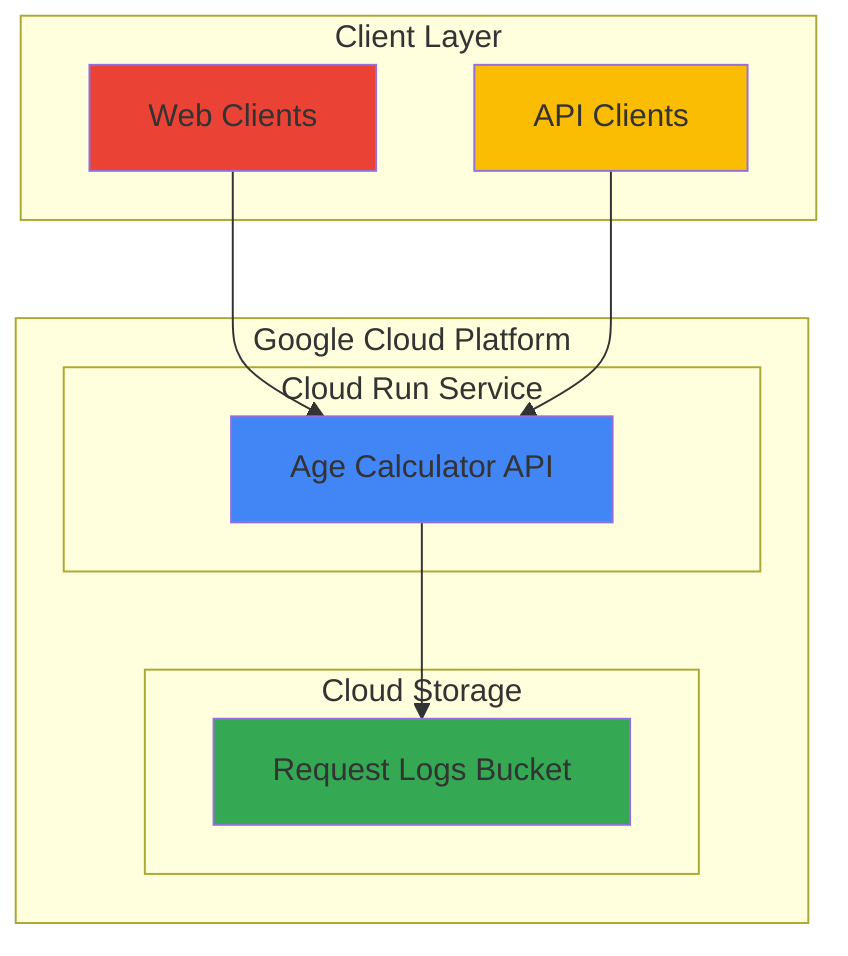

# Age Calculator API with Cloud Run and Storage

## Problem

Small development teams need to quickly build and deploy serverless APIs without managing infrastructure, but also require request logging for analytics and monitoring. Traditional server-based deployments require maintenance overhead, scaling configuration, and complex monitoring setup that diverts focus from core application development.

## Solution

Build a containerized Flask API using Cloud Run for serverless deployment with automatic scaling, combined with Cloud Storage for request logging. This approach provides zero-infrastructure management, pay-per-request pricing, and built-in HTTPS endpoints while maintaining request history for analytics.

## Architecture Diagram



## Prerequisites

1. Google Cloud account with billing enabled and appropriate permissions (Cloud Run Admin, Storage Admin)
2. Google Cloud CLI installed and configured (version 400.0.0 or later)
3. Basic knowledge of Python Flask framework and REST API concepts
4. Docker installed locally (for optional container testing)
5. Estimated cost: $0.05-$2.00 per month for minimal usage (Cloud Run free tier + Storage costs)

> **Note**: This recipe uses Google Cloud's free tier services where possible, making it cost-effective for learning and development environments.

## Preparation

```bash
# Set environment variables for GCP resources
export PROJECT_ID="age-calc-api-$(date +%s)"
export REGION="us-central1"
export SERVICE_NAME="age-calculator-api"

# Generate unique suffix for resource names
RANDOM_SUFFIX=$(openssl rand -hex 3)
export BUCKET_NAME="age-calc-logs-${RANDOM_SUFFIX}"

# Create and configure the Google Cloud project
gcloud projects create ${PROJECT_ID} \
    --name="Age Calculator API Project"

# Set project and default configurations
gcloud config set project ${PROJECT_ID}
gcloud config set compute/region ${REGION}

# Enable required APIs for Cloud Run and Storage
gcloud services enable run.googleapis.com \
    storage.googleapis.com \
    cloudbuild.googleapis.com

echo "✅ Project configured: ${PROJECT_ID}"
echo "✅ Bucket name: ${BUCKET_NAME}"
```

## Steps

1. **Create Cloud Storage Bucket for Request Logging**:

   Cloud Storage provides unified object storage with global accessibility and strong consistency guarantees. Creating a bucket with appropriate regional settings establishes the foundation for request logging that can scale to handle millions of API requests while maintaining cost efficiency through lifecycle management.

   ```bash
   # Create storage bucket for request logs
   gsutil mb -p ${PROJECT_ID} \
       -c STANDARD \
       -l ${REGION} \
       gs://${BUCKET_NAME}
   
   # Set bucket lifecycle to manage storage costs automatically
   cat > lifecycle.json << 'EOF'
   {
     "rule": [
       {
         "action": {"type": "SetStorageClass", "storageClass": "NEARLINE"},
         "condition": {"age": 30}
       },
       {
         "action": {"type": "SetStorageClass", "storageClass": "COLDLINE"},
         "condition": {"age": 90}
       }
     ]
   }
   EOF
   
   gsutil lifecycle set lifecycle.json gs://${BUCKET_NAME}
   
   echo "✅ Storage bucket created: gs://${BUCKET_NAME}"
   ```

   The storage bucket now includes automatic lifecycle management to optimize costs by transitioning logs to cheaper storage classes as they age, following Google Cloud best practices for long-term data retention.

2. **Create Flask Application with Age Calculation Logic**:

   Flask provides a lightweight and flexible framework for building REST APIs that integrate seamlessly with Google Cloud services. The age calculation logic handles date parsing, timezone considerations, and provides both exact age and additional metadata for comprehensive API responses.

   ```bash
   # Create application directory structure
   mkdir -p age-calculator-app
   cd age-calculator-app
   
   # Create main application file with improved error handling
   cat > main.py << 'EOF'
   import os
   import json
   from datetime import datetime, timezone
   from flask import Flask, request, jsonify
   from google.cloud import storage
   
   app = Flask(__name__)
   
   # Initialize Cloud Storage client with proper error handling
   try:
       storage_client = storage.Client()
       bucket_name = os.environ.get('BUCKET_NAME')
   except Exception as e:
       print(f"Storage client initialization error: {e}")
       storage_client = None
       bucket_name = None
   
   def calculate_age(birth_date_str):
       """Calculate age from birth date string with improved accuracy."""
       try:
           # Handle various ISO date formats
           birth_date = datetime.fromisoformat(birth_date_str.replace('Z', '+00:00'))
           now = datetime.now(timezone.utc)
           
           # More accurate age calculation
           age_timedelta = now - birth_date
           total_days = age_timedelta.days
           
           # Calculate years, considering leap years
           years = total_days // 365
           remaining_days = total_days % 365
           months = remaining_days // 30
           days = remaining_days % 30
           
           return {
               'age_years': years,
               'age_months': months,
               'age_days': days,
               'total_days': total_days,
               'birth_date': birth_date.isoformat(),
               'calculated_at': now.isoformat()
           }
       except ValueError as e:
           raise ValueError(f"Invalid date format: {str(e)}")
   
   def log_request(endpoint, request_data, response_data, status_code):
       """Log request details to Cloud Storage with error handling."""
       if not storage_client or not bucket_name:
           return
           
       try:
           bucket = storage_client.bucket(bucket_name)
           timestamp = datetime.now(timezone.utc).isoformat()
           log_data = {
               'timestamp': timestamp,
               'endpoint': endpoint,
               'request': request_data,
               'response': response_data,
               'status_code': status_code,
               'client_ip': request.headers.get('X-Forwarded-For', request.remote_addr)
           }
           
           # Organize logs by date for better management
           blob_name = f"requests/{datetime.now().strftime('%Y/%m/%d')}/{timestamp}.json"
           blob = bucket.blob(blob_name)
           blob.upload_from_string(json.dumps(log_data), content_type='application/json')
       except Exception as e:
           print(f"Logging error: {str(e)}")
   
   @app.route('/health', methods=['GET'])
   def health_check():
       """Health check endpoint for monitoring."""
       response = {'status': 'healthy', 'service': 'age-calculator-api'}
       log_request('/health', {}, response, 200)
       return jsonify(response)
   
   @app.route('/calculate-age', methods=['POST'])
   def calculate_age_endpoint():
       """Calculate age from provided birth date."""
       try:
           data = request.get_json()
           if not data or 'birth_date' not in data:
               error_response = {'error': 'birth_date is required in JSON body'}
               log_request('/calculate-age', data, error_response, 400)
               return jsonify(error_response), 400
           
           result = calculate_age(data['birth_date'])
           log_request('/calculate-age', data, result, 200)
           return jsonify(result)
           
       except ValueError as e:
           error_response = {'error': str(e)}
           log_request('/calculate-age', request.get_json(), error_response, 400)
           return jsonify(error_response), 400
       except Exception as e:
           error_response = {'error': 'Internal server error'}
           log_request('/calculate-age', request.get_json(), error_response, 500)
           return jsonify(error_response), 500
   
   if __name__ == '__main__':
       app.run(debug=True, host='0.0.0.0', port=int(os.environ.get('PORT', 8080)))
   EOF
   
   echo "✅ Flask application created with improved error handling and logging"
   ```

   The Flask application now includes comprehensive error handling, request logging to Cloud Storage, and follows REST API best practices with proper HTTP status codes and JSON responses.

3. **Create Application Dependencies and Configuration**:

   Python dependency management ensures reproducible deployments and proper Cloud SDK integration. The requirements file specifies current stable versions for production use while the Dockerfile optimizes for Cloud Run's containerized deployment model.

   ```bash
   # Create requirements file with updated versions
   cat > requirements.txt << 'EOF'
   Flask==3.0.0
   google-cloud-storage==2.12.0
   gunicorn==21.2.0
   EOF
   
   # Create optimized Dockerfile for Cloud Run deployment
   cat > Dockerfile << 'EOF'
   FROM python:3.11-slim
   
   # Set environment variables for Python
   ENV PYTHONUNBUFFERED=1
   ENV PYTHONDONTWRITEBYTECODE=1
   
   # Set working directory
   WORKDIR /app
   
   # Install system dependencies
   RUN apt-get update && apt-get install -y \
       build-essential \
       && rm -rf /var/lib/apt/lists/*
   
   # Copy requirements and install Python dependencies
   COPY requirements.txt .
   RUN pip install --no-cache-dir -r requirements.txt
   
   # Copy application code
   COPY . .
   
   # Create non-root user for security
   RUN useradd --create-home --shell /bin/bash app \
       && chown -R app:app /app
   USER app
   
   # Expose port 8080 (Cloud Run standard)
   EXPOSE 8080
   
   # Use gunicorn for production server
   CMD exec gunicorn --bind :$PORT --workers 1 --threads 8 --timeout 0 main:app
   EOF
   
   # Create .dockerignore for efficient builds
   cat > .dockerignore << 'EOF'
   __pycache__
   *.pyc
   *.pyo
   *.pyd
   .Python
   .git
   .gitignore
   README.md
   Dockerfile
   .dockerignore
   lifecycle.json
   EOF
   
   echo "✅ Application configuration files created with security improvements"
   ```

   The configuration now includes production-ready settings with Gunicorn WSGI server, security improvements with non-root user, and optimized Docker layers for faster builds.

4. **Deploy Application to Cloud Run**:

   Cloud Run provides serverless container deployment with automatic scaling, built-in load balancing, and integrated monitoring. The deployment process builds containers using Cloud Build, handles HTTPS certificates automatically, and provides a stable endpoint for API access.

   ```bash
   # Deploy to Cloud Run using source-based deployment
   gcloud run deploy ${SERVICE_NAME} \
       --source . \
       --platform managed \
       --region ${REGION} \
       --allow-unauthenticated \
       --set-env-vars "BUCKET_NAME=${BUCKET_NAME}" \
       --memory 512Mi \
       --cpu 1000m \
       --max-instances 10 \
       --timeout 300 \
       --concurrency 80 \
       --port 8080
   
   # Get the service URL
   SERVICE_URL=$(gcloud run services describe ${SERVICE_NAME} \
       --region ${REGION} \
       --format 'value(status.url)')
   
   echo "✅ Cloud Run service deployed successfully"
   echo "Service URL: ${SERVICE_URL}"
   
   # Store URL for testing
   export SERVICE_URL
   ```

   The Cloud Run service is now deployed with appropriate resource limits, environment variables for storage integration, and optimized concurrency settings for better performance.

5. **Configure IAM Permissions for Storage Access**:

   Identity and Access Management ensures the Cloud Run service can write to Cloud Storage while following the principle of least privilege. The service account receives only the necessary permissions for storage operations without broader project access.

   ```bash
   # Get the service account email for the Cloud Run service
   SERVICE_ACCOUNT=$(gcloud run services describe ${SERVICE_NAME} \
       --region ${REGION} \
       --format 'value(spec.template.spec.serviceAccountName)')
   
   # If no custom service account, get the default compute service account
   if [ -z "$SERVICE_ACCOUNT" ]; then
       PROJECT_NUMBER=$(gcloud projects describe ${PROJECT_ID} \
           --format='value(projectNumber)')
       SERVICE_ACCOUNT="${PROJECT_NUMBER}-compute@developer.gserviceaccount.com"
   fi
   
   # Grant storage object admin role to the service account for specific bucket
   gsutil iam ch serviceAccount:${SERVICE_ACCOUNT}:objectAdmin \
       gs://${BUCKET_NAME}
   
   echo "✅ IAM permissions configured for storage access"
   echo "Service Account: ${SERVICE_ACCOUNT}"
   ```

   The service account now has appropriate permissions to create and manage objects in the designated storage bucket while maintaining security boundaries for other project resources.

## Validation & Testing

1. **Test Health Check Endpoint**:

   ```bash
   # Test the health check endpoint
   curl -X GET "${SERVICE_URL}/health" \
        -H "Content-Type: application/json"
   ```

   Expected output:
   ```json
   {
     "service": "age-calculator-api",
     "status": "healthy"
   }
   ```

2. **Test Age Calculation with Valid Date**:

   ```bash
   # Test age calculation with a sample birth date
   curl -X POST "${SERVICE_URL}/calculate-age" \
        -H "Content-Type: application/json" \
        -d '{"birth_date": "1990-05-15T00:00:00Z"}'
   ```

   Expected output (values will vary based on current date):
   ```json
   {
     "age_days": 15,
     "age_months": 7,
     "age_years": 34,
     "birth_date": "1990-05-15T00:00:00+00:00",
     "calculated_at": "2025-07-23T10:30:45.123456+00:00",
     "total_days": 12682
   }
   ```

3. **Test Error Handling**:

   ```bash
   # Test invalid date format
   curl -X POST "${SERVICE_URL}/calculate-age" \
        -H "Content-Type: application/json" \
        -d '{"birth_date": "invalid-date"}'
   ```

   Expected output:
   ```json
   {
     "error": "Invalid date format: Invalid isoformat string: 'invalid-date'"
   }
   ```

4. **Verify Request Logging in Cloud Storage**:

   ```bash
   # Check if logs are being created in Cloud Storage
   gsutil ls -r gs://${BUCKET_NAME}/requests/
   
   # View a recent log entry
   LATEST_LOG=$(gsutil ls gs://${BUCKET_NAME}/requests/**/*.json | tail -1)
   gsutil cat ${LATEST_LOG}
   ```

## Cleanup

1. **Delete Cloud Run Service**:

   ```bash
   # Delete the Cloud Run service
   gcloud run services delete ${SERVICE_NAME} \
       --region ${REGION} \
       --quiet
   
   echo "✅ Cloud Run service deleted"
   ```

2. **Remove Cloud Storage Bucket and Contents**:

   ```bash
   # Delete all objects in the bucket
   gsutil -m rm -r gs://${BUCKET_NAME}
   
   echo "✅ Storage bucket and contents deleted"
   ```

3. **Delete Project Resources**:

   ```bash
   # Clean up local files
   cd ..
   rm -rf age-calculator-app
   rm -f lifecycle.json
   
   # Delete the entire project (optional - removes all resources)
   gcloud projects delete ${PROJECT_ID} --quiet
   
   echo "✅ Project and all resources deleted"
   echo "Note: Project deletion may take several minutes to complete"
   ```

## Discussion

This recipe demonstrates the power of Google Cloud's serverless architecture by combining Cloud Run and Cloud Storage to create a production-ready API with minimal operational overhead. Cloud Run's containerized approach provides the flexibility to use any programming language or framework while automatically handling scaling, load balancing, and SSL termination. The service scales from zero to thousands of concurrent requests based on traffic patterns, eliminating the need for capacity planning or infrastructure management.

The integration with Cloud Storage for request logging showcases how Google Cloud services work together seamlessly. The automatic lifecycle management ensures cost optimization by transitioning older logs to cheaper storage classes, following the [Google Cloud Storage best practices](https://cloud.google.com/storage/docs/best-practices) for long-term data retention. This approach enables comprehensive analytics and monitoring capabilities without requiring additional infrastructure for log management.

The Flask application follows modern API development patterns with proper error handling, structured logging, and RESTful design principles. The containerized deployment model ensures consistency across development, testing, and production environments while leveraging Cloud Run's built-in security features such as identity-aware proxy integration and automatic HTTPS certificate management. According to [Google Cloud Run documentation](https://cloud.google.com/run/docs/overview/what-is-cloud-run), services can handle up to 1,000 concurrent requests per container instance with automatic scaling.

The cost model for this architecture is particularly attractive for variable workloads, as Cloud Run charges only for actual CPU and memory usage during request processing, while Cloud Storage costs remain minimal for typical API logging scenarios. For applications with sporadic traffic patterns, this can result in significant cost savings compared to traditional server-based deployments, as outlined in the [Cloud Run pricing documentation](https://cloud.google.com/run/pricing).

> **Tip**: Monitor your API usage through Google Cloud Console's Cloud Run metrics to optimize memory and CPU allocations based on actual traffic patterns and response times.

## Challenge

Extend this solution by implementing these enhancements:

1. **Add request authentication using Google Cloud Identity and Access Management** - Implement JWT token validation or API key authentication to secure the API endpoints while maintaining the serverless benefits.

2. **Create automated analytics reporting from stored logs** - Build a Cloud Functions trigger that processes daily log files and generates usage reports, storing summaries in BigQuery for advanced analytics.

3. **Implement caching with Cloud Memorystore** - Add Redis caching for frequently calculated ages to reduce compute costs and improve response times for repeated requests.

4. **Deploy multi-region setup with Cloud Load Balancer** - Extend the architecture to multiple regions with global load balancing for improved latency and disaster recovery capabilities.

5. **Add comprehensive monitoring with Cloud Monitoring and Alerting** - Create custom metrics, dashboards, and alerts for API performance, error rates, and cost optimization opportunities.

## Infrastructure Code

*Infrastructure code will be generated after recipe approval.*