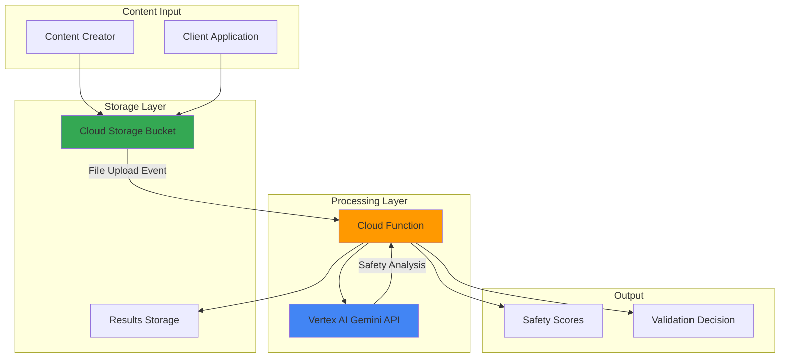

# AI Content Validation with Vertex AI and Functions

## Problem

Organizations generating AI content at scale face critical challenges ensuring output quality, safety, and appropriateness before publishing or using generated content in customer-facing applications. Manual review processes cannot keep pace with high-volume content generation, while inconsistent evaluation criteria lead to safety risks and brand reputation damage. Without automated validation systems, businesses struggle to maintain content standards while scaling AI-powered content creation workflows.

## Solution

Build an automated content validation system using Vertex AI's safety scoring capabilities and Cloud Functions for serverless evaluation processing. The solution leverages Gemini models' built-in safety filters to analyze content against multiple harm categories, provides configurable threshold-based scoring, and automatically processes validation results through Cloud Storage events. This approach ensures consistent, scalable content evaluation while maintaining cost efficiency through serverless architecture.

## Architecture Diagram



## Prerequisites

1. Google Cloud Project with billing enabled and Vertex AI, Cloud Functions, and Cloud Storage APIs
2. Google Cloud CLI installed and configured
3. Basic understanding of serverless architectures and AI safety concepts
4. Python 3.9+ development environment for local testing
5. Estimated cost: $2-5 for testing (includes function executions and storage)

> **Note**: Content validation requests consume Vertex AI API quotas based on input size and model usage.

## Preparation

```bash
# Set environment variables for GCP resources
export PROJECT_ID="content-validation-$(date +%s)"
export REGION="us-central1"
export ZONE="us-central1-a"

# Generate unique suffix for resource names
RANDOM_SUFFIX=$(openssl rand -hex 3)

# Set default project and region
gcloud config set project ${PROJECT_ID}
gcloud config set compute/region ${REGION}
gcloud config set compute/zone ${ZONE}

# Enable required APIs
gcloud services enable cloudfunctions.googleapis.com
gcloud services enable storage.googleapis.com
gcloud services enable aiplatform.googleapis.com
gcloud services enable cloudbuild.googleapis.com

# Create project if it doesn't exist (optional - requires billing setup)
# gcloud projects create ${PROJECT_ID} --name="Content Validation Project"

echo "✅ Project configured: ${PROJECT_ID}"
```

## Steps

1. **Create Cloud Storage Buckets for Content and Results**:

   Cloud Storage provides the foundation for event-driven content validation by triggering serverless functions when new content files are uploaded. Separate buckets for input content and validation results enable clean separation of concerns and facilitate automated processing workflows with proper access controls.

   ```bash
   # Create bucket for content uploads
   gsutil mb -p ${PROJECT_ID} \
       -c STANDARD \
       -l ${REGION} \
       gs://content-input-${RANDOM_SUFFIX}
   
   # Create bucket for validation results
   gsutil mb -p ${PROJECT_ID} \
       -c STANDARD \
       -l ${REGION} \
       gs://validation-results-${RANDOM_SUFFIX}
   
   # Set environment variables for bucket names
   export CONTENT_BUCKET="content-input-${RANDOM_SUFFIX}"
   export RESULTS_BUCKET="validation-results-${RANDOM_SUFFIX}"
   
   echo "✅ Storage buckets created successfully"
   ```

   The storage buckets now provide secure, scalable storage for content validation workflows with automatic event triggering capabilities.

2. **Create the Content Validation Function Code**:

   The Cloud Function integrates Vertex AI's safety scoring capabilities with configurable validation logic. This serverless approach enables automatic scaling based on content volume while implementing comprehensive safety checks across multiple harm categories including harassment, hate speech, sexually explicit content, and dangerous content.

   ```bash
   # Create function directory and code
   mkdir content-validator && cd content-validator
   
   # Create main function file
   cat > main.py << 'EOF'
   import functions_framework
   import json
   import logging
   import os
   from google.cloud import storage
   import vertexai
   from vertexai.generative_models import GenerativeModel, SafetySetting, HarmCategory, HarmBlockThreshold
   
   # Initialize logging
   logging.basicConfig(level=logging.INFO)
   logger = logging.getLogger(__name__)
   
   # Initialize Vertex AI
   PROJECT_ID = os.environ.get('GCP_PROJECT')
   REGION = os.environ.get('FUNCTION_REGION', 'us-central1')
   vertexai.init(project=PROJECT_ID, location=REGION)
   
   @functions_framework.cloud_event
   def validate_content(cloud_event):
       """Cloud Function triggered by Cloud Storage uploads for content validation."""
       
       try:
           # Extract file information from Cloud Event
           bucket_name = cloud_event.data['bucket']
           file_name = cloud_event.data['name']
           
           logger.info(f"Processing file: {file_name} from bucket: {bucket_name}")
           
           # Download content from Cloud Storage
           storage_client = storage.Client()
           bucket = storage_client.bucket(bucket_name)
           blob = bucket.blob(file_name)
           content = blob.download_as_text()
           
           # Perform content validation using Vertex AI
           validation_result = analyze_content_safety(content, file_name)
           
           # Store validation results
           results_bucket_name = os.environ.get('RESULTS_BUCKET')
           store_validation_results(validation_result, file_name, results_bucket_name)
           
           logger.info(f"Validation completed for {file_name}")
           
       except Exception as e:
           logger.error(f"Error processing {file_name}: {str(e)}")
           raise
   
   def analyze_content_safety(content, file_name):
       """Analyze content using Vertex AI Gemini safety filters."""
       
       try:
           # Configure safety settings with custom thresholds
           safety_settings = [
               SafetySetting(
                   category=HarmCategory.HARM_CATEGORY_HATE_SPEECH,
                   threshold=HarmBlockThreshold.BLOCK_MEDIUM_AND_ABOVE
               ),
               SafetySetting(
                   category=HarmCategory.HARM_CATEGORY_DANGEROUS_CONTENT,
                   threshold=HarmBlockThreshold.BLOCK_MEDIUM_AND_ABOVE
               ),
               SafetySetting(
                   category=HarmCategory.HARM_CATEGORY_SEXUALLY_EXPLICIT,
                   threshold=HarmBlockThreshold.BLOCK_MEDIUM_AND_ABOVE
               ),
               SafetySetting(
                   category=HarmCategory.HARM_CATEGORY_HARASSMENT,
                   threshold=HarmBlockThreshold.BLOCK_MEDIUM_AND_ABOVE
               )
           ]
           
           # Initialize Gemini model with safety settings
           model = GenerativeModel(
               "gemini-1.5-flash",
               safety_settings=safety_settings
           )
           
           # Analyze content for safety
           prompt = f"Analyze this content for safety and quality: {content}"
           response = model.generate_content(prompt)
           
           # Extract safety ratings and scores
           safety_ratings = response.candidates[0].safety_ratings if response.candidates else []
           
           # Build validation result
           validation_result = {
               "file_name": file_name,
               "content_length": len(content),
               "safety_analysis": {
                   "overall_safe": not any(rating.blocked for rating in safety_ratings),
                   "safety_ratings": [
                       {
                           "category": rating.category.name,
                           "probability": rating.probability.name,
                           "blocked": rating.blocked
                       }
                       for rating in safety_ratings
                   ]
               },
               "recommendation": "approved" if not any(rating.blocked for rating in safety_ratings) else "rejected",
               "generated_response": response.text if response.text else "Content blocked by safety filters"
           }
           
           return validation_result
           
       except Exception as e:
           logger.error(f"Error in safety analysis: {str(e)}")
           return {
               "file_name": file_name,
               "error": str(e),
               "recommendation": "review_required"
           }
   
   def store_validation_results(validation_result, file_name, results_bucket_name):
       """Store validation results in Cloud Storage."""
       
       if not results_bucket_name:
           logger.warning("No results bucket configured")
           return
       
       try:
           storage_client = storage.Client()
           results_bucket = storage_client.bucket(results_bucket_name)
           
           # Create results file name
           results_file_name = f"validation_results/{file_name.replace('.txt', '_results.json')}"
           
           # Upload results
           results_blob = results_bucket.blob(results_file_name)
           results_blob.upload_from_string(
               json.dumps(validation_result, indent=2),
               content_type='application/json'
           )
           
           logger.info(f"Results stored: {results_file_name}")
           
       except Exception as e:
           logger.error(f"Error storing results: {str(e)}")
   EOF
   
   echo "✅ Function code created successfully"
   ```

   The function now implements comprehensive content validation using Vertex AI's multi-layered safety analysis with configurable thresholds and structured result storage.

3. **Create Function Dependencies and Configuration**:

   Proper dependency management ensures the Cloud Function has access to all required Google Cloud libraries and maintains compatibility with the serverless runtime environment. The requirements file specifies current versions for reliable, reproducible deployments.

   ```bash
   # Create requirements.txt with dependencies
   cat > requirements.txt << 'EOF'
   functions-framework==3.*
   google-cloud-storage==2.17.0
   google-cloud-logging==3.11.0
   google-cloud-aiplatform==1.70.0
   vertexai==1.70.0
   EOF
   
   # Create deployment configuration
   cat > deploy.yaml << 'EOF'
   apiVersion: v1
   kind: ConfigMap
   metadata:
     name: content-validator-config
   data:
     memory: "512Mi"
     timeout: "60s"
     runtime: "python312"
   EOF
   
   echo "✅ Function dependencies configured"
   ```

   The configuration establishes optimal resource allocation for AI-powered content validation while maintaining cost efficiency.

4. **Deploy the Content Validation Function**:

   Cloud Functions 2nd generation provides enhanced serverless execution with automatic scaling based on content validation demand. The Storage trigger configuration enables real-time processing of uploaded content files, while environment variables maintain secure access to results storage and processing configuration.

   ```bash
   # Deploy function with Cloud Storage trigger
   gcloud functions deploy content-validator \
       --gen2 \
       --runtime python312 \
       --trigger-bucket ${CONTENT_BUCKET} \
       --source . \
       --entry-point validate_content \
       --memory 512Mi \
       --timeout 60s \
       --set-env-vars "RESULTS_BUCKET=${RESULTS_BUCKET}" \
       --region ${REGION}
   
   # Wait for deployment to complete
   sleep 30
   
   echo "✅ Content validation function deployed successfully"
   ```

   The Cloud Function is now active and automatically processes content uploads with Vertex AI safety analysis and structured result storage.

5. **Create Sample Content for Testing**:

   Testing with diverse content samples validates the system's ability to detect various safety categories and content types. Sample content includes safe text, potentially problematic content, and edge cases to verify threshold sensitivity and scoring accuracy.

   ```bash
   # Create safe content sample
   cat > safe_content.txt << 'EOF'
   Welcome to our innovative technology platform! We're excited to share 
   how our AI-powered solutions help businesses achieve their goals through 
   intelligent automation and data-driven insights. Our commitment to 
   excellence drives us to continuously improve and deliver value.
   EOF
   
   # Create content requiring review
   cat > review_content.txt << 'EOF'
   This content contains some challenging language that might trigger 
   safety filters due to its aggressive tone and potentially inflammatory 
   statements about certain groups of people.
   EOF
   
   # Create multilingual content
   cat > multilingual_content.txt << 'EOF'
   Hello! Bonjour! Hola! Our global platform supports multiple languages 
   and cultures. We celebrate diversity and inclusion in all our content 
   creation processes while maintaining safety and quality standards.
   EOF
   
   echo "✅ Test content samples created"
   ```

   The test content covers multiple validation scenarios enabling comprehensive system testing across different safety categories and content types.

## Validation & Testing

1. **Upload Test Content and Monitor Function Execution**:

   ```bash
   # Upload test content to trigger validation
   gsutil cp safe_content.txt gs://${CONTENT_BUCKET}/
   gsutil cp review_content.txt gs://${CONTENT_BUCKET}/
   gsutil cp multilingual_content.txt gs://${CONTENT_BUCKET}/
   
   # Monitor function logs
   gcloud functions logs read content-validator \
       --region ${REGION} \
       --limit 20
   ```

   Expected output: Function execution logs showing content analysis and safety scoring for each uploaded file.

2. **Verify Validation Results in Storage**:

   ```bash
   # Check validation results
   gsutil ls gs://${RESULTS_BUCKET}/validation_results/
   
   # Download and examine a results file
   gsutil cp gs://${RESULTS_BUCKET}/validation_results/safe_content_results.json ./
   cat safe_content_results.json
   ```

   Expected output: JSON results showing safety analysis, scores, and recommendations for each content file.

3. **Test Function Performance and Error Handling**:

   ```bash
   # Create problematic content to test error handling
   echo "Test content with unusual characters: ñáéíóú 测试内容" > special_chars.txt
   gsutil cp special_chars.txt gs://${CONTENT_BUCKET}/
   
   # Monitor function metrics
   gcloud functions describe content-validator \
       --region ${REGION} \
       --format="yaml(status, updateTime)"
   ```

   Expected output: Successful processing of various content types with appropriate error handling and logging.

## Cleanup

1. **Remove Cloud Storage Buckets and Contents**:

   ```bash
   # Delete all bucket contents
   gsutil -m rm -r gs://${CONTENT_BUCKET}/*
   gsutil -m rm -r gs://${RESULTS_BUCKET}/*
   
   # Remove buckets
   gsutil rb gs://${CONTENT_BUCKET}
   gsutil rb gs://${RESULTS_BUCKET}
   
   echo "✅ Storage buckets deleted"
   ```

2. **Delete Cloud Function**:

   ```bash
   # Remove the validation function
   gcloud functions delete content-validator \
       --region ${REGION} \
       --quiet
   
   echo "✅ Cloud Function deleted"
   ```

3. **Clean Up Local Files**:

   ```bash
   # Remove local test files and function code
   cd .. && rm -rf content-validator
   rm -f safe_content.txt review_content.txt multilingual_content.txt special_chars.txt
   rm -f safe_content_results.json
   
   echo "✅ Local files cleaned up"
   ```

## Discussion

This AI content validation system demonstrates the power of combining Vertex AI's advanced safety scoring with Cloud Functions' serverless scalability. The Gemini model's built-in safety filters provide sophisticated content analysis across multiple harm categories, including hate speech, harassment, sexually explicit content, and dangerous content. By configuring custom safety thresholds, organizations can fine-tune validation sensitivity to match their specific content standards and risk tolerance levels.

The serverless architecture offers significant advantages for content validation workflows. Cloud Functions automatically scale based on content volume, eliminating the need for dedicated infrastructure while ensuring consistent response times. The event-driven design enables real-time processing as content is uploaded, providing immediate feedback for content creators and automated systems. Cost optimization occurs naturally through pay-per-invocation pricing, making the solution economical for both high-volume and sporadic validation needs.

Safety scoring methodology in Vertex AI uses both probability and severity assessments for comprehensive content evaluation. The system assigns scores based on the likelihood of content being harmful and the severity of any detected harmful content. This dual-scoring approach enables nuanced decision-making beyond simple binary classifications, allowing organizations to implement graduated response systems where borderline content receives human review while clearly safe or unsafe content receives automatic processing.

Integration capabilities extend beyond basic validation to support complex content workflows. The structured JSON results enable downstream processing systems to make informed decisions about content routing, review assignments, and publishing approvals. Organizations can build comprehensive content governance systems by connecting validation results to content management platforms, notification systems, and reporting dashboards. For detailed implementation guidance, refer to the [Vertex AI Generative AI Documentation](https://cloud.google.com/vertex-ai/generative-ai/docs/), [Cloud Functions Best Practices](https://cloud.google.com/functions/docs/bestpractices), and [Responsible AI at Google Cloud](https://cloud.google.com/responsible-ai).

> **Tip**: Configure multiple safety threshold profiles for different content types and use cases to optimize validation accuracy and reduce false positives.

## Challenge

Extend this solution by implementing these enhancements:

1. **Multi-Model Validation Pipeline**: Implement parallel validation using multiple Vertex AI models (Gemini Pro, PaLM, and custom models) to achieve consensus-based scoring and improved accuracy for complex content types.

2. **Real-Time Dashboard Integration**: Build a Cloud Run service with Streamlit or Flask that provides real-time validation monitoring, safety score analytics, and content review workflows with BigQuery integration for historical trend analysis.

3. **Custom Safety Category Training**: Develop domain-specific safety categories using Vertex AI AutoML to detect industry-specific content risks such as financial misinformation, medical claims, or regulatory compliance violations.

4. **Automated Content Remediation**: Implement intelligent content suggestion systems that automatically propose edits for flagged content using Vertex AI's text generation capabilities while maintaining original intent and style.

5. **Multi-Language Safety Analysis**: Expand validation to support 50+ languages with culture-specific safety considerations, implementing Cloud Translation API integration and region-specific safety thresholds for global content operations.

## Infrastructure Code

*Infrastructure code will be generated after recipe approval.*