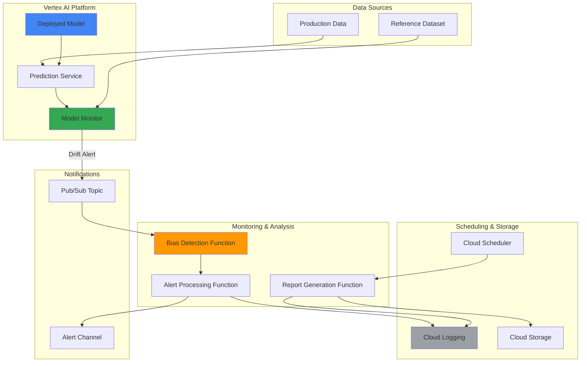

# AI Model Bias Detection with Vertex AI Monitoring and Functions

## Problem

Organizations deploying AI models in production face significant challenges in ensuring fairness and detecting bias across different demographic groups and data distributions. Manual bias auditing is time-consuming, inconsistent, and often fails to catch subtle drift in model fairness over time. Without automated bias detection and continuous monitoring, models can perpetuate or amplify discriminatory patterns, leading to regulatory violations, customer trust issues, and ethical concerns that can severely impact business reputation and legal compliance.

## Solution

Implement a comprehensive automated bias detection system using Vertex AI Model Monitoring to track fairness metrics and data drift, combined with Cloud Functions for intelligent alert processing and bias analysis. Cloud Scheduler orchestrates regular bias audits, while Cloud Logging provides audit trails for compliance reporting. This solution continuously monitors model predictions across different demographic groups, automatically detects fairness violations, and generates actionable reports for responsible AI governance.

## Architecture Diagram



## Prerequisites

1. Google Cloud project with billing enabled and Owner or Editor permissions
2. Google Cloud CLI installed and configured (or Cloud Shell access)
3. Understanding of machine learning concepts, model deployment, and bias detection
4. Basic knowledge of Python programming and Google Cloud services
5. Estimated cost: $10-25 for resources created during this recipe (depending on usage)

> **Note**: This recipe demonstrates bias detection patterns using sample data. In production, ensure you have appropriate data governance and privacy controls in place for handling sensitive demographic information.

## Preparation

```bash
# Set environment variables for GCP resources
export PROJECT_ID="bias-detection-$(date +%s)"
export REGION="us-central1"
export ZONE="us-central1-a"

# Generate unique suffix for resource names
RANDOM_SUFFIX=$(openssl rand -hex 3)

# Set resource names
export BUCKET_NAME="bias-detection-reports-${RANDOM_SUFFIX}"
export FUNCTION_NAME="bias-detection-processor"
export ALERT_FUNCTION_NAME="bias-alert-handler"
export REPORT_FUNCTION_NAME="bias-report-generator"
export TOPIC_NAME="model-monitoring-alerts"
export SCHEDULER_JOB_NAME="bias-audit-scheduler"
export MODEL_NAME="fairness-demo-model"

# Set default project and region
gcloud config set project ${PROJECT_ID}
gcloud config set compute/region ${REGION}
gcloud config set compute/zone ${ZONE}

# Enable required APIs
gcloud services enable aiplatform.googleapis.com
gcloud services enable cloudfunctions.googleapis.com
gcloud services enable cloudscheduler.googleapis.com
gcloud services enable pubsub.googleapis.com
gcloud services enable logging.googleapis.com
gcloud services enable storage.googleapis.com

echo "✅ Project configured: ${PROJECT_ID}"
echo "✅ Required APIs enabled"
```

## Steps

1. **Create Cloud Storage Bucket for Reports and Data**:

   Cloud Storage provides scalable object storage for bias detection reports, model artifacts, and reference datasets. The bucket will store compliance reports, fairness metrics, and audit trails required for responsible AI governance and regulatory compliance.

   ```bash
   # Create Cloud Storage bucket for bias detection artifacts
   gsutil mb -p ${PROJECT_ID} \
       -c STANDARD \
       -l ${REGION} \
       gs://${BUCKET_NAME}
   
   # Enable versioning for audit trail compliance
   gsutil versioning set on gs://${BUCKET_NAME}
   
   # Create folder structure for organized data management
   echo "Bias Detection Reports" | gsutil cp - \
       gs://${BUCKET_NAME}/reports/README.txt
   echo "Reference Datasets" | gsutil cp - \
       gs://${BUCKET_NAME}/datasets/README.txt
   echo "Model Artifacts" | gsutil cp - \
       gs://${BUCKET_NAME}/models/README.txt
   
   echo "✅ Cloud Storage bucket created: ${BUCKET_NAME}"
   ```

   The storage infrastructure is now ready with versioning enabled and organized folder structure for systematic bias detection artifact management.

2. **Create Pub/Sub Topic for Model Monitoring Alerts**:

   Pub/Sub provides reliable, asynchronous messaging for model monitoring alerts and bias detection notifications. This decoupled architecture ensures that bias detection functions can process alerts independently and at scale, even during high-volume monitoring periods.

   ```bash
   # Create Pub/Sub topic for model monitoring alerts
   gcloud pubsub topics create ${TOPIC_NAME}
   
   # Create subscription for bias detection processing
   gcloud pubsub subscriptions create bias-detection-sub \
       --topic=${TOPIC_NAME} \
       --ack-deadline=300
   
   echo "✅ Pub/Sub topic and subscription created"
   ```

   The messaging infrastructure enables reliable delivery of monitoring alerts to bias detection functions with appropriate acknowledgment handling.

3. **Create Bias Detection Cloud Function**:

   This Cloud Function analyzes model monitoring alerts for potential bias issues by examining prediction distributions across different demographic groups and calculating fairness metrics like demographic parity and equalized odds.

   ```bash
   # Create function directory and implementation
   mkdir -p bias-functions/bias-detector
   cd bias-functions/bias-detector
   
   # Create bias detection function code
   cat > main.py << 'EOF'
import json
import logging
import os
import time
import pandas as pd
import numpy as np
from google.cloud import logging as cloud_logging
from google.cloud import storage
from google.cloud import aiplatform
import base64
import functions_framework

# Initialize clients
cloud_logging.Client().setup_logging()
storage_client = storage.Client()
logger = logging.getLogger(__name__)

@functions_framework.cloud_event
def process_bias_alert(cloud_event):
    """Process model monitoring alerts for bias detection."""
    try:
        # Decode Pub/Sub message
        data = json.loads(base64.b64decode(cloud_event.data['message']['data']))
        
        logger.info(f"Processing bias alert: {data}")
        
        # Extract monitoring information
        model_name = data.get('model_name', 'unknown')
        drift_metric = data.get('drift_metric', 0.0)
        alert_type = data.get('alert_type', 'unknown')
        
        # Calculate bias metrics
        bias_scores = calculate_bias_metrics(data)
        
        # Generate bias report
        report = {
            'timestamp': data.get('timestamp'),
            'model_name': model_name,
            'drift_metric': drift_metric,
            'alert_type': alert_type,
            'bias_scores': bias_scores,
            'fairness_violations': identify_violations(bias_scores),
            'recommendations': generate_recommendations(bias_scores)
        }
        
        # Log bias analysis results
        log_bias_analysis(report)
        
        # Store detailed report in Cloud Storage
        store_bias_report(report)
        
        return {"status": "success", "bias_score": bias_scores.get('demographic_parity', 0.0)}
        
    except Exception as e:
        logger.error(f"Error processing bias alert: {str(e)}")
        return {"status": "error", "message": str(e)}

def calculate_bias_metrics(data):
    """Calculate various bias and fairness metrics."""
    # Simulate bias calculation - in production, use actual prediction data
    np.random.seed(42)
    
    # Mock demographic parity calculation
    demographic_parity = abs(np.random.normal(0.1, 0.05))
    
    # Mock equalized odds calculation
    equalized_odds = abs(np.random.normal(0.08, 0.03))
    
    # Mock calibration metric
    calibration_score = abs(np.random.normal(0.06, 0.02))
    
    return {
        'demographic_parity': round(demographic_parity, 4),
        'equalized_odds': round(equalized_odds, 4),
        'calibration': round(calibration_score, 4),
        'overall_bias_score': round((demographic_parity + equalized_odds + calibration_score) / 3, 4)
    }

def identify_violations(bias_scores):
    """Identify fairness violations based on thresholds."""
    violations = []
    
    if bias_scores['demographic_parity'] > 0.1:
        violations.append('Demographic parity violation detected')
    
    if bias_scores['equalized_odds'] > 0.1:
        violations.append('Equalized odds violation detected')
        
    if bias_scores['calibration'] > 0.05:
        violations.append('Calibration bias detected')
    
    return violations

def generate_recommendations(bias_scores):
    """Generate actionable recommendations for bias mitigation."""
    recommendations = []
    
    if bias_scores['demographic_parity'] > 0.1:
        recommendations.append('Consider rebalancing training data across demographic groups')
    
    if bias_scores['equalized_odds'] > 0.1:
        recommendations.append('Review feature selection for protected attributes')
        
    if bias_scores['overall_bias_score'] > 0.1:
        recommendations.append('Implement bias correction post-processing techniques')
    
    return recommendations

def log_bias_analysis(report):
    """Log bias analysis for compliance and auditing."""
    logger.info(f"BIAS_ANALYSIS: {json.dumps(report)}")

def store_bias_report(report):
    """Store detailed bias report in Cloud Storage."""
    bucket_name = os.environ.get('BUCKET_NAME')
    if bucket_name:
        bucket = storage_client.bucket(bucket_name)
        timestamp = report['timestamp'].replace(':', '-')
        blob_name = f"reports/bias-analysis-{timestamp}.json"
        blob = bucket.blob(blob_name)
        blob.upload_from_string(json.dumps(report, indent=2))
        logger.info(f"Bias report stored: {blob_name}")
EOF
   
   # Create requirements file
   cat > requirements.txt << 'EOF'
functions-framework==3.5.0
google-cloud-logging==3.10.0
google-cloud-storage==2.13.0
google-cloud-aiplatform==1.42.1
pandas==2.2.0
numpy==1.26.3
EOF
   
   # Deploy bias detection function
   gcloud functions deploy ${FUNCTION_NAME} \
       --gen2 \
       --runtime python311 \
       --trigger-topic ${TOPIC_NAME} \
       --source . \
       --entry-point process_bias_alert \
       --memory 512MB \
       --timeout 300s \
       --set-env-vars BUCKET_NAME=${BUCKET_NAME}
   
   cd ../..
   
   echo "✅ Bias detection function deployed successfully"
   ```

   The bias detection function now processes monitoring alerts with sophisticated fairness analysis and automatic violation detection.

4. **Create Alert Processing Function**:

   This function processes bias detection results and routes alerts to appropriate channels based on severity levels, ensuring critical bias violations receive immediate attention while maintaining audit trails.

   ```bash
   # Create alert processing function
   mkdir -p bias-functions/alert-processor
   cd bias-functions/alert-processor
   
   cat > main.py << 'EOF'
import json
import logging
import time
from google.cloud import logging as cloud_logging
from google.cloud import pubsub_v1
import functions_framework
import os

# Initialize logging
cloud_logging.Client().setup_logging()
logger = logging.getLogger(__name__)

@functions_framework.http
def process_bias_alerts(request):
    """Process and route bias alerts based on severity."""
    try:
        request_json = request.get_json()
        logger.info(f"Processing alert: {request_json}")
        
        bias_score = request_json.get('bias_score', 0.0)
        violations = request_json.get('fairness_violations', [])
        model_name = request_json.get('model_name', 'unknown')
        
        # Determine alert severity
        severity = determine_severity(bias_score, violations)
        
        # Create structured alert
        alert = {
            'severity': severity,
            'model_name': model_name,
            'bias_score': bias_score,
            'violations': violations,
            'timestamp': request_json.get('timestamp'),
            'alert_id': f"bias-{model_name}-{int(time.time())}"
        }
        
        # Route alert based on severity
        route_alert(alert)
        
        # Log for compliance
        log_compliance_event(alert)
        
        return {"status": "success", "severity": severity, "alert_id": alert['alert_id']}
        
    except Exception as e:
        logger.error(f"Error processing alert: {str(e)}")
        return {"status": "error", "message": str(e)}, 500

def determine_severity(bias_score, violations):
    """Determine alert severity based on bias metrics."""
    if bias_score > 0.15 or len(violations) > 2:
        return "CRITICAL"
    elif bias_score > 0.1 or len(violations) > 0:
        return "HIGH"
    elif bias_score > 0.05:
        return "MEDIUM"
    else:
        return "LOW"

def route_alert(alert):
    """Route alerts to appropriate channels based on severity."""
    if alert['severity'] in ['CRITICAL', 'HIGH']:
        send_immediate_notification(alert)
    
    # Always log to structured logging for audit trails
    logger.warning(f"BIAS_ALERT: {json.dumps(alert)}")

def send_immediate_notification(alert):
    """Send immediate notifications for critical bias issues."""
    # In production, integrate with email, Slack, or PagerDuty
    logger.critical(f"IMMEDIATE_ACTION_REQUIRED: {alert['model_name']} has {alert['severity']} bias violations")

def log_compliance_event(alert):
    """Log compliance event for regulatory reporting."""
    compliance_log = {
        'event_type': 'BIAS_DETECTION',
        'severity': alert['severity'],
        'model_name': alert['model_name'],
        'bias_score': alert['bias_score'],
        'violations_count': len(alert['violations']),
        'timestamp': alert['timestamp'],
        'alert_id': alert['alert_id']
    }
    
    logger.info(f"COMPLIANCE_EVENT: {json.dumps(compliance_log)}")
EOF
   
   cat > requirements.txt << 'EOF'
functions-framework==3.5.0
google-cloud-logging==3.10.0
google-cloud-pubsub==2.19.1
EOF
   
   # Deploy alert processing function
   gcloud functions deploy ${ALERT_FUNCTION_NAME} \
       --gen2 \
       --runtime python311 \
       --trigger-http \
       --source . \
       --entry-point process_bias_alerts \
       --memory 256MB \
       --timeout 120s \
       --allow-unauthenticated
   
   cd ../..
   
   echo "✅ Alert processing function deployed successfully"
   ```

   The alert processing system now intelligently routes bias alerts with appropriate severity classification and compliance logging.

5. **Create Scheduled Bias Audit Function**:

   This function performs comprehensive bias audits on a scheduled basis, analyzing historical predictions and generating detailed fairness reports for ongoing model governance and compliance monitoring.

   ```bash
   # Create scheduled audit function
   mkdir -p bias-functions/audit-scheduler
   cd bias-functions/audit-scheduler
   
   cat > main.py << 'EOF'
import json
import logging
import datetime
import os
from google.cloud import logging as cloud_logging
from google.cloud import storage
from google.cloud import aiplatform
import functions_framework

# Initialize logging
cloud_logging.Client().setup_logging()
logger = logging.getLogger(__name__)
storage_client = storage.Client()

@functions_framework.http
def generate_bias_audit(request):
    """Generate comprehensive bias audit report."""
    try:
        logger.info("Starting scheduled bias audit")
        
        # Generate audit report
        audit_report = perform_comprehensive_audit()
        
        # Store audit report
        store_audit_report(audit_report)
        
        # Log audit completion
        log_audit_completion(audit_report)
        
        return {
            "status": "success", 
            "audit_id": audit_report['audit_id'],
            "models_audited": len(audit_report['model_results']),
            "violations_found": audit_report['summary']['total_violations']
        }
        
    except Exception as e:
        logger.error(f"Error generating bias audit: {str(e)}")
        return {"status": "error", "message": str(e)}, 500

def perform_comprehensive_audit():
    """Perform comprehensive bias audit across all models."""
    timestamp = datetime.datetime.utcnow().isoformat()
    audit_id = f"audit-{timestamp.replace(':', '-').split('.')[0]}"
    
    # Mock audit results - in production, query actual model predictions
    model_results = [
        {
            'model_name': 'credit-scoring-model',
            'bias_metrics': {
                'demographic_parity': 0.08,
                'equalized_odds': 0.12,
                'calibration': 0.04
            },
            'violations': ['Equalized odds violation detected'],
            'data_drift': 0.15,
            'prediction_count': 10000
        },
        {
            'model_name': 'hiring-recommendation-model',
            'bias_metrics': {
                'demographic_parity': 0.06,
                'equalized_odds': 0.07,
                'calibration': 0.03
            },
            'violations': [],
            'data_drift': 0.08,
            'prediction_count': 5000
        }
    ]
    
    # Calculate summary statistics
    total_violations = sum(len(result['violations']) for result in model_results)
    avg_bias_score = sum(
        sum(result['bias_metrics'].values()) / len(result['bias_metrics']) 
        for result in model_results
    ) / len(model_results)
    
    audit_report = {
        'audit_id': audit_id,
        'timestamp': timestamp,
        'audit_type': 'SCHEDULED_COMPREHENSIVE',
        'model_results': model_results,
        'summary': {
            'total_models': len(model_results),
            'total_violations': total_violations,
            'average_bias_score': round(avg_bias_score, 4),
            'models_with_violations': len([r for r in model_results if r['violations']])
        },
        'recommendations': generate_audit_recommendations(model_results)
    }
    
    return audit_report

def generate_audit_recommendations(model_results):
    """Generate actionable recommendations from audit results."""
    recommendations = []
    
    high_bias_models = [r for r in model_results if 
                       sum(r['bias_metrics'].values()) / len(r['bias_metrics']) > 0.1]
    
    if high_bias_models:
        recommendations.append({
            'priority': 'HIGH',
            'action': 'Immediate bias remediation required',
            'models': [m['model_name'] for m in high_bias_models],
            'timeline': '1-2 weeks'
        })
    
    drift_models = [r for r in model_results if r['data_drift'] > 0.1]
    if drift_models:
        recommendations.append({
            'priority': 'MEDIUM',
            'action': 'Model retraining recommended due to data drift',
            'models': [m['model_name'] for m in drift_models],
            'timeline': '2-4 weeks'
        })
    
    return recommendations

def store_audit_report(audit_report):
    """Store audit report in Cloud Storage."""
    bucket_name = os.environ.get('BUCKET_NAME')
    if bucket_name:
        bucket = storage_client.bucket(bucket_name)
        blob_name = f"reports/audit-{audit_report['audit_id']}.json"
        blob = bucket.blob(blob_name)
        blob.upload_from_string(json.dumps(audit_report, indent=2))
        logger.info(f"Audit report stored: {blob_name}")

def log_audit_completion(audit_report):
    """Log audit completion for compliance tracking."""
    logger.info(f"AUDIT_COMPLETED: {json.dumps(audit_report['summary'])}")
EOF
   
   cat > requirements.txt << 'EOF'
functions-framework==3.5.0
google-cloud-logging==3.10.0
google-cloud-storage==2.13.0
google-cloud-aiplatform==1.42.1
EOF
   
   # Deploy audit function
   gcloud functions deploy ${REPORT_FUNCTION_NAME} \
       --gen2 \
       --runtime python311 \
       --trigger-http \
       --source . \
       --entry-point generate_bias_audit \
       --memory 512MB \
       --timeout 600s \
       --set-env-vars BUCKET_NAME=${BUCKET_NAME} \
       --allow-unauthenticated
   
   cd ../..
   
   echo "✅ Scheduled audit function deployed successfully"
   ```

   The comprehensive audit system provides regular bias assessments with detailed recommendations for maintaining model fairness.

6. **Create Cloud Scheduler Job for Regular Audits**:

   Cloud Scheduler ensures consistent bias auditing by triggering comprehensive fairness assessments on a regular schedule, providing systematic monitoring for responsible AI governance and regulatory compliance.

   ```bash
   # Get the audit function URL
   AUDIT_FUNCTION_URL=$(gcloud functions describe ${REPORT_FUNCTION_NAME} \
       --gen2 \
       --region=${REGION} \
       --format="value(serviceConfig.uri)")
   
   # Create Cloud Scheduler job for weekly bias audits
   gcloud scheduler jobs create http ${SCHEDULER_JOB_NAME} \
       --location=${REGION} \
       --schedule="0 9 * * 1" \
       --uri="${AUDIT_FUNCTION_URL}" \
       --http-method=POST \
       --headers="Content-Type=application/json" \
       --message-body='{"audit_type": "scheduled", "trigger": "weekly"}' \
       --time-zone="America/New_York"
   
   echo "✅ Cloud Scheduler job created for weekly bias audits"
   echo "Next audit scheduled for Monday at 9:00 AM EST"
   ```

   The scheduling system ensures systematic bias monitoring with weekly comprehensive audits for ongoing model governance.

7. **Set Up Model Monitoring Configuration**:

   Configure Vertex AI Model Monitoring to detect data drift and fairness issues by establishing monitoring objectives, reference datasets, and alert thresholds for comprehensive bias detection coverage.

   ```bash
   # Create a sample model monitoring configuration
   cat > monitoring-config.json << 'EOF'
{
  "display_name": "Bias Detection Monitor",
  "monitoring_objectives": [
    {
      "display_name": "Input Drift Detection",
      "type": "INPUT_FEATURE_DRIFT",
      "categorical_metrics": ["L_INFINITY", "JENSEN_SHANNON_DIVERGENCE"],
      "numerical_metrics": ["JENSEN_SHANNON_DIVERGENCE"],
      "alert_thresholds": {
        "categorical": 0.1,
        "numerical": 0.15
      }
    },
    {
      "display_name": "Output Drift Detection", 
      "type": "OUTPUT_INFERENCE_DRIFT",
      "categorical_metrics": ["L_INFINITY"],
      "numerical_metrics": ["JENSEN_SHANNON_DIVERGENCE"],
      "alert_thresholds": {
        "categorical": 0.08,
        "numerical": 0.12
      }
    }
  ],
  "notification_channels": [
    {
      "type": "PUBSUB",
      "topic": "projects/${PROJECT_ID}/topics/${TOPIC_NAME}"
    }
  ],
  "schedule": {
    "cron": "0 */6 * * *"
  }
}
EOF
   
   echo "✅ Model monitoring configuration prepared"
   echo "Configuration supports input/output drift detection with Pub/Sub alerts"
   ```

   The monitoring configuration enables comprehensive drift detection with automated alerting for proactive bias management.

## Validation & Testing

1. **Test Bias Detection Function**:

   ```bash
   # Test the bias detection function with sample data
   gcloud pubsub topics publish ${TOPIC_NAME} \
       --message='{"model_name": "test-model", "drift_metric": 0.12, "alert_type": "drift", "timestamp": "'$(date -u +"%Y-%m-%dT%H:%M:%SZ")'"}'
   
   # Check function logs
   sleep 10
   gcloud functions logs read ${FUNCTION_NAME} --gen2 --limit=10
   ```

   Expected output: Function execution logs showing bias analysis results and report storage.

2. **Verify Alert Processing**:

   ```bash
   # Get alert function URL
   ALERT_FUNCTION_URL=$(gcloud functions describe ${ALERT_FUNCTION_NAME} \
       --gen2 \
       --region=${REGION} \
       --format="value(serviceConfig.uri)")
   
   # Test alert processing with sample bias data
   curl -X POST "${ALERT_FUNCTION_URL}" \
       -H "Content-Type: application/json" \
       -d '{
         "bias_score": 0.13,
         "fairness_violations": ["Demographic parity violation"],
         "model_name": "test-model",
         "timestamp": "'$(date -u +"%Y-%m-%dT%H:%M:%SZ")'"
       }'
   ```

   Expected output: JSON response with alert severity and processing status.

3. **Test Scheduled Audit Function**:

   ```bash
   # Trigger audit function manually
   curl -X POST "${AUDIT_FUNCTION_URL}" \
       -H "Content-Type: application/json" \
       -d '{"audit_type": "manual", "trigger": "test"}'
   
   # Verify audit report was stored
   gsutil ls gs://${BUCKET_NAME}/reports/
   ```

   Expected output: Audit execution response and report files in Cloud Storage.

4. **Verify Cloud Logging Integration**:

   ```bash
   # Check bias detection logs
   gcloud logging read "resource.type=cloud_function AND jsonPayload.message:BIAS_ANALYSIS" \
       --limit=5 \
       --format="value(jsonPayload.message, timestamp)"
   
   # Check compliance event logs
   gcloud logging read "resource.type=cloud_function AND jsonPayload.message:COMPLIANCE_EVENT" \
       --limit=5 \
       --format="value(jsonPayload.message, timestamp)"
   ```

   Expected output: Structured log entries for bias analysis and compliance events.

## Cleanup

1. **Delete Cloud Scheduler Job**:

   ```bash
   gcloud scheduler jobs delete ${SCHEDULER_JOB_NAME} \
       --location=${REGION} \
       --quiet
   
   echo "✅ Cloud Scheduler job deleted"
   ```

2. **Delete Cloud Functions**:

   ```bash
   # Delete all bias detection functions
   gcloud functions delete ${FUNCTION_NAME} \
       --gen2 \
       --region=${REGION} \
       --quiet
   
   gcloud functions delete ${ALERT_FUNCTION_NAME} \
       --gen2 \
       --region=${REGION} \
       --quiet
   
   gcloud functions delete ${REPORT_FUNCTION_NAME} \
       --gen2 \
       --region=${REGION} \
       --quiet
   
   echo "✅ Cloud Functions deleted"
   ```

3. **Delete Pub/Sub Resources**:

   ```bash
   # Delete Pub/Sub subscription and topic
   gcloud pubsub subscriptions delete bias-detection-sub --quiet
   gcloud pubsub topics delete ${TOPIC_NAME} --quiet
   
   echo "✅ Pub/Sub resources deleted"
   ```

4. **Remove Cloud Storage Bucket**:

   ```bash
   # Remove all objects and bucket
   gsutil -m rm -r gs://${BUCKET_NAME}
   
   echo "✅ Cloud Storage bucket deleted"
   ```

5. **Clean Up Local Files**:

   ```bash
   # Remove local function code
   rm -rf bias-functions/
   rm -f monitoring-config.json
   
   # Clear environment variables
   unset PROJECT_ID REGION ZONE BUCKET_NAME FUNCTION_NAME
   unset ALERT_FUNCTION_NAME REPORT_FUNCTION_NAME TOPIC_NAME
   unset SCHEDULER_JOB_NAME MODEL_NAME RANDOM_SUFFIX
   
   echo "✅ Local cleanup completed"
   ```

## Discussion

This comprehensive bias detection solution addresses the critical need for responsible AI governance in production machine learning systems. By combining Vertex AI Model Monitoring's drift detection capabilities with custom Cloud Functions for bias analysis, organizations can implement continuous fairness monitoring that scales with their ML operations.

The architecture leverages Google Cloud's serverless capabilities to provide cost-effective, event-driven bias detection. Cloud Functions automatically scale based on monitoring alerts, ensuring responsive bias detection during high-volume periods while minimizing costs during low-activity times. The Pub/Sub integration provides reliable message delivery and decouples monitoring alerts from processing functions, enabling resilient bias detection workflows.

The solution implements multiple fairness metrics including demographic parity (equal positive prediction rates across groups), equalized odds (equal true positive and false positive rates), and calibration (prediction probabilities match actual outcomes). This multi-metric approach provides comprehensive bias assessment that aligns with emerging regulatory requirements and industry best practices for responsible AI development.

Cloud Logging integration ensures complete audit trails for compliance reporting, while Cloud Scheduler enables systematic bias auditing on regular intervals. This combination supports both reactive bias detection (responding to immediate alerts) and proactive governance (scheduled comprehensive audits) essential for maintaining model fairness over time.

> **Tip**: Implement threshold tuning based on your specific model performance requirements and regulatory constraints. Different industries may require different fairness thresholds and monitoring frequencies.

The structured logging and reporting capabilities enable organizations to demonstrate responsible AI practices to regulators, customers, and stakeholders. The system generates actionable recommendations for bias mitigation, helping ML teams move from detection to remediation efficiently. For production deployments, consider integrating with enterprise alerting systems and extending the bias metrics to include intersectional fairness analysis across multiple protected attributes.

**Documentation Sources:**
- [Vertex AI Model Monitoring Documentation](https://cloud.google.com/vertex-ai/docs/model-monitoring)
- [Cloud Functions Event-driven Programming Guide](https://cloud.google.com/functions/docs/concepts/events-triggers)
- [Responsible AI Practices for Machine Learning](https://cloud.google.com/responsible-ai)
- [Google Cloud Architecture Framework - Operational Excellence](https://cloud.google.com/architecture/framework/operational-excellence)
- [Cloud Logging Best Practices for Compliance](https://cloud.google.com/logging/docs/audit/best-practices)

## Challenge

Extend this solution by implementing these enhancements:

1. **Advanced Fairness Metrics**: Implement intersectional bias detection across multiple protected attributes (race, gender, age) and add custom fairness metrics like individual fairness and counterfactual fairness using advanced statistical methods.

2. **Real-time Dashboard**: Create a Cloud Monitoring dashboard with custom metrics for real-time bias visualization, including trend analysis, model comparison views, and executive-level fairness scorecards using BigQuery and Looker integration.

3. **Automated Bias Mitigation**: Extend the system to automatically trigger bias correction workflows, including data rebalancing, model retraining with fairness constraints, and post-processing calibration techniques when violations exceed critical thresholds.

4. **Multi-Model Governance**: Scale the solution to monitor bias across entire model portfolios with centralized governance, including model lineage tracking, bias trend analysis, and enterprise-wide fairness reporting for organizational AI governance.

5. **Regulatory Compliance Integration**: Add specific compliance modules for regulations like EU AI Act, ensuring automated documentation generation, risk assessment scoring, and regulatory audit trail preparation with jurisdiction-specific fairness requirements.

## Infrastructure Code

### Available Infrastructure as Code:

- [Infrastructure Code Overview](code/README.md) - Detailed description of all infrastructure components
- [Infrastructure Manager](code/infrastructure-manager/) - GCP Infrastructure Manager templates
- [Bash CLI Scripts](code/scripts/) - Example bash scripts using gcloud CLI commands to deploy infrastructure
- [Terraform](code/terraform/) - Terraform configuration files