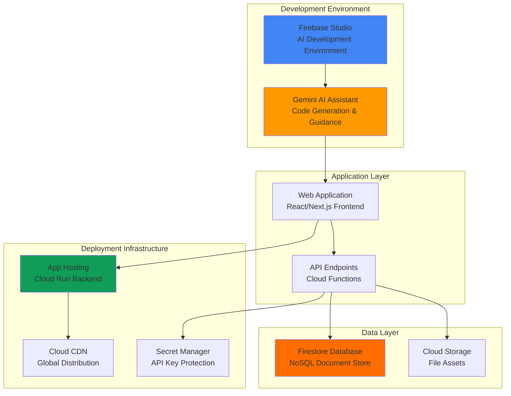

# AI-Powered App Development with Firebase Studio and Gemini

## Problem

Modern application development often requires extensive setup time, backend configuration, and manual code generation that slows down prototyping and time-to-market. Development teams spend weeks setting up environments, configuring databases, and writing boilerplate code instead of focusing on core business logic and user experience. Traditional development workflows lack intelligent assistance for rapid iteration and automated backend provisioning, creating barriers for developers who need to ship AI-powered applications quickly.

## Solution

Firebase Studio provides an AI-powered, browser-based development environment that leverages Gemini's intelligence to accelerate full-stack application development. This cloud-native solution enables rapid prototyping, automated backend provisioning with Firestore, and seamless deployment through App Hosting, reducing development time from weeks to hours while maintaining production-ready architecture patterns and AI-first development workflows.

## Architecture Diagram



## Prerequisites

1. Google Cloud account with billing enabled and Firebase access
2. GitHub account for App Hosting repository integration
3. Modern web browser (Chrome, Firefox, Safari, or Edge)
4. Basic knowledge of JavaScript and web development concepts
5. Understanding of NoSQL database concepts and Git workflows
6. Estimated cost: $2-5 for Firebase services during development (mostly free tier usage)

> **Note**: Firebase Studio provides a generous free tier for development and prototyping activities, with App Hosting supporting continuous deployment from GitHub repositories.

## Preparation

```bash
# Set environment variables for the project
export PROJECT_ID="ai-app-studio-$(date +%s)"
export REGION="us-central1"

# Generate unique suffix for resource names
RANDOM_SUFFIX=$(openssl rand -hex 3)
export APP_NAME="ai-task-manager-${RANDOM_SUFFIX}"

# Create new Firebase project
gcloud projects create ${PROJECT_ID} \
    --name="AI-Powered Task Manager"

# Set default project configuration
gcloud config set project ${PROJECT_ID}
gcloud config set compute/region ${REGION}

# Enable required Firebase and Google Cloud APIs
gcloud services enable firebase.googleapis.com
gcloud services enable firestore.googleapis.com
gcloud services enable cloudbuild.googleapis.com
gcloud services enable run.googleapis.com
gcloud services enable secretmanager.googleapis.com

echo "✅ Project configured: ${PROJECT_ID}"
echo "✅ App name: ${APP_NAME}"
```

## Steps

1. **Create Firebase Project and Initialize Studio Environment**:

   Firebase Studio revolutionizes application development by providing an integrated, AI-powered environment that eliminates traditional setup barriers. Unlike conventional development workflows that require local environment configuration, dependency management, and manual backend setup, Firebase Studio operates entirely in the browser with pre-configured tools and instant AI assistance through Gemini integration.

   ```bash
   # Create Firebase project using gcloud CLI
   firebase projects:create ${PROJECT_ID} \
       --display-name="AI-Powered Task Manager"
   
   # Wait for project creation to complete
   echo "⏳ Waiting for Firebase project creation..."
   sleep 10
   
   # Enable Firestore in native mode for the project
   gcloud firestore databases create \
       --project=${PROJECT_ID} \
       --region=${REGION}
   
   echo "✅ Firebase project created and Firestore enabled"
   echo "🌐 Access Firebase Studio: https://studio.firebase.google.com"
   ```

   The Firebase project is now established with Firestore as the primary database. This configuration provides the foundation for real-time data synchronization, offline capabilities, and automatic scaling that Firebase Studio applications leverage for responsive user experiences with AI-powered features.

2. **Access Firebase Studio and Configure AI-Assisted Development**:

   Firebase Studio's browser-based environment provides immediate access to a complete development stack without local installation or configuration. The integrated Gemini AI assistant understands development context and can generate code, suggest improvements, and guide architectural decisions in real-time based on modern web development patterns.

   ```bash
   # Authenticate with Firebase CLI for Studio integration
   firebase login --no-localhost
   
   # Set active project for Firebase CLI
   firebase use ${PROJECT_ID}
   
   # Verify project access and configuration
   firebase projects:list | grep ${PROJECT_ID}
   
   # Configure application default credentials
   gcloud auth application-default login
   
   echo "✅ Firebase Studio authentication configured"
   echo "💡 Navigate to: https://studio.firebase.google.com"
   echo "📋 Select project: ${PROJECT_ID}"
   ```

   Firebase Studio now loads with your project context, providing access to AI-powered code generation, real-time collaboration tools, and integrated Firebase services. The environment automatically configures development tools, testing frameworks, and deployment pipelines without manual intervention.

3. **Initialize AI-Powered App Development with Gemini**:

   Using Firebase Studio's integrated Gemini AI, you can describe your application requirements in natural language and receive intelligent suggestions for architecture, features, and implementation approaches. The AI assistant analyzes your requirements and generates appropriate project structure and initial code following modern development patterns.

   ```bash
   # Enable Firebase experiments for latest features
   firebase experiments:enable webframeworks
   
   # Initialize hosting with web framework support
   firebase init hosting --project=${PROJECT_ID}
   
   # Set up project context for AI-assisted development
   export FIREBASE_PROJECT=${PROJECT_ID}
   
   echo "✅ Ready for AI-assisted app prototyping"
   echo "💡 In Firebase Studio, use the prompt:"
   echo "   'Create a task management app with user authentication,"
   echo "    real-time task updates, priority categorization,"
   echo "    and Gemini AI for task suggestions'"
   ```

   The AI assistant now has project context and can begin generating application code based on your requirements. Firebase Studio's intelligent environment understands common application patterns and automatically suggests appropriate Firebase services for your use case, including AI integrations.

4. **Configure Firestore Database Schema with AI Optimization**:

   Firebase Studio's AI assistant can recommend optimal database schemas based on your application requirements. Firestore's document-based structure provides flexibility while maintaining query performance through intelligent indexing and data organization patterns that the AI suggests based on usage patterns and scalability requirements.

   ```bash
   # Create Firestore indexes for optimal performance
   # These indexes support AI-enhanced task management queries
   
   # Create composite index for tasks by user and priority
   gcloud firestore indexes composite create \
       --project=${PROJECT_ID} \
       --collection-group=tasks \
       --field-config=field-path=userId,order=ascending \
       --field-config=field-path=priority,order=descending \
       --field-config=field-path=createdAt,order=ascending
   
   # Create index for AI-generated task suggestions
   gcloud firestore indexes composite create \
       --project=${PROJECT_ID} \
       --collection-group=tasks \
       --field-config=field-path=userId,order=ascending \
       --field-config=field-path=aiGenerated,order=ascending \
       --field-config=field-path=suggestionScore,order=descending
   
   # Create index for task status and due date queries
   gcloud firestore indexes composite create \
       --project=${PROJECT_ID} \
       --collection-group=tasks \
       --field-config=field-path=userId,order=ascending \
       --field-config=field-path=status,order=ascending \
       --field-config=field-path=dueDate,order=ascending
   
   echo "✅ Firestore indexes configured for AI-enhanced queries"
   ```

   The database schema is now optimized for both traditional query patterns and AI-enhanced features. Firebase Studio's AI recommendations ensure efficient data access while maintaining scalability as the application grows from prototype to production scale with intelligent task management capabilities.

5. **Implement Authentication with Firebase Auth Integration**:

   Firebase Studio automatically integrates authentication services, providing secure user management without manual configuration. The AI assistant generates authentication flows that follow security best practices while maintaining user experience optimization and supporting various authentication providers.

   ```bash
   # Initialize Firebase Authentication
   firebase init auth --project=${PROJECT_ID}
   
   echo "🔐 Authentication providers configured in Firebase Studio:"
   echo "   - Email/Password authentication"
   echo "   - Google Sign-In (recommended for Gemini integration)"
   echo "   - GitHub authentication (for developer workflows)"
   echo "   - Anonymous authentication (for demo purposes)"
   
   # Verify authentication configuration
   gcloud firebase projects describe ${PROJECT_ID} \
       --format="value(resources.firebaseAuth)"
   
   echo "✅ Firebase Authentication ready for secure user management"
   echo "💡 Configure providers in Firebase Console Authentication section"
   ```

   Authentication is now configured to support multiple sign-in methods with automatic security features including rate limiting, account enumeration protection, and secure session management. The AI assistant ensures compliance with modern authentication standards and can generate user flows that integrate seamlessly with AI features.

6. **Set Up App Hosting for Automated Deployment**:

   Firebase App Hosting provides automated deployment pipelines that integrate with GitHub repositories and support continuous deployment. The service automatically builds, containerizes, and deploys applications using Google Cloud's infrastructure while maintaining high availability and global distribution through Cloud CDN.

   ```bash
   # Initialize App Hosting (requires GitHub repository)
   echo "🚀 Setting up App Hosting deployment pipeline..."
   
   # Verify App Hosting prerequisites
   gcloud services enable artifactregistry.googleapis.com
   gcloud services enable cloudbuild.googleapis.com
   gcloud services enable developerconnect.googleapis.com
   
   # Create Secret Manager secret for API keys
   echo "your-gemini-api-key" | \
       gcloud secrets create gemini-api-key \
       --project=${PROJECT_ID} \
       --data-file=-
   
   echo "✅ App Hosting prerequisites configured"
   echo "📋 Next steps in Firebase Console:"
   echo "   1. Connect GitHub repository"
   echo "   2. Configure build settings"
   echo "   3. Set environment variables"
   echo "   4. Deploy to production"
   echo "🌐 App will be available at: https://${PROJECT_ID}.web.app"
   ```

   The deployment infrastructure is now configured with automatic scaling, global CDN distribution, and SSL termination. App Hosting manages the entire deployment lifecycle, from build triggers to production traffic routing, without manual infrastructure management while securing API keys in Cloud Secret Manager.

7. **Enable Real-time Features and AI Integration**:

   Firebase Studio's AI assistant optimally configures real-time data synchronization using Firestore's live listeners and offline capabilities. This provides responsive user experiences with automatic conflict resolution and data consistency across multiple clients, enhanced with AI-powered features through Gemini integration.

   ```bash
   # Configure Firestore security rules for AI-enhanced application
   cat > firestore.rules << 'EOF'
rules_version = '2';
service cloud.firestore {
  match /databases/{database}/documents {
    // Tasks can only be accessed by authenticated users
    match /tasks/{taskId} {
      allow read, write: if request.auth != null 
        && request.auth.uid == resource.data.userId;
    }
    
    // AI suggestions are read-only for users
    match /aiSuggestions/{suggestionId} {
      allow read: if request.auth != null 
        && request.auth.uid == resource.data.userId;
    }
  }
}
EOF
   
   # Deploy security rules
   firebase deploy --only firestore:rules --project=${PROJECT_ID}
   
   # Verify Firestore is ready for real-time operations
   gcloud firestore operations list --project=${PROJECT_ID}
   
   echo "✅ Real-time data synchronization and AI features enabled"
   echo "🛡️ Security rules configured for user data protection"
   ```

   Real-time functionality is now active with AI enhancements, providing instant updates across all connected clients. The AI-optimized configuration ensures efficient bandwidth usage while maintaining responsive user interactions, data consistency, and intelligent task management features powered by Gemini.

## Validation & Testing

1. **Verify Firebase Studio Environment**:

   ```bash
   # Check project configuration
   gcloud config list --format="table(property,value)"
   
   # Verify Firebase services status
   gcloud services list --enabled --project=${PROJECT_ID} \
       --filter="name:firebase OR name:firestore OR name:cloudbuild"
   ```

   Expected output: Active services including Firebase API, Firestore, Cloud Build, and Secret Manager

2. **Test Firebase Studio Integration**:

   ```bash
   # Verify Firebase project access
   firebase projects:list --format=table
   
   # Check Firestore database status
   gcloud firestore databases list --project=${PROJECT_ID}
   
   # Test Firebase CLI authentication
   firebase login:list
   ```

   Expected output: Active Firestore database in native mode with configured indexes and successful authentication

3. **Validate AI and Deployment Configuration**:

   ```bash
   # Check Secret Manager configuration
   gcloud secrets list --project=${PROJECT_ID}
   
   # Verify App Hosting prerequisites
   gcloud services list --enabled --project=${PROJECT_ID} \
       --filter="name:artifactregistry OR name:cloudbuild"
   
   echo "🧪 Firebase Studio AI capabilities:"
   echo "   - Gemini integration for code generation"
   echo "   - Real-time collaboration environment"
   echo "   - Automated testing with emulator suite"
   echo "   - AI-powered debugging assistance"
   echo "   - Performance monitoring integration"
   ```

   Expected output: Secret Manager secrets created and all required services enabled for App Hosting deployment

## Cleanup

1. **Remove Firebase Project and Resources**:

   ```bash
   # Delete Firestore indexes (optional, will be deleted with project)
   gcloud firestore indexes composite list --project=${PROJECT_ID}
   
   # Delete Secret Manager secrets
   gcloud secrets delete gemini-api-key \
       --project=${PROJECT_ID} \
       --quiet
   
   # Delete the entire Firebase project
   gcloud projects delete ${PROJECT_ID} --quiet
   
   echo "✅ Firebase project and all resources deleted"
   ```

2. **Clean up local environment**:

   ```bash
   # Clear environment variables
   unset PROJECT_ID REGION APP_NAME RANDOM_SUFFIX FIREBASE_PROJECT
   
   # Remove local Firebase configuration (optional)
   rm -f .firebaserc firebase.json firestore.rules
   
   # Sign out from Firebase CLI if desired
   echo "🔐 To sign out from Firebase CLI:"
   echo "   firebase logout"
   
   echo "✅ Environment cleanup completed"
   ```

## Discussion

Firebase Studio represents a paradigm shift in application development by combining Google's AI capabilities with Firebase's managed services infrastructure. The platform addresses key challenges in modern development: setup complexity, knowledge barriers, and time-to-market pressures. By integrating Gemini's AI assistance directly into the development workflow, Firebase Studio enables developers to focus on business logic rather than infrastructure configuration while leveraging cutting-edge AI capabilities for enhanced user experiences.

The AI-powered development approach offers several architectural advantages. Gemini's contextual understanding of Firebase services enables it to suggest optimal patterns for data modeling, security rules, and performance optimization. This results in applications that follow best practices by default, reducing technical debt and maintenance overhead. The real-time code generation and intelligent suggestions accelerate development cycles while maintaining code quality through AI-validated patterns that incorporate modern web development standards and Google Cloud best practices.

Firebase Studio's browser-based environment eliminates traditional development friction points such as local environment setup, dependency management, and tool configuration. The integrated approach provides immediate access to Firebase services, emulators, and deployment pipelines without manual configuration. This democratizes advanced application development, making it accessible to developers regardless of their infrastructure expertise. The platform's seamless integration with Google Cloud services enables applications to scale from prototype to production without architectural changes, while App Hosting provides enterprise-grade deployment capabilities with GitHub integration and automated CI/CD pipelines.

> **Tip**: Use Firebase Studio's AI assistant for real-time code reviews and optimization suggestions. The AI can identify performance bottlenecks, security vulnerabilities, and architectural improvements throughout the development process, while also suggesting AI feature integrations that enhance user experience.

Key documentation sources used in this recipe:
- [Firebase Studio Documentation](https://firebase.google.com/docs/studio)
- [Firebase App Hosting Guide](https://firebase.google.com/docs/app-hosting)
- [Firebase AI Logic Integration](https://firebase.google.com/docs/ai-logic)
- [Google Cloud CLI Reference](https://cloud.google.com/sdk/gcloud/reference)
- [Firestore Database Design](https://firebase.google.com/docs/firestore)
- [Google Cloud Secret Manager](https://cloud.google.com/secret-manager/docs)

## Challenge

Extend this AI-powered development workflow by implementing these advanced features:

1. **Multi-Environment CI/CD Pipeline**: Configure App Hosting with staging and production environments, implementing automated testing and gradual rollouts using Firebase's preview channels and traffic splitting capabilities with GitHub Actions integration.

2. **Advanced AI Features Integration**: Incorporate Firebase AI Logic with Gemini models for intelligent content generation, natural language processing, or computer vision features directly within your application, including function calling and safety controls.

3. **Performance Monitoring and Analytics**: Implement Firebase Performance Monitoring, Analytics, and Crashlytics to gather user insights and optimize application performance using AI-driven recommendations and automated alerting.

4. **Cross-Platform Development**: Extend the web application to mobile platforms using Firebase's Flutter integration, leveraging shared Firestore data and authentication across web and mobile clients with consistent AI-powered features.

5. **Enterprise Security and Compliance**: Implement advanced security features including App Check for abuse prevention, custom claims for role-based access control, Cloud Audit Logging for compliance requirements, and VPC connectivity for enterprise networks.

## Infrastructure Code

*Infrastructure code will be generated after recipe approval.*