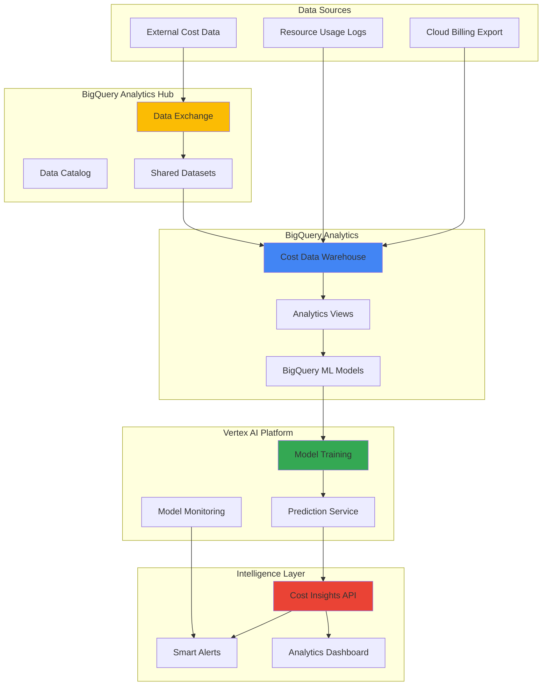

# AI-Powered Cost Analytics with BigQuery Analytics Hub and Vertex AI

## Problem

Organizations struggle to optimize cloud spending due to complex usage patterns, scattered billing data, and lack of predictive insights. Traditional cost analysis relies on reactive reporting, missing opportunities for proactive optimization. Teams need intelligent cost analytics that automatically discovers shared datasets, predicts spending trends, and provides actionable recommendations for cost reduction across multi-cloud environments.

## Solution

Build an intelligent cost analytics system that leverages BigQuery Analytics Hub for data discovery, Vertex AI for predictive modeling, and Cloud Monitoring for real-time alerting. The solution automatically ingests billing data, applies machine learning models to predict spending patterns, and generates personalized optimization recommendations through a unified analytics platform.

## Architecture Diagram



## Prerequisites

1. Google Cloud project with billing enabled and appropriate IAM permissions (including Analytics Hub Admin role)
2. Google Cloud CLI (gcloud) installed and configured (version 400.0.0 or later)
3. Basic understanding of BigQuery, machine learning concepts, and cost optimization strategies
4. Cloud Billing Export enabled for your organization
5. Estimated cost: $50-100 for BigQuery storage and compute, Vertex AI training, and data transfer

> **Note**: This recipe uses BigQuery's built-in data sharing capabilities and Vertex AI's AutoML features to minimize complexity while maximizing analytical power. Analytics Hub data exchanges are managed through the Google Cloud Console and REST API, not the bq CLI.

## Preparation

```bash
# Set environment variables for GCP resources
export PROJECT_ID="cost-analytics-$(date +%s)"
export REGION="us-central1"
export ZONE="us-central1-a"
export DATASET_ID="cost_analytics"
export EXCHANGE_ID="cost_data_exchange"

# Generate unique suffix for resource names
RANDOM_SUFFIX=$(openssl rand -hex 3)
export BUCKET_NAME="cost-analytics-data-${RANDOM_SUFFIX}"
export MODEL_NAME="cost-prediction-model-${RANDOM_SUFFIX}"
export ENDPOINT_NAME="cost-prediction-endpoint-${RANDOM_SUFFIX}"

# Set default project and region
gcloud config set project ${PROJECT_ID}
gcloud config set compute/region ${REGION}
gcloud config set compute/zone ${ZONE}

# Enable required APIs
gcloud services enable bigquery.googleapis.com
gcloud services enable aiplatform.googleapis.com
gcloud services enable storage.googleapis.com
gcloud services enable monitoring.googleapis.com
gcloud services enable cloudbilling.googleapis.com
gcloud services enable datacatalog.googleapis.com
gcloud services enable analyticshub.googleapis.com

# Create Cloud Storage bucket for model artifacts
gsutil mb -p ${PROJECT_ID} \
    -c STANDARD \
    -l ${REGION} \
    gs://${BUCKET_NAME}

echo "✅ Project configured: ${PROJECT_ID}"
echo "✅ APIs enabled and storage bucket created"
```

## Steps

1. **Create BigQuery Cost Analytics Dataset**:

   BigQuery serves as the foundation for cost analytics, providing serverless data warehousing capabilities with built-in machine learning features. Creating a dedicated dataset establishes the organizational structure for cost data, shared analytics assets, and predictive models. This approach enables seamless integration with Analytics Hub for data sharing and collaboration across teams.

   ```bash
   # Create the main analytics dataset
   bq mk --dataset \
       --location=${REGION} \
       --description="Cost analytics and ML models" \
       ${PROJECT_ID}:${DATASET_ID}
   
   # Create table for billing data with partitioning
   bq mk --table \
       --time_partitioning_field=usage_start_time \
       --time_partitioning_type=DAY \
       --description="Daily cost and usage data" \
       ${PROJECT_ID}:${DATASET_ID}.billing_data \
       usage_start_time:TIMESTAMP,service_description:STRING,sku_description:STRING,project_id:STRING,cost:FLOAT64,currency:STRING,usage_amount:FLOAT64,usage_unit:STRING,location:STRING,labels:JSON
   
   echo "✅ BigQuery dataset and billing table created"
   ```

   The partitioned billing table optimizes query performance and reduces costs by enabling time-based filtering. This structure supports efficient analytics queries and enables BigQuery ML models to process historical patterns for accurate cost predictions.

2. **Set Up Analytics Hub Data Exchange**:

   Analytics Hub enables secure data sharing within and across organizations, creating a marketplace for cost-related datasets. By establishing a data exchange, teams can discover and subscribe to relevant cost datasets, benchmarking data, and optimization insights from other departments or external partners. Note that Analytics Hub data exchanges are created through the Google Cloud Console or REST API, not the bq CLI.

   ```bash
   # Create data exchange using the REST API
   # Note: Analytics Hub exchanges cannot be created via bq CLI
   cat > exchange_request.json << EOF
   {
     "displayName": "Cost Analytics Exchange",
     "description": "Shared cost data and optimization insights",
     "primaryContact": "admin@${PROJECT_ID}.iam.gserviceaccount.com"
   }
   EOF
   
   # Create the data exchange using REST API
   curl -X POST \
       -H "Authorization: Bearer $(gcloud auth print-access-token)" \
       -H "Content-Type: application/json" \
       -d @exchange_request.json \
       "https://analyticshub.googleapis.com/v1/projects/${PROJECT_ID}/locations/${REGION}/dataExchanges?dataExchangeId=${EXCHANGE_ID}"
   
   # Create a listing for the billing dataset
   cat > listing_request.json << EOF
   {
     "displayName": "Billing Data Feed",
     "description": "Real-time billing and usage data",
     "bigqueryDataset": {
       "dataset": "projects/${PROJECT_ID}/datasets/${DATASET_ID}"
     }
   }
   EOF
   
   curl -X POST \
       -H "Authorization: Bearer $(gcloud auth print-access-token)" \
       -H "Content-Type: application/json" \
       -d @listing_request.json \
       "https://analyticshub.googleapis.com/v1/projects/${PROJECT_ID}/locations/${REGION}/dataExchanges/${EXCHANGE_ID}/listings?listingId=billing_feed"
   
   echo "✅ Analytics Hub exchange and listing created via REST API"
   ```

   The data exchange creates a centralized hub for cost-related datasets, enabling data-driven collaboration and shared optimization strategies. This foundation supports advanced analytics scenarios where multiple teams contribute and consume cost insights.

3. **Load Sample Billing Data**:

   Sample data provides the foundation for training machine learning models and testing analytics queries. This synthetic dataset represents realistic billing patterns including seasonal variations, project-based costs, and service usage trends that are essential for accurate cost prediction models.

   ```bash
   # Create sample billing data using BigQuery SQL
   bq query --use_legacy_sql=false "
   INSERT INTO \`${PROJECT_ID}.${DATASET_ID}.billing_data\`
   (usage_start_time, service_description, sku_description, project_id, cost, currency, usage_amount, usage_unit, location, labels)
   WITH sample_data AS (
     SELECT
       TIMESTAMP_SUB(CURRENT_TIMESTAMP(), INTERVAL MOD(seq, 365) DAY) as usage_start_time,
       CASE MOD(seq, 4)
         WHEN 0 THEN 'Compute Engine'
         WHEN 1 THEN 'BigQuery'
         WHEN 2 THEN 'Cloud Storage'
         ELSE 'Cloud Functions'
       END as service_description,
       CASE MOD(seq, 4)
         WHEN 0 THEN 'N1 Standard Instance Core'
         WHEN 1 THEN 'Analysis'
         WHEN 2 THEN 'Standard Storage'
         ELSE 'Invocations'
       END as sku_description,
       CONCAT('project-', MOD(seq, 10)) as project_id,
       ROUND(RAND() * 1000 + 50, 2) as cost,
       'USD' as currency,
       ROUND(RAND() * 100, 2) as usage_amount,
       CASE MOD(seq, 4)
         WHEN 0 THEN 'hour'
         WHEN 1 THEN 'byte'
         WHEN 2 THEN 'byte-second'
         ELSE 'request'
       END as usage_unit,
       '${REGION}' as location,
       JSON '{\"team\": \"engineering\", \"environment\": \"production\"}' as labels
     FROM UNNEST(GENERATE_ARRAY(1, 1000)) as seq
   )
   SELECT * FROM sample_data"
   
   echo "✅ Sample billing data loaded for analysis"
   ```

   The synthetic data includes realistic patterns and variations that enable comprehensive testing of analytics queries and machine learning models. This approach ensures the cost prediction system can handle diverse usage scenarios and seasonal fluctuations.

4. **Create Analytics Views for Cost Insights**:

   Analytics views provide pre-computed aggregations and business logic that transform raw billing data into actionable insights. These views enable consistent reporting across teams and serve as input features for machine learning models, ensuring standardized cost analysis methodologies.

   ```bash
   # Create daily cost summary view
   bq mk --view \
       --description="Daily cost aggregations by service and project" \
       --use_legacy_sql=false \
       "${PROJECT_ID}:${DATASET_ID}.daily_cost_summary" \
       "SELECT
         DATE(usage_start_time) as usage_date,
         service_description,
         project_id,
         location,
         SUM(cost) as total_cost,
         SUM(usage_amount) as total_usage,
         COUNT(*) as transaction_count,
         AVG(cost) as avg_cost_per_transaction
       FROM \`${PROJECT_ID}.${DATASET_ID}.billing_data\`
       GROUP BY usage_date, service_description, project_id, location
       ORDER BY usage_date DESC, total_cost DESC"
   
   # Create cost trend analysis view
   bq mk --view \
       --description="7-day rolling cost trends with growth rates" \
       --use_legacy_sql=false \
       "${PROJECT_ID}:${DATASET_ID}.cost_trends" \
       "WITH daily_costs AS (
         SELECT
           DATE(usage_start_time) as usage_date,
           service_description,
           SUM(cost) as daily_cost
         FROM \`${PROJECT_ID}.${DATASET_ID}.billing_data\`
         GROUP BY usage_date, service_description
       )
       SELECT
         usage_date,
         service_description,
         daily_cost,
         AVG(daily_cost) OVER (
           PARTITION BY service_description 
           ORDER BY usage_date 
           ROWS BETWEEN 6 PRECEDING AND CURRENT ROW
         ) as seven_day_avg,
         LAG(daily_cost, 7) OVER (
           PARTITION BY service_description 
           ORDER BY usage_date
         ) as cost_7_days_ago,
         SAFE_DIVIDE(
           daily_cost - LAG(daily_cost, 7) OVER (
             PARTITION BY service_description 
             ORDER BY usage_date
           ),
           LAG(daily_cost, 7) OVER (
             PARTITION BY service_description 
             ORDER BY usage_date
           )
         ) * 100 as growth_rate_pct
       FROM daily_costs
       ORDER BY usage_date DESC, daily_cost DESC"
   
   echo "✅ Analytics views created for cost insights"
   ```

   These views establish the analytical foundation for cost optimization, providing both current state analysis and trend identification. The rolling averages and growth rates enable proactive identification of cost anomalies and usage pattern changes.

5. **Train Vertex AI Cost Prediction Model**:

   Vertex AI AutoML enables automated machine learning model development for cost prediction without requiring extensive ML expertise. The training process analyzes historical patterns, seasonal trends, and usage correlations to build predictive models that forecast future spending and identify optimization opportunities.

   ```bash
   # Prepare training data in BigQuery ML format
   bq query --use_legacy_sql=false "
   CREATE OR REPLACE MODEL \`${PROJECT_ID}.${DATASET_ID}.cost_prediction_bqml\`
   OPTIONS(
     model_type='LINEAR_REG',
     input_label_cols=['cost'],
     max_iterations=50
   ) AS
   SELECT
     EXTRACT(DAYOFWEEK FROM usage_start_time) as day_of_week,
     EXTRACT(HOUR FROM usage_start_time) as hour_of_day,
     service_description,
     project_id,
     usage_amount,
     LAG(cost, 1) OVER (
       PARTITION BY service_description, project_id 
       ORDER BY usage_start_time
     ) as previous_cost,
     LAG(cost, 7) OVER (
       PARTITION BY service_description, project_id 
       ORDER BY usage_start_time
     ) as cost_week_ago,
     cost
   FROM \`${PROJECT_ID}.${DATASET_ID}.billing_data\`
   WHERE usage_start_time < TIMESTAMP_SUB(CURRENT_TIMESTAMP(), INTERVAL 7 DAY)"
   
   # Export model for Vertex AI deployment
   bq extract --destination_format=ML_TF_SAVED_MODEL \
       --destination_uri=gs://${BUCKET_NAME}/models/cost_prediction/* \
       ${PROJECT_ID}:${DATASET_ID}.cost_prediction_bqml
   
   echo "✅ BigQuery ML model trained and exported"
   ```

   The BigQuery ML model provides immediate predictive capabilities within the data warehouse environment, enabling real-time cost forecasting during data analysis. The exported model can be deployed to Vertex AI for scalable prediction services and integration with applications.

6. **Deploy Model to Vertex AI Endpoint**:

   Vertex AI endpoints provide scalable, managed infrastructure for serving machine learning models with automatic scaling and monitoring. Deploying the cost prediction model enables real-time predictions for applications, dashboards, and automated decision-making systems.

   ```bash
   # Upload model to Vertex AI Model Registry
   gcloud ai models upload \
       --region=${REGION} \
       --display-name=${MODEL_NAME} \
       --description="Cost prediction model for analytics" \
       --artifact-uri=gs://${BUCKET_NAME}/models/cost_prediction \
       --container-image-uri=gcr.io/cloud-aiplatform/prediction/tf2-cpu.2-11:latest
   
   # Get the model resource name
   MODEL_RESOURCE_NAME=$(gcloud ai models list \
       --region=${REGION} \
       --filter="displayName:${MODEL_NAME}" \
       --format="value(name)")
   
   # Create prediction endpoint
   gcloud ai endpoints create \
       --region=${REGION} \
       --display-name=${ENDPOINT_NAME} \
       --description="Cost prediction endpoint for real-time inference"
   
   # Get the endpoint resource name
   ENDPOINT_RESOURCE_NAME=$(gcloud ai endpoints list \
       --region=${REGION} \
       --filter="displayName:${ENDPOINT_NAME}" \
       --format="value(name)")
   
   # Deploy model to endpoint
   gcloud ai endpoints deploy-model ${ENDPOINT_RESOURCE_NAME} \
       --region=${REGION} \
       --model=${MODEL_RESOURCE_NAME} \
       --display-name="${MODEL_NAME}-deployment" \
       --machine-type=n1-standard-2 \
       --min-replica-count=1 \
       --max-replica-count=3
   
   echo "✅ Model deployed to Vertex AI endpoint: ${ENDPOINT_RESOURCE_NAME}"
   ```

   The deployed endpoint provides enterprise-grade model serving with automatic scaling, version management, and performance monitoring. This infrastructure supports both batch and real-time predictions for cost optimization applications.

7. **Create Cost Anomaly Detection System**:

   Anomaly detection identifies unusual spending patterns that may indicate inefficient resource usage, security issues, or billing errors. By combining statistical analysis with machine learning, the system provides early warning for cost optimization opportunities and potential problems.

   ```bash
   # Create anomaly detection model in BigQuery ML
   bq query --use_legacy_sql=false "
   CREATE OR REPLACE MODEL \`${PROJECT_ID}.${DATASET_ID}.cost_anomaly_detection\`
   OPTIONS(
     model_type='KMEANS',
     num_clusters=3,
     standardize_features=true
   ) AS
   SELECT
     daily_cost,
     seven_day_avg,
     growth_rate_pct,
     service_description
   FROM \`${PROJECT_ID}.${DATASET_ID}.cost_trends\`
   WHERE growth_rate_pct IS NOT NULL"
   
   # Create anomaly detection view
   bq mk --view \
       --description="Cost anomalies with severity scores" \
       --use_legacy_sql=false \
       "${PROJECT_ID}:${DATASET_ID}.cost_anomalies" \
       "WITH anomaly_scores AS (
         SELECT
           usage_date,
           service_description,
           daily_cost,
           seven_day_avg,
           growth_rate_pct,
           ML.DISTANCE_TO_CENTROID(
             MODEL \`${PROJECT_ID}.${DATASET_ID}.cost_anomaly_detection\`,
             (SELECT AS STRUCT daily_cost, seven_day_avg, growth_rate_pct, service_description)
           ) as anomaly_score
         FROM \`${PROJECT_ID}.${DATASET_ID}.cost_trends\`
         WHERE growth_rate_pct IS NOT NULL
       )
       SELECT
         *,
         CASE
           WHEN anomaly_score > 2.0 THEN 'HIGH'
           WHEN anomaly_score > 1.0 THEN 'MEDIUM'
           ELSE 'LOW'
         END as severity
       FROM anomaly_scores
       WHERE anomaly_score > 0.5
       ORDER BY anomaly_score DESC, usage_date DESC"
   
   echo "✅ Cost anomaly detection system created"
   ```

   The anomaly detection system continuously monitors cost patterns and provides severity-based alerting for unusual spending behaviors. This proactive approach enables rapid response to cost optimization opportunities and potential issues.

8. **Set Up Cloud Monitoring for Cost Alerts**:

   Cloud Monitoring integrates with BigQuery to provide real-time alerting on cost metrics and anomalies. Custom metrics and alerting policies enable automated notifications when spending exceeds thresholds or unusual patterns are detected, ensuring proactive cost management.

   ```bash
   # Create alert policy for high cost anomalies using REST API
   cat > cost_alert_policy.json << EOF
   {
     "displayName": "High Cost Anomaly Alert",
     "documentation": {
       "content": "Alert when cost anomalies exceed threshold",
       "mimeType": "text/markdown"
     },
     "conditions": [
       {
         "displayName": "High Anomaly Score",
         "conditionThreshold": {
           "filter": "resource.type=\"bigquery_dataset\"",
           "comparison": "COMPARISON_GREATER_THAN",
           "thresholdValue": 2.0,
           "duration": "300s"
         }
       }
     ],
     "alertStrategy": {
       "autoClose": "1800s"
     },
     "enabled": true
   }
   EOF
   
   # Create the alert policy using REST API
   curl -X POST \
       -H "Authorization: Bearer $(gcloud auth print-access-token)" \
       -H "Content-Type: application/json" \
       -d @cost_alert_policy.json \
       "https://monitoring.googleapis.com/v1/projects/${PROJECT_ID}/alertPolicies"
   
   # Create custom metric for cost trends
   bq query --use_legacy_sql=false "
   CREATE OR REPLACE VIEW \`${PROJECT_ID}.${DATASET_ID}.monitoring_metrics\` AS
   SELECT
     CURRENT_TIMESTAMP() as timestamp,
     service_description,
     daily_cost,
     growth_rate_pct,
     CASE
       WHEN growth_rate_pct > 50 THEN 1
       ELSE 0
     END as high_growth_alert
   FROM \`${PROJECT_ID}.${DATASET_ID}.cost_trends\`
   WHERE usage_date = CURRENT_DATE() - 1"
   
   echo "✅ Cloud Monitoring alerts configured"
   ```

   The monitoring system provides comprehensive oversight of cost analytics with automated alerting for both threshold-based and anomaly-based scenarios. This ensures timely response to cost optimization opportunities and potential spending issues.

## Validation & Testing

1. **Verify BigQuery Analytics Setup**:

   ```bash
   # Check dataset and tables
   bq ls ${PROJECT_ID}:${DATASET_ID}
   
   # Verify data loading
   bq query --use_legacy_sql=false \
       "SELECT COUNT(*) as record_count, 
        MIN(usage_start_time) as earliest_date,
        MAX(usage_start_time) as latest_date,
        SUM(cost) as total_cost
        FROM \`${PROJECT_ID}.${DATASET_ID}.billing_data\`"
   ```

   Expected output: Dataset listing showing tables and views, with record count around 1000 and total cost data.

2. **Test Cost Prediction Model**:

   ```bash
   # Test prediction with sample data
   echo '[{
     "instances": [{
       "day_of_week": 2,
       "hour_of_day": 14,
       "service_description": "Compute Engine",
       "project_id": "project-1",
       "usage_amount": 50.0,
       "previous_cost": 75.5,
       "cost_week_ago": 70.0
     }]
   }]' > prediction_input.json
   
   # Make prediction request
   gcloud ai endpoints predict ${ENDPOINT_RESOURCE_NAME} \
       --region=${REGION} \
       --json-request=prediction_input.json
   ```

   Expected output: JSON response with predicted cost value and confidence scores.

3. **Validate Analytics Hub Exchange**:

   ```bash
   # List data exchanges using REST API
   curl -H "Authorization: Bearer $(gcloud auth print-access-token)" \
       "https://analyticshub.googleapis.com/v1/projects/${PROJECT_ID}/locations/${REGION}/dataExchanges"
   
   # Check listing details
   curl -H "Authorization: Bearer $(gcloud auth print-access-token)" \
       "https://analyticshub.googleapis.com/v1/projects/${PROJECT_ID}/locations/${REGION}/dataExchanges/${EXCHANGE_ID}/listings/billing_feed"
   ```

   Expected output: Exchange listing with metadata and subscription information.

4. **Test Anomaly Detection**:

   ```bash
   # Query recent anomalies
   bq query --use_legacy_sql=false \
       "SELECT usage_date, service_description, 
        daily_cost, anomaly_score, severity
        FROM \`${PROJECT_ID}.${DATASET_ID}.cost_anomalies\`
        ORDER BY anomaly_score DESC LIMIT 10"
   ```

   Expected output: List of cost anomalies with severity rankings and scores.

## Cleanup

1. **Remove Vertex AI Resources**:

   ```bash
   # Undeploy model from endpoint
   DEPLOYED_MODEL_ID=$(gcloud ai endpoints describe ${ENDPOINT_RESOURCE_NAME} \
       --region=${REGION} \
       --format="value(deployedModels[0].id)")
   
   gcloud ai endpoints undeploy-model ${ENDPOINT_RESOURCE_NAME} \
       --region=${REGION} \
       --deployed-model-id=${DEPLOYED_MODEL_ID} \
       --quiet
   
   # Delete endpoint
   gcloud ai endpoints delete ${ENDPOINT_RESOURCE_NAME} \
       --region=${REGION} \
       --quiet
   
   # Delete model
   gcloud ai models delete ${MODEL_RESOURCE_NAME} \
       --region=${REGION} \
       --quiet
   
   echo "✅ Vertex AI resources deleted"
   ```

2. **Remove BigQuery Resources**:

   ```bash
   # Delete Analytics Hub listing and exchange using REST API
   curl -X DELETE \
       -H "Authorization: Bearer $(gcloud auth print-access-token)" \
       "https://analyticshub.googleapis.com/v1/projects/${PROJECT_ID}/locations/${REGION}/dataExchanges/${EXCHANGE_ID}/listings/billing_feed"
   
   curl -X DELETE \
       -H "Authorization: Bearer $(gcloud auth print-access-token)" \
       "https://analyticshub.googleapis.com/v1/projects/${PROJECT_ID}/locations/${REGION}/dataExchanges/${EXCHANGE_ID}"
   
   # Delete dataset and all tables/views
   bq rm -r -f ${PROJECT_ID}:${DATASET_ID}
   
   echo "✅ BigQuery resources deleted"
   ```

3. **Remove Storage and Monitoring**:

   ```bash
   # Delete Cloud Storage bucket
   gsutil -m rm -r gs://${BUCKET_NAME}
   
   # Remove alert policies (list and delete via REST API)
   POLICY_NAME=$(curl -H "Authorization: Bearer $(gcloud auth print-access-token)" \
       "https://monitoring.googleapis.com/v1/projects/${PROJECT_ID}/alertPolicies" | \
       jq -r '.alertPolicies[] | select(.displayName=="High Cost Anomaly Alert") | .name')
   
   if [ ! -z "$POLICY_NAME" ]; then
     curl -X DELETE \
         -H "Authorization: Bearer $(gcloud auth print-access-token)" \
         "https://monitoring.googleapis.com/v1/${POLICY_NAME}"
   fi
   
   # Clean up local files
   rm -f cost_alert_policy.json prediction_input.json exchange_request.json listing_request.json
   
   echo "✅ Storage and monitoring resources cleaned up"
   ```

## Discussion

This solution demonstrates the power of Google Cloud's integrated analytics platform for intelligent cost optimization. By combining BigQuery's serverless data warehouse capabilities with Analytics Hub's data sharing features and Vertex AI's machine learning platform, organizations can build sophisticated cost analytics systems that provide both historical insights and predictive capabilities.

The [BigQuery Analytics Hub](https://cloud.google.com/bigquery/docs/analytics-hub-introduction) enables secure data sharing across organizational boundaries, allowing teams to discover and subscribe to relevant cost datasets without complex data movement. This approach supports collaborative cost optimization strategies where multiple departments can contribute usage patterns and share optimization insights. Note that Analytics Hub data exchanges are managed through the Google Cloud Console and REST API, as CLI support is not currently available.

[Vertex AI's AutoML capabilities](https://cloud.google.com/vertex-ai/docs/beginner/beginners-guide) simplify the machine learning workflow, enabling organizations to build accurate cost prediction models without requiring deep ML expertise. The platform's managed infrastructure handles model training, deployment, and scaling, allowing teams to focus on business logic rather than infrastructure management.

The integration with [Cloud Monitoring](https://cloud.google.com/monitoring/docs) provides real-time alerting and operational oversight, ensuring that cost optimization remains an active, ongoing process rather than a periodic review. Custom metrics and alerting policies enable proactive response to both threshold-based cost increases and anomaly-based pattern detection.

> **Tip**: Implement cost allocation tags and labels consistently across your organization to enable more granular cost analysis and accurate charge-back reporting. Use [BigQuery's built-in data governance features](https://cloud.google.com/bigquery/docs/column-level-security) to control access to sensitive cost information while enabling collaborative analytics.

## Challenge

Extend this solution by implementing these enhancements:

1. **Multi-Cloud Cost Integration**: Add support for AWS and Azure billing data through [BigQuery Omni](https://cloud.google.com/bigquery-omni) and federated queries to create a unified multi-cloud cost analytics platform.

2. **Advanced Anomaly Detection**: Implement [time-series forecasting with Prophet](https://cloud.google.com/bigquery/docs/bqml-prophet) or ARIMA models to detect seasonal anomalies and predict optimal scaling schedules for cost optimization.

3. **Real-Time Cost Streaming**: Use [Pub/Sub](https://cloud.google.com/pubsub) and [Dataflow](https://cloud.google.com/dataflow) to implement real-time cost monitoring with sub-minute alerting for critical spending thresholds.

4. **Automated Optimization Actions**: Integrate with [Cloud Functions](https://cloud.google.com/functions) and [Workflows](https://cloud.google.com/workflows) to automatically implement cost optimization recommendations such as rightsizing instances or adjusting storage tiers.

5. **Executive Cost Dashboards**: Build interactive cost dashboards using [Looker Studio](https://cloud.google.com/looker-studio) with drill-down capabilities and automated report generation for executive stakeholders.

## Infrastructure Code

### Available Infrastructure as Code:

- [Infrastructure Code Overview](code/README.md) - Detailed description of all infrastructure components
- [Infrastructure Manager](code/infrastructure-manager/) - GCP Infrastructure Manager templates
- [Bash CLI Scripts](code/scripts/) - Example bash scripts using gcloud CLI commands to deploy infrastructure
- [Terraform](code/terraform/) - Terraform configuration files