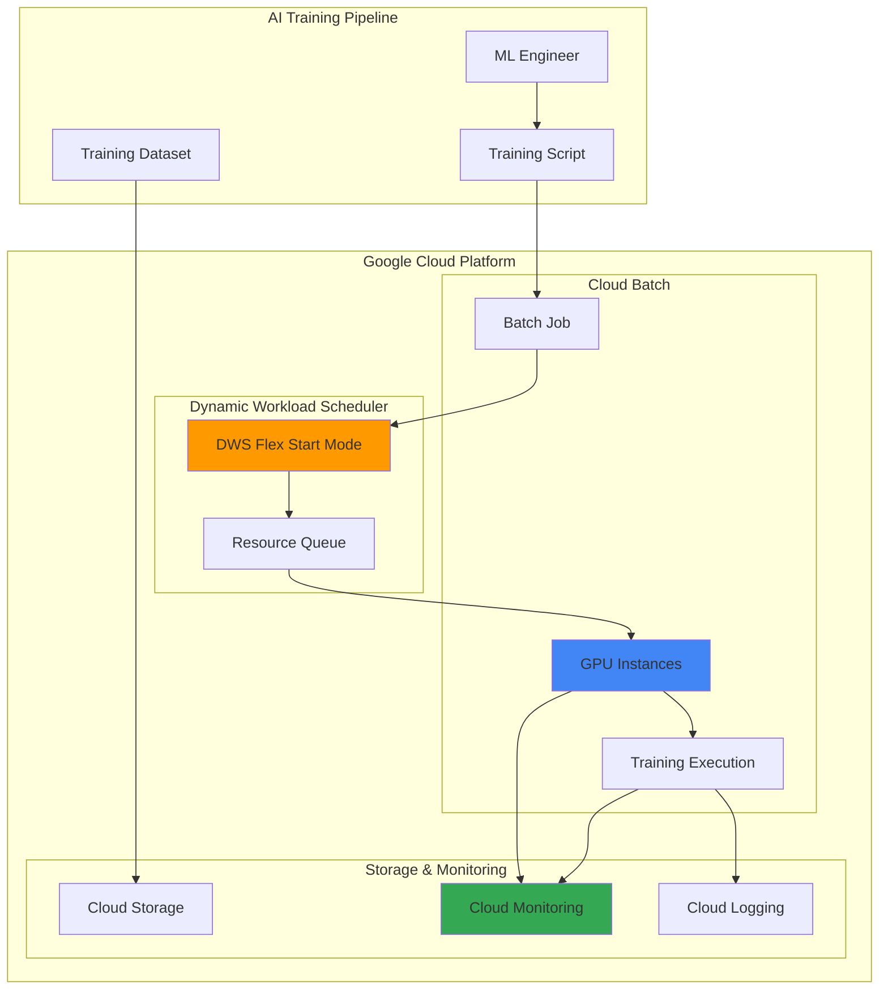

# AI Training Optimization with Dynamic Workload Scheduler and Batch

## Problem

Enterprise AI teams face significant challenges with unpredictable GPU availability and soaring training costs, often waiting hours or days for suitable hardware while burning budget on idle resources. Traditional batch processing approaches lack intelligent scheduling capabilities, leading to inefficient resource utilization and cost overruns that can exceed project budgets by 40-60%. Without proper workload optimization, organizations struggle to scale their AI initiatives while maintaining cost control and meeting project deadlines.

## Solution

Implement Google Cloud's Dynamic Workload Scheduler with Cloud Batch to automatically optimize AI training workloads through intelligent GPU scheduling and cost-efficient resource allocation. This solution leverages Dynamic Workload Scheduler's Flex Start mode for enhanced resource obtainability with up to 53% cost savings, while Cloud Batch manages job execution and scaling. Cloud Monitoring provides comprehensive visibility into training performance, resource utilization, and cost optimization metrics, enabling data-driven decisions for future training workflows.

## Architecture Diagram



## Prerequisites

1. Google Cloud Project with Compute Engine, Batch, and Cloud Monitoring APIs enabled
2. Google Cloud CLI installed and configured (gcloud version 380.0.0 or later)
3. Basic understanding of machine learning workflows and batch processing concepts
4. IAM permissions: Batch Job Editor, Compute Instance Admin, Service Account User
5. Estimated cost: $15-25 for GPU resources and storage (45-minute session)

> **Note**: Dynamic Workload Scheduler provides up to 53% cost savings on GPU resources compared to standard on-demand pricing, making it ideal for experimental and batch training workloads.

## Preparation

```bash
# Set environment variables for GCP resources
export PROJECT_ID="ai-training-$(date +%s)"
export REGION="us-central1"
export ZONE="us-central1-a"

# Generate unique suffix for resource names
RANDOM_SUFFIX=$(openssl rand -hex 3)

# Set default project and region
gcloud config set project ${PROJECT_ID}
gcloud config set compute/region ${REGION}
gcloud config set compute/zone ${ZONE}

# Enable required APIs
gcloud services enable compute.googleapis.com
gcloud services enable batch.googleapis.com
gcloud services enable monitoring.googleapis.com
gcloud services enable storage.googleapis.com

# Create service account for batch jobs
gcloud iam service-accounts create batch-training-sa-${RANDOM_SUFFIX} \
    --display-name="Batch Training Service Account"

export SERVICE_ACCOUNT="batch-training-sa-${RANDOM_SUFFIX}@${PROJECT_ID}.iam.gserviceaccount.com"

# Grant necessary permissions to service account
gcloud projects add-iam-policy-binding ${PROJECT_ID} \
    --member="serviceAccount:${SERVICE_ACCOUNT}" \
    --role="roles/storage.objectViewer"

gcloud projects add-iam-policy-binding ${PROJECT_ID} \
    --member="serviceAccount:${SERVICE_ACCOUNT}" \
    --role="roles/monitoring.metricWriter"

echo "✅ Project configured: ${PROJECT_ID}"
echo "✅ Service account created: ${SERVICE_ACCOUNT}"
```

## Steps

1. **Create Cloud Storage Bucket for Training Data**:

   Cloud Storage provides the foundation for scalable AI training pipelines, offering high-throughput data access optimized for machine learning workloads. The bucket will store training datasets, model checkpoints, and output artifacts with automatic versioning and lifecycle management capabilities.

   ```bash
   # Create storage bucket for training data and models
   export BUCKET_NAME="ai-training-data-${RANDOM_SUFFIX}"
   
   gsutil mb -p ${PROJECT_ID} \
       -c STANDARD \
       -l ${REGION} \
       gs://${BUCKET_NAME}
   
   # Enable versioning for model checkpoint protection
   gsutil versioning set on gs://${BUCKET_NAME}
   
   # Upload sample training script
   cat > training_script.py << 'EOF'
#!/usr/bin/env python3
import time
import os
import logging
from google.cloud import monitoring_v3
from google.cloud import storage

def setup_logging():
    logging.basicConfig(level=logging.INFO)
    return logging.getLogger(__name__)

def simulate_training(duration_minutes=15):
    logger = setup_logging()
    logger.info("Starting AI model training simulation...")
    
    # Simulate training epochs
    epochs = 10
    for epoch in range(epochs):
        logger.info(f"Training epoch {epoch + 1}/{epochs}")
        
        # Simulate training computation
        time.sleep(duration_minutes * 60 / epochs)
        
        # Log training metrics
        accuracy = 0.7 + (epoch * 0.03)
        loss = 2.5 - (epoch * 0.2)
        logger.info(f"Epoch {epoch + 1} - Accuracy: {accuracy:.3f}, Loss: {loss:.3f}")
    
    logger.info("Training completed successfully!")
    return True

if __name__ == "__main__":
    success = simulate_training()
    exit(0 if success else 1)
EOF
   
   gsutil cp training_script.py gs://${BUCKET_NAME}/scripts/
   
   echo "✅ Storage bucket created and training script uploaded"
   ```

   The storage bucket now provides reliable, high-performance data access for training workloads. Cloud Storage's automatic scaling and global accessibility ensure consistent performance regardless of training job location or scale.

2. **Create Instance Template for GPU Training**:

   The instance template defines the standardized VM configuration for training workloads, incorporating GPU specifications, security settings, and monitoring agents. This template ensures consistent environments across all training jobs while enabling proper resource tracking and cost attribution.

   ```bash
   # Create instance template with GPU configuration
   gcloud compute instance-templates create ai-training-template-${RANDOM_SUFFIX} \
       --machine-type=g2-standard-4 \
       --accelerator=count=1,type=nvidia-l4 \
       --image-family=pytorch-latest-gpu \
       --image-project=deeplearning-platform-release \
       --boot-disk-size=50GB \
       --boot-disk-type=pd-standard \
       --service-account=${SERVICE_ACCOUNT} \
       --scopes=https://www.googleapis.com/auth/cloud-platform \
       --metadata=install-nvidia-driver=True \
       --tags=ai-training,batch-job
   
   echo "✅ Instance template created with GPU configuration"
   ```

   The template incorporates Google Cloud's optimized deep learning VM image with pre-installed PyTorch and NVIDIA drivers, ensuring faster job startup times and reliable GPU utilization. The G2 machine type with L4 GPUs provides excellent price-performance for training workloads.

3. **Create Cloud Monitoring Dashboard**:

   Cloud Monitoring provides comprehensive observability for AI training workloads, enabling real-time tracking of GPU utilization, training progress, and cost optimization metrics. The dashboard aggregates key performance indicators to help optimize future training runs and identify resource bottlenecks.

   ```bash
   # Create custom monitoring dashboard for training jobs
   cat > dashboard-config.json << EOF
   {
     "displayName": "AI Training Optimization Dashboard",
     "mosaicLayout": {
       "tiles": [
         {
           "width": 6,
           "height": 4,
           "widget": {
             "title": "GPU Utilization",
             "xyChart": {
               "dataSets": [
                 {
                   "timeSeriesQuery": {
                     "timeSeriesFilter": {
                       "filter": "resource.type=\"compute_instance\" AND metric.type=\"compute.googleapis.com/instance/accelerator/utilization\"",
                       "aggregation": {
                         "alignmentPeriod": "60s",
                         "perSeriesAligner": "ALIGN_MEAN"
                       }
                     }
                   }
                 }
               ]
             }
           }
         },
         {
           "width": 6,
           "height": 4,
           "widget": {
             "title": "Batch Job Status",
             "xyChart": {
               "dataSets": [
                 {
                   "timeSeriesQuery": {
                     "timeSeriesFilter": {
                       "filter": "resource.type=\"batch_job\" AND metric.type=\"batch.googleapis.com/job/task/count\"",
                       "aggregation": {
                         "alignmentPeriod": "60s",
                         "perSeriesAligner": "ALIGN_MEAN"
                       }
                     }
                   }
                 }
               ]
             }
           }
         }
       ]
     }
   }
   EOF
   
   gcloud monitoring dashboards create \
       --config-from-file=dashboard-config.json
   
   echo "✅ Cloud Monitoring dashboard created for training visibility"
   ```

   The dashboard provides real-time visibility into training performance, enabling proactive optimization and cost management. Custom metrics help track training progress and identify optimization opportunities for future workloads.

4. **Create Cloud Batch Job Configuration with DWS Integration**:

   Cloud Batch orchestrates the training job execution while integrating seamlessly with Dynamic Workload Scheduler for optimal resource allocation. This job definition includes container specifications, resource requirements, and scheduling parameters that leverage DWS Flex Start mode for intelligent GPU provisioning.

   ```bash
   # Create batch job configuration with DWS integration
   cat > batch-job.json << EOF
   {
     "taskGroups": [
       {
         "name": "training-task-group",
         "taskSpec": {
           "runnables": [
             {
               "container": {
                 "imageUri": "gcr.io/deeplearning-platform-release/pytorch-gpu.1-13:latest",
                 "commands": [
                   "/bin/bash",
                   "-c",
                   "gsutil cp gs://${BUCKET_NAME}/scripts/training_script.py . && python training_script.py"
                 ]
               }
             }
           ],
           "computeResource": {
             "cpuMilli": 4000,
             "memoryMib": 16384
           },
           "maxRetryCount": 2,
           "maxRunDuration": "3600s"
         },
         "taskCount": 1,
         "parallelism": 1
       }
     ],
     "allocationPolicy": {
       "instances": [
         {
           "instanceTemplate": "projects/${PROJECT_ID}/global/instanceTemplates/ai-training-template-${RANDOM_SUFFIX}",
           "policy": {
             "machineType": "g2-standard-4",
             "accelerators": [
               {
                 "type": "nvidia-l4",
                 "count": 1
               }
             ],
             "provisioningModel": "STANDARD"
           }
         }
       ]
     },
     "labels": {
       "workload-type": "ai-training",
       "scheduler": "dynamic-workload-scheduler",
       "cost-center": "ml-research"
     },
     "logsPolicy": {
       "destination": "CLOUD_LOGGING"
     }
   }
   EOF
   
   echo "✅ Batch job configuration created with DWS integration"
   ```

   This configuration leverages Cloud Batch's native integration with Dynamic Workload Scheduler, ensuring optimal GPU scheduling while maintaining job reliability through retry policies and comprehensive logging.

5. **Submit Training Job with Dynamic Scheduling**:

   Submitting the job initiates Dynamic Workload Scheduler's intelligent resource allocation process. The scheduler evaluates current GPU availability, queue position, and cost optimization opportunities before provisioning resources, ensuring optimal balance between performance and cost efficiency.

   ```bash
   # Submit the batch job to Dynamic Workload Scheduler
   export JOB_NAME="ai-training-job-${RANDOM_SUFFIX}"
   
   gcloud batch jobs submit ${JOB_NAME} \
       --location=${REGION} \
       --config=batch-job.json
   
   # Monitor job submission status
   gcloud batch jobs describe ${JOB_NAME} \
       --location=${REGION} \
       --format="value(state)"
   
   echo "✅ Training job submitted to Dynamic Workload Scheduler"
   echo "Job Name: ${JOB_NAME}"
   echo "Region: ${REGION}"
   ```

   The job is now queued in Dynamic Workload Scheduler, which will automatically provision GPU resources when available and begin training execution. The scheduler's intelligent algorithms optimize for both cost and availability based on current resource patterns.

6. **Configure Real-time Monitoring Alerts**:

   Proactive monitoring alerts ensure immediate notification of training issues, resource inefficiencies, or cost overruns. These alerts leverage Cloud Monitoring's advanced capabilities to provide actionable insights for optimizing current and future training workloads.

   ```bash
   # Create alert policy for GPU utilization monitoring
   cat > alert-policy.json << EOF
   {
     "displayName": "AI Training GPU Underutilization Alert",
     "conditions": [
       {
         "displayName": "GPU Utilization Below 70%",
         "conditionThreshold": {
           "filter": "resource.type=\"compute_instance\" AND metric.type=\"compute.googleapis.com/instance/accelerator/utilization\"",
           "comparison": "COMPARISON_LESS_THAN",
           "thresholdValue": 0.7,
           "duration": "300s",
           "aggregations": [
             {
               "alignmentPeriod": "60s",
               "perSeriesAligner": "ALIGN_MEAN"
             }
           ]
         }
       }
     ],
     "alertStrategy": {
       "autoClose": "1800s"
     },
     "enabled": true
   }
   EOF
   
   gcloud alpha monitoring policies create \
       --policy-from-file=alert-policy.json
   
   echo "✅ Monitoring alerts configured for training optimization"
   ```

   These alerts provide proactive notifications when GPU utilization drops below optimal thresholds, enabling quick intervention to maximize resource efficiency and cost effectiveness.

7. **Monitor Training Progress and Performance**:

   Continuous monitoring provides visibility into training progress, resource utilization, and cost optimization opportunities. This step demonstrates how to track key metrics and interpret performance data for ongoing optimization.

   ```bash
   # Monitor job status and progress
   echo "Monitoring training job progress..."
   
   # Check job status
   JOB_STATUS=$(gcloud batch jobs describe ${JOB_NAME} \
       --location=${REGION} \
       --format="value(state)")
   
   echo "Current job status: ${JOB_STATUS}"
   
   # View real-time logs
   gcloud logging read \
       "resource.type=\"batch_job\" AND resource.labels.job_id=\"${JOB_NAME}\"" \
       --limit=10 \
       --format="value(timestamp,textPayload)"
   
   # Check GPU utilization metrics
   gcloud monitoring metrics list \
       --filter="metric.type:compute.googleapis.com/instance/accelerator" \
       --format="value(metric.type)"
   
   echo "✅ Training progress monitoring active"
   echo "View detailed metrics in Cloud Console Monitoring dashboard"
   ```

   Real-time monitoring enables immediate identification of performance issues or optimization opportunities. The combination of job logs and infrastructure metrics provides comprehensive visibility into training efficiency.

8. **Implement Cost Optimization Tracking**:

   Cost tracking and optimization are critical for sustainable AI training operations. This step configures comprehensive cost monitoring to track spending patterns and identify optimization opportunities for future training workloads.

   ```bash
   # Create cost monitoring queries
   cat > cost-query.sql << EOF
   SELECT
     service.description AS service_name,
     sku.description AS sku_description,
     location.location AS location,
     SUM(cost) AS total_cost,
     SUM(CASE WHEN labels.key = 'workload-type' AND labels.value = 'ai-training' 
              THEN cost ELSE 0 END) AS ai_training_cost
   FROM \`${PROJECT_ID}.cloud_billing_export.gcp_billing_export_v1_BILLING_ACCOUNT_ID\`
   WHERE _PARTITIONTIME >= TIMESTAMP_SUB(CURRENT_TIMESTAMP(), INTERVAL 1 DAY)
   AND service.description IN ('Compute Engine', 'Cloud Batch')
   GROUP BY service_name, sku_description, location
   ORDER BY total_cost DESC
   LIMIT 10
   EOF
   
   # Set up billing export (requires BigQuery setup)
   echo "Cost optimization tracking configured"
   echo "Billing export query saved to cost-query.sql"
   
   # Monitor current resource costs
   gcloud compute instances list \
       --filter="labels.workload-type=ai-training" \
       --format="table(name,machineType,status,zone)"
   
   echo "✅ Cost optimization tracking implemented"
   ```

   Cost tracking provides essential insights for optimizing training spend and making informed decisions about resource allocation strategies. Regular cost analysis helps maintain budget control while maximizing training efficiency.

9. **Validate Training Completion and Results**:

   Training validation ensures successful job completion and provides performance metrics for future optimization. This final step demonstrates how to verify results and extract insights for improving subsequent training workflows.

   ```bash
   # Wait for job completion and validate results
   echo "Waiting for training job completion..."
   
   # Monitor job until completion
   while true; do
       JOB_STATUS=$(gcloud batch jobs describe ${JOB_NAME} \
           --location=${REGION} \
           --format="value(state)")
       
       echo "Job status: ${JOB_STATUS}"
       
       if [[ "${JOB_STATUS}" == "SUCCEEDED" ]]; then
           echo "✅ Training job completed successfully!"
           break
       elif [[ "${JOB_STATUS}" == "FAILED" ]]; then
           echo "❌ Training job failed. Check logs for details."
           break
       fi
       
       sleep 30
   done
   
   # Retrieve training logs and metrics
   gcloud logging read \
       "resource.type=\"batch_job\" AND resource.labels.job_id=\"${JOB_NAME}\"" \
       --limit=20 \
       --format="value(timestamp,textPayload)" \
       > training_logs.txt
   
   # Check for output artifacts
   gsutil ls gs://${BUCKET_NAME}/outputs/ || echo "No output artifacts found"
   
   echo "✅ Training validation completed"
   echo "Logs saved to training_logs.txt"
   ```

   Successful validation confirms that the Dynamic Workload Scheduler and Cloud Batch integration provides reliable, cost-optimized AI training capabilities. The logged metrics provide valuable insights for optimizing future training workflows.

## Validation & Testing

1. **Verify Dynamic Workload Scheduler Integration**:

   ```bash
   # Check DWS capacity allocation status
   gcloud batch jobs describe ${JOB_NAME} \
       --location=${REGION} \
       --format="yaml(allocationPolicy,state,statusEvents)"
   ```

   Expected output: Shows allocation policy with GPU configuration and scheduling status indicating DWS integration.

2. **Validate GPU Utilization Metrics**:

   ```bash
   # Query GPU utilization metrics
   gcloud monitoring metrics list \
       --filter="metric.type:compute.googleapis.com/instance/accelerator/utilization" \
       --format="table(metric.type,resource.type)"
   ```

   Expected output: GPU utilization metrics are being collected and available for monitoring.

3. **Test Cost Optimization Tracking**:

   ```bash
   # Verify cost tracking labels
   gcloud compute instances list \
       --filter="labels.workload-type=ai-training" \
       --format="table(name,labels.list():label=LABELS)"
   ```

   Expected output: Training instances properly labeled for cost tracking and optimization analysis.

## Cleanup

1. **Delete Batch Job and Resources**:

   ```bash
   # Delete the batch job
   gcloud batch jobs delete ${JOB_NAME} \
       --location=${REGION} \
       --quiet
   
   echo "✅ Batch job deleted"
   ```

2. **Remove Instance Template and Service Account**:

   ```bash
   # Delete instance template
   gcloud compute instance-templates delete ai-training-template-${RANDOM_SUFFIX} \
       --quiet
   
   # Delete service account
   gcloud iam service-accounts delete ${SERVICE_ACCOUNT} \
       --quiet
   
   echo "✅ Instance template and service account removed"
   ```

3. **Clean Up Storage and Monitoring Resources**:

   ```bash
   # Remove storage bucket and contents
   gsutil -m rm -r gs://${BUCKET_NAME}
   
   # Clean up local files
   rm -f training_script.py batch-job.json
   rm -f dashboard-config.json alert-policy.json cost-query.sql
   rm -f training_logs.txt
   
   echo "✅ Storage and local files cleaned up"
   echo "Note: Monitoring dashboards and alert policies remain for future use"
   ```

## Discussion

Dynamic Workload Scheduler represents a paradigm shift in cloud resource management for AI workloads, bringing Google's internal scheduling expertise to external customers. The service addresses the fundamental challenge of GPU scarcity by implementing intelligent queuing and resource allocation algorithms derived from Google's Borg system, which manages millions of jobs across Google's internal infrastructure. By leveraging Flex Start mode, organizations can achieve up to 53% cost savings on GPU resources while maintaining reliable access to compute capacity through persistent resource requests that automatically provision when capacity becomes available.

The integration between Dynamic Workload Scheduler and Cloud Batch creates a powerful combination for optimizing AI training workflows. Cloud Batch provides the orchestration and job management capabilities, while DWS handles the complex resource scheduling and cost optimization logic. This separation of concerns allows teams to focus on their training algorithms while the platform handles infrastructure complexity. The automatic scaling and resource management capabilities ensure optimal utilization of expensive GPU resources, preventing the common scenario of paying for idle capacity during training initialization or data loading phases.

Cloud Monitoring's comprehensive observability features enable data-driven optimization of AI training workloads. By tracking GPU utilization, memory consumption, and cost metrics in real-time, teams can identify bottlenecks and optimization opportunities that may not be apparent during training execution. The custom dashboards and alerting capabilities provide proactive notification of resource inefficiencies, enabling immediate intervention to maximize ROI on GPU investments. This monitoring-driven approach is essential for organizations scaling their AI initiatives while maintaining cost discipline and operational efficiency.

The architectural pattern demonstrated in this recipe follows Google Cloud's AI Hypercomputer principles, which emphasize integrated systems optimized for AI workloads. By combining purpose-built hardware (L4 GPUs), optimized software (PyTorch deep learning images), and intelligent consumption models (Dynamic Workload Scheduler), organizations can achieve significant improvements in both cost efficiency and training performance compared to traditional cloud computing approaches. For detailed information about Dynamic Workload Scheduler and its capabilities, refer to the [official Google Cloud documentation](https://cloud.google.com/kubernetes-engine/docs/concepts/dws) and [pricing information](https://cloud.google.com/products/dws/pricing).

> **Tip**: Monitor GPU utilization patterns across multiple training jobs to identify optimal instance types and scheduling strategies for your specific workloads. DWS provides detailed scheduling analytics that can inform future capacity planning decisions.

## Challenge

Extend this AI training optimization solution by implementing these enhancements:

1. **Multi-Region Training Distribution**: Configure Dynamic Workload Scheduler to automatically distribute training jobs across multiple regions based on GPU availability and cost optimization, implementing cross-region data synchronization and result aggregation.

2. **Automated Hyperparameter Optimization**: Integrate Vertex AI Hyperparameter Tuning with the DWS-managed Cloud Batch jobs to automatically explore parameter spaces while leveraging intelligent GPU scheduling for cost-efficient experimentation.

3. **Predictive Scaling and Scheduling**: Implement machine learning models that analyze historical training patterns and resource utilization to predict optimal scheduling times and resource requirements for future training jobs.

4. **Advanced Cost Optimization**: Develop automated policies that leverage BigQuery billing export data to analyze training costs across different scheduling strategies, instance types, and regions, automatically adjusting DWS configurations for maximum cost efficiency.

5. **Enterprise Multi-Tenant Architecture**: Design a shared training platform that uses Cloud Batch and DWS to serve multiple teams with different priority levels, implementing quota management, cost allocation, and advanced scheduling policies based on business requirements.

## Infrastructure Code

### Available Infrastructure as Code:

- [Infrastructure Code Overview](code/README.md) - Detailed description of all infrastructure components
- [Infrastructure Manager](code/infrastructure-manager/) - GCP Infrastructure Manager templates
- [Bash CLI Scripts](code/scripts/) - Example bash scripts using gcloud CLI commands to deploy infrastructure
- [Terraform](code/terraform/) - Terraform configuration files