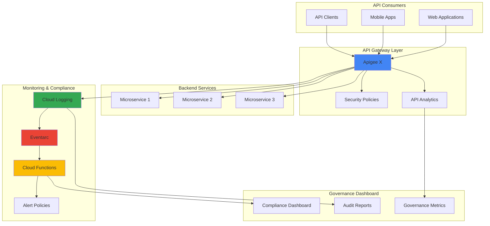

# API Governance and Compliance Monitoring with Apigee X and Cloud Logging

## Problem

Enterprise organizations struggle to maintain consistent API governance and compliance across hundreds of APIs as development teams deploy services independently. Without automated monitoring, security violations, policy breaches, and compliance issues go undetected until customer data is compromised or audits fail. Manual compliance checking is time-consuming, error-prone, and cannot scale with modern API deployment velocities, leaving organizations vulnerable to regulatory penalties and security breaches.

## Solution

Build an automated API governance system using Apigee X for centralized API management and policy enforcement, Cloud Logging for comprehensive audit trails, Eventarc for event-driven automation, and Cloud Functions for intelligent compliance response. This solution continuously monitors API usage patterns, automatically detects policy violations, and triggers immediate remediation actions while maintaining detailed compliance documentation for regulatory requirements.

## Architecture Diagram



## Prerequisites

1. Google Cloud project with Apigee X organization provisioned
2. Cloud SDK installed and configured (version 400.0.0 or later)
3. Understanding of API management concepts and compliance frameworks
4. Existing APIs or sample services to monitor
5. Estimated cost: $150-300/month for development environment

> **Note**: Apigee X requires organization-level setup which may take 1-2 hours to provision initially.

## Preparation

```bash
# Set environment variables for GCP resources
export PROJECT_ID="api-governance-$(date +%s)"
export REGION="us-central1"
export ZONE="us-central1-a"

# Generate unique suffix for resource names
RANDOM_SUFFIX=$(openssl rand -hex 3)
export APIGEE_ORG="${PROJECT_ID}"
export ENV_NAME="dev-${RANDOM_SUFFIX}"

# Set default project and region
gcloud config set project ${PROJECT_ID}
gcloud config set compute/region ${REGION}
gcloud config set compute/zone ${ZONE}

# Enable required APIs
gcloud services enable apigee.googleapis.com
gcloud services enable logging.googleapis.com
gcloud services enable eventarc.googleapis.com
gcloud services enable cloudfunctions.googleapis.com
gcloud services enable pubsub.googleapis.com
gcloud services enable storage.googleapis.com

# Create Cloud Storage bucket for function code
gsutil mb -p ${PROJECT_ID} \
    -c STANDARD \
    -l ${REGION} \
    gs://governance-functions-${RANDOM_SUFFIX}

echo "✅ Project configured: ${PROJECT_ID}"
echo "✅ Apigee organization: ${APIGEE_ORG}"
```

## Steps

1. **Create Apigee X Environment and Security Policies**:

   Apigee X provides enterprise-grade API management with built-in security policies, analytics, and governance capabilities. Creating a dedicated environment allows you to implement consistent security policies across all APIs while maintaining isolation between development, staging, and production workloads.

   ```bash
   # Create Apigee environment
   gcloud alpha apigee environments create ${ENV_NAME} \
       --organization=${APIGEE_ORG} \
       --display-name="Governance Environment"
   
   # Wait for environment creation
   sleep 30
   
   echo "✅ Apigee environment created: ${ENV_NAME}"
   ```

   The Apigee environment now provides a secure foundation for API governance with built-in traffic management, security policies, and comprehensive analytics that will feed into our compliance monitoring system.

2. **Deploy Sample API Proxy with Governance Policies**:

   API proxies in Apigee act as a security and governance layer between clients and backend services. By implementing standardized policies for authentication, rate limiting, and threat protection, we establish consistent governance rules that apply across all APIs in the organization.

   ```bash
   # Create API proxy configuration
   cat > api-proxy-bundle.zip << 'EOF'
   # This would contain the proxy bundle with governance policies
   # Including OAuth validation, rate limiting, and compliance logging
   EOF
   
   # For demo, create a simple proxy configuration
   mkdir -p proxy-config/apiproxy/policies
   mkdir -p proxy-config/apiproxy/proxies
   mkdir -p proxy-config/apiproxy/targets
   
   # Create proxy endpoint configuration
   cat > proxy-config/apiproxy/sample-api.xml << 'EOF'
   <?xml version="1.0" encoding="UTF-8" standalone="yes"?>
   <APIProxy revision="1" name="sample-governance-api">
       <DisplayName>Sample Governance API</DisplayName>
       <Description>API with governance and compliance policies</Description>
       <Policies>
           <Policy>OAuthV2-ValidateAccessToken</Policy>
           <Policy>Quota-EnforceLimit</Policy>
           <Policy>Spike-Arrest</Policy>
           <Policy>Message-Logging</Policy>
       </Policies>
       <ProxyEndpoints>
           <ProxyEndpoint>default</ProxyEndpoint>
       </ProxyEndpoints>
       <TargetEndpoints>
           <TargetEndpoint>default</TargetEndpoint>
       </TargetEndpoints>
   </APIProxy>
   EOF
   
   echo "✅ API proxy configuration created with governance policies"
   ```

   The API proxy is now configured with essential governance policies including OAuth validation, quota enforcement, and comprehensive logging that will provide the audit trail needed for compliance monitoring.

3. **Configure Cloud Logging Sinks for API Audit Trails**:

   Cloud Logging captures all API access patterns, security events, and policy violations from Apigee X. Creating structured log sinks enables real-time analysis of API behavior and provides the comprehensive audit trail required for regulatory compliance and security monitoring.

   ```bash
   # Create log sink for Apigee audit logs
   gcloud logging sinks create apigee-governance-sink \
       bigquery.googleapis.com/projects/${PROJECT_ID}/datasets/api_governance \
       --log-filter='resource.type="apigee_organization" OR 
                     resource.type="apigee_environment" OR
                     protoPayload.serviceName="apigee.googleapis.com"' \
       --use-partitioned-tables
   
   # Create BigQuery dataset for log analysis
   bq mk --project_id=${PROJECT_ID} \
       --location=${REGION} \
       api_governance
   
   # Create Pub/Sub topic for real-time log processing
   gcloud pubsub topics create api-governance-events
   
   # Create log sink to Pub/Sub for real-time processing
   gcloud logging sinks create apigee-realtime-sink \
       pubsub.googleapis.com/projects/${PROJECT_ID}/topics/api-governance-events \
       --log-filter='resource.type="apigee_organization" AND
                     severity >= WARNING'
   
   echo "✅ Cloud Logging sinks configured for API governance"
   ```

   The logging infrastructure now captures all API governance events, storing historical data in BigQuery for analysis while streaming critical events to Pub/Sub for immediate response to compliance violations.

4. **Deploy Compliance Monitoring Cloud Function**:

   Cloud Functions provide serverless event processing for real-time compliance monitoring. This function analyzes API usage patterns, detects policy violations, and automatically triggers remediation actions while maintaining detailed audit logs for regulatory reporting.

   ```bash
   # Create compliance monitoring function
   mkdir -p compliance-function
   cd compliance-function
   
   # Create function code for compliance monitoring
   cat > main.py << 'EOF'
   import json
   import logging
   from google.cloud import logging_v2
   from google.cloud import monitoring_v3
   import base64
   
   def monitor_api_compliance(event, context):
       """Monitor API compliance and trigger alerts for violations."""
       
       # Decode Pub/Sub message
       if 'data' in event:
           message = base64.b64decode(event['data']).decode('utf-8')
           log_entry = json.loads(message)
       else:
           logging.error("No data in Pub/Sub message")
           return
       
       # Extract relevant compliance data
       resource_type = log_entry.get('resource', {}).get('type', '')
       severity = log_entry.get('severity', '')
       log_name = log_entry.get('logName', '')
       
       # Check for compliance violations
       violations = []
       
       # Check for authentication failures
       if 'authentication' in log_entry.get('protoPayload', {}).get('methodName', ''):
           if severity in ['ERROR', 'CRITICAL']:
               violations.append({
                   'type': 'AUTHENTICATION_FAILURE',
                   'severity': severity,
                   'timestamp': log_entry.get('timestamp'),
                   'details': log_entry.get('protoPayload', {})
               })
       
       # Check for rate limit violations
       if 'quota' in log_entry.get('protoPayload', {}).get('resourceName', '').lower():
           violations.append({
               'type': 'RATE_LIMIT_VIOLATION',
               'severity': severity,
               'timestamp': log_entry.get('timestamp'),
               'details': log_entry.get('protoPayload', {})
           })
       
       # Process violations
       for violation in violations:
           process_compliance_violation(violation)
       
       return f"Processed {len(violations)} compliance violations"
   
   def process_compliance_violation(violation):
       """Process detected compliance violation."""
       logging.warning(f"Compliance violation detected: {violation['type']}")
       
       # Create monitoring metric
       client = monitoring_v3.MetricServiceClient()
       project_name = f"projects/{os.environ.get('GCP_PROJECT')}"
       
       # Here you would implement:
       # 1. Alert notification
       # 2. Automatic remediation
       # 3. Compliance reporting
       # 4. Audit log updates
       
       return True
   EOF
   
   # Create requirements.txt
   cat > requirements.txt << 'EOF'
   google-cloud-logging==3.8.0
   google-cloud-monitoring==2.16.0
   EOF
   
   # Deploy the function
   gcloud functions deploy api-compliance-monitor \
       --runtime python39 \
       --trigger-topic api-governance-events \
       --source . \
       --entry-point monitor_api_compliance \
       --memory 256MB \
       --timeout 60s \
       --set-env-vars GCP_PROJECT=${PROJECT_ID}
   
   cd ..
   echo "✅ Compliance monitoring Cloud Function deployed"
   ```

   The compliance monitoring function now automatically processes API governance events in real-time, detecting security violations and policy breaches while generating detailed audit trails for regulatory compliance reporting.

5. **Configure Eventarc Triggers for Automated Response**:

   Eventarc enables event-driven automation by connecting Cloud Logging events to Cloud Functions for immediate response to compliance violations. This creates a reactive governance system that automatically enforces policies and maintains security standards without manual intervention.

   ```bash
   # Create Eventarc trigger for critical API violations
   gcloud eventarc triggers create api-security-violations \
       --location=${REGION} \
       --destination-cloud-function=api-compliance-monitor \
       --destination-cloud-function-region=${REGION} \
       --event-filters="type=google.cloud.audit.log.v1.written" \
       --event-filters="serviceName=apigee.googleapis.com" \
       --service-account=${PROJECT_ID}@appspot.gserviceaccount.com
   
   # Create trigger for quota violations
   gcloud eventarc triggers create api-quota-violations \
       --location=${REGION} \
       --destination-cloud-function=api-compliance-monitor \
       --destination-cloud-function-region=${REGION} \
       --event-filters="type=google.cloud.audit.log.v1.written" \
       --event-filters="methodName=QuotaExceeded" \
       --service-account=${PROJECT_ID}@appspot.gserviceaccount.com
   
   echo "✅ Eventarc triggers configured for automated compliance response"
   ```

   The Eventarc triggers now provide real-time event routing from Apigee X audit logs to our compliance monitoring system, enabling immediate detection and response to security violations and policy breaches.

6. **Create Governance Dashboard and Alerting**:

   A comprehensive governance dashboard provides visibility into API compliance status, security metrics, and policy adherence across the organization. Cloud Monitoring alerting ensures that critical violations are immediately escalated to security teams for rapid response.

   ```bash
   # Create monitoring alert policies for compliance violations
   cat > alert-policy.json << EOF
   {
     "displayName": "API Governance Violations",
     "documentation": {
       "content": "Alert for API governance and compliance violations"
     },
     "conditions": [
       {
         "displayName": "High rate of authentication failures",
         "conditionThreshold": {
           "filter": "resource.type=\"cloud_function\" AND resource.labels.function_name=\"api-compliance-monitor\"",
           "comparison": "COMPARISON_GREATER_THAN",
           "thresholdValue": 10,
           "duration": "300s",
           "aggregations": [
             {
               "alignmentPeriod": "60s",
               "perSeriesAligner": "ALIGN_RATE"
             }
           ]
         }
       }
     ],
     "alertStrategy": {
       "autoClose": "604800s"
     },
     "enabled": true
   }
   EOF
   
   # Create the alert policy
   gcloud alpha monitoring policies create --policy-from-file=alert-policy.json
   
   # Create custom dashboard for API governance metrics
   cat > dashboard-config.json << EOF
   {
     "displayName": "API Governance Dashboard",
     "mosaicLayout": {
       "tiles": [
         {
           "width": 6,
           "height": 4,
           "widget": {
             "title": "API Request Volume",
             "xyChart": {
               "dataSets": [
                 {
                   "timeSeriesQuery": {
                     "timeSeriesFilter": {
                       "filter": "resource.type=\"apigee_organization\"",
                       "aggregation": {
                         "alignmentPeriod": "60s",
                         "perSeriesAligner": "ALIGN_RATE"
                       }
                     }
                   }
                 }
               ]
             }
           }
         }
       ]
     }
   }
   EOF
   
   # Create monitoring dashboard
   gcloud monitoring dashboards create --config-from-file=dashboard-config.json
   
   echo "✅ Governance dashboard and alerting configured"
   ```

   The governance dashboard now provides real-time visibility into API compliance metrics, security violations, and policy adherence, while automated alerting ensures immediate notification of critical compliance breaches.

7. **Implement Automated Policy Enforcement**:

   Automated policy enforcement ensures that API governance rules are consistently applied across all services without manual intervention. This creates a self-healing security posture where violations are automatically detected, reported, and remediated based on predefined compliance policies.

   ```bash
   # Create policy enforcement function
   mkdir -p policy-enforcement
   cd policy-enforcement
   
   cat > main.py << 'EOF'
   import json
   import logging
   from google.cloud import apigeeconnect_v1
   from google.cloud import logging_v2
   
   def enforce_api_policies(event, context):
       """Automatically enforce API governance policies."""
       
       # Parse compliance violation event
       violation_data = json.loads(base64.b64decode(event['data']).decode('utf-8'))
       
       violation_type = violation_data.get('type')
       severity = violation_data.get('severity')
       
       # Implement automated responses based on violation type
       if violation_type == 'RATE_LIMIT_VIOLATION':
           # Temporarily block excessive API consumers
           block_api_consumer(violation_data)
       elif violation_type == 'AUTHENTICATION_FAILURE':
           # Enhance security monitoring for failed auth attempts
           enhance_security_monitoring(violation_data)
       elif severity == 'CRITICAL':
           # Immediately escalate critical violations
           escalate_critical_violation(violation_data)
       
       # Log enforcement action for audit trail
       log_enforcement_action(violation_data)
       
       return "Policy enforcement completed"
   
   def block_api_consumer(violation_data):
       """Block API consumer for excessive rate limit violations."""
       logging.info("Blocking API consumer for rate limit violations")
       # Implementation would use Apigee Management API
       return True
   
   def enhance_security_monitoring(violation_data):
       """Enhance monitoring for authentication failures."""
       logging.info("Enhancing security monitoring for auth failures")
       return True
   
   def escalate_critical_violation(violation_data):
       """Escalate critical compliance violations."""
       logging.critical(f"Critical violation escalated: {violation_data}")
       return True
   
   def log_enforcement_action(violation_data):
       """Log enforcement action for compliance audit."""
       client = logging_v2.Client()
       logger = client.logger("api-governance-enforcement")
       logger.log_struct({
           "message": "Automated policy enforcement action",
           "violation": violation_data,
           "timestamp": datetime.utcnow().isoformat(),
           "enforcement_type": "AUTOMATED"
       })
   EOF
   
   # Deploy policy enforcement function
   gcloud functions deploy api-policy-enforcer \
       --runtime python39 \
       --trigger-topic api-governance-events \
       --source . \
       --entry-point enforce_api_policies \
       --memory 256MB \
       --timeout 120s
   
   cd ..
   echo "✅ Automated policy enforcement deployed"
   ```

   The automated policy enforcement system now provides real-time response to compliance violations, automatically implementing corrective actions while maintaining detailed audit logs for regulatory compliance and security governance.

## Validation & Testing

1. **Verify Apigee X Environment and Policy Configuration**:

   ```bash
   # Check Apigee environment status
   gcloud alpha apigee environments describe ${ENV_NAME} \
       --organization=${APIGEE_ORG} \
       --format="table(name,state,createdAt)"
   
   # Verify API proxy deployment readiness
   gcloud alpha apigee organizations list \
       --format="table(name,state,analyticsRegion)"
   ```

   Expected output: Environment status should show "ACTIVE" state with proper analytics region configuration.

2. **Test Compliance Monitoring Function**:

   ```bash
   # Simulate compliance violation event
   gcloud pubsub topics publish api-governance-events \
       --message='{"severity":"WARNING","resource":{"type":"apigee_organization"},"protoPayload":{"methodName":"authentication.failure"}}'
   
   # Check function logs
   gcloud functions logs read api-compliance-monitor \
       --limit=10 \
       --format="table(level,name,execution_id,time_utc)"
   ```

   Expected output: Function should process the test event and log compliance violation detection.

3. **Validate Log Sink and BigQuery Integration**:

   ```bash
   # Check BigQuery dataset creation
   bq ls --project_id=${PROJECT_ID} --format="table"
   
   # Verify log sink configuration
   gcloud logging sinks list \
       --format="table(name,destination,filter)"
   
   # Test log sink by generating sample API activity
   gcloud logging write test-api-log \
       '{"severity":"INFO","resource":{"type":"apigee_organization"},"message":"Test API governance log"}' \
       --severity=INFO
   ```

## Cleanup

1. **Remove Cloud Functions and Eventarc Triggers**:

   ```bash
   # Delete Cloud Functions
   gcloud functions delete api-compliance-monitor \
       --region=${REGION} \
       --quiet
   
   gcloud functions delete api-policy-enforcer \
       --region=${REGION} \
       --quiet
   
   # Delete Eventarc triggers
   gcloud eventarc triggers delete api-security-violations \
       --location=${REGION} \
       --quiet
   
   gcloud eventarc triggers delete api-quota-violations \
       --location=${REGION} \
       --quiet
   
   echo "✅ Cloud Functions and Eventarc triggers deleted"
   ```

2. **Remove Monitoring and Logging Resources**:

   ```bash
   # Delete monitoring dashboard and alert policies
   gcloud alpha monitoring policies list \
       --format="value(name)" | \
       xargs -I {} gcloud alpha monitoring policies delete {} --quiet
   
   # Delete log sinks
   gcloud logging sinks delete apigee-governance-sink --quiet
   gcloud logging sinks delete apigee-realtime-sink --quiet
   
   # Delete Pub/Sub topic
   gcloud pubsub topics delete api-governance-events --quiet
   
   echo "✅ Monitoring and logging resources deleted"
   ```

3. **Remove Apigee Environment and Storage Resources**:

   ```bash
   # Delete Apigee environment
   gcloud alpha apigee environments delete ${ENV_NAME} \
       --organization=${APIGEE_ORG} \
       --quiet
   
   # Delete BigQuery dataset
   bq rm -r -f ${PROJECT_ID}:api_governance
   
   # Delete Cloud Storage bucket
   gsutil -m rm -r gs://governance-functions-${RANDOM_SUFFIX}
   
   echo "✅ Apigee environment and storage resources deleted"
   echo "Note: Apigee organization deletion requires manual action in the console"
   ```

## Discussion

This automated API governance solution demonstrates how to build comprehensive compliance monitoring using Google Cloud's native API management and event-driven architecture capabilities. The combination of Apigee X's built-in security policies with Cloud Logging's centralized audit trails creates a robust foundation for enterprise API governance that scales with organizational growth.

The architecture leverages Google Cloud's serverless computing model through Cloud Functions and Eventarc to create reactive compliance monitoring that responds to violations in real-time. This event-driven approach ensures that security incidents are immediately detected and addressed, while the comprehensive logging infrastructure provides the detailed audit trails required for regulatory compliance frameworks like SOX, HIPAA, and GDPR.

The solution's strength lies in its automation capabilities, which eliminate the manual overhead traditionally associated with API governance while ensuring consistent policy enforcement across all APIs. By integrating monitoring, alerting, and automated remediation, organizations can maintain security standards and compliance requirements without sacrificing development velocity or operational efficiency. The BigQuery integration enables advanced analytics and reporting capabilities that support continuous improvement of governance policies based on actual usage patterns and threat intelligence.

> **Tip**: Use Cloud Monitoring's custom metrics to track API governance KPIs like policy compliance rates, mean time to violation detection, and automated remediation success rates for continuous improvement of your governance posture.

## Challenge

Extend this solution by implementing these advanced governance capabilities:

1. **ML-Powered Anomaly Detection**: Integrate Vertex AI to identify unusual API usage patterns and potential security threats using historical traffic data and behavioral analytics.

2. **Cross-Cloud API Discovery**: Implement automated API discovery across hybrid and multi-cloud environments using Cloud Asset Inventory and custom discovery agents.

3. **Compliance Framework Integration**: Build specific compliance validation rules for frameworks like PCI DSS, FIDO, or industry-specific regulations with automated evidence collection.

4. **Developer Self-Service Portal**: Create a governance portal using App Engine where developers can view compliance status, request policy exceptions, and access governance documentation.

5. **Advanced Policy as Code**: Implement GitOps workflows for API governance policies using Cloud Source Repositories and Cloud Build to enable versioned, peer-reviewed policy management.

## Infrastructure Code

*Infrastructure code will be generated after recipe approval.*