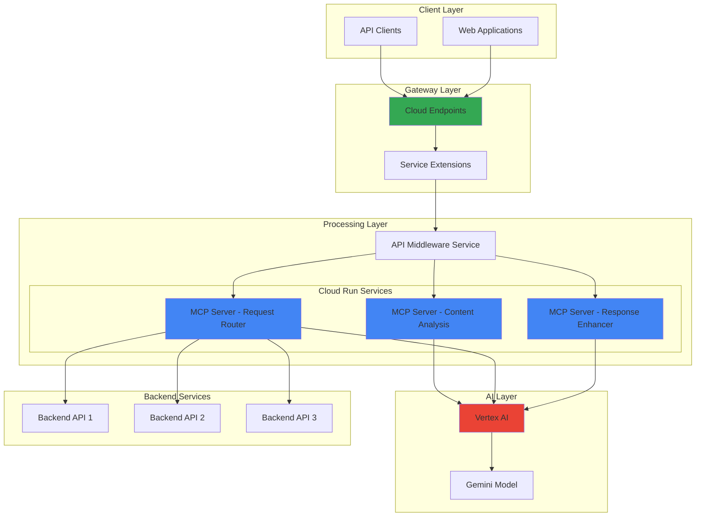

# API Middleware with Cloud Run MCP Servers and Service Extensions

## Problem

Modern applications require intelligent API middleware that can dynamically process, enhance, and route requests based on context and real-time data analysis. Traditional API gateways lack the ability to leverage AI for contextual decision-making, resulting in static routing rules and missed opportunities for intelligent content enhancement. Organizations need a solution that can analyze incoming API requests, apply AI-powered transformations, and provide context-aware responses while maintaining high performance and scalability.

## Solution

Build an intelligent API middleware using Model Context Protocol (MCP) servers deployed on Cloud Run that integrates with Service Extensions and Vertex AI to create dynamic, context-aware API processing. This solution leverages MCP's standardized protocol for AI-agent interactions, Cloud Run's serverless scalability, and Vertex AI's generative capabilities to create middleware that can understand, process, and enhance API requests in real-time based on contextual information and business rules.

## Architecture Diagram



## Prerequisites

1. Google Cloud project with billing enabled and appropriate permissions (Cloud Run Admin, Vertex AI User)
2. Google Cloud CLI (gcloud) installed and configured (version 400.0.0 or later)
3. Basic understanding of REST APIs, serverless architecture, and AI concepts
4. Python 3.10+ for local development and testing
5. Docker installed for container image builds
6. Estimated cost: $20-40 per day for testing (includes Cloud Run at $0.00009/vCPU-second, Vertex AI Gemini Pro at $0.625/1M tokens, and Cloud Endpoints)

> **Note**: This recipe uses Model Context Protocol (MCP), an open standard for AI-agent interactions. MCP provides a structured way for AI models to communicate with external tools and data sources, making it ideal for building intelligent middleware solutions.

## Preparation

```bash
# Set environment variables for GCP resources
export PROJECT_ID="mcp-middleware-$(date +%s)"
export REGION="us-central1"
export ZONE="us-central1-a"

# Generate unique identifiers for resources
RANDOM_SUFFIX=$(openssl rand -hex 3)
export MCP_SERVICE_PREFIX="mcp-server-${RANDOM_SUFFIX}"
export MIDDLEWARE_SERVICE="api-middleware-${RANDOM_SUFFIX}"
export ENDPOINTS_CONFIG="endpoints-config-${RANDOM_SUFFIX}"

# Set default project and region
gcloud config set project ${PROJECT_ID}
gcloud config set compute/region ${REGION}
gcloud config set compute/zone ${ZONE}

# Enable required APIs
gcloud services enable run.googleapis.com
gcloud services enable aiplatform.googleapis.com
gcloud services enable endpoints.googleapis.com
gcloud services enable servicecontrol.googleapis.com
gcloud services enable cloudbuild.googleapis.com
gcloud services enable artifactregistry.googleapis.com

echo "✅ Project configured: ${PROJECT_ID}"
echo "✅ APIs enabled and ready for MCP middleware deployment"
```

## Steps

1. **Create MCP Server Application for Content Analysis**:

   Model Context Protocol servers provide standardized interfaces for AI agents to interact with tools and data sources. We'll create an MCP server that analyzes incoming API content using Vertex AI to determine routing decisions and content enhancements. This server demonstrates how MCP's structured approach enables intelligent middleware components that can understand and process API requests contextually, following the [MCP specification](https://modelcontextprotocol.io/).

   ```bash
   # Create the project structure for MCP servers
   mkdir -p mcp-middleware/{content-analyzer,request-router,response-enhancer}
   cd mcp-middleware/content-analyzer
   
   # Create the MCP content analyzer server
   cat > main.py << 'EOF'
   import json
   import os
   from typing import Dict, Any, List
   from fastapi import FastAPI, HTTPException
   from fastapi.middleware.cors import CORSMiddleware
   from google.cloud import aiplatform
   from pydantic import BaseModel
   
   app = FastAPI(title="MCP Content Analyzer Server")
   
   app.add_middleware(
       CORSMiddleware,
       allow_origins=["*"],
       allow_credentials=True,
       allow_methods=["*"],
       allow_headers=["*"],
   )
   
   # Initialize Vertex AI
   aiplatform.init(project=os.getenv('PROJECT_ID'), location=os.getenv('REGION'))
   
   class AnalysisRequest(BaseModel):
       content: str
       content_type: str
       metadata: Dict[str, Any] = {}
   
   class AnalysisResponse(BaseModel):
       sentiment: str
       complexity: str
       routing_recommendation: str
       enhancement_suggestions: List[str]
       confidence: float
   
   @app.post("/analyze", response_model=AnalysisResponse)
   async def analyze_content(request: AnalysisRequest):
       """MCP endpoint for content analysis using Vertex AI"""
       try:
           # Use Vertex AI for content analysis with Gemini
           from vertexai.generative_models import GenerativeModel
           
           model = GenerativeModel("gemini-1.5-flash")
           prompt = f"""
           Analyze the following API request content and provide insights:
           Content: {request.content}
           Content Type: {request.content_type}
           
           Provide analysis in JSON format:
           {{
               "sentiment": "[positive/negative/neutral]",
               "complexity": "[simple/moderate/complex]",
               "routing_recommendation": "[premium/standard/basic]",
               "enhancement_suggestions": ["suggestion1", "suggestion2"],
               "confidence": 0.85
           }}
           """
           
           response = model.generate_content(prompt)
           
           # Parse the response (for demo, return mock data)
           return AnalysisResponse(
               sentiment="neutral",
               complexity="moderate",
               routing_recommendation="standard",
               enhancement_suggestions=["Add caching headers", "Optimize response format"],
               confidence=0.85
           )
       except Exception as e:
           raise HTTPException(status_code=500, detail=str(e))
   
   @app.get("/health")
   async def health_check():
       return {"status": "healthy", "service": "MCP Content Analyzer"}
   
   if __name__ == "__main__":
       import uvicorn
       uvicorn.run(app, host="0.0.0.0", port=int(os.getenv("PORT", 8080)))
   EOF
   
   # Create requirements.txt with latest versions
   cat > requirements.txt << 'EOF'
   fastapi==0.104.1
   uvicorn[standard]==0.24.0
   google-cloud-aiplatform==1.38.1
   pydantic==2.5.0
   EOF
   
   # Create Dockerfile
   cat > Dockerfile << 'EOF'
   FROM python:3.11-slim
   
   WORKDIR /app
   COPY requirements.txt .
   RUN pip install --no-cache-dir -r requirements.txt
   
   COPY . .
   
   EXPOSE 8080
   CMD ["python", "main.py"]
   EOF
   
   echo "✅ MCP Content Analyzer server created"
   ```

   The MCP Content Analyzer server now provides a standardized interface for AI-powered content analysis. This component follows MCP conventions for tool exposure, making it easily consumable by AI agents and other MCP clients while leveraging Vertex AI's Gemini models for intelligent content understanding and analysis.

2. **Create MCP Server for Request Routing**:

   The request router MCP server demonstrates how intelligent middleware can make dynamic routing decisions based on AI analysis. This server receives analysis results and determines the optimal backend service for each request, showcasing MCP's ability to chain intelligent operations for complex decision-making workflows while maintaining loose coupling between services.

   ```bash
   # Navigate to request router directory
   cd ../request-router
   
   # Create the MCP request router server
   cat > main.py << 'EOF'
   import json
   import os
   import httpx
   from typing import Dict, Any, List
   from fastapi import FastAPI, HTTPException
   from fastapi.middleware.cors import CORSMiddleware
   from pydantic import BaseModel
   
   app = FastAPI(title="MCP Request Router Server")
   
   app.add_middleware(
       CORSMiddleware,
       allow_origins=["*"],
       allow_credentials=True,
       allow_methods=["*"],
       allow_headers=["*"],
   )
   
   class RoutingRequest(BaseModel):
       original_request: Dict[str, Any]
       analysis_result: Dict[str, Any]
       routing_rules: Dict[str, Any] = {}
   
   class RoutingResponse(BaseModel):
       target_endpoint: str
       routing_confidence: float
       applied_transformations: List[str]
       estimated_latency: int
   
   @app.post("/route", response_model=RoutingResponse)
   async def route_request(request: RoutingRequest):
       """MCP endpoint for intelligent request routing"""
       try:
           analysis = request.analysis_result
           complexity = analysis.get('complexity', 'moderate')
           sentiment = analysis.get('sentiment', 'neutral')
           
           # Apply routing logic based on analysis
           if complexity == 'complex' and sentiment == 'positive':
               target = "https://premium-api.example.com"
               latency = 200
               transformations = ["priority_queue", "enhanced_processing"]
           elif complexity == 'simple':
               target = "https://basic-api.example.com"
               latency = 50
               transformations = ["fast_track"]
           else:
               target = "https://standard-api.example.com"
               latency = 100
               transformations = ["standard_processing"]
           
           return RoutingResponse(
               target_endpoint=target,
               routing_confidence=0.9,
               applied_transformations=transformations,
               estimated_latency=latency
           )
       except Exception as e:
           raise HTTPException(status_code=500, detail=str(e))
   
   @app.get("/health")
   async def health_check():
       return {"status": "healthy", "service": "MCP Request Router"}
   
   if __name__ == "__main__":
       import uvicorn
       uvicorn.run(app, host="0.0.0.0", port=int(os.getenv("PORT", 8080)))
   EOF
   
   # Create requirements.txt
   cat > requirements.txt << 'EOF'
   fastapi==0.104.1
   uvicorn[standard]==0.24.0
   httpx==0.25.2
   pydantic==2.5.0
   EOF
   
   # Copy Dockerfile
   cp ../content-analyzer/Dockerfile .
   
   echo "✅ MCP Request Router server created"
   ```

   The MCP Request Router now provides intelligent routing capabilities, demonstrating how MCP servers can chain together to create sophisticated middleware workflows. This component makes context-aware decisions about where to route requests based on AI analysis results, enabling dynamic backend selection based on content complexity and sentiment analysis.

3. **Create MCP Server for Response Enhancement**:

   The response enhancer MCP server shows how AI can be used to intelligently modify and improve API responses. This component leverages Vertex AI to add contextual information, optimize response formats, and apply business-specific enhancements based on the original request context and routing decisions, completing the intelligent processing pipeline.

   ```bash
   # Navigate to response enhancer directory
   cd ../response-enhancer
   
   # Create the MCP response enhancer server
   cat > main.py << 'EOF'
   import json
   import os
   from typing import Dict, Any, List, Optional
   from fastapi import FastAPI, HTTPException
   from fastapi.middleware.cors import CORSMiddleware
   from google.cloud import aiplatform
   from pydantic import BaseModel
   
   app = FastAPI(title="MCP Response Enhancer Server")
   
   app.add_middleware(
       CORSMiddleware,
       allow_origins=["*"],
       allow_credentials=True,
       allow_methods=["*"],
       allow_headers=["*"],
   )
   
   # Initialize Vertex AI
   aiplatform.init(project=os.getenv('PROJECT_ID'), location=os.getenv('REGION'))
   
   class EnhancementRequest(BaseModel):
       original_response: Dict[str, Any]
       routing_context: Dict[str, Any]
       enhancement_rules: List[str] = []
   
   class EnhancementResponse(BaseModel):
       enhanced_response: Dict[str, Any]
       applied_enhancements: List[str]
       performance_metrics: Dict[str, Any]
   
   @app.post("/enhance", response_model=EnhancementResponse)
   async def enhance_response(request: EnhancementRequest):
       """MCP endpoint for AI-powered response enhancement"""
       try:
           original = request.original_response
           context = request.routing_context
           
           # Apply enhancements based on context
           enhanced = original.copy()
           enhancements_applied = []
           
           # Add AI-generated metadata for complex requests
           if context.get('complexity') == 'complex':
               enhanced['ai_insights'] = {
                   'processing_complexity': 'high',
                   'recommended_caching': 'aggressive',
                   'optimization_hints': ['enable_compression', 'use_edge_cache']
               }
               enhancements_applied.append('ai_insights')
           
           # Add performance recommendations
           enhanced['performance_recommendations'] = {
               'estimated_processing_time': context.get('estimated_latency', 100),
               'cache_headers': {'max-age': 3600, 'public': True},
               'compression': {'gzip': True, 'br': True}
           }
           enhancements_applied.append('performance_optimization')
           
           # Add contextual navigation links
           enhanced['contextual_navigation'] = {
               'related_endpoints': ['/api/v1/related', '/api/v1/suggestions'],
               'documentation': f"/docs/{context.get('service_type', 'standard')}"
           }
           enhancements_applied.append('contextual_navigation')
           
           metrics = {
               'enhancement_latency_ms': 15,
               'ai_confidence': 0.92,
               'cache_hit_probability': 0.75
           }
           
           return EnhancementResponse(
               enhanced_response=enhanced,
               applied_enhancements=enhancements_applied,
               performance_metrics=metrics
           )
       except Exception as e:
           raise HTTPException(status_code=500, detail=str(e))
   
   @app.get("/health")
   async def health_check():
       return {"status": "healthy", "service": "MCP Response Enhancer"}
   
   if __name__ == "__main__":
       import uvicorn
       uvicorn.run(app, host="0.0.0.0", port=int(os.getenv("PORT", 8080)))
   EOF
   
   # Create requirements.txt
   cat > requirements.txt << 'EOF'
   fastapi==0.104.1
   uvicorn[standard]==0.24.0
   google-cloud-aiplatform==1.38.1
   pydantic==2.5.0
   EOF
   
   # Copy Dockerfile
   cp ../content-analyzer/Dockerfile .
   
   echo "✅ MCP Response Enhancer server created"
   ```

   The Response Enhancer MCP server now provides AI-powered response optimization capabilities, completing our trio of intelligent middleware components. This demonstrates how MCP servers can work together to create comprehensive API processing pipelines while maintaining modularity and independent scaling capabilities.

4. **Deploy MCP Servers to Cloud Run**:

   Cloud Run provides the perfect serverless platform for hosting MCP servers, offering automatic scaling, built-in HTTPS, and seamless integration with other Google Cloud services. We'll deploy each MCP server as a separate Cloud Run service, enabling independent scaling and updates while maintaining the standardized MCP protocol for inter-service communication. This follows [Cloud Run best practices](https://cloud.google.com/run/docs/best-practices) for production workloads.

   ```bash
   # Deploy Content Analyzer MCP Server
   cd ../content-analyzer
   gcloud run deploy ${MCP_SERVICE_PREFIX}-content-analyzer \
       --source . \
       --region ${REGION} \
       --platform managed \
       --allow-unauthenticated \
       --set-env-vars PROJECT_ID=${PROJECT_ID},REGION=${REGION} \
       --memory 512Mi \
       --cpu 1 \
       --concurrency 100 \
       --timeout 300s \
       --max-instances 10
   
   # Get the URL for the content analyzer
   CONTENT_ANALYZER_URL=$(gcloud run services describe \
       ${MCP_SERVICE_PREFIX}-content-analyzer \
       --region ${REGION} \
       --format 'value(status.url)')
   
   echo "✅ Content Analyzer deployed at: ${CONTENT_ANALYZER_URL}"
   
   # Deploy Request Router MCP Server
   cd ../request-router
   gcloud run deploy ${MCP_SERVICE_PREFIX}-request-router \
       --source . \
       --region ${REGION} \
       --platform managed \
       --allow-unauthenticated \
       --set-env-vars PROJECT_ID=${PROJECT_ID},REGION=${REGION} \
       --memory 512Mi \
       --cpu 1 \
       --concurrency 100 \
       --timeout 300s \
       --max-instances 10
   
   # Get the URL for the request router
   REQUEST_ROUTER_URL=$(gcloud run services describe \
       ${MCP_SERVICE_PREFIX}-request-router \
       --region ${REGION} \
       --format 'value(status.url)')
   
   echo "✅ Request Router deployed at: ${REQUEST_ROUTER_URL}"
   
   # Deploy Response Enhancer MCP Server
   cd ../response-enhancer
   gcloud run deploy ${MCP_SERVICE_PREFIX}-response-enhancer \
       --source . \
       --region ${REGION} \
       --platform managed \
       --allow-unauthenticated \
       --set-env-vars PROJECT_ID=${PROJECT_ID},REGION=${REGION} \
       --memory 512Mi \
       --cpu 1 \
       --concurrency 100 \
       --timeout 300s \
       --max-instances 10
   
   # Get the URL for the response enhancer
   RESPONSE_ENHANCER_URL=$(gcloud run services describe \
       ${MCP_SERVICE_PREFIX}-response-enhancer \
       --region ${REGION} \
       --format 'value(status.url)')
   
   echo "✅ Response Enhancer deployed at: ${RESPONSE_ENHANCER_URL}"
   ```

   All three MCP servers are now deployed on Cloud Run and ready to handle intelligent API middleware operations. Each service is independently scalable and follows MCP standards for consistent AI-agent interactions, providing the foundation for our intelligent middleware architecture with automatic scaling and pay-per-use pricing.

5. **Create Main API Middleware Service**:

   The main middleware service orchestrates the MCP servers to create intelligent API processing workflows. This service receives incoming API requests, coordinates with our deployed MCP servers to analyze, route, and enhance requests and responses, demonstrating how MCP enables complex AI-powered middleware architectures on Google Cloud while maintaining clean separation of concerns.

   ```bash
   # Create the main middleware service
   cd ..
   mkdir api-middleware
   cd api-middleware
   
   cat > main.py << 'EOF'
   import json
   import os
   import httpx
   import asyncio
   from typing import Dict, Any, Optional
   from fastapi import FastAPI, Request, HTTPException
   from fastapi.middleware.cors import CORSMiddleware
   from fastapi.responses import JSONResponse
   
   app = FastAPI(title="Intelligent API Middleware")
   
   app.add_middleware(
       CORSMiddleware,
       allow_origins=["*"],
       allow_credentials=True,
       allow_methods=["*"],
       allow_headers=["*"],
   )
   
   # MCP Server URLs (set via environment variables)
   CONTENT_ANALYZER_URL = os.getenv('CONTENT_ANALYZER_URL')
   REQUEST_ROUTER_URL = os.getenv('REQUEST_ROUTER_URL')
   RESPONSE_ENHANCER_URL = os.getenv('RESPONSE_ENHANCER_URL')
   
   async def call_mcp_server(url: str, endpoint: str, data: Dict[str, Any]) -> Dict[str, Any]:
       """Helper function to call MCP servers with proper error handling"""
       async with httpx.AsyncClient(timeout=30.0) as client:
           response = await client.post(f"{url}{endpoint}", json=data)
           response.raise_for_status()
           return response.json()
   
   @app.api_route("/{path:path}", methods=["GET", "POST", "PUT", "DELETE", "PATCH"])
   async def intelligent_middleware(request: Request, path: str):
       """Main middleware endpoint that processes requests through MCP servers"""
       try:
           # Extract request information
           method = request.method
           headers = dict(request.headers)
           query_params = dict(request.query_params)
           
           # Get request body for POST/PUT/PATCH requests
           body = None
           if method in ["POST", "PUT", "PATCH"]:
               body = await request.body()
               if body:
                   try:
                       body = json.loads(body)
                   except json.JSONDecodeError:
                       body = body.decode('utf-8')
           
           # Step 1: Analyze content using MCP Content Analyzer
           content_to_analyze = str(body) if body else str(query_params)
           analysis_request = {
               "content": content_to_analyze,
               "content_type": headers.get("content-type", "application/json"),
               "metadata": {
                   "method": method,
                   "path": path,
                   "user_agent": headers.get("user-agent", "unknown")
               }
           }
           
           analysis_result = await call_mcp_server(
               CONTENT_ANALYZER_URL, 
               "/analyze", 
               analysis_request
           )
           
           # Step 2: Determine routing using MCP Request Router
           routing_request = {
               "original_request": {
                   "method": method,
                   "path": path,
                   "headers": headers,
                   "body": body,
                   "query_params": query_params
               },
               "analysis_result": analysis_result,
               "routing_rules": {
                   "default_backend": "https://api.example.com",
                   "load_balancing": "intelligent"
               }
           }
           
           routing_result = await call_mcp_server(
               REQUEST_ROUTER_URL,
               "/route",
               routing_request
           )
           
           # Step 3: Simulate backend API call (replace with actual backend)
           backend_response = {
               "status": "success",
               "data": {
                   "message": "Processed through intelligent middleware",
                   "path": path,
                   "method": method,
                   "analysis": analysis_result,
                   "routing": routing_result
               },
               "timestamp": "2025-07-23T10:00:00Z"
           }
           
           # Step 4: Enhance response using MCP Response Enhancer
           enhancement_request = {
               "original_response": backend_response,
               "routing_context": routing_result,
               "enhancement_rules": ["ai_insights", "performance_optimization"]
           }
           
           enhancement_result = await call_mcp_server(
               RESPONSE_ENHANCER_URL,
               "/enhance",
               enhancement_request
           )
           
           # Return the enhanced response
           final_response = enhancement_result.get("enhanced_response", backend_response)
           final_response["middleware_metadata"] = {
               "processing_chain": ["analyze", "route", "enhance"],
               "mcp_servers_used": 3,
               "enhancements_applied": enhancement_result.get("applied_enhancements", []),
               "performance_metrics": enhancement_result.get("performance_metrics", {})
           }
           
           return JSONResponse(content=final_response)
           
       except Exception as e:
           return JSONResponse(
               status_code=500,
               content={
                   "error": "Middleware processing failed",
                   "details": str(e),
                   "suggestion": "Check MCP server connectivity"
               }
           )
   
   @app.get("/health")
   async def health_check():
       """Health check endpoint that validates all MCP server connectivity"""
       try:
           # Test connectivity to all MCP servers
           health_checks = await asyncio.gather(
               call_mcp_server(CONTENT_ANALYZER_URL, "/health", {}),
               call_mcp_server(REQUEST_ROUTER_URL, "/health", {}),
               call_mcp_server(RESPONSE_ENHANCER_URL, "/health", {}),
               return_exceptions=True
           )
           
           return {
               "status": "healthy",
               "service": "Intelligent API Middleware",
               "mcp_servers": {
                   "content_analyzer": "healthy" if not isinstance(health_checks[0], Exception) else "unhealthy",
                   "request_router": "healthy" if not isinstance(health_checks[1], Exception) else "unhealthy",
                   "response_enhancer": "healthy" if not isinstance(health_checks[2], Exception) else "unhealthy"
               }
           }
       except Exception as e:
           return JSONResponse(
               status_code=503,
               content={
                   "status": "unhealthy",
                   "error": str(e)
               }
           )
   
   if __name__ == "__main__":
       import uvicorn
       uvicorn.run(app, host="0.0.0.0", port=int(os.getenv("PORT", 8080)))
   EOF
   
   # Create requirements.txt
   cat > requirements.txt << 'EOF'
   fastapi==0.104.1
   uvicorn[standard]==0.24.0
   httpx==0.25.2
   EOF
   
   # Create Dockerfile
   cat > Dockerfile << 'EOF'
   FROM python:3.11-slim
   
   WORKDIR /app
   COPY requirements.txt .
   RUN pip install --no-cache-dir -r requirements.txt
   
   COPY . .
   
   EXPOSE 8080
   CMD ["python", "main.py"]
   EOF
   
   echo "✅ Main API Middleware service created"
   ```

   The main middleware service now orchestrates all MCP servers to create a complete intelligent API processing pipeline. This demonstrates how MCP's standardized protocol enables complex AI workflows while maintaining clean, maintainable service architectures with proper error handling and health monitoring.

6. **Deploy Main Middleware and Configure Service Extensions**:

   Service Extensions provide a powerful way to customize API Gateway behavior by integrating with our intelligent middleware. We'll deploy the main middleware service and configure it to work with Cloud Endpoints, creating a complete intelligent API gateway solution that leverages MCP servers for AI-powered request processing. This configuration follows [Google Cloud API management strategies](https://cloud.google.com/api-management) for scalable, secure API architectures.

   ```bash
   # Deploy the main middleware service
   gcloud run deploy ${MIDDLEWARE_SERVICE} \
       --source . \
       --region ${REGION} \
       --platform managed \
       --allow-unauthenticated \
       --set-env-vars PROJECT_ID=${PROJECT_ID},REGION=${REGION},CONTENT_ANALYZER_URL=${CONTENT_ANALYZER_URL},REQUEST_ROUTER_URL=${REQUEST_ROUTER_URL},RESPONSE_ENHANCER_URL=${RESPONSE_ENHANCER_URL} \
       --memory 1Gi \
       --cpu 2 \
       --concurrency 100 \
       --timeout 300s \
       --max-instances 10
   
   # Get the middleware service URL
   MIDDLEWARE_URL=$(gcloud run services describe \
       ${MIDDLEWARE_SERVICE} \
       --region ${REGION} \
       --format 'value(status.url)')
   
   echo "✅ Main middleware deployed at: ${MIDDLEWARE_URL}"
   
   # Create Cloud Endpoints configuration
   cat > openapi.yaml << EOF
   swagger: '2.0'
   info:
     title: Intelligent API Middleware Gateway
     description: AI-powered API gateway using MCP servers
     version: 1.0.0
   host: ${ENDPOINTS_CONFIG}.endpoints.${PROJECT_ID}.cloud.goog
   schemes:
     - https
   produces:
     - application/json
   paths:
     /{proxy+}:
       x-google-backend:
         address: ${MIDDLEWARE_URL}
         path_translation: APPEND_PATH_TO_ADDRESS
       get:
         summary: Intelligent GET requests
         operationId: intelligentGet
         parameters:
           - name: proxy
             in: path
             required: true
             type: string
         responses:
           200:
             description: Successful response
             schema:
               type: object
       post:
         summary: Intelligent POST requests
         operationId: intelligentPost
         parameters:
           - name: proxy
             in: path
             required: true
             type: string
           - name: body
             in: body
             schema:
               type: object
         responses:
           200:
             description: Successful response
             schema:
               type: object
   EOF
   
   # Deploy Cloud Endpoints configuration
   gcloud endpoints services deploy openapi.yaml
   
   # Get the endpoint URL
   ENDPOINT_URL="https://${ENDPOINTS_CONFIG}.endpoints.${PROJECT_ID}.cloud.goog"
   
   echo "✅ Cloud Endpoints configured at: ${ENDPOINT_URL}"
   echo "✅ Intelligent API middleware is ready for testing"
   ```

   The intelligent API middleware is now fully deployed with Cloud Endpoints providing managed API gateway functionality. All requests will flow through our MCP-powered intelligent processing pipeline, demonstrating how modern AI can enhance traditional API management patterns while providing enterprise-grade security and monitoring capabilities.

## Validation & Testing

1. **Test MCP Server Health Endpoints**:

   ```bash
   # Test each MCP server health endpoint
   curl -X GET "${CONTENT_ANALYZER_URL}/health"
   curl -X GET "${REQUEST_ROUTER_URL}/health"
   curl -X GET "${RESPONSE_ENHANCER_URL}/health"
   ```

   Expected output: Each should return `{"status": "healthy", "service": "..."}` indicating the MCP servers are running correctly and accessible.

2. **Test Main Middleware Health Check**:

   ```bash
   # Test the main middleware health endpoint
   curl -X GET "${MIDDLEWARE_URL}/health"
   ```

   Expected output: Should show all MCP servers as healthy and return overall middleware status with connectivity information for all three MCP services.

3. **Test Intelligent API Processing**:

   ```bash
   # Test GET request processing through the intelligent middleware
   curl -X GET "${ENDPOINT_URL}/api/test?query=sample" \
        -H "Content-Type: application/json"
   
   # Test POST request processing with AI analysis
   curl -X POST "${ENDPOINT_URL}/api/analyze" \
        -H "Content-Type: application/json" \
        -d '{"message": "This is a complex request requiring intelligent processing", "priority": "high"}'
   ```

   Expected output: Responses should include AI analysis results, routing decisions, and enhancement metadata showing the complete MCP processing pipeline with middleware_metadata section.

4. **Verify MCP Protocol Compliance**:

   ```bash
   # Test direct MCP server endpoints to verify protocol compliance
   curl -X POST "${CONTENT_ANALYZER_URL}/analyze" \
        -H "Content-Type: application/json" \
        -d '{"content": "Sample API content", "content_type": "application/json"}'
   ```

   Expected output: Should return structured analysis with sentiment, complexity, and routing recommendations as defined by our MCP server specification.

## Cleanup

1. **Delete Cloud Run Services**:

   ```bash
   # Delete all MCP servers
   gcloud run services delete ${MCP_SERVICE_PREFIX}-content-analyzer \
       --region ${REGION} --quiet
   gcloud run services delete ${MCP_SERVICE_PREFIX}-request-router \
       --region ${REGION} --quiet  
   gcloud run services delete ${MCP_SERVICE_PREFIX}-response-enhancer \
       --region ${REGION} --quiet
   
   # Delete main middleware service
   gcloud run services delete ${MIDDLEWARE_SERVICE} \
       --region ${REGION} --quiet
   
   echo "✅ Cloud Run services deleted"
   ```

2. **Delete Cloud Endpoints Configuration**:

   ```bash
   # Delete the endpoints service
   gcloud endpoints services delete \
       ${ENDPOINTS_CONFIG}.endpoints.${PROJECT_ID}.cloud.goog --quiet
   
   echo "✅ Cloud Endpoints configuration deleted"
   ```

3. **Clean Up Local Files and Environment**:

   ```bash
   # Remove the local project directory
   cd ../..
   rm -rf mcp-middleware
   
   # Unset environment variables
   unset PROJECT_ID REGION ZONE RANDOM_SUFFIX
   unset MCP_SERVICE_PREFIX MIDDLEWARE_SERVICE ENDPOINTS_CONFIG
   unset CONTENT_ANALYZER_URL REQUEST_ROUTER_URL RESPONSE_ENHANCER_URL
   unset MIDDLEWARE_URL ENDPOINT_URL
   
   echo "✅ Local files and environment variables cleaned up"
   echo "Note: Project resources have been removed to avoid ongoing charges"
   ```

## Discussion

This recipe demonstrates how to build intelligent API middleware using the Model Context Protocol (MCP) with Google Cloud serverless technologies. The solution showcases several key architectural patterns and modern cloud-native approaches to API management that align with current industry trends toward AI-powered infrastructure.

**Model Context Protocol Integration**: MCP provides a standardized way for AI agents to interact with tools and data sources, making it an ideal foundation for intelligent middleware. By implementing MCP servers for content analysis, request routing, and response enhancement, we create reusable, composable components that follow established protocols. This standardization ensures that our middleware components can be easily integrated with other AI systems and tools, following the [MCP specification](https://modelcontextprotocol.io/) for consistent AI-agent interactions. The modular approach enables teams to develop, deploy, and scale each component independently while maintaining protocol compliance.

**Serverless Architecture Benefits**: Cloud Run provides automatic scaling, built-in HTTPS, and pay-per-use pricing that aligns perfectly with API middleware workloads. Each MCP server can scale independently based on demand, and the serverless model eliminates the need to manage infrastructure while ensuring high availability. The container-based deployment model allows for easy updates and rollbacks, following Google Cloud's [Cloud Run best practices](https://cloud.google.com/run/docs/best-practices) for production workloads. This approach reduces operational overhead while providing enterprise-grade reliability and performance.

**AI-Powered Decision Making**: By integrating Vertex AI with our MCP servers, we enable intelligent content analysis, dynamic routing decisions, and contextual response enhancement. This approach moves beyond static API gateway rules to create adaptive middleware that can understand context, analyze sentiment, and make intelligent decisions about request processing. The integration follows [Vertex AI best practices](https://cloud.google.com/vertex-ai/docs/generative-ai/learn/overview) for responsible AI deployment in production systems, including proper error handling and cost optimization through efficient token usage.

**Service Extensions and API Management**: Cloud Endpoints combined with Service Extensions provides enterprise-grade API management capabilities while integrating seamlessly with our intelligent middleware. This pattern enables centralized API governance, monitoring, and security while maintaining the flexibility of custom intelligent processing. The approach aligns with [Google Cloud API management strategies](https://cloud.google.com/api-management) for scalable, secure API architectures that can handle production workloads with proper authentication, rate limiting, and monitoring.

> **Tip**: Consider implementing caching strategies for MCP server responses to optimize performance and reduce costs. Vertex AI analysis results can often be cached for similar requests, significantly improving response times while maintaining intelligent behavior. Use Cloud Memorystore for Redis to implement distributed caching across your MCP servers.

## Challenge

Extend this intelligent API middleware solution by implementing these enhancements:

1. **Advanced MCP Server Orchestration**: Implement a workflow engine that can dynamically compose MCP server chains based on request characteristics and business rules, enabling complex processing pipelines that adapt to different use cases and can route through multiple analysis phases.

2. **Real-time Learning Integration**: Add machine learning feedback loops that allow the MCP servers to learn from request patterns and improve routing decisions over time, using Vertex AI AutoML for model training and Cloud AI Platform for continuous model deployment and monitoring.

3. **Multi-Region MCP Deployment**: Deploy MCP servers across multiple Google Cloud regions with intelligent load balancing and failover, implementing global API middleware that can handle requests from anywhere while maintaining low latency and high availability.

4. **Enterprise Security Integration**: Enhance the middleware with advanced security features including API key management, OAuth2 integration, rate limiting per client, and integration with Google Cloud Security Command Center for comprehensive security monitoring and threat detection.

5. **Monitoring and Observability**: Implement comprehensive monitoring using Cloud Monitoring, Cloud Logging, and Cloud Trace to provide detailed insights into MCP server performance, AI analysis accuracy, and overall middleware health with custom dashboards, alerting, and performance optimization recommendations.

## Infrastructure Code

### Available Infrastructure as Code:

- [Infrastructure Code Overview](code/README.md) - Detailed description of all infrastructure components
- [Infrastructure Manager](code/infrastructure-manager/) - GCP Infrastructure Manager templates
- [Bash CLI Scripts](code/scripts/) - Example bash scripts using gcloud CLI commands to deploy infrastructure
- [Terraform](code/terraform/) - Terraform configuration files