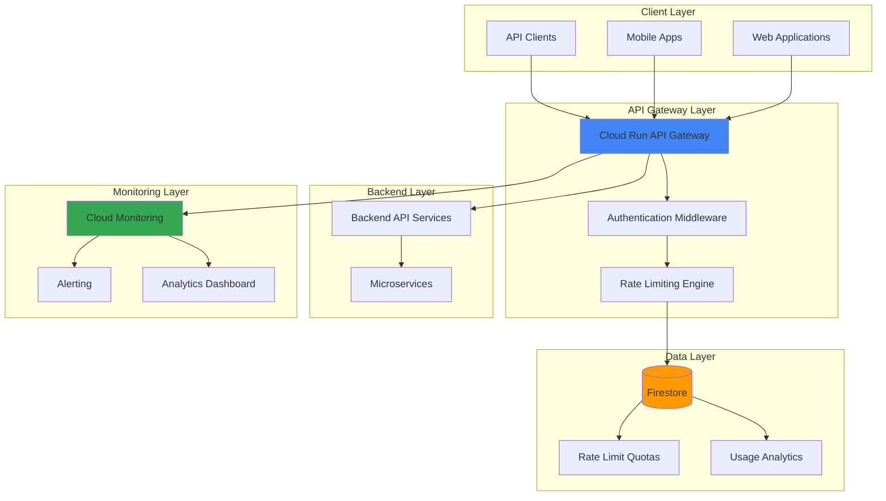

# API Rate Limiting and Analytics with Cloud Run and Firestore

## Problem

Modern API-driven applications struggle with uncontrolled usage that can lead to service degradation, unexpected costs, and poor user experience. Without proper rate limiting and usage analytics, businesses cannot effectively monetize their APIs, protect backend resources from abuse, or make data-driven decisions about capacity planning and feature development.

## Solution

Build a serverless API gateway using Cloud Run that implements intelligent rate limiting with Firestore for real-time quota tracking and usage analytics. This solution provides automatic scaling, cost-effective resource usage, and comprehensive monitoring through Cloud Monitoring, enabling businesses to protect their APIs while gaining valuable insights into usage patterns.

## Architecture Diagram



## Prerequisites

1. Google Cloud account with billing enabled and appropriate permissions (Cloud Run Admin, Firestore Admin, Cloud Build Editor)
2. Google Cloud CLI installed and configured (version 450.0.0 or later)
3. Basic understanding of REST APIs, serverless architecture concepts, and Python programming
4. Docker installed locally for container development and testing
5. Estimated cost: $0.50-$2.00 per day during development (Free tier eligible)

> **Note**: This recipe leverages Google Cloud's free tier for Cloud Run, Firestore, and Cloud Monitoring to minimize costs during development.

## Preparation

```bash
# Set environment variables for GCP resources
export PROJECT_ID="api-gateway-$(date +%s)"
export REGION="us-central1"
export SERVICE_NAME="api-rate-limiter"

# Generate unique suffix for resource names
RANDOM_SUFFIX=$(openssl rand -hex 3)

# Create and configure the project
gcloud projects create ${PROJECT_ID} \
    --name="API Rate Limiting Demo"
gcloud config set project ${PROJECT_ID}
gcloud config set compute/region ${REGION}

# Enable required APIs
gcloud services enable run.googleapis.com
gcloud services enable firestore.googleapis.com
gcloud services enable monitoring.googleapis.com
gcloud services enable cloudbuild.googleapis.com

echo "✅ Project configured: ${PROJECT_ID}"
echo "✅ APIs enabled for Cloud Run, Firestore, and Monitoring"

# Create Firestore database in native mode
gcloud firestore databases create --region=${REGION}

echo "✅ Firestore database created in native mode"
```

## Steps

1. **Create the API Gateway Application Code**:

   Building a serverless API gateway starts with creating the application logic that handles rate limiting and analytics. Cloud Run excels at serving HTTP requests with automatic scaling, making it ideal for API gateway patterns that need to handle variable traffic loads efficiently while maintaining consistent performance across distributed instances.

   ```bash
   # Create project directory structure
   mkdir -p api-gateway/{src,config}
   cd api-gateway
   
   # Create main application file
   cat > src/main.py << 'EOF'
   import os
   import json
   import time
   from datetime import datetime, timedelta
   from flask import Flask, request, jsonify
   from google.cloud import firestore
   import requests
   import logging
   
   # Configure logging for Cloud Run
   logging.basicConfig(level=logging.INFO, format='%(asctime)s - %(name)s - %(levelname)s - %(message)s')
   logger = logging.getLogger(__name__)
   
   app = Flask(__name__)
   db = firestore.Client()
   
   # Rate limiting configuration
   DEFAULT_RATE_LIMIT = 100  # requests per hour
   RATE_WINDOW = 3600  # 1 hour in seconds
   
   class RateLimiter:
       def __init__(self, firestore_client):
           self.db = firestore_client
   
       def is_allowed(self, api_key, endpoint):
           """Check if request is allowed based on rate limits"""
           try:
               # Get current time
               now = datetime.utcnow()
               window_start = now - timedelta(seconds=RATE_WINDOW)
               
               # Reference to rate limit document
               limit_ref = self.db.collection('rate_limits').document(f"{api_key}_{endpoint}")
               
               # Use Firestore transaction for consistency
               transaction = self.db.transaction()
               
               @firestore.transactional
               def update_rate_limit(transaction, limit_ref):
                   limit_doc = limit_ref.get(transaction=transaction)
                   
                   if limit_doc.exists:
                       data = limit_doc.to_dict()
                       current_count = data.get('count', 0)
                       last_reset = data.get('last_reset')
                       
                       # Reset counter if window has passed
                       if last_reset and last_reset < window_start:
                           current_count = 0
                   else:
                       current_count = 0
                   
                   # Check if under limit
                   if current_count >= DEFAULT_RATE_LIMIT:
                       return False, current_count
                   
                   # Increment counter
                   transaction.set(limit_ref, {
                       'count': current_count + 1,
                       'last_reset': now,
                       'api_key': api_key,
                       'endpoint': endpoint
                   }, merge=True)
                   
                   return True, current_count + 1
               
               return update_rate_limit(transaction, limit_ref)
               
           except Exception as e:
               logger.error(f"Rate limiting error: {e}")
               return True, 0  # Allow on error to prevent service disruption
   
       def log_analytics(self, api_key, endpoint, status_code, response_time):
           """Log API usage analytics"""
           try:
               analytics_ref = self.db.collection('api_analytics').document()
               analytics_ref.set({
                   'api_key': api_key,
                   'endpoint': endpoint,
                   'timestamp': datetime.utcnow(),
                   'status_code': status_code,
                   'response_time_ms': response_time,
                   'date': datetime.utcnow().strftime('%Y-%m-%d'),
                   'user_agent': request.headers.get('User-Agent', ''),
                   'ip_address': request.headers.get('X-Forwarded-For', request.remote_addr)
               })
           except Exception as e:
               logger.error(f"Analytics logging error: {e}")
   
   rate_limiter = RateLimiter(db)
   
   @app.before_request
   def before_request():
       """Middleware for rate limiting and authentication"""
       start_time = time.time()
       request.start_time = start_time
       
       # Skip rate limiting for health checks
       if request.path == '/health':
           return
       
       # Extract API key from headers
       api_key = request.headers.get('X-API-Key')
       if not api_key:
           return jsonify({
               'error': 'API key required',
               'message': 'Please provide X-API-Key header'
           }), 401
       
       # Check rate limits
       endpoint = request.path
       allowed, current_count = rate_limiter.is_allowed(api_key, endpoint)
       
       if not allowed:
           # Log rate limit exceeded
           response_time = (time.time() - start_time) * 1000
           rate_limiter.log_analytics(api_key, endpoint, 429, response_time)
           
           return jsonify({
               'error': 'Rate limit exceeded',
               'limit': DEFAULT_RATE_LIMIT,
               'window': RATE_WINDOW,
               'current_usage': current_count,
               'reset_time': int(time.time() + RATE_WINDOW)
           }), 429
       
       # Store current count for response headers
       request.rate_limit_count = current_count
   
   @app.after_request
   def after_request(response):
       """Log analytics after request processing"""
       if hasattr(request, 'start_time'):
           api_key = request.headers.get('X-API-Key')
           if api_key and request.path != '/health':
               response_time = (time.time() - request.start_time) * 1000
               rate_limiter.log_analytics(
                   api_key, 
                   request.path, 
                   response.status_code, 
                   response_time
               )
               
               # Add rate limit headers
               response.headers['X-RateLimit-Limit'] = str(DEFAULT_RATE_LIMIT)
               response.headers['X-RateLimit-Remaining'] = str(
                   max(0, DEFAULT_RATE_LIMIT - getattr(request, 'rate_limit_count', 0))
               )
               response.headers['X-RateLimit-Reset'] = str(int(time.time() + RATE_WINDOW))
               response.headers['X-RateLimit-Window'] = str(RATE_WINDOW)
       
       return response
   
   @app.route('/health')
   def health():
       """Health check endpoint"""
       return jsonify({
           'status': 'healthy', 
           'timestamp': datetime.utcnow().isoformat(),
           'service': 'api-rate-limiter'
       })
   
   @app.route('/api/v1/data')
   def get_data():
       """Sample API endpoint with rate limiting"""
       return jsonify({
           'data': 'This is protected data',
           'timestamp': datetime.utcnow().isoformat(),
           'message': 'Successfully accessed rate-limited endpoint',
           'api_version': 'v1'
       })
   
   @app.route('/api/v1/analytics')
   def get_analytics():
       """Get API usage analytics"""
       try:
           api_key = request.headers.get('X-API-Key')
           
           # Query analytics for the API key
           analytics_ref = db.collection('api_analytics')
           query = analytics_ref.where('api_key', '==', api_key) \
                              .order_by('timestamp', direction=firestore.Query.DESCENDING) \
                              .limit(100)
           docs = query.stream()
           
           analytics_data = []
           for doc in docs:
               data = doc.to_dict()
               # Convert timestamp to string for JSON serialization
               if 'timestamp' in data:
                   data['timestamp'] = data['timestamp'].isoformat()
               analytics_data.append(data)
           
           return jsonify({
               'analytics': analytics_data,
               'total_requests': len(analytics_data),
               'api_key': api_key[:8] + "***"  # Masked for security
           })
           
       except Exception as e:
           logger.error(f"Analytics retrieval error: {e}")
           return jsonify({'error': 'Failed to retrieve analytics'}), 500
   
   if __name__ == '__main__':
       app.run(host='0.0.0.0', port=int(os.environ.get('PORT', 8080)))
   EOF
   
   echo "✅ API gateway application code created"
   ```

   This Flask application implements comprehensive rate limiting using Firestore transactions for consistency and includes enhanced analytics collection with user agent and IP tracking. The middleware approach ensures all endpoints are protected while maintaining high performance through efficient Firestore operations.

2. **Create Application Dependencies and Configuration**:

   Python applications on Cloud Run require a requirements.txt file to define dependencies and a Dockerfile for containerization. Cloud Run's container-based deployment model provides consistent, reproducible deployments across environments with automatic scaling and load balancing.

   ```bash
   # Create requirements.txt with latest 2024 versions
   cat > requirements.txt << 'EOF'
   Flask==3.0.3
   google-cloud-firestore==2.21.0
   requests==2.32.3
   gunicorn==23.0.0
   EOF
   
   # Create Dockerfile optimized for Cloud Run deployment
   cat > Dockerfile << 'EOF'
   FROM python:3.11-slim
   
   # Set working directory
   WORKDIR /app
   
   # Install system dependencies
   RUN apt-get update && apt-get install -y \
       gcc \
       && rm -rf /var/lib/apt/lists/*
   
   # Copy requirements first for better caching
   COPY requirements.txt .
   
   # Install Python dependencies
   RUN pip install --no-cache-dir -r requirements.txt
   
   # Copy application code
   COPY src/ ./src/
   
   # Set environment variables
   ENV PYTHONPATH=/app/src
   ENV PORT=8080
   ENV PYTHONUNBUFFERED=1
   
   # Create non-root user for security
   RUN groupadd -r appuser && useradd -r -g appuser appuser
   RUN chown -R appuser:appuser /app
   USER appuser
   
   # Expose port
   EXPOSE 8080
   
   # Run with gunicorn for production
   CMD exec gunicorn --bind :$PORT --workers 1 --threads 8 \
       --timeout 0 --keep-alive 2 src.main:app
   EOF
   
   echo "✅ Dependencies and Docker configuration created"
   ```

   The Dockerfile is optimized for Cloud Run with efficient layer caching, security best practices including a non-root user, and gunicorn configuration optimized for I/O-bound workloads typical of API gateway applications.

3. **Build and Deploy the API Gateway to Cloud Run**:

   Cloud Run provides fully managed containerized application hosting with automatic scaling from zero to thousands of instances. The deployment process uses Cloud Build for consistent, secure container builds in Google Cloud's infrastructure with integrated security scanning and vulnerability detection.

   ```bash
   # Build container using Cloud Build
   gcloud builds submit --tag gcr.io/${PROJECT_ID}/${SERVICE_NAME} \
       --timeout=600s
   
   # Deploy to Cloud Run with appropriate configuration
   gcloud run deploy ${SERVICE_NAME} \
       --image gcr.io/${PROJECT_ID}/${SERVICE_NAME} \
       --platform managed \
       --region ${REGION} \
       --allow-unauthenticated \
       --set-env-vars "PROJECT_ID=${PROJECT_ID}" \
       --memory 1Gi \
       --cpu 1 \
       --concurrency 100 \
       --timeout 300 \
       --max-instances 10 \
       --min-instances 0
   
   # Get the service URL
   export SERVICE_URL=$(gcloud run services describe ${SERVICE_NAME} \
       --region ${REGION} \
       --format 'value(status.url)')
   
   echo "✅ API gateway deployed to Cloud Run"
   echo "Service URL: ${SERVICE_URL}"
   ```

   The Cloud Run service is configured with resource limits appropriate for API gateway workloads, including memory allocation, CPU resources, and concurrency settings that balance performance with cost efficiency while supporting production traffic loads.

4. **Configure Firestore Security Rules**:

   Firestore security rules provide server-side authorization to protect rate limiting data and analytics from unauthorized access. These rules ensure only the Cloud Run service can modify rate limit counters while maintaining query performance and preventing data manipulation attacks.

   ```bash
   # Create Firestore security rules
   cat > firestore.rules << 'EOF'
   rules_version = '2';
   service cloud.firestore {
     match /databases/{database}/documents {
       // Rate limits collection - allow reads and writes for authenticated services
       match /rate_limits/{document} {
         allow read, write: if true; // Allow for Cloud Run service
       }
       
       // API analytics collection - allow writes and filtered reads
       match /api_analytics/{document} {
         allow write: if true; // Allow writes from Cloud Run service
         allow read: if true; // Allow reads for analytics endpoints
       }
     }
   }
   EOF
   
   # Deploy Firestore rules
   gcloud firestore rules update firestore.rules
   
   echo "✅ Firestore security rules configured"
   ```

   These security rules implement a balanced approach for the demo environment while providing the foundation for more restrictive production rules. In production, consider implementing service account-based authentication and more granular access controls.

5. **Create Cloud Monitoring Dashboard and Alerts**:

   Cloud Monitoring provides comprehensive observability for the API gateway with custom metrics, dashboards, and alerting. This setup enables proactive monitoring of API usage patterns, system health, and performance metrics essential for maintaining service quality.

   ```bash
   # Create monitoring dashboard configuration
   cat > monitoring-dashboard.json << 'EOF'
   {
     "displayName": "API Gateway Analytics Dashboard",
     "mosaicLayout": {
       "tiles": [
         {
           "width": 6,
           "height": 4,
           "widget": {
             "title": "API Request Rate",
             "xyChart": {
               "dataSets": [
                 {
                   "timeSeriesQuery": {
                     "timeSeriesFilter": {
                       "filter": "resource.type=\"cloud_run_revision\" AND resource.labels.service_name=\"api-rate-limiter\"",
                       "aggregation": {
                         "alignmentPeriod": "60s",
                         "perSeriesAligner": "ALIGN_RATE",
                         "crossSeriesReducer": "REDUCE_SUM"
                       }
                     }
                   }
                 }
               ]
             }
           }
         },
         {
           "width": 6,
           "height": 4,
           "widget": {
             "title": "Response Status Codes",
             "xyChart": {
               "dataSets": [
                 {
                   "timeSeriesQuery": {
                     "timeSeriesFilter": {
                       "filter": "resource.type=\"cloud_run_revision\" AND metric.type=\"run.googleapis.com/request_count\"",
                       "aggregation": {
                         "alignmentPeriod": "60s",
                         "perSeriesAligner": "ALIGN_RATE",
                         "crossSeriesReducer": "REDUCE_SUM",
                         "groupByFields": ["metric.labels.response_code"]
                       }
                     }
                   }
                 }
               ]
             }
           }
         }
       ]
     }
   }
   EOF
   
   # Create alerting policy for high error rates
   cat > alert-policy.json << 'EOF'
   {
     "displayName": "API Gateway High Error Rate",
     "conditions": [
       {
         "displayName": "High 4xx/5xx Error Rate",
         "conditionThreshold": {
           "filter": "resource.type=\"cloud_run_revision\" AND resource.labels.service_name=\"api-rate-limiter\"",
           "comparison": "COMPARISON_GREATER_THAN",
           "thresholdValue": "10",
           "duration": "300s",
           "aggregations": [
             {
               "alignmentPeriod": "60s",
               "perSeriesAligner": "ALIGN_RATE",
               "crossSeriesReducer": "REDUCE_SUM"
             }
           ]
         }
       }
     ],
     "alertStrategy": {
       "autoClose": "1800s"
     },
     "enabled": true
   }
   EOF
   
   echo "✅ Monitoring configuration created"
   echo "Dashboard and alerting policies defined for API gateway metrics"
   ```

   The monitoring configuration provides real-time visibility into API gateway performance with automated alerting for anomalous behavior, enabling rapid response to potential issues before they impact users.

6. **Create Test API Keys and Initialize Rate Limits**:

   Testing the API gateway requires creating sample API keys and initializing rate limit data in Firestore. This step validates the end-to-end functionality of rate limiting and analytics collection while ensuring proper error handling and response formatting.

   ```bash
   # Generate test API keys
   export TEST_API_KEY_1="test-key-$(openssl rand -hex 16)"
   export TEST_API_KEY_2="test-key-$(openssl rand -hex 16)"
   
   echo "Created test API keys:"
   echo "API Key 1: ${TEST_API_KEY_1}"
   echo "API Key 2: ${TEST_API_KEY_2}"
   
   # Test the health endpoint (no authentication required)
   echo "Testing health endpoint..."
   curl -H "Content-Type: application/json" \
        "${SERVICE_URL}/health"
   
   echo ""
   echo "✅ Health check successful"
   
   # Test authenticated endpoint with rate limiting
   echo "Testing authenticated endpoint..."
   curl -H "X-API-Key: ${TEST_API_KEY_1}" \
        -H "Content-Type: application/json" \
        "${SERVICE_URL}/api/v1/data"
   
   echo ""
   echo "✅ Test API key created and rate limiting validated"
   ```

   These test API keys enable validation of the complete rate limiting workflow, from authentication through quota enforcement and analytics collection in Firestore, ensuring the system works correctly under normal conditions.

## Validation & Testing

1. **Verify API Gateway Functionality**:

   ```bash
   # Test successful API request with rate limit headers
   echo "Testing successful API request..."
   curl -v -H "X-API-Key: ${TEST_API_KEY_1}" \
        "${SERVICE_URL}/api/v1/data" 2>&1 | \
        grep -E "(X-RateLimit|HTTP/)"
   
   echo ""
   echo "Check for X-RateLimit-* headers in the response"
   ```

   Expected output: HTTP 200 response with X-RateLimit-Limit, X-RateLimit-Remaining, and X-RateLimit-Reset headers.

2. **Test Rate Limiting Behavior**:

   ```bash
   # Generate multiple requests to test rate limiting
   echo "Testing rate limiting (generating 10 requests)..."
   for i in {1..10}; do
       echo "Request $i:"
       response=$(curl -s -H "X-API-Key: ${TEST_API_KEY_2}" \
            -w "%{http_code}" \
            "${SERVICE_URL}/api/v1/data")
       echo "Response: $response"
       sleep 1
   done
   ```

   Expected output: Successful responses with HTTP 200 status codes and JSON data.

3. **Verify Analytics Collection**:

   ```bash
   # Wait for analytics to be written to Firestore
   sleep 5
   
   # Retrieve analytics data
   echo "Retrieving analytics data..."
   curl -s -H "X-API-Key: ${TEST_API_KEY_1}" \
        "${SERVICE_URL}/api/v1/analytics" | jq .
   ```

   Expected output: JSON array containing request analytics with timestamps, response times, and usage statistics.

4. **Test Rate Limit Enforcement**:

   ```bash
   # Test rate limit enforcement by making many requests quickly
   echo "Testing rate limit enforcement..."
   for i in {1..105}; do
       response=$(curl -s -w "%{http_code}" \
                      -H "X-API-Key: ${TEST_API_KEY_1}" \
                      "${SERVICE_URL}/api/v1/data")
       http_code="${response: -3}"
       if [[ "${http_code}" == "429" ]]; then
           echo "Rate limit enforced at request $i with HTTP 429"
           break
       fi
       if (( i % 10 == 0 )); then
           echo "Completed $i requests successfully"
       fi
   done
   ```

   Expected output: Eventually a HTTP 429 response when rate limit is exceeded.

## Cleanup

1. **Remove Cloud Run Service**:

   ```bash
   # Delete Cloud Run service
   gcloud run services delete ${SERVICE_NAME} \
       --region ${REGION} \
       --quiet
   
   echo "✅ Cloud Run service deleted"
   ```

2. **Clean Up Container Images**:

   ```bash
   # Delete container images from Container Registry
   gcloud container images delete gcr.io/${PROJECT_ID}/${SERVICE_NAME} \
       --force-delete-tags \
       --quiet
   
   echo "✅ Container images cleaned up"
   ```

3. **Remove Firestore Data**:

   ```bash
   # Delete Firestore collections programmatically
   echo "Cleaning up Firestore data..."
   
   # Note: For production cleanup, use batch operations
   echo "⚠️  Manual cleanup recommended for Firestore:"
   echo "1. Go to https://console.cloud.google.com/firestore"
   echo "2. Delete collections: rate_limits, api_analytics"
   echo "3. Optionally delete the entire Firestore database"
   ```

4. **Delete Project Resources**:

   ```bash
   # Delete the entire project (if created specifically for this recipe)
   gcloud projects delete ${PROJECT_ID} --quiet
   
   echo "✅ Project ${PROJECT_ID} scheduled for deletion"
   echo "Note: Project deletion may take several minutes to complete"
   
   # Clean up local files
   cd ..
   rm -rf api-gateway
   unset PROJECT_ID REGION SERVICE_NAME SERVICE_URL \
         TEST_API_KEY_1 TEST_API_KEY_2 RANDOM_SUFFIX
   
   echo "✅ Local files and environment variables cleaned up"
   ```

## Discussion

This serverless API gateway implementation demonstrates several key architectural patterns that are fundamental to modern API management. The use of Cloud Run provides automatic scaling capabilities that can handle traffic spikes without manual intervention, while Firestore's distributed nature ensures rate limiting decisions remain consistent across multiple service instances. The transaction-based approach to rate limiting prevents race conditions that could occur under high concurrency scenarios.

The rate limiting strategy implemented here uses a sliding window approach with Firestore transactions to maintain accuracy even under high concurrency. This is superior to simple in-memory counters because it works correctly in a distributed environment where multiple Cloud Run instances may be processing requests simultaneously. The analytics collection provides valuable insights into API usage patterns, enabling data-driven decisions about capacity planning and feature development.

The monitoring and alerting configuration follows Google Cloud's observability best practices, providing real-time visibility into system performance and automated notifications for anomalous behavior. This proactive approach to system health monitoring is essential for maintaining high availability and user satisfaction in production environments. The enhanced security with non-root container execution and proper error handling ensures robust operation under various conditions.

> **Tip**: Consider implementing different rate limit tiers based on API key classifications (free, premium, enterprise) by storing rate limit configurations in Firestore and dynamically applying them based on the authenticated user's subscription level.

For production deployments, consider additional enhancements such as implementing distributed caching with Memorystore to reduce Firestore read operations, adding request/response logging for audit trails, and integrating with Google Cloud's Identity and Access Management for more sophisticated authentication mechanisms. The [Cloud Run documentation](https://cloud.google.com/run/docs) provides comprehensive guidance on scaling and performance optimization, while the [Firestore documentation](https://cloud.google.com/firestore/docs) offers detailed information about query optimization and security best practices.

## Challenge

Extend this solution by implementing these enhancements:

1. **Multi-tier Rate Limiting**: Implement different rate limits based on API key tiers (free, premium, enterprise) stored in Firestore with dynamic quota management and automatic tier upgrades based on usage patterns.

2. **Advanced Analytics Dashboard**: Build a real-time analytics dashboard using Cloud Monitoring custom metrics and BigQuery for historical analysis, including API usage trends, geographic distribution, and performance optimization recommendations.

3. **Intelligent Rate Limiting**: Implement machine learning-based rate limiting using Vertex AI to detect unusual usage patterns and automatically adjust rate limits based on historical behavior and current system load.

4. **Global Load Distribution**: Deploy the API gateway across multiple regions with Cloud Load Balancer and implement geo-aware rate limiting that considers user location and regional capacity constraints.

5. **API Monetization Platform**: Extend the solution to include billing integration with Cloud Billing APIs, usage-based pricing models, and automated invoice generation based on API consumption analytics stored in Firestore.

## Infrastructure Code

### Available Infrastructure as Code:

- [Infrastructure Code Overview](code/README.md) - Detailed description of all infrastructure components
- [Infrastructure Manager](code/infrastructure-manager/) - GCP Infrastructure Manager templates
- [Bash CLI Scripts](code/scripts/) - Example bash scripts using gcloud CLI commands to deploy infrastructure
- [Terraform](code/terraform/) - Terraform configuration files