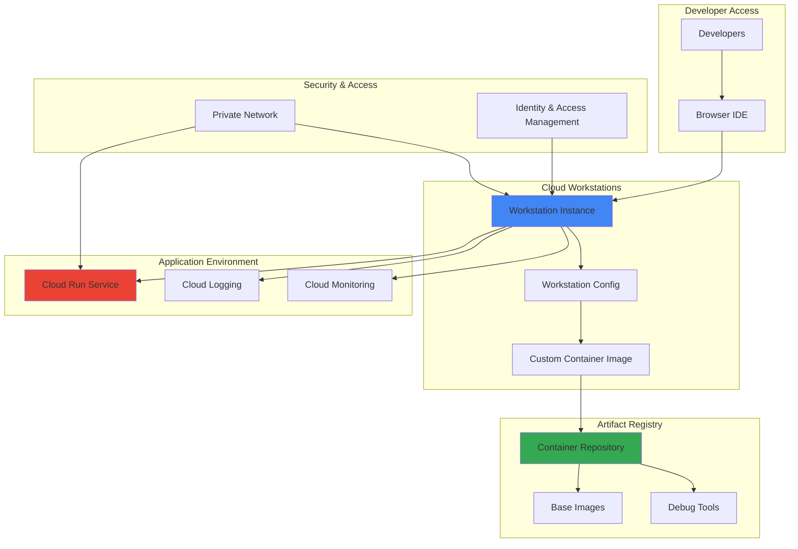

# Application Debugging Workflows with Cloud Debugger and Cloud Workstations

## Problem

Development teams struggle with debugging production applications when traditional debuggers can't access remote environments, require local development setup that doesn't match production, and lack the security controls needed for enterprise environments. Developers waste time recreating production issues locally, face security restrictions when accessing production systems, and experience inconsistent development environments that lead to "works on my machine" problems. This results in longer resolution times for critical bugs, reduced developer productivity, and increased operational overhead.

## Solution

Create secure, cloud-based debugging environments using Cloud Workstations for containerized development environments and Artifact Registry for automated artifact management. This solution provides developers with consistent, preconfigured debugging environments that can securely connect to production applications while maintaining proper access controls and audit trails. The workflow enables remote debugging capabilities through browser-based IDEs and integrated debugging tools.

## Architecture Diagram



## Prerequisites

1. Google Cloud project with billing enabled and appropriate permissions for Cloud Workstations, Artifact Registry, and Cloud Run
2. Google Cloud CLI (gcloud) installed and configured, or Cloud Shell access
3. Basic understanding of containerization, debugging concepts, and development workflows
4. Docker knowledge for custom container image creation
5. Estimated cost: $15-25 for workstation instances, $5-10 for Artifact Registry storage, $10-15 for Cloud Run during testing (total: $30-50 for full testing period)

> **Note**: Cloud Workstations provide managed development environments with built-in security and access controls, eliminating the need for local development environment setup.

## Preparation

```bash
# Set environment variables for GCP resources
export PROJECT_ID="debug-workflow-$(date +%s)"
export REGION="us-central1"
export ZONE="us-central1-a"

# Generate unique suffix for resource names
RANDOM_SUFFIX=$(openssl rand -hex 3)
export WORKSTATION_CLUSTER="debug-cluster-${RANDOM_SUFFIX}"
export WORKSTATION_CONFIG="debug-config-${RANDOM_SUFFIX}"
export REPOSITORY_NAME="debug-tools-${RANDOM_SUFFIX}"
export SERVICE_NAME="sample-app-${RANDOM_SUFFIX}"

# Set default project and region
gcloud config set project ${PROJECT_ID}
gcloud config set compute/region ${REGION}
gcloud config set compute/zone ${ZONE}

# Enable required APIs
gcloud services enable workstations.googleapis.com
gcloud services enable artifactregistry.googleapis.com
gcloud services enable run.googleapis.com
gcloud services enable cloudbuild.googleapis.com
gcloud services enable logging.googleapis.com
gcloud services enable monitoring.googleapis.com

echo "✅ Project configured: ${PROJECT_ID}"
echo "✅ Workstation cluster: ${WORKSTATION_CLUSTER}"
echo "✅ Repository: ${REPOSITORY_NAME}"
```

## Steps

1. **Create Artifact Registry Repository for Debug Tools**:

   Artifact Registry serves as the centralized repository for custom container images that include debugging tools and development dependencies. Creating a dedicated repository ensures version control, security scanning, and access management for debugging environments while enabling teams to share consistent tooling configurations.

   ```bash
   # Create Artifact Registry repository for custom debug images
   gcloud artifacts repositories create ${REPOSITORY_NAME} \
       --repository-format=docker \
       --location=${REGION} \
       --description="Repository for debugging workflow containers"
   
   # Configure Docker authentication for Artifact Registry
   gcloud auth configure-docker ${REGION}-docker.pkg.dev
   
   echo "✅ Artifact Registry repository created: ${REPOSITORY_NAME}"
   ```

   The repository is now ready to store custom container images with debugging tools. Artifact Registry provides vulnerability scanning, access controls, and integration with Cloud Workstations for seamless container image deployment.

2. **Build Custom Workstation Container Image with Debug Tools**:

   Custom container images extend base workstation images with specialized debugging tools, language runtimes, and development utilities. This approach ensures all team members have consistent debugging environments while enabling customization for specific application stacks and debugging requirements.

   ```bash
   # Create directory for custom workstation image
   mkdir -p workstation-debug-image
   cd workstation-debug-image
   
   # Create Dockerfile with debugging tools
   cat > Dockerfile << 'EOF'
FROM us-central1-docker.pkg.dev/cloud-workstations-images/predefined/code-oss:latest

# Install additional debugging tools
USER root
RUN apt-get update && apt-get install -y \
    gdb \
    strace \
    tcpdump \
    htop \
    curl \
    jq \
    python3-pip \
    nodejs \
    npm \
    && rm -rf /var/lib/apt/lists/*

# Install Python debugging tools
RUN pip3 install debugpy pdb++ ipdb

# Install Node.js debugging tools
RUN npm install -g node-inspect

# Switch back to codeoss user
USER codeoss

# Install VS Code extensions for debugging
RUN code-server --install-extension ms-python.python \
    && code-server --install-extension ms-vscode.js-debug

EXPOSE 8080
EOF
   
   # Build and push custom image to Artifact Registry
   export IMAGE_URI="${REGION}-docker.pkg.dev/${PROJECT_ID}/${REPOSITORY_NAME}/debug-workstation:latest"
   
   gcloud builds submit --tag ${IMAGE_URI} .
   
   cd ..
   
   echo "✅ Custom workstation image built and pushed: ${IMAGE_URI}"
   ```

   The custom workstation image now includes comprehensive debugging tools for multiple languages and frameworks. This containerized approach ensures reproducible environments while maintaining security isolation and access controls.

3. **Create Cloud Workstations Cluster**:

   Cloud Workstations clusters provide the compute infrastructure for managed development environments with built-in networking, security, and scaling capabilities. The cluster configuration defines the underlying infrastructure while enabling fine-grained access controls and network isolation for secure debugging workflows.

   ```bash
   # Create Cloud Workstations cluster
   gcloud workstations clusters create ${WORKSTATION_CLUSTER} \
       --location=${REGION} \
       --network="projects/${PROJECT_ID}/global/networks/default" \
       --subnetwork="projects/${PROJECT_ID}/regions/${REGION}/subnetworks/default"
   
   # Wait for cluster creation to complete
   echo "Waiting for cluster creation..."
   gcloud workstations clusters describe ${WORKSTATION_CLUSTER} \
       --location=${REGION} \
       --format="value(state)" > /tmp/cluster_state.txt
   
   while [ "$(cat /tmp/cluster_state.txt)" != "ACTIVE" ]; do
     echo "Cluster state: $(cat /tmp/cluster_state.txt)"
     sleep 30
     gcloud workstations clusters describe ${WORKSTATION_CLUSTER} \
         --location=${REGION} \
         --format="value(state)" > /tmp/cluster_state.txt
   done
   
   echo "✅ Cloud Workstations cluster created: ${WORKSTATION_CLUSTER}"
   ```

   The workstations cluster is now active and ready to host development environments. This managed infrastructure provides automatic scaling, security updates, and network isolation while reducing operational overhead for development teams.

4. **Configure Workstation Template with Custom Image**:

   Workstation configurations define the template for development environments, including container images, resource allocations, and access policies. Using custom images ensures consistent debugging environments while enabling team-specific tooling and configuration standardization across development workflows.

   ```bash
   # Create workstation configuration with custom debug image
   gcloud workstations configs create ${WORKSTATION_CONFIG} \
       --location=${REGION} \
       --cluster=${WORKSTATION_CLUSTER} \
       --machine-type=e2-standard-4 \
       --pd-disk-type=pd-standard \
       --pd-disk-size=200GB \
       --container-image=${IMAGE_URI} \
       --idle-timeout=7200s \
       --running-timeout=28800s
   
   # Set environment variables in workstation config
   gcloud workstations configs update ${WORKSTATION_CONFIG} \
       --location=${REGION} \
       --cluster=${WORKSTATION_CLUSTER} \
       --container-env="DEBUG_MODE=enabled,LOG_LEVEL=debug"
   
   echo "✅ Workstation configuration created: ${WORKSTATION_CONFIG}"
   ```

   The workstation configuration now uses the custom debugging image with appropriate resource allocation and timeout settings. This template ensures consistent development environments while providing sufficient resources for debugging intensive applications.

5. **Deploy Sample Application for Debugging**:

   Deploying a sample application provides a target for demonstrating debugging workflows and testing the integration between Cloud Workstations and application environments. This realistic application scenario enables validation of debugging capabilities and access patterns in a controlled environment.

   ```bash
   # Create sample application directory
   mkdir -p sample-app
   cd sample-app
   
   # Create a simple Node.js application with potential issues
   cat > app.js << 'EOF'
const express = require('express');
const app = express();
const port = process.env.PORT || 8080;

// Middleware for logging
app.use((req, res, next) => {
  console.log(`${new Date().toISOString()} - ${req.method} ${req.path}`);
  next();
});

// Route with potential performance issue
app.get('/api/data', (req, res) => {
  const start = Date.now();
  
  // Simulate some processing that could cause issues
  const data = [];
  for (let i = 0; i < 100000; i++) {
    data.push({ id: i, value: Math.random() });
  }
  
  const processingTime = Date.now() - start;
  console.log(`Processing time: ${processingTime}ms`);
  
  res.json({
    message: 'Data processed successfully',
    count: data.length,
    processingTime: processingTime
  });
});

// Health check endpoint
app.get('/health', (req, res) => {
  res.json({ status: 'healthy', timestamp: new Date().toISOString() });
});

app.listen(port, () => {
  console.log(`Server running on port ${port}`);
});
EOF
   
   # Create package.json
   cat > package.json << 'EOF'
{
  "name": "debug-sample-app",
  "version": "1.0.0",
  "description": "Sample application for debugging workflows",
  "main": "app.js",
  "scripts": {
    "start": "node app.js",
    "debug": "node --inspect=0.0.0.0:9229 app.js"
  },
  "dependencies": {
    "express": "^4.18.2"
  }
}
EOF
   
   # Create Dockerfile for the sample app
   cat > Dockerfile << 'EOF'
FROM node:18-slim
WORKDIR /app
COPY package*.json ./
RUN npm install
COPY . .
EXPOSE 8080 9229
CMD ["npm", "start"]
EOF
   
   # Build and deploy to Cloud Run using Artifact Registry
   export APP_IMAGE_URI="${REGION}-docker.pkg.dev/${PROJECT_ID}/${REPOSITORY_NAME}/${SERVICE_NAME}:latest"
   
   gcloud builds submit --tag ${APP_IMAGE_URI}
   
   gcloud run deploy ${SERVICE_NAME} \
       --image ${APP_IMAGE_URI} \
       --platform managed \
       --region ${REGION} \
       --allow-unauthenticated \
       --port 8080 \
       --memory 512Mi \
       --cpu 1
   
   # Get service URL
   export SERVICE_URL=$(gcloud run services describe ${SERVICE_NAME} \
       --region=${REGION} \
       --format="value(status.url)")
   
   cd ..
   
   echo "✅ Sample application deployed: ${SERVICE_URL}"
   ```

   The sample application is now running on Cloud Run with logging and monitoring capabilities. This provides a realistic debugging target while demonstrating integration patterns between development environments and production services.

6. **Create Workstation Instance for Debugging**:

   Workstation instances provide individual development environments based on the configured template. Creating dedicated debugging workstations enables developers to access consistent environments with proper resource allocation and security controls while maintaining isolation between different debugging sessions.

   ```bash
   # Create workstation instance
   export WORKSTATION_NAME="debug-workstation-${RANDOM_SUFFIX}"
   
   gcloud workstations create ${WORKSTATION_NAME} \
       --location=${REGION} \
       --cluster=${WORKSTATION_CLUSTER} \
       --config=${WORKSTATION_CONFIG}
   
   # Wait for workstation to be ready
   echo "Waiting for workstation creation..."
   gcloud workstations describe ${WORKSTATION_NAME} \
       --location=${REGION} \
       --cluster=${WORKSTATION_CLUSTER} \
       --config=${WORKSTATION_CONFIG} \
       --format="value(state)" > /tmp/workstation_state.txt
   
   while [ "$(cat /tmp/workstation_state.txt)" != "RUNNING" ]; do
     echo "Workstation state: $(cat /tmp/workstation_state.txt)"
     sleep 30
     gcloud workstations describe ${WORKSTATION_NAME} \
         --location=${REGION} \
         --cluster=${WORKSTATION_CLUSTER} \
         --config=${WORKSTATION_CONFIG} \
         --format="value(state)" > /tmp/workstation_state.txt
   done
   
   echo "✅ Workstation instance created and running: ${WORKSTATION_NAME}"
   ```

   The workstation instance is now running and accessible through browser-based IDE or SSH connections. This managed environment provides debugging tools, network access to applications, and integrated development capabilities while maintaining security and access controls.

7. **Configure Debugging Access and Monitoring**:

   Configuring monitoring and logging integration enables comprehensive observability during debugging sessions while providing audit trails and performance insights. This setup connects workstation activities with application behavior and system metrics for effective troubleshooting workflows.

   ```bash
   # Create Pub/Sub topic for debug activities
   gcloud pubsub topics create debug-activities
   
   # Create Cloud Logging sink for workstation activities
   gcloud logging sinks create workstation-debug-sink \
       pubsub.googleapis.com/projects/${PROJECT_ID}/topics/debug-activities \
       --log-filter='resource.type="gce_instance" AND 
                    resource.labels.instance_name:workstation'
   
   # Create monitoring dashboard for debugging workflow
   cat > debug-dashboard.json << 'EOF'
{
  "displayName": "Debugging Workflow Dashboard",
  "mosaicLayout": {
    "tiles": [
      {
        "width": 6,
        "height": 4,
        "widget": {
          "title": "Workstation CPU Usage",
          "xyChart": {
            "dataSets": [
              {
                "timeSeriesQuery": {
                  "timeSeriesFilter": {
                    "filter": "resource.type=\"gce_instance\" AND resource.label.instance_name:workstation",
                    "aggregation": {
                      "alignmentPeriod": "60s",
                      "perSeriesAligner": "ALIGN_MEAN"
                    }
                  }
                }
              }
            ]
          }
        }
      }
    ]
  }
}
EOF
   
   # Get workstation access URL
   export WORKSTATION_URL=$(gcloud workstations describe ${WORKSTATION_NAME} \
       --location=${REGION} \
       --cluster=${WORKSTATION_CLUSTER} \
       --config=${WORKSTATION_CONFIG} \
       --format="value(host)")
   
   echo "✅ Debugging workflow configured"
   echo "✅ Workstation access URL: https://${WORKSTATION_URL}"
   echo "✅ Sample application URL: ${SERVICE_URL}"
   ```

   The debugging environment is now fully configured with monitoring, logging, and access controls. Developers can access the workstation through the browser-based IDE and begin debugging the sample application with integrated tools and comprehensive observability.

## Validation & Testing

1. **Verify workstation accessibility and debugging tools**:

   ```bash
   # Check workstation status
   gcloud workstations describe ${WORKSTATION_NAME} \
       --location=${REGION} \
       --cluster=${WORKSTATION_CLUSTER} \
       --config=${WORKSTATION_CONFIG} \
       --format="table(name,state,host)"
   
   # Verify custom image is being used
   gcloud workstations configs describe ${WORKSTATION_CONFIG} \
       --location=${REGION} \
       --cluster=${WORKSTATION_CLUSTER} \
       --format="value(host.gceInstance.machineType,container.image)"
   ```

   Expected output: Workstation should show RUNNING state with custom image URI displayed.

2. **Test application accessibility from workstation**:

   ```bash
   # Test sample application endpoint
   curl -s "${SERVICE_URL}/health" | jq '.'
   
   # Test data processing endpoint
   curl -s "${SERVICE_URL}/api/data" | jq '.processingTime'
   ```

   Expected output: JSON responses with health status and processing time metrics.

3. **Verify debugging tools installation**:

   Access the workstation through the browser IDE (using the workstation URL) and verify:
   - VS Code extensions for Python and JavaScript debugging are installed
   - Terminal access with debugging tools (gdb, strace, node-inspect)
   - Network connectivity to the deployed Cloud Run service

4. **Test monitoring and logging integration**:

   ```bash
   # Check Cloud Logging for workstation activities
   gcloud logging read "resource.type=\"gce_instance\" AND 
                        resource.labels.instance_name:workstation" \
       --limit=10 \
       --format="table(timestamp,severity,textPayload)"
   
   # Verify Cloud Run service logs
   gcloud logging read "resource.type=\"cloud_run_revision\" AND 
                        resource.labels.service_name=\"${SERVICE_NAME}\"" \
       --limit=5 \
       --format="table(timestamp,textPayload)"
   ```

   Expected output: Log entries showing workstation activities and application requests.

## Cleanup

1. **Stop and delete workstation instance**:

   ```bash
   # Stop workstation instance
   gcloud workstations stop ${WORKSTATION_NAME} \
       --location=${REGION} \
       --cluster=${WORKSTATION_CLUSTER} \
       --config=${WORKSTATION_CONFIG}
   
   # Delete workstation instance
   gcloud workstations delete ${WORKSTATION_NAME} \
       --location=${REGION} \
       --cluster=${WORKSTATION_CLUSTER} \
       --config=${WORKSTATION_CONFIG} \
       --quiet
   
   echo "✅ Workstation instance deleted"
   ```

2. **Remove workstation configuration and cluster**:

   ```bash
   # Delete workstation configuration
   gcloud workstations configs delete ${WORKSTATION_CONFIG} \
       --location=${REGION} \
       --cluster=${WORKSTATION_CLUSTER} \
       --quiet
   
   # Delete workstation cluster
   gcloud workstations clusters delete ${WORKSTATION_CLUSTER} \
       --location=${REGION} \
       --quiet
   
   echo "✅ Workstation configuration and cluster deleted"
   ```

3. **Remove sample application and container images**:

   ```bash
   # Delete Cloud Run service
   gcloud run services delete ${SERVICE_NAME} \
       --region=${REGION} \
       --quiet
   
   # Delete container images from Artifact Registry
   gcloud artifacts repositories delete ${REPOSITORY_NAME} \
       --location=${REGION} \
       --quiet
   
   echo "✅ Sample application and container images deleted"
   ```

4. **Clean up monitoring and logging resources**:

   ```bash
   # Delete logging sink
   gcloud logging sinks delete workstation-debug-sink --quiet
   
   # Delete Pub/Sub topic
   gcloud pubsub topics delete debug-activities --quiet
   
   # Clean up local files
   rm -rf workstation-debug-image sample-app debug-dashboard.json
   rm -f /tmp/cluster_state.txt /tmp/workstation_state.txt
   
   # Clear environment variables
   unset PROJECT_ID REGION ZONE RANDOM_SUFFIX
   unset WORKSTATION_CLUSTER WORKSTATION_CONFIG REPOSITORY_NAME
   unset SERVICE_NAME IMAGE_URI SERVICE_URL WORKSTATION_URL WORKSTATION_NAME
   unset APP_IMAGE_URI
   
   echo "✅ All debugging workflow resources cleaned up"
   ```

## Discussion

This debugging workflow solution addresses the critical challenge of providing secure, consistent development environments for troubleshooting production applications. Cloud Workstations eliminates the "works on my machine" problem by providing standardized, containerized development environments that mirror production configurations while maintaining proper security boundaries and access controls.

The integration with Artifact Registry enables teams to version control their debugging environments, ensuring reproducibility and enabling collaborative debugging sessions. Custom container images can include specialized debugging tools, language runtimes, and team-specific configurations while maintaining security through Google Cloud's container image scanning and access management capabilities. This approach significantly reduces environment setup time and ensures all team members have access to the same debugging capabilities.

The architecture provides several key advantages over traditional debugging approaches. Remote debugging capabilities eliminate the need for developers to replicate production environments locally, reducing security risks and infrastructure costs. The browser-based IDE accessibility enables debugging from any device while maintaining enterprise security controls through Identity and Access Management integration. Additionally, the integration with Cloud Monitoring and Cloud Logging provides comprehensive observability during debugging sessions, enabling teams to correlate debugging activities with application behavior and system metrics.

Cost optimization is achieved through Cloud Workstations' automatic start/stop capabilities and configurable idle timeouts, ensuring resources are only consumed when actively debugging. The solution scales from individual developer workflows to enterprise-wide debugging platforms while maintaining consistent security posture and operational overhead. Performance optimization comes from Google Cloud's global infrastructure and the ability to deploy workstations close to target applications, reducing latency during debugging sessions.

> **Tip**: Configure workstation idle timeouts and automatic stop policies to optimize costs while ensuring debugging environments are available when needed. Use Cloud Monitoring alerts to track workstation usage patterns and optimize resource allocation based on team debugging workflows.

*Sources: [Cloud Workstations Documentation](https://cloud.google.com/workstations/docs), [Artifact Registry Best Practices](https://cloud.google.com/artifact-registry/docs/best-practices), [Cloud Run Debugging Guide](https://cloud.google.com/run/docs/troubleshooting), [Cloud Monitoring Integration](https://cloud.google.com/monitoring/docs/solutions), [Google Cloud Architecture Framework](https://cloud.google.com/architecture/framework)*

## Challenge

Extend this debugging workflow solution by implementing these enhancements:

1. **Multi-Language Debugging Support**: Create specialized workstation configurations for different programming languages (Python, Java, Go) with language-specific debugging tools, profilers, and development frameworks integrated into custom container images.

2. **Automated Debugging Session Recording**: Implement Cloud Functions integration to automatically capture debugging session artifacts, including logs, performance metrics, and code snapshots, storing them in Cloud Storage for later analysis and team collaboration.

3. **Integration with External Monitoring**: Connect workstation debugging sessions with third-party monitoring tools like Datadog or New Relic using Cloud Pub/Sub for real-time correlation between debugging activities and external application performance metrics.

4. **Advanced Security Controls**: Implement Private Google Access and VPC Service Controls to enable workstation access to production systems while maintaining network isolation, including integration with Cloud IAM Conditions for time-based access controls.

5. **Debugging Workflow Automation**: Create Cloud Build triggers that automatically provision debugging workstations when production issues are detected, including integration with incident management systems and automatic workstation configuration based on application stack and error types.

## Infrastructure Code

*Infrastructure code will be generated after recipe approval.*