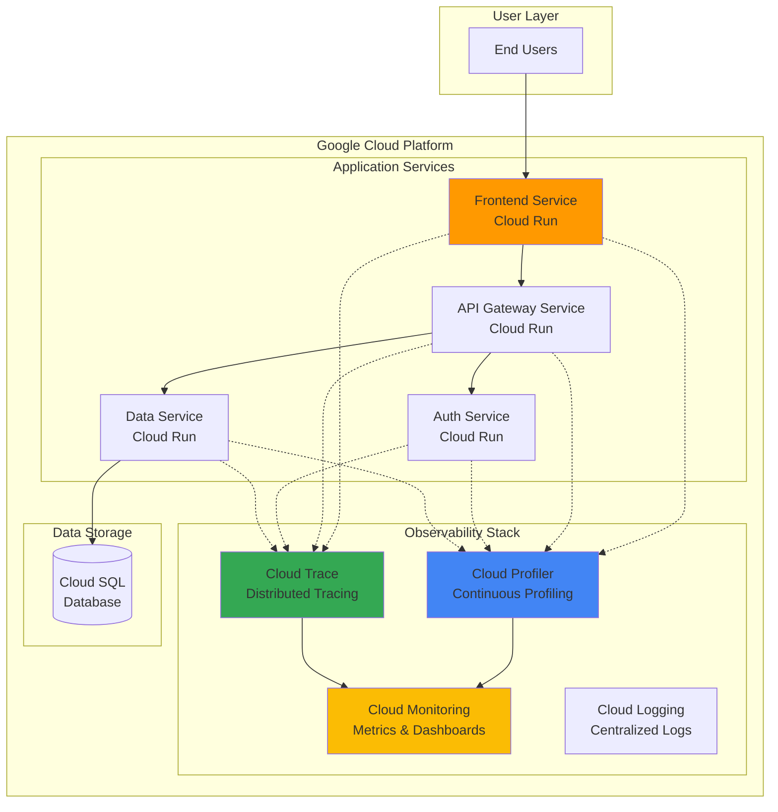

# Enhancing Application Performance with Cloud Profiler and Cloud Trace

## Problem

Development teams often struggle to identify performance bottlenecks in production microservices architectures where request latency issues and resource consumption problems remain hidden until they impact user experience. Traditional monitoring tools provide basic metrics but lack the granular visibility needed to pinpoint specific code-level inefficiencies or trace request flows across distributed services, leading to prolonged troubleshooting cycles and degraded application performance.

## Solution

Build a comprehensive performance monitoring solution using Cloud Profiler for continuous CPU and memory profiling combined with Cloud Trace for distributed request tracing across microservices. This approach provides real-time visibility into application performance at both the code level and service interaction level, enabling proactive identification and resolution of performance bottlenecks before they impact users.

## Architecture Diagram



## Prerequisites

1. Google Cloud project with billing enabled and appropriate IAM permissions (Compute Admin, Service Account Admin, Monitoring Admin)
2. Google Cloud CLI (gcloud) v470.0.0 or later installed and configured
3. Docker installed for local application development and testing
4. Basic understanding of microservices architecture and distributed systems concepts
5. Estimated cost: $5-15 for running Cloud Run services and observability tools during the 75-minute tutorial

> **Note**: This recipe creates multiple Cloud Run services to demonstrate performance monitoring across a realistic microservices architecture. The observability tools themselves have minimal cost impact as they're designed for production use.

## Preparation

```bash
# Set environment variables for consistent resource naming
export PROJECT_ID="performance-demo-$(date +%s)"
export REGION="us-central1"
export SERVICE_ACCOUNT_NAME="profiler-trace-sa"

# Generate unique suffix for resource names to avoid conflicts
RANDOM_SUFFIX=$(openssl rand -hex 3)
export FRONTEND_SERVICE="frontend-${RANDOM_SUFFIX}"
export API_SERVICE="api-gateway-${RANDOM_SUFFIX}"
export AUTH_SERVICE="auth-service-${RANDOM_SUFFIX}"
export DATA_SERVICE="data-service-${RANDOM_SUFFIX}"

# Create the project and set configuration
gcloud projects create ${PROJECT_ID} --name="Performance Monitoring Demo"
gcloud config set project ${PROJECT_ID}
gcloud config set compute/region ${REGION}

# Enable required Google Cloud APIs for observability and compute services
gcloud services enable run.googleapis.com
gcloud services enable cloudprofiler.googleapis.com
gcloud services enable cloudtrace.googleapis.com
gcloud services enable monitoring.googleapis.com
gcloud services enable logging.googleapis.com
gcloud services enable cloudbuild.googleapis.com

# Create service account with appropriate permissions for profiling and tracing
gcloud iam service-accounts create ${SERVICE_ACCOUNT_NAME} \
    --display-name="Cloud Profiler and Trace Service Account"

gcloud projects add-iam-policy-binding ${PROJECT_ID} \
    --member="serviceAccount:${SERVICE_ACCOUNT_NAME}@${PROJECT_ID}.iam.gserviceaccount.com" \
    --role="roles/cloudprofiler.agent"

gcloud projects add-iam-policy-binding ${PROJECT_ID} \
    --member="serviceAccount:${SERVICE_ACCOUNT_NAME}@${PROJECT_ID}.iam.gserviceaccount.com" \
    --role="roles/cloudtrace.agent"

echo "✅ Project configured: ${PROJECT_ID}"
echo "✅ APIs enabled and service account created"
```

## Steps

1. **Create Sample Microservices Applications with Performance Instrumentation**:

   Modern microservices require both profiling and tracing instrumentation to provide comprehensive performance visibility. Cloud Profiler automatically collects CPU and memory usage statistics with minimal overhead, while Cloud Trace tracks request latency across service boundaries. These tools work together to create a complete performance monitoring solution that identifies bottlenecks at both the application code level and service interaction level.

   ```bash
   # Create project structure for microservices demo
   mkdir -p performance-demo/{frontend,api-gateway,auth-service,data-service}
   cd performance-demo
   
   # Create Frontend Service with modern OpenTelemetry tracing
   cat > frontend/main.py << 'EOF'
   import os
   import time
   import random
   import requests
   from flask import Flask, request, jsonify
   from google.cloud import profiler
   from opentelemetry import trace
   from opentelemetry.exporter.gcp.trace import CloudTraceSpanExporter
   from opentelemetry.sdk.trace import TracerProvider
   from opentelemetry.sdk.trace.export import BatchSpanProcessor
   from opentelemetry.instrumentation.flask import FlaskInstrumentor
   from opentelemetry.instrumentation.requests import RequestsInstrumentor
   
   app = Flask(__name__)
   
   # Initialize Cloud Profiler for continuous performance monitoring
   try:
       profiler.start(
           service='frontend-service',
           service_version='1.0.0',
           verbose=3
       )
   except Exception as e:
       print(f"Profiler initialization error: {e}")
   
   # Initialize OpenTelemetry tracing for Cloud Trace
   trace.set_tracer_provider(TracerProvider())
   tracer = trace.get_tracer(__name__)
   
   # Configure Cloud Trace exporter
   cloud_trace_exporter = CloudTraceSpanExporter()
   span_processor = BatchSpanProcessor(cloud_trace_exporter)
   trace.get_tracer_provider().add_span_processor(span_processor)
   
   # Instrument Flask and requests automatically
   FlaskInstrumentor().instrument_app(app)
   RequestsInstrumentor().instrument()
   
   @app.route('/')
   def frontend_handler():
       with tracer.start_as_current_span("frontend_processing") as span:
           # Simulate CPU-intensive operation for profiling demonstration
           start_time = time.time()
           result = 0
           for i in range(100000):
               result += i * random.random()
           
           span.set_attribute("computation_iterations", 100000)
           span.set_attribute("computation_result", result)
           
           # Call downstream API service
           api_url = os.getenv('API_SERVICE_URL', 'http://localhost:8081')
           try:
               response = requests.get(f"{api_url}/api/data", timeout=5)
               api_data = response.json()
               span.set_attribute("api_call_status", "success")
           except Exception as e:
               api_data = {"error": str(e)}
               span.set_attribute("api_call_status", "failed")
               span.set_attribute("api_call_error", str(e))
           
           processing_time = time.time() - start_time
           span.set_attribute("processing_time_ms", processing_time * 1000)
           
           return jsonify({
               "service": "frontend",
               "processing_time_ms": processing_time * 1000,
               "computation_result": result,
               "api_response": api_data
           })
   
   @app.route('/health')
   def health_check():
       return jsonify({"status": "healthy", "service": "frontend"})
   
   if __name__ == '__main__':
       app.run(host='0.0.0.0', port=8080)
   EOF
   
   # Create requirements file with updated OpenTelemetry dependencies
   cat > frontend/requirements.txt << 'EOF'
   Flask==3.0.0
   google-cloud-profiler==4.1.0
   opentelemetry-api==1.21.0
   opentelemetry-sdk==1.21.0
   opentelemetry-exporter-gcp-trace==1.6.0
   opentelemetry-instrumentation-flask==0.42b0
   opentelemetry-instrumentation-requests==0.42b0
   requests==2.31.0
   EOF
   
   echo "✅ Frontend service created with modern OpenTelemetry tracing"
   ```

   The frontend service now uses modern OpenTelemetry instrumentation instead of the deprecated OpenCensus library. OpenTelemetry provides better performance, active maintenance, and seamless integration with Google Cloud Trace while maintaining compatibility with industry standards for observability.

2. **Implement API Gateway Service with Enhanced Tracing**:

   The API Gateway service acts as a central routing point for microservices communications, making it critical for performance monitoring. By instrumenting this service with both profiling and modern OpenTelemetry tracing, we can identify bottlenecks in request routing logic and measure the latency impact of authentication and data service calls.

   ```bash
   # Create API Gateway Service with OpenTelemetry instrumentation
   cat > api-gateway/main.py << 'EOF'
   import os
   import time
   import json
   import requests
   from flask import Flask, request, jsonify
   from google.cloud import profiler
   from opentelemetry import trace
   from opentelemetry.exporter.gcp.trace import CloudTraceSpanExporter
   from opentelemetry.sdk.trace import TracerProvider
   from opentelemetry.sdk.trace.export import BatchSpanProcessor
   from opentelemetry.instrumentation.flask import FlaskInstrumentor
   from opentelemetry.instrumentation.requests import RequestsInstrumentor
   
   app = Flask(__name__)
   
   # Initialize profiling for API gateway performance analysis
   try:
       profiler.start(
           service='api-gateway-service',
           service_version='1.0.0',
           verbose=3
       )
   except Exception as e:
       print(f"Profiler initialization error: {e}")
   
   # Initialize OpenTelemetry tracing
   trace.set_tracer_provider(TracerProvider())
   tracer = trace.get_tracer(__name__)
   
   # Configure Cloud Trace exporter
   cloud_trace_exporter = CloudTraceSpanExporter()
   span_processor = BatchSpanProcessor(cloud_trace_exporter)
   trace.get_tracer_provider().add_span_processor(span_processor)
   
   # Instrument Flask and requests automatically
   FlaskInstrumentor().instrument_app(app)
   RequestsInstrumentor().instrument()
   
   @app.route('/api/data')
   def get_data():
       with tracer.start_as_current_span("api_gateway_processing") as span:
           span.set_attribute("endpoint", "/api/data")
           span.set_attribute("method", "GET")
           
           # Simulate authentication call with detailed tracing
           with tracer.start_as_current_span("authentication_check") as auth_span:
               auth_url = os.getenv('AUTH_SERVICE_URL', 'http://localhost:8082')
               auth_start = time.time()
               try:
                   auth_response = requests.get(f"{auth_url}/auth/verify", timeout=3)
                   auth_success = auth_response.status_code == 200
                   auth_span.set_attribute("auth_result", "success" if auth_success else "failed")
                   auth_span.set_attribute("auth_status_code", auth_response.status_code)
               except Exception as e:
                   auth_success = False
                   auth_span.set_attribute("auth_result", "failed")
                   auth_span.set_attribute("auth_error", str(e))
               
               auth_duration = time.time() - auth_start
               auth_span.set_attribute("auth_duration_ms", auth_duration * 1000)
           
           if not auth_success:
               span.set_attribute("error", "authentication_failed")
               return jsonify({"error": "Authentication failed"}), 401
           
           # Call data service with performance tracking
           with tracer.start_as_current_span("data_service_call") as data_span:
               data_url = os.getenv('DATA_SERVICE_URL', 'http://localhost:8083')
               data_start = time.time()
               try:
                   data_response = requests.get(f"{data_url}/data/fetch", timeout=5)
                   data_result = data_response.json()
                   data_span.set_attribute("data_size_bytes", len(json.dumps(data_result)))
                   data_span.set_attribute("data_status_code", data_response.status_code)
               except Exception as e:
                   data_result = {"error": str(e)}
                   data_span.set_attribute("data_error", str(e))
               
               data_duration = time.time() - data_start
               data_span.set_attribute("data_duration_ms", data_duration * 1000)
           
           return jsonify({
               "service": "api-gateway",
               "data": data_result,
               "auth_duration_ms": auth_duration * 1000,
               "data_duration_ms": data_duration * 1000
           })
   
   @app.route('/health')
   def health_check():
       return jsonify({"status": "healthy", "service": "api-gateway"})
   
   if __name__ == '__main__':
       app.run(host='0.0.0.0', port=8081)
   EOF
   
   # Copy updated requirements for consistency
   cp frontend/requirements.txt api-gateway/requirements.txt
   
   echo "✅ API Gateway service created with OpenTelemetry spans"
   ```

   The API Gateway service implements detailed OpenTelemetry spans that provide enhanced visibility into authentication and data service calls. The modern instrumentation automatically captures HTTP requests and responses while custom spans allow us to measure the performance impact of each downstream service.

3. **Build Authentication Service with Memory Profiling Focus**:

   Authentication services often experience memory-intensive operations due to cryptographic processing and session management. Cloud Profiler's memory profiling capabilities help identify memory allocation patterns and potential leaks in authentication workflows, while OpenTelemetry tracing shows how authentication latency impacts overall request performance.

   ```bash
   # Create Authentication Service with OpenTelemetry tracing
   cat > auth-service/main.py << 'EOF'
   import os
   import time
   import hashlib
   import secrets
   from flask import Flask, request, jsonify
   from google.cloud import profiler
   from opentelemetry import trace
   from opentelemetry.exporter.gcp.trace import CloudTraceSpanExporter
   from opentelemetry.sdk.trace import TracerProvider
   from opentelemetry.sdk.trace.export import BatchSpanProcessor
   from opentelemetry.instrumentation.flask import FlaskInstrumentor
   
   app = Flask(__name__)
   
   # Initialize profiler with focus on memory allocation patterns
   try:
       profiler.start(
           service='auth-service',
           service_version='1.0.0',
           verbose=3
       )
   except Exception as e:
       print(f"Profiler initialization error: {e}")
   
   # Initialize OpenTelemetry tracing
   trace.set_tracer_provider(TracerProvider())
   tracer = trace.get_tracer(__name__)
   
   # Configure Cloud Trace exporter
   cloud_trace_exporter = CloudTraceSpanExporter()
   span_processor = BatchSpanProcessor(cloud_trace_exporter)
   trace.get_tracer_provider().add_span_processor(span_processor)
   
   # Instrument Flask automatically
   FlaskInstrumentor().instrument_app(app)
   
   # Simulate user session storage for memory profiling
   user_sessions = {}
   
   @app.route('/auth/verify')
   def verify_auth():
       with tracer.start_as_current_span("auth_verification") as span:
           # Simulate memory-intensive authentication operations
           start_time = time.time()
           
           # Generate session data (memory allocation intensive)
           session_id = secrets.token_hex(32)
           user_data = {
               "session_id": session_id,
               "permissions": ["read", "write", "admin"] * 100,  # Large permission set
               "metadata": {f"key_{i}": f"value_{i}" * 50 for i in range(100)},  # Memory intensive
               "timestamps": [time.time() + i for i in range(1000)]
           }
           
           span.set_attribute("session_id", session_id)
           span.set_attribute("permissions_count", len(user_data["permissions"]))
           span.set_attribute("metadata_keys", len(user_data["metadata"]))
           
           # Store session in memory (for profiling demonstration)
           user_sessions[session_id] = user_data
           
           # Simulate cryptographic operations (CPU intensive)
           with tracer.start_as_current_span("cryptographic_operations") as crypto_span:
               hash_operations = 1000
               for i in range(hash_operations):
                   hash_value = hashlib.sha256(f"auth_token_{i}_{session_id}".encode()).hexdigest()
               crypto_span.set_attribute("hash_operations", hash_operations)
           
           # Clean up old sessions periodically (memory management)
           if len(user_sessions) > 50:
               oldest_sessions = list(user_sessions.keys())[:25]
               for old_session in oldest_sessions:
                   del user_sessions[old_session]
               span.set_attribute("sessions_cleaned", 25)
           
           processing_time = time.time() - start_time
           span.set_attribute("processing_time_ms", processing_time * 1000)
           span.set_attribute("active_sessions", len(user_sessions))
           
           return jsonify({
               "service": "auth",
               "authenticated": True,
               "session_id": session_id,
               "processing_time_ms": processing_time * 1000,
               "active_sessions": len(user_sessions)
           })
   
   @app.route('/health')
   def health_check():
       return jsonify({
           "status": "healthy", 
           "service": "auth",
           "memory_usage_sessions": len(user_sessions)
       })
   
   if __name__ == '__main__':
       app.run(host='0.0.0.0', port=8082)
   EOF
   
   cp frontend/requirements.txt auth-service/requirements.txt
   
   echo "✅ Authentication service created with memory-intensive operations"
   ```

   The authentication service includes memory-intensive operations that generate detailed profiling data about memory allocation patterns. The OpenTelemetry instrumentation provides insights into cryptographic operation performance while Cloud Profiler identifies memory usage hotspots and optimization opportunities.

4. **Create Data Service with Database Query Performance Monitoring**:

   Data services typically involve database interactions that can become performance bottlenecks. By combining Cloud Profiler's CPU profiling with OpenTelemetry's database operation tracking, we can identify slow database queries and optimize data processing algorithms for better overall application performance.

   ```bash
   # Create Data Service with comprehensive OpenTelemetry monitoring
   cat > data-service/main.py << 'EOF'
   import os
   import time
   import random
   import sqlite3
   from flask import Flask, request, jsonify
   from google.cloud import profiler
   from opentelemetry import trace
   from opentelemetry.exporter.gcp.trace import CloudTraceSpanExporter
   from opentelemetry.sdk.trace import TracerProvider
   from opentelemetry.sdk.trace.export import BatchSpanProcessor
   from opentelemetry.instrumentation.flask import FlaskInstrumentor
   from opentelemetry.instrumentation.sqlite3 import SQLite3Instrumentor
   
   app = Flask(__name__)
   
   # Initialize profiler for data processing performance analysis
   try:
       profiler.start(
           service='data-service',
           service_version='1.0.0',
           verbose=3
       )
   except Exception as e:
       print(f"Profiler initialization error: {e}")
   
   # Initialize OpenTelemetry tracing
   trace.set_tracer_provider(TracerProvider())
   tracer = trace.get_tracer(__name__)
   
   # Configure Cloud Trace exporter
   cloud_trace_exporter = CloudTraceSpanExporter()
   span_processor = BatchSpanProcessor(cloud_trace_exporter)
   trace.get_tracer_provider().add_span_processor(span_processor)
   
   # Instrument Flask and SQLite3 automatically
   FlaskInstrumentor().instrument_app(app)
   SQLite3Instrumentor().instrument()
   
   # Initialize in-memory database for performance testing
   def init_database():
       conn = sqlite3.connect(':memory:', check_same_thread=False)
       cursor = conn.cursor()
       cursor.execute('''
           CREATE TABLE performance_data (
               id INTEGER PRIMARY KEY,
               name TEXT,
               value REAL,
               category TEXT,
               timestamp REAL
           )
       ''')
       
       # Insert sample data for querying
       sample_data = [
           (i, f"item_{i}", random.uniform(0, 1000), f"category_{i % 10}", time.time())
           for i in range(10000)
       ]
       cursor.executemany(
           'INSERT INTO performance_data (id, name, value, category, timestamp) VALUES (?, ?, ?, ?, ?)',
           sample_data
       )
       conn.commit()
       return conn
   
   # Global database connection for demonstration
   db_conn = init_database()
   
   @app.route('/data/fetch')
   def fetch_data():
       with tracer.start_as_current_span("data_fetch_operation") as span:
           start_time = time.time()
           
           # Simulate complex database query with automatic SQLite3 tracing
           with tracer.start_as_current_span("database_operations") as db_span:
               cursor = db_conn.cursor()
               query_start = time.time()
               
               # Complex query for performance analysis
               threshold = random.uniform(100, 500)
               cursor.execute('''
                   SELECT category, COUNT(*) as count, AVG(value) as avg_value, 
                          MAX(value) as max_value, MIN(value) as min_value
                   FROM performance_data 
                   WHERE value > ? 
                   GROUP BY category 
                   ORDER BY avg_value DESC
               ''', (threshold,))
               
               results = cursor.fetchall()
               query_duration = time.time() - query_start
               
               db_span.set_attribute("query_duration_ms", query_duration * 1000)
               db_span.set_attribute("result_count", len(results))
               db_span.set_attribute("query_type", "aggregate_analysis")
               db_span.set_attribute("query_threshold", threshold)
           
           # Simulate data processing (CPU intensive for profiling)
           with tracer.start_as_current_span("data_processing") as proc_span:
               processed_data = []
               for row in results:
                   category, count, avg_val, max_val, min_val = row
                   
                   # Simulate complex calculations
                   processed_item = {
                       "category": category,
                       "statistics": {
                           "count": count,
                           "average": round(avg_val, 2),
                           "maximum": max_val,
                           "minimum": min_val,
                           "variance": random.uniform(0, 100),
                           "processed_score": sum([avg_val * 0.4, max_val * 0.3, count * 0.3])
                       }
                   }
                   processed_data.append(processed_item)
                   
                   # Simulate additional CPU work for profiling
                   for _ in range(100):
                       _ = sum([random.random() for _ in range(50)])
               
               proc_span.set_attribute("items_processed", len(processed_data))
           
           total_duration = time.time() - start_time
           span.set_attribute("total_duration_ms", total_duration * 1000)
           
           return jsonify({
               "service": "data",
               "total_items": len(processed_data),
               "processing_time_ms": total_duration * 1000,
               "query_time_ms": query_duration * 1000,
               "data": processed_data[:5]  # Return sample of results
           })
   
   @app.route('/health')
   def health_check():
       return jsonify({"status": "healthy", "service": "data"})
   
   if __name__ == '__main__':
       app.run(host='0.0.0.0', port=8083)
   EOF
   
   # Update requirements to include SQLite3 instrumentation
   cat > data-service/requirements.txt << 'EOF'
   Flask==3.0.0
   google-cloud-profiler==4.1.0
   opentelemetry-api==1.21.0
   opentelemetry-sdk==1.21.0
   opentelemetry-exporter-gcp-trace==1.6.0
   opentelemetry-instrumentation-flask==0.42b0
   opentelemetry-instrumentation-sqlite3==0.42b0
   requests==2.31.0
   EOF
   
   echo "✅ Data service created with OpenTelemetry database instrumentation"
   ```

   The data service implements database operations with automatic OpenTelemetry SQLite3 instrumentation and CPU-intensive data processing operations. This configuration enables Cloud Profiler to identify performance bottlenecks in data processing algorithms while OpenTelemetry automatically tracks database query latency and overall request processing times.

5. **Build and Deploy Microservices to Cloud Run**:

   Cloud Run provides a fully managed serverless platform that automatically scales based on demand while maintaining excellent integration with Google Cloud's observability tools. Deploying our instrumented microservices to Cloud Run enables realistic performance monitoring in a production-like environment with automatic scaling and load balancing.

   ```bash
   # Create Dockerfiles for each service
   for service in frontend api-gateway auth-service data-service; do
       cat > ${service}/Dockerfile << 'EOF'
   FROM python:3.11-slim
   
   WORKDIR /app
   COPY requirements.txt .
   RUN pip install --no-cache-dir -r requirements.txt
   
   COPY main.py .
   
   EXPOSE 8080
   
   CMD ["python", "main.py"]
   EOF
   done
   
   # Build and deploy each service to Cloud Run
   for service in frontend api-gateway auth-service data-service; do
       echo "Building and deploying ${service}..."
       
       # Build container image using Cloud Build
       gcloud builds submit ${service} \
           --tag gcr.io/${PROJECT_ID}/${service}:latest
       
       # Deploy to Cloud Run with profiler and trace permissions
       gcloud run deploy ${service} \
           --image gcr.io/${PROJECT_ID}/${service}:latest \
           --platform managed \
           --region ${REGION} \
           --allow-unauthenticated \
           --service-account ${SERVICE_ACCOUNT_NAME}@${PROJECT_ID}.iam.gserviceaccount.com \
           --set-env-vars "GOOGLE_CLOUD_PROJECT=${PROJECT_ID}" \
           --memory 1Gi \
           --cpu 1 \
           --max-instances 10
       
       echo "✅ ${service} deployed successfully"
   done
   
   # Get service URLs for cross-service communication
   FRONTEND_URL=$(gcloud run services describe frontend \
       --region=${REGION} --format="value(status.url)")
   API_URL=$(gcloud run services describe api-gateway \
       --region=${REGION} --format="value(status.url)")
   AUTH_URL=$(gcloud run services describe auth-service \
       --region=${REGION} --format="value(status.url)")
   DATA_URL=$(gcloud run services describe data-service \
       --region=${REGION} --format="value(status.url)")
   
   # Update services with cross-service URLs
   gcloud run services update frontend \
       --region=${REGION} \
       --set-env-vars "API_SERVICE_URL=${API_URL}"
   
   gcloud run services update api-gateway \
       --region=${REGION} \
       --set-env-vars "AUTH_SERVICE_URL=${AUTH_URL},DATA_SERVICE_URL=${DATA_URL}"
   
   echo "✅ All microservices deployed with cross-service communication configured"
   ```

   The microservices are now deployed to Cloud Run with proper service account permissions for profiling and tracing. Each service can communicate with others through environment variables, creating a realistic microservices architecture where performance monitoring can demonstrate real-world distributed system behavior.

6. **Generate Load for Performance Analysis**:

   Load generation is essential for meaningful performance analysis because it creates realistic traffic patterns that trigger profiling data collection and trace generation. Google Cloud's observability tools require actual application load to collect comprehensive performance data and identify optimization opportunities.

   ```bash
   # Create load generation script for comprehensive performance testing
   cat > load_generator.py << 'EOF'
   import requests
   import time
   import concurrent.futures
   import random
   import json
   
   def make_request(frontend_url, request_id):
       try:
           start_time = time.time()
           response = requests.get(frontend_url, timeout=30)
           duration = time.time() - start_time
           
           print(f"Request {request_id}: Status {response.status_code}, Duration: {duration:.2f}s")
           return {
               "request_id": request_id,
               "status_code": response.status_code,
               "duration": duration,
               "success": response.status_code == 200
           }
       except Exception as e:
           print(f"Request {request_id} failed: {e}")
           return {"request_id": request_id, "error": str(e), "success": False}
   
   def generate_load(frontend_url, num_requests=100, concurrent_requests=10):
       print(f"Generating load: {num_requests} requests with {concurrent_requests} concurrent workers")
       
       results = []
       with concurrent.futures.ThreadPoolExecutor(max_workers=concurrent_requests) as executor:
           futures = []
           
           for i in range(num_requests):
               future = executor.submit(make_request, frontend_url, i)
               futures.append(future)
               
               # Add slight delay between request submissions
               time.sleep(random.uniform(0.1, 0.5))
           
           for future in concurrent.futures.as_completed(futures):
               result = future.result()
               results.append(result)
       
       # Calculate statistics
       successful_requests = [r for r in results if r.get("success", False)]
       failed_requests = [r for r in results if not r.get("success", False)]
       
       if successful_requests:
           durations = [r["duration"] for r in successful_requests]
           avg_duration = sum(durations) / len(durations)
           max_duration = max(durations)
           min_duration = min(durations)
           
           print(f"\nLoad Generation Complete:")
           print(f"  Successful requests: {len(successful_requests)}")
           print(f"  Failed requests: {len(failed_requests)}")
           print(f"  Average duration: {avg_duration:.2f}s")
           print(f"  Max duration: {max_duration:.2f}s")
           print(f"  Min duration: {min_duration:.2f}s")
       
       return results
   
   if __name__ == "__main__":
       frontend_url = "${FRONTEND_URL}"
       generate_load(frontend_url, num_requests=150, concurrent_requests=15)
   EOF
   
   # Execute load generation to create profiling and tracing data
   python3 load_generator.py
   
   echo "✅ Load generation completed - profiling and tracing data is being collected"
   ```

   The load generator creates realistic traffic patterns that trigger profiling data collection and trace generation across all microservices. This sustained load enables Cloud Profiler to collect statistically significant performance data while OpenTelemetry captures representative request flows through the distributed system.

7. **Configure Cloud Monitoring Dashboards for Performance Visualization**:

   Cloud Monitoring dashboards provide centralized visualization of performance metrics from Cloud Profiler and Cloud Trace, enabling teams to correlate profiling data with infrastructure metrics and trace latency patterns. Custom dashboards help identify performance trends and establish baseline metrics for ongoing performance optimization.

   ```bash
   # Create comprehensive monitoring dashboard configuration
   cat > dashboard_config.json << 'EOF'
   {
     "displayName": "Application Performance Monitoring Dashboard",
     "mosaicLayout": {
       "tiles": [
         {
           "width": 6,
           "height": 4,
           "widget": {
             "title": "Cloud Run Request Latency",
             "xyChart": {
               "dataSets": [
                 {
                   "timeSeriesQuery": {
                     "timeSeriesFilter": {
                       "filter": "resource.type=\"cloud_run_revision\" AND metric.type=\"run.googleapis.com/request_latencies\"",
                       "aggregation": {
                         "alignmentPeriod": "60s",
                         "perSeriesAligner": "ALIGN_MEAN",
                         "crossSeriesReducer": "REDUCE_MEAN",
                         "groupByFields": ["resource.label.service_name"]
                       }
                     }
                   },
                   "plotType": "LINE"
                 }
               ]
             }
           }
         },
         {
           "width": 6,
           "height": 4,
           "xPos": 6,
           "widget": {
             "title": "Cloud Trace Request Count",
             "xyChart": {
               "dataSets": [
                 {
                   "timeSeriesQuery": {
                     "timeSeriesFilter": {
                       "filter": "resource.type=\"global\" AND metric.type=\"cloudtrace.googleapis.com/trace_span/count\"",
                       "aggregation": {
                         "alignmentPeriod": "60s",
                         "perSeriesAligner": "ALIGN_RATE",
                         "crossSeriesReducer": "REDUCE_SUM"
                       }
                     }
                   },
                   "plotType": "STACKED_AREA"
                 }
               ]
             }
           }
         },
         {
           "width": 12,
           "height": 4,
           "yPos": 4,
           "widget": {
             "title": "Service CPU Utilization by Cloud Profiler",
             "xyChart": {
               "dataSets": [
                 {
                   "timeSeriesQuery": {
                     "timeSeriesFilter": {
                       "filter": "resource.type=\"cloud_run_revision\" AND metric.type=\"run.googleapis.com/cpu/utilizations\"",
                       "aggregation": {
                         "alignmentPeriod": "60s",
                         "perSeriesAligner": "ALIGN_MEAN",
                         "crossSeriesReducer": "REDUCE_MEAN",
                         "groupByFields": ["resource.label.service_name"]
                       }
                     }
                   },
                   "plotType": "LINE"
                 }
               ]
             }
           }
         }
       ]
     }
   }
   EOF
   
   # Create the monitoring dashboard
   gcloud monitoring dashboards create --config-from-file=dashboard_config.json
   
   # Create alerting policies for performance thresholds
   cat > alert_policy.json << 'EOF'
   {
     "displayName": "High Application Latency Alert",
     "conditions": [
       {
         "displayName": "Cloud Run request latency above threshold",
         "conditionThreshold": {
           "filter": "resource.type=\"cloud_run_revision\" AND metric.type=\"run.googleapis.com/request_latencies\"",
           "comparison": "COMPARISON_GREATER_THAN",
           "thresholdValue": 2.0,
           "duration": "300s",
           "aggregations": [
             {
               "alignmentPeriod": "60s",
               "perSeriesAligner": "ALIGN_MEAN",
               "crossSeriesReducer": "REDUCE_MEAN",
               "groupByFields": ["resource.label.service_name"]
             }
           ]
         }
       }
     ],
     "combiner": "OR",
     "enabled": true,
     "notificationChannels": []
   }
   EOF
   
   gcloud alpha monitoring policies create --policy-from-file=alert_policy.json
   
   echo "✅ Monitoring dashboard and alerting policies created"
   echo "Dashboard URL: https://console.cloud.google.com/monitoring/dashboards"
   ```

   The monitoring dashboard provides comprehensive visibility into application performance metrics, combining Cloud Run infrastructure metrics with Cloud Profiler CPU utilization data and Cloud Trace request counts. This unified view enables correlation between infrastructure performance and application-level metrics for holistic performance analysis.

## Validation & Testing

1. **Verify Cloud Profiler Data Collection**:

   ```bash
   # Check if profiling data is being collected for all services
   gcloud logging read "resource.type=cloud_run_revision AND \
       textPayload:\"Profiler\"" \
       --limit=10 \
       --format="table(timestamp,resource.labels.service_name,textPayload)"
   
   # Verify profiler agents are running
   echo "Checking profiler status for each service..."
   for service in frontend api-gateway auth-service data-service; do
       echo "Checking ${service}..."
       gcloud run services describe ${service} \
           --region=${REGION} \
           --format="value(status.conditions[0].status)"
   done
   ```

   Expected output: Service logs showing "Profiler started" messages and all services reporting "True" status.

2. **Validate OpenTelemetry Trace Data Collection**:

   ```bash
   # Query recent traces to verify OpenTelemetry tracing is working
   gcloud logging read "resource.type=cloud_run_revision AND \
       jsonPayload.\"logging.googleapis.com/trace\"!=\"\"" \
       --limit=5 \
       --format="table(timestamp,resource.labels.service_name,jsonPayload.\"logging.googleapis.com/trace\")"
   
   # Check trace spans are being generated
   echo "Recent OpenTelemetry trace activity:"
   gcloud logging read "protoPayload.serviceName=\"cloudtrace.googleapis.com\"" \
       --limit=10 \
       --format="value(timestamp,protoPayload.methodName)"
   ```

   Expected output: Log entries showing trace IDs and Cloud Trace API calls indicating active OpenTelemetry trace collection.

3. **Test Performance Monitoring End-to-End**:

   ```bash
   # Generate additional load to verify monitoring responsiveness
   echo "Generating test load for monitoring validation..."
   for i in {1..20}; do
       curl -s "${FRONTEND_URL}" > /dev/null &
       sleep 0.5
   done
   wait
   
   # Verify services are responding and generating traces
   echo "Testing service health and response times:"
   for service_url in "${FRONTEND_URL}" "${API_URL}" "${AUTH_URL}" "${DATA_URL}"; do
       start_time=$(python3 -c "import time; print(time.time())")
       response=$(curl -s -o /dev/null -w "%{http_code}" "${service_url}/health")
       end_time=$(python3 -c "import time; print(time.time())")
       duration=$(python3 -c "print(${end_time} - ${start_time})")
       echo "Service: ${service_url} - Status: ${response} - Duration: ${duration}s"
   done
   ```

   Expected output: All services returning 200 status codes with reasonable response times under 2 seconds.

## Cleanup

1. **Remove Cloud Run Services**:

   ```bash
   # Delete all Cloud Run services
   for service in frontend api-gateway auth-service data-service; do
       gcloud run services delete ${service} \
           --region=${REGION} \
           --quiet
       echo "✅ Deleted ${service}"
   done
   ```

2. **Clean Up Container Images**:

   ```bash
   # Remove container images from Container Registry
   for service in frontend api-gateway auth-service data-service; do
       gcloud container images delete gcr.io/${PROJECT_ID}/${service}:latest \
           --force-delete-tags \
           --quiet
   done
   
   echo "✅ Container images removed"
   ```

3. **Remove IAM Resources and Project**:

   ```bash
   # Delete service account
   gcloud iam service-accounts delete \
       ${SERVICE_ACCOUNT_NAME}@${PROJECT_ID}.iam.gserviceaccount.com \
       --quiet
   
   # Remove monitoring dashboard and alerts (they will be deleted with project)
   # Clean up local files
   cd ..
   rm -rf performance-demo
   rm -f load_generator.py dashboard_config.json alert_policy.json
   
   # Delete the entire project to ensure complete cleanup
   gcloud projects delete ${PROJECT_ID} --quiet
   
   echo "✅ All resources cleaned up successfully"
   echo "Note: Project deletion may take several minutes to complete"
   ```

## Discussion

This recipe demonstrates how Cloud Profiler and Cloud Trace work together to provide comprehensive application performance monitoring for microservices architectures. Cloud Profiler continuously collects CPU and memory usage statistics with minimal overhead (typically less than 1% CPU impact), making it suitable for production environments. The profiler uses statistical sampling to build detailed profiles of where your application spends time and allocates memory, helping identify performance bottlenecks at the code level.

The implementation now uses modern OpenTelemetry instrumentation instead of the deprecated OpenCensus libraries. OpenTelemetry is the successor to OpenCensus and provides better performance, active maintenance, and seamless integration with Google Cloud Trace. The migration from OpenCensus to OpenTelemetry ensures long-term support and compatibility with industry-standard observability practices, as OpenCensus reached end-of-life in July 2023.

OpenTelemetry's automatic instrumentation capabilities significantly reduce the amount of manual code required for tracing while providing more comprehensive coverage of HTTP requests, database operations, and other framework interactions. The standardized APIs ensure portability across different cloud providers and observability platforms, making it easier to maintain consistent monitoring practices across diverse environments.

Integration with Cloud Monitoring creates a unified observability platform where metrics, logs, and traces work together for comprehensive system understanding. The dashboard configuration demonstrates how to correlate infrastructure metrics from Cloud Run with application performance data from Cloud Profiler and Cloud Trace. This correlation is essential for distinguishing between infrastructure-related performance issues and application code inefficiencies, enabling more targeted optimization efforts.

> **Tip**: Use Cloud Profiler's flame graphs to identify the most CPU-intensive functions in your application, then create custom OpenTelemetry spans around those functions to understand their impact on overall request latency. For more information, see the [Cloud Profiler documentation](https://cloud.google.com/profiler/docs) and [OpenTelemetry Python documentation](https://opentelemetry.io/docs/languages/python/).

## Challenge

Extend this performance monitoring solution by implementing these enhancements:

1. **Add Memory Leak Detection**: Implement continuous memory profiling alerts that trigger when memory usage trends upward over time, using Cloud Monitoring's anomaly detection capabilities to identify potential memory leaks before they impact application performance.

2. **Implement SLI/SLO Monitoring**: Configure Service Level Indicators (SLIs) and Service Level Objectives (SLOs) using Cloud Monitoring's SLO features, setting up error budgets and automated alerting when performance degrades below acceptable thresholds.

3. **Create Performance Regression Detection**: Build automated performance regression testing using Cloud Build triggers that run load tests after deployments and compare profiling results against baseline performance metrics to catch performance regressions early.

4. **Integrate with Application Performance Management**: Connect Cloud Profiler and Cloud Trace data with third-party APM tools using OpenTelemetry's standardized exporters, creating a hybrid monitoring solution that leverages the best features of multiple platforms.

5. **Implement Cost-Performance Optimization**: Create automated scaling policies that use profiling data to optimize Cloud Run resource allocation, automatically adjusting CPU and memory allocations based on actual usage patterns to minimize costs while maintaining performance SLOs.

## Infrastructure Code

### Available Infrastructure as Code:

- [Infrastructure Code Overview](code/README.md) - Detailed description of all infrastructure components
- [Infrastructure Manager](code/infrastructure-manager/) - GCP Infrastructure Manager templates
- [Bash CLI Scripts](code/scripts/) - Example bash scripts using gcloud CLI commands to deploy infrastructure
- [Terraform](code/terraform/) - Terraform configuration files