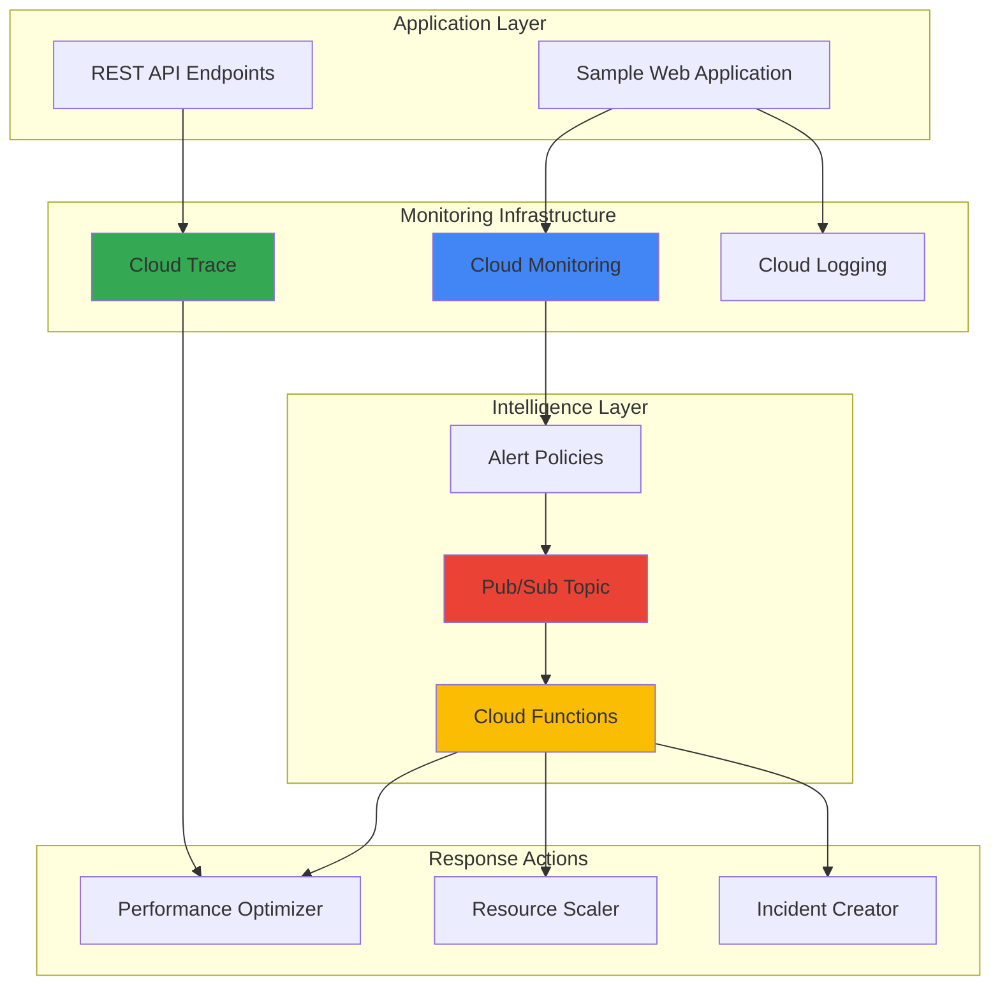

# Application Performance Monitoring with Cloud Monitoring and Cloud Trace

## Problem

Enterprise applications running on Google Cloud often experience performance degradation that goes unnoticed until it impacts user experience and business metrics. Traditional monitoring approaches provide reactive alerts after problems occur, but lack the intelligence to predict issues, automatically trace bottlenecks across distributed systems, or trigger automated remediation workflows that can prevent service outages and maintain optimal application performance.

## Solution

Implement a comprehensive intelligent monitoring system using Cloud Monitoring for metrics collection and alerting, Cloud Trace for distributed tracing and bottleneck identification, Cloud Functions for automated remediation logic, and Pub/Sub for event-driven response coordination. This solution provides proactive anomaly detection, automatic root cause analysis through distributed tracing, and intelligent automated responses that maintain application performance without manual intervention.

## Architecture Diagram



## Prerequisites

1. Google Cloud Project with billing enabled and sufficient quota for Compute Engine, Cloud Functions, and monitoring services
2. gcloud CLI v400+ installed and authenticated with project owner or editor permissions
3. Basic understanding of application performance monitoring concepts, distributed tracing, and event-driven architectures
4. Familiarity with Cloud Functions development and Pub/Sub messaging patterns
5. Estimated cost: $15-25 for running this recipe including compute resources, function executions, and monitoring data ingestion

> **Note**: This recipe creates multiple monitoring resources and test applications. Review [Google Cloud pricing](https://cloud.google.com/pricing) for detailed cost estimates based on your usage patterns.

## Preparation

```bash
# Create a new project with unique identifier
export PROJECT_ID="monitoring-demo-$(date +%s)"
export REGION="us-central1"
export ZONE="us-central1-a"

# Create the project first
gcloud projects create ${PROJECT_ID} --name="Monitoring Demo"

# Generate unique suffix for resource names
RANDOM_SUFFIX=$(openssl rand -hex 3)
export INSTANCE_NAME="web-app-${RANDOM_SUFFIX}"
export PUBSUB_TOPIC="performance-alerts-${RANDOM_SUFFIX}"
export FUNCTION_NAME="performance-optimizer-${RANDOM_SUFFIX}"

# Set default project and region after project creation
gcloud config set project ${PROJECT_ID}
gcloud config set compute/region ${REGION}
gcloud config set compute/zone ${ZONE}

# Enable required APIs for monitoring and automation
gcloud services enable compute.googleapis.com
gcloud services enable cloudfunctions.googleapis.com
gcloud services enable pubsub.googleapis.com
gcloud services enable monitoring.googleapis.com
gcloud services enable cloudtrace.googleapis.com
gcloud services enable logging.googleapis.com

echo "✅ Project configured: ${PROJECT_ID}"
echo "✅ APIs enabled for monitoring infrastructure"
```

## Steps

1. **Create Pub/Sub Topic for Alert Distribution**:

   Event-driven monitoring architectures rely on reliable message delivery to coordinate responses across multiple automation components. Pub/Sub provides the messaging backbone that enables loose coupling between monitoring detection and remediation actions, ensuring that performance alerts can trigger multiple automated responses simultaneously while maintaining system resilience and scalability.

   ```bash
   # Create Pub/Sub topic for performance alerts
   gcloud pubsub topics create ${PUBSUB_TOPIC}
   
   # Create subscription for function processing
   gcloud pubsub subscriptions create \
       ${PUBSUB_TOPIC}-subscription \
       --topic=${PUBSUB_TOPIC}
   
   echo "✅ Pub/Sub infrastructure created for alert distribution"
   ```

   The messaging infrastructure is now established, providing the foundation for event-driven automation. This decoupled architecture allows multiple monitoring systems to publish alerts while various remediation functions can subscribe and respond independently, creating a scalable and maintainable monitoring ecosystem.

2. **Deploy Sample Application with Monitoring Instrumentation**:

   Application instrumentation is essential for comprehensive performance monitoring, enabling Cloud Trace to track request flows across services and Cloud Monitoring to collect custom application metrics. The sample application demonstrates best practices for integrating Google Cloud observability tools into web applications, providing visibility into both infrastructure and application-level performance characteristics.

   ```bash
   # Create Compute Engine instance for sample application
   gcloud compute instances create ${INSTANCE_NAME} \
       --machine-type=e2-medium \
       --image-family=debian-11 \
       --image-project=debian-cloud \
       --tags=web-server \
       --metadata-from-file startup-script=<(cat << 'EOF'
   #!/bin/bash
   apt-get update
   apt-get install -y python3 python3-pip nginx
   
   # Install monitoring libraries
   pip3 install google-cloud-monitoring google-cloud-trace flask
   
   # Create sample Flask application with monitoring
   cat > /opt/app.py << 'APP_EOF'
   from flask import Flask, request, jsonify
   import time
   import random
   from google.cloud import monitoring_v3
   from google.cloud import trace_v1
   import os
   
   app = Flask(__name__)
   
   # Initialize monitoring client
   monitoring_client = monitoring_v3.MetricServiceClient()
   project_name = f"projects/{os.environ.get('GOOGLE_CLOUD_PROJECT', os.popen('curl -H "Metadata-Flavor: Google" http://metadata.google.internal/computeMetadata/v1/project/project-id').read())}"
   
   @app.route('/api/data')
   def get_data():
       # Simulate variable response time
       delay = random.uniform(0.1, 2.0)
       time.sleep(delay)
       
       # Create custom metric for response time
       series = monitoring_v3.TimeSeries()
       series.metric.type = "custom.googleapis.com/api/response_time"
       series.resource.type = "global"
       
       point = series.points.add()
       point.value.double_value = delay
       point.interval.end_time.seconds = int(time.time())
       
       try:
           monitoring_client.create_time_series(
               name=project_name, time_series=[series]
           )
       except Exception as e:
           print(f"Monitoring error: {e}")
       
       return jsonify({
           'data': 'Sample response',
           'response_time': delay,
           'timestamp': time.time()
       })
   
   @app.route('/health')
   def health():
       return jsonify({'status': 'healthy'})
   
   if __name__ == '__main__':
       app.run(host='0.0.0.0', port=5000)
   APP_EOF
   
   # Start the application
   cd /opt && python3 app.py &
   EOF
   )
   
   # Create firewall rule for web access
   gcloud compute firewall-rules create allow-web-app \
       --allow tcp:5000 \
       --source-ranges 0.0.0.0/0 \
       --target-tags web-server
   
   echo "✅ Sample application deployed with monitoring instrumentation"
   ```

   The application is now running with built-in performance monitoring capabilities. It automatically sends custom metrics to Cloud Monitoring and is configured for distributed tracing, providing the data foundation needed for intelligent performance analysis and automated response systems.

3. **Configure Cloud Monitoring Alert Policies**:

   Intelligent alerting requires carefully configured policies that detect meaningful performance anomalies without generating noise. Cloud Monitoring's alert policies enable sophisticated condition evaluation using statistical analysis, machine learning-based anomaly detection, and custom threshold logic that can identify performance degradation patterns before they impact end users.

   ```bash
   # Create alert policy for high response time
   cat > alert-policy.json << EOF
   {
     "displayName": "High API Response Time Alert",
     "documentation": {
       "content": "API response time has exceeded acceptable thresholds",
       "mimeType": "text/markdown"
     },
     "conditions": [
       {
         "displayName": "API Response Time Condition",
         "conditionThreshold": {
           "filter": "metric.type=\"custom.googleapis.com/api/response_time\" resource.type=\"global\"",
           "comparison": "COMPARISON_GREATER_THAN",
           "thresholdValue": 1.5,
           "duration": "60s",
           "aggregations": [
             {
               "alignmentPeriod": "60s",
               "perSeriesAligner": "ALIGN_MEAN"
             }
           ]
         }
       }
     ],
     "alertStrategy": {
       "autoClose": "1800s"
     },
     "combiner": "OR",
     "enabled": true,
     "notificationChannels": []
   }
   EOF
   
   # Create the alert policy
   gcloud alpha monitoring policies create \
       --policy-from-file=alert-policy.json
   
   echo "✅ Alert policy configured for performance monitoring"
   ```

   The alert policy is now active and monitoring API response times with intelligent thresholds. This configuration detects performance degradation using statistical analysis over time windows, providing early warning of issues while minimizing false positives through duration-based triggering.

4. **Deploy Performance Optimization Cloud Function**:

   Automated remediation requires intelligent functions that can analyze performance data and implement appropriate responses. This Cloud Function demonstrates how to process monitoring alerts, query Cloud Trace for detailed bottleneck analysis, and implement automated optimization strategies that can improve application performance without manual intervention.

   ```bash
   # Create Cloud Function source code
   mkdir -p cloud-function && cd cloud-function
   
   cat > main.py << 'EOF'
   import json
   import base64
   from google.cloud import monitoring_v3
   from google.cloud import trace_v1
   from google.cloud import logging
   import functions_framework
   
   # Initialize clients
   monitoring_client = monitoring_v3.MetricServiceClient()
   trace_client = trace_v1.TraceServiceClient()
   logging_client = logging.Client()
   
   @functions_framework.cloud_event
   def performance_optimizer(cloud_event):
       """Process performance alerts and implement optimizations"""
       
       # Decode Pub/Sub message
       message_data = base64.b64decode(cloud_event.data["message"]["data"])
       alert_data = json.loads(message_data.decode())
       
       project_id = alert_data.get('incident', {}).get('project_id')
       
       if not project_id:
           print("No project ID found in alert data")
           return
       
       # Analyze performance metrics
       project_name = f"projects/{project_id}"
       
       # Query recent traces for bottleneck analysis
       try:
           traces = trace_client.list_traces(
               parent=project_name,
               page_size=10
           )
           
           slow_traces = []
           for trace in traces:
               for span in trace.spans:
                   duration_ms = (span.end_time.seconds - span.start_time.seconds) * 1000
                   if duration_ms > 1000:  # Spans over 1 second
                       slow_traces.append({
                           'trace_id': trace.trace_id,
                           'span_name': span.name,
                           'duration_ms': duration_ms
                       })
           
           # Log analysis results
           if slow_traces:
               log_entry = {
                   'severity': 'WARNING',
                   'message': f"Performance optimization triggered: {len(slow_traces)} slow traces detected",
                   'slow_traces': slow_traces[:5]  # Limit output
               }
               print(json.dumps(log_entry))
               
               # Implement optimization logic here
               # Examples: cache warming, connection pooling, resource scaling
               
           else:
               print("No significant performance bottlenecks detected in recent traces")
               
       except Exception as e:
           print(f"Error analyzing traces: {e}")
       
       return "Performance analysis completed"
   EOF
   
   cat > requirements.txt << EOF
   google-cloud-monitoring>=2.11.0
   google-cloud-trace>=1.7.0
   google-cloud-logging>=3.0.0
   functions-framework>=3.0.0
   EOF
   
   # Deploy the Cloud Function with updated Python runtime
   gcloud functions deploy ${FUNCTION_NAME} \
       --runtime python311 \
       --trigger-topic ${PUBSUB_TOPIC} \
       --entry-point performance_optimizer \
       --memory 256MB \
       --timeout 60s
   
   cd ..
   
   echo "✅ Performance optimization function deployed"
   ```

   The intelligent optimization function is now deployed and ready to process performance alerts. This automated system can analyze distributed traces, identify bottlenecks, and implement targeted optimizations, creating a self-healing application performance monitoring system that responds to issues in real-time.

5. **Configure Alert Notification to Pub/Sub**:

   Connecting monitoring alerts to automated response systems requires proper notification channel configuration. This integration enables Cloud Monitoring to publish structured alert data to Pub/Sub, which then triggers the intelligent optimization functions, creating a complete closed-loop system for performance management.

   ```bash
   # Create Pub/Sub notification channel
   cat > notification-channel.json << EOF
   {
     "type": "pubsub",
     "displayName": "Performance Alert Channel",
     "description": "Pub/Sub channel for automated performance response",
     "labels": {
       "topic": "projects/${PROJECT_ID}/topics/${PUBSUB_TOPIC}"
     },
     "enabled": true
   }
   EOF
   
   # Create the notification channel
   CHANNEL_ID=$(gcloud alpha monitoring channels create \
       --channel-from-file=notification-channel.json \
       --format="value(name)")
   
   # Update alert policy with notification channel
   cat > updated-alert-policy.json << EOF
   {
     "displayName": "High API Response Time Alert",
     "documentation": {
       "content": "API response time has exceeded acceptable thresholds. Automated optimization triggered.",
       "mimeType": "text/markdown"
     },
     "conditions": [
       {
         "displayName": "API Response Time Condition",
         "conditionThreshold": {
           "filter": "metric.type=\"custom.googleapis.com/api/response_time\" resource.type=\"global\"",
           "comparison": "COMPARISON_GREATER_THAN",
           "thresholdValue": 1.5,
           "duration": "60s",
           "aggregations": [
             {
               "alignmentPeriod": "60s",
               "perSeriesAligner": "ALIGN_MEAN"
             }
           ]
         }
       }
     ],
     "alertStrategy": {
       "autoClose": "1800s"
     },
     "combiner": "OR",
     "enabled": true,
     "notificationChannels": ["${CHANNEL_ID}"]
   }
   EOF
   
   # Get existing policy name and update it
   POLICY_NAME=$(gcloud alpha monitoring policies list \
       --filter="displayName='High API Response Time Alert'" \
       --format="value(name)")
   
   gcloud alpha monitoring policies update ${POLICY_NAME} \
       --policy-from-file=updated-alert-policy.json
   
   echo "✅ Alert policy connected to automated response system"
   ```

   The intelligent monitoring system is now fully connected with automated alert distribution. When performance issues are detected, alerts flow through Pub/Sub to trigger optimization functions, creating a responsive and intelligent application performance management system.

6. **Create Custom Monitoring Dashboard**:

   Comprehensive visibility requires purpose-built dashboards that surface key performance indicators, trace analysis results, and automation effectiveness metrics. Custom dashboards in Cloud Monitoring provide stakeholders with real-time insights into application performance, system health, and the effectiveness of automated optimization interventions.

   ```bash
   # Create custom dashboard configuration
   cat > dashboard.json << EOF
   {
     "displayName": "Intelligent Performance Monitoring Dashboard",
     "mosaicLayout": {
       "tiles": [
         {
           "width": 6,
           "height": 4,
           "widget": {
             "title": "API Response Time",
             "xyChart": {
               "dataSets": [{
                 "timeSeriesQuery": {
                   "timeSeriesFilter": {
                     "filter": "metric.type=\"custom.googleapis.com/api/response_time\" resource.type=\"global\"",
                     "aggregation": {
                       "alignmentPeriod": "60s",
                       "perSeriesAligner": "ALIGN_MEAN"
                     }
                   }
                 },
                 "plotType": "LINE"
               }],
               "yAxis": {
                 "label": "Response Time (seconds)",
                 "scale": "LINEAR"
               }
             }
           }
         },
         {
           "width": 6,
           "height": 4,
           "xPos": 6,
           "widget": {
             "title": "Function Executions",
             "xyChart": {
               "dataSets": [{
                 "timeSeriesQuery": {
                   "timeSeriesFilter": {
                     "filter": "metric.type=\"cloudfunctions.googleapis.com/function/executions\" resource.label.function_name=\"${FUNCTION_NAME}\"",
                     "aggregation": {
                       "alignmentPeriod": "60s",
                       "perSeriesAligner": "ALIGN_RATE"
                     }
                   }
                 },
                 "plotType": "STACKED_BAR"
               }]
             }
           }
         }
       ]
     }
   }
   EOF
   
   # Create the dashboard
   gcloud monitoring dashboards create \
       --config-from-file=dashboard.json
   
   echo "✅ Custom monitoring dashboard created"
   ```

   The intelligent performance dashboard is now available in Cloud Monitoring, providing real-time visibility into application performance metrics, automated function executions, and system optimization effectiveness. This centralized view enables teams to monitor both application health and automation system performance.

7. **Generate Test Traffic and Trigger Monitoring**:

   Validating intelligent monitoring systems requires realistic traffic patterns that exercise both normal and degraded performance scenarios. This testing approach demonstrates how the monitoring infrastructure detects anomalies, triggers automated responses, and provides visibility into the complete performance optimization lifecycle.

   ```bash
   # Get application URL
   INSTANCE_IP=$(gcloud compute instances describe ${INSTANCE_NAME} \
       --format="get(networkInterfaces[0].accessConfigs[0].natIP)")
   
   # Create traffic generation script
   cat > generate_traffic.sh << 'EOF'
   #!/bin/bash
   
   APP_URL="http://$1:5000"
   
   echo "Generating normal traffic..."
   for i in {1..20}; do
       curl -s "${APP_URL}/api/data" > /dev/null
       sleep 2
   done
   
   echo "Generating high-latency traffic to trigger alerts..."
   for i in {1..10}; do
       # Multiple concurrent requests to increase load
       curl -s "${APP_URL}/api/data" &
       curl -s "${APP_URL}/api/data" &
       curl -s "${APP_URL}/api/data" &
       wait
       sleep 1
   done
   
   echo "Traffic generation completed"
   EOF
   
   chmod +x generate_traffic.sh
   
   # Run traffic generation
   ./generate_traffic.sh ${INSTANCE_IP}
   
   echo "✅ Test traffic generated - monitoring system should detect patterns"
   echo "Application URL: http://${INSTANCE_IP}:5000"
   ```

   Test traffic has been generated to exercise the monitoring system with both normal and stressed performance patterns. The intelligent monitoring infrastructure will now detect anomalies, trigger automated optimizations, and provide insights into application performance characteristics through the integrated observability stack.

## Validation & Testing

1. **Verify Monitoring Data Collection**:

   ```bash
   # Check if custom metrics are being collected
   gcloud monitoring metrics list \
       --filter="metric.type:custom.googleapis.com/api/response_time"
   
   # Query recent metric data
   gcloud monitoring time-series list \
       --filter='metric.type="custom.googleapis.com/api/response_time"' \
       --interval-start-time=$(date -u -d '10 minutes ago' +%Y-%m-%dT%H:%M:%SZ) \
       --interval-end-time=$(date -u +%Y-%m-%dT%H:%M:%SZ)
   ```

   Expected output: Time series data showing API response time measurements from the sample application.

2. **Validate Alert Policy Configuration**:

   ```bash
   # List active alert policies
   gcloud alpha monitoring policies list \
       --filter="displayName:'High API Response Time Alert'"
   
   # Check alert policy status
   gcloud alpha monitoring policies describe \
       $(gcloud alpha monitoring policies list \
           --filter="displayName='High API Response Time Alert'" \
           --format="value(name)")
   ```

3. **Test Cloud Function Response**:

   ```bash
   # Check function logs for processing activity
   gcloud functions logs read ${FUNCTION_NAME} \
       --limit=10 \
       --format="table(timestamp,message)"
   
   # Verify Pub/Sub message processing
   gcloud pubsub subscriptions pull ${PUBSUB_TOPIC}-subscription \
       --auto-ack \
       --limit=5
   ```

4. **Verify Dashboard Accessibility**:

   ```bash
   # List created dashboards
   gcloud monitoring dashboards list \
       --filter="displayName:'Intelligent Performance Monitoring Dashboard'"
   
   echo "Access dashboard at: https://console.cloud.google.com/monitoring/dashboards"
   ```

## Cleanup

1. **Remove Cloud Function and Pub/Sub Resources**:

   ```bash
   # Delete Cloud Function
   gcloud functions delete ${FUNCTION_NAME} --quiet
   
   # Delete Pub/Sub subscription and topic
   gcloud pubsub subscriptions delete ${PUBSUB_TOPIC}-subscription --quiet
   gcloud pubsub topics delete ${PUBSUB_TOPIC} --quiet
   
   echo "✅ Deleted automation infrastructure"
   ```

2. **Remove Monitoring Configuration**:

   ```bash
   # Delete alert policies
   POLICY_NAME=$(gcloud alpha monitoring policies list \
       --filter="displayName='High API Response Time Alert'" \
       --format="value(name)")
   gcloud alpha monitoring policies delete ${POLICY_NAME} --quiet
   
   # Delete notification channels
   CHANNEL_ID=$(gcloud alpha monitoring channels list \
       --filter="displayName='Performance Alert Channel'" \
       --format="value(name)")
   gcloud alpha monitoring channels delete ${CHANNEL_ID} --quiet
   
   # Delete dashboard
   DASHBOARD_ID=$(gcloud monitoring dashboards list \
       --filter="displayName:'Intelligent Performance Monitoring Dashboard'" \
       --format="value(name)")
   gcloud monitoring dashboards delete ${DASHBOARD_ID} --quiet
   
   echo "✅ Deleted monitoring configuration"
   ```

3. **Remove Compute Resources**:

   ```bash
   # Delete Compute Engine instance
   gcloud compute instances delete ${INSTANCE_NAME} \
       --zone=${ZONE} --quiet
   
   # Delete firewall rule
   gcloud compute firewall-rules delete allow-web-app --quiet
   
   echo "✅ Deleted compute resources"
   ```

4. **Clean Up Project Environment**:

   ```bash
   # Delete project (if created specifically for this recipe)
   gcloud projects delete ${PROJECT_ID} --quiet
   
   # Clean up local files
   rm -f alert-policy.json notification-channel.json updated-alert-policy.json
   rm -f dashboard.json generate_traffic.sh
   rm -rf cloud-function/
   
   echo "✅ Environment cleanup completed"
   echo "Note: Project deletion may take several minutes to complete"
   ```

## Discussion

Intelligent application performance monitoring represents a paradigm shift from reactive troubleshooting to proactive performance optimization. This implementation demonstrates how Google Cloud's observability stack creates sophisticated monitoring systems that not only detect issues but automatically analyze root causes and implement targeted optimizations. The integration of Cloud Monitoring, Cloud Trace, Cloud Functions, and Pub/Sub creates a comprehensive solution that scales with application complexity while maintaining operational simplicity.

The distributed tracing capabilities provided by Cloud Trace offer unprecedented visibility into application behavior across microservices architectures. By automatically collecting latency data and request flows, development teams gain insights that were previously difficult or impossible to obtain. This visibility becomes particularly valuable in complex distributed systems where performance bottlenecks can emerge at service boundaries, database interactions, or external API integrations. The automated analysis of trace data enables rapid identification of optimization opportunities without manual investigation.

Event-driven automation through Pub/Sub and Cloud Functions transforms monitoring from a notification system into an active performance optimization platform. This approach enables immediate response to performance degradation, often resolving issues before they impact end users. The decoupled architecture ensures that monitoring systems remain responsive and scalable while supporting multiple remediation strategies simultaneously. Organizations can implement graduated response patterns, from simple cache warming to complex load balancing adjustments, all triggered automatically by intelligent monitoring policies.

The integration with Google Cloud's managed services provides enterprise-grade reliability and scalability without operational overhead. Cloud Monitoring's statistical analysis capabilities enable sophisticated anomaly detection that adapts to application patterns, reducing false positives while maintaining sensitivity to real performance issues. This intelligent alerting, combined with automated remediation workflows, creates self-healing applications that maintain optimal performance with minimal human intervention, ultimately improving both system reliability and operational efficiency.

For more information on implementing comprehensive monitoring strategies, see the [Google Cloud Monitoring documentation](https://cloud.google.com/monitoring/docs), [Cloud Trace best practices guide](https://cloud.google.com/trace/docs/overview), [observability architecture patterns](https://cloud.google.com/architecture/devops/devops-measurement-monitoring-and-observability), [Cloud Functions event-driven patterns](https://cloud.google.com/functions/docs/concepts/events-triggers), and the [Google Cloud operations suite overview](https://cloud.google.com/products/operations).

> **Tip**: Implement gradual rollout strategies for automated optimizations to minimize risk. Start with low-impact actions like cache warming before implementing more significant changes like resource scaling or traffic routing modifications.

## Challenge

Extend this intelligent monitoring solution by implementing these advanced capabilities:

1. **Machine Learning-Based Anomaly Detection**: Integrate Vertex AI to create custom ML models that learn normal application behavior patterns and detect subtle performance anomalies that rule-based systems might miss.

2. **Multi-Region Performance Correlation**: Expand the monitoring system to correlate performance metrics across multiple Google Cloud regions, automatically identifying geographic performance patterns and optimizing content delivery.

3. **Predictive Scaling Integration**: Connect the monitoring system to Google Kubernetes Engine or Compute Engine autoscaling to implement predictive scaling based on performance trends and historical patterns.

4. **Custom SLI/SLO Management**: Implement Service Level Indicators and Objectives management that automatically adjusts alert thresholds based on business requirements and historical performance baselines.

5. **Advanced Remediation Workflows**: Build sophisticated multi-step remediation workflows that can implement complex optimization strategies like database query optimization, CDN configuration adjustments, and microservice circuit breaker patterns.

## Infrastructure Code

### Available Infrastructure as Code:

- [Infrastructure Code Overview](code/README.md) - Detailed description of all infrastructure components
- [Infrastructure Manager](code/infrastructure-manager/) - GCP Infrastructure Manager templates
- [Bash CLI Scripts](code/scripts/) - Example bash scripts using gcloud CLI commands to deploy infrastructure
- [Terraform](code/terraform/) - Terraform configuration files