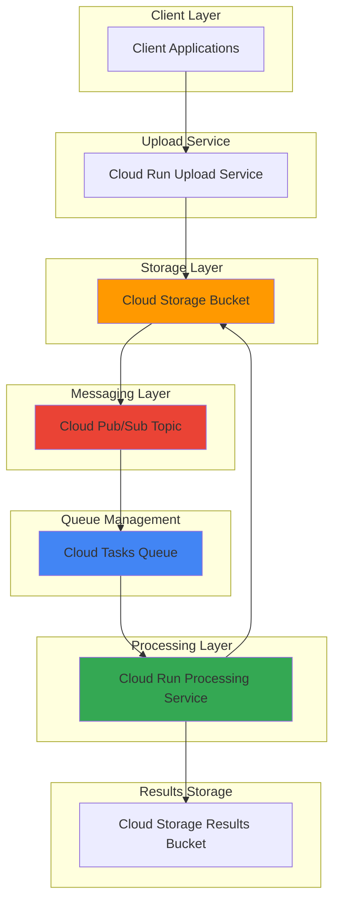

# Asynchronous File Processing Workflows with Cloud Tasks and Cloud Storage

## Problem

Modern applications frequently handle large file uploads that require time-intensive processing, such as video encoding, image manipulation, or document analysis. Traditional synchronous processing approaches create poor user experiences due to long wait times, timeout issues, and system resource constraints. Organizations need a scalable solution that can handle unpredictable file upload volumes while maintaining responsive user interfaces and ensuring reliable processing completion.

## Solution

This recipe implements a robust asynchronous file processing system using Cloud Tasks for reliable job scheduling and Cloud Storage for durable file handling. The architecture leverages Cloud Run services to process files asynchronously, with Cloud Pub/Sub providing event-driven triggers when files are uploaded. This approach ensures scalable, fault-tolerant processing that can handle varying workloads while maintaining system responsiveness and providing comprehensive monitoring capabilities.

## Architecture Diagram



## Prerequisites

1. Google Cloud Project with billing enabled and appropriate permissions
2. Google Cloud CLI (gcloud) installed and configured
3. Docker installed for containerizing Cloud Run services
4. Basic knowledge of Python, REST APIs, and cloud storage concepts
5. Understanding of asynchronous programming patterns
6. Estimated cost: $5-15 per month for moderate usage (including Cloud Storage, Cloud Tasks, Cloud Run, and Cloud Pub/Sub costs)

> **Note**: This recipe uses multiple Google Cloud services that may incur charges. Monitor your usage through the Google Cloud Console billing dashboard and set up billing alerts to avoid unexpected costs.

## Preparation

Cloud Tasks provides a fully managed service for dispatching, managing, and monitoring distributed tasks through queues. This foundational setup ensures reliable task execution with built-in retry mechanisms and dead letter handling. We'll establish the core infrastructure components including storage buckets for file handling and Cloud Pub/Sub topics for event-driven processing.

```bash
# Set environment variables for consistent resource naming
export PROJECT_ID=$(gcloud config get-value project)
export REGION="us-central1"
export ZONE="us-central1-a"

# Generate unique suffix for resource names
RANDOM_SUFFIX=$(openssl rand -hex 3)
export UPLOAD_BUCKET="file-upload-${RANDOM_SUFFIX}"
export RESULTS_BUCKET="file-results-${RANDOM_SUFFIX}"
export PUBSUB_TOPIC="file-processing-${RANDOM_SUFFIX}"
export TASK_QUEUE="file-processing-queue-${RANDOM_SUFFIX}"

# Set default project and region
gcloud config set project ${PROJECT_ID}
gcloud config set compute/region ${REGION}
gcloud config set compute/zone ${ZONE}

# Enable required Google Cloud APIs
gcloud services enable cloudtasks.googleapis.com
gcloud services enable storage.googleapis.com
gcloud services enable pubsub.googleapis.com
gcloud services enable run.googleapis.com
gcloud services enable cloudbuild.googleapis.com

echo "✅ Project configured: ${PROJECT_ID}"
echo "✅ Region set to: ${REGION}"
echo "✅ Required APIs enabled"
```

This preparation establishes the foundation for our asynchronous file processing system by enabling essential Google Cloud services and creating consistent naming conventions that will be used throughout the implementation.

## Steps

1. **Create Cloud Storage Buckets for File Management**:

   Cloud Storage provides the durable, scalable foundation for our file processing workflow. We'll create separate buckets for incoming files and processed results, implementing appropriate access controls and lifecycle policies. This separation ensures clean data flow and enables independent scaling of upload and processing operations.

   ```bash
   # Create bucket for file uploads
   gsutil mb -p ${PROJECT_ID} \
       -c STANDARD \
       -l ${REGION} \
       gs://${UPLOAD_BUCKET}
   
   # Create bucket for processed results
   gsutil mb -p ${PROJECT_ID} \
       -c STANDARD \
       -l ${REGION} \
       gs://${RESULTS_BUCKET}
   
   # Enable versioning for data protection
   gsutil versioning set on gs://${UPLOAD_BUCKET}
   gsutil versioning set on gs://${RESULTS_BUCKET}
   
   echo "✅ Cloud Storage buckets created successfully"
   ```

   The storage buckets are now configured with versioning enabled, providing both scalability and data protection. This foundational component supports the entire file processing pipeline, from initial upload through final result storage, while leveraging Google's global infrastructure for optimal performance.

2. **Create Cloud Pub/Sub Topic for Event-Driven Processing**:

   Cloud Pub/Sub enables decoupled, event-driven architecture by providing reliable message delivery between services. The topic will receive notifications when files are uploaded to Cloud Storage, triggering our asynchronous processing workflow. This approach ensures loose coupling and enables independent scaling of upload and processing components.

   ```bash
   # Create Pub/Sub topic for file processing events
   gcloud pubsub topics create ${PUBSUB_TOPIC}
   
   # Create subscription for the processing service
   gcloud pubsub subscriptions create \
       ${PUBSUB_TOPIC}-subscription \
       --topic=${PUBSUB_TOPIC} \
       --ack-deadline=60 \
       --message-retention-duration=7d
   
   echo "✅ Cloud Pub/Sub topic and subscription created"
   ```

   The Pub/Sub infrastructure now provides reliable event delivery with appropriate acknowledgment deadlines and message retention, ensuring no file processing events are lost even during high load periods or temporary service disruptions.

3. **Create Cloud Tasks Queue for Reliable Job Scheduling**:

   Cloud Tasks manages the execution of asynchronous tasks with built-in retry mechanisms and failure handling. The queue ensures reliable delivery of processing tasks to our Cloud Run services, providing visibility into task execution status and enabling efficient resource utilization through rate limiting and concurrency controls.

   ```bash
   # Create Cloud Tasks queue
   gcloud tasks queues create ${TASK_QUEUE} \
       --location=${REGION} \
       --max-dispatches-per-second=10 \
       --max-concurrent-dispatches=100 \
       --max-attempts=3 \
       --min-backoff=2s \
       --max-backoff=300s
   
   echo "✅ Cloud Tasks queue created with retry configuration"
   ```

   The task queue is configured with appropriate rate limiting and retry policies, ensuring reliable task execution while preventing system overload. These settings provide a balance between throughput and resource protection, automatically handling temporary failures with exponential backoff.

4. **Create File Upload Service Container**:

   The upload service handles file uploads from clients and initiates the processing workflow. This Cloud Run service provides a scalable endpoint for file uploads, validates incoming files, stores them in Cloud Storage, and triggers the asynchronous processing pipeline through Cloud Tasks.

   ```bash
   # Create upload service directory and files
   mkdir -p upload-service
   cd upload-service
   
   # Create the upload service application
   cat > main.py << 'EOF'
import os
import tempfile
from flask import Flask, request, jsonify
from google.cloud import storage, tasks_v2
from google.cloud.tasks_v2 import Task
from google.protobuf import timestamp_pb2
import json

app = Flask(__name__)

# Initialize clients
storage_client = storage.Client()
tasks_client = tasks_v2.CloudTasksClient()

PROJECT_ID = os.environ.get('PROJECT_ID')
REGION = os.environ.get('REGION')
UPLOAD_BUCKET = os.environ.get('UPLOAD_BUCKET')
TASK_QUEUE = os.environ.get('TASK_QUEUE')
PROCESSOR_URL = os.environ.get('PROCESSOR_URL')

@app.route('/upload', methods=['POST'])
def upload_file():
    """Handle file upload and queue processing task"""
    try:
        if 'file' not in request.files:
            return jsonify({'error': 'No file provided'}), 400
        
        file = request.files['file']
        if file.filename == '':
            return jsonify({'error': 'No file selected'}), 400
        
        # Upload file to Cloud Storage
        bucket = storage_client.bucket(UPLOAD_BUCKET)
        blob = bucket.blob(file.filename)
        blob.upload_from_file(file.stream)
        
        # Create task for processing
        parent = tasks_client.queue_path(PROJECT_ID, REGION, TASK_QUEUE)
        
        task_payload = {
            'bucket': UPLOAD_BUCKET,
            'filename': file.filename,
            'content_type': file.content_type or 'application/octet-stream'
        }
        
        task = Task(
            http_request={
                'http_method': tasks_v2.HttpMethod.POST,
                'url': PROCESSOR_URL,
                'headers': {'Content-Type': 'application/json'},
                'body': json.dumps(task_payload).encode('utf-8')
            }
        )
        
        # Queue the task
        response = tasks_client.create_task(parent=parent, task=task)
        
        return jsonify({
            'message': 'File uploaded and queued for processing',
            'filename': file.filename,
            'task_name': response.name
        }), 200
        
    except Exception as e:
        return jsonify({'error': str(e)}), 500

@app.route('/health', methods=['GET'])
def health_check():
    """Health check endpoint"""
    return jsonify({'status': 'healthy'}), 200

if __name__ == '__main__':
    app.run(host='0.0.0.0', port=int(os.environ.get('PORT', 8080)))
EOF
   
   # Create requirements file
   cat > requirements.txt << 'EOF'
Flask==2.3.3
google-cloud-storage==2.10.0
google-cloud-tasks==2.14.0
gunicorn==21.2.0
EOF
   
   # Create Dockerfile
   cat > Dockerfile << 'EOF'
FROM python:3.11-slim

WORKDIR /app

COPY requirements.txt .
RUN pip install --no-cache-dir -r requirements.txt

COPY . .

CMD ["gunicorn", "--bind", "0.0.0.0:8080", "--workers", "2", "--threads", "4", "--timeout", "0", "main:app"]
EOF
   
   cd ..
   echo "✅ Upload service container created"
   ```

   The upload service provides a robust file upload endpoint with proper error handling, Cloud Storage integration, and automatic task queuing. This service handles file validation, storage operations, and task creation, ensuring reliable initiation of the asynchronous processing workflow.

5. **Create File Processing Service Container**:

   The processing service performs the actual file processing operations, such as image resizing, document conversion, or data analysis. This Cloud Run service receives tasks from the Cloud Tasks queue, processes files stored in Cloud Storage, and saves results back to the results bucket with comprehensive error handling and logging.

   ```bash
   # Create processing service directory and files
   mkdir -p processing-service
   cd processing-service
   
   # Create the processing service application
   cat > main.py << 'EOF'
import os
import json
import tempfile
import time
from flask import Flask, request, jsonify
from google.cloud import storage
from PIL import Image
import logging

app = Flask(__name__)
logging.basicConfig(level=logging.INFO)

# Initialize clients
storage_client = storage.Client()

PROJECT_ID = os.environ.get('PROJECT_ID')
RESULTS_BUCKET = os.environ.get('RESULTS_BUCKET')

@app.route('/process', methods=['POST'])
def process_file():
    """Process uploaded file based on task payload"""
    try:
        # Parse task payload
        task_data = request.get_json()
        bucket_name = task_data.get('bucket')
        filename = task_data.get('filename')
        content_type = task_data.get('content_type', 'application/octet-stream')
        
        logging.info(f"Processing file: {filename} from bucket: {bucket_name}")
        
        # Download file from Cloud Storage
        source_bucket = storage_client.bucket(bucket_name)
        source_blob = source_bucket.blob(filename)
        
        with tempfile.NamedTemporaryFile() as temp_file:
            source_blob.download_to_filename(temp_file.name)
            
            # Perform processing based on content type
            if content_type.startswith('image/'):
                processed_filename = process_image(temp_file.name, filename)
            else:
                processed_filename = process_generic_file(temp_file.name, filename)
            
            # Upload processed file to results bucket
            results_bucket = storage_client.bucket(RESULTS_BUCKET)
            results_blob = results_bucket.blob(processed_filename)
            results_blob.upload_from_filename(temp_file.name)
            
            # Create processing metadata
            metadata = {
                'original_filename': filename,
                'processed_filename': processed_filename,
                'processing_time': time.time(),
                'content_type': content_type,
                'status': 'completed'
            }
            
            # Upload metadata file
            metadata_blob = results_bucket.blob(f"{processed_filename}.metadata.json")
            metadata_blob.upload_from_string(json.dumps(metadata, indent=2))
            
            logging.info(f"File processed successfully: {processed_filename}")
            
            return jsonify({
                'message': 'File processed successfully',
                'original_filename': filename,
                'processed_filename': processed_filename,
                'metadata': metadata
            }), 200
            
    except Exception as e:
        logging.error(f"Error processing file: {str(e)}")
        return jsonify({'error': str(e)}), 500

def process_image(file_path, original_filename):
    """Process image files - resize and optimize"""
    try:
        with Image.open(file_path) as img:
            # Resize image to thumbnail
            img.thumbnail((300, 300), Image.Resampling.LANCZOS)
            
            # Convert to RGB if necessary
            if img.mode != 'RGB':
                img = img.convert('RGB')
            
            # Save optimized image
            processed_name = f"thumb_{original_filename}"
            img.save(file_path, 'JPEG', quality=85, optimize=True)
            
            return processed_name
            
    except Exception as e:
        logging.error(f"Error processing image: {str(e)}")
        raise

def process_generic_file(file_path, original_filename):
    """Process generic files - add processing timestamp"""
    processed_name = f"processed_{int(time.time())}_{original_filename}"
    
    # In a real implementation, you would perform actual file processing here
    # This is a placeholder that demonstrates the workflow
    
    return processed_name

@app.route('/health', methods=['GET'])
def health_check():
    """Health check endpoint"""
    return jsonify({'status': 'healthy'}), 200

if __name__ == '__main__':
    app.run(host='0.0.0.0', port=int(os.environ.get('PORT', 8080)))
EOF
   
   # Create requirements file
   cat > requirements.txt << 'EOF'
Flask==2.3.3
google-cloud-storage==2.10.0
Pillow==10.0.0
gunicorn==21.2.0
EOF
   
   # Create Dockerfile
   cat > Dockerfile << 'EOF'
FROM python:3.11-slim

# Install system dependencies for image processing
RUN apt-get update && apt-get install -y \
    libpng-dev \
    libjpeg-dev \
    libfreetype6-dev \
    && rm -rf /var/lib/apt/lists/*

WORKDIR /app

COPY requirements.txt .
RUN pip install --no-cache-dir -r requirements.txt

COPY . .

CMD ["gunicorn", "--bind", "0.0.0.0:8080", "--workers", "2", "--threads", "4", "--timeout", "0", "main:app"]
EOF
   
   cd ..
   echo "✅ Processing service container created"
   ```

   The processing service implements comprehensive file processing capabilities with specialized handling for different file types. It includes proper error handling, logging, and metadata generation, ensuring reliable processing and result tracking for all uploaded files.

6. **Build and Deploy Cloud Run Services**:

   Cloud Run provides serverless container hosting that automatically scales based on demand. We'll build and deploy both services, configuring them with appropriate environment variables and resource limits to ensure optimal performance and cost efficiency.

   ```bash
   # Build and deploy upload service
   cd upload-service
   
   gcloud builds submit --tag gcr.io/${PROJECT_ID}/upload-service .
   
   gcloud run deploy upload-service \
       --image gcr.io/${PROJECT_ID}/upload-service \
       --region ${REGION} \
       --platform managed \
       --allow-unauthenticated \
       --memory 1Gi \
       --cpu 1 \
       --concurrency 100 \
       --max-instances 10 \
       --set-env-vars PROJECT_ID=${PROJECT_ID},REGION=${REGION},UPLOAD_BUCKET=${UPLOAD_BUCKET},TASK_QUEUE=${TASK_QUEUE}
   
   # Get upload service URL
   UPLOAD_SERVICE_URL=$(gcloud run services describe upload-service \
       --region ${REGION} \
       --format "value(status.url)")
   
   cd ../processing-service
   
   # Build and deploy processing service
   gcloud builds submit --tag gcr.io/${PROJECT_ID}/processing-service .
   
   gcloud run deploy processing-service \
       --image gcr.io/${PROJECT_ID}/processing-service \
       --region ${REGION} \
       --platform managed \
       --no-allow-unauthenticated \
       --memory 2Gi \
       --cpu 2 \
       --concurrency 50 \
       --max-instances 20 \
       --set-env-vars PROJECT_ID=${PROJECT_ID},RESULTS_BUCKET=${RESULTS_BUCKET}
   
   # Get processing service URL
   PROCESSING_SERVICE_URL=$(gcloud run services describe processing-service \
       --region ${REGION} \
       --format "value(status.url)")
   
   cd ..
   
   echo "✅ Cloud Run services deployed successfully"
   echo "Upload Service URL: ${UPLOAD_SERVICE_URL}"
   echo "Processing Service URL: ${PROCESSING_SERVICE_URL}"
   ```

   Both Cloud Run services are now deployed with appropriate scaling configurations and environment variables. The upload service is publicly accessible for file uploads, while the processing service is secured for internal task execution, ensuring proper security boundaries in the architecture.

7. **Configure Cloud Storage Event Notifications**:

   Cloud Storage event notifications enable automatic triggering of our processing workflow when files are uploaded. We'll configure the upload bucket to publish events to our Pub/Sub topic, creating a fully event-driven architecture that responds immediately to file uploads.

   ```bash
   # Create Cloud Storage notification configuration
   gsutil notification create \
       -t ${PUBSUB_TOPIC} \
       -f json \
       -e OBJECT_FINALIZE \
       gs://${UPLOAD_BUCKET}
   
   # Grant Cloud Storage service account permissions to publish to Pub/Sub
   GCS_SERVICE_ACCOUNT=$(gsutil kms serviceaccount -p ${PROJECT_ID})
   
   gcloud projects add-iam-policy-binding ${PROJECT_ID} \
       --member="serviceAccount:${GCS_SERVICE_ACCOUNT}" \
       --role="roles/pubsub.publisher"
   
   echo "✅ Cloud Storage notifications configured"
   ```

   The event notification system now automatically publishes messages to Pub/Sub when files are uploaded, enabling immediate processing initiation without polling or manual intervention. This creates a fully reactive system that scales efficiently with upload volume.

8. **Update Upload Service with Processing Service URL**:

   We need to update the upload service configuration to include the processing service URL, enabling proper task creation and queue management. This final configuration step completes the service interconnection required for end-to-end workflow execution.

   ```bash
   # Update upload service with processing service URL
   gcloud run services update upload-service \
       --region ${REGION} \
       --update-env-vars PROCESSOR_URL=${PROCESSING_SERVICE_URL}/process
   
   echo "✅ Upload service updated with processing service URL"
   ```

   The upload service can now create tasks that target the processing service, completing the asynchronous workflow configuration. This establishes the final connection between file upload and processing components.

9. **Create Service Account and IAM Permissions**:

   Proper IAM configuration ensures secure service-to-service communication while maintaining the principle of least privilege. We'll create dedicated service accounts for each Cloud Run service and grant appropriate permissions for Cloud Storage, Cloud Tasks, and Pub/Sub operations.

   ```bash
   # Create service account for upload service
   gcloud iam service-accounts create upload-service-sa \
       --display-name="Upload Service Account"
   
   # Create service account for processing service
   gcloud iam service-accounts create processing-service-sa \
       --display-name="Processing Service Account"
   
   # Grant permissions for upload service
   gcloud projects add-iam-policy-binding ${PROJECT_ID} \
       --member="serviceAccount:upload-service-sa@${PROJECT_ID}.iam.gserviceaccount.com" \
       --role="roles/storage.objectAdmin"
   
   gcloud projects add-iam-policy-binding ${PROJECT_ID} \
       --member="serviceAccount:upload-service-sa@${PROJECT_ID}.iam.gserviceaccount.com" \
       --role="roles/cloudtasks.enqueuer"
   
   # Grant permissions for processing service
   gcloud projects add-iam-policy-binding ${PROJECT_ID} \
       --member="serviceAccount:processing-service-sa@${PROJECT_ID}.iam.gserviceaccount.com" \
       --role="roles/storage.objectAdmin"
   
   # Update Cloud Run services to use service accounts
   gcloud run services update upload-service \
       --region ${REGION} \
       --service-account upload-service-sa@${PROJECT_ID}.iam.gserviceaccount.com
   
   gcloud run services update processing-service \
       --region ${REGION} \
       --service-account processing-service-sa@${PROJECT_ID}.iam.gserviceaccount.com
   
   echo "✅ Service accounts and IAM permissions configured"
   ```

   The security configuration now follows Google Cloud best practices with dedicated service accounts and minimal required permissions, ensuring secure operation while maintaining functionality across all system components.

## Validation & Testing

1. **Verify Cloud Run Services Are Running**:

   ```bash
   # Check upload service status
   gcloud run services describe upload-service \
       --region ${REGION} \
       --format "value(status.conditions[0].status,status.url)"
   
   # Check processing service status
   gcloud run services describe processing-service \
       --region ${REGION} \
       --format "value(status.conditions[0].status,status.url)"
   ```

   Expected output: Both services should show "True" status, indicating they are ready to serve traffic.

2. **Test File Upload and Processing Workflow**:

   ```bash
   # Create a test image file
   echo "Creating test image..."
   python3 -c "
from PIL import Image
import os
img = Image.new('RGB', (800, 600), color='red')
img.save('test-image.jpg', 'JPEG')
print('Test image created: test-image.jpg')
"
   
   # Upload file using the upload service
   curl -X POST \
       -F "file=@test-image.jpg" \
       ${UPLOAD_SERVICE_URL}/upload
   
   # Wait for processing to complete
   sleep 30
   
   # Check processed files in results bucket
   gsutil ls gs://${RESULTS_BUCKET}/
   ```

   Expected output: The upload should return a success message with task information, and the results bucket should contain processed files after a brief delay.

3. **Verify Cloud Tasks Queue Status**:

   ```bash
   # Check queue statistics
   gcloud tasks queues describe ${TASK_QUEUE} \
       --location ${REGION} \
       --format "table(name,state,rateLimits.maxDispatchesPerSecond)"
   
   # List recent tasks
   gcloud tasks list --queue ${TASK_QUEUE} \
       --location ${REGION} \
       --limit 10
   ```

   Expected output: The queue should be in RUNNING state with configured rate limits, and completed tasks should be visible in the task list.

4. **Test Error Handling and Retry Mechanisms**:

   ```bash
   # Test with invalid file to verify error handling
   echo "invalid file content" > invalid-file.txt
   
   curl -X POST \
       -F "file=@invalid-file.txt" \
       ${UPLOAD_SERVICE_URL}/upload
   
   # Check Cloud Tasks queue for retry behavior
   gcloud tasks list --queue ${TASK_QUEUE} \
       --location ${REGION} \
       --limit 5
   ```

   Expected output: The system should handle errors gracefully and show retry attempts in the task queue.

## Cleanup

1. **Remove Cloud Run Services**:

   ```bash
   # Delete Cloud Run services
   gcloud run services delete upload-service \
       --region ${REGION} \
       --quiet
   
   gcloud run services delete processing-service \
       --region ${REGION} \
       --quiet
   
   echo "✅ Cloud Run services deleted"
   ```

2. **Remove Cloud Tasks Queue**:

   ```bash
   # Delete Cloud Tasks queue
   gcloud tasks queues delete ${TASK_QUEUE} \
       --location ${REGION} \
       --quiet
   
   echo "✅ Cloud Tasks queue deleted"
   ```

3. **Remove Cloud Storage Resources**:

   ```bash
   # Remove all objects and buckets
   gsutil -m rm -r gs://${UPLOAD_BUCKET}
   gsutil -m rm -r gs://${RESULTS_BUCKET}
   
   echo "✅ Cloud Storage buckets and contents deleted"
   ```

4. **Remove Pub/Sub Resources**:

   ```bash
   # Delete Pub/Sub subscription and topic
   gcloud pubsub subscriptions delete ${PUBSUB_TOPIC}-subscription --quiet
   gcloud pubsub topics delete ${PUBSUB_TOPIC} --quiet
   
   echo "✅ Pub/Sub resources deleted"
   ```

5. **Remove Service Accounts and IAM Bindings**:

   ```bash
   # Delete service accounts
   gcloud iam service-accounts delete \
       upload-service-sa@${PROJECT_ID}.iam.gserviceaccount.com \
       --quiet
   
   gcloud iam service-accounts delete \
       processing-service-sa@${PROJECT_ID}.iam.gserviceaccount.com \
       --quiet
   
   echo "✅ Service accounts deleted"
   ```

6. **Remove Container Images**:

   ```bash
   # Delete container images from Container Registry
   gcloud container images delete gcr.io/${PROJECT_ID}/upload-service --quiet
   gcloud container images delete gcr.io/${PROJECT_ID}/processing-service --quiet
   
   echo "✅ Container images deleted"
   ```

## Discussion

This asynchronous file processing system demonstrates the power of Google Cloud's serverless and managed services for building scalable, reliable workflows. The architecture leverages several key Google Cloud services working in harmony: [Cloud Tasks](https://cloud.google.com/tasks/docs) provides reliable task queuing with built-in retry mechanisms, [Cloud Storage](https://cloud.google.com/storage/docs) offers durable file storage with event notifications, [Cloud Run](https://cloud.google.com/run/docs) enables serverless container hosting that scales automatically, and [Cloud Pub/Sub](https://cloud.google.com/pubsub/docs) facilitates event-driven communication between components.

The separation of concerns between upload and processing services follows microservices best practices, enabling independent scaling and maintenance. The upload service handles user interactions and file storage, while the processing service focuses on compute-intensive tasks. This design allows each service to be optimized for its specific workload: the upload service prioritizes availability and response time, while the processing service can be configured for higher memory and CPU resources. Cloud Tasks serves as the reliable intermediary, ensuring processing requests are not lost even during high load or service disruptions.

The event-driven architecture using Cloud Storage notifications and Pub/Sub creates a reactive system that responds immediately to file uploads without polling. This approach minimizes latency and resource usage while ensuring reliable processing initiation. The system can handle unpredictable workloads efficiently, scaling from zero to thousands of concurrent processing tasks based on demand. The comprehensive error handling and retry mechanisms ensure robust operation even in the face of temporary failures or resource constraints.

Cost optimization is achieved through serverless architectures that charge only for actual usage, automatic scaling that prevents over-provisioning, and efficient resource utilization through proper service configuration. The system follows Google Cloud's [Well-Architected Framework](https://cloud.google.com/architecture/framework) principles for reliability, security, and operational excellence, implementing proper IAM controls, monitoring capabilities, and maintenance procedures.

> **Tip**: Monitor your Cloud Tasks queue metrics in [Cloud Monitoring](https://cloud.google.com/monitoring/docs) to identify bottlenecks and optimize processing throughput. Set up alerts for queue depth and processing latency to proactively address performance issues.

## Challenge

Extend this solution by implementing these enhancements:

1. **Add Cloud Monitoring and Alerting**: Implement comprehensive monitoring using Cloud Monitoring to track processing metrics, queue depth, and error rates. Create alerts for system health and performance thresholds.

2. **Implement Dead Letter Queue Handling**: Configure dead letter queues for failed tasks and create a Cloud Run service to analyze and retry failed processing attempts with enhanced error reporting.

3. **Add Real-time Progress Tracking**: Integrate Cloud Firestore to store processing status and implement WebSocket connections for real-time progress updates to client applications.

4. **Implement File Type-Specific Processing**: Create specialized processing services for different file types (video encoding, document analysis, data transformation) with appropriate resource allocation and processing logic.

5. **Add Workflow Orchestration**: Use Cloud Workflows to create complex processing pipelines that involve multiple processing stages, conditional logic, and approval workflows for sensitive file types.

## Infrastructure Code

*Infrastructure code will be generated after recipe approval.*