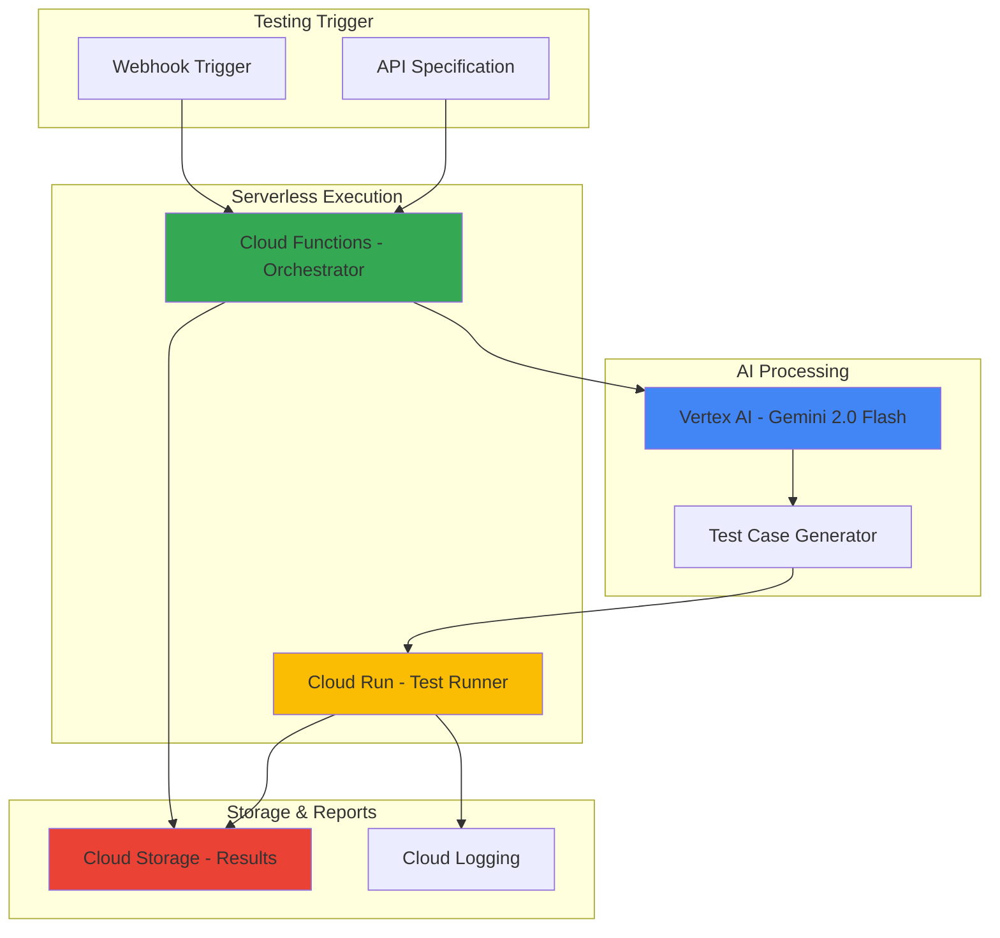

# Automated API Testing with Gemini and Functions

## Problem

Organizations struggle with maintaining comprehensive API test coverage as their applications scale, often relying on manual test case creation that is time-consuming, error-prone, and fails to capture edge cases. Traditional testing approaches cannot adapt to rapidly changing API specifications and lack the intelligence to generate contextually relevant test scenarios, leading to decreased code quality and increased production incidents.

## Solution

Build an AI-powered API testing system that leverages Gemini 2.0 Flash to automatically generate intelligent test cases, validate API responses, and create comprehensive test reports. This serverless solution uses Cloud Functions for orchestration, Cloud Run for scalable execution, and Cloud Storage for persistent test result storage, providing a cost-effective and intelligent testing pipeline that scales with your development workflow.

## Architecture Diagram



## Prerequisites

1. Google Cloud account with billing enabled and project owner permissions
2. Google Cloud CLI installed and configured (or Cloud Shell access)
3. Basic understanding of API testing concepts and HTTP protocols
4. Familiarity with Python programming for customizing test logic
5. Estimated cost: $5-15 per month for moderate usage (Vertex AI, Cloud Functions, Cloud Run, and Storage)

> **Note**: This recipe uses Vertex AI Gemini models which may incur charges based on token usage. Monitor your usage through Google Cloud Console billing dashboard.

## Preparation

```bash
# Set environment variables for GCP resources
export PROJECT_ID="api-testing-$(date +%s)"
export REGION="us-central1"
export ZONE="us-central1-a"

# Generate unique suffix for resource names
RANDOM_SUFFIX=$(openssl rand -hex 3)

# Set default project and region
gcloud config set project ${PROJECT_ID}
gcloud config set compute/region ${REGION}
gcloud config set compute/zone ${ZONE}

# Enable required APIs
gcloud services enable aiplatform.googleapis.com
gcloud services enable cloudfunctions.googleapis.com
gcloud services enable run.googleapis.com
gcloud services enable storage.googleapis.com
gcloud services enable logging.googleapis.com

# Create environment variables for resource names
export FUNCTION_NAME="api-test-orchestrator-${RANDOM_SUFFIX}"
export SERVICE_NAME="api-test-runner-${RANDOM_SUFFIX}"
export BUCKET_NAME="${PROJECT_ID}-test-results-${RANDOM_SUFFIX}"

echo "✅ Project configured: ${PROJECT_ID}"
echo "✅ APIs enabled and resources named"
```

## Steps

1. **Create Cloud Storage Bucket for Test Results**:

   Google Cloud Storage provides unified object storage with global edge caching and strong consistency guarantees. Creating a bucket with appropriate location and storage class settings establishes the foundation for storing test results, API specifications, and generated reports that can scale from gigabytes to exabytes while maintaining high performance and cost efficiency.

   ```bash
   # Create bucket for test results and reports
   gsutil mb -p ${PROJECT_ID} \
       -c STANDARD \
       -l ${REGION} \
       gs://${BUCKET_NAME}
   
   # Enable versioning for test result history
   gsutil versioning set on gs://${BUCKET_NAME}
   
   # Set up bucket structure
   gsutil cp /dev/null gs://${BUCKET_NAME}/test-specifications/.keep
   gsutil cp /dev/null gs://${BUCKET_NAME}/test-results/.keep
   gsutil cp /dev/null gs://${BUCKET_NAME}/reports/.keep
   
   echo "✅ Storage bucket created with versioning enabled"
   ```

   The storage bucket is now ready with versioning enabled and organized folder structure, providing both scalability and data protection for test artifacts. This foundational component supports the entire testing pipeline while Google's global infrastructure ensures low-latency access.

2. **Create Test Case Generator Function**:

   Cloud Functions provides serverless event processing that automatically scales based on HTTP requests. This function integrates with Vertex AI Gemini to intelligently analyze API specifications and generate comprehensive test cases, including edge cases and negative testing scenarios that traditional tools might miss.

   ```bash
   # Create function source directory
   mkdir -p test-generator-function
   cd test-generator-function
   
   # Create main function file
   cat > main.py << 'EOF'
import json
import os
from google.cloud import aiplatform
from google.cloud import storage
import functions_framework
import vertexai
from vertexai.generative_models import GenerativeModel

# Initialize Vertex AI
PROJECT_ID = os.environ.get('GCP_PROJECT')
LOCATION = os.environ.get('FUNCTION_REGION', 'us-central1')
vertexai.init(project=PROJECT_ID, location=LOCATION)

@functions_framework.http
def generate_test_cases(request):
    """Generate test cases using Gemini AI based on API specification"""
    
    if request.method != 'POST':
        return {'error': 'Only POST method supported'}, 405
    
    try:
        # Parse request data
        request_json = request.get_json(silent=True)
        api_spec = request_json.get('api_specification', '')
        target_endpoints = request_json.get('endpoints', [])
        test_types = request_json.get('test_types', ['functional', 'security', 'performance'])
        
        if not api_spec:
            return {'error': 'API specification required'}, 400
        
        # Initialize Gemini 2.0 Flash model
        model = GenerativeModel("gemini-2.0-flash")
        
        # Create comprehensive prompt for test generation
        prompt = f"""
        Analyze the following API specification and generate comprehensive test cases:
        
        API Specification:
        {api_spec}
        
        Target Endpoints: {target_endpoints if target_endpoints else 'All endpoints'}
        Test Types: {test_types}
        
        Generate test cases that include:
        1. Positive test cases for each endpoint
        2. Negative test cases (invalid inputs, edge cases)
        3. Security test cases (authentication, authorization, input validation)
        4. Performance test cases (load testing scenarios)
        5. Data validation test cases
        
        Format the response as a JSON array with the following structure:
        {{
            "test_cases": [
                {{
                    "id": "unique_test_id",
                    "name": "test_case_name",
                    "description": "test_description",
                    "endpoint": "api_endpoint",
                    "method": "HTTP_method",
                    "headers": {{}},
                    "payload": {{}},
                    "expected_status": 200,
                    "expected_response": {{}},
                    "test_type": "functional|security|performance",
                    "priority": "high|medium|low"
                }}
            ]
        }}
        
        Ensure test cases cover edge cases, error conditions, and security vulnerabilities.
        """
        
        # Generate test cases using Gemini
        response = model.generate_content(prompt)
        
        # Parse and validate the AI response
        ai_response = response.text
        
        # Store generated test cases in Cloud Storage
        storage_client = storage.Client()
        bucket_name = os.environ.get('BUCKET_NAME')
        bucket = storage_client.bucket(bucket_name)
        
        # Create blob for test cases
        blob_name = f"test-specifications/generated-tests-{request_json.get('request_id', 'unknown')}.json"
        blob = bucket.blob(blob_name)
        blob.upload_from_string(ai_response, content_type='application/json')
        
        return {
            'status': 'success',
            'test_cases_generated': True,
            'storage_location': f"gs://{bucket_name}/{blob_name}",
            'ai_response': ai_response
        }
        
    except Exception as e:
        return {'error': f'Test generation failed: {str(e)}'}, 500

EOF
   
   # Create requirements file with latest stable versions
   cat > requirements.txt << 'EOF'
functions-framework==3.*
google-cloud-aiplatform==1.70.*
google-cloud-storage==2.18.*
vertexai==1.70.*
EOF
   
   echo "✅ Test generator function code created"
   ```

   The Cloud Function now has AI-powered test case generation capabilities using Gemini 2.0 Flash, providing intelligent analysis of API specifications and comprehensive test scenario creation with built-in scaling and error handling.

3. **Deploy Test Generator Cloud Function**:

   Deploying the Cloud Function with appropriate environment variables and memory allocation ensures optimal performance for AI model interactions. The function automatically scales based on request volume while maintaining cost efficiency through pay-per-invocation pricing.

   ```bash
   # Deploy the test generator function with current Python runtime
   gcloud functions deploy ${FUNCTION_NAME} \
       --gen2 \
       --runtime python312 \
       --trigger-http \
       --source . \
       --entry-point generate_test_cases \
       --memory 1GB \
       --timeout 300s \
       --set-env-vars BUCKET_NAME=${BUCKET_NAME} \
       --allow-unauthenticated \
       --region=${REGION}
   
   # Get function URL
   FUNCTION_URL=$(gcloud functions describe ${FUNCTION_NAME} \
       --region=${REGION} \
       --format="value(serviceConfig.uri)")
   
   cd ..
   
   echo "✅ Test generator function deployed"
   echo "Function URL: ${FUNCTION_URL}"
   ```

   The Cloud Function is now deployed with proper resource allocation and environment configuration, ready to process API specifications and generate intelligent test cases using Vertex AI Gemini.

4. **Create Test Runner Cloud Run Service**:

   Cloud Run provides serverless container execution that scales to zero when not in use, making it perfect for running generated test cases. This service executes the AI-generated tests against target APIs and collects detailed results for analysis and reporting.

   ```bash
   # Create Cloud Run service directory
   mkdir -p test-runner-service
   cd test-runner-service
   
   # Create main application file
   cat > main.py << 'EOF'
import json
import os
import time
import requests
from google.cloud import storage
from google.cloud import logging as cloud_logging
from flask import Flask, request, jsonify
import concurrent.futures
from threading import Lock

app = Flask(__name__)

# Initialize Cloud Logging
logging_client = cloud_logging.Client()
logging_client.setup_logging()

# Thread-safe result storage
results_lock = Lock()
test_results = []

class APITestRunner:
    def __init__(self, bucket_name):
        self.storage_client = storage.Client()
        self.bucket_name = bucket_name
        
    def execute_test_case(self, test_case):
        """Execute a single test case and return results"""
        start_time = time.time()
        
        try:
            # Prepare request
            url = test_case.get('endpoint', '')
            method = test_case.get('method', 'GET').upper()
            headers = test_case.get('headers', {})
            payload = test_case.get('payload', {})
            expected_status = test_case.get('expected_status', 200)
            timeout = test_case.get('timeout', 30)
            
            # Execute HTTP request
            response = requests.request(
                method=method,
                url=url,
                headers=headers,
                json=payload if payload else None,
                timeout=timeout
            )
            
            execution_time = time.time() - start_time
            
            # Validate response
            status_match = response.status_code == expected_status
            
            # Create test result
            result = {
                'test_id': test_case.get('id'),
                'test_name': test_case.get('name'),
                'status': 'PASSED' if status_match else 'FAILED',
                'execution_time': execution_time,
                'actual_status': response.status_code,
                'expected_status': expected_status,
                'response_size': len(response.content),
                'endpoint': url,
                'method': method,
                'timestamp': time.time(),
                'error_message': None if status_match else f"Status mismatch: expected {expected_status}, got {response.status_code}"
            }
            
            return result
            
        except Exception as e:
            execution_time = time.time() - start_time
            return {
                'test_id': test_case.get('id'),
                'test_name': test_case.get('name'),
                'status': 'ERROR',
                'execution_time': execution_time,
                'actual_status': None,
                'expected_status': test_case.get('expected_status'),
                'response_size': 0,
                'endpoint': test_case.get('endpoint'),
                'method': test_case.get('method'),
                'timestamp': time.time(),
                'error_message': str(e)
            }
    
    def run_test_suite(self, test_cases, max_workers=10):
        """Execute multiple test cases concurrently"""
        results = []
        
        with concurrent.futures.ThreadPoolExecutor(max_workers=max_workers) as executor:
            future_to_test = {
                executor.submit(self.execute_test_case, test_case): test_case 
                for test_case in test_cases
            }
            
            for future in concurrent.futures.as_completed(future_to_test):
                result = future.result()
                results.append(result)
        
        return results
    
    def save_results(self, results, test_run_id):
        """Save test results to Cloud Storage"""
        bucket = self.storage_client.bucket(self.bucket_name)
        
        # Save detailed results
        results_blob = bucket.blob(f"test-results/{test_run_id}-detailed.json")
        results_blob.upload_from_string(
            json.dumps(results, indent=2),
            content_type='application/json'
        )
        
        # Generate summary report
        summary = self.generate_summary(results)
        summary_blob = bucket.blob(f"reports/{test_run_id}-summary.json")
        summary_blob.upload_from_string(
            json.dumps(summary, indent=2),
            content_type='application/json'
        )
        
        return {
            'detailed_results': f"gs://{self.bucket_name}/test-results/{test_run_id}-detailed.json",
            'summary_report': f"gs://{self.bucket_name}/reports/{test_run_id}-summary.json"
        }
    
    def generate_summary(self, results):
        """Generate test execution summary"""
        total_tests = len(results)
        passed_tests = sum(1 for r in results if r['status'] == 'PASSED')
        failed_tests = sum(1 for r in results if r['status'] == 'FAILED')
        error_tests = sum(1 for r in results if r['status'] == 'ERROR')
        
        avg_execution_time = sum(r['execution_time'] for r in results) / total_tests if total_tests > 0 else 0
        
        return {
            'test_run_timestamp': time.time(),
            'total_tests': total_tests,
            'passed_tests': passed_tests,
            'failed_tests': failed_tests,
            'error_tests': error_tests,
            'pass_rate': (passed_tests / total_tests * 100) if total_tests > 0 else 0,
            'average_execution_time': avg_execution_time,
            'fastest_test': min((r['execution_time'] for r in results), default=0),
            'slowest_test': max((r['execution_time'] for r in results), default=0)
        }

@app.route('/run-tests', methods=['POST'])
def run_tests():
    """Execute test cases provided in request"""
    try:
        data = request.get_json()
        test_cases = data.get('test_cases', [])
        test_run_id = data.get('test_run_id', f"run-{int(time.time())}")
        
        if not test_cases:
            return jsonify({'error': 'No test cases provided'}), 400
        
        # Initialize test runner
        bucket_name = os.environ.get('BUCKET_NAME')
        runner = APITestRunner(bucket_name)
        
        # Execute tests
        results = runner.run_test_suite(test_cases)
        
        # Save results
        storage_info = runner.save_results(results, test_run_id)
        
        return jsonify({
            'status': 'completed',
            'test_run_id': test_run_id,
            'total_tests': len(results),
            'results_summary': runner.generate_summary(results),
            'storage_locations': storage_info
        })
        
    except Exception as e:
        return jsonify({'error': f'Test execution failed: {str(e)}'}), 500

@app.route('/health', methods=['GET'])
def health():
    """Health check endpoint"""
    return jsonify({'status': 'healthy', 'timestamp': time.time()})

if __name__ == '__main__':
    port = int(os.environ.get('PORT', 8080))
    app.run(host='0.0.0.0', port=port)
EOF
   
   # Create requirements file with current stable versions
   cat > requirements.txt << 'EOF'
Flask==3.0.*
google-cloud-storage==2.18.*
google-cloud-logging==3.11.*
requests==2.32.*
gunicorn==23.0.*
EOF
   
   # Create Dockerfile
   cat > Dockerfile << 'EOF'
FROM python:3.12-slim

WORKDIR /app

COPY requirements.txt .
RUN pip install --no-cache-dir -r requirements.txt

COPY . .

EXPOSE 8080

CMD ["gunicorn", "--bind", "0.0.0.0:8080", "main:app"]
EOF
   
   echo "✅ Test runner service code created"
   ```

   The Cloud Run service now has comprehensive test execution capabilities with concurrent processing, detailed result collection, and automatic report generation, providing scalable test execution infrastructure.

5. **Deploy Test Runner Cloud Run Service**:

   Deploying the Cloud Run service with proper resource allocation and environment configuration enables scalable test execution. The service automatically scales based on request volume and scales to zero when idle, optimizing costs.

   ```bash
   # Build and deploy Cloud Run service
   gcloud run deploy ${SERVICE_NAME} \
       --source . \
       --region=${REGION} \
       --allow-unauthenticated \
       --set-env-vars BUCKET_NAME=${BUCKET_NAME} \
       --memory 2Gi \
       --cpu 2 \
       --timeout 900 \
       --max-instances 10 \
       --platform managed
   
   # Get service URL
   SERVICE_URL=$(gcloud run services describe ${SERVICE_NAME} \
       --region=${REGION} \
       --format="value(status.url)")
   
   cd ..
   
   echo "✅ Test runner service deployed"
   echo "Service URL: ${SERVICE_URL}"
   ```

   The Cloud Run service is now deployed with optimal resource allocation and scaling configuration, ready to execute test cases concurrently with automatic result storage and report generation.

6. **Create End-to-End Testing Workflow**:

   The workflow orchestrates the complete testing pipeline by combining the AI-powered test generation with scalable test execution. This integration demonstrates how serverless components work together to create an intelligent testing system.

   ```bash
   # Create workflow script
   cat > test-workflow.py << 'EOF'
import json
import requests
import time
import sys
import os

def run_api_testing_workflow(api_spec, target_base_url):
    """Complete API testing workflow"""
    
    print("🚀 Starting automated API testing workflow...")
    
    # Step 1: Generate test cases using AI
    print("\n📝 Generating test cases with Gemini AI...")
    
    function_url = os.environ.get('FUNCTION_URL')
    if not function_url:
        print("❌ FUNCTION_URL environment variable not set")
        return False
    
    generation_payload = {
        "api_specification": api_spec,
        "endpoints": [f"{target_base_url}/posts", f"{target_base_url}/users"],
        "test_types": ["functional", "security"],
        "request_id": f"workflow-{int(time.time())}"
    }
    
    response = requests.post(function_url, json=generation_payload)
    
    if response.status_code != 200:
        print(f"❌ Test generation failed: {response.text}")
        return False
    
    generation_result = response.json()
    print(f"✅ Test cases generated: {generation_result['storage_location']}")
    
    # Parse AI-generated test cases
    try:
        ai_response = json.loads(generation_result['ai_response'])
        test_cases = ai_response.get('test_cases', [])
    except json.JSONDecodeError:
        print("❌ Failed to parse AI-generated test cases")
        return False
    
    print(f"📋 Generated {len(test_cases)} test cases")
    
    # Step 2: Execute test cases
    print("\n🧪 Executing test cases...")
    
    service_url = os.environ.get('SERVICE_URL')
    if not service_url:
        print("❌ SERVICE_URL environment variable not set")
        return False
    
    test_run_id = f"workflow-{int(time.time())}"
    
    execution_payload = {
        "test_cases": test_cases,
        "test_run_id": test_run_id
    }
    
    response = requests.post(f"{service_url}/run-tests", json=execution_payload)
    
    if response.status_code != 200:
        print(f"❌ Test execution failed: {response.text}")
        return False
    
    execution_result = response.json()
    print(f"✅ Test execution completed: {execution_result['test_run_id']}")
    
    # Step 3: Display results
    print("\n📊 Test Results Summary:")
    summary = execution_result['results_summary']
    print(f"   Total Tests: {summary['total_tests']}")
    print(f"   Passed: {summary['passed_tests']}")
    print(f"   Failed: {summary['failed_tests']}")
    print(f"   Errors: {summary['error_tests']}")
    print(f"   Pass Rate: {summary['pass_rate']:.1f}%")
    print(f"   Avg Execution Time: {summary['average_execution_time']:.2f}s")
    
    storage_locations = execution_result['storage_locations']
    print(f"\n💾 Results stored at:")
    print(f"   Detailed: {storage_locations['detailed_results']}")
    print(f"   Summary: {storage_locations['summary_report']}")
    
    return True

# Example API specification for demonstration
sample_api_spec = '''
{
  "openapi": "3.0.0",
  "info": {
    "title": "JSONPlaceholder API",
    "version": "1.0.0"
  },
  "paths": {
    "/posts": {
      "get": {
        "summary": "Get all posts",
        "responses": {
          "200": {
            "description": "List of posts"
          }
        }
      },
      "post": {
        "summary": "Create post",
        "requestBody": {
          "content": {
            "application/json": {
              "schema": {
                "type": "object",
                "properties": {
                  "title": {"type": "string"},
                  "body": {"type": "string"},
                  "userId": {"type": "integer"}
                }
              }
            }
          }
        },
        "responses": {
          "201": {
            "description": "Post created"
          }
        }
      }
    },
    "/users": {
      "get": {
        "summary": "Get all users",
        "responses": {
          "200": {
            "description": "List of users"
          }
        }
      }
    }
  }
}
'''

if __name__ == "__main__":
    # Use JSONPlaceholder for testing - a free REST API for testing
    target_url = "https://jsonplaceholder.typicode.com"
    
    if run_api_testing_workflow(sample_api_spec, target_url):
        print("\n🎉 Automated API testing workflow completed successfully!")
    else:
        print("\n💥 Workflow failed!")
        sys.exit(1)
EOF
   
   # Set executable permissions
   chmod +x test-workflow.py
   
   echo "✅ End-to-end testing workflow created"
   echo "Run with: FUNCTION_URL=<function-url> SERVICE_URL=<service-url> python test-workflow.py"
   ```

   The complete workflow now demonstrates the integration between AI-powered test generation and scalable execution, providing a comprehensive automated testing solution that can adapt to different API specifications.

## Validation & Testing

1. **Verify Cloud Functions deployment**:

   ```bash
   # Test function endpoint
   curl -X POST "${FUNCTION_URL}" \
       -H "Content-Type: application/json" \
       -d '{
           "api_specification": "Sample API spec",
           "endpoints": ["https://httpbin.org/get"],
           "request_id": "validation-test"
       }'
   ```

   Expected output: JSON response with generated test cases and storage location.

2. **Verify Cloud Run service**:

   ```bash
   # Test service health endpoint
   curl "${SERVICE_URL}/health"
   
   # Test basic test execution
   curl -X POST "${SERVICE_URL}/run-tests" \
       -H "Content-Type: application/json" \
       -d '{
           "test_cases": [{
               "id": "test-1",
               "name": "Health Check Test",
               "endpoint": "https://httpbin.org/status/200",
               "method": "GET",
               "expected_status": 200
           }],
           "test_run_id": "validation-run"
       }'
   ```

   Expected output: Test execution results with summary statistics.

3. **Verify storage bucket access**:

   ```bash
   # List bucket contents
   gsutil ls -r gs://${BUCKET_NAME}/
   
   # Check for test results
   gsutil ls gs://${BUCKET_NAME}/test-results/
   gsutil ls gs://${BUCKET_NAME}/reports/
   ```

   Expected output: Organized folder structure with test artifacts.

4. **Test complete workflow**:

   ```bash
   # Run the complete testing workflow
   export FUNCTION_URL="${FUNCTION_URL}"
   export SERVICE_URL="${SERVICE_URL}"
   python test-workflow.py
   ```

   Expected output: Complete workflow execution with AI-generated tests and results.

## Cleanup

1. **Remove Cloud Functions**:

   ```bash
   # Delete the test generator function
   gcloud functions delete ${FUNCTION_NAME} \
       --region=${REGION} \
       --quiet
   
   echo "✅ Cloud Function deleted"
   ```

2. **Remove Cloud Run service**:

   ```bash
   # Delete the test runner service
   gcloud run services delete ${SERVICE_NAME} \
       --region=${REGION} \
       --quiet
   
   echo "✅ Cloud Run service deleted"
   ```

3. **Remove storage bucket and contents**:

   ```bash
   # Remove all bucket contents and the bucket itself
   gsutil -m rm -r gs://${BUCKET_NAME}
   
   echo "✅ Storage bucket removed"
   ```

4. **Clean up local files**:

   ```bash
   # Remove local development files
   rm -rf test-generator-function/
   rm -rf test-runner-service/
   rm -f test-workflow.py
   
   echo "✅ Local files cleaned up"
   ```

5. **Disable APIs (optional)**:

   ```bash
   # Disable APIs if no longer needed
   gcloud services disable aiplatform.googleapis.com --force
   gcloud services disable cloudfunctions.googleapis.com --force
   gcloud services disable run.googleapis.com --force
   
   echo "✅ APIs disabled"
   ```

## Discussion

This automated API testing solution demonstrates the power of combining AI with Google Cloud's serverless infrastructure to create intelligent, scalable testing pipelines. The Vertex AI Gemini 2.0 Flash model provides sophisticated natural language understanding to analyze API specifications and generate comprehensive test cases that go beyond simple happy-path scenarios, including security tests, edge cases, and performance validations that human testers might overlook.

The serverless architecture offers significant advantages for testing workloads that are inherently sporadic and unpredictable. Cloud Functions handle the orchestration and AI integration with automatic scaling and pay-per-invocation pricing, while Cloud Run provides robust test execution with concurrent processing capabilities that can handle large test suites efficiently. The combination scales from zero to handle thousands of test cases and automatically scales back down, making it cost-effective for organizations of any size.

The solution's use of Cloud Storage for persistent result storage creates an auditable testing history that supports compliance requirements and enables trend analysis over time. The structured storage approach with versioning ensures that test results are never lost and can be easily retrieved for debugging or regulatory purposes. Integration with Cloud Logging provides comprehensive observability into the testing process, enabling teams to identify bottlenecks and optimize their testing strategies.

Security considerations are built into the architecture through IAM-based access controls, with each component having minimal required permissions. The solution can be extended to support authenticated API testing by integrating with Google Cloud Secret Manager for secure credential storage and management. For more information on Google Cloud security best practices, see [Google Cloud Security Documentation](https://cloud.google.com/security/best-practices).

> **Tip**: Monitor Vertex AI token usage through Google Cloud Console to optimize costs. Consider implementing caching mechanisms for frequently tested API specifications to reduce AI model calls while maintaining test coverage quality.

## Challenge

Extend this solution by implementing these enhancements:

1. **Advanced Test Orchestration**: Integrate with Cloud Workflows to create complex testing scenarios with conditional logic, parallel execution branches, and dependency management between test suites.

2. **Performance Testing Integration**: Enhance the solution with Google Cloud Load Testing capabilities using Cloud Run and Cloud Monitoring to automatically detect performance regressions and generate load testing reports.

3. **Continuous Integration Pipeline**: Connect the testing system to Cloud Build for automatic trigger on code commits, integrating with GitHub Actions or GitLab CI/CD to provide immediate feedback on API changes.

4. **ML-Powered Test Analysis**: Implement additional AI capabilities using AutoML to analyze test failure patterns, predict flaky tests, and automatically suggest API improvements based on testing history.

5. **Multi-Environment Testing**: Extend the architecture to support testing across multiple environments (dev, staging, production) with environment-specific test configurations and automated promotion workflows based on test results.

## Infrastructure Code

### Available Infrastructure as Code:

- [Infrastructure Code Overview](code/README.md) - Detailed description of all infrastructure components
- [Infrastructure Manager](code/infrastructure-manager/) - GCP Infrastructure Manager templates
- [Bash CLI Scripts](code/scripts/) - Example bash scripts using gcloud CLI commands to deploy infrastructure
- [Terraform](code/terraform/) - Terraform configuration files