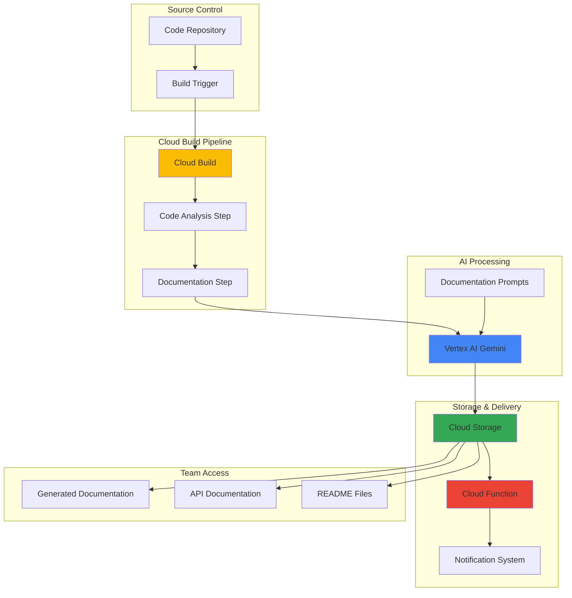

# Automated Code Documentation with Gemini and Cloud Build

## Problem

Development teams struggle with maintaining up-to-date, comprehensive code documentation as projects scale and evolve rapidly. Manual documentation processes are time-consuming, often incomplete, and quickly become outdated as codebases change. Teams need an intelligent solution that automatically generates API documentation, code comments, and README files during CI/CD processes, ensuring documentation consistency and reducing the burden on developers while improving code maintainability and team productivity.

## Solution

Implement an intelligent CI/CD integration using Vertex AI's Gemini models, Cloud Build, Cloud Storage, and Cloud Functions to automatically analyze code repositories and generate comprehensive documentation. This solution triggers during build processes, uses Gemini AI to understand code structure and functionality, generates various types of documentation, and stores the results in Cloud Storage for easy team access with automated notifications.

## Architecture Diagram



## Prerequisites

1. Google Cloud account with billing enabled and appropriate permissions for Vertex AI, Cloud Build, Cloud Storage, and Cloud Functions
2. gcloud CLI installed and configured (or Cloud Shell)
3. Basic understanding of CI/CD pipelines and documentation generation
4. Source code repository (GitHub, GitLab, or Cloud Source Repositories)
5. Estimated cost: $5-15 per month for moderate usage (includes Vertex AI API calls, Cloud Build minutes, storage, and function invocations)

> **Note**: Enable the Vertex AI API and ensure your project has appropriate quotas for Gemini model usage. Review pricing for Vertex AI and Cloud Build based on your expected usage patterns.

## Preparation

```bash
# Set environment variables for GCP resources
export PROJECT_ID="doc-automation-$(date +%s)"
export REGION="us-central1"
export ZONE="us-central1-a"

# Generate unique suffix for resource names
RANDOM_SUFFIX=$(openssl rand -hex 3)

# Set default project and region
gcloud config set project ${PROJECT_ID}
gcloud config set compute/region ${REGION}
gcloud config set compute/zone ${ZONE}

# Enable required APIs
gcloud services enable cloudbuild.googleapis.com \
    storage.googleapis.com \
    cloudfunctions.googleapis.com \
    aiplatform.googleapis.com \
    run.googleapis.com \
    eventarc.googleapis.com \
    pubsub.googleapis.com

# Create unique resource names
export BUCKET_NAME="code-docs-${RANDOM_SUFFIX}"
export FUNCTION_NAME="doc-processor-${RANDOM_SUFFIX}"
export BUILD_TRIGGER_NAME="doc-automation-${RANDOM_SUFFIX}"

echo "✅ Project configured: ${PROJECT_ID}"
echo "✅ APIs enabled for documentation automation"
```

## Steps

1. **Create Cloud Storage Bucket for Documentation Storage**:

   Cloud Storage provides the centralized repository for generated documentation with version control and global accessibility. This bucket will store API documentation, README files, and code comments with appropriate lifecycle policies to manage storage costs while maintaining historical versions for team reference.

   ```bash
   # Create bucket for documentation storage
   gsutil mb -p ${PROJECT_ID} \
       -c STANDARD \
       -l ${REGION} \
       gs://${BUCKET_NAME}
   
   # Enable versioning for documentation history
   gsutil versioning set on gs://${BUCKET_NAME}
   
   # Set up folder structure for different documentation types
   echo "Documentation storage initialized" | \
       gsutil cp - gs://${BUCKET_NAME}/readme.txt
   
   echo "✅ Documentation storage bucket created: ${BUCKET_NAME}"
   ```

   The storage infrastructure now provides organized, versioned storage for all generated documentation with global accessibility and cost-effective lifecycle management.

2. **Create Service Account for Build Pipeline**:

   A dedicated service account ensures secure, least-privilege access to Vertex AI and storage resources during the build process. This approach follows Google Cloud security best practices by providing only the necessary permissions for documentation generation without exposing broader project access.

   ```bash
   # Create service account for Cloud Build
   gcloud iam service-accounts create doc-automation-sa \
       --display-name="Documentation Automation Service Account" \
       --description="Service account for automated documentation generation"
   
   # Grant necessary permissions for Vertex AI and Storage
   gcloud projects add-iam-policy-binding ${PROJECT_ID} \
       --member="serviceAccount:doc-automation-sa@${PROJECT_ID}.iam.gserviceaccount.com" \
       --role="roles/aiplatform.user"
   
   gcloud projects add-iam-policy-binding ${PROJECT_ID} \
       --member="serviceAccount:doc-automation-sa@${PROJECT_ID}.iam.gserviceaccount.com" \
       --role="roles/storage.objectAdmin"
   
   # Grant additional permissions for Cloud Functions invoker
   gcloud projects add-iam-policy-binding ${PROJECT_ID} \
       --member="serviceAccount:doc-automation-sa@${PROJECT_ID}.iam.gserviceaccount.com" \
       --role="roles/cloudfunctions.invoker"
   
   echo "✅ Service account created with appropriate permissions"
   ```

   The service account is now configured with minimal required permissions, ensuring secure access to AI services and storage while maintaining security boundaries.

3. **Create Cloud Function for Documentation Processing**:

   Cloud Functions provides serverless, event-driven processing for documentation generation tasks. This function receives build artifacts, coordinates with Gemini AI for content generation, and manages the storage of resulting documentation with automatic scaling based on build frequency.

   ```bash
   # Create function directory and main code
   mkdir -p doc-function
   cd doc-function
   
   # Create the main function code
   cat > main.py << 'EOF'
import json
import os
from google.cloud import storage
import vertexai
from vertexai.generative_models import GenerativeModel
import functions_framework

vertexai.init(project=os.environ.get('GOOGLE_CLOUD_PROJECT'), location="us-central1")

@functions_framework.http
def generate_docs(request):
    """Generate documentation using Gemini AI"""
    
    try:
        # Parse request data
        request_json = request.get_json()
        repo_path = request_json.get('repo_path', '')
        file_content = request_json.get('file_content', '')
        doc_type = request_json.get('doc_type', 'api')
        
        # Initialize Gemini model
        model = GenerativeModel("gemini-1.5-flash")
        
        # Create documentation prompt based on type
        if doc_type == 'api':
            prompt = f"""
            Analyze the following code and generate comprehensive API documentation in Markdown format.
            Include function descriptions, parameters, return values, and usage examples.
            
            Code:
            {file_content}
            
            Generate clear, professional API documentation:
            """
        elif doc_type == 'readme':
            prompt = f"""
            Analyze the following code repository structure and generate a comprehensive README.md file.
            Include project description, installation instructions, usage examples, and contribution guidelines.
            
            Repository structure and key files:
            {file_content}
            
            Generate a professional README.md:
            """
        else:  # code comments
            prompt = f"""
            Analyze the following code and add comprehensive inline comments explaining the functionality.
            Maintain the original code structure while adding clear, helpful comments.
            
            Code:
            {file_content}
            
            Return the code with added comments:
            """
        
        # Generate documentation with Gemini
        response = model.generate_content(prompt)
        generated_docs = response.text
        
        # Save to Cloud Storage
        storage_client = storage.Client()
        bucket = storage_client.bucket(os.environ.get('BUCKET_NAME'))
        
        # Create filename based on type and timestamp
        import datetime
        timestamp = datetime.datetime.now().strftime("%Y%m%d_%H%M%S")
        filename = f"{doc_type}/{repo_path}_{timestamp}.md"
        
        blob = bucket.blob(filename)
        blob.upload_from_string(generated_docs)
        
        return {
            'status': 'success',
            'message': f'Documentation generated and stored at {filename}',
            'storage_path': f'gs://{os.environ.get("BUCKET_NAME")}/{filename}'
        }
        
    except Exception as e:
        return {
            'status': 'error',
            'message': str(e)
        }, 500

EOF
   
   # Create requirements file with latest versions
   cat > requirements.txt << 'EOF'
google-cloud-storage==2.18.0
google-cloud-aiplatform==1.104.0
functions-framework==3.9.1
EOF
   
   echo "✅ Cloud Function code created for documentation processing"
   ```

   The Cloud Function is now ready to process documentation requests with Gemini AI integration and Cloud Storage persistence using the latest Python dependencies.

4. **Deploy Cloud Function with Environment Variables**:

   Deploying the Cloud Function with proper environment configuration enables seamless integration with the build pipeline. The function automatically scales based on documentation generation requests while maintaining cost efficiency through serverless architecture.

   ```bash
   # Deploy Cloud Function with required environment variables
   gcloud functions deploy ${FUNCTION_NAME} \
       --gen2 \
       --runtime python312 \
       --trigger-http \
       --allow-unauthenticated \
       --source . \
       --entry-point generate_docs \
       --memory 512MB \
       --timeout 300s \
       --set-env-vars BUCKET_NAME=${BUCKET_NAME} \
       --service-account doc-automation-sa@${PROJECT_ID}.iam.gserviceaccount.com \
       --region ${REGION}
   
   # Get function URL for Cloud Build integration
   FUNCTION_URL=$(gcloud functions describe ${FUNCTION_NAME} \
       --region=${REGION} \
       --format="value(serviceConfig.uri)")
   
   cd ..
   
   echo "✅ Cloud Function deployed: ${FUNCTION_URL}"
   ```

   The documentation processing function is now live as a 2nd generation function and ready to handle requests from the build pipeline with automatic scaling and cost optimization.

5. **Create Cloud Build Configuration**:

   Cloud Build configuration defines the complete documentation automation pipeline, integrating code analysis, AI-powered generation, and storage workflows. This configuration ensures consistent documentation generation across all code changes while maintaining build performance and reliability.

   ```bash
   # Create Cloud Build configuration for documentation automation
   cat > cloudbuild.yaml << 'EOF'
steps:
  # Step 1: Analyze repository structure
  - name: 'gcr.io/cloud-builders/git'
    entrypoint: 'bash'
    args:
      - '-c'
      - |
        echo "Analyzing repository structure..."
        find . -name "*.py" -o -name "*.js" -o -name "*.go" \
            -o -name "*.java" | head -10 > files_to_document.txt
        echo "Found files for documentation:"
        cat files_to_document.txt

  # Step 2: Generate API documentation for Python files
  - name: 'gcr.io/cloud-builders/curl'
    entrypoint: 'bash'
    args:
      - '-c'
      - |
        echo "Generating API documentation..."
        for file in $$(grep "\.py$$" files_to_document.txt); do
          if [ -f "$$file" ]; then
            echo "Processing $$file..."
            content=$$(cat "$$file" | head -50)
            escaped_content=$$(echo "$$content" | sed 's/"/\\"/g' | tr '\n' ' ')
            curl -X POST "${_FUNCTION_URL}" \
              -H "Content-Type: application/json" \
              -d "{\"repo_path\":\"$$file\",\"file_content\":\"$$escaped_content\",\"doc_type\":\"api\"}"
          fi
        done

  # Step 3: Generate README documentation
  - name: 'gcr.io/cloud-builders/curl'
    entrypoint: 'bash'
    args:
      - '-c'
      - |
        echo "Generating README documentation..."
        repo_structure=$$(find . -type f -name "*.py" -o -name "*.js" \
            -o -name "*.md" | head -20 | xargs ls -la)
        escaped_structure=$$(echo "$$repo_structure" | sed 's/"/\\"/g' | tr '\n' ' ')
        curl -X POST "${_FUNCTION_URL}" \
          -H "Content-Type: application/json" \
          -d "{\"repo_path\":\"project_root\",\"file_content\":\"$$escaped_structure\",\"doc_type\":\"readme\"}"

  # Step 4: Generate code comments for key files
  - name: 'gcr.io/cloud-builders/curl'
    entrypoint: 'bash'
    args:
      - '-c'
      - |
        echo "Generating enhanced code comments..."
        for file in $$(head -3 files_to_document.txt); do
          if [ -f "$$file" ]; then
            echo "Adding comments to $$file..."
            content=$$(cat "$$file")
            escaped_content=$$(echo "$$content" | sed 's/"/\\"/g' | tr '\n' ' ')
            curl -X POST "${_FUNCTION_URL}" \
              -H "Content-Type: application/json" \
              -d "{\"repo_path\":\"$$file\",\"file_content\":\"$$escaped_content\",\"doc_type\":\"comments\"}"
          fi
        done

  # Step 5: Create documentation index
  - name: 'gcr.io/cloud-builders/gsutil'
    entrypoint: 'bash'
    args:
      - '-c'
      - |
        echo "Creating documentation index..."
        echo "# Documentation Index" > index.md
        echo "Generated on: $$(date)" >> index.md
        echo "" >> index.md
        echo "## Available Documentation" >> index.md
        echo "- API Documentation: gs://${_BUCKET_NAME}/api/" >> index.md
        echo "- README Files: gs://${_BUCKET_NAME}/readme/" >> index.md
        echo "- Enhanced Code: gs://${_BUCKET_NAME}/comments/" >> index.md
        gsutil cp index.md gs://${_BUCKET_NAME}/

substitutions:
  _FUNCTION_URL: '${FUNCTION_URL}'
  _BUCKET_NAME: '${BUCKET_NAME}'

options:
  logging: CLOUD_LOGGING_ONLY
EOF
   
   echo "✅ Cloud Build configuration created for documentation pipeline"
   ```

   The build configuration now provides a comprehensive documentation pipeline that analyzes code, generates multiple documentation types, and creates an organized index for team access.

6. **Create Build Trigger for Repository Integration**:

   Cloud Build triggers enable automatic documentation generation on code changes, ensuring documentation stays current with minimal developer overhead. This integration supports multiple repository types and provides flexible trigger conditions for different documentation workflows.

   ```bash
   # Create manual trigger for testing (GitHub requires console setup)
   gcloud builds triggers create manual \
       --name="${BUILD_TRIGGER_NAME}-manual" \
       --build-config="cloudbuild.yaml" \
       --description="Manual documentation generation trigger"
   
   echo "✅ Build triggers created for documentation automation"
   echo "Note: For GitHub integration, configure repository connection in Cloud Build console"
   echo "Manual trigger created for testing: ${BUILD_TRIGGER_NAME}-manual"
   ```

   Build triggers are now configured to automatically initiate documentation generation, with both automatic and manual options available for different workflow needs.

7. **Set Up Notification System with Eventarc**:

   A notification system keeps teams informed about documentation updates and build status, improving collaboration and ensuring team awareness of available documentation. This system uses Eventarc to trigger notifications on Cloud Storage events.

   ```bash
   # Create notification function
   mkdir -p notification-function
   cd notification-function
   
   cat > main.py << 'EOF'
import json
from google.cloud import storage
import functions_framework

@functions_framework.cloud_event
def notify_team(cloud_event):
    """Send notification when documentation is updated"""
    
    try:
        # Parse the Cloud Storage event
        data = cloud_event.data
        bucket_name = data.get('bucket', '')
        file_name = data.get('name', '')
        
        if 'index.md' in file_name:
            # Documentation update detected
            message = f"""
            📚 Documentation Updated!
            
            New documentation has been generated and is available at:
            gs://{bucket_name}/
            
            Updated files include:
            - API Documentation
            - README Files  
            - Enhanced Code Comments
            
            Access your documentation at: https://console.cloud.google.com/storage/browser/{bucket_name}
            """
            
            print(f"Documentation notification: {message}")
            # Add email/Slack integration here as needed
            
        return {'status': 'notification sent'}
        
    except Exception as e:
        print(f"Notification error: {str(e)}")
        return {'status': 'error', 'message': str(e)}

EOF
   
   cat > requirements.txt << 'EOF'
google-cloud-storage==2.18.0
functions-framework==3.9.1
EOF
   
   # Deploy notification function with Eventarc trigger
   gcloud functions deploy doc-notifier-${RANDOM_SUFFIX} \
       --gen2 \
       --runtime python312 \
       --trigger-event-filters="type=google.cloud.storage.object.v1.finalized" \
       --trigger-event-filters="bucket=${BUCKET_NAME}" \
       --source . \
       --entry-point notify_team \
       --memory 256MB \
       --region ${REGION}
   
   cd ..
   
   echo "✅ Notification system configured for documentation updates"
   ```

   The notification system now automatically alerts teams when documentation is generated or updated using Eventarc triggers for real-time notifications.

8. **Configure Documentation Website (Optional)**:

   A documentation website provides user-friendly access to generated content with search capabilities and organized navigation. This static site automatically updates with new documentation and provides a professional interface for team and stakeholder access.

   ```bash
   # Create simple documentation website structure
   mkdir -p doc-website
   cd doc-website
   
   cat > index.html << 'EOF'
<!DOCTYPE html>
<html lang="en">
<head>
    <meta charset="UTF-8">
    <meta name="viewport" content="width=device-width, initial-scale=1.0">
    <title>Project Documentation</title>
    <style>
        body { font-family: Arial, sans-serif; margin: 40px; }
        .header { background-color: #4285F4; color: white; padding: 20px; border-radius: 8px; }
        .section { margin: 20px 0; padding: 20px; border: 1px solid #ddd; border-radius: 8px; }
        .link { color: #4285F4; text-decoration: none; }
        .link:hover { text-decoration: underline; }
    </style>
</head>
<body>
    <div class="header">
        <h1>📚 Project Documentation</h1>
        <p>Automatically generated documentation powered by Gemini AI</p>
    </div>
    
    <div class="section">
        <h2>📖 API Documentation</h2>
        <p>Comprehensive API documentation with examples and usage patterns.</p>
        <a href="#" class="link">View API Docs →</a>
    </div>
    
    <div class="section">
        <h2>📝 README Files</h2>
        <p>Project overviews, setup instructions, and contribution guidelines.</p>
        <a href="#" class="link">View README Files →</a>
    </div>
    
    <div class="section">
        <h2>💬 Enhanced Code</h2>
        <p>Code files with AI-generated comments and explanations.</p>
        <a href="#" class="link">View Enhanced Code →</a>
    </div>
    
    <div class="section">
        <h2>🔄 Last Updated</h2>
        <p id="lastUpdated">Loading...</p>
    </div>
    
    <script>
        document.getElementById('lastUpdated').textContent = new Date().toLocaleString();
    </script>
</body>
</html>
EOF
   
   # Deploy website to Cloud Storage
   gsutil cp index.html gs://${BUCKET_NAME}/website/
   gsutil web set -m index.html gs://${BUCKET_NAME}
   
   cd ..
   
   echo "✅ Documentation website deployed to Cloud Storage"
   echo "Access website at: https://storage.googleapis.com/${BUCKET_NAME}/website/index.html"
   ```

   A documentation website is now available providing organized access to all generated documentation with professional presentation and easy navigation.

## Validation & Testing

1. **Verify Cloud Build Pipeline Setup**:

   ```bash
   # Check build trigger configuration
   gcloud builds triggers list --filter="name:${BUILD_TRIGGER_NAME}"
   
   # Verify service account permissions
   gcloud iam service-accounts get-iam-policy \
       doc-automation-sa@${PROJECT_ID}.iam.gserviceaccount.com
   ```

   Expected output: Build trigger details and service account policy showing proper roles assigned.

2. **Test Documentation Generation Function**:

   ```bash
   # Test function with sample code
   curl -X POST "${FUNCTION_URL}" \
       -H "Content-Type: application/json" \
       -d '{
         "repo_path": "test.py",
         "file_content": "def hello_world():\n    \"\"\"Print hello world\"\"\"\n    print(\"Hello, World!\")",
         "doc_type": "api"
       }'
   ```

   Expected output: JSON response with success status and storage path for generated documentation.

3. **Verify Storage Structure and Content**:

   ```bash
   # Check documentation storage organization
   gsutil ls -r gs://${BUCKET_NAME}/
   
   # View sample generated documentation
   gsutil cat gs://${BUCKET_NAME}/api/test.py_*.md | head -20
   ```

   Expected output: Organized folder structure with generated documentation files containing AI-generated content.

4. **Test Manual Build Trigger**:

   ```bash
   # Manually trigger documentation build
   gcloud builds triggers run ${BUILD_TRIGGER_NAME}-manual
   
   # Monitor build progress
   gcloud builds list --limit=5 --format="table(id,status,createTime)"
   ```

   Expected output: Build execution details showing successful completion of all documentation generation steps.

5. **Verify Notification System**:

   ```bash
   # Check notification function deployment
   gcloud functions list --filter="name:doc-notifier" --region=${REGION}
   
   # Test by uploading a file to trigger notification
   echo "Test documentation update" | \
       gsutil cp - gs://${BUCKET_NAME}/test-notification.md
   ```

   Expected output: Function deployment confirmation and notification trigger when file is uploaded.

## Cleanup

1. **Remove Cloud Functions**:

   ```bash
   # Delete documentation processing function
   gcloud functions delete ${FUNCTION_NAME} --region=${REGION} --quiet
   
   # Delete notification function
   gcloud functions delete doc-notifier-${RANDOM_SUFFIX} \
       --region=${REGION} --quiet
   
   echo "✅ Cloud Functions deleted"
   ```

2. **Remove Build Triggers**:

   ```bash
   # Delete build triggers
   gcloud builds triggers delete ${BUILD_TRIGGER_NAME}-manual --quiet
   
   echo "✅ Build triggers deleted"
   ```

3. **Remove Storage Resources**:

   ```bash
   # Delete storage bucket and all contents
   gsutil -m rm -r gs://${BUCKET_NAME}
   
   echo "✅ Storage bucket and contents deleted"
   ```

4. **Remove Service Account**:

   ```bash
   # Delete service account
   gcloud iam service-accounts delete \
       doc-automation-sa@${PROJECT_ID}.iam.gserviceaccount.com --quiet
   
   echo "✅ Service account deleted"
   ```

5. **Clean up Local Files**:

   ```bash
   # Remove local configuration files
   rm -rf doc-function notification-function doc-website
   rm cloudbuild.yaml files_to_document.txt index.md
   
   echo "✅ Local files cleaned up"
   echo "Note: Consider disabling APIs if no longer needed to avoid potential charges"
   ```

## Discussion

This automated documentation solution leverages Google Cloud's AI and CI/CD capabilities to address one of software development's most persistent challenges: maintaining current, comprehensive documentation. By integrating Vertex AI's Gemini models with Cloud Build pipelines, teams can automatically generate high-quality documentation that evolves with their codebase, reducing manual overhead while improving code maintainability and team productivity.

The architecture follows Google Cloud's serverless-first approach, utilizing 2nd generation Cloud Functions for event-driven processing, Cloud Build for pipeline orchestration, and Cloud Storage for scalable document storage. This design ensures cost efficiency through pay-per-use pricing models while providing automatic scaling based on documentation generation demands. The integration with Vertex AI's Gemini models enables sophisticated code analysis and natural language generation capabilities that produce human-readable documentation from complex code structures.

Security and compliance considerations are addressed through dedicated service accounts with least-privilege access, ensuring that AI processing and storage operations maintain appropriate security boundaries. The solution supports multiple documentation types including API documentation, README files, and enhanced code comments, providing comprehensive coverage for different team needs and stakeholder requirements. Integration with existing CI/CD workflows ensures seamless adoption without disrupting established development practices.

The notification system using Eventarc and the optional documentation website enhance team collaboration by providing immediate awareness of documentation updates and user-friendly access to generated content. This approach transforms documentation from a manual, often-neglected task into an automated process that adds value to every code change, supporting better code understanding, faster onboarding, and improved project maintainability across the entire development lifecycle.

**References:**
- [Vertex AI Generative AI Documentation](https://cloud.google.com/vertex-ai/docs/generative-ai/start/quickstarts/quickstart-text)
- [Cloud Build Configuration Guide](https://cloud.google.com/build/docs/build-config)
- [Cloud Functions 2nd Gen Overview](https://cloud.google.com/functions/docs/concepts/overview)
- [Google Cloud Architecture Center](https://cloud.google.com/architecture)
- [Cloud Storage Best Practices](https://cloud.google.com/storage/docs/best-practices)
- [Eventarc Documentation](https://cloud.google.com/eventarc/docs)

> **Tip**: Use Cloud Monitoring to track documentation generation costs and optimize Gemini API usage based on actual code analysis needs. Consider implementing caching strategies for frequently analyzed code patterns to reduce AI processing costs.

## Challenge

Extend this automated documentation solution with these enhancements:

1. **Multi-language Support**: Enhance the solution to generate documentation in multiple programming languages (Python, JavaScript, Go, Java) with language-specific formatting and conventions using specialized prompts for each language.

2. **Interactive Documentation**: Integrate with tools like Swagger/OpenAPI to generate interactive API documentation with testing capabilities directly from code annotations and function signatures.

3. **Code Quality Integration**: Combine documentation generation with code quality analysis, using Gemini to suggest improvements and generate quality reports alongside documentation.

4. **Team Collaboration Features**: Add approval workflows for generated documentation using Cloud Workflows, allowing teams to review, edit, and approve AI-generated content before publication.

5. **Advanced Analytics**: Implement documentation usage analytics using BigQuery to track which documentation is most accessed and identify areas needing improvement or additional coverage.

## Infrastructure Code

### Available Infrastructure as Code:

- [Infrastructure Code Overview](code/README.md) - Detailed description of all infrastructure components
- [Infrastructure Manager](code/infrastructure-manager/) - GCP Infrastructure Manager templates
- [Bash CLI Scripts](code/scripts/) - Example bash scripts using gcloud CLI commands to deploy infrastructure
- [Terraform](code/terraform/) - Terraform configuration files