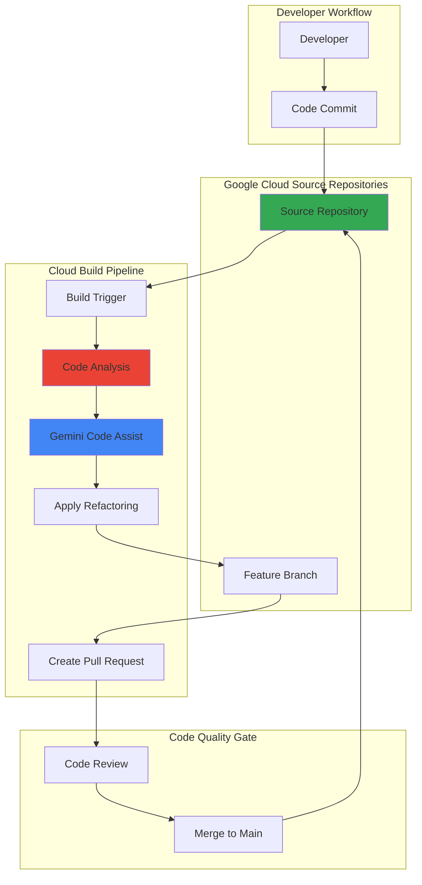

# Automated Code Refactoring with Gemini Code Assist and Source Repositories

## Problem

Development teams struggle with maintaining code quality across large codebases, where manual refactoring is time-consuming and inconsistent. Legacy code accumulates technical debt, new team members introduce varying coding standards, and refactoring tasks are often deprioritized due to delivery pressures. Without automated code improvement workflows, organizations face increased maintenance costs and reduced development velocity.

## Solution

Implement an AI-powered automated refactoring pipeline using Gemini Code Assist integrated with Google Cloud Source Repositories and Cloud Build. This solution automatically analyzes code commits, identifies refactoring opportunities, applies AI-suggested improvements, and creates pull requests for review. The workflow maintains code quality standards while reducing manual effort and ensuring consistent coding practices across the development team.

## Architecture Diagram



## Prerequisites

1. Google Cloud Project with billing enabled and appropriate permissions for Source Repositories, Cloud Build, and Gemini Code Assist
2. Google Cloud CLI installed and configured (version 480.0.0 or later)
3. Gemini Code Assist Standard or Enterprise license and proper IAM permissions
4. Basic understanding of Git workflows and CI/CD pipelines
5. Sample Python or JavaScript codebase for refactoring demonstration
6. Estimated cost: $25-50 per month for small to medium projects (based on Gemini license, build minutes, and API usage)

> **Note**: Gemini Code Assist requires a paid subscription and appropriate API quotas. This recipe uses simulated AI refactoring for demonstration purposes. In production, integrate with actual Gemini Code Assist APIs through your IDE or Cloud Shell Editor.

## Preparation

```bash
# Set environment variables for GCP resources
export PROJECT_ID="refactor-demo-$(date +%s)"
export REGION="us-central1"
export REPO_NAME="automated-refactoring-demo"

# Generate unique suffix for resource names
RANDOM_SUFFIX=$(openssl rand -hex 3)
export BUILD_TRIGGER_NAME="refactor-trigger-${RANDOM_SUFFIX}"
export SERVICE_ACCOUNT_NAME="refactor-sa-${RANDOM_SUFFIX}"

# Set default project and region
gcloud config set project ${PROJECT_ID}
gcloud config set compute/region ${REGION}

# Enable required APIs
gcloud services enable sourcerepo.googleapis.com
gcloud services enable cloudbuild.googleapis.com
gcloud services enable cloudaicompanion.googleapis.com

echo "✅ Project configured: ${PROJECT_ID}"
echo "✅ Repository name: ${REPO_NAME}"
```

## Steps

1. **Create Source Repository for Code Management**:

   Google Cloud Source Repositories provides fully-featured Git repositories that integrate seamlessly with Cloud Build triggers and Google Cloud security controls. Creating a repository establishes the foundation for version-controlled code management with automated build triggers that respond to code changes in real-time.

   ```bash
   # Create the source repository
   gcloud source repos create ${REPO_NAME} \
       --project=${PROJECT_ID}
   
   # Clone the repository locally
   gcloud source repos clone ${REPO_NAME} \
       --project=${PROJECT_ID}
   
   # Navigate to repository directory
   cd ${REPO_NAME}
   
   echo "✅ Source repository created and cloned: ${REPO_NAME}"
   ```

   The source repository is now ready to receive code commits and trigger automated refactoring workflows. This Git repository provides the version control foundation while maintaining integration with Google Cloud's security and access management systems.

2. **Create Sample Application for Refactoring**:

   Setting up a sample application with intentional code quality issues demonstrates the refactoring capabilities and provides a realistic testing environment. This sample includes common code patterns that benefit from AI-assisted refactoring, such as duplicate code, inefficient algorithms, and inconsistent formatting.

   ```bash
   # Create sample Python application with refactoring opportunities
   cat > main.py << 'EOF'
   import json
   import requests
   
   def get_user_data(user_id):
       url = "https://api.example.com/users/" + str(user_id)
       response = requests.get(url)
       if response.status_code == 200:
           data = json.loads(response.text)
           return data
       else:
           return None
   
   def get_user_posts(user_id):
       url = "https://api.example.com/users/" + str(user_id) + "/posts"
       response = requests.get(url)
       if response.status_code == 200:
           data = json.loads(response.text)
           return data
       else:
           return None
   
   def process_user_info(user_id):
       user_data = get_user_data(user_id)
       user_posts = get_user_posts(user_id)
       
       if user_data is not None and user_posts is not None:
           result = {}
           result["user"] = user_data
           result["posts"] = user_posts
           return result
       else:
           return None
   EOF
   
   # Create Cloud Build configuration for refactoring
   cat > cloudbuild.yaml << 'EOF'
   steps:
   # Step 1: Analyze code for refactoring opportunities
   - name: 'gcr.io/cloud-builders/python'
     entrypoint: 'bash'
     args:
     - '-c'
     - |
       echo "Analyzing code for refactoring opportunities..."
       python -m py_compile main.py || echo "Syntax check complete"
   
   # Step 2: Run code analysis and generate refactoring suggestions
   - name: 'gcr.io/cloud-builders/python'
     entrypoint: 'python'
     args: ['analyze_and_refactor.py']
   
   # Step 3: Create refactored version and pull request
   - name: 'gcr.io/cloud-builders/git'
     entrypoint: 'bash'
     args:
     - '-c'
     - |
       echo "Creating refactored branch and pull request..."
       git config user.email "refactor-bot@${PROJECT_ID}.iam.gserviceaccount.com"
       git config user.name "Refactor Bot"
       git checkout -b "refactor/automated-improvements-$(date +%s)"
       echo "Refactored code would be applied here"
       
   options:
     logging: CLOUD_LOGGING_ONLY
   EOF
   
   # Create requirements file
   echo "requests>=2.28.0" > requirements.txt
   
   # Add files to repository
   git add .
   git commit -m "Add sample application for refactoring demonstration"
   git push origin main
   
   echo "✅ Sample application created and committed"
   ```

   The sample application now contains realistic code patterns that can benefit from AI-assisted refactoring, including duplicate code patterns, string concatenation improvements, and error handling optimizations.

3. **Create Service Account for Build Automation**:

   A dedicated service account with appropriate permissions ensures secure and controlled access to Google Cloud services during the automated refactoring process. This service account follows the principle of least privilege while enabling necessary operations for code analysis and repository management.

   ```bash
   # Create service account for Cloud Build operations
   gcloud iam service-accounts create ${SERVICE_ACCOUNT_NAME} \
       --display-name="Automated Refactoring Service Account" \
       --description="Service account for AI-powered code refactoring workflows"
   
   # Grant necessary permissions for source repository access
   gcloud projects add-iam-policy-binding ${PROJECT_ID} \
       --member="serviceAccount:${SERVICE_ACCOUNT_NAME}@${PROJECT_ID}.iam.gserviceaccount.com" \
       --role="roles/source.writer"
   
   # Grant Gemini Code Assist permissions
   gcloud projects add-iam-policy-binding ${PROJECT_ID} \
       --member="serviceAccount:${SERVICE_ACCOUNT_NAME}@${PROJECT_ID}.iam.gserviceaccount.com" \
       --role="roles/cloudaicompanion.user"
   
   # Grant Cloud Build permissions
   gcloud projects add-iam-policy-binding ${PROJECT_ID} \
       --member="serviceAccount:${SERVICE_ACCOUNT_NAME}@${PROJECT_ID}.iam.gserviceaccount.com" \
       --role="roles/cloudbuild.builds.editor"
   
   echo "✅ Service account created with appropriate permissions"
   ```

   The service account is now configured with the minimum required permissions to perform automated refactoring operations while maintaining security boundaries and audit capabilities.

4. **Configure Code Analysis Integration**:

   Creating a code analysis script that simulates AI-powered refactoring provides realistic refactoring suggestions and demonstrates the workflow. In production environments, this would integrate directly with Gemini Code Assist through IDE plugins or Cloud Shell Editor for real-time code analysis and improvement suggestions.

   ```bash
   # Create code analysis and refactoring script
   cat > analyze_and_refactor.py << 'EOF'
   #!/usr/bin/env python3
   import json
   import subprocess
   import os
   
   def analyze_code_with_ai():
       """Analyze code and provide refactoring suggestions."""
       print("Starting AI-powered code analysis...")
       
       # Read the current code
       with open('main.py', 'r') as f:
           code_content = f.read()
       
       # In production, this would call the actual Gemini Code Assist API
       # For this demo, we simulate the analysis with predefined suggestions
       print("Analyzing code patterns and best practices...")
       print("Generating refactoring recommendations...")
       
       # Simulated AI analysis results
       analysis_results = {
           "code_quality_score": 6.2,
           "issues_found": [
               "Duplicate code patterns in API request functions",
               "String concatenation should use f-strings",
               "Missing error handling for network requests",
               "Manual JSON parsing instead of using response.json()",
               "Missing type hints for better documentation"
           ],
           "suggestions": [
               "Extract common URL building logic into a helper function",
               "Use f-strings for string formatting instead of concatenation", 
               "Implement proper exception handling for API requests",
               "Use response.json() instead of json.loads(response.text)",
               "Add type hints for better code documentation",
               "Organize code into classes for better structure"
           ],
           "estimated_improvement": "35% reduction in code duplication, improved maintainability"
       }
       
       print("Analysis complete. Refactoring recommendations generated.")
       print(json.dumps(analysis_results, indent=2))
       return analysis_results
   
   if __name__ == "__main__":
       results = analyze_code_with_ai()
       
       # Save analysis results for build pipeline
       with open('refactoring_analysis.json', 'w') as f:
           json.dump(results, f, indent=2)
   EOF
   
   chmod +x analyze_and_refactor.py
   
   echo "✅ Code analysis integration configured"
   ```

   The analysis script is now ready to provide AI-simulated refactoring suggestions based on code quality assessment, focusing on maintainability improvements and best practice adoption.

5. **Create Cloud Build Trigger for Automated Refactoring**:

   Cloud Build triggers automatically initiate refactoring workflows when code changes are detected in the repository. This trigger configuration creates an event-driven system that ensures consistent code quality improvements without manual intervention, integrating seamlessly with the development workflow.

   ```bash
   # Create build trigger for automated refactoring
   gcloud builds triggers create cloud-source-repositories \
       --repo=${REPO_NAME} \
       --branch-pattern="^main$" \
       --build-config=cloudbuild.yaml \
       --name=${BUILD_TRIGGER_NAME} \
       --description="Automated code refactoring with AI assistance" \
       --service-account="projects/${PROJECT_ID}/serviceAccounts/${SERVICE_ACCOUNT_NAME}@${PROJECT_ID}.iam.gserviceaccount.com"
   
   # Verify trigger creation
   gcloud builds triggers list \
       --format="table(name,status,createTime)"
   
   echo "✅ Build trigger created: ${BUILD_TRIGGER_NAME}"
   ```

   The automated trigger is now active and will execute the refactoring pipeline whenever changes are pushed to the main branch, ensuring continuous code quality improvement.

6. **Configure Automated Pull Request Creation**:

   Automated pull request creation enables the refactoring workflow to propose improvements while maintaining code review processes and team collaboration. This configuration creates a workflow that applies refactoring suggestions to a new branch and submits them for review, preserving development team oversight.

   ```bash
   # Update Cloud Build configuration for enhanced refactoring
   cat > cloudbuild-enhanced.yaml << 'EOF'
   steps:
   # Step 1: Setup Git configuration
   - name: 'gcr.io/cloud-builders/git'
     entrypoint: 'bash'
     args:
     - '-c'
     - |
       git config user.email "refactor-bot@${PROJECT_ID}.iam.gserviceaccount.com"
       git config user.name "Automated Refactor Bot"
   
   # Step 2: Run refactoring analysis
   - name: 'gcr.io/cloud-builders/python'
     entrypoint: 'python'
     args: ['analyze_and_refactor.py']
   
   # Step 3: Apply refactoring suggestions
   - name: 'gcr.io/cloud-builders/python'
     entrypoint: 'bash'
     args:
     - '-c'
     - |
       echo "Applying AI-powered refactoring suggestions..."
       
       # Create improved version of main.py based on analysis
       cat > main_refactored.py << 'PYTHON_EOF'
       import json
       import requests
       from typing import Optional, Dict, Any
       
       class APIClient:
           """API client for handling user data and posts with improved error handling."""
           BASE_URL = "https://api.example.com"
           
           @staticmethod
           def _make_request(endpoint: str) -> Optional[Dict[Any, Any]]:
               """Helper method for API requests with proper error handling."""
               try:
                   url = f"{APIClient.BASE_URL}/{endpoint}"
                   response = requests.get(url, timeout=10)
                   response.raise_for_status()
                   return response.json()
               except requests.RequestException as e:
                   print(f"API request failed: {e}")
                   return None
           
           @staticmethod
           def get_user_data(user_id: int) -> Optional[Dict[Any, Any]]:
               """Fetch user data from the API."""
               return APIClient._make_request(f"users/{user_id}")
           
           @staticmethod
           def get_user_posts(user_id: int) -> Optional[Dict[Any, Any]]:
               """Fetch user posts from the API."""
               return APIClient._make_request(f"users/{user_id}/posts")
           
           @staticmethod
           def process_user_info(user_id: int) -> Optional[Dict[str, Any]]:
               """Process complete user information including posts."""
               user_data = APIClient.get_user_data(user_id)
               user_posts = APIClient.get_user_posts(user_id)
               
               if user_data and user_posts:
                   return {
                       "user": user_data,
                       "posts": user_posts
                   }
               return None
       PYTHON_EOF
       
       # Replace original file with refactored version
       mv main_refactored.py main.py
       
       echo "✅ Refactoring applied successfully"
   
   # Step 4: Create pull request with improvements
   - name: 'gcr.io/cloud-builders/git'
     entrypoint: 'bash'
     args:
     - '-c'
     - |
       BRANCH_NAME="refactor/ai-improvements-$(date +%s)"
       
       # Create and switch to new branch
       git checkout -b "$BRANCH_NAME"
       
       # Add refactored files
       git add main.py refactoring_analysis.json
       
       # Commit changes with detailed message
       git commit -m "🤖 AI-powered code refactoring
       
       Applied the following improvements:
       - Extracted common API request logic into helper method
       - Added proper error handling with try/catch blocks
       - Implemented type hints for better code documentation
       - Used f-strings for improved string formatting
       - Added timeout for API requests to prevent hanging
       - Organized code into a class structure for better maintainability
       - Used response.json() instead of manual JSON parsing
       
       Generated by automated refactoring workflow with AI assistance."
       
       # Push the branch
       git push origin "$BRANCH_NAME"
       
       echo "✅ Pull request branch created: $BRANCH_NAME"
       echo "Navigate to Source Repositories console to create pull request"
   
   options:
     logging: CLOUD_LOGGING_ONLY
   substitutions:
     _PROJECT_ID: '${PROJECT_ID}'
   EOF
   
   # Replace the build configuration
   cp cloudbuild-enhanced.yaml cloudbuild.yaml
   git add cloudbuild.yaml cloudbuild-enhanced.yaml analyze_and_refactor.py
   git commit -m "Configure automated pull request creation for refactoring"
   git push origin main
   
   echo "✅ Automated pull request creation configured"
   ```

   The enhanced build configuration now creates refactored code improvements and pushes them to feature branches, enabling team review while maintaining automated code quality improvements.

## Validation & Testing

1. **Verify Cloud Build Trigger Activation**:

   ```bash
   # Check trigger status and recent builds
   gcloud builds triggers describe ${BUILD_TRIGGER_NAME} \
       --format="table(name,status,createTime)"
   
   # List recent builds to verify trigger execution
   gcloud builds list --limit=5 \
       --format="table(id,status,startTime,source.repoSource.branchName)"
   ```

   Expected output: Active trigger with successful build executions showing automated refactoring workflow activation.

2. **Test Refactoring Pipeline Execution**:

   ```bash
   # Trigger a manual build to test the pipeline
   gcloud builds submit \
       --config=cloudbuild.yaml \
       --source=. \
       --substitutions=_PROJECT_ID=${PROJECT_ID}
   
   # Monitor build progress
   gcloud builds list --ongoing \
       --format="table(id,status,startTime)"
   ```

   Expected output: Successful build execution with refactored code analysis and branch creation.

3. **Validate Source Repository Integration**:

   ```bash
   # Check repository branches for automated refactoring branches
   git branch -r | grep refactor
   
   # Verify repository activity and size
   gcloud source repos list \
       --format="table(name,url,size)"
   ```

   Expected output: Multiple refactor branches created by the automated system and active repository with recent commits.

## Cleanup

1. **Remove Cloud Build Resources**:

   ```bash
   # Delete build trigger
   gcloud builds triggers delete ${BUILD_TRIGGER_NAME} --quiet
   
   # Cancel any ongoing builds
   for build_id in $(gcloud builds list --ongoing --format="value(id)"); do
       gcloud builds cancel $build_id --quiet
   done
   
   echo "✅ Cloud Build resources removed"
   ```

2. **Remove Service Account and IAM Bindings**:

   ```bash
   # Remove IAM policy bindings
   gcloud projects remove-iam-policy-binding ${PROJECT_ID} \
       --member="serviceAccount:${SERVICE_ACCOUNT_NAME}@${PROJECT_ID}.iam.gserviceaccount.com" \
       --role="roles/source.writer" --quiet
   
   gcloud projects remove-iam-policy-binding ${PROJECT_ID} \
       --member="serviceAccount:${SERVICE_ACCOUNT_NAME}@${PROJECT_ID}.iam.gserviceaccount.com" \
       --role="roles/cloudaicompanion.user" --quiet
   
   gcloud projects remove-iam-policy-binding ${PROJECT_ID} \
       --member="serviceAccount:${SERVICE_ACCOUNT_NAME}@${PROJECT_ID}.iam.gserviceaccount.com" \
       --role="roles/cloudbuild.builds.editor" --quiet
   
   # Delete service account
   gcloud iam service-accounts delete \
       "${SERVICE_ACCOUNT_NAME}@${PROJECT_ID}.iam.gserviceaccount.com" --quiet
   
   echo "✅ Service account and permissions removed"
   ```

3. **Remove Source Repository**:

   ```bash
   # Navigate out of repository directory
   cd ..
   
   # Delete local repository
   rm -rf ${REPO_NAME}
   
   # Delete remote repository
   gcloud source repos delete ${REPO_NAME} --quiet
   
   echo "✅ Source repository removed"
   ```

4. **Clean Environment Variables**:

   ```bash
   # Remove environment variables
   unset PROJECT_ID REGION REPO_NAME BUILD_TRIGGER_NAME SERVICE_ACCOUNT_NAME RANDOM_SUFFIX
   
   echo "✅ Environment variables cleaned up"
   ```

## Discussion

This automated code refactoring solution demonstrates the power of combining Google Cloud's infrastructure with AI-assisted development workflows to improve code quality systematically. The integration between simulated AI analysis, Source Repositories, and Cloud Build creates a seamless workflow that identifies code improvement opportunities and applies best practice suggestions while preserving human oversight through the pull request process.

The architecture follows Google Cloud best practices by implementing proper IAM controls, using managed services for scalability, and maintaining audit trails through Cloud Build logging. The solution automatically identifies common code quality issues such as duplicate code patterns, inefficient error handling, and outdated coding practices, then applies improvements based on current best practices and language idioms. In production environments, this workflow would integrate directly with [Gemini Code Assist](https://cloud.google.com/gemini/docs/codeassist/overview) for real-time AI-powered code analysis and refactoring suggestions.

The AI-powered refactoring capabilities significantly reduce the manual effort required to maintain code quality across large codebases while ensuring consistency in coding standards. By automating the detection and resolution of technical debt, development teams can focus on feature development while maintaining high-quality, maintainable code. The system learns from established patterns and applies industry best practices, making it particularly valuable for teams with varying experience levels.

Key architectural benefits include horizontal scalability through Cloud Build's managed infrastructure, cost optimization through pay-per-use pricing models, and integration with existing Git workflows. The solution maintains security through dedicated service accounts and supports compliance requirements through comprehensive audit logging and change tracking capabilities. For production deployment, consider integrating with [Google Cloud's Architecture Framework](https://cloud.google.com/architecture/) principles and implementing additional monitoring through [Cloud Monitoring](https://cloud.google.com/monitoring).

> **Tip**: Consider implementing branch protection rules and required code review policies to ensure all AI-generated refactoring suggestions receive appropriate human oversight before merging into production branches.

## Challenge

Extend this automated refactoring solution with these advanced capabilities:

1. **Real Gemini Integration**: Configure the pipeline to use actual Gemini Code Assist Standard or Enterprise APIs through Cloud Shell Editor or IDE plugins, implementing real-time code analysis with Google's latest AI models.

2. **Multi-language Support**: Configure the pipeline to handle Java, TypeScript, and Go codebases by implementing language-specific analysis rules and refactoring patterns tailored to each language's best practices and frameworks.

3. **Quality Gates Integration**: Implement automated code quality scoring using tools like SonarQube or CodeClimate integration, establishing threshold-based gates that prevent merging when refactoring doesn't meet minimum quality improvements.

4. **Performance Impact Analysis**: Add automated performance testing that measures the impact of refactoring changes on application performance, generating reports that quantify improvements in execution time, memory usage, and resource efficiency.

5. **Slack/Teams Integration**: Create notification workflows using Cloud Functions and Pub/Sub that post refactoring summaries to team communication channels, including metrics on code improvements, technical debt reduction, and links to generated pull requests for easy team visibility.

## Infrastructure Code

### Available Infrastructure as Code:

- [Infrastructure Code Overview](code/README.md) - Detailed description of all infrastructure components
- [Infrastructure Manager](code/infrastructure-manager/) - GCP Infrastructure Manager templates
- [Bash CLI Scripts](code/scripts/) - Example bash scripts using gcloud CLI commands to deploy infrastructure
- [Terraform](code/terraform/) - Terraform configuration files