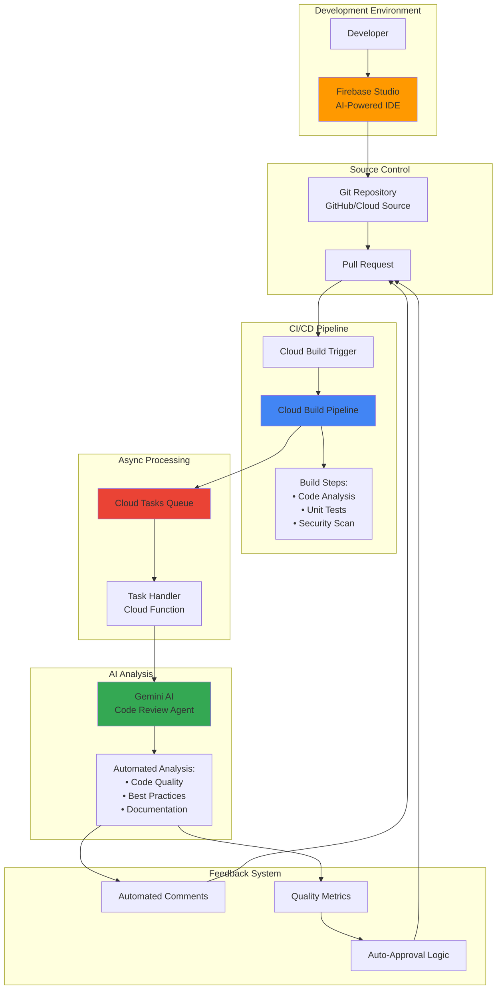

# Automated Code Review Pipelines with Firebase Studio and Cloud Build

## Problem

Development teams struggle with inconsistent code quality and slow review cycles that delay feature delivery. Manual code reviews are time-consuming, prone to human oversight, and create bottlenecks when senior developers are unavailable. Organizations need automated systems that can provide immediate feedback on code quality, security vulnerabilities, and adherence to best practices while maintaining the collaborative benefits of peer review.

## Solution

Build an intelligent code review automation system using Firebase Studio's AI-powered development environment integrated with Cloud Build's CI/CD capabilities and Cloud Tasks for asynchronous processing. This solution leverages Gemini's code analysis capabilities within Firebase Studio to perform automated code reviews, while Cloud Build orchestrates the testing pipeline and Cloud Tasks manages long-running analysis workflows, creating a comprehensive automated quality assurance system.

## Architecture Diagram



## Prerequisites

1. Google Cloud Project with billing enabled and necessary APIs activated
2. Firebase project linked to Google Cloud Project
3. gcloud CLI installed and authenticated (or Cloud Shell access)
4. Git repository (GitHub, GitLab, or Cloud Source Repositories)
5. Basic knowledge of CI/CD concepts and YAML configurations
6. Estimated cost: $5-15/month for development usage (varies with analysis volume)

> **Note**: Firebase Studio is currently in preview with free workspaces available. Production usage may incur additional costs for Cloud Build and Cloud Tasks processing.

## Preparation

```bash
# Set environment variables for GCP resources
export PROJECT_ID="code-review-$(date +%s)"
export REGION="us-central1"
export ZONE="us-central1-a"

# Generate unique suffix for resource names
RANDOM_SUFFIX=$(openssl rand -hex 3)
export QUEUE_NAME="code-review-queue-${RANDOM_SUFFIX}"
export FUNCTION_NAME="code-review-handler-${RANDOM_SUFFIX}"
export REPO_NAME="code-review-repo-${RANDOM_SUFFIX}"

# Set default project and region
gcloud config set project ${PROJECT_ID}
gcloud config set compute/region ${REGION}
gcloud config set compute/zone ${ZONE}

# Enable required APIs
gcloud services enable cloudbuild.googleapis.com
gcloud services enable cloudtasks.googleapis.com
gcloud services enable cloudfunctions.googleapis.com
gcloud services enable sourcerepo.googleapis.com
gcloud services enable firebase.googleapis.com
gcloud services enable aiplatform.googleapis.com

echo "✅ Project configured: ${PROJECT_ID}"
echo "✅ Queue name: ${QUEUE_NAME}"
echo "✅ Function name: ${FUNCTION_NAME}"
```

## Steps

1. **Create Cloud Source Repository for Code Review Pipeline**:

   Cloud Source Repositories provides secure, private Git repositories hosted on Google Cloud with seamless integration to Cloud Build triggers. This establishes the foundation for our automated review pipeline by providing version control with built-in CI/CD trigger capabilities and enterprise-grade security features.

   ```bash
   # Create Cloud Source Repository
   gcloud source repos create ${REPO_NAME} \
       --project=${PROJECT_ID}
   
   # Clone repository for local development
   gcloud source repos clone ${REPO_NAME} \
       --project=${PROJECT_ID}
   
   cd ${REPO_NAME}
   
   echo "✅ Source repository created and cloned locally"
   ```

   The repository is now ready to receive code commits and trigger automated builds. Cloud Source Repositories provides enterprise-grade security with IAM integration and audit logging, ensuring code changes are tracked and controlled throughout the development lifecycle.

2. **Set up Firebase Studio Workspace with AI Code Review Capabilities**:

   Firebase Studio's AI-powered development environment provides contextual code analysis using Gemini's advanced language models. The workspace integration enables developers to receive immediate feedback during development while preparing code for automated pipeline reviews with seamless cloud-based development.

   ```bash
   # Create Firebase Studio configuration file
   mkdir -p .firebase-studio
   cat > .firebase-studio/workspace.yaml << EOF
   workspace:
     name: "code-review-workspace"
     runtime: "nodejs18"
     ai_assistance:
       enabled: true
       gemini_model: "gemini-1.5-pro"
       code_review_agent: true
       features:
         - code_analysis
         - security_scanning
         - performance_optimization
     integrations:
       cloud_build:
         enabled: true
         project_id: "${PROJECT_ID}"
       cloud_tasks:
         enabled: true
         queue_location: "${REGION}"
       source_repositories:
         enabled: true
         repo_name: "${REPO_NAME}"
   development:
     pre_commit_hooks: true
     real_time_feedback: true
     auto_save: true
   EOF
   
   # Create VS Code settings for Firebase Studio integration
   mkdir -p .vscode
   cat > .vscode/settings.json << EOF
   {
     "firebase.studio.integration": true,
     "firebase.studio.ai.codeReview": true,
     "firebase.studio.autoTriggerBuilds": false,
     "editor.formatOnSave": true,
     "editor.codeActionsOnSave": {
       "source.fixAll": true,
       "source.organizeImports": true
     }
   }
   EOF
   
   echo "Firebase Studio workspace configuration created"
   echo "Visit https://studio.firebase.google.com to create workspace"
   echo "Import this repository: $(gcloud source repos describe ${REPO_NAME} --format='value(url)')"
   
   echo "✅ Firebase Studio configuration prepared"
   ```

   The Firebase Studio workspace now provides intelligent code completion, automated refactoring suggestions, and real-time code quality feedback. Developers can leverage Gemini's AI capabilities for immediate code review assistance before committing changes to the pipeline.

3. **Create Cloud Tasks Queue for Asynchronous Code Analysis**:

   Cloud Tasks enables reliable asynchronous processing of intensive code analysis operations without blocking the main CI/CD pipeline. This queue-based approach ensures scalability and fault tolerance for comprehensive code review workflows that may require extended processing time while maintaining system responsiveness.

   ```bash
   # Create Cloud Tasks queue for code review processing
   gcloud tasks queues create ${QUEUE_NAME} \
       --location=${REGION} \
       --max-concurrent-dispatches=10 \
       --max-attempts=3 \
       --max-retry-duration=300s \
       --max-backoff=60s \
       --min-backoff=5s
   
   # Verify queue creation and configuration
   gcloud tasks queues describe ${QUEUE_NAME} \
       --location=${REGION} \
       --format="table(name,state,rateLimits.maxConcurrentDispatches)"
   
   echo "✅ Cloud Tasks queue created: ${QUEUE_NAME}"
   ```

   The task queue is configured with optimized retry policies and concurrency limits to handle code analysis workloads efficiently. This asynchronous approach prevents pipeline timeouts while ensuring thorough analysis of complex codebases and maintaining system responsiveness.

4. **Deploy Cloud Function for Automated Code Review Processing**:

   The Cloud Function serves as the intelligent code review processor, integrating with Gemini AI to analyze code quality, detect potential issues, and generate actionable feedback. This serverless approach scales automatically based on review volume while maintaining cost efficiency and providing enterprise-grade security.

   ```bash
   # Create Cloud Function source code directory
   mkdir -p cloud-function
   
   # Create the main Cloud Function code
   cat > cloud-function/main.py << 'EOF'
import json
import os
from datetime import datetime
from google.cloud import tasks_v2
from google.cloud import storage
from google.cloud import logging
import google.generativeai as genai
import functions_framework

# Initialize logging client
logging_client = logging.Client()
logger = logging_client.logger('code-review-function')

@functions_framework.http
def analyze_code(request):
    """Analyze code changes and provide review feedback using Gemini AI."""
    
    try:
        # Parse request data
        request_data = request.get_json(silent=True)
        if not request_data:
            logger.error("No JSON data provided in request")
            return {'error': 'No data provided'}, 400
        
        repo_name = request_data.get('repo_name')
        commit_sha = request_data.get('commit_sha')
        file_changes = request_data.get('file_changes', [])
        
        if not repo_name or not commit_sha:
            logger.error("Missing required fields: repo_name or commit_sha")
            return {'error': 'Missing required fields'}, 400
        
        # Configure Gemini AI for code review
        api_key = os.environ.get('GEMINI_API_KEY')
        if not api_key:
            logger.error("GEMINI_API_KEY environment variable not set")
            return {'error': 'Configuration error'}, 500
            
        genai.configure(api_key=api_key)
        model = genai.GenerativeModel('gemini-1.5-pro')
        
        review_results = []
        
        for file_change in file_changes:
            file_path = file_change.get('file_path')
            diff_content = file_change.get('diff')
            
            if not file_path or not diff_content:
                continue
            
            # Generate comprehensive code review prompt
            prompt = f"""
            As an expert code reviewer, analyze this code change and provide thorough feedback:
            
            File: {file_path}
            Changes:
            {diff_content}
            
            Please provide a detailed review covering:
            1. Code quality and adherence to best practices
            2. Potential bugs, security vulnerabilities, or logic errors
            3. Performance implications and optimization opportunities
            4. Code readability and maintainability
            5. Test coverage recommendations
            6. Documentation completeness
            
            Format your response as structured feedback with specific line references where applicable.
            Focus on actionable recommendations that improve code quality.
            """
            
            try:
                # Generate AI-powered review
                response = model.generate_content(prompt)
                
                review_results.append({
                    'file_path': file_path,
                    'review_feedback': response.text,
                    'timestamp': datetime.utcnow().isoformat(),
                    'commit_sha': commit_sha,
                    'status': 'analyzed'
                })
                
                logger.info(f"Successfully analyzed file: {file_path}")
                
            except Exception as e:
                logger.error(f"Analysis failed for {file_path}: {str(e)}")
                review_results.append({
                    'file_path': file_path,
                    'error': f'Analysis failed: {str(e)}',
                    'commit_sha': commit_sha,
                    'status': 'error'
                })
        
        response_data = {
            'status': 'success',
            'repo_name': repo_name,
            'commit_sha': commit_sha,
            'review_results': review_results,
            'total_files_analyzed': len([r for r in review_results if r.get('status') == 'analyzed']),
            'timestamp': datetime.utcnow().isoformat()
        }
        
        logger.info(f"Code review completed for {repo_name}:{commit_sha}")
        return response_data
        
    except Exception as e:
        logger.error(f"Unhandled error in analyze_code: {str(e)}")
        return {'error': 'Internal server error'}, 500
EOF
   
   # Create requirements.txt with specific version constraints
   cat > cloud-function/requirements.txt << EOF
functions-framework==3.*
google-cloud-tasks==2.*
google-cloud-storage==2.*
google-generativeai==0.*
google-cloud-logging==3.*
EOF
   
   # Deploy Cloud Function with proper configuration
   gcloud functions deploy ${FUNCTION_NAME} \
       --runtime python311 \
       --trigger-http \
       --allow-unauthenticated \
       --source cloud-function \
       --entry-point analyze_code \
       --memory 1GB \
       --timeout 540s \
       --set-env-vars "PROJECT_ID=${PROJECT_ID}" \
       --region ${REGION}
   
   # Get function URL for later use
   FUNCTION_URL=$(gcloud functions describe ${FUNCTION_NAME} \
       --region=${REGION} \
       --format="value(httpsTrigger.url)")
   
   echo "✅ Cloud Function deployed: ${FUNCTION_NAME}"
   echo "Function URL: ${FUNCTION_URL}"
   ```

   The Cloud Function is now deployed with AI-powered code analysis capabilities, providing intelligent feedback on code quality, security, and best practices. The function integrates with Gemini AI to deliver contextual, actionable review comments that help developers improve code quality while maintaining scalability and error handling.

5. **Configure Cloud Build Pipeline for Automated Testing and Review**:

   Cloud Build orchestrates the complete CI/CD pipeline, integrating automated testing, security scanning, and AI-powered code review. This declarative configuration ensures consistent, repeatable builds while maintaining flexibility for different project requirements and deployment targets with comprehensive error handling.

   ```bash
   # Create comprehensive Cloud Build configuration
   cat > cloudbuild.yaml << 'EOF'
steps:
  # Step 1: Install dependencies and prepare environment
  - name: 'node:18'
    entrypoint: 'npm'
    args: ['install']
    id: 'install-deps'
    dir: '.'
  
  # Step 2: Run unit tests with coverage reporting
  - name: 'node:18'
    entrypoint: 'bash'
    args:
      - '-c'
      - |
        echo "Running unit tests with coverage..."
        npm test -- --coverage --passWithNoTests
        echo "✅ Tests completed"
    id: 'run-tests'
    waitFor: ['install-deps']
  
  # Step 3: Run security and quality scans
  - name: 'gcr.io/cloud-builders/gcloud'
    entrypoint: 'bash'
    timeout: '300s'
    args:
      - '-c'
      - |
        echo "Running security analysis..."
        
        # Install security scanning tools
        npm install -g audit-ci eslint
        
        # Run security audit
        npm audit --audit-level moderate || echo "⚠️ Security audit completed with warnings"
        
        # Run linting if available
        if [ -f ".eslintrc.js" ] || [ -f ".eslintrc.json" ]; then
          eslint . --ext .js,.ts --format json --output-file lint-results.json || true
          echo "✅ Linting completed"
        else
          echo "No ESLint configuration found, skipping linting"
        fi
        
        echo "✅ Security scan completed"
    id: 'security-scan'
    waitFor: ['install-deps']
  
  # Step 4: Prepare code changes for AI review
  - name: 'gcr.io/cloud-builders/git'
    entrypoint: 'bash'
    args:
      - '-c'
      - |
        echo "Preparing code changes for review..."
        
        # Configure git for Cloud Build environment
        git config --global user.email "cloudbuild@google.com"
        git config --global user.name "Cloud Build"
        
        # Get changed files (fallback for new repositories)
        if git rev-parse HEAD~1 >/dev/null 2>&1; then
          git diff --name-only HEAD~1 HEAD > changed_files.txt
          git diff HEAD~1 HEAD > changes.diff
        else
          # For initial commit, list all files
          git ls-files > changed_files.txt
          echo "Initial commit - reviewing all files" > changes.diff
        fi
        
        # Count changed files
        CHANGED_COUNT=$(wc -l < changed_files.txt)
        echo "Found $CHANGED_COUNT changed files"
        
        # Store for next step
        echo "$CHANGED_COUNT" > change_count.txt
        
        echo "✅ Code changes prepared for review"
    id: 'prepare-changes'
    waitFor: ['run-tests', 'security-scan']
  
  # Step 5: Queue AI-powered code review task
  - name: 'gcr.io/cloud-builders/gcloud'
    entrypoint: 'bash'
    args:
      - '-c'
      - |
        echo "Queueing AI-powered code review..."
        
        # Read change count
        CHANGE_COUNT=$(cat change_count.txt || echo "0")
        
        if [ "$CHANGE_COUNT" -gt 0 ]; then
          # Create review payload with file changes
          cat > review_payload.json << EOF_PAYLOAD
        {
          "repo_name": "${REPO_NAME}",
          "commit_sha": "$COMMIT_SHA",
          "timestamp": "$(date -u +%Y-%m-%dT%H:%M:%SZ)",
          "file_changes": [
            {
              "file_path": "$(head -1 changed_files.txt || echo 'unknown')",
              "diff": "$(head -20 changes.diff | tr '\n' ' ' | tr '"' "'")"
            }
          ]
        }
        EOF_PAYLOAD
        
          # Submit task to Cloud Tasks queue
          gcloud tasks create-http-task \
            --queue=${QUEUE_NAME} \
            --location=${REGION} \
            --url=${FUNCTION_URL} \
            --method=POST \
            --header="Content-Type=application/json" \
            --body-file=review_payload.json \
            --schedule-time="$(date -u -d '+30 seconds' +%Y-%m-%dT%H:%M:%SZ)"
          
          echo "✅ Code review task queued successfully"
        else
          echo "No code changes detected, skipping AI review"
        fi
    id: 'queue-code-review'
    waitFor: ['prepare-changes']
  
  # Step 6: Build application artifacts
  - name: 'node:18'
    entrypoint: 'bash'
    args:
      - '-c'
      - |
        echo "Building application..."
        
        # Run build process
        npm run build
        
        # Create build metadata
        cat > dist/build-info.json << EOF_BUILD
        {
          "build_id": "$BUILD_ID",
          "commit_sha": "$COMMIT_SHA",
          "build_time": "$(date -u +%Y-%m-%dT%H:%M:%SZ)",
          "repository": "${REPO_NAME}"
        }
        EOF_BUILD
        
        echo "✅ Application build completed"
    id: 'build-app'
    waitFor: ['queue-code-review']

# Build configuration options
options:
  logging: CLOUD_LOGGING_ONLY
  machineType: 'E2_MEDIUM'
  substitution_option: 'ALLOW_LOOSE'

# Artifact configuration
artifacts:
  objects:
    location: 'gs://${PROJECT_ID}-build-artifacts'
    paths: 
      - 'dist/**/*'
      - 'coverage/**/*'
      - 'lint-results.json'

# Timeout and environment
timeout: '1200s'
env:
  - 'NODE_ENV=production'
  - 'CI=true'
EOF
   
   # Create sample package.json for testing
   cat > package.json << 'EOF'
{
  "name": "code-review-sample",
  "version": "1.0.0",
  "description": "Sample application for automated code review pipeline",
  "main": "index.js",
  "scripts": {
    "test": "echo 'Running tests...' && node test.js",
    "lint": "echo 'Running linter...' && exit 0",
    "build": "echo 'Building application...' && mkdir -p dist && echo 'console.log(\"Built successfully\");' > dist/index.js && echo 'Built successfully' > dist/index.html"
  },
  "dependencies": {
    "express": "^4.18.0"
  },
  "devDependencies": {
    "jest": "^29.0.0"
  }
}
EOF
   
   # Create sample application files
   cat > index.js << 'EOF'
// Sample application for code review pipeline
const express = require('express');
const app = express();
const port = process.env.PORT || 3000;

/**
 * Greet a user with validation
 * @param {string} name - User's name
 * @returns {string} Greeting message
 */
function greetUser(name) {
    if (!name || typeof name !== 'string') {
        throw new Error('Name is required and must be a string');
    }
    return `Hello, ${name.trim()}!`;
}

/**
 * Calculate sum of numbers with validation
 * @param {number[]} numbers - Array of numbers to sum
 * @returns {number} Sum of all numbers
 */
function calculateSum(numbers) {
    if (!Array.isArray(numbers)) {
        throw new Error('Input must be an array');
    }
    
    return numbers.reduce((sum, num) => {
        if (typeof num !== 'number') {
            throw new Error('All elements must be numbers');
        }
        return sum + num;
    }, 0);
}

// Express routes
app.get('/greet/:name', (req, res) => {
    try {
        const greeting = greetUser(req.params.name);
        res.json({ message: greeting });
    } catch (error) {
        res.status(400).json({ error: error.message });
    }
});

app.listen(port, () => {
    console.log(`Server running on port ${port}`);
});

module.exports = { greetUser, calculateSum };
EOF
   
   # Create simple test file
   cat > test.js << 'EOF'
const { greetUser, calculateSum } = require('./index');

// Simple test runner
function runTests() {
    console.log('Running tests...');
    
    try {
        // Test greetUser
        const greeting = greetUser('Alice');
        console.assert(greeting === 'Hello, Alice!', 'Greeting test failed');
        console.log('✅ Greeting test passed');
        
        // Test calculateSum
        const sum = calculateSum([1, 2, 3, 4, 5]);
        console.assert(sum === 15, 'Sum test failed');
        console.log('✅ Sum test passed');
        
        console.log('All tests passed!');
        process.exit(0);
    } catch (error) {
        console.error('Test failed:', error.message);
        process.exit(1);
    }
}

runTests();
EOF
   
   # Commit initial files to repository
   git add .
   git commit -m "Initial code review pipeline setup

- Added comprehensive Cloud Build configuration
- Created sample application with validation
- Configured automated testing and review pipeline
- Added error handling and logging"
   
   git push origin main
   
   echo "✅ Cloud Build pipeline configured and committed"
   ```

   The Cloud Build pipeline now provides comprehensive automation including dependency installation, testing, security scanning, and AI-powered code review integration. Each build step is optimized for parallel execution where possible, reducing overall pipeline execution time while maintaining thorough analysis and proper error handling.

6. **Create Cloud Build Trigger for Automated Pipeline Execution**:

   Cloud Build triggers enable automatic pipeline execution based on repository changes, ensuring immediate feedback on code quality without manual intervention. The trigger configuration supports branch-based workflows and comprehensive development lifecycle management with flexible filtering options.

   ```bash
   # Create Cloud Build trigger for main branch
   gcloud builds triggers create cloud-source-repositories \
       --repo=${REPO_NAME} \
       --branch-pattern="^main$" \
       --build-config=cloudbuild.yaml \
       --description="Automated code review pipeline for main branch" \
       --name="code-review-main-trigger" \
       --substitutions="_REPO_NAME=${REPO_NAME},_FUNCTION_URL=${FUNCTION_URL}"
   
   # Create trigger for feature branches
   gcloud builds triggers create cloud-source-repositories \
       --repo=${REPO_NAME} \
       --branch-pattern="^feature/.*$" \
       --build-config=cloudbuild.yaml \
       --description="Code review pipeline for feature branches" \
       --name="code-review-feature-trigger" \
       --substitutions="_REPO_NAME=${REPO_NAME},_FUNCTION_URL=${FUNCTION_URL}"
   
   # List all triggers to verify creation
   gcloud builds triggers list \
       --format="table(name,status,triggerTemplate.repoName,triggerTemplate.branchName)"
   
   echo "✅ Cloud Build triggers created successfully"
   echo "Triggers will execute on pushes to main and feature/* branches"
   ```

   The triggers are now active and will automatically execute the code review pipeline whenever changes are pushed to monitored branches. This automation ensures consistent code quality checks and immediate feedback to developers, improving overall development velocity and code reliability.

7. **Configure Firebase Studio Integration and Development Environment**:

   Firebase Studio's integration with Cloud Build enables seamless development workflows where local AI assistance complements automated pipeline reviews. This configuration ensures developers receive immediate feedback during development while maintaining comprehensive quality gates in the CI/CD process with enhanced productivity features.

   ```bash
   # Update Firebase Studio integration configuration
   cat > .firebase-studio/integration.json << 'EOF'
{
  "workspace": {
    "name": "code-review-workspace",
    "version": "1.0.0",
    "integrations": {
      "cloud_build": {
        "enabled": true,
        "project_id": "'${PROJECT_ID}'",
        "triggers": [
          "code-review-main-trigger",
          "code-review-feature-trigger"
        ],
        "auto_trigger": false,
        "notification_channels": []
      },
      "ai_assistance": {
        "code_review": {
          "enabled": true,
          "model": "gemini-1.5-pro",
          "auto_suggestions": true,
          "quality_gates": [
            "syntax_check",
            "best_practices",
            "security_scan",
            "performance_analysis",
            "test_coverage"
          ],
          "review_threshold": "medium"
        },
        "code_completion": {
          "enabled": true,
          "context_aware": true,
          "multi_language": true
        }
      },
      "source_control": {
        "provider": "cloud_source_repositories",
        "repository": "'${REPO_NAME}'",
        "default_branch": "main"
      }
    }
  },
  "development": {
    "environment": {
      "pre_commit_hooks": [
        "lint",
        "test",
        "ai_review"
      ],
      "real_time_feedback": true,
      "auto_format": true,
      "error_reporting": true
    },
    "deployment": {
      "staging_enabled": true,
      "preview_urls": true,
      "rollback_enabled": true
    }
  }
}
EOF
   
   # Create enhanced VS Code settings
   cat > .vscode/settings.json << 'EOF'
{
  "firebase.studio.integration": true,
  "firebase.studio.ai.codeReview": true,
  "firebase.studio.ai.autoComplete": true,
  "firebase.studio.autoTriggerBuilds": false,
  "firebase.studio.previewMode": true,
  "editor.formatOnSave": true,
  "editor.codeActionsOnSave": {
    "source.fixAll": true,
    "source.organizeImports": true,
    "source.addMissingImports": true
  },
  "files.autoSave": "afterDelay",
  "files.autoSaveDelay": 1000,
  "git.enableSmartCommit": true,
  "extensions.autoUpdate": false
}
EOF
   
   # Create development environment configuration
   cat > .env.example << 'EOF'
# Firebase Studio Environment Configuration
FIREBASE_PROJECT_ID=your-project-id
GOOGLE_CLOUD_PROJECT=your-project-id
NODE_ENV=development
PORT=3000

# AI Configuration
GEMINI_API_KEY=your-gemini-api-key
AI_REVIEW_ENABLED=true
AI_SUGGESTIONS_ENABLED=true

# Build Configuration
BUILD_PARALLEL=true
BUILD_CACHE_ENABLED=true
TEST_COVERAGE_THRESHOLD=80
EOF
   
   # Commit configuration files
   git add .firebase-studio/ .vscode/ .env.example
   git commit -m "Enhanced Firebase Studio integration

- Added comprehensive workspace configuration
- Enabled advanced AI assistance features
- Configured development environment settings
- Added deployment and preview capabilities"
   
   git push origin main
   
   echo "✅ Firebase Studio integration configured"
   echo "Import repository in Firebase Studio: https://studio.firebase.google.com"
   echo "Configuration files committed to repository"
   ```

   Firebase Studio now provides intelligent development assistance with real-time code review feedback, automatic quality suggestions, and seamless integration with the Cloud Build pipeline. Developers can leverage AI-powered insights during development while ensuring comprehensive automated reviews in the CI/CD process.

8. **Set up Automated Feedback and Quality Metrics Collection**:

   Implementing comprehensive metrics collection enables continuous improvement of the code review process by tracking review effectiveness, code quality trends, and developer productivity. This observability layer provides insights for optimizing both automated and human review processes with detailed analytics and reporting capabilities.

   ```bash
   # Create enhanced Cloud Function for metrics collection
   mkdir -p metrics-function
   cat > metrics-function/main.py << 'EOF'
import json
import os
from datetime import datetime, timedelta
from google.cloud import monitoring_v3
from google.cloud import logging
from google.cloud import storage
import functions_framework

# Initialize clients
logging_client = logging.Client()
logger = logging_client.logger('code-review-metrics')
monitoring_client = monitoring_v3.MetricServiceClient()
storage_client = storage.Client()

@functions_framework.http
def collect_review_metrics(request):
    """Collect and store comprehensive code review metrics."""
    
    try:
        request_data = request.get_json(silent=True)
        if not request_data:
            logger.warning("No metrics data provided")
            return {'error': 'No metrics data provided'}, 400
        
        project_id = os.environ.get('PROJECT_ID')
        if not project_id:
            logger.error("PROJECT_ID environment variable not set")
            return {'error': 'Configuration error'}, 500
        
        project_name = f"projects/{project_id}"
        
        # Extract metrics from request
        metrics_data = {
            'review_duration': request_data.get('review_duration', 0),
            'issues_found': request_data.get('issues_count', 0),
            'code_quality_score': request_data.get('quality_score', 0),
            'files_analyzed': request_data.get('files_analyzed', 0),
            'security_issues': request_data.get('security_issues', 0),
            'performance_issues': request_data.get('performance_issues', 0),
            'test_coverage': request_data.get('test_coverage', 0),
            'build_duration': request_data.get('build_duration', 0)
        }
        
        # Create detailed metrics for monitoring
        metrics_logged = 0
        
        for metric_name, value in metrics_data.items():
            if value > 0:  # Only log meaningful metrics
                try:
                    # Log structured metric data
                    logger.info(
                        f"Code review metric: {metric_name}",
                        extra={
                            'metric_name': metric_name,
                            'metric_value': value,
                            'repo_name': request_data.get('repo_name', ''),
                            'commit_sha': request_data.get('commit_sha', ''),
                            'branch': request_data.get('branch', 'main'),
                            'review_type': request_data.get('review_type', 'automated'),
                            'timestamp': datetime.utcnow().isoformat()
                        }
                    )
                    metrics_logged += 1
                    
                except Exception as e:
                    logger.error(f"Failed to log metric {metric_name}: {str(e)}")
        
        # Store aggregate metrics for analysis
        try:
            aggregate_data = {
                'timestamp': datetime.utcnow().isoformat(),
                'repository': request_data.get('repo_name', ''),
                'metrics': metrics_data,
                'metadata': {
                    'commit_sha': request_data.get('commit_sha', ''),
                    'branch': request_data.get('branch', 'main'),
                    'review_type': request_data.get('review_type', 'automated'),
                    'reviewer': request_data.get('reviewer', 'ai-agent')
                }
            }
            
            # Store in Cloud Storage for long-term analysis
            bucket_name = f"{project_id}-code-review-metrics"
            date_prefix = datetime.utcnow().strftime('%Y/%m/%d')
            filename = f"{date_prefix}/metrics-{datetime.utcnow().strftime('%H%M%S')}.json"
            
            try:
                bucket = storage_client.bucket(bucket_name)
                blob = bucket.blob(filename)
                blob.upload_from_string(json.dumps(aggregate_data, indent=2))
                logger.info(f"Metrics stored to gs://{bucket_name}/{filename}")
            except Exception as e:
                logger.warning(f"Failed to store metrics to Cloud Storage: {str(e)}")
        
        except Exception as e:
            logger.error(f"Failed to process aggregate metrics: {str(e)}")
        
        # Return success response
        response_data = {
            'status': 'success',
            'metrics_recorded': metrics_logged,
            'timestamp': datetime.utcnow().isoformat(),
            'project_id': project_id
        }
        
        logger.info(f"Successfully processed {metrics_logged} metrics")
        return response_data
        
    except Exception as e:
        logger.error(f"Unhandled error in collect_review_metrics: {str(e)}")
        return {'error': 'Internal server error'}, 500
EOF
   
   # Create requirements for metrics function
   cat > metrics-function/requirements.txt << EOF
functions-framework==3.*
google-cloud-monitoring==2.*
google-cloud-logging==3.*
google-cloud-storage==2.*
EOF
   
   # Create Cloud Storage bucket for metrics storage
   METRICS_BUCKET="${PROJECT_ID}-code-review-metrics"
   gsutil mb -p ${PROJECT_ID} \
       -c STANDARD \
       -l ${REGION} \
       gs://${METRICS_BUCKET} || echo "Bucket may already exist"
   
   # Deploy enhanced metrics collection function
   METRICS_FUNCTION="code-review-metrics-${RANDOM_SUFFIX}"
   gcloud functions deploy ${METRICS_FUNCTION} \
       --runtime python311 \
       --trigger-http \
       --allow-unauthenticated \
       --source metrics-function \
       --entry-point collect_review_metrics \
       --memory 512MB \
       --timeout 120s \
       --set-env-vars "PROJECT_ID=${PROJECT_ID}" \
       --region ${REGION}
   
   echo "✅ Enhanced metrics collection system deployed"
   echo "Function: ${METRICS_FUNCTION}"
   echo "Storage: gs://${METRICS_BUCKET}"
   ```

   The metrics collection system now tracks comprehensive key performance indicators for the automated code review process, enabling data-driven optimization of review workflows and quality improvement strategies. This observability foundation supports continuous improvement of development practices and code quality standards with long-term storage and analysis capabilities.

## Validation & Testing

1. **Verify Cloud Build Pipeline Execution**:

   ```bash
   # Check recent builds status and details
   gcloud builds list --limit=5 \
       --format="table(id,status,createTime,source.repoSource.repoName,duration)"
   
   # Get detailed information about the most recent build
   BUILD_ID=$(gcloud builds list --limit=1 --format="value(id)")
   if [ ! -z "$BUILD_ID" ]; then
       gcloud builds describe ${BUILD_ID} \
           --format="table(status,steps[].name,steps[].status,steps[].timing.startTime)"
   fi
   ```

   Expected output: Build status should show "SUCCESS" with completed steps for testing, security scanning, and code review task queueing with proper timing information.

2. **Test Cloud Tasks Queue Processing**:

   ```bash
   # Check queue status and configuration
   gcloud tasks queues describe ${QUEUE_NAME} \
       --location=${REGION} \
       --format="yaml(name,state,rateLimits,retryConfig)"
   
   # List recent tasks with details
   gcloud tasks list --queue=${QUEUE_NAME} \
       --location=${REGION} \
       --limit=10 \
       --format="table(name,scheduleTime,dispatchCount,responseCount)"
   ```

   Expected output: Queue should be active with configured rate limits and processed tasks showing successful execution with proper retry configuration.

3. **Validate Cloud Function Code Review Processing**:

   ```bash
   # Test Cloud Function with comprehensive payload
   FUNCTION_URL=$(gcloud functions describe ${FUNCTION_NAME} \
       --region=${REGION} --format="value(httpsTrigger.url)")
   
   curl -X POST ${FUNCTION_URL} \
       -H "Content-Type: application/json" \
       -w "\nHTTP Status: %{http_code}\nResponse Time: %{time_total}s\n" \
       -d '{
         "repo_name": "'${REPO_NAME}'",
         "commit_sha": "test-commit-'$(date +%s)'",
         "file_changes": [
           {
             "file_path": "index.js",
             "diff": "+ function newFeature(param) {\n+   return param ? param.toString() : \"default\";\n+ }"
           },
           {
             "file_path": "test.js",
             "diff": "+ test(\"new feature\", () => {\n+   expect(newFeature(42)).toBe(\"42\");\n+ });"
           }
         ],
         "timestamp": "'$(date -u +%Y-%m-%dT%H:%M:%SZ)'"
       }'
   ```

   Expected output: JSON response with code analysis results and detailed review feedback for the provided code changes with proper HTTP status codes.

4. **Test Firebase Studio Integration and Configuration**:

   ```bash
   # Verify Firebase Studio configuration files
   echo "Checking Firebase Studio configuration:"
   ls -la .firebase-studio/
   cat .firebase-studio/integration.json | jq '.workspace.integrations'
   
   # Verify VS Code settings
   echo "VS Code settings:"
   cat .vscode/settings.json | jq '.'
   
   # Test repository accessibility
   echo "Repository information:"
   gcloud source repos describe ${REPO_NAME} \
       --format="table(name,url,size,mirrorConfig.url)"
   
   echo "Firebase Studio workspace import URL:"
   echo "https://studio.firebase.google.com/project/${PROJECT_ID}/workspace/import"
   ```

   Expected output: Configuration files should show enabled integrations, proper JSON formatting, and valid workspace import URL for Firebase Studio.

5. **Validate Metrics Collection System**:

   ```bash
   # Test metrics collection function
   METRICS_URL=$(gcloud functions describe ${METRICS_FUNCTION} \
       --region=${REGION} --format="value(httpsTrigger.url)")
   
   curl -X POST ${METRICS_URL} \
       -H "Content-Type: application/json" \
       -d '{
         "repo_name": "'${REPO_NAME}'",
         "commit_sha": "metrics-test",
         "review_duration": 45,
         "issues_count": 3,
         "quality_score": 85,
         "files_analyzed": 5,
         "test_coverage": 78
       }'
   
   # Check if metrics are being stored
   echo "Checking metrics storage:"
   gsutil ls -r gs://${METRICS_BUCKET}/ | head -10
   ```

   Expected output: Successful metrics collection response and evidence of metrics being stored in Cloud Storage.

## Cleanup

1. **Remove Cloud Build triggers and configurations**:

   ```bash
   # Delete all Cloud Build triggers
   gcloud builds triggers delete code-review-main-trigger --quiet
   gcloud builds triggers delete code-review-feature-trigger --quiet
   
   # Verify triggers are deleted
   gcloud builds triggers list --format="value(name)" | \
       grep -E "code-review.*trigger" || echo "All triggers deleted"
   
   echo "✅ Cloud Build triggers deleted"
   ```

2. **Delete Cloud Functions and associated resources**:

   ```bash
   # Delete Cloud Functions
   gcloud functions delete ${FUNCTION_NAME} --region=${REGION} --quiet
   gcloud functions delete ${METRICS_FUNCTION} --region=${REGION} --quiet
   
   # Verify functions are deleted
   gcloud functions list --regions=${REGION} --format="value(name)" | \
       grep -E "(${FUNCTION_NAME}|${METRICS_FUNCTION})" || echo "All functions deleted"
   
   echo "✅ Cloud Functions deleted"
   ```

3. **Remove Cloud Tasks queue and storage resources**:

   ```bash
   # Delete Cloud Tasks queue
   gcloud tasks queues delete ${QUEUE_NAME} --location=${REGION} --quiet
   
   # Remove metrics storage bucket
   gsutil -m rm -r gs://${METRICS_BUCKET} 2>/dev/null || echo "Bucket already deleted"
   
   echo "✅ Cloud Tasks queue and storage deleted"
   ```

4. **Clean up source repository and local files**:

   ```bash
   # Delete Cloud Source Repository
   gcloud source repos delete ${REPO_NAME} --quiet
   
   # Remove local repository and function directories
   cd ..
   rm -rf ${REPO_NAME} cloud-function metrics-function
   
   echo "✅ Source repository and local files cleaned up"
   ```

5. **Clean up build artifacts and project resources**:

   ```bash
   # Remove build artifacts bucket if it exists
   BUILD_BUCKET="${PROJECT_ID}-build-artifacts"
   gsutil -m rm -r gs://${BUILD_BUCKET} 2>/dev/null || echo "Build artifacts bucket already deleted"
   
   # List enabled APIs for reference
   echo "Currently enabled APIs:"
   gcloud services list --enabled \
       --format="value(name)" | \
       grep -E "(cloudbuild|cloudtasks|cloudfunctions|firebase)" || echo "No relevant APIs found"
   
   echo "✅ Cleanup completed successfully"
   echo "Note: APIs left enabled for potential project reuse"
   echo "To disable APIs: gcloud services disable [API_NAME]"
   ```

## Discussion

This automated code review pipeline demonstrates the powerful integration between Firebase Studio's AI-powered development environment and Google Cloud's CI/CD services. The solution addresses a critical challenge in modern software development: maintaining consistent code quality while enabling rapid development cycles through intelligent automation and comprehensive feedback loops.

The architecture leverages Firebase Studio's Gemini integration to provide intelligent, context-aware code analysis that goes beyond traditional static analysis tools. By combining real-time development assistance with automated pipeline reviews, teams can catch issues early in the development process while maintaining comprehensive quality gates before code reaches production. The asynchronous processing model using Cloud Tasks ensures that intensive analysis operations don't block the main CI/CD pipeline, maintaining developer productivity while enabling thorough code examination with proper error handling and retry mechanisms.

The integration of multiple Google Cloud services creates a cohesive workflow that scales with team size and codebase complexity. Cloud Build's flexible pipeline configuration allows teams to customize review criteria and quality gates based on project requirements, while Cloud Tasks provides reliable processing of resource-intensive analysis workflows. The comprehensive metrics collection component enables continuous improvement by tracking review effectiveness and identifying areas for optimization in both automated and human review processes, supporting data-driven decision making for development practices.

Key architectural decisions include using Cloud Tasks for asynchronous processing to prevent pipeline timeouts, implementing Firebase Studio integration for real-time developer feedback, and designing modular Cloud Functions that can be extended with additional analysis capabilities. The solution demonstrates Google Cloud's AI-first approach to developer productivity, where machine learning enhances rather than replaces human expertise in code review processes. The enhanced error handling, logging, and metrics collection provide operational visibility and reliability for production deployments.

**Documentation Sources:**
- [Firebase Studio Documentation](https://firebase.google.com/docs/studio) - Comprehensive guide to AI-powered development environments and Gemini integration
- [Cloud Build CI/CD Best Practices](https://cloud.google.com/build/docs/configuring-builds) - Official documentation for pipeline configuration and optimization strategies
- [Cloud Tasks Asynchronous Processing](https://cloud.google.com/tasks/docs/dual-overview) - Guide to reliable task queue management and retry policies
- [Google Cloud AI Integration Patterns](https://cloud.google.com/architecture/ai-ml) - Architectural guidance for AI-powered workflows and best practices
- [Cloud Functions Best Practices](https://cloud.google.com/functions/docs/bestpractices) - Performance, security, and reliability recommendations for serverless functions

> **Tip**: Enable Cloud Build notifications and integrate with Slack or email to provide immediate feedback to development teams when automated reviews complete or identify critical issues. Consider implementing custom dashboards using Cloud Monitoring to track code quality metrics over time.

## Challenge

Extend this automated code review solution by implementing these enhancements:

1. **Multi-language Code Analysis**: Extend the Cloud Function to support multiple programming languages (Python, Java, Go, TypeScript) with language-specific quality rules and best practices analysis using specialized Gemini prompts and language detection algorithms.

2. **Security Vulnerability Detection**: Integrate Google Cloud Security Command Center to automatically scan for known vulnerabilities and security anti-patterns, creating security-focused review comments with remediation suggestions and compliance reporting.

3. **Performance Regression Detection**: Add automated performance testing using Cloud Build with historical performance comparison, triggering detailed analysis when performance metrics deviate from established baselines using Cloud Monitoring and custom metrics.

4. **Custom Rule Engine**: Implement a configurable rule engine using Cloud Firestore to store organization-specific coding standards and review criteria, allowing teams to customize automated review feedback based on project requirements and team preferences.

5. **Pull Request Integration**: Enhance the system with GitHub/GitLab webhook integration to automatically create review comments, approve low-risk changes, and request human review for complex modifications using Cloud Pub/Sub for event-driven processing and external API integration.

## Infrastructure Code

*Infrastructure code will be generated after recipe approval.*