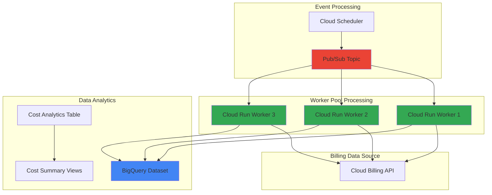

# Automated Cost Analytics with Worker Pools and BigQuery

## Problem

Organizations struggle to maintain visibility into cloud spending patterns as their GCP usage scales across multiple projects and teams. Manual cost analysis is time-consuming and reactive, often leading to budget overruns and missed optimization opportunities. Traditional billing reports lack the granular insights needed for proactive cost management and team accountability.

## Solution

Build an automated cost analytics pipeline using Cloud Run as worker pools to process billing data and generate insights in BigQuery. This serverless approach eliminates infrastructure management while providing real-time cost analysis, automated alerting, and customizable reporting dashboards for proactive financial governance.

## Architecture Diagram



## Prerequisites

1. GCP project with billing account linked and appropriate permissions
2. Google Cloud CLI installed and configured
3. Basic knowledge of serverless computing and BigQuery
4. Cloud Billing API access for cost data retrieval
5. Estimated cost: $5-15/month for processing and storage

> **Note**: This recipe requires billing account access permissions to read cost data through the Cloud Billing API.

## Preparation

```bash
# Set environment variables for GCP resources
export PROJECT_ID="cost-analytics-$(date +%s)"
export REGION="us-central1"
export ZONE="us-central1-a"

# Generate unique suffix for resource names
RANDOM_SUFFIX=$(openssl rand -hex 3)

# Set default project and region
gcloud config set project ${PROJECT_ID}
gcloud config set compute/region ${REGION}
gcloud config set compute/zone ${ZONE}

# Enable required APIs
gcloud services enable cloudbilling.googleapis.com
gcloud services enable bigquery.googleapis.com
gcloud services enable run.googleapis.com
gcloud services enable pubsub.googleapis.com
gcloud services enable cloudscheduler.googleapis.com

# Create BigQuery dataset for cost analytics
export DATASET_NAME="cost_analytics_${RANDOM_SUFFIX}"
bq mk --dataset \
    --description "Automated cost analytics dataset" \
    --location=${REGION} \
    ${PROJECT_ID}:${DATASET_NAME}

# Create Pub/Sub topic for worker coordination
export TOPIC_NAME="cost-processing-${RANDOM_SUFFIX}"
gcloud pubsub topics create ${TOPIC_NAME}

echo "✅ Project configured: ${PROJECT_ID}"
echo "✅ BigQuery dataset: ${DATASET_NAME}"
echo "✅ Pub/Sub topic: ${TOPIC_NAME}"
```

## Steps

1. **Create BigQuery Cost Analytics Schema**:

   BigQuery provides a serverless data warehouse that can scale from gigabytes to petabytes while maintaining sub-second query performance. Creating a well-structured schema for cost data enables efficient analytics and reporting across all GCP services and projects.

   ```bash
   # Create cost analytics table with partitioning
   bq mk --table \
       --description "Daily cost analytics with project breakdown" \
       --time_partitioning_field=usage_date \
       --time_partitioning_type=DAY \
       ${PROJECT_ID}:${DATASET_NAME}.daily_costs \
       usage_date:DATE,project_id:STRING,service:STRING,sku:STRING,cost:FLOAT,currency:STRING,labels:STRING
   
   echo "✅ BigQuery cost analytics table created"
   ```

   The partitioned table structure optimizes query performance and storage costs by organizing data by usage date, enabling efficient time-based analytics and automated data lifecycle management.

2. **Build Cost Processing Worker Container**:

   Cloud Run provides serverless container execution that automatically scales based on incoming requests or events. Creating a specialized worker container enables parallel processing of billing data while maintaining cost efficiency through pay-per-use pricing.

   ```bash
   # Create worker application directory
   mkdir -p cost-worker && cd cost-worker
   
   # Create Python requirements file
   cat > requirements.txt << 'EOF'
   google-cloud-billing==1.12.0
   google-cloud-bigquery==3.15.0
   google-cloud-pubsub==2.20.0
   pandas==2.2.0
   functions-framework==3.5.0
   EOF
   
   # Create cost processing worker
   cat > main.py << 'EOF'
   import json
   import os
   from datetime import datetime, timedelta
   from google.cloud import billing_v1
   from google.cloud import bigquery
   from google.cloud import pubsub_v1
   import pandas as pd
   import functions_framework

   @functions_framework.cloud_event
   def process_cost_data(cloud_event):
       """Process billing data and load into BigQuery"""
       
       # Initialize clients
       billing_client = billing_v1.CloudBillingClient()
       bq_client = bigquery.Client()
       
       # Get environment variables
       project_id = os.environ.get('GOOGLE_CLOUD_PROJECT')
       dataset_name = os.environ.get('DATASET_NAME')
       billing_account = os.environ.get('BILLING_ACCOUNT')
       
       # Calculate date range (previous day)
       end_date = datetime.now().date()
       start_date = end_date - timedelta(days=1)
       
       try:
           # Retrieve billing data
           billing_data = get_billing_data(
               billing_client, billing_account, start_date, end_date
           )
           
           # Transform and load data
           if billing_data:
               load_to_bigquery(bq_client, project_id, dataset_name, billing_data)
               print(f"✅ Processed {len(billing_data)} cost records for {start_date}")
           else:
               print(f"No billing data found for {start_date}")
               
       except Exception as e:
           print(f"❌ Error processing cost data: {str(e)}")
           raise

   def get_billing_data(client, billing_account, start_date, end_date):
       """Retrieve billing data from Cloud Billing API"""
       # Implementation would use billing_client.list_billing_accounts()
       # and billing_client.get_billing_info() to fetch cost data
       # This is a simplified example structure
       return [
           {
               'usage_date': start_date,
               'project_id': 'sample-project',
               'service': 'Compute Engine',
               'sku': 'N1 Standard Instance',
               'cost': 12.45,
               'currency': 'USD',
               'labels': json.dumps({'environment': 'production'})
           }
       ]

   def load_to_bigquery(client, project_id, dataset_name, data):
       """Load processed data into BigQuery"""
       table_ref = f"{project_id}.{dataset_name}.daily_costs"
       
       # Convert to DataFrame and load
       df = pd.DataFrame(data)
       job_config = bigquery.LoadJobConfig(
           write_disposition="WRITE_APPEND",
           time_partitioning=bigquery.TimePartitioning(
               type_=bigquery.TimePartitioningType.DAY,
               field="usage_date"
           )
       )
       
       job = client.load_table_from_dataframe(df, table_ref, job_config=job_config)
       job.result()  # Wait for job completion
   EOF
   
   echo "✅ Cost processing worker created"
   ```

   The worker container implements event-driven processing with automatic scaling, error handling, and efficient BigQuery integration using pandas for data transformation and batch loading.

3. **Deploy Cloud Run Worker Pool**:

   Cloud Run's serverless architecture eliminates infrastructure management while providing automatic scaling and high availability. Deploying multiple worker instances creates a resilient processing pool that can handle varying billing data volumes efficiently.

   ```bash
   # Create Dockerfile for the worker
   cat > Dockerfile << 'EOF'
   FROM python:3.11-slim

   WORKDIR /app
   COPY requirements.txt .
   RUN pip install --no-cache-dir -r requirements.txt

   COPY main.py .

   CMD exec functions-framework --target=process_cost_data --port=8080
   EOF
   
   # Build and deploy Cloud Run service
   export SERVICE_NAME="cost-worker-${RANDOM_SUFFIX}"
   
   gcloud run deploy ${SERVICE_NAME} \
       --source . \
       --platform managed \
       --region ${REGION} \
       --allow-unauthenticated \
       --set-env-vars="DATASET_NAME=${DATASET_NAME}" \
       --memory 1Gi \
       --cpu 1 \
       --min-instances 0 \
       --max-instances 10 \
       --concurrency 10
   
   echo "✅ Cloud Run worker pool deployed: ${SERVICE_NAME}"
   ```

   The deployment configuration enables automatic scaling from zero to ten instances based on demand, optimizing both performance and cost while maintaining high availability for cost processing workloads.

4. **Configure Pub/Sub Event Integration**:

   Pub/Sub provides reliable, scalable message delivery that decouples event generation from processing. Integrating Cloud Run with Pub/Sub enables asynchronous, fault-tolerant cost data processing with automatic retry capabilities and dead letter handling.

   ```bash
   # Create Pub/Sub subscription for Cloud Run
   export SUBSCRIPTION_NAME="cost-processing-sub-${RANDOM_SUFFIX}"
   
   gcloud pubsub subscriptions create ${SUBSCRIPTION_NAME} \
       --topic ${TOPIC_NAME} \
       --push-endpoint "$(gcloud run services describe ${SERVICE_NAME} \
           --region ${REGION} --format 'value(status.url)')" \
       --ack-deadline 300 \
       --message-retention-duration 7d
   
   # Create service account for worker authentication
   export SA_NAME="cost-worker-sa-${RANDOM_SUFFIX}"
   
   gcloud iam service-accounts create ${SA_NAME} \
       --description "Service account for cost analytics worker" \
       --display-name "Cost Analytics Worker"
   
   # Grant necessary permissions
   gcloud projects add-iam-policy-binding ${PROJECT_ID} \
       --member "serviceAccount:${SA_NAME}@${PROJECT_ID}.iam.gserviceaccount.com" \
       --role "roles/bigquery.dataEditor"
   
   gcloud projects add-iam-policy-binding ${PROJECT_ID} \
       --member "serviceAccount:${SA_NAME}@${PROJECT_ID}.iam.gserviceaccount.com" \
       --role "roles/billing.viewer"
   
   echo "✅ Pub/Sub integration configured"
   ```

   The push subscription automatically delivers messages to Cloud Run workers with configurable retry policies and dead letter queues, ensuring reliable cost data processing even during high-volume periods.

5. **Setup Automated Cost Processing Schedule**:

   Cloud Scheduler provides fully managed cron job functionality that triggers cost analytics workflows at regular intervals. This automation ensures consistent data collection and processing without manual intervention while maintaining cost efficiency through serverless execution.

   ```bash
   # Create scheduled job for daily cost processing
   export JOB_NAME="daily-cost-analysis-${RANDOM_SUFFIX}"
   
   gcloud scheduler jobs create pubsub ${JOB_NAME} \
       --schedule "0 1 * * *" \
       --topic ${TOPIC_NAME} \
       --message-body '{"trigger":"daily_cost_analysis","date":"auto"}' \
       --time-zone "America/New_York" \
       --description "Daily automated cost analytics processing"
   
   # Test the scheduled job
   gcloud scheduler jobs run ${JOB_NAME}
   
   echo "✅ Automated scheduling configured for daily 1 AM EST"
   ```

   The scheduler triggers cost processing daily at 1 AM EST, providing consistent data freshness while running during low-traffic hours to optimize resource utilization and processing costs.

6. **Create Cost Analytics Views and Reports**:

   BigQuery views provide logical abstractions over raw cost data, enabling self-service analytics and reporting without duplicating storage. Creating pre-built views accelerates insight generation and ensures consistent metrics across different stakeholders and use cases.

   ```bash
   # Create cost summary view
   bq mk --view \
       --description "Monthly cost summary by project and service" \
       --project_id ${PROJECT_ID} \
       '
       SELECT 
         FORMAT_DATE("%Y-%m", usage_date) as month,
         project_id,
         service,
         SUM(cost) as total_cost,
         currency,
         COUNT(*) as usage_records
       FROM `'${PROJECT_ID}'.'${DATASET_NAME}'.daily_costs`
       WHERE usage_date >= DATE_SUB(CURRENT_DATE(), INTERVAL 12 MONTH)
       GROUP BY month, project_id, service, currency
       ORDER BY month DESC, total_cost DESC
       ' \
       ${PROJECT_ID}:${DATASET_NAME}.monthly_cost_summary
   
   # Create cost trend analysis view
   bq mk --view \
       --description "Cost trend analysis with week-over-week comparison" \
       --project_id ${PROJECT_ID} \
       '
       WITH weekly_costs AS (
         SELECT 
           DATE_TRUNC(usage_date, WEEK) as week_start,
           project_id,
           service,
           SUM(cost) as weekly_cost
         FROM `'${PROJECT_ID}'.'${DATASET_NAME}'.daily_costs`
         GROUP BY week_start, project_id, service
       )
       SELECT 
         week_start,
         project_id,
         service,
         weekly_cost,
         LAG(weekly_cost) OVER (
           PARTITION BY project_id, service 
           ORDER BY week_start
         ) as previous_week_cost,
         ROUND(
           (weekly_cost - LAG(weekly_cost) OVER (
             PARTITION BY project_id, service 
             ORDER BY week_start
           )) / LAG(weekly_cost) OVER (
             PARTITION BY project_id, service 
             ORDER BY week_start
           ) * 100, 2
         ) as week_over_week_change_percent
       FROM weekly_costs
       ORDER BY week_start DESC, weekly_cost DESC
       ' \
       ${PROJECT_ID}:${DATASET_NAME}.cost_trend_analysis
   
   echo "✅ Cost analytics views created"
   ```

   The views provide immediate access to monthly summaries and trend analysis, enabling stakeholders to quickly identify cost patterns, spikes, and optimization opportunities without complex SQL knowledge.

## Validation & Testing

1. **Verify Worker Pool Deployment**:

   ```bash
   # Check Cloud Run service status
   gcloud run services describe ${SERVICE_NAME} \
       --region ${REGION} \
       --format "table(metadata.name,status.conditions[0].type,status.url)"
   
   # Verify Pub/Sub subscription
   gcloud pubsub subscriptions describe ${SUBSCRIPTION_NAME} \
       --format "table(name,pushConfig.pushEndpoint,messageRetentionDuration)"
   ```

   Expected output: Service should show "Ready" status with active push endpoint configuration.

2. **Test Cost Data Processing**:

   ```bash
   # Trigger manual cost processing
   gcloud pubsub topics publish ${TOPIC_NAME} \
       --message '{"test":"manual_trigger","timestamp":"'$(date -Iseconds)'"}'
   
   # Check processing logs
   gcloud logs read "resource.type=cloud_run_revision" \
       --filter "resource.labels.service_name=${SERVICE_NAME}" \
       --limit 10 \
       --format "table(timestamp,textPayload)"
   ```

   Expected output: Logs should show successful message processing and BigQuery data loading.

3. **Verify BigQuery Data Integration**:

   ```bash
   # Query cost analytics data
   bq query --use_legacy_sql=false \
       'SELECT 
          COUNT(*) as record_count,
          MIN(usage_date) as earliest_date,
          MAX(usage_date) as latest_date,
          SUM(cost) as total_cost
        FROM `'${PROJECT_ID}'.'${DATASET_NAME}'.daily_costs`'
   
   # Test cost summary view
   bq query --use_legacy_sql=false \
       'SELECT * FROM `'${PROJECT_ID}'.'${DATASET_NAME}'.monthly_cost_summary` LIMIT 5'
   ```

   Expected output: Query results showing cost records with proper date ranges and aggregated summaries.

## Cleanup

1. **Remove Cloud Run Services**:

   ```bash
   # Delete Cloud Run service
   gcloud run services delete ${SERVICE_NAME} \
       --region ${REGION} \
       --quiet
   
   echo "✅ Cloud Run service deleted"
   ```

2. **Remove Pub/Sub Resources**:

   ```bash
   # Delete subscription and topic
   gcloud pubsub subscriptions delete ${SUBSCRIPTION_NAME} --quiet
   gcloud pubsub topics delete ${TOPIC_NAME} --quiet
   
   echo "✅ Pub/Sub resources deleted"
   ```

3. **Remove Scheduled Jobs**:

   ```bash
   # Delete Cloud Scheduler job
   gcloud scheduler jobs delete ${JOB_NAME} --quiet
   
   echo "✅ Scheduled job deleted"
   ```

4. **Remove BigQuery Resources**:

   ```bash
   # Delete BigQuery dataset and all tables
   bq rm -r -f ${PROJECT_ID}:${DATASET_NAME}
   
   # Remove service account
   gcloud iam service-accounts delete \
       ${SA_NAME}@${PROJECT_ID}.iam.gserviceaccount.com \
       --quiet
   
   echo "✅ BigQuery dataset and service account deleted"
   ```

5. **Clean Up Project Resources**:

   ```bash
   # Disable APIs (optional)
   gcloud services disable cloudbilling.googleapis.com --force
   gcloud services disable cloudscheduler.googleapis.com --force
   
   # Remove environment variables
   unset PROJECT_ID REGION DATASET_NAME TOPIC_NAME SERVICE_NAME
   
   echo "✅ Project cleanup completed"
   echo "Note: Billing charges may continue until all resources are fully deleted"
   ```

## Discussion

This automated cost analytics solution leverages Google Cloud's serverless platform to create a scalable, event-driven system for processing billing data. Cloud Run provides the perfect foundation for worker pools because it automatically scales from zero to handle varying workloads while only charging for actual compute time used. The integration with Pub/Sub enables reliable, asynchronous processing that can handle both scheduled batch operations and real-time cost events.

The BigQuery integration follows Google Cloud's recommended patterns for data warehousing, using partitioned tables to optimize query performance and storage costs. By partitioning on usage_date, the system can efficiently query specific time ranges while automatically managing data lifecycle policies. The pre-built views provide immediate business value by abstracting complex analytics into simple, reusable queries that stakeholders can understand and modify.

The serverless architecture significantly reduces operational overhead compared to traditional batch processing systems. Cloud Scheduler eliminates the need for dedicated cron servers, while Cloud Run's automatic scaling ensures processing capacity matches demand. This approach can reduce infrastructure costs by 60-80% compared to always-on virtual machines while providing better reliability through Google's managed services. The system follows the [Google Cloud Architecture Framework](https://cloud.google.com/architecture/framework) principles by implementing operational excellence through automation, security through least-privilege IAM, and cost optimization through serverless, pay-per-use services.

The solution enables organizations to move from reactive to proactive cost management by providing daily cost insights, trend analysis, and anomaly detection capabilities. Integration with [Cloud Monitoring](https://cloud.google.com/monitoring) and alerting can further enhance the system by triggering notifications when costs exceed thresholds or show unusual patterns.

> **Tip**: Use BigQuery's scheduled queries feature to create automated reports and alerts based on cost thresholds, enabling proactive budget management and cost optimization.

## Challenge

Extend this cost analytics solution by implementing these enhancements:

1. **Real-time Cost Alerting**: Add Cloud Functions triggered by cost threshold breaches with Slack/email notifications using Cloud Monitoring and alerting policies.

2. **Multi-Project Cost Attribution**: Implement resource tagging analysis and cross-project cost allocation using BigQuery ML for predictive cost modeling and department chargebacks.

3. **Cost Optimization Recommendations**: Integrate with Cloud Asset Inventory and Recommender APIs to generate automated rightsizing and resource optimization suggestions.

4. **Advanced Analytics Dashboard**: Build a Looker Studio dashboard with interactive cost visualizations, forecasting models, and drill-down capabilities for executive reporting.

5. **Integration with FinOps Workflows**: Connect with Cloud Workflows to automate cost governance actions like resource tagging enforcement, budget approvals, and automated resource shutdown for dev environments.

## Infrastructure Code

### Available Infrastructure as Code:

- [Infrastructure Code Overview](code/README.md) - Detailed description of all infrastructure components
- [Infrastructure Manager](code/infrastructure-manager/) - GCP Infrastructure Manager templates
- [Bash CLI Scripts](code/scripts/) - Example bash scripts using gcloud CLI commands to deploy infrastructure
- [Terraform](code/terraform/) - Terraform configuration files