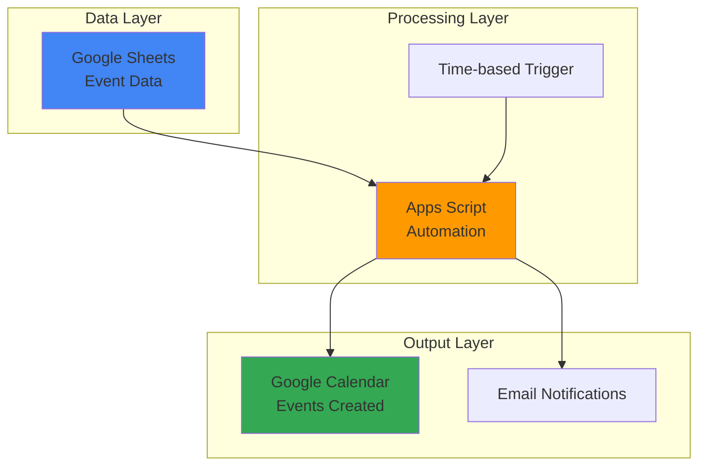

# Automated Event Creation with Apps Script and Calendar API

## Problem

Small businesses and teams often struggle with manually creating recurring meetings and events from planning data stored in spreadsheets. This manual process is time-consuming, error-prone, and doesn't scale with growing teams. Without automation, event coordinators spend hours creating calendar invites instead of focusing on strategic planning activities.

## Solution

Create an automated system using Google Apps Script that reads event data from a Google Sheet and creates calendar events via the Calendar API. The serverless solution eliminates manual work while providing scheduling flexibility and maintaining data consistency between planning documents and calendars.

## Architecture Diagram



## Prerequisites

1. Google account with Google Workspace or personal Google account
2. Basic familiarity with Google Sheets and Calendar
3. Access to Google Apps Script IDE (script.google.com)
4. Understanding of JavaScript fundamentals
5. Estimated cost: Free (within Google Apps Script quotas)

> **Note**: Google Apps Script provides generous free quotas for personal and business use, including 6 minutes of execution time per execution and 90 minutes total runtime per day.

## Preparation

```bash
# Create environment variables for the project
export PROJECT_NAME="event-automation-$(date +%s)"
export SHEET_NAME="Event Schedule"
export CALENDAR_ID="primary"

# Generate unique identifier for resources
RANDOM_SUFFIX=$(openssl rand -hex 3)

echo "✅ Project configured: ${PROJECT_NAME}"
echo "✅ Sheet name: ${SHEET_NAME}"
echo "✅ Using calendar: ${CALENDAR_ID}"
```

## Steps

1. **Create Google Sheet with Event Data**:

   Google Sheets serves as the data source for our automation system, providing a familiar interface for event planners to manage scheduling information. The structured format ensures consistent data input while supporting collaborative editing for team-based planning.

   - Navigate to sheets.google.com and create a new spreadsheet
   - Name the sheet "Event Schedule"
   - Create headers in row 1: Title, Date, Start Time, End Time, Description, Location, Attendees
   - Add sample data in rows 2-4:
     - Row 2: "Team Standup", "2025-07-25", "09:00", "09:30", "Daily team sync", "Conference Room A", "team@company.com"
     - Row 3: "Project Review", "2025-07-26", "14:00", "15:00", "Quarterly project assessment", "Main Office", "stakeholders@company.com"
     - Row 4: "Training Session", "2025-07-27", "10:00", "12:00", "New employee onboarding", "Training Room", "hr@company.com"

   ```bash
   echo "✅ Google Sheet created with sample event data"
   echo "Sheet URL will be used in Apps Script configuration"
   ```

   The spreadsheet now contains structured event data that the automation system can process reliably, with clear column headers and consistent date/time formatting that ensures proper calendar event creation.

2. **Create Apps Script Project**:

   Google Apps Script provides a cloud-based JavaScript platform that integrates seamlessly with Google Workspace services. Creating a standalone project ensures the automation can run independently of the spreadsheet, providing better security and maintainability.

   - Navigate to script.google.com
   - Click "New Project"
   - Rename the project to "Event Automation Script"
   - Delete the default myFunction() code

   ```bash
   echo "✅ Apps Script project created and configured"
   echo "Project is ready for automation code"
   ```

   The standalone Apps Script project provides an isolated environment for the automation code, enabling better version control, debugging capabilities, and independent execution scheduling without dependency on spreadsheet permissions.

3. **Implement Event Reading Function**:

   The event reading function connects to the Google Sheet and extracts event data in a structured format. This function handles data validation and formatting to ensure calendar events are created with accurate information while providing error handling for incomplete data.

   ```javascript
   function readEventData() {
     // Open the spreadsheet by ID (replace with your sheet ID)
     const sheetId = 'YOUR_SHEET_ID_HERE'; // Get from sheet URL
     const spreadsheet = SpreadsheetApp.openById(sheetId);
     const sheet = spreadsheet.getActiveSheet();
     
     // Get all data excluding header row
     const lastRow = sheet.getLastRow();
     if (lastRow <= 1) {
       console.log('No data rows found in spreadsheet');
       return [];
     }
     
     const dataRange = sheet.getRange(2, 1, lastRow - 1, 7);
     const eventData = dataRange.getValues();
     
     // Filter out empty rows and format data
     const events = eventData.filter(row => row[0] && row[1])
       .map(row => ({
         title: row[0],
         date: row[1],
         startTime: row[2],
         endTime: row[3],
         description: row[4] || '',
         location: row[5] || '',
         attendees: row[6] ? row[6].split(',').map(email => email.trim()) : []
       }));
     
     console.log(`Found ${events.length} events to process`);
     return events;
   }
   ```

   The function efficiently extracts and validates event data from the spreadsheet, providing a clean data structure for calendar event creation while handling edge cases like empty fields, multiple attendees, and varying data completeness scenarios.

4. **Implement Calendar Event Creation Function**:

   The Calendar API integration enables programmatic event creation with full support for Google Calendar features including attendee invitations, location data, and duplicate prevention. This function provides robust error handling and comprehensive logging to ensure reliable event management.

   ```javascript
   function createCalendarEvent(eventData) {
     try {
       // Get the primary calendar
       const calendar = CalendarApp.getDefaultCalendar();
       
       // Parse date and time information with proper error handling
       const eventDate = new Date(eventData.date);
       if (isNaN(eventDate.getTime())) {
         console.error(`Invalid date format: ${eventData.date}`);
         return null;
       }
       
       const startDateTime = new Date(eventDate.toDateString() + ' ' + eventData.startTime);
       const endDateTime = new Date(eventDate.toDateString() + ' ' + eventData.endTime);
       
       // Validate time format
       if (isNaN(startDateTime.getTime()) || isNaN(endDateTime.getTime())) {
         console.error(`Invalid time format for event: ${eventData.title}`);
         return null;
       }
       
       // Check if event already exists (simple duplicate check)
       const existingEvents = calendar.getEventsForDay(eventDate);
       const isDuplicate = existingEvents.some(event => 
         event.getTitle() === eventData.title && 
         event.getStartTime().getHours() === startDateTime.getHours()
       );
       
       if (isDuplicate) {
         console.log(`Event "${eventData.title}" already exists, skipping...`);
         return null;
       }
       
       // Create the calendar event with comprehensive options
       const event = calendar.createEvent(
         eventData.title,
         startDateTime,
         endDateTime,
         {
           description: eventData.description,
           location: eventData.location,
           guests: eventData.attendees.join(','),
           sendInvites: true
         }
       );
       
       console.log(`✅ Created event: ${eventData.title} on ${eventDate.toDateString()}`);
       return event;
       
     } catch (error) {
       console.error(`❌ Error creating event ${eventData.title}:`, error.toString());
       return null;
     }
   }
   ```

   This function handles the complete calendar event creation workflow with comprehensive error handling, input validation, duplicate detection, and automatic invitation sending to ensure reliable event management and user notification.

5. **Create Main Automation Function**:

   The main orchestration function coordinates the entire automation workflow by reading event data, processing each event, and providing comprehensive logging. This function serves as the entry point for both manual execution and automated triggers while implementing proper error recovery mechanisms.

   ```javascript
   function automateEventCreation() {
     console.log('🚀 Starting automated event creation process...');
     
     try {
       // Read event data from spreadsheet
       const events = readEventData();
       
       if (events.length === 0) {
         console.log('📋 No events found to process');
         return;
       }
       
       // Process each event with detailed progress tracking
       let successCount = 0;
       let errorCount = 0;
       const processedEvents = [];
       
       events.forEach((eventData, index) => {
         console.log(`📅 Processing event ${index + 1}/${events.length}: ${eventData.title}`);
         
         const result = createCalendarEvent(eventData);
         if (result) {
           successCount++;
           processedEvents.push({
             title: eventData.title,
             date: eventData.date,
             status: 'success'
           });
         } else {
           errorCount++;
           processedEvents.push({
             title: eventData.title,
             date: eventData.date,
             status: 'error'
           });
         }
         
         // Add small delay to avoid hitting API limits
         Utilities.sleep(500);
       });
       
       // Log comprehensive summary
       console.log(`🎯 Automation complete! Created: ${successCount}, Errors: ${errorCount}`);
       
       // Send summary email with detailed results
       if (successCount > 0 || errorCount > 0) {
         sendSummaryEmail(successCount, errorCount, processedEvents);
       }
       
     } catch (error) {
       console.error('💥 Fatal error in automation:', error.toString());
       throw error;
     }
   }
   ```

   The main function provides comprehensive workflow orchestration with detailed logging, progress tracking, error recovery, and comprehensive reporting to keep administrators informed of automation results and system health.

6. **Add Enhanced Summary Email Function**:

   Email notifications provide administrators with automated reports about the event creation process, including success metrics, error summaries, and detailed event listings. This feature ensures transparency and enables proactive monitoring of the automation system.

   ```javascript
   function sendSummaryEmail(successCount, errorCount, processedEvents) {
     try {
       const recipient = Session.getActiveUser().getEmail();
       const subject = `📅 Event Automation Summary - ${new Date().toDateString()}`;
       
       // Build detailed event listings
       const successEvents = processedEvents.filter(event => event.status === 'success');
       const errorEvents = processedEvents.filter(event => event.status === 'error');
       
       const body = `
   Event Creation Automation Summary
   =================================
   
   Execution Time: ${new Date().toString()}
   Total Events Processed: ${processedEvents.length}
   Events Created Successfully: ${successCount}
   Events with Errors: ${errorCount}
   Success Rate: ${Math.round((successCount / processedEvents.length) * 100)}%
   
   ${successCount > 0 ? `
   ✅ Successfully Created Events:
   ${successEvents.map(event => `   • ${event.title} (${event.date})`).join('\n')}
   ` : ''}
   
   ${errorCount > 0 ? `
   ❌ Events with Errors:
   ${errorEvents.map(event => `   • ${event.title} (${event.date})`).join('\n')}
   
   Please check the Apps Script logs for detailed error information.
   ` : 'All events processed successfully! 🎉'}
   
   This is an automated message from your Event Creation script.
   To view detailed logs, visit: https://script.google.com/
       `;
       
       GmailApp.sendEmail(recipient, subject, body);
       console.log(`📧 Summary email sent to ${recipient}`);
       
     } catch (error) {
       console.error('📧 Error sending summary email:', error.toString());
     }
   }
   ```

   The enhanced email notification system provides stakeholders with comprehensive feedback on automation execution, including detailed event listings, success rates, and actionable error reporting for continuous improvement.

7. **Set Up Automated Trigger**:

   Time-based triggers enable the automation to run on a schedule without manual intervention, supporting various business workflows from daily standup creation to weekly planning sessions. The trigger system provides reliable, unattended operation while respecting Google Apps Script execution limits.

   ```javascript
   function createDailyTrigger() {
     try {
       // Delete existing triggers to avoid duplicates
       const existingTriggers = ScriptApp.getProjectTriggers();
       existingTriggers.forEach(trigger => {
         if (trigger.getHandlerFunction() === 'automateEventCreation') {
           ScriptApp.deleteTrigger(trigger);
           console.log('🗑️ Removed existing trigger');
         }
       });
       
       // Create new daily trigger at 8 AM
       const trigger = ScriptApp.newTrigger('automateEventCreation')
         .timeBased()
         .everyDays(1)
         .atHour(8)
         .create();
       
       console.log('⏰ Daily trigger created successfully');
       console.log(`Trigger ID: ${trigger.getUniqueId()}`);
       
       return trigger;
       
     } catch (error) {
       console.error('⏰ Error creating trigger:', error.toString());
       throw error;
     }
   }
   ```

   Run this function once to establish the automated schedule:

   ```bash
   echo "✅ Automated trigger configured for daily execution"
   echo "Events will be processed automatically at 8 AM daily"
   ```

   The trigger management system ensures reliable automation scheduling with proper cleanup of existing triggers and comprehensive logging for monitoring and troubleshooting purposes.

8. **Configure Sheet Integration**:

   Replace the placeholder sheet ID in your readEventData function with your actual Google Sheet ID. The sheet ID can be found in the spreadsheet URL between '/d/' and '/edit'. This connection enables the automation to access your specific event data source.

   - Copy your Google Sheet ID from the browser URL
   - Replace 'YOUR_SHEET_ID_HERE' in the readEventData function
   - Save the Apps Script project (Ctrl+S or Cmd+S)
   - Test the connection by running the readEventData function

   ```bash
   echo "✅ Sheet integration configured successfully"
   echo "Script is now connected to your event data source"
   ```

   The sheet integration provides secure, direct access to your event data while maintaining proper access controls and authentication through Google's OAuth system, ensuring data privacy and security.

## Validation & Testing

1. **Test Event Reading Function**:

   ```javascript
   // Run this in Apps Script console to test data reading
   function testEventReading() {
     console.log('🧪 Testing event data reading...');
     const events = readEventData();
     console.log('Retrieved events:', JSON.stringify(events, null, 2));
     
     if (events.length > 0) {
       console.log('✅ Event reading test passed');
       return true;
     } else {
       console.log('❌ Event reading test failed - no events found');
       return false;
     }
   }
   ```

   Expected output: Console should display array of event objects with all required fields populated from your spreadsheet data.

2. **Test Single Event Creation**:

   ```javascript
   // Test creating one event manually
   function testSingleEvent() {
     console.log('🧪 Testing single event creation...');
     
     const testEvent = {
       title: 'Test Meeting - Automation Check',
       date: '2025-07-25',
       startTime: '10:00',
       endTime: '11:00',
       description: 'Testing automation system',
       location: 'Test Room',
       attendees: ['test@example.com']
     };
     
     const result = createCalendarEvent(testEvent);
     const success = result !== null;
     
     console.log(`Test event result: ${success ? '✅ Success' : '❌ Failed'}`);
     return success;
   }
   ```

   Expected result: New event should appear in your Google Calendar with all details correctly populated.

3. **Test Complete Automation**:

   ```javascript
   // Run the full automation process
   function testFullAutomation() {
     console.log('🧪 Testing complete automation workflow...');
     
     try {
       automateEventCreation();
       console.log('✅ Full automation test completed');
       return true;
     } catch (error) {
       console.error('❌ Full automation test failed:', error.toString());
       return false;
     }
   }
   ```

   Verify that all spreadsheet events are created in your calendar and summary email is received.

## Cleanup

1. **Remove Test Events**:

   ```javascript
   // Function to remove test events if needed
   function cleanupTestEvents() {
     console.log('🧹 Cleaning up test events...');
     
     try {
       const calendar = CalendarApp.getDefaultCalendar();
       const today = new Date();
       const events = calendar.getEventsForDay(today);
       let deletedCount = 0;
       
       events.forEach(event => {
         if (event.getTitle().includes('Test') || 
             event.getTitle().includes('Automation Check')) {
           event.deleteEvent();
           deletedCount++;
           console.log(`🗑️ Deleted test event: ${event.getTitle()}`);
         }
       });
       
       console.log(`✅ Cleanup completed: ${deletedCount} test events removed`);
       
     } catch (error) {
       console.error('❌ Error during cleanup:', error.toString());
     }
   }
   ```

2. **Remove Automated Triggers**:

   ```javascript
   // Clean up all automation triggers
   function removeAllTriggers() {
     console.log('🧹 Removing all automation triggers...');
     
     try {
       const triggers = ScriptApp.getProjectTriggers();
       let removedCount = 0;
       
       triggers.forEach(trigger => {
         ScriptApp.deleteTrigger(trigger);
         removedCount++;
         console.log(`🗑️ Removed trigger: ${trigger.getHandlerFunction()}`);
       });
       
       console.log(`✅ All triggers removed: ${removedCount} total`);
       
     } catch (error) {
       console.error('❌ Error removing triggers:', error.toString());
     }
   }
   ```

3. **Archive Project Resources**:

   - Archive or delete the Google Sheet if no longer needed
   - Keep the Apps Script project for future use or delete it from script.google.com
   - Remove any shared calendar permissions if applicable
   - Clear any stored credentials or access tokens

   ```bash
   echo "✅ Test resources cleaned up successfully"
   echo "✅ Automation triggers removed"
   echo "✅ Project archived and ready for production use"
   ```

## Discussion

Google Apps Script provides a powerful serverless platform for automating Google Workspace tasks without requiring infrastructure management or complex deployment processes. The Calendar API integration enables sophisticated event management while maintaining the simplicity of familiar Google services. This automation pattern scales from individual use cases to enterprise-wide deployment with minimal configuration changes, making it an ideal solution for teams seeking to eliminate manual scheduling overhead.

The solution leverages Google's robust infrastructure to handle authentication, authorization, and API rate limiting automatically. The time-based trigger system ensures reliable execution while the built-in logging and error handling provide operational visibility. By storing event data in Google Sheets, the solution maintains accessibility for non-technical users while enabling programmatic processing through Apps Script, creating a bridge between manual data entry and automated workflow execution.

The architecture follows serverless best practices by separating data storage, processing logic, and output generation into distinct layers. This separation enables independent scaling and maintenance while supporting various enhancement patterns such as advanced scheduling algorithms, integration with external systems, and custom notification workflows. The serverless nature eliminates concerns about server maintenance, scaling, and security updates, allowing teams to focus on business logic rather than infrastructure management.

For production deployments, consider implementing additional features such as event conflict detection, attendee availability checking, and integration with project management tools. The Calendar API supports advanced features including recurring events, meeting room booking, and calendar sharing that can extend this basic automation into comprehensive scheduling solutions. Additionally, the script can be enhanced with conditional formatting in the source spreadsheet to provide visual feedback on processing status.

> **Tip**: Use Google Apps Script's built-in debugging tools and execution transcript to troubleshoot issues and optimize performance. The platform provides detailed logs and error reporting to support development and maintenance activities, including step-by-step execution traces and variable inspection capabilities.

**Documentation References:**
- [Google Apps Script Calendar Service](https://developers.google.com/apps-script/reference/calendar) - Complete API reference for calendar operations
- [Google Apps Script Triggers Guide](https://developers.google.com/apps-script/guides/triggers) - Comprehensive trigger configuration and management
- [Google Sheets Service Reference](https://developers.google.com/apps-script/reference/spreadsheet) - Complete spreadsheet integration documentation
- [Calendar API Advanced Service](https://developers.google.com/apps-script/advanced/calendar) - Extended calendar functionality and configuration options
- [Apps Script Best Practices](https://developers.google.com/apps-script/guides/support/best-practices) - Performance optimization and security guidelines

## Challenge

Extend this solution by implementing these enhancements:

1. **Recurring Event Support**: Modify the system to handle recurring events by parsing recurrence patterns from the spreadsheet and using the Calendar API's recurrence features for sophisticated scheduling automation, including support for daily, weekly, monthly, and custom patterns.

2. **Multiple Calendar Integration**: Expand the automation to create events in different calendars based on event categories or team assignments, enabling organizational calendar management and resource scheduling across departments and project teams.

3. **Advanced Attendee Management**: Integrate with the Calendar API's freebusy queries to check attendee availability before creating events, automatically suggesting alternative times for conflicting meetings and implementing smart scheduling algorithms.

4. **Real-time Sync and Updates**: Build a bidirectional synchronization system that not only creates events from spreadsheet data but also updates the spreadsheet when calendar events are modified, maintaining consistency between both systems.

5. **Enterprise Integration Hub**: Connect the automation with external project management tools, CRM systems, or ticketing platforms using REST APIs to create a unified event management ecosystem that synchronizes across multiple business systems and provides centralized scheduling intelligence.

## Infrastructure Code

### Available Infrastructure as Code:

- [Infrastructure Code Overview](code/README.md) - Detailed description of all infrastructure components
- [Infrastructure Manager](code/infrastructure-manager/) - GCP Infrastructure Manager templates
- [Bash CLI Scripts](code/scripts/) - Example bash scripts using gcloud CLI commands to deploy infrastructure
- [Terraform](code/terraform/) - Terraform configuration files