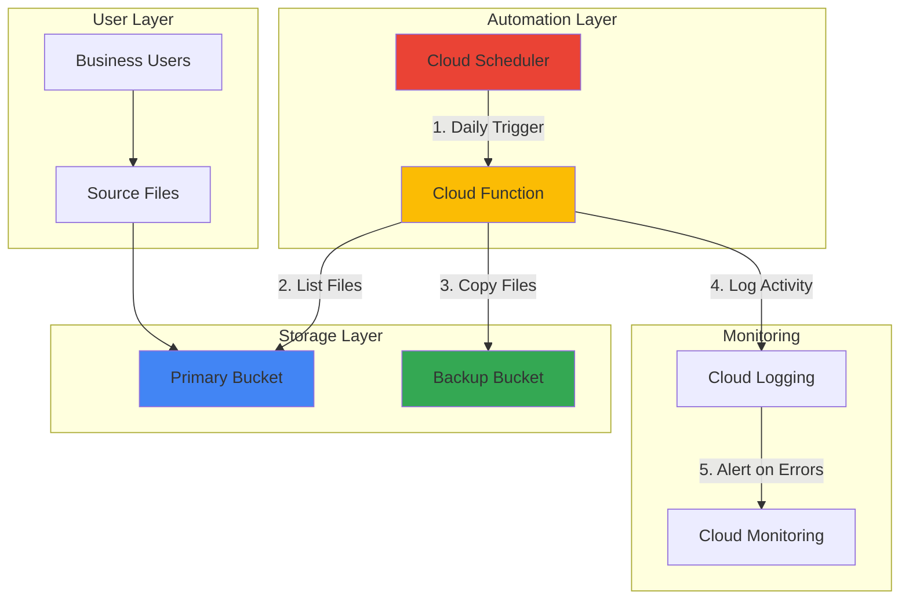

# Automated File Backup with Storage and Scheduler

## Problem

Organizations struggle with manual backup processes that are prone to human error and inconsistent execution. Without automated backup systems, critical business data remains vulnerable to loss, corruption, or accidental deletion, leading to potential downtime and significant business impact when recovery becomes necessary.

## Solution

Create an automated daily backup system using Google Cloud Storage and Cloud Scheduler. This solution automatically copies files from a primary storage bucket to a backup bucket using a Cloud Function triggered by Cloud Scheduler, ensuring consistent data protection without manual intervention while leveraging Google Cloud's serverless architecture for cost efficiency.

## Architecture Diagram



## Prerequisites

1. Google Cloud account with billing enabled and appropriate permissions (`roles/storage.admin`, `roles/cloudfunctions.admin`, `roles/cloudscheduler.admin`)
2. Google Cloud CLI installed and configured (or use Cloud Shell)
3. Basic understanding of Cloud Storage buckets and serverless functions
4. Python 3.11+ runtime environment knowledge
5. Estimated cost: ~$0.50-2.00 USD per month for small-scale backup operations

> **Note**: This recipe uses Google Cloud's serverless services, so costs scale with actual usage rather than fixed infrastructure charges.

## Preparation

```bash
# Set environment variables for GCP resources
export PROJECT_ID="backup-project-$(date +%s)"
export REGION="us-central1"
export ZONE="us-central1-a"

# Generate unique suffix for resource names
RANDOM_SUFFIX=$(openssl rand -hex 3)

# Set bucket names with unique suffixes
export PRIMARY_BUCKET="primary-data-${RANDOM_SUFFIX}"
export BACKUP_BUCKET="backup-data-${RANDOM_SUFFIX}"
export FUNCTION_NAME="backup-function-${RANDOM_SUFFIX}"

# Set default project and region
gcloud config set project ${PROJECT_ID}
gcloud config set compute/region ${REGION}
gcloud config set compute/zone ${ZONE}

# Enable required APIs
gcloud services enable cloudfunctions.googleapis.com
gcloud services enable cloudscheduler.googleapis.com
gcloud services enable storage.googleapis.com
gcloud services enable logging.googleapis.com

echo "✅ Project configured: ${PROJECT_ID}"
echo "✅ Primary bucket: ${PRIMARY_BUCKET}"
echo "✅ Backup bucket: ${BACKUP_BUCKET}"
```

## Steps

1. **Create Primary and Backup Storage Buckets**:

   Google Cloud Storage provides unified object storage with global availability and strong consistency guarantees. Creating separate buckets for primary data and backups establishes clear data separation and enables independent lifecycle management policies for each storage tier.

   ```bash
   # Create primary storage bucket with regional location
   gcloud storage buckets create gs://${PRIMARY_BUCKET} \
       --location=${REGION} \
       --storage-class=STANDARD \
       --uniform-bucket-level-access
   
   # Create backup storage bucket with nearline storage class for cost optimization
   gcloud storage buckets create gs://${BACKUP_BUCKET} \
       --location=${REGION} \
       --storage-class=NEARLINE \
       --uniform-bucket-level-access
   
   # Enable versioning on both buckets for data protection
   gcloud storage buckets update gs://${PRIMARY_BUCKET} \
       --versioning
   gcloud storage buckets update gs://${BACKUP_BUCKET} \
       --versioning
   
   echo "✅ Storage buckets created successfully"
   ```

   The storage buckets are now configured with versioning enabled and appropriate storage classes. The primary bucket uses Standard storage for frequent access, while the backup bucket uses Nearline storage for cost-effective long-term retention with slightly higher access costs.

2. **Upload Sample Files to Primary Bucket**:

   Creating sample files simulates a real-world scenario where business-critical data needs regular backup protection. This step establishes the foundation for testing the automated backup process with actual file content.

   ```bash
   # Create sample files for backup testing
   mkdir -p backup-demo
   echo "Critical business data - $(date)" > backup-demo/business-data.txt
   echo "Configuration settings - $(date)" > backup-demo/config.json
   echo "User profiles - $(date)" > backup-demo/users.csv
   
   # Upload sample files to primary bucket
   gcloud storage cp backup-demo/* gs://${PRIMARY_BUCKET}/
   
   # Verify files were uploaded successfully
   gcloud storage ls gs://${PRIMARY_BUCKET}/
   
   echo "✅ Sample files uploaded to primary bucket"
   ```

   The primary bucket now contains sample files that represent typical business data requiring backup protection. These files will be automatically copied to the backup bucket through the scheduled backup process.

3. **Create Cloud Function for Backup Logic**:

   Cloud Functions provides serverless compute that automatically scales based on demand. The backup function implements the core logic for copying files between buckets with proper error handling and logging for monitoring backup operations.

   ```bash
   # Create function directory and main Python file
   mkdir -p backup-function
   cd backup-function
   
   # Create the backup function code
   cat > main.py << 'EOF'
import os
from google.cloud import storage, logging
from datetime import datetime
import json

def backup_files(request):
    """Cloud Function to backup files from primary to backup bucket."""
    
    # Initialize clients
    storage_client = storage.Client()
    logging_client = logging.Client()
    logger = logging_client.logger('backup-function')
    
    # Get bucket names from environment variables
    primary_bucket_name = os.environ.get('PRIMARY_BUCKET')
    backup_bucket_name = os.environ.get('BACKUP_BUCKET')
    
    if not primary_bucket_name or not backup_bucket_name:
        error_msg = "Missing required environment variables"
        logger.log_text(error_msg, severity='ERROR')
        return {'error': error_msg}, 400
    
    try:
        # Get bucket references
        primary_bucket = storage_client.bucket(primary_bucket_name)
        backup_bucket = storage_client.bucket(backup_bucket_name)
        
        # List and copy all files from primary to backup
        blobs = primary_bucket.list_blobs()
        copied_count = 0
        
        for blob in blobs:
            # Create backup file name with timestamp
            backup_name = f"backup-{datetime.now().strftime('%Y%m%d')}/{blob.name}"
            
            # Copy blob to backup bucket
            backup_bucket.copy_blob(blob, backup_bucket, backup_name)
            copied_count += 1
            
            logger.log_text(f"Copied {blob.name} to {backup_name}")
        
        success_msg = f"Backup completed successfully. {copied_count} files copied."
        logger.log_text(success_msg, severity='INFO')
        
        return {
            'status': 'success',
            'files_copied': copied_count,
            'timestamp': datetime.now().isoformat()
        }
        
    except Exception as e:
        error_msg = f"Backup failed: {str(e)}"
        logger.log_text(error_msg, severity='ERROR')
        return {'error': error_msg}, 500
EOF
   
   # Create requirements.txt for function dependencies
   cat > requirements.txt << EOF
google-cloud-storage==2.18.0
google-cloud-logging==3.11.0
EOF
   
   echo "✅ Cloud Function code created"
   ```

   The backup function is now ready with comprehensive error handling and logging capabilities. It copies all files from the primary bucket to the backup bucket with timestamped organization for easy recovery and audit trails.

4. **Deploy Cloud Function with Environment Variables**:

   Deploying the Cloud Function creates a serverless endpoint that can be triggered by Cloud Scheduler. Environment variables provide secure configuration without hardcoding bucket names in the function code, following security best practices.

   ```bash
   # Deploy the Cloud Function with HTTP trigger using latest runtime
   gcloud functions deploy ${FUNCTION_NAME} \
       --gen2 \
       --runtime python311 \
       --trigger-http \
       --allow-unauthenticated \
       --entry-point backup_files \
       --memory 256MB \
       --timeout 60s \
       --set-env-vars PRIMARY_BUCKET=${PRIMARY_BUCKET},BACKUP_BUCKET=${BACKUP_BUCKET}
   
   # Get the function trigger URL for scheduler configuration
   FUNCTION_URL=$(gcloud functions describe ${FUNCTION_NAME} \
       --gen2 \
       --region=${REGION} \
       --format="value(serviceConfig.uri)")
   
   echo "✅ Cloud Function deployed successfully"
   echo "Function URL: ${FUNCTION_URL}"
   ```

   The Cloud Function is now deployed using the 2nd generation runtime with Python 3.11 and is ready to execute backup operations. The HTTP trigger allows Cloud Scheduler to invoke the function, while environment variables provide secure access to bucket configuration.

5. **Create Cloud Scheduler Job for Daily Backups**:

   Cloud Scheduler provides managed cron-style job scheduling with built-in retry logic and monitoring. Creating a daily backup schedule ensures consistent data protection without manual intervention while maintaining operational visibility.

   ```bash
   # Create Cloud Scheduler job for daily backups at 2 AM UTC
   gcloud scheduler jobs create http backup-daily-job \
       --location=${REGION} \
       --schedule="0 2 * * *" \
       --uri=${FUNCTION_URL} \
       --http-method=POST \
       --headers="Content-Type=application/json" \
       --message-body='{}' \
       --description="Daily automated backup of storage files"
   
   echo "✅ Cloud Scheduler job created for daily backups at 2 AM UTC"
   ```

   The scheduled backup job is now active and will automatically trigger the backup function daily at 2 AM UTC. This timing minimizes impact on business operations while ensuring recent data is consistently protected.

6. **Test Manual Backup Execution**:

   Testing the backup process manually validates that all components work correctly before relying on the automated schedule. This verification step ensures the backup system functions properly and handles various scenarios.

   ```bash
   # Trigger the backup function manually for testing
   curl -X POST "${FUNCTION_URL}" \
       -H "Content-Type: application/json" \
       -d '{}'
   
   # Wait a moment for processing
   sleep 5
   
   # Verify backup files were created
   gcloud storage ls gs://${BACKUP_BUCKET}/
   
   echo "✅ Manual backup test completed"
   ```

   The manual backup test demonstrates that the automated system functions correctly and files are properly copied to the backup bucket with organized naming conventions for easy management.

7. **Configure Monitoring and Alerting**:

   Setting up monitoring ensures visibility into backup operations and enables proactive response to failures. Cloud Logging integration provides detailed audit trails while monitoring alerts notify administrators of backup issues.

   ```bash
   # View function logs to verify successful execution
   gcloud functions logs read ${FUNCTION_NAME} \
       --gen2 \
       --region=${REGION} \
       --limit=10
   
   # Create log-based alert policy for backup failures
   gcloud alpha monitoring policies create \
       --policy-from-file=- << EOF
displayName: "Backup Function Failures"
conditions:
  - displayName: "Backup function errors"
    conditionThreshold:
      filter: 'resource.type="cloud_function" AND resource.labels.function_name="${FUNCTION_NAME}" AND severity="ERROR"'
      comparison: COMPARISON_GREATER_THAN
      thresholdValue: 0
      duration: 60s
notificationChannels: []
EOF
   
   echo "✅ Monitoring and alerting configured"
   ```

   Monitoring is now active with automated alerting for backup failures. This provides operational visibility and ensures rapid response to any backup system issues that could impact data protection.

## Validation & Testing

1. Verify backup buckets and files exist:

   ```bash
   # Check primary bucket contents
   echo "=== Primary Bucket Contents ==="
   gcloud storage ls -l gs://${PRIMARY_BUCKET}/
   
   # Check backup bucket contents
   echo "=== Backup Bucket Contents ==="
   gcloud storage ls -l gs://${BACKUP_BUCKET}/
   ```

   Expected output: Both buckets should contain files, with backup bucket showing timestamped directories.

2. Test Cloud Function execution:

   ```bash
   # Test function directly
   curl -X POST "${FUNCTION_URL}" \
       -H "Content-Type: application/json" \
       -d '{}' \
       -w "\nHTTP Status: %{http_code}\n"
   ```

   Expected output: HTTP 200 status with JSON response showing successful backup completion.

3. Verify Cloud Scheduler job configuration:

   ```bash
   # Check scheduler job status
   gcloud scheduler jobs describe backup-daily-job \
       --location=${REGION} \
       --format="table(name,schedule,state)"
   ```

   Expected output: Job should show ENABLED state with correct cron schedule.

## Cleanup

1. Remove Cloud Scheduler job:

   ```bash
   # Delete the scheduled backup job
   gcloud scheduler jobs delete backup-daily-job \
       --location=${REGION} \
       --quiet
   
   echo "✅ Cloud Scheduler job deleted"
   ```

2. Delete Cloud Function:

   ```bash
   # Remove the backup function
   gcloud functions delete ${FUNCTION_NAME} \
       --gen2 \
       --region=${REGION} \
       --quiet
   
   echo "✅ Cloud Function deleted"
   ```

3. Remove storage buckets and contents:

   ```bash
   # Delete all objects and buckets
   gcloud storage rm -r gs://${PRIMARY_BUCKET}
   gcloud storage rm -r gs://${BACKUP_BUCKET}
   
   echo "✅ Storage buckets and contents deleted"
   ```

4. Clean up local files and environment variables:

   ```bash
   # Remove local function directory
   cd .. && rm -rf backup-function backup-demo
   
   # Unset environment variables
   unset PROJECT_ID REGION ZONE PRIMARY_BUCKET BACKUP_BUCKET FUNCTION_NAME
   
   echo "✅ Local cleanup completed"
   ```

## Discussion

This automated backup solution demonstrates the power of Google Cloud's serverless architecture for data protection operations. By combining Cloud Storage's durability with Cloud Scheduler's reliability and Cloud Functions' scalability, organizations can implement enterprise-grade backup systems without managing infrastructure. The solution automatically handles backup operations, provides comprehensive logging, and scales based on actual data volumes, making it cost-effective for businesses of all sizes.

The architecture follows Google Cloud best practices by using separate storage classes for primary and backup data, implementing proper error handling and logging, and leveraging serverless compute to minimize operational overhead. The backup function's design with environment variables ensures security while maintaining flexibility for different deployment scenarios. Additionally, the timestamped backup organization enables easy data recovery and audit compliance requirements.

Cloud Storage's strong consistency guarantees ensure that backup operations capture the exact state of source data, while versioning provides additional protection against accidental deletions or modifications. The integration with Cloud Logging and Cloud Monitoring enables proactive management and rapid issue resolution, essential for maintaining data protection service levels. For more advanced scenarios, this foundation can be extended with features like incremental backups, cross-region replication, and automated retention policies following [Google Cloud backup best practices](https://cloud.google.com/architecture/backup-dr) and [Cloud Storage security guidelines](https://cloud.google.com/storage/docs/best-practices).

> **Tip**: Consider implementing lifecycle policies on backup buckets to automatically transition older backups to Archive storage class for long-term cost optimization while maintaining compliance requirements.

## Challenge

Extend this automated backup solution by implementing these enhancements:

1. **Incremental Backup Logic**: Modify the Cloud Function to only backup files that have changed since the last backup run, reducing storage costs and backup duration by tracking file metadata and checksums.

2. **Cross-Region Backup Replication**: Implement multi-region backup storage using Cloud Storage dual-region or multi-region buckets for enhanced disaster recovery capabilities and geographic data distribution.

3. **Backup Retention Automation**: Create lifecycle policies that automatically delete backups older than a specified retention period (e.g., 90 days) while maintaining compliance with business data retention requirements.

4. **Backup Verification System**: Develop a verification Cloud Function that periodically tests backup integrity by downloading and validating random backup files, ensuring data recoverability when needed.

5. **Advanced Monitoring Dashboard**: Build a Cloud Monitoring dashboard that displays backup success rates, storage utilization trends, cost analysis, and recovery time objectives (RTO) metrics for comprehensive backup system visibility.

## Infrastructure Code

### Available Infrastructure as Code:

- [Infrastructure Code Overview](code/README.md) - Detailed description of all infrastructure components
- [Infrastructure Manager](code/infrastructure-manager/) - GCP Infrastructure Manager templates
- [Bash CLI Scripts](code/scripts/) - Example bash scripts using gcloud CLI commands to deploy infrastructure
- [Terraform](code/terraform/) - Terraform configuration files