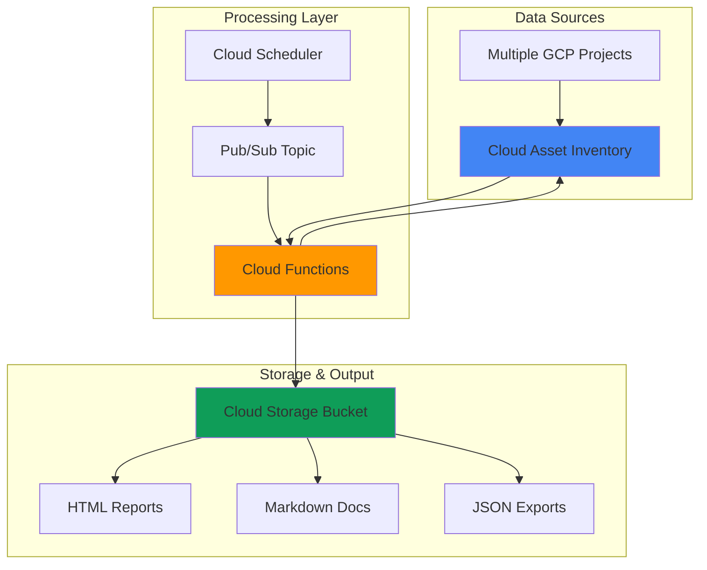

# Automated Infrastructure Documentation using Asset Inventory and Cloud Functions

## Problem

Enterprise organizations struggle to maintain accurate, up-to-date documentation of their cloud infrastructure as resources change frequently across multiple projects and environments. Manual documentation processes are time-consuming, error-prone, and quickly become outdated, leading to security risks, compliance issues, and operational inefficiencies during incident response and auditing.

## Solution

Create an automated documentation system that leverages Cloud Asset Inventory to discover and catalog all Google Cloud resources, then processes this data with Cloud Functions to generate comprehensive, real-time infrastructure documentation stored in Cloud Storage. This serverless approach ensures documentation stays current with automatic updates and provides multiple output formats for different stakeholders.

## Architecture Diagram



## Prerequisites

1. Google Cloud project with billing enabled and Asset Inventory API access
2. `gcloud` CLI installed and configured (or use Cloud Shell)
3. Python 3.13+ for Cloud Functions development
4. Basic knowledge of Cloud Asset Inventory and serverless functions
5. Estimated cost: $5-15/month for storage and function execution (based on organization size)

> **Note**: Ensure you have the necessary IAM permissions to access Asset Inventory across your organization or projects.

## Preparation

```bash
# Set environment variables for GCP resources
export PROJECT_ID="asset-docs-$(date +%s)"
export REGION="us-central1"
export ZONE="us-central1-a"

# Generate unique suffix for resource names
RANDOM_SUFFIX=$(openssl rand -hex 3)

# Set default project and region
gcloud config set project ${PROJECT_ID}
gcloud config set compute/region ${REGION}
gcloud config set compute/zone ${ZONE}

# Enable required APIs
gcloud services enable cloudasset.googleapis.com
gcloud services enable cloudfunctions.googleapis.com
gcloud services enable cloudscheduler.googleapis.com
gcloud services enable pubsub.googleapis.com
gcloud services enable storage.googleapis.com

echo "✅ Project configured: ${PROJECT_ID}"
```

```bash
# Create environment variables for resources
export BUCKET_NAME="asset-docs-${RANDOM_SUFFIX}"
export FUNCTION_NAME="asset-doc-generator"
export TOPIC_NAME="asset-inventory-trigger"
export SCHEDULER_JOB="daily-asset-docs"

# Create working directory for function code
mkdir -p asset-doc-function
cd asset-doc-function

echo "✅ Environment variables and directories created"
```

## Steps

1. **Create Cloud Storage Bucket for Documentation Artifacts**:

   Cloud Storage provides the persistent storage layer for our automated documentation system with unified object storage and global edge caching. The bucket will host generated HTML reports, markdown files, and JSON exports with versioning enabled to track changes over time.

   ```bash
   # Create bucket with versioning for documentation storage
   gsutil mb -p ${PROJECT_ID} \
       -c STANDARD \
       -l ${REGION} \
       gs://${BUCKET_NAME}
   
   # Enable versioning for change tracking
   gsutil versioning set on gs://${BUCKET_NAME}
   
   # Set up bucket structure
   gsutil -m cp /dev/null gs://${BUCKET_NAME}/reports/.gitkeep
   gsutil -m cp /dev/null gs://${BUCKET_NAME}/exports/.gitkeep
   gsutil -m cp /dev/null gs://${BUCKET_NAME}/templates/.gitkeep
   
   echo "✅ Storage bucket created: gs://${BUCKET_NAME}"
   ```

   The bucket now provides organized storage with automatic versioning, enabling our documentation system to maintain historical records and support rollback capabilities when needed.

2. **Create Pub/Sub Topic for Event-Driven Processing**:

   Pub/Sub enables decoupled, asynchronous communication between Cloud Scheduler and Cloud Functions with guaranteed at-least-once delivery. This ensures reliable message delivery and allows the documentation system to scale automatically based on processing demands.

   ```bash
   # Create Pub/Sub topic for triggering documentation generation
   gcloud pubsub topics create ${TOPIC_NAME}
   
   echo "✅ Pub/Sub topic created: ${TOPIC_NAME}"
   ```

   The Pub/Sub topic now provides reliable event delivery with built-in retry logic and dead letter handling for robust automation workflows.

3. **Create Cloud Function for Asset Documentation Processing**:

   The Cloud Function serves as the core processing engine, querying Cloud Asset Inventory and transforming raw asset data into human-readable documentation formats. This serverless approach eliminates infrastructure management while providing automatic scaling from zero to handle varying workloads.

   ```bash
   # Create main function file
   cat > main.py << 'EOF'
import json
import os
from datetime import datetime
from google.cloud import asset_v1
from google.cloud import storage
import functions_framework

@functions_framework.cloud_event
def generate_asset_documentation(cloud_event):
    """
    Triggered by Pub/Sub to generate infrastructure documentation
    from Cloud Asset Inventory data
    """
    
    project_id = os.environ.get('GCP_PROJECT')
    bucket_name = os.environ.get('STORAGE_BUCKET')
    
    # Initialize clients
    asset_client = asset_v1.AssetServiceClient()
    storage_client = storage.Client()
    bucket = storage_client.bucket(bucket_name)
    
    try:
        # Query all assets in the project
        parent = f"projects/{project_id}"
        request = asset_v1.ListAssetsRequest(
            parent=parent,
            content_type=asset_v1.ContentType.RESOURCE,
            page_size=1000
        )
        assets = asset_client.list_assets(request=request)
        
        # Process and categorize assets
        asset_summary = categorize_assets(assets)
        
        # Generate HTML report
        html_content = generate_html_report(asset_summary)
        upload_to_storage(bucket, 'reports/infrastructure-report.html', html_content)
        
        # Generate markdown documentation
        markdown_content = generate_markdown_docs(asset_summary)
        upload_to_storage(bucket, 'reports/infrastructure-docs.md', markdown_content)
        
        # Export raw JSON data
        json_content = json.dumps(asset_summary, indent=2, default=str)
        upload_to_storage(bucket, 'exports/asset-inventory.json', json_content)
        
        print(f"✅ Documentation generated successfully at {datetime.now()}")
        return {'status': 'success', 'timestamp': datetime.now().isoformat()}
        
    except Exception as e:
        print(f"❌ Error generating documentation: {str(e)}")
        return {'status': 'error', 'message': str(e)}

def categorize_assets(assets):
    """Categorize assets by type and extract key information"""
    categories = {
        'compute': [],
        'storage': [],
        'networking': [],
        'databases': [],
        'security': [],
        'other': []
    }
    
    for asset in assets:
        asset_info = {
            'name': asset.name,
            'asset_type': asset.asset_type,
            'create_time': asset.resource.discovery_document_uri if asset.resource else None,
            'location': asset.resource.location if asset.resource else 'global'
        }
        
        # Categorize by asset type
        if 'compute' in asset.asset_type.lower():
            categories['compute'].append(asset_info)
        elif 'storage' in asset.asset_type.lower():
            categories['storage'].append(asset_info)
        elif any(net in asset.asset_type.lower() for net in ['network', 'firewall', 'subnet']):
            categories['networking'].append(asset_info)
        elif any(db in asset.asset_type.lower() for db in ['sql', 'database', 'datastore']):
            categories['databases'].append(asset_info)
        elif any(sec in asset.asset_type.lower() for sec in ['iam', 'security', 'kms']):
            categories['security'].append(asset_info)
        else:
            categories['other'].append(asset_info)
    
    return categories

def generate_html_report(asset_summary):
    """Generate HTML infrastructure report"""
    timestamp = datetime.now().strftime('%Y-%m-%d %H:%M:%S UTC')
    
    html = f"""
    <!DOCTYPE html>
    <html>
    <head>
        <title>Infrastructure Documentation Report</title>
        <style>
            body {{ font-family: Arial, sans-serif; margin: 40px; }}
            .header {{ background-color: #4285F4; color: white; padding: 20px; border-radius: 5px; }}
            .category {{ margin: 20px 0; }}
            .category h2 {{ color: #34A853; border-bottom: 2px solid #34A853; }}
            table {{ border-collapse: collapse; width: 100%; margin: 10px 0; }}
            th, td {{ border: 1px solid #ddd; padding: 8px; text-align: left; }}
            th {{ background-color: #f2f2f2; }}
            .timestamp {{ color: #666; font-size: 0.9em; }}
        </style>
    </head>
    <body>
        <div class="header">
            <h1>Google Cloud Infrastructure Documentation</h1>
            <p class="timestamp">Generated: {timestamp}</p>
        </div>
    """
    
    for category, assets in asset_summary.items():
        if assets:
            html += f"""
            <div class="category">
                <h2>{category.title()} Resources ({len(assets)})</h2>
                <table>
                    <tr>
                        <th>Resource Name</th>
                        <th>Asset Type</th>
                        <th>Location</th>
                    </tr>
            """
            for asset in assets:
                html += f"""
                    <tr>
                        <td>{asset['name'].split('/')[-1]}</td>
                        <td>{asset['asset_type']}</td>
                        <td>{asset['location']}</td>
                    </tr>
                """
            html += "</table></div>"
    
    html += "</body></html>"
    return html

def generate_markdown_docs(asset_summary):
    """Generate markdown documentation"""
    timestamp = datetime.now().strftime('%Y-%m-%d %H:%M:%S UTC')
    
    markdown = f"""# Google Cloud Infrastructure Documentation

Generated: {timestamp}

## Overview

This document provides an automated inventory of all Google Cloud resources in the current project.

"""
    
    for category, assets in asset_summary.items():
        if assets:
            markdown += f"""## {category.title()} Resources ({len(assets)})

| Resource Name | Asset Type | Location |
|---------------|------------|----------|
"""
            for asset in assets:
                name = asset['name'].split('/')[-1]
                markdown += f"| {name} | {asset['asset_type']} | {asset['location']} |\n"
            
            markdown += "\n"
    
    return markdown

def upload_to_storage(bucket, filename, content):
    """Upload content to Cloud Storage"""
    blob = bucket.blob(filename)
    blob.upload_from_string(content)
    print(f"Uploaded {filename} to bucket")
EOF

   echo "✅ Cloud Function code created"
   ```

   The Cloud Function now contains comprehensive logic to query Asset Inventory with proper pagination, categorize resources, and generate multiple documentation formats with proper error handling and logging.

4. **Create Function Requirements and Configuration**:

   Cloud Functions require explicit dependency declarations and environment configuration to access Google Cloud services. The requirements file ensures consistent library versions while environment variables provide runtime configuration for seamless cloud service integration.

   ```bash
   # Create requirements.txt for dependencies
   cat > requirements.txt << 'EOF'
google-cloud-asset>=3.20.0
google-cloud-storage>=2.10.0
functions-framework>=3.5.0
EOF

   # Create .env.yaml for environment variables
   cat > .env.yaml << EOF
GCP_PROJECT: ${PROJECT_ID}
STORAGE_BUCKET: ${BUCKET_NAME}
EOF

   echo "✅ Function configuration files created"
   ```

   The configuration now provides isolated dependency management and secure environment variable handling for the Cloud Function deployment.

5. **Deploy Cloud Function with Pub/Sub Trigger**:

   Deploying the Cloud Function with a Pub/Sub trigger creates a serverless, event-driven architecture that automatically processes documentation requests. The function scales from zero to handle varying workloads cost-effectively with the latest Python 3.13 runtime.

   ```bash
   # Deploy Cloud Function with Pub/Sub trigger
   gcloud functions deploy ${FUNCTION_NAME} \
       --gen2 \
       --runtime python313 \
       --trigger-topic ${TOPIC_NAME} \
       --source . \
       --entry-point generate_asset_documentation \
       --memory 512MB \
       --timeout 300s \
       --env-vars-file .env.yaml \
       --max-instances 10 \
       --region ${REGION}
   
   echo "✅ Cloud Function deployed: ${FUNCTION_NAME}"
   ```

   The Cloud Function is now deployed with Generation 2 architecture for improved performance, optimal resource allocation, and automatic scaling, ready to process asset inventory data whenever triggered by Pub/Sub messages.

6. **Set Up Cloud Scheduler for Automated Execution**:

   Cloud Scheduler provides reliable, cron-based execution for periodic documentation updates using enterprise-grade infrastructure. This ensures infrastructure documentation stays current without manual intervention, supporting continuous compliance and operational awareness.

   ```bash
   # Create Cloud Scheduler job for daily documentation generation
   gcloud scheduler jobs create pubsub ${SCHEDULER_JOB} \
       --schedule="0 9 * * *" \
       --topic=${TOPIC_NAME} \
       --message-body='{"trigger": "scheduled"}' \
       --time-zone="UTC" \
       --location=${REGION} \
       --description="Daily infrastructure documentation generation"
   
   echo "✅ Cloud Scheduler job created: ${SCHEDULER_JOB}"
   ```

   The scheduler now automatically triggers documentation generation every day at 9 AM UTC, ensuring stakeholders always have access to current infrastructure information.

7. **Configure IAM Permissions for Asset Access**:

   Proper IAM configuration ensures the Cloud Function can access Asset Inventory data across the organization while maintaining security best practices following the principle of least privilege. The Cloud Asset Viewer role provides read-only access to asset metadata.

   ```bash
   # Get the Cloud Function service account
   FUNCTION_SA=$(gcloud functions describe ${FUNCTION_NAME} \
       --region=${REGION} \
       --format="value(serviceConfig.serviceAccountEmail)")
   
   # Grant Asset Inventory access to the function
   gcloud projects add-iam-policy-binding ${PROJECT_ID} \
       --member="serviceAccount:${FUNCTION_SA}" \
       --role="roles/cloudasset.viewer"
   
   # Grant Storage access for documentation uploads
   gcloud projects add-iam-policy-binding ${PROJECT_ID} \
       --member="serviceAccount:${FUNCTION_SA}" \
       --role="roles/storage.objectAdmin"
   
   echo "✅ IAM permissions configured for service account: ${FUNCTION_SA}"
   ```

   The service account now has the minimum necessary permissions to read asset inventory data and write documentation artifacts to Cloud Storage.

8. **Test Manual Documentation Generation**:

   Manual testing validates the complete automation pipeline before relying on scheduled execution. This ensures all components integrate correctly and produce expected documentation outputs with proper error handling.

   ```bash
   # Trigger manual documentation generation
   gcloud pubsub topics publish ${TOPIC_NAME} \
       --message='{"trigger": "manual_test"}'
   
   # Wait for function execution
   echo "⏳ Waiting for function execution..."
   sleep 30
   
   # Check function logs
   gcloud functions logs read ${FUNCTION_NAME} \
       --region=${REGION} \
       --limit=10 \
       --format="value(timestamp,textPayload)"
   
   echo "✅ Manual test triggered - check function logs for results"
   ```

   The manual test confirms end-to-end functionality, from Pub/Sub message delivery through asset inventory processing to documentation artifact generation.

## Validation & Testing

1. **Verify Cloud Function Execution and Logs**:

   ```bash
   # Check recent function executions
   gcloud functions logs read ${FUNCTION_NAME} \
       --region=${REGION} \
       --limit=20 \
       --format="table(timestamp,textPayload)"
   ```

   Expected output: Success messages showing asset processing and documentation generation timestamps.

2. **Validate Generated Documentation Artifacts**:

   ```bash
   # List generated documentation files
   gsutil ls -la gs://${BUCKET_NAME}/reports/
   gsutil ls -la gs://${BUCKET_NAME}/exports/
   
   # Download and preview HTML report
   gsutil cp gs://${BUCKET_NAME}/reports/infrastructure-report.html ./
   echo "✅ HTML report downloaded - open in browser to review"
   
   # Preview markdown documentation
   gsutil cat gs://${BUCKET_NAME}/reports/infrastructure-docs.md | head -20
   ```

   Expected output: HTML, markdown, and JSON files with current timestamps and infrastructure data.

3. **Test Scheduler Configuration**:

   ```bash
   # Verify scheduler job configuration
   gcloud scheduler jobs describe ${SCHEDULER_JOB} \
       --location=${REGION} \
       --format="table(name,schedule,state,lastAttemptTime)"
   
   # Test immediate execution
   gcloud scheduler jobs run ${SCHEDULER_JOB} \
       --location=${REGION}
   
   echo "✅ Scheduler test completed"
   ```

   Expected output: Active scheduler with successful execution history and proper cron configuration.

## Cleanup

1. **Remove Cloud Scheduler Job**:

   ```bash
   # Delete scheduler job
   gcloud scheduler jobs delete ${SCHEDULER_JOB} \
       --location=${REGION} \
       --quiet
   
   echo "✅ Deleted Cloud Scheduler job"
   ```

2. **Delete Cloud Function and Related Resources**:

   ```bash
   # Delete Cloud Function
   gcloud functions delete ${FUNCTION_NAME} \
       --region=${REGION} \
       --quiet
   
   # Delete Pub/Sub topic
   gcloud pubsub topics delete ${TOPIC_NAME} --quiet
   
   echo "✅ Deleted serverless resources"
   ```

3. **Remove Storage Resources**:

   ```bash
   # Delete Cloud Storage bucket and contents
   gsutil -m rm -r gs://${BUCKET_NAME}
   
   # Clean up local files
   cd ..
   rm -rf asset-doc-function
   
   echo "✅ Deleted storage resources and local files"
   ```

4. **Revoke IAM Permissions**:

   ```bash
   # Remove IAM bindings (service account deleted with function)
   echo "✅ IAM permissions automatically cleaned up with function deletion"
   
   # Delete project if created specifically for this recipe
   gcloud projects delete ${PROJECT_ID} --quiet
   
   echo "✅ All resources cleaned up successfully"
   echo "Note: Project deletion may take several minutes to complete"
   ```

## Discussion

This automated infrastructure documentation system demonstrates the power of combining Google Cloud's asset management capabilities with serverless computing to solve real-world operational challenges. The Cloud Asset Inventory service provides comprehensive visibility into all Google Cloud resources with five-week historical tracking, making it ideal for compliance auditing and change management. By integrating this with Cloud Functions Generation 2, organizations can transform raw asset data into actionable documentation without maintaining dedicated infrastructure.

The serverless architecture offers several key advantages for documentation automation. Cloud Functions automatically scale from zero to handle varying workloads, making the solution cost-effective for organizations of any size through pay-per-invocation pricing. The event-driven design using Pub/Sub ensures reliable message delivery with at-least-once guarantees and enables easy integration with other automation workflows. Cloud Scheduler provides enterprise-grade reliability for periodic execution, supporting compliance requirements that mandate regular documentation updates.

The multi-format output approach addresses different stakeholder needs within an organization. HTML reports provide executive-friendly visualizations for management reviews, while markdown documentation integrates seamlessly with development workflows and version control systems. JSON exports enable integration with other tools and systems, supporting advanced analytics and custom reporting requirements. This comprehensive approach ensures the documentation system serves both operational and strategic organizational needs.

Security considerations are built into the architecture through IAM best practices and least-privilege access controls following the Google Cloud Architecture Framework. The Cloud Function service account receives only the minimum permissions necessary to read asset data and write documentation artifacts. All data remains within the organization's Google Cloud environment, and Cloud Storage provides encryption at rest by default. Organizations can further enhance security by implementing VPC Service Controls and customer-managed encryption keys as needed.

> **Tip**: Consider extending this system with BigQuery integration for advanced analytics on infrastructure trends and Cloud Monitoring alerts for documentation generation failures to ensure continuous operational visibility.

**Documentation Sources:**
- [Cloud Asset Inventory Overview](https://cloud.google.com/asset-inventory/docs/overview)
- [Cloud Functions Generation 2 Documentation](https://cloud.google.com/functions/docs/2nd-gen)
- [Cloud Storage Best Practices](https://cloud.google.com/storage/docs/best-practices)
- [Cloud Scheduler Cron Job Configuration](https://cloud.google.com/scheduler/docs/configuring/cron-job-schedules)
- [Google Cloud Architecture Framework](https://cloud.google.com/architecture/framework)
- [Python Runtime for Cloud Functions](https://cloud.google.com/functions/docs/runtime-support)

## Challenge

Extend this automated documentation system by implementing these enhancements:

1. **Multi-Project Organization Scanning**: Modify the Cloud Function to iterate through all projects in a Google Cloud organization, providing enterprise-wide visibility across business units and teams using the Resource Manager API.

2. **Custom Resource Tagging Integration**: Enhance the documentation generator to include custom labels and tags in reports, enabling cost center attribution and compliance tracking across different organizational dimensions.

3. **Change Detection and Alerting**: Implement comparison logic to detect infrastructure changes between documentation runs, sending notifications via Cloud Monitoring or email when critical resources are modified or deleted.

4. **Interactive Web Dashboard**: Deploy a web application using Cloud Run that provides real-time infrastructure browsing with search, filtering, and drill-down capabilities for different stakeholder groups.

5. **Compliance Reporting Templates**: Create specialized documentation templates for SOC 2, ISO 27001, and other compliance frameworks, automatically highlighting security-relevant resources and configurations for audit purposes.

## Infrastructure Code

### Available Infrastructure as Code:

- [Infrastructure Code Overview](code/README.md) - Detailed description of all infrastructure components
- [Infrastructure Manager](code/infrastructure-manager/) - GCP Infrastructure Manager templates
- [Bash CLI Scripts](code/scripts/) - Example bash scripts using gcloud CLI commands to deploy infrastructure
- [Terraform](code/terraform/) - Terraform configuration files