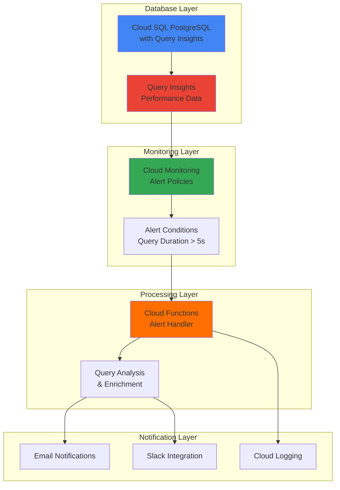

# Automated Query Performance Alerts with Cloud SQL and Functions

## Problem

Database performance degradation often goes unnoticed until it impacts user experience, causing slow response times and potential service outages. Traditional monitoring relies on manual oversight or basic threshold alerts that lack context about specific query patterns and performance trends. Without automated analysis of query execution patterns and intelligent alerting, development teams struggle to identify and resolve database bottlenecks before they affect business operations.

## Solution

Implement an automated monitoring system using Cloud SQL Query Insights, Cloud Monitoring, and Cloud Functions to detect slow database queries and send intelligent alerts. Query Insights captures detailed performance metrics and execution plans, Cloud Monitoring evaluates performance thresholds and triggers alerts, while Cloud Functions processes these alerts to send enriched notifications with actionable insights and automated remediation suggestions.

## Architecture Diagram



## Prerequisites

1. Google Cloud account with billing enabled and appropriate permissions (Cloud SQL Admin, Cloud Functions Developer, Monitoring Admin)
2. Google Cloud CLI installed and configured (version 450.0.0 or later)
3. Basic understanding of SQL databases and query performance concepts
4. Familiarity with serverless functions and monitoring concepts
5. Estimated cost: $20-30 for Cloud SQL Enterprise instance + minimal charges for Cloud Functions and monitoring

> **Note**: This recipe uses Cloud SQL Enterprise edition which includes Query Insights at no additional cost. Enterprise Plus edition offers enhanced AI-powered capabilities and 30-day retention.

## Preparation

```bash
# Set environment variables for GCP resources
export PROJECT_ID="sql-alerts-$(date +%s)"
export REGION="us-central1"
export ZONE="us-central1-a"

# Generate unique suffix for resource names
RANDOM_SUFFIX=$(openssl rand -hex 3)
export INSTANCE_NAME="postgres-db-${RANDOM_SUFFIX}"
export FUNCTION_NAME="query-alert-handler-${RANDOM_SUFFIX}"
export ALERT_POLICY_NAME="slow-query-alerts-${RANDOM_SUFFIX}"

# Set default project and region
gcloud config set project ${PROJECT_ID}
gcloud config set compute/region ${REGION}
gcloud config set compute/zone ${ZONE}

# Enable required APIs
gcloud services enable sqladmin.googleapis.com
gcloud services enable cloudfunctions.googleapis.com
gcloud services enable monitoring.googleapis.com
gcloud services enable logging.googleapis.com
gcloud services enable cloudbuild.googleapis.com

echo "✅ Project configured: ${PROJECT_ID}"
echo "✅ Instance name: ${INSTANCE_NAME}"
echo "✅ Function name: ${FUNCTION_NAME}"
```

## Steps

1. **Create Cloud SQL PostgreSQL Instance with Query Insights**:

   Cloud SQL Query Insights provides comprehensive database performance monitoring by capturing query execution metrics, wait events, and execution plans. Enabling Query Insights during instance creation ensures all query performance data is collected from the start, providing immediate visibility into database operations and establishing the foundation for automated performance monitoring.

   ```bash
   # Create Cloud SQL PostgreSQL instance with Enterprise edition
   gcloud sql instances create ${INSTANCE_NAME} \
       --database-version=POSTGRES_15 \
       --tier=db-custom-2-7680 \
       --region=${REGION} \
       --edition=ENTERPRISE \
       --insights-config-query-insights-enabled \
       --insights-config-query-string-length=4500 \
       --insights-config-record-application-tags \
       --insights-config-record-client-address \
       --storage-size=20GB \
       --storage-type=SSD \
       --enable-bin-log \
       --maintenance-window-day=SAT \
       --maintenance-window-hour=02 \
       --storage-auto-increase
   
   echo "✅ Cloud SQL instance created with Query Insights enabled"
   ```

   The Cloud SQL instance is now running with Query Insights collecting detailed performance metrics. The Enterprise edition provides advanced monitoring capabilities including query execution plans, wait event analysis, and application-level tagging for comprehensive performance visibility.

2. **Configure Database User and Sample Database**:

   Setting up a dedicated monitoring user with appropriate permissions ensures secure access for performance monitoring while maintaining principle of least privilege. Creating a sample database with test data provides a realistic environment for demonstrating query performance monitoring and alert generation.

   ```bash
   # Set root password for Cloud SQL instance
   export DB_PASSWORD="SecurePassword123!"
   gcloud sql users set-password postgres \
       --instance=${INSTANCE_NAME} \
       --password=${DB_PASSWORD}
   
   # Create application user for monitoring
   gcloud sql users create monitor_user \
       --instance=${INSTANCE_NAME} \
       --password="MonitorPass456!"
   
   # Get instance connection name for later use
   export CONNECTION_NAME=$(gcloud sql instances describe ${INSTANCE_NAME} \
       --format="value(connectionName)")
   
   echo "✅ Database users configured"
   echo "Connection name: ${CONNECTION_NAME}"
   ```

   Database users are now configured with appropriate access levels. The monitoring user provides secure access for performance analysis while the root user maintains administrative capabilities for database management.

3. **Create Sample Database Schema and Load Test Data**:

   Creating realistic sample data provides a foundation for testing query performance monitoring. The schema includes tables with foreign key relationships and sufficient data volume to generate meaningful performance metrics when slow queries are executed.

   ```bash
   # Create sample database and schema
   gcloud sql databases create performance_test \
       --instance=${INSTANCE_NAME}
   
   # Create temporary SQL script for sample data
   cat > /tmp/sample_data.sql << 'EOF'
   -- Create sample tables for performance testing
   CREATE TABLE users (
       id SERIAL PRIMARY KEY,
       username VARCHAR(50) UNIQUE NOT NULL,
       email VARCHAR(100) NOT NULL,
       created_at TIMESTAMP DEFAULT CURRENT_TIMESTAMP,
       last_login TIMESTAMP
   );
   
   CREATE TABLE orders (
       id SERIAL PRIMARY KEY,
       user_id INTEGER REFERENCES users(id),
       product_name VARCHAR(100) NOT NULL,
       amount DECIMAL(10,2) NOT NULL,
       order_date TIMESTAMP DEFAULT CURRENT_TIMESTAMP
   );
   
   -- Insert sample data
   INSERT INTO users (username, email, created_at) 
   SELECT 
       'user' || generate_series,
       'user' || generate_series || '@example.com',
       CURRENT_TIMESTAMP - (random() * interval '365 days')
   FROM generate_series(1, 10000);
   
   INSERT INTO orders (user_id, product_name, amount, order_date)
   SELECT 
       (random() * 9999 + 1)::INTEGER,
       'Product ' || (random() * 100 + 1)::INTEGER,
       (random() * 1000 + 10)::DECIMAL(10,2),
       CURRENT_TIMESTAMP - (random() * interval '90 days')
   FROM generate_series(1, 50000);
   
   -- Create intentionally slow query for testing alerts
   CREATE OR REPLACE FUNCTION slow_query_test() 
   RETURNS TABLE(user_count INTEGER) AS $$
   BEGIN
       RETURN QUERY
       SELECT COUNT(*)::INTEGER 
       FROM users u 
       CROSS JOIN orders o 
       WHERE u.id = o.user_id 
       AND u.created_at > CURRENT_DATE - interval '30 days';
   END;
   $$ LANGUAGE plpgsql;
   EOF
   
   # Create temporary Cloud Storage bucket for SQL import
   export TEMP_BUCKET="temp-sql-import-${RANDOM_SUFFIX}"
   gsutil mb gs://${TEMP_BUCKET}
   
   # Upload SQL script to Cloud Storage
   gsutil cp /tmp/sample_data.sql gs://${TEMP_BUCKET}/
   
   # Import SQL script to Cloud SQL
   gcloud sql import sql ${INSTANCE_NAME} \
       gs://${TEMP_BUCKET}/sample_data.sql \
       --database=performance_test
   
   # Clean up temporary bucket
   gsutil rm -r gs://${TEMP_BUCKET}
   
   echo "✅ Sample database schema and data created"
   ```

   Sample database schema is now populated with realistic data structures and volume that will generate meaningful performance metrics when queries are executed against it.

4. **Create Cloud Function for Alert Processing**:

   Cloud Functions provides serverless alert processing that automatically scales based on monitoring events. The function enriches basic monitoring alerts with query context, performance analysis, and actionable recommendations. This automated approach ensures consistent alert handling while providing development teams with detailed context for faster issue resolution.

   ```bash
   # Create directory for Cloud Function code
   mkdir -p /tmp/query-alert-function
   cd /tmp/query-alert-function
   
   # Create requirements.txt for Python dependencies
   cat > requirements.txt << 'EOF'
   google-cloud-monitoring==2.20.0
   google-cloud-sql==3.8.0
   google-cloud-logging==3.8.0
   google-auth==2.23.4
   requests==2.31.0
   functions-framework==3.5.0
   EOF
   
   # Create main.py with alert processing logic
   cat > main.py << 'EOF'
   import json
   import logging
   from datetime import datetime, timezone
   from google.cloud import monitoring_v3
   from google.cloud import logging as cloud_logging
   import functions_framework
   
   # Configure logging
   cloud_logging.Client().setup_logging()
   
   @functions_framework.http
   def process_query_alert(request):
       """Process Cloud Monitoring alert for slow queries"""
       try:
           # Parse alert payload
           alert_data = request.get_json()
           if not alert_data:
               return "No alert data received", 400
           
           # Extract alert details
           incident = alert_data.get('incident', {})
           condition_name = incident.get('condition_name', 'Unknown')
           policy_name = incident.get('policy_name', 'Unknown')
           state = incident.get('state', 'UNKNOWN')
           
           # Log alert processing
           logging.info(f"Processing alert: {condition_name}, State: {state}")
           
           # Create enriched alert message
           alert_message = create_enriched_alert(incident, alert_data)
           
           # Send notifications
           send_alert_notification(alert_message, state)
           
           return f"Alert processed successfully: {condition_name}", 200
           
       except Exception as e:
           logging.error(f"Error processing alert: {str(e)}")
           return f"Error processing alert: {str(e)}", 500
   
   def create_enriched_alert(incident, alert_data):
       """Create enriched alert message with query insights"""
       timestamp = datetime.now(timezone.utc).isoformat()
       
       message = {
           "timestamp": timestamp,
           "alert_type": "Database Query Performance",
           "severity": determine_severity(incident),
           "condition": incident.get('condition_name', 'Unknown'),
           "state": incident.get('state', 'UNKNOWN'),
           "summary": incident.get('summary', 'Query performance threshold exceeded'),
           "recommendations": generate_recommendations(incident),
           "resource_name": incident.get('resource_name', 'Unknown'),
           "documentation": "https://cloud.google.com/sql/docs/postgres/using-query-insights"
       }
       
       return message
   
   def determine_severity(incident):
       """Determine alert severity based on incident data"""
       # Implement severity logic based on threshold values
       condition_name = incident.get('condition_name', '').lower()
       
       if 'critical' in condition_name or 'error' in condition_name:
           return 'CRITICAL'
       elif 'warning' in condition_name:
           return 'WARNING'
       else:
           return 'INFO'
   
   def generate_recommendations(incident):
       """Generate actionable recommendations for query performance"""
       recommendations = [
           "Review Query Insights dashboard for slow query patterns",
           "Check for missing indexes on frequently queried columns", 
           "Analyze query execution plans for optimization opportunities",
           "Consider connection pooling if high connection counts detected",
           "Monitor for lock contention and blocking queries"
       ]
       
       return recommendations
   
   def send_alert_notification(message, state):
       """Send alert notification via multiple channels"""
       try:
           # Log structured alert message
           logging.info(f"QUERY_PERFORMANCE_ALERT: {json.dumps(message)}")
           
           # In production, implement additional notification channels:
           # - Email via SendGrid/Gmail API
           # - Slack via webhook
           # - PagerDuty for critical alerts
           # - SMS via Twilio
           
           if state == 'OPEN':
               logging.warning(f"🚨 ALERT OPENED: {message['summary']}")
           elif state == 'CLOSED':
               logging.info(f"✅ ALERT RESOLVED: {message['summary']}")
           
       except Exception as e:
           logging.error(f"Error sending notification: {str(e)}")
   EOF
   
   # Deploy Cloud Function with 2nd gen runtime
   gcloud functions deploy ${FUNCTION_NAME} \
       --gen2 \
       --runtime python311 \
       --trigger-http \
       --allow-unauthenticated \
       --source . \
       --entry-point process_query_alert \
       --memory 256MB \
       --timeout 60s \
       --region ${REGION}
   
   # Get function URL for webhook configuration
   export FUNCTION_URL=$(gcloud functions describe ${FUNCTION_NAME} \
       --gen2 \
       --region=${REGION} \
       --format="value(serviceConfig.uri)")
   
   echo "✅ Cloud Function deployed successfully"
   echo "Function URL: ${FUNCTION_URL}"
   ```

   The Cloud Function is now deployed and ready to process monitoring alerts. It provides intelligent alert enrichment with actionable recommendations and supports multiple notification channels for comprehensive incident response.

5. **Create Cloud Monitoring Alert Policy**:

   Cloud Monitoring alert policies define the conditions that trigger automated notifications based on Cloud SQL Query Insights metrics. Configuring thresholds for query execution time, query count, and error rates ensures proactive detection of performance issues. The webhook integration with Cloud Functions enables automated alert processing and enrichment.

   ```bash
   # Create notification channel for webhook
   cat > /tmp/notification_channel.json << EOF
   {
     "type": "webhook_tokenauth",
     "displayName": "Query Alert Webhook",
     "description": "Webhook for query performance alerts",
     "labels": {
       "url": "${FUNCTION_URL}"
     },
     "enabled": true
   }
   EOF
   
   # Create notification channel
   NOTIFICATION_CHANNEL=$(gcloud alpha monitoring channels create \
       --channel-content-from-file=/tmp/notification_channel.json \
       --format="value(name)")
   
   # Create alert policy for slow queries
   cat > /tmp/alert_policy.json << EOF
   {
     "displayName": "${ALERT_POLICY_NAME}",
     "documentation": {
       "content": "Alert triggered when database queries exceed performance thresholds. Review Query Insights dashboard for detailed analysis.",
       "mimeType": "text/markdown"
     },
     "conditions": [
       {
         "displayName": "Query execution time > 5 seconds",
         "conditionThreshold": {
           "filter": "resource.type=\"cloudsql_database\" AND metric.type=\"cloudsql.googleapis.com/database/query_insights/execution_time\"",
           "comparison": "COMPARISON_GREATER_THAN",
           "thresholdValue": 5.0,
           "duration": "60s",
           "aggregations": [
             {
               "alignmentPeriod": "60s",
               "perSeriesAligner": "ALIGN_MEAN",
               "crossSeriesReducer": "REDUCE_MEAN",
               "groupByFields": ["resource.label.database_id"]
             }
           ]
         }
       }
     ],
     "notificationChannels": ["${NOTIFICATION_CHANNEL}"],
     "alertStrategy": {
       "autoClose": "1800s"
     },
     "enabled": true
   }
   EOF
   
   # Create alert policy
   gcloud alpha monitoring policies create \
       --policy-from-file=/tmp/alert_policy.json
   
   echo "✅ Monitoring alert policy created"
   echo "Notification channel: ${NOTIFICATION_CHANNEL}"
   ```

   Cloud Monitoring is now configured to automatically detect slow database queries and trigger webhook notifications to the Cloud Function for intelligent alert processing and notification distribution.

6. **Create Test Queries and Trigger Alerts**:

   Creating test queries that intentionally trigger performance thresholds validates the complete monitoring and alerting workflow. These queries simulate real-world performance issues and demonstrate how the system detects, analyzes, and responds to database bottlenecks.

   ```bash
   # Create script to generate slow queries for testing
   cat > /tmp/trigger_slow_queries.sql << 'EOF'
   -- Execute intentionally slow queries to trigger alerts
   
   -- Query 1: Cartesian join without proper WHERE clause
   SELECT COUNT(*) FROM users u, orders o 
   WHERE u.id > 1000 AND o.amount > 100;
   
   -- Query 2: Full table scan with complex aggregation
   SELECT u.username, COUNT(o.id), AVG(o.amount), MAX(o.order_date)
   FROM users u 
   LEFT JOIN orders o ON u.id = o.user_id
   GROUP BY u.username
   ORDER BY AVG(o.amount) DESC;
   
   -- Query 3: Nested subquery without indexes
   SELECT * FROM users WHERE id IN (
       SELECT user_id FROM orders WHERE amount > (
           SELECT AVG(amount) * 2 FROM orders 
           WHERE order_date > CURRENT_DATE - interval '7 days'
       )
   );
   
   -- Query 4: Use the slow function we created
   SELECT * FROM slow_query_test();
   EOF
   
   # Create script to connect and execute test queries
   cat > /tmp/execute_test_queries.sh << 'EOF'
   #!/bin/bash
   echo "To execute test queries and trigger alerts:"
   echo "1. Connect to your Cloud SQL instance using Cloud SQL Proxy or psql"
   echo "2. Execute the queries in /tmp/trigger_slow_queries.sql"
   echo "3. Monitor Cloud Functions logs for alert processing"
   echo ""
   echo "Connection command example:"
   echo "gcloud sql connect ${INSTANCE_NAME} --user=postgres --database=performance_test"
   EOF
   
   chmod +x /tmp/execute_test_queries.sh
   
   echo "✅ Test queries prepared"
   echo "Execute queries manually via Cloud SQL client to trigger alerts"
   echo "Monitor Cloud Functions logs to see alert processing"
   ```

   Test queries are prepared to simulate performance issues that will trigger the monitoring alerts and demonstrate the complete alert processing workflow.

## Validation & Testing

1. **Verify Cloud SQL Query Insights is collecting data**:

   ```bash
   # Check Cloud SQL instance status and Query Insights
   gcloud sql instances describe ${INSTANCE_NAME} \
       --format="table(name,state,settings.insightsConfig)"
   
   # Verify Query Insights is enabled
   gcloud sql instances describe ${INSTANCE_NAME} \
       --format="value(settings.insightsConfig.queryInsightsEnabled)"
   ```

   Expected output: `True` indicating Query Insights is actively collecting performance data.

2. **Test Cloud Function alert processing**:

   ```bash
   # Test Cloud Function with sample alert payload
   curl -X POST ${FUNCTION_URL} \
       -H "Content-Type: application/json" \
       -d '{
         "incident": {
           "condition_name": "Query execution time > 5 seconds",
           "policy_name": "slow-query-alerts",
           "state": "OPEN",
           "summary": "Database query performance threshold exceeded",
           "resource_name": "'${INSTANCE_NAME}'"
         }
       }'
   
   # Check function logs
   gcloud functions logs read ${FUNCTION_NAME} \
       --gen2 \
       --region=${REGION} \
       --limit=10
   ```

   Expected output: Function should return 200 status and process the alert successfully with structured logging output.

3. **Verify monitoring alert policy configuration**:

   ```bash
   # List alert policies
   gcloud alpha monitoring policies list \
       --filter="displayName:${ALERT_POLICY_NAME}" \
       --format="table(displayName,enabled,conditions[].displayName)"
   
   # Check notification channels
   gcloud alpha monitoring channels list \
       --filter="displayName:'Query Alert Webhook'" \
       --format="table(displayName,enabled,labels.url)"
   ```

   Expected output: Alert policy should be listed as enabled with correct condition and notification channel configured.

4. **Monitor Query Insights dashboard**:

   ```bash
   echo "🔗 Access Query Insights dashboard:"
   echo "https://console.cloud.google.com/sql/instances/${INSTANCE_NAME}/insights?project=${PROJECT_ID}"
   
   echo "🔗 View Cloud Monitoring dashboard:"
   echo "https://console.cloud.google.com/monitoring/alerting/policies?project=${PROJECT_ID}"
   
   echo "Execute slow queries against the database to see alerts in action"
   ```

## Cleanup

1. **Delete Cloud Monitoring alert policy and notification channel**:

   ```bash
   # Delete alert policy
   gcloud alpha monitoring policies list \
       --filter="displayName:${ALERT_POLICY_NAME}" \
       --format="value(name)" | \
   xargs -I {} gcloud alpha monitoring policies delete {} --quiet
   
   # Delete notification channel
   gcloud alpha monitoring channels delete ${NOTIFICATION_CHANNEL} --quiet
   
   echo "✅ Monitoring resources deleted"
   ```

2. **Remove Cloud Function**:

   ```bash
   # Delete Cloud Function
   gcloud functions delete ${FUNCTION_NAME} \
       --gen2 \
       --region=${REGION} \
       --quiet
   
   echo "✅ Cloud Function deleted"
   ```

3. **Delete Cloud SQL instance**:

   ```bash
   # Delete Cloud SQL instance (includes automatic backup deletion)
   gcloud sql instances delete ${INSTANCE_NAME} --quiet
   
   echo "✅ Cloud SQL instance deleted"
   ```

4. **Clean up temporary files and project resources**:

   ```bash
   # Remove temporary files
   rm -rf /tmp/query-alert-function
   rm -f /tmp/sample_data.sql
   rm -f /tmp/trigger_slow_queries.sql
   rm -f /tmp/execute_test_queries.sh
   rm -f /tmp/alert_policy.json
   rm -f /tmp/notification_channel.json
   
   # Optionally delete project if created specifically for this recipe
   # gcloud projects delete ${PROJECT_ID} --quiet
   
   echo "✅ Cleanup completed successfully"
   echo "Note: Project deletion may take several minutes if executed"
   ```

## Discussion

Cloud SQL Query Insights provides comprehensive database performance monitoring that goes beyond basic metrics to offer actionable intelligence about query execution patterns, wait events, and performance bottlenecks. This solution demonstrates how to leverage Query Insights with Cloud Monitoring and Cloud Functions to create an automated alert system that not only detects performance issues but also provides enriched context for faster resolution. The integration follows Google Cloud's [observability best practices](https://cloud.google.com/architecture/devops/devops-measurement-monitoring-and-observability) for building resilient monitoring systems.

The architecture follows Google Cloud's observability best practices by integrating multiple monitoring and alerting services into a cohesive system. Query Insights captures detailed execution metrics and query plans, Cloud Monitoring evaluates these metrics against configurable thresholds, and Cloud Functions provide intelligent alert processing with enrichment capabilities. This approach enables proactive database performance management while reducing manual monitoring overhead and following the [Google Cloud Architecture Framework](https://cloud.google.com/architecture/framework) principles.

The serverless nature of Cloud Functions ensures cost-effective alert processing that automatically scales with monitoring volume. The webhook integration pattern allows for flexible notification routing and custom alert enrichment logic. Organizations can extend this foundation to include additional notification channels such as Slack, PagerDuty, or custom ticketing systems based on their operational requirements. Cloud Functions 2nd generation provides improved performance and scaling characteristics for production workloads.

Performance monitoring becomes increasingly critical as database workloads grow in complexity and scale. This automated approach enables development teams to identify and resolve query performance issues before they impact user experience. The Query Insights integration provides specific recommendations for query optimization, index creation, and performance tuning based on actual execution patterns and database statistics, following Google Cloud's [database performance optimization guidelines](https://cloud.google.com/sql/docs/postgres/optimize-performance).

> **Tip**: Enable Query Insights on all Cloud SQL instances to establish baseline performance metrics and identify optimization opportunities across your database infrastructure. Use Cloud Monitoring workspaces to centralize monitoring across multiple projects.

## Challenge

Extend this solution by implementing these enhancements:

1. **Advanced Query Analysis**: Integrate with BigQuery to store historical query performance data and identify long-term trends using SQL analytics and machine learning models with [Vertex AI](https://cloud.google.com/vertex-ai) for predictive performance insights.

2. **Automated Remediation**: Enhance the Cloud Function to automatically apply common performance optimizations such as query plan analysis, index recommendations, and connection pool adjustments based on Query Insights data and [Cloud SQL recommendations](https://cloud.google.com/sql/docs/postgres/recommendations).

3. **Multi-Instance Monitoring**: Scale the solution to monitor multiple Cloud SQL instances across different projects and regions with centralized alerting and performance dashboards using [Cloud Monitoring workspaces](https://cloud.google.com/monitoring/workspaces).

4. **Integration with CI/CD**: Connect query performance monitoring with [Cloud Build](https://cloud.google.com/build) deployment pipelines to automatically test database performance impact of new application releases and prevent performance regressions.

5. **Cost Optimization Alerts**: Add monitoring for database cost metrics and resource utilization to automatically alert on cost anomalies and recommend rightsizing opportunities based on actual usage patterns using [Cloud Billing APIs](https://cloud.google.com/billing/docs).

## Infrastructure Code

### Available Infrastructure as Code:

- [Infrastructure Code Overview](code/README.md) - Detailed description of all infrastructure components
- [Infrastructure Manager](code/infrastructure-manager/) - GCP Infrastructure Manager templates
- [Bash CLI Scripts](code/scripts/) - Example bash scripts using gcloud CLI commands to deploy infrastructure
- [Terraform](code/terraform/) - Terraform configuration files