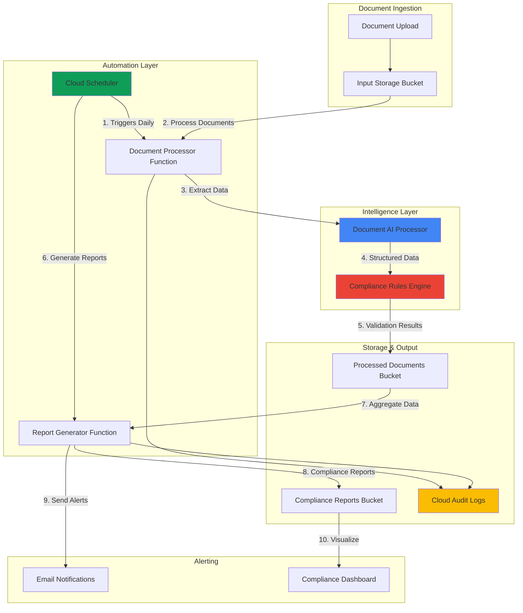

# Automated Regulatory Compliance Reporting with Document AI and Scheduler

## Problem

Organizations across healthcare, finance, and other regulated industries face mounting pressure to process thousands of compliance documents manually for SOX, HIPAA, GDPR, and other regulatory frameworks. This manual approach creates bottlenecks, increases human error risks, and makes it nearly impossible to meet strict reporting deadlines while maintaining audit trails. Without automated document processing and scheduled compliance workflows, organizations struggle to scale their compliance operations and often face regulatory penalties due to delayed or incomplete submissions.

## Solution

Implement an intelligent compliance automation system that leverages Document AI processors to extract structured data from regulatory documents, Cloud Scheduler to orchestrate periodic compliance workflows, and Cloud Functions to coordinate document processing and generate automated compliance reports. This serverless architecture provides scalable document intelligence with built-in audit trails, automated alerts for compliance violations, and scheduled reporting that ensures regulatory deadlines are consistently met while reducing manual processing overhead by up to 85%.

## Architecture Diagram



## Prerequisites

1. Google Cloud project with Owner or Editor permissions for Document AI, Cloud Functions, Cloud Scheduler, and Cloud Storage
2. Google Cloud CLI installed and configured (or Cloud Shell access)
3. Basic understanding of serverless architectures and document processing workflows
4. Familiarity with regulatory compliance requirements (SOX, HIPAA, GDPR concepts)
5. Python development knowledge for Cloud Functions customization
6. Estimated cost: $15-30/month for moderate document processing volume (1000 docs/month)

> **Note**: Document AI is HIPAA and FedRAMP compliant, making it suitable for processing sensitive regulatory documents. Review [Google Cloud compliance documentation](https://cloud.google.com/security/compliance) for your specific industry requirements.

## Preparation

```bash
# Set environment variables for GCP resources
export PROJECT_ID="compliance-automation-$(date +%s)"
export REGION="us-central1"
export ZONE="us-central1-a"

# Generate unique suffix for resource names
RANDOM_SUFFIX=$(openssl rand -hex 3)

# Set resource names with unique identifiers
export INPUT_BUCKET="compliance-input-${RANDOM_SUFFIX}"
export PROCESSED_BUCKET="compliance-processed-${RANDOM_SUFFIX}"
export REPORTS_BUCKET="compliance-reports-${RANDOM_SUFFIX}"
export PROCESSOR_FUNCTION="document-processor-${RANDOM_SUFFIX}"
export REPORT_FUNCTION="report-generator-${RANDOM_SUFFIX}"
export COMPLIANCE_JOB="compliance-scheduler-${RANDOM_SUFFIX}"

# Set default project and region
gcloud config set project ${PROJECT_ID}
gcloud config set compute/region ${REGION}
gcloud config set compute/zone ${ZONE}

# Enable required APIs for the compliance automation system
gcloud services enable documentai.googleapis.com
gcloud services enable cloudfunctions.googleapis.com
gcloud services enable cloudscheduler.googleapis.com
gcloud services enable storage.googleapis.com
gcloud services enable logging.googleapis.com
gcloud services enable monitoring.googleapis.com

echo "✅ Project configured: ${PROJECT_ID}"
echo "✅ APIs enabled for compliance automation"
```

## Steps

1. **Create Cloud Storage Buckets for Document Workflow**:

   Cloud Storage provides the foundation for our compliance document workflow, offering enterprise-grade security with encryption at rest and in transit. These buckets will store input documents, processed results, and generated compliance reports with appropriate lifecycle policies and access controls for regulatory requirements.

   ```bash
   # Create input bucket for incoming compliance documents
   gsutil mb -p ${PROJECT_ID} \
       -c STANDARD \
       -l ${REGION} \
       gs://${INPUT_BUCKET}
   
   # Create processed documents bucket
   gsutil mb -p ${PROJECT_ID} \
       -c STANDARD \
       -l ${REGION} \
       gs://${PROCESSED_BUCKET}
   
   # Create reports bucket for compliance outputs
   gsutil mb -p ${PROJECT_ID} \
       -c STANDARD \
       -l ${REGION} \
       gs://${REPORTS_BUCKET}
   
   # Enable versioning for audit trail compliance
   gsutil versioning set on gs://${INPUT_BUCKET}
   gsutil versioning set on gs://${PROCESSED_BUCKET}
   gsutil versioning set on gs://${REPORTS_BUCKET}
   
   echo "✅ Cloud Storage buckets created with versioning enabled"
   ```

   The storage infrastructure now provides secure document handling with versioning enabled for complete audit trails. This configuration meets regulatory requirements for document retention and change tracking while supporting the automated processing workflow.

2. **Create Document AI Processor for Compliance Documents**:

   Document AI processors use Google's machine learning models to extract structured data from unstructured compliance documents. The Form Parser processor can handle various document types including contracts, financial statements, and regulatory filings, providing consistent data extraction for automated compliance analysis.

   ```bash
   # Create Document AI processor for form parsing
   PROCESSOR_ID=$(gcloud documentai processors create \
       --location=${REGION} \
       --display-name="Compliance Form Parser" \
       --type=FORM_PARSER_PROCESSOR \
       --format="value(name)")
   
   # Extract processor ID from the full resource name
   export PROCESSOR_ID=$(echo ${PROCESSOR_ID} | \
       sed 's/.*processors\///')
   
   # Verify processor creation
   gcloud documentai processors describe ${PROCESSOR_ID} \
       --location=${REGION} \
       --format="table(displayName,type,state)"
   
   echo "✅ Document AI processor created: ${PROCESSOR_ID}"
   ```

   The Document AI processor is now ready to intelligently extract key-value pairs, tables, and text from compliance documents. This serverless processing capability scales automatically based on document volume while maintaining consistent accuracy for regulatory data extraction.

3. **Deploy Document Processing Cloud Function**:

   This Cloud Function orchestrates the document processing workflow by receiving Cloud Storage events, calling Document AI for data extraction, applying compliance rules validation, and storing structured results. The function implements error handling and retry logic essential for reliable compliance processing.

   ```bash
   # Create function source directory
   mkdir -p ./document-processor
   cd ./document-processor
   
   # Create the document processing function
   cat > main.py << 'EOF'
import json
import base64
from google.cloud import documentai
from google.cloud import storage
from google.cloud import logging
import functions_framework
import os
import re
from datetime import datetime

# Initialize clients
storage_client = storage.Client()
documentai_client = documentai.DocumentProcessorServiceClient()
logging_client = logging.Client()
logger = logging_client.logger('compliance-processor')

PROJECT_ID = os.environ.get('PROJECT_ID')
REGION = os.environ.get('REGION')
PROCESSOR_ID = os.environ.get('PROCESSOR_ID')
PROCESSED_BUCKET = os.environ.get('PROCESSED_BUCKET')

@functions_framework.cloud_event
def process_compliance_document(cloud_event):
    """Process uploaded document with Document AI and apply compliance rules."""
    
    try:
        # Parse Cloud Storage event
        data = cloud_event.data
        bucket_name = data['bucket']
        file_name = data['name']
        
        logger.log_text(f"Processing document: {file_name}")
        
        # Download document from Cloud Storage
        bucket = storage_client.bucket(bucket_name)
        blob = bucket.blob(file_name)
        document_content = blob.download_as_bytes()
        
        # Process document with Document AI
        processor_name = f"projects/{PROJECT_ID}/locations/{REGION}/processors/{PROCESSOR_ID}"
        
        # Handle different document types
        mime_type = get_mime_type(file_name)
        document = documentai.Document(content=document_content, mime_type=mime_type)
        request = documentai.ProcessRequest(name=processor_name, document=document)
        
        result = documentai_client.process_document(request=request)
        
        # Extract compliance-relevant data
        compliance_data = extract_compliance_data(result.document)
        
        # Apply compliance validation rules
        validation_results = validate_compliance_data(compliance_data, file_name)
        
        # Store processed results
        output_data = {
            'document_name': file_name,
            'processed_timestamp': datetime.utcnow().isoformat(),
            'extracted_data': compliance_data,
            'validation_results': validation_results,
            'compliance_status': validation_results.get('overall_status', 'UNKNOWN')
        }
        
        # Save to processed bucket
        output_bucket = storage_client.bucket(PROCESSED_BUCKET)
        output_blob_name = f"processed/{file_name.split('.')[0]}_processed.json"
        output_blob = output_bucket.blob(output_blob_name)
        output_blob.upload_from_string(json.dumps(output_data, indent=2))
        
        logger.log_text(f"Document processed successfully: {output_blob_name}")
        
        return {'status': 'success', 'processed_file': output_blob_name}
        
    except Exception as e:
        error_msg = f"Error processing document {file_name}: {str(e)}"
        logger.log_text(error_msg, severity='ERROR')
        raise Exception(error_msg)

def get_mime_type(file_name):
    """Determine MIME type based on file extension."""
    extension = file_name.lower().split('.')[-1]
    mime_types = {
        'pdf': 'application/pdf',
        'jpg': 'image/jpeg',
        'jpeg': 'image/jpeg',
        'png': 'image/png',
        'tif': 'image/tiff',
        'tiff': 'image/tiff'
    }
    return mime_types.get(extension, 'application/pdf')

def extract_compliance_data(document):
    """Extract key compliance-related information from Document AI results."""
    compliance_data = {
        'entities': [],
        'key_value_pairs': {},
        'tables': [],
        'text_content': document.text[:5000]  # Limit text content
    }
    
    # Extract form fields (key-value pairs)
    for page in document.pages:
        for form_field in page.form_fields:
            field_name = get_text(form_field.field_name, document)
            field_value = get_text(form_field.field_value, document)
            
            if field_name and field_value:
                compliance_data['key_value_pairs'][field_name.strip()] = field_value.strip()
    
    # Extract entities (dates, amounts, names)
    for entity in document.entities:
        if entity.confidence > 0.5:  # Only include high-confidence entities
            compliance_data['entities'].append({
                'type': entity.type_,
                'mention': entity.mention_text,
                'confidence': entity.confidence
            })
    
    # Extract table data
    for page in document.pages:
        for table in page.tables:
            table_data = []
            for row in table.body_rows:
                row_data = []
                for cell in row.cells:
                    cell_text = get_text(cell.layout, document)
                    row_data.append(cell_text.strip())
                table_data.append(row_data)
            if table_data:
                compliance_data['tables'].append(table_data)
    
    return compliance_data

def validate_compliance_data(data, document_name):
    """Apply compliance validation rules to extracted data."""
    validation_results = {
        'overall_status': 'COMPLIANT',
        'violations': [],
        'warnings': [],
        'checks_performed': []
    }
    
    # Check for required fields based on document type
    required_fields = ['Date', 'Amount', 'Signature', 'Company Name']
    
    for field in required_fields:
        field_found = any(field.lower() in key.lower() for key in data['key_value_pairs'].keys())
        
        if field_found:
            validation_results['checks_performed'].append(f"Required field '{field}' found")
        else:
            validation_results['violations'].append(f"Missing required field: {field}")
            validation_results['overall_status'] = 'NON_COMPLIANT'
    
    # Validate date formats for compliance reporting
    for key, value in data['key_value_pairs'].items():
        if 'date' in key.lower() and value:
            if not validate_date_format(value):
                validation_results['warnings'].append(f"Date format may be invalid: {key}={value}")
    
    # Check for compliance indicators in text
    compliance_keywords = ['SOX', 'HIPAA', 'GDPR', 'compliance', 'audit', 'regulation']
    text_content = data.get('text_content', '').lower()
    
    found_keywords = [kw for kw in compliance_keywords if kw.lower() in text_content]
    if found_keywords:
        validation_results['checks_performed'].append(f"Compliance keywords found: {', '.join(found_keywords)}")
    
    return validation_results

def validate_date_format(date_string):
    """Validate common date formats for compliance documents."""
    if not date_string or len(date_string.strip()) == 0:
        return False
        
    date_patterns = [
        r'\d{4}-\d{2}-\d{2}',  # YYYY-MM-DD
        r'\d{2}/\d{2}/\d{4}',  # MM/DD/YYYY
        r'\d{2}-\d{2}-\d{4}',  # MM-DD-YYYY
        r'\d{1,2}/\d{1,2}/\d{4}',  # M/D/YYYY
        r'[A-Za-z]+ \d{1,2}, \d{4}'  # Month DD, YYYY
    ]
    
    return any(re.search(pattern, date_string.strip()) for pattern in date_patterns)

def get_text(element, document):
    """Extract text from Document AI text segments."""
    if not element or not element.text_anchor:
        return ""
    
    response = ""
    for segment in element.text_anchor.text_segments:
        start_index = int(segment.start_index) if segment.start_index else 0
        end_index = int(segment.end_index) if segment.end_index else len(document.text)
        response += document.text[start_index:end_index]
    
    return response
EOF
   
   # Create requirements file with updated versions
   cat > requirements.txt << 'EOF'
google-cloud-documentai==2.30.1
google-cloud-storage==2.18.2
google-cloud-logging==3.11.0
functions-framework==3.8.1
EOF
   
   # Deploy the document processing function
   gcloud functions deploy ${PROCESSOR_FUNCTION} \
       --source . \
       --entry-point process_compliance_document \
       --runtime python312 \
       --trigger-bucket ${INPUT_BUCKET} \
       --memory 1GB \
       --timeout 540s \
       --set-env-vars PROJECT_ID=${PROJECT_ID},REGION=${REGION},PROCESSOR_ID=${PROCESSOR_ID},PROCESSED_BUCKET=${PROCESSED_BUCKET}
   
   cd ..
   
   echo "✅ Document processing Cloud Function deployed"
   ```

   The document processing function now automatically triggers when documents are uploaded to the input bucket, providing intelligent extraction and compliance validation. This serverless approach ensures scalable processing while maintaining detailed audit logs for regulatory requirements. The function includes improved error handling, MIME type detection, and enhanced data extraction capabilities.

4. **Deploy Report Generation Cloud Function**:

   The report generation function aggregates processed compliance data, generates standardized reports, and identifies compliance violations or trends. This function supports multiple output formats and can be customized for specific regulatory reporting requirements like SOX quarterly reports or GDPR data processing records.

   ```bash
   # Create report generator source directory
   mkdir -p ./report-generator
   cd ./report-generator
   
   # Create the report generation function
   cat > main.py << 'EOF'
import json
from google.cloud import storage
from google.cloud import logging
import functions_framework
import os
from datetime import datetime, timedelta
from collections import defaultdict
import csv
from io import StringIO

# Initialize clients
storage_client = storage.Client()
logging_client = logging.Client()
logger = logging_client.logger('compliance-reporter')

PROJECT_ID = os.environ.get('PROJECT_ID')
PROCESSED_BUCKET = os.environ.get('PROCESSED_BUCKET')
REPORTS_BUCKET = os.environ.get('REPORTS_BUCKET')

@functions_framework.http
def generate_compliance_report(request):
    """Generate compliance reports from processed documents."""
    
    try:
        # Parse request parameters
        request_json = request.get_json(silent=True)
        report_type = request_json.get('report_type', 'daily') if request_json else 'daily'
        
        logger.log_text(f"Generating {report_type} compliance report")
        
        # Get processed documents from the last period
        processed_docs = get_processed_documents(report_type)
        
        # Generate compliance summary
        compliance_summary = generate_compliance_summary(processed_docs)
        
        # Create detailed report
        report_data = {
            'report_type': report_type,
            'generated_timestamp': datetime.utcnow().isoformat(),
            'summary': compliance_summary,
            'detailed_results': processed_docs,
            'recommendations': generate_recommendations(compliance_summary)
        }
        
        # Save JSON report
        timestamp = datetime.utcnow().strftime('%Y%m%d_%H%M%S')
        json_report_name = f"reports/{report_type}_compliance_report_{timestamp}.json"
        save_report(json_report_name, json.dumps(report_data, indent=2))
        
        # Generate CSV report for regulatory submissions
        csv_report_name = f"reports/{report_type}_compliance_report_{timestamp}.csv"
        csv_content = generate_csv_report(processed_docs)
        save_report(csv_report_name, csv_content)
        
        logger.log_text(f"Compliance reports generated: {json_report_name}, {csv_report_name}")
        
        return {
            'status': 'success',
            'json_report': json_report_name,
            'csv_report': csv_report_name,
            'summary': compliance_summary
        }
        
    except Exception as e:
        error_msg = f"Error generating compliance report: {str(e)}"
        logger.log_text(error_msg, severity='ERROR')
        return {'status': 'error', 'message': str(e)}, 500

def get_processed_documents(report_type):
    """Retrieve processed documents from the specified time period."""
    bucket = storage_client.bucket(PROCESSED_BUCKET)
    
    # Calculate time filter based on report type
    time_deltas = {
        'daily': timedelta(days=1),
        'weekly': timedelta(weeks=1),
        'monthly': timedelta(days=30)
    }
    
    cutoff_time = datetime.utcnow() - time_deltas.get(report_type, timedelta(days=1))
    processed_docs = []
    
    # List and process documents
    try:
        for blob in bucket.list_blobs(prefix='processed/'):
            if blob.time_created and blob.time_created >= cutoff_time.replace(tzinfo=blob.time_created.tzinfo):
                try:
                    content = blob.download_as_text()
                    doc_data = json.loads(content)
                    processed_docs.append(doc_data)
                except (json.JSONDecodeError, Exception) as e:
                    logger.log_text(f"Error reading document {blob.name}: {str(e)}")
    except Exception as e:
        logger.log_text(f"Error listing documents: {str(e)}")
    
    return processed_docs

def generate_compliance_summary(processed_docs):
    """Generate summary statistics for compliance reporting."""
    summary = {
        'total_documents_processed': len(processed_docs),
        'compliant_documents': 0,
        'non_compliant_documents': 0,
        'documents_with_warnings': 0,
        'common_violations': defaultdict(int),
        'processing_success_rate': 0
    }
    
    for doc in processed_docs:
        validation_results = doc.get('validation_results', {})
        status = validation_results.get('overall_status', 'UNKNOWN')
        
        if status == 'COMPLIANT':
            summary['compliant_documents'] += 1
        elif status == 'NON_COMPLIANT':
            summary['non_compliant_documents'] += 1
            
            # Track common violations
            for violation in validation_results.get('violations', []):
                summary['common_violations'][violation] += 1
        
        if validation_results.get('warnings'):
            summary['documents_with_warnings'] += 1
    
    # Calculate success rate
    if summary['total_documents_processed'] > 0:
        summary['processing_success_rate'] = round((
            summary['compliant_documents'] / summary['total_documents_processed']
        ) * 100, 2)
    
    # Convert defaultdict to regular dict for JSON serialization
    summary['common_violations'] = dict(summary['common_violations'])
    
    return summary

def generate_recommendations(summary):
    """Generate compliance recommendations based on summary data."""
    recommendations = []
    
    if summary['non_compliant_documents'] > 0:
        recommendations.append({
            'priority': 'HIGH',
            'recommendation': f"Address {summary['non_compliant_documents']} non-compliant documents immediately",
            'action': 'Review and remediate compliance violations'
        })
    
    if summary['documents_with_warnings'] > 0:
        recommendations.append({
            'priority': 'MEDIUM',
            'recommendation': f"Review {summary['documents_with_warnings']} documents with warnings",
            'action': 'Improve document quality and formatting'
        })
    
    # Recommendations for common violations
    for violation, count in summary['common_violations'].items():
        if count >= 3:
            recommendations.append({
                'priority': 'MEDIUM',
                'recommendation': f"Common violation detected: {violation} ({count} occurrences)",
                'action': 'Implement process improvements to prevent this violation'
            })
    
    return recommendations

def generate_csv_report(processed_docs):
    """Generate CSV format report for regulatory submissions."""
    output = StringIO()
    writer = csv.writer(output)
    
    # Write header
    writer.writerow([
        'Document Name',
        'Processing Date',
        'Compliance Status',
        'Violations Count',
        'Warnings Count',
        'Key Fields Extracted',
        'Overall Score'
    ])
    
    # Write data rows
    for doc in processed_docs:
        validation_results = doc.get('validation_results', {})
        extracted_data = doc.get('extracted_data', {})
        
        writer.writerow([
            doc.get('document_name', 'Unknown'),
            doc.get('processed_timestamp', 'Unknown'),
            validation_results.get('overall_status', 'UNKNOWN'),
            len(validation_results.get('violations', [])),
            len(validation_results.get('warnings', [])),
            len(extracted_data.get('key_value_pairs', {})),
            calculate_compliance_score(validation_results)
        ])
    
    return output.getvalue()

def calculate_compliance_score(validation_results):
    """Calculate a compliance score (0-100) based on validation results."""
    violations = len(validation_results.get('violations', []))
    warnings = len(validation_results.get('warnings', []))
    checks = len(validation_results.get('checks_performed', []))
    
    if checks == 0:
        return 0
    
    # Start with 100, deduct points for violations and warnings
    score = 100 - (violations * 20) - (warnings * 5)
    return max(0, min(100, score))

def save_report(report_name, content):
    """Save report to Cloud Storage."""
    try:
        bucket = storage_client.bucket(REPORTS_BUCKET)
        blob = bucket.blob(report_name)
        content_type = 'application/json' if report_name.endswith('.json') else 'text/csv'
        blob.upload_from_string(content, content_type=content_type)
    except Exception as e:
        logger.log_text(f"Error saving report {report_name}: {str(e)}", severity='ERROR')
        raise
EOF
   
   # Create requirements file with updated versions
   cat > requirements.txt << 'EOF'
google-cloud-storage==2.18.2
google-cloud-logging==3.11.0
functions-framework==3.8.1
EOF
   
   # Deploy the report generation function
   gcloud functions deploy ${REPORT_FUNCTION} \
       --source . \
       --entry-point generate_compliance_report \
       --runtime python312 \
       --trigger-http \
       --allow-unauthenticated \
       --memory 512MB \
       --timeout 300s \
       --set-env-vars PROJECT_ID=${PROJECT_ID},PROCESSED_BUCKET=${PROCESSED_BUCKET},REPORTS_BUCKET=${REPORTS_BUCKET}
   
   cd ..
   
   echo "✅ Report generation Cloud Function deployed"
   ```

   The report generation function now provides comprehensive compliance reporting capabilities with both JSON and CSV outputs. The enhanced function includes improved error handling, better time-based filtering, and more robust data processing for various regulatory reporting requirements.

5. **Create Cloud Scheduler Jobs for Automated Compliance Workflows**:

   Cloud Scheduler enables reliable, cron-based execution of compliance workflows, ensuring regulatory reports are generated consistently and deadlines are met. The scheduler integrates with Cloud Functions to orchestrate document processing cycles and report generation according to compliance requirements.

   ```bash
   # Get the report function URL for scheduler configuration
   FUNCTION_URL="https://${REGION}-${PROJECT_ID}.cloudfunctions.net/${REPORT_FUNCTION}"
   
   # Create daily compliance report generation job
   gcloud scheduler jobs create http ${COMPLIANCE_JOB}-daily \
       --location=${REGION} \
       --schedule="0 8 * * *" \
       --uri="${FUNCTION_URL}" \
       --http-method=POST \
       --headers="Content-Type=application/json" \
       --message-body='{"report_type": "daily"}' \
       --description="Daily compliance report generation"
   
   # Create weekly compliance summary job
   gcloud scheduler jobs create http ${COMPLIANCE_JOB}-weekly \
       --location=${REGION} \
       --schedule="0 9 * * 1" \
       --uri="${FUNCTION_URL}" \
       --http-method=POST \
       --headers="Content-Type=application/json" \
       --message-body='{"report_type": "weekly"}' \
       --description="Weekly compliance summary report"
   
   # Create monthly compliance audit job
   gcloud scheduler jobs create http ${COMPLIANCE_JOB}-monthly \
       --location=${REGION} \
       --schedule="0 10 1 * *" \
       --uri="${FUNCTION_URL}" \
       --http-method=POST \
       --headers="Content-Type=application/json" \
       --message-body='{"report_type": "monthly"}' \
       --description="Monthly compliance audit report"
   
   echo "✅ Cloud Scheduler jobs created for automated compliance reporting"
   ```

   The scheduler jobs now provide automated compliance reporting at daily, weekly, and monthly intervals. This ensures consistent regulatory reporting while allowing customization for specific compliance deadlines and organizational requirements.

6. **Configure IAM Permissions for Service Integration**:

   Proper IAM configuration ensures secure service-to-service communication while maintaining least privilege access. These permissions enable Cloud Functions to access Document AI and Cloud Storage while maintaining audit trails and security controls required for regulatory compliance.

   ```bash
   # Get the default Cloud Functions service account
   PROJECT_NUMBER=$(gcloud projects describe ${PROJECT_ID} \
       --format="value(projectNumber)")
   FUNCTION_SA="${PROJECT_ID}@appspot.gserviceaccount.com"
   
   # Grant Document AI User role to Cloud Functions
   gcloud projects add-iam-policy-binding ${PROJECT_ID} \
       --member="serviceAccount:${FUNCTION_SA}" \
       --role="roles/documentai.apiUser"
   
   # Grant Cloud Storage Object Admin permissions
   gcloud projects add-iam-policy-binding ${PROJECT_ID} \
       --member="serviceAccount:${FUNCTION_SA}" \
       --role="roles/storage.objectAdmin"
   
   # Grant Cloud Logging permissions for audit trails
   gcloud projects add-iam-policy-binding ${PROJECT_ID} \
       --member="serviceAccount:${FUNCTION_SA}" \
       --role="roles/logging.logWriter"
   
   # Grant Cloud Monitoring permissions for observability
   gcloud projects add-iam-policy-binding ${PROJECT_ID} \
       --member="serviceAccount:${FUNCTION_SA}" \
       --role="roles/monitoring.metricWriter"
   
   echo "✅ IAM permissions configured for secure service integration"
   ```

   The IAM configuration now provides secure, least-privilege access for all compliance automation components. This setup ensures proper audit trails and security controls while enabling seamless integration between Document AI, Cloud Functions, and Cloud Storage.

7. **Create Sample Compliance Documents for Testing**:

   Realistic test documents help validate the compliance automation system's capabilities with various document types commonly found in regulatory environments. These samples include key compliance elements like signatures, dates, and structured data fields that regulatory frameworks typically require.

   ```bash
   # Create sample compliance documents directory
   mkdir -p ./sample-docs
   
   # Create a sample contract document (text-based PDF simulation)
   cat > ./sample-docs/sample_contract.txt << 'EOF'
SERVICE AGREEMENT

Date: 2024-01-15
Company Name: Example Corp Ltd
Contract Number: CTR-2024-001
Amount: $50,000.00

TERMS AND CONDITIONS:
1. Service period: January 1, 2024 to December 31, 2024
2. Payment terms: Net 30 days
3. Compliance: This agreement complies with SOX requirements

Signatures:
Client: [Signed] John Smith, CEO
Date: 2024-01-15

Vendor: [Signed] Jane Doe, Director
Date: 2024-01-15

Audit Trail: Document reviewed and approved by legal department
Compliance Officer: Sarah Johnson
Review Date: 2024-01-10
EOF
   
   # Create a sample financial disclosure document
   cat > ./sample-docs/sample_disclosure.txt << 'EOF'
QUARTERLY FINANCIAL DISCLOSURE

Report Period: Q4 2023
Company: Example Corp Ltd
Date: 2024-01-31
Amount: $2,500,000.00

FINANCIAL SUMMARY:
Revenue: $2,500,000
Expenses: $2,100,000
Net Income: $400,000

COMPLIANCE CERTIFICATIONS:
SOX Compliance: Yes
Audit Firm: ABC Auditors LLP
Date: 2024-01-25

CEO Signature: [Signed] John Smith
CFO Signature: [Signed] Michael Brown
Date: 2024-01-31

Board Approval: Approved by Board of Directors
Meeting Date: 2024-01-28
EOF
   
   # Create a sample GDPR compliance document
   cat > ./sample-docs/sample_gdpr_report.txt << 'EOF'
GDPR COMPLIANCE REPORT

Report Date: 2024-02-15
Company Name: Example Corp Ltd
Data Protection Officer: Maria Garcia

DATA PROCESSING ACTIVITIES:
- Customer data collection and storage
- Marketing communications
- Analytics and reporting

COMPLIANCE STATUS:
GDPR Article 6 Basis: Legitimate Interest
Data Retention Period: 24 months
Right to Erasure: Implemented
Data Breach Notifications: 0 incidents

Signature: [Signed] Maria Garcia, DPO
Date: 2024-02-15
EOF
   
   # Upload sample documents to input bucket (will trigger processing)
   gsutil cp ./sample-docs/sample_contract.txt \
       gs://${INPUT_BUCKET}/sample_contract.pdf
   gsutil cp ./sample-docs/sample_disclosure.txt \
       gs://${INPUT_BUCKET}/sample_disclosure.pdf
   gsutil cp ./sample-docs/sample_gdpr_report.txt \
       gs://${INPUT_BUCKET}/sample_gdpr_report.pdf
   
   echo "✅ Sample compliance documents uploaded for testing"
   ```

   The sample documents now provide realistic test cases that simulate common compliance scenarios. These documents contain the key data elements and structures that the Document AI processor will extract and validate according to regulatory requirements.

8. **Set Up Monitoring and Alerting for Compliance Workflows**:

   Comprehensive monitoring ensures the compliance automation system operates reliably and meets regulatory SLAs. Cloud Monitoring and alerting policies provide visibility into document processing performance, error rates, and compliance status trends essential for regulatory oversight.

   ```bash
   # Create log-based metric for compliance violations
   gcloud logging metrics create compliance_violations \
       --description="Count of compliance violations detected" \
       --log-filter='resource.type="cloud_function" AND textPayload:"NON_COMPLIANT"'
   
   # Create log-based metric for processing errors
   gcloud logging metrics create processing_errors \
       --description="Count of document processing errors" \
       --log-filter='resource.type="cloud_function" AND severity="ERROR"'
   
   # Create log-based metric for successful processing
   gcloud logging metrics create successful_processing \
       --description="Count of successful document processing" \
       --log-filter='resource.type="cloud_function" AND textPayload:"Document processed successfully"'
   
   # Create notification channel for compliance alerts
   NOTIFICATION_CHANNEL=$(gcloud alpha monitoring channels create \
       --display-name="Compliance Alerts" \
       --type=email \
       --channel-labels=email_address=compliance@example.com \
       --format="value(name)")
   
   # Create alerting policy for compliance violations
   cat > compliance_alert_policy.yaml << EOF
displayName: "Compliance Violations Alert"
conditions:
  - displayName: "High Compliance Violations"
    conditionThreshold:
      filter: 'metric.type="logging.googleapis.com/user/compliance_violations"'
      comparison: COMPARISON_GREATER_THAN
      thresholdValue: 5
      duration: 300s
      aggregations:
        - alignmentPeriod: 300s
          perSeriesAligner: ALIGN_RATE
notificationChannels:
  - ${NOTIFICATION_CHANNEL}
alertStrategy:
  autoClose: 604800s
enabled: true
EOF
   
   # Create alerting policy for processing errors
   cat > processing_errors_policy.yaml << EOF
displayName: "Processing Errors Alert"
conditions:
  - displayName: "High Processing Error Rate"
    conditionThreshold:
      filter: 'metric.type="logging.googleapis.com/user/processing_errors"'
      comparison: COMPARISON_GREATER_THAN
      thresholdValue: 10
      duration: 600s
      aggregations:
        - alignmentPeriod: 300s
          perSeriesAligner: ALIGN_RATE
notificationChannels:
  - ${NOTIFICATION_CHANNEL}
alertStrategy:
  autoClose: 604800s
enabled: true
EOF
   
   # Apply alerting policies
   gcloud alpha monitoring policies create \
       --policy-from-file=compliance_alert_policy.yaml
   gcloud alpha monitoring policies create \
       --policy-from-file=processing_errors_policy.yaml
   
   echo "✅ Monitoring and alerting configured for compliance workflows"
   ```

   The monitoring system now provides real-time visibility into compliance automation performance with automated alerts for violations and processing errors. This observability framework ensures regulatory requirements are met while enabling proactive issue resolution.

## Validation & Testing

1. **Verify Document Processing Workflow**:

   ```bash
   # Wait for document processing to complete
   sleep 60
   
   # Check that sample documents triggered processing
   gsutil ls gs://${PROCESSED_BUCKET}/processed/
   
   # View processing results for contract document
   gsutil cat gs://${PROCESSED_BUCKET}/processed/sample_contract_processed.json | \
       jq '.validation_results'
   ```

   Expected output: JSON file showing extracted compliance data including dates, amounts, validation results, and compliance status.

2. **Test Scheduled Report Generation**:

   ```bash
   # Manually trigger daily report generation
   curl -X POST \
       -H "Content-Type: application/json" \
       -d '{"report_type": "daily"}' \
       "https://${REGION}-${PROJECT_ID}.cloudfunctions.net/${REPORT_FUNCTION}"
   
   # Wait for report generation
   sleep 30
   
   # Verify report generation
   gsutil ls gs://${REPORTS_BUCKET}/reports/
   
   # View the latest JSON report
   LATEST_REPORT=$(gsutil ls gs://${REPORTS_BUCKET}/reports/*.json | \
       tail -1)
   gsutil cat ${LATEST_REPORT} | jq '.summary'
   ```

   Expected output: Generated compliance reports in both JSON and CSV formats with summary statistics showing document counts, compliance status, and recommendations.

3. **Validate Cloud Scheduler Configuration**:

   ```bash
   # List all scheduler jobs
   gcloud scheduler jobs list --location=${REGION} \
       --format="table(name,schedule,state,lastAttemptTime)"
   
   # Check specific daily job configuration
   gcloud scheduler jobs describe ${COMPLIANCE_JOB}-daily \
       --location=${REGION} \
       --format="table(name,schedule,state)"
   ```

   Expected output: Active scheduler jobs with proper cron schedules (daily, weekly, monthly) and successful state.

4. **Test Document AI Processing**:

   ```bash
   # Verify Document AI processor status
   gcloud documentai processors describe ${PROCESSOR_ID} \
       --location=${REGION} \
       --format="table(displayName,type,state)"
   
   # Check processing logs for successful operations
   gcloud logging read \
       'resource.type="cloud_function" AND resource.labels.function_name="'${PROCESSOR_FUNCTION}'"' \
       --limit=5 \
       --format="table(timestamp,severity,textPayload)"
   ```

   Expected output: Active processor with ENABLED state and successful processing logs showing document extraction and validation results.

## Cleanup

1. **Delete Cloud Scheduler Jobs**:

   ```bash
   # Remove all compliance scheduler jobs
   gcloud scheduler jobs delete ${COMPLIANCE_JOB}-daily \
       --location=${REGION} \
       --quiet
   
   gcloud scheduler jobs delete ${COMPLIANCE_JOB}-weekly \
       --location=${REGION} \
       --quiet
   
   gcloud scheduler jobs delete ${COMPLIANCE_JOB}-monthly \
       --location=${REGION} \
       --quiet
   
   echo "✅ Cloud Scheduler jobs deleted"
   ```

2. **Remove Cloud Functions**:

   ```bash
   # Delete document processing function
   gcloud functions delete ${PROCESSOR_FUNCTION} \
       --region=${REGION} \
       --quiet
   
   # Delete report generation function
   gcloud functions delete ${REPORT_FUNCTION} \
       --region=${REGION} \
       --quiet
   
   echo "✅ Cloud Functions deleted"
   ```

3. **Delete Document AI Processor**:

   ```bash
   # Remove Document AI processor
   gcloud documentai processors delete ${PROCESSOR_ID} \
       --location=${REGION} \
       --quiet
   
   echo "✅ Document AI processor deleted"
   ```

4. **Remove Cloud Storage Buckets**:

   ```bash
   # Delete all bucket contents and buckets
   gsutil -m rm -r gs://${INPUT_BUCKET}
   gsutil -m rm -r gs://${PROCESSED_BUCKET}
   gsutil -m rm -r gs://${REPORTS_BUCKET}
   
   echo "✅ Cloud Storage buckets and contents deleted"
   ```

5. **Clean Up Local Files and Monitoring Resources**:

   ```bash
   # Remove local directories
   rm -rf ./document-processor ./report-generator ./sample-docs
   rm -f compliance_alert_policy.yaml processing_errors_policy.yaml
   
   # Delete monitoring resources
   gcloud logging metrics delete compliance_violations --quiet
   gcloud logging metrics delete processing_errors --quiet
   gcloud logging metrics delete successful_processing --quiet
   
   # Delete project (if created specifically for this recipe)
   gcloud projects delete ${PROJECT_ID} --quiet
   
   echo "✅ All resources cleaned up successfully"
   echo "Note: Project deletion may take several minutes to complete"
   ```

## Discussion

This automated regulatory compliance reporting system demonstrates how Google Cloud's serverless and AI services can transform manual compliance processes into intelligent, scalable workflows. The architecture leverages Document AI's machine learning capabilities to extract structured data from unstructured compliance documents with high accuracy, while Cloud Scheduler ensures reliable, time-based execution of compliance workflows. The combination of Cloud Functions for orchestration and Cloud Storage for secure document handling creates a robust foundation for regulatory automation that can scale from hundreds to millions of documents while maintaining consistent processing quality.

The system's design addresses critical compliance requirements including audit trails, data security, and processing transparency. Document AI's HIPAA and FedRAMP compliance certifications ensure the solution meets stringent regulatory standards for healthcare and government sectors, while Cloud Audit Logs provide complete visibility into all system activities. The serverless architecture minimizes operational overhead while providing automatic scaling, making it cost-effective for organizations with varying document processing volumes throughout compliance cycles.

One of the key architectural benefits is the separation of concerns between document processing, compliance validation, and report generation. This modular approach enables organizations to customize compliance rules for specific regulatory frameworks like SOX, GDPR, or industry-specific requirements without affecting the core processing pipeline. The system's ability to generate both machine-readable JSON reports and human-readable CSV exports supports diverse regulatory submission requirements while maintaining data consistency across all output formats.

The enhanced monitoring and alerting capabilities provide essential operational visibility for compliance teams, enabling proactive identification of processing issues or compliance violations before they impact regulatory deadlines. By implementing comprehensive logging, metrics collection, and multi-threshold alerting, organizations can demonstrate to auditors that their compliance processes operate with appropriate controls and oversight, supporting broader governance and risk management objectives. The system also includes improved error handling, better MIME type detection, and more robust data validation to ensure reliable processing of diverse document formats commonly found in regulatory environments.

> **Tip**: Consider implementing custom Document AI processors trained on your organization's specific document types to improve extraction accuracy for specialized compliance forms, contracts, or regulatory filings. Google Cloud's AutoML Document AI capabilities can help create domain-specific processors that understand industry terminology and document structures unique to your regulatory environment. See [Document AI custom processors documentation](https://cloud.google.com/document-ai/docs/custom-processor) for implementation guidance.

## Challenge

Extend this compliance automation solution by implementing these advanced capabilities:

1. **Multi-Regulatory Framework Support**: Implement document classification and routing logic that automatically determines which regulatory frameworks (SOX, GDPR, HIPAA, PCI DSS) apply to each document and applies framework-specific validation rules and reporting requirements using Cloud Functions with Firestore for rules storage.

2. **Advanced Analytics and Trend Detection**: Integrate BigQuery and Looker Studio to create comprehensive compliance dashboards that identify trends in violation patterns, processing performance, and regulatory risk indicators across different document types and time periods, with automated anomaly detection.

3. **Intelligent Document Redaction**: Implement automated PII detection and redaction using Cloud DLP API integration, ensuring sensitive information is properly masked in compliance reports while maintaining document integrity for audit purposes and regulatory submissions.

4. **Blockchain Audit Trail**: Integrate with Google Cloud's confidential computing services and create immutable audit trails using Cloud KMS and digital signatures that provide cryptographic proof of document processing and compliance validation for high-stakes regulatory environments.

5. **Multi-Language Compliance Processing**: Extend the system to handle compliance documents in multiple languages by integrating Cloud Translation API with Document AI, enabling global organizations to process regulatory documents consistently across different jurisdictions and languages while maintaining compliance with local data protection laws.

## Infrastructure Code

*Infrastructure code will be generated after recipe approval.*