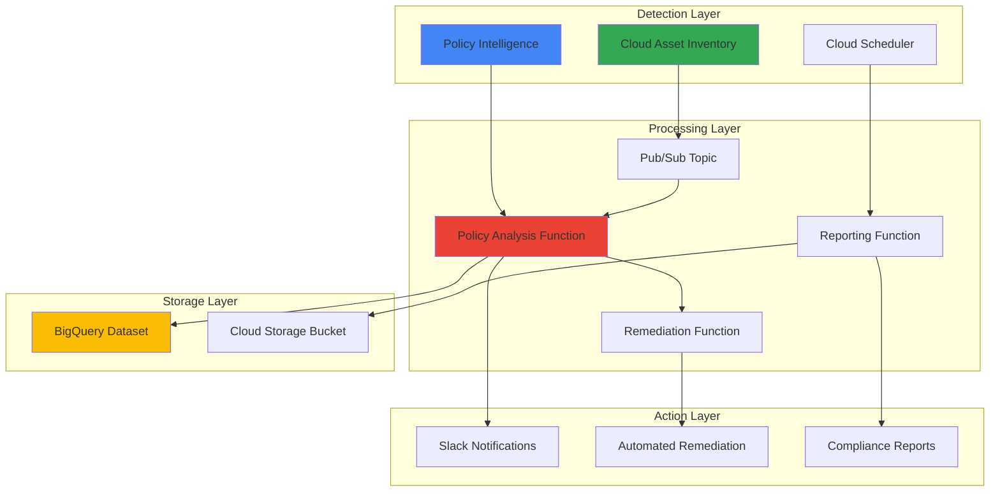

# Automated Security Policy Governance with Policy Intelligence and Asset Inventory

## Problem

Organizations struggle to maintain secure IAM policies across their Google Cloud environments as resources and permissions scale. Security teams manually review excessive permissions, policy violations, and unused service accounts across hundreds of projects, leading to delayed remediation of security risks. Without automated governance, security drift accumulates, creating compliance gaps and potential attack vectors that threaten sensitive data and critical infrastructure.

## Solution

Build an automated security policy governance system using Policy Intelligence to detect excessive IAM permissions and policy violations, Cloud Asset Inventory to monitor policy changes in real-time, and Cloud Functions to trigger automated remediation workflows. Cloud Scheduler orchestrates periodic security audits and compliance reporting, enabling proactive security posture management while reducing manual oversight burden.

## Architecture Diagram



## Prerequisites

1. Google Cloud project with appropriate permissions:
   - Policy Intelligence Admin
   - Asset Inventory Viewer
   - Cloud Functions Admin
   - Cloud Scheduler Admin
   - Pub/Sub Admin
2. gcloud CLI installed and configured
3. Basic understanding of IAM policies and security governance
4. Slack workspace for notifications (optional)
5. Estimated cost: $15-25/month (depending on organization size and activity)

> **Note**: This recipe implements Google Cloud's security best practices for automated policy governance. See the [Google Cloud Security Best Practices Center](https://cloud.google.com/security/best-practices) for comprehensive guidance.

## Preparation

```bash
# Set environment variables for GCP resources
export PROJECT_ID="security-governance-$(date +%s)"
export REGION="us-central1"
export ZONE="us-central1-a"

# Generate unique suffix for resource names
RANDOM_SUFFIX=$(openssl rand -hex 3)

# Set default project and region
gcloud config set project ${PROJECT_ID}
gcloud config set compute/region ${REGION}
gcloud config set compute/zone ${ZONE}

# Enable required APIs
gcloud services enable cloudasset.googleapis.com
gcloud services enable recommender.googleapis.com
gcloud services enable policytroubleshooter.googleapis.com
gcloud services enable cloudfunctions.googleapis.com
gcloud services enable cloudscheduler.googleapis.com
gcloud services enable pubsub.googleapis.com
gcloud services enable bigquery.googleapis.com

echo "✅ Project configured: ${PROJECT_ID}"
```

## Steps

1. **Create BigQuery Dataset for Security Analytics**:

   BigQuery provides scalable data warehouse capabilities for storing and analyzing security policy data over time. Creating a dedicated dataset enables historical analysis of policy changes, compliance reporting, and trend identification across your Google Cloud organization.

   ```bash
   # Create BigQuery dataset for security governance data
   bq mk --dataset \
       --location=${REGION} \
       --description="Security policy governance analytics" \
       ${PROJECT_ID}:security_governance
   
   # Create table for policy insights
   bq mk --table \
       ${PROJECT_ID}:security_governance.policy_insights \
       timestamp:TIMESTAMP,project_id:STRING,principal:STRING,\
       role:STRING,resource:STRING,insight_type:STRING,\
       severity:STRING,recommendation:STRING
   
   echo "✅ BigQuery dataset created for security analytics"
   ```

   The BigQuery dataset now provides a centralized repository for security policy data, enabling SQL-based analysis and dashboard creation. This foundation supports compliance reporting and helps security teams identify patterns in policy violations across their Google Cloud environment.

2. **Setup Cloud Asset Inventory Feed for Policy Monitoring**:

   Cloud Asset Inventory feeds provide real-time notifications when IAM policies change across your Google Cloud organization. This monitoring capability ensures immediate visibility into policy modifications, enabling rapid response to unauthorized changes or potential security drift.

   ```bash
   # Create Pub/Sub topic for asset feed notifications
   gcloud pubsub topics create policy-changes-topic
   
   # Get Cloud Asset Inventory service account
   CAI_SERVICE_ACCOUNT=$(gcloud asset feeds list \
       --format="value(name)" \
       --limit=1 2>/dev/null | \
       sed 's/.*feeds\///; s/\/.*//; s/^/service-/; s/$/@gcp-sa-cloudasset.iam.gserviceaccount.com/')
   
   # If no existing feeds, get the service account differently
   if [ -z "$CAI_SERVICE_ACCOUNT" ]; then
       PROJECT_NUMBER=$(gcloud projects describe ${PROJECT_ID} \
           --format="value(projectNumber)")
       CAI_SERVICE_ACCOUNT="service-${PROJECT_NUMBER}@gcp-sa-cloudasset.iam.gserviceaccount.com"
   fi
   
   # Grant Pub/Sub publisher role to Cloud Asset Inventory
   gcloud pubsub topics add-iam-policy-binding policy-changes-topic \
       --member="serviceAccount:${CAI_SERVICE_ACCOUNT}" \
       --role="roles/pubsub.publisher"
   
   echo "✅ Pub/Sub topic configured for policy monitoring"
   ```

   The Cloud Asset Inventory feed is now configured to publish real-time notifications about IAM policy changes. This creates an event-driven architecture that enables immediate detection and response to policy modifications across your Google Cloud environment.

3. **Deploy Policy Analysis Cloud Function**:

   Cloud Functions provide serverless compute for processing policy intelligence insights and asset inventory events. This function analyzes incoming policy data, applies security rules, and determines appropriate remediation actions based on your organization's security policies.

   ```bash
   # Create directory for Cloud Function code
   mkdir -p policy-analysis-function
   cd policy-analysis-function
   
   # Create requirements.txt for Python dependencies
   cat > requirements.txt << 'EOF'
   google-cloud-asset==3.24.0
   google-cloud-bigquery==3.13.0
   google-cloud-recommender==2.15.0
   google-cloud-pubsub==2.18.4
   slack-sdk==3.23.0
   functions-framework==3.5.0
   EOF
   
   # Create main.py with policy analysis logic
   cat > main.py << 'EOF'
import json
import os
from datetime import datetime
from google.cloud import asset_v1
from google.cloud import bigquery
from google.cloud import recommender_v1
from slack_sdk import WebClient
import functions_framework

# Initialize clients
asset_client = asset_v1.AssetServiceClient()
bq_client = bigquery.Client()
recommender_client = recommender_v1.RecommenderClient()

# Configuration
PROJECT_ID = os.environ.get('GCP_PROJECT')
SLACK_TOKEN = os.environ.get('SLACK_BOT_TOKEN', '')
SLACK_CHANNEL = os.environ.get('SLACK_CHANNEL', '#security-alerts')

def analyze_policy_violation(asset_data):
    """Analyze asset data for policy violations"""
    violations = []
    
    # Check for overprivileged roles
    if 'iam_policy' in asset_data:
        policy = asset_data['iam_policy']
        for binding in policy.get('bindings', []):
            role = binding.get('role', '')
            if role in ['roles/owner', 'roles/editor']:
                violations.append({
                    'type': 'overprivileged_role',
                    'severity': 'HIGH',
                    'role': role,
                    'members': binding.get('members', [])
                })
            elif 'serviceAccount' in str(binding.get('members', [])):
                violations.append({
                    'type': 'service_account_access',
                    'severity': 'MEDIUM',
                    'role': role,
                    'members': binding.get('members', [])
                })
    
    return violations

def send_slack_notification(message):
    """Send notification to Slack channel"""
    if not SLACK_TOKEN:
        print("Slack token not configured")
        return
    
    try:
        client = WebClient(token=SLACK_TOKEN)
        client.chat_postMessage(
            channel=SLACK_CHANNEL,
            text=message
        )
    except Exception as e:
        print(f"Failed to send Slack notification: {e}")

def store_insights(insights):
    """Store policy insights in BigQuery"""
    table_id = f"{PROJECT_ID}.security_governance.policy_insights"
    
    rows_to_insert = []
    for insight in insights:
        rows_to_insert.append({
            'timestamp': datetime.utcnow().isoformat(),
            'project_id': insight.get('project_id', ''),
            'principal': insight.get('principal', ''),
            'role': insight.get('role', ''),
            'resource': insight.get('resource', ''),
            'insight_type': insight.get('type', ''),
            'severity': insight.get('severity', ''),
            'recommendation': insight.get('recommendation', '')
        })
    
    if rows_to_insert:
        errors = bq_client.insert_rows_json(
            bq_client.get_table(table_id), 
            rows_to_insert
        )
        if errors:
            print(f"BigQuery insert errors: {errors}")
        else:
            print(f"Stored {len(rows_to_insert)} insights in BigQuery")

@functions_framework.cloud_event
def policy_analysis_handler(cloud_event):
    """Handle policy analysis events from Pub/Sub"""
    try:
        # Parse the Cloud Event
        event_data = cloud_event.data
        
        if 'asset' in event_data:
            asset_data = event_data['asset']
            violations = analyze_policy_violation(asset_data)
            
            if violations:
                # Store violations in BigQuery
                insights = []
                for violation in violations:
                    insight = {
                        'project_id': asset_data.get('project', ''),
                        'principal': ', '.join(violation.get('members', [])),
                        'role': violation.get('role', ''),
                        'resource': asset_data.get('name', ''),
                        'type': violation.get('type', ''),
                        'severity': violation.get('severity', ''),
                        'recommendation': f"Review {violation.get('type')} for {violation.get('role')}"
                    }
                    insights.append(insight)
                
                store_insights(insights)
                
                # Send Slack notification for high severity violations
                high_severity = [v for v in violations if v.get('severity') == 'HIGH']
                if high_severity:
                    message = f"🚨 *Security Policy Violation Detected*\n"
                    message += f"Resource: {asset_data.get('name', 'Unknown')}\n"
                    message += f"Violations: {len(high_severity)}\n"
                    message += f"Project: {asset_data.get('project', 'Unknown')}\n"
                    send_slack_notification(message)
        
        return "Policy analysis completed"
        
    except Exception as e:
        print(f"Error processing policy analysis: {e}")
        return f"Error: {e}", 500
EOF
   
   cd ..
   echo "✅ Policy analysis function code created"
   ```

   The policy analysis function is now ready to process Cloud Asset Inventory events and Policy Intelligence insights. This serverless function applies security rules to detect policy violations and triggers appropriate notifications and remediation actions.

4. **Deploy Automated Remediation Function**:

   Automated remediation functions implement predefined security policies to address common violations without manual intervention. This function can remove excessive permissions, disable unused service accounts, or apply organization policies based on security governance rules.

   ```bash
   # Create directory for remediation function
   mkdir -p remediation-function
   cd remediation-function
   
   # Create requirements.txt
   cat > requirements.txt << 'EOF'
   google-cloud-resource-manager==1.10.4
   google-cloud-iam==2.12.1
   google-cloud-recommender==2.15.0
   functions-framework==3.5.0
   EOF
   
   # Create remediation function
   cat > main.py << 'EOF'
import os
import json
from google.cloud import iam_v1
from google.cloud import recommender_v1
from google.cloud import resourcemanager_v1
import functions_framework

# Initialize clients
iam_client = iam_v1.IAMClient()
recommender_client = recommender_v1.RecommenderClient()
rm_client = resourcemanager_v1.ProjectsClient()

PROJECT_ID = os.environ.get('GCP_PROJECT')

def apply_role_recommendation(project_id, recommendation):
    """Apply IAM role recommendations automatically"""
    try:
        # Parse recommendation content
        operations = recommendation.content.get('operationsV1', [])
        
        for operation in operations:
            if operation.get('action') == 'remove':
                # Remove role binding
                resource = operation.get('resource')
                role = operation.get('path').split('/')[-1]
                member = operation.get('value')
                
                print(f"Would remove {role} from {member} on {resource}")
                # Implement actual removal logic here
                
            elif operation.get('action') == 'replace':
                # Replace role with more restrictive one
                old_role = operation.get('path').split('/')[-1]  
                new_role = operation.get('value')
                
                print(f"Would replace {old_role} with {new_role}")
                # Implement actual replacement logic here
        
        # Mark recommendation as applied
        recommender_client.mark_recommendation_succeeded(
            name=recommendation.name
        )
        
        return True
        
    except Exception as e:
        print(f"Error applying recommendation: {e}")
        return False

def disable_unused_service_account(project_id, service_account_email):
    """Disable unused service accounts"""
    try:
        # Get service account
        name = f"projects/{project_id}/serviceAccounts/{service_account_email}"
        
        # Disable the service account
        request = iam_v1.DisableServiceAccountRequest(name=name)
        iam_client.disable_service_account(request=request)
        
        print(f"Disabled unused service account: {service_account_email}")
        return True
        
    except Exception as e:
        print(f"Error disabling service account: {e}")
        return False

@functions_framework.http
def remediation_handler(request):
    """Handle automated remediation requests"""
    try:
        request_json = request.get_json()
        
        remediation_type = request_json.get('type')
        project_id = request_json.get('project_id', PROJECT_ID)
        
        if remediation_type == 'apply_role_recommendation':
            recommendation_name = request_json.get('recommendation_name')
            recommendation = recommender_client.get_recommendation(
                name=recommendation_name
            )
            success = apply_role_recommendation(project_id, recommendation)
            
        elif remediation_type == 'disable_service_account':
            service_account = request_json.get('service_account')
            success = disable_unused_service_account(project_id, service_account)
            
        else:
            return {"error": "Unknown remediation type"}, 400
        
        return {
            "success": success,
            "type": remediation_type,
            "project_id": project_id
        }
        
    except Exception as e:
        print(f"Error in remediation handler: {e}")
        return {"error": str(e)}, 500
EOF
   
   cd ..
   echo "✅ Remediation function code created"
   ```

   The automated remediation function is configured to safely apply recommended policy changes and security improvements. This function implements the principle of least privilege by automatically removing excessive permissions and disabling unused resources based on Policy Intelligence recommendations.

5. **Deploy Compliance Reporting Function**:

   Compliance reporting functions generate periodic security posture reports and governance metrics for stakeholders. This function aggregates policy insights, remediation actions, and compliance status to provide visibility into your organization's security governance effectiveness.

   ```bash
   # Create directory for reporting function
   mkdir -p reporting-function
   cd reporting-function
   
   # Create requirements.txt
   cat > requirements.txt << 'EOF'
   google-cloud-bigquery==3.13.0
   google-cloud-storage==2.10.0
   google-cloud-recommender==2.15.0
   jinja2==3.1.2
   functions-framework==3.5.0
   EOF
   
   # Create reporting function
   cat > main.py << 'EOF'
import os
import json
from datetime import datetime, timedelta
from google.cloud import bigquery
from google.cloud import storage
from google.cloud import recommender_v1
from jinja2 import Template
import functions_framework

# Initialize clients
bq_client = bigquery.Client()
storage_client = storage.Client()
recommender_client = recommender_v1.RecommenderClient()

PROJECT_ID = os.environ.get('GCP_PROJECT')
REPORT_BUCKET = os.environ.get('REPORT_BUCKET', f'{PROJECT_ID}-compliance-reports')

def generate_compliance_report():
    """Generate comprehensive compliance report"""
    # Query policy insights from BigQuery
    query = f"""
    SELECT 
        insight_type,
        severity,
        COUNT(*) as count,
        project_id
    FROM `{PROJECT_ID}.security_governance.policy_insights`
    WHERE DATE(timestamp) >= DATE_SUB(CURRENT_DATE(), INTERVAL 7 DAYS)
    GROUP BY insight_type, severity, project_id
    ORDER BY severity DESC, count DESC
    """
    
    results = bq_client.query(query).to_dataframe()
    
    # Get recommendation statistics
    parent = f"projects/{PROJECT_ID}/locations/global/recommenders/google.iam.policy.Recommender"
    recommendations = recommender_client.list_recommendations(parent=parent)
    
    rec_stats = {
        'total': 0,
        'applied': 0,
        'pending': 0
    }
    
    for rec in recommendations:
        rec_stats['total'] += 1
        if rec.state_info.state.name == 'SUCCEEDED':
            rec_stats['applied'] += 1
        else:
            rec_stats['pending'] += 1
    
    # Generate HTML report
    report_template = Template("""
    <!DOCTYPE html>
    <html>
    <head>
        <title>Security Policy Governance Report</title>
        <style>
            body { font-family: Arial, sans-serif; margin: 20px; }
            .header { background: #4285f4; color: white; padding: 20px; }
            .metric { background: #f8f9fa; padding: 15px; margin: 10px 0; border-radius: 5px; }
            .high { border-left: 5px solid #ea4335; }
            .medium { border-left: 5px solid #fbbc04; }
            .low { border-left: 5px solid #34a853; }
            table { border-collapse: collapse; width: 100%; }
            th, td { border: 1px solid #ddd; padding: 8px; text-align: left; }
            th { background-color: #f2f2f2; }
        </style>
    </head>
    <body>
        <div class="header">
            <h1>Security Policy Governance Report</h1>
            <p>Generated: {{ report_date }}</p>
        </div>
        
        <div class="metric">
            <h2>Recommendation Statistics</h2>
            <p><strong>Total Recommendations:</strong> {{ rec_stats.total }}</p>
            <p><strong>Applied:</strong> {{ rec_stats.applied }}</p>
            <p><strong>Pending:</strong> {{ rec_stats.pending }}</p>
        </div>
        
        <div class="metric">
            <h2>Policy Insights (Last 7 Days)</h2>
            <table>
                <tr>
                    <th>Project</th>
                    <th>Insight Type</th>
                    <th>Severity</th>
                    <th>Count</th>
                </tr>
                
                <tr class="{{ row.severity.lower() }}">
                    <td>{{ row.project_id }}</td>
                    <td>{{ row.insight_type }}</td>
                    <td>{{ row.severity }}</td>
                    <td>{{ row.count }}</td>
                </tr>
                
            </table>
        </div>
    </body>
    </html>
    """)
    
    report_html = report_template.render(
        report_date=datetime.now().strftime("%Y-%m-%d %H:%M:%S"),
        rec_stats=rec_stats,
        insights=results
    )
    
    return report_html

def upload_report_to_storage(report_html):
    """Upload report to Cloud Storage"""
    bucket = storage_client.bucket(REPORT_BUCKET)
    
    # Create filename with timestamp
    timestamp = datetime.now().strftime("%Y%m%d_%H%M%S")
    blob_name = f"compliance_reports/governance_report_{timestamp}.html"
    
    blob = bucket.blob(blob_name)
    blob.upload_from_string(report_html, content_type='text/html')
    
    return f"gs://{REPORT_BUCKET}/{blob_name}"

@functions_framework.http
def reporting_handler(request):
    """Handle compliance reporting requests"""
    try:
        # Generate compliance report
        report_html = generate_compliance_report()
        
        # Upload to Cloud Storage
        report_url = upload_report_to_storage(report_html)
        
        return {
            "success": True,
            "report_url": report_url,
            "generated_at": datetime.now().isoformat()
        }
        
    except Exception as e:
        print(f"Error generating compliance report: {e}")
        return {"error": str(e)}, 500
EOF
   
   cd ..
   echo "✅ Compliance reporting function code created"
   ```

   The compliance reporting function is now configured to generate comprehensive security governance reports. This function aggregates policy insights, recommendation statistics, and compliance metrics to provide stakeholders with visibility into security posture and governance effectiveness.

6. **Deploy All Cloud Functions**:

   Cloud Functions deployment creates the serverless compute infrastructure needed for automated security policy governance. These functions work together to analyze policies, trigger remediation, and generate compliance reports without requiring dedicated server infrastructure.

   ```bash
   # Create Cloud Storage bucket for reports
   gsutil mb -p ${PROJECT_ID} \
       -c STANDARD \
       -l ${REGION} \
       gs://${PROJECT_ID}-compliance-reports
   
   # Deploy policy analysis function
   gcloud functions deploy policy-analysis \
       --source=policy-analysis-function \
       --entry-point=policy_analysis_handler \
       --runtime=python311 \
       --trigger-topic=policy-changes-topic \
       --memory=512MB \
       --timeout=300s \
       --set-env-vars="GCP_PROJECT=${PROJECT_ID}"
   
   # Deploy remediation function
   gcloud functions deploy automated-remediation \
       --source=remediation-function \
       --entry-point=remediation_handler \
       --runtime=python311 \
       --trigger-http \
       --memory=256MB \
       --timeout=60s \
       --set-env-vars="GCP_PROJECT=${PROJECT_ID}"
   
   # Deploy reporting function
   gcloud functions deploy compliance-reporting \
       --source=reporting-function \
       --entry-point=reporting_handler \
       --runtime=python311 \
       --trigger-http \
       --memory=512MB \
       --timeout=300s \
       --set-env-vars="GCP_PROJECT=${PROJECT_ID},REPORT_BUCKET=${PROJECT_ID}-compliance-reports"
   
   echo "✅ All Cloud Functions deployed successfully"
   ```

   The Cloud Functions are now deployed and ready to process security events. These serverless functions provide scalable, event-driven processing for policy analysis, automated remediation, and compliance reporting across your Google Cloud environment.

7. **Create Cloud Asset Inventory Feed**:

   The Cloud Asset Inventory feed establishes real-time monitoring of IAM policy changes across your Google Cloud organization. This feed publishes events to Pub/Sub whenever policies are modified, enabling immediate detection and response to security-relevant changes.

   ```bash
   # Get organization ID (replace with your organization ID)
   ORG_ID=$(gcloud organizations list --format="value(name)" | head -1)
   
   if [ -z "$ORG_ID" ]; then
       echo "Warning: No organization found. Creating project-level feed instead."
       SCOPE_FLAG="--project=${PROJECT_ID}"
   else
       SCOPE_FLAG="--organization=${ORG_ID}"
   fi
   
   # Create asset feed for IAM policy changes
   gcloud asset feeds create iam-policy-feed \
       ${SCOPE_FLAG} \
       --asset-types="cloudresourcemanager.googleapis.com/Project,cloudresourcemanager.googleapis.com/Folder,cloudresourcemanager.googleapis.com/Organization" \
       --content-type="iam-policy" \
       --pubsub-topic="projects/${PROJECT_ID}/topics/policy-changes-topic" \
       --condition-title="IAM Policy Changes" \
       --condition-description="Monitor IAM policy binding changes" \
       --condition-expression="temporal_asset.prior_asset_state == google.cloud.asset.v1.TemporalAsset.PriorAssetState.PRESENT"
   
   echo "✅ Cloud Asset Inventory feed created for policy monitoring"
   ```

   The asset feed is now actively monitoring IAM policy changes and publishing events to trigger automated analysis. This creates a comprehensive detection system that captures policy modifications across your entire Google Cloud hierarchy.

8. **Setup Cloud Scheduler for Periodic Security Audits**:

   Cloud Scheduler orchestrates periodic security audits and compliance reporting by triggering Cloud Functions on a defined schedule. This automation ensures consistent security governance without manual intervention, maintaining continuous visibility into your security posture.

   ```bash
   # Create scheduled job for weekly compliance reports
   gcloud scheduler jobs create http weekly-compliance-report \
       --location=${REGION} \
       --schedule="0 9 * * 1" \
       --uri="https://${REGION}-${PROJECT_ID}.cloudfunctions.net/compliance-reporting" \
       --http-method=POST \
       --headers="Content-Type=application/json" \
       --message-body='{"report_type": "weekly"}' \
       --description="Weekly security governance compliance report"
   
   # Create scheduled job for daily policy analysis
   gcloud scheduler jobs create http daily-policy-scan \
       --location=${REGION} \
       --schedule="0 8 * * *" \
       --uri="https://${REGION}-${PROJECT_ID}.cloudfunctions.net/policy-analysis" \
       --http-method=POST \
       --headers="Content-Type=application/json" \
       --message-body='{"scan_type": "daily"}' \
       --description="Daily proactive policy analysis scan"
   
   echo "✅ Cloud Scheduler jobs created for automated governance"
   ```

   Cloud Scheduler is now configured to trigger periodic security audits and compliance reporting. This automation ensures consistent security governance with weekly compliance reports and daily policy scans to maintain continuous visibility into your security posture.

## Validation & Testing

1. **Verify Policy Intelligence Access**:

   ```bash
   # Test Policy Intelligence API access
   gcloud recommender recommendations list \
       --project=${PROJECT_ID} \
       --recommender=google.iam.policy.Recommender \
       --location=global \
       --format="table(name,description,priority)"
   ```

   Expected output: List of IAM role recommendations or empty table if no recommendations are available.

2. **Test Asset Feed Functionality**:

   ```bash
   # Create a test IAM policy change
   gcloud projects add-iam-policy-binding ${PROJECT_ID} \
       --member="user:test@example.com" \
       --role="roles/viewer"
   
   # Check Pub/Sub messages (this should trigger the policy analysis function)
   gcloud pubsub subscriptions pull policy-changes-topic-sub \
       --auto-ack \
       --limit=1 \
       --format="value(message.data)" | base64 -d
   ```

   Expected output: JSON message containing asset change data with IAM policy modifications.

3. **Validate Cloud Functions Deployment**:

   ```bash
   # Test compliance reporting function
   curl -X POST \
       "https://${REGION}-${PROJECT_ID}.cloudfunctions.net/compliance-reporting" \
       -H "Content-Type: application/json" \
       -d '{"report_type": "test"}'
   
   # Check function logs
   gcloud functions logs read compliance-reporting \
       --region=${REGION} \
       --limit=10
   ```

   Expected output: JSON response with report generation status and Cloud Storage URL.

4. **Verify BigQuery Data Storage**:

   ```bash
   # Query stored policy insights
   bq query --use_legacy_sql=false \
       "SELECT COUNT(*) as total_insights FROM \`${PROJECT_ID}.security_governance.policy_insights\`"
   ```

   Expected output: Count of policy insights stored in BigQuery (may be 0 initially).

## Cleanup

1. **Remove Cloud Scheduler Jobs**:

   ```bash
   # Delete scheduled jobs
   gcloud scheduler jobs delete weekly-compliance-report \
       --location=${REGION} \
       --quiet
   
   gcloud scheduler jobs delete daily-policy-scan \
       --location=${REGION} \
       --quiet
   
   echo "✅ Deleted Cloud Scheduler jobs"
   ```

2. **Remove Cloud Functions**:

   ```bash
   # Delete Cloud Functions
   gcloud functions delete policy-analysis \
       --region=${REGION} \
       --quiet
   
   gcloud functions delete automated-remediation \
       --region=${REGION} \
       --quiet
   
   gcloud functions delete compliance-reporting \
       --region=${REGION} \
       --quiet
   
   echo "✅ Deleted Cloud Functions"
   ```

3. **Remove Asset Feed and Pub/Sub Resources**:

   ```bash
   # Delete asset feed
   FEED_NAME=$(gcloud asset feeds list --format="value(name)" | head -1)
   if [ ! -z "$FEED_NAME" ]; then
       gcloud asset feeds delete ${FEED_NAME} --quiet
   fi
   
   # Delete Pub/Sub topic
   gcloud pubsub topics delete policy-changes-topic --quiet
   
   echo "✅ Deleted asset feed and Pub/Sub resources"
   ```

4. **Remove Storage and BigQuery Resources**:

   ```bash
   # Delete Cloud Storage bucket
   gsutil -m rm -r gs://${PROJECT_ID}-compliance-reports
   
   # Delete BigQuery dataset
   bq rm -r -f ${PROJECT_ID}:security_governance
   
   # Clean up local function directories
   rm -rf policy-analysis-function remediation-function reporting-function
   
   echo "✅ Cleaned up storage and BigQuery resources"
   ```

## Discussion

This automated security policy governance solution implements a comprehensive approach to managing IAM policies and security compliance across Google Cloud environments. The architecture leverages Google Cloud's native security services to create an event-driven system that continuously monitors, analyzes, and remediates policy violations.

Policy Intelligence serves as the foundation for understanding security risks by providing AI-powered insights into excessive permissions and policy violations. The service analyzes actual usage patterns to recommend role optimizations that follow the principle of least privilege. Cloud Asset Inventory complements this by providing real-time monitoring of policy changes, ensuring immediate visibility into modifications that could impact security posture.

The serverless architecture using Cloud Functions enables scalable, cost-effective processing of security events without maintaining dedicated infrastructure. Each function serves a specific purpose: policy analysis processes incoming events and applies security rules, automated remediation safely implements approved changes, and compliance reporting generates visibility for stakeholders. This separation of concerns enables independent scaling and modification of each component.

Cloud Scheduler orchestrates periodic security audits and compliance reporting, ensuring consistent governance without manual intervention. The BigQuery integration provides long-term storage and analytics capabilities for security data, enabling trend analysis and historical reporting that supports compliance requirements and security program maturity.

> **Tip**: Configure Slack notifications to provide immediate alerts for high-severity policy violations, enabling rapid response to potential security incidents while maintaining automated remediation for lower-risk issues.

The solution's effectiveness depends on proper configuration of organization policies and careful tuning of automated remediation rules. Organizations should start with monitoring and alerting before enabling automated remediation, allowing security teams to validate the system's behavior and adjust rules based on their specific requirements and risk tolerance.

For more information on Google Cloud security governance, see the [Google Cloud Security Best Practices](https://cloud.google.com/security/best-practices), [Policy Intelligence documentation](https://cloud.google.com/policy-intelligence/docs/overview), [Cloud Asset Inventory guide](https://cloud.google.com/asset-inventory/docs/overview), [IAM best practices](https://cloud.google.com/iam/docs/using-iam-securely), and [Security governance patterns](https://cloud.google.com/architecture/patterns-practices-identity-access-governance-google-cloud).

## Challenge

Extend this solution by implementing these advanced security governance enhancements:

1. **Multi-cloud Policy Governance**: Integrate AWS and Azure policy monitoring using Cloud Functions to create unified security governance across cloud providers, normalizing policy data formats and compliance reporting.

2. **Machine Learning-based Anomaly Detection**: Implement Vertex AI models to detect unusual policy changes or access patterns that might indicate compromised accounts or insider threats, extending beyond rule-based analysis.

3. **Dynamic Risk Scoring**: Create a risk scoring system that considers resource sensitivity, user behavior patterns, and business context to prioritize remediation actions and adjust automated response thresholds.

4. **Custom Organization Policy Enforcement**: Build automated enforcement of custom organization policies using Policy Intelligence recommendations and Cloud Functions to apply constraints based on resource tags, project labels, and compliance requirements.

5. **Integration with SIEM Systems**: Develop connectors to send security governance events to external SIEM platforms like Splunk or Chronicle, enabling correlation with broader security monitoring and incident response workflows.

## Infrastructure Code

*Infrastructure code will be generated after recipe approval.*