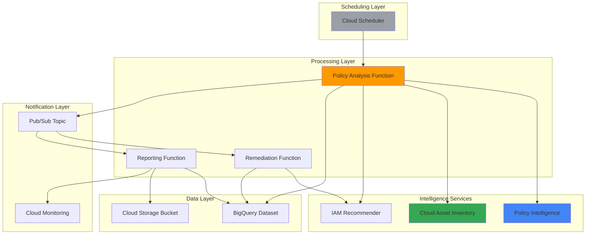

# Automated Security Policy Governance with Policy Intelligence and Asset Inventory

## Problem

Organizations struggle to maintain secure IAM policies across large GCP environments, often discovering excessive permissions, policy violations, and compliance issues only after security incidents occur. Manual policy reviews are time-consuming, error-prone, and fail to keep pace with rapidly changing cloud resources and access requirements, leaving organizations vulnerable to privilege escalation attacks and regulatory compliance failures.

## Solution

Deploy an automated security governance system using GCP Policy Intelligence to analyze IAM policies, Cloud Asset Inventory to track resource access patterns, and Cloud Functions to implement automated remediation workflows. Cloud Scheduler orchestrates regular compliance checks, enabling proactive security policy management with automated violation detection and remediation across your entire GCP organization.

## Architecture Diagram



## Prerequisites

1. GCP project with Owner or Security Admin permissions
2. Google Cloud CLI installed and configured
3. Basic understanding of IAM policies and security governance
4. Python 3.9+ for Cloud Functions development
5. Estimated cost: $25-50/month for typical enterprise usage

> **Note**: This recipe enables audit logging and policy analysis which may increase Cloud Logging costs. Review [GCP pricing documentation](https://cloud.google.com/pricing) for detailed cost estimates.

## Preparation

```bash
# Set environment variables for GCP resources
export PROJECT_ID="security-governance-$(date +%s)"
export REGION="us-central1"
export ZONE="us-central1-a"

# Generate unique suffix for resource names
RANDOM_SUFFIX=$(openssl rand -hex 3)

# Set resource names
export BUCKET_NAME="security-reports-${RANDOM_SUFFIX}"
export FUNCTION_NAME_ANALYZER="policy-analyzer-${RANDOM_SUFFIX}"
export FUNCTION_NAME_REMEDIATE="policy-remediate-${RANDOM_SUFFIX}"
export FUNCTION_NAME_REPORT="policy-reporter-${RANDOM_SUFFIX}"
export TOPIC_NAME="security-alerts-${RANDOM_SUFFIX}"
export DATASET_NAME="security_governance"
export SCHEDULER_JOB="policy-check-${RANDOM_SUFFIX}"

# Set default project and region
gcloud config set project ${PROJECT_ID}
gcloud config set compute/region ${REGION}
gcloud config set compute/zone ${ZONE}

# Enable required APIs
gcloud services enable cloudfunctions.googleapis.com
gcloud services enable cloudscheduler.googleapis.com
gcloud services enable pubsub.googleapis.com
gcloud services enable bigquery.googleapis.com
gcloud services enable storage.googleapis.com
gcloud services enable cloudasset.googleapis.com
gcloud services enable recommender.googleapis.com
gcloud services enable policyanalyzer.googleapis.com

echo "✅ Project configured: ${PROJECT_ID}"
```

## Steps

1. **Create BigQuery Dataset for Security Analytics**:

   BigQuery provides the analytical foundation for security governance, enabling SQL-based analysis of IAM policies, access patterns, and compliance metrics. The dataset stores policy analysis results, violation reports, and historical compliance data for trend analysis and audit purposes.

   ```bash
   # Create BigQuery dataset for security data
   bq mk --dataset \
       --description "Security governance and policy analysis data" \
       --location=${REGION} \
       ${PROJECT_ID}:${DATASET_NAME}
   
   # Create table for policy violations
   bq mk --table \
       ${PROJECT_ID}:${DATASET_NAME}.policy_violations \
       violation_id:STRING,resource:STRING,principal:STRING,permission:STRING,severity:STRING,detected_at:TIMESTAMP,status:STRING,remediated_at:TIMESTAMP
   
   # Create table for access analysis
   bq mk --table \
       ${PROJECT_ID}:${DATASET_NAME}.access_analysis \
       analysis_id:STRING,resource:STRING,principals:STRING,roles:STRING,permissions:STRING,conditional_access:STRING,analyzed_at:TIMESTAMP
   
   echo "✅ BigQuery dataset and tables created"
   ```

   The BigQuery dataset now serves as the central repository for security analytics, providing structured storage for policy violations and access analysis results with built-in scalability and SQL query capabilities.

2. **Create Cloud Storage Bucket for Reports**:

   Cloud Storage provides secure, cost-effective storage for security compliance reports, audit logs, and backup data. The bucket configuration includes versioning for report history and appropriate IAM policies for controlled access to sensitive security information.

   ```bash
   # Create Cloud Storage bucket for security reports
   gsutil mb -p ${PROJECT_ID} \
       -c STANDARD \
       -l ${REGION} \
       gs://${BUCKET_NAME}
   
   # Enable versioning for report history
   gsutil versioning set on gs://${BUCKET_NAME}
   
   # Set bucket-level IAM policy for security
   gsutil iam ch allUsers:objectViewer gs://${BUCKET_NAME}
   gsutil iam ch -d allUsers:objectViewer gs://${BUCKET_NAME}
   
   echo "✅ Cloud Storage bucket created with versioning"
   ```

   The storage bucket is ready to receive security reports with versioning enabled for audit trail maintenance and proper access controls to protect sensitive compliance data.

3. **Create Pub/Sub Topic for Security Alerts**:

   Pub/Sub enables asynchronous, scalable communication between security governance components. The topic serves as the central messaging hub for policy violations, remediation triggers, and compliance notifications, supporting reliable message delivery with built-in retry mechanisms.

   ```bash
   # Create Pub/Sub topic for security alerts
   gcloud pubsub topics create ${TOPIC_NAME}
   
   # Create subscription for remediation function
   gcloud pubsub subscriptions create ${TOPIC_NAME}-remediation \
       --topic=${TOPIC_NAME} \
       --ack-deadline=300
   
   # Create subscription for reporting function
   gcloud pubsub subscriptions create ${TOPIC_NAME}-reporting \
       --topic=${TOPIC_NAME} \
       --ack-deadline=300
   
   echo "✅ Pub/Sub topic and subscriptions created"
   ```

   The messaging infrastructure now supports reliable, asynchronous processing of security events with dedicated subscriptions for remediation and reporting workflows.

4. **Deploy Policy Analysis Cloud Function**:

   The policy analysis function leverages GCP Policy Intelligence and Cloud Asset Inventory to systematically examine IAM policies, identify excessive permissions, and detect policy violations. This serverless approach ensures cost-effective, scalable policy analysis that adapts to organization size and complexity.

   ```bash
   # Create function source directory
   mkdir -p policy-analyzer-function
   cd policy-analyzer-function
   
   # Create main function file
   cat > main.py << 'EOF'
import json
import logging
from datetime import datetime
from google.cloud import asset_v1
from google.cloud import bigquery
from google.cloud import pubsub_v1
from google.cloud import recommender_v1
import os

# Initialize clients
asset_client = asset_v1.AssetServiceClient()
bq_client = bigquery.Client()
publisher = pubsub_v1.PublisherClient()
recommender_client = recommender_v1.RecommenderClient()

PROJECT_ID = os.environ.get('GCP_PROJECT')
DATASET_ID = os.environ.get('DATASET_NAME')
TOPIC_PATH = publisher.topic_path(PROJECT_ID, os.environ.get('TOPIC_NAME'))

def analyze_policies(request):
    """Main function to analyze IAM policies and detect violations."""
    try:
        logging.info("Starting policy analysis")
        
        # Analyze IAM policies using Cloud Asset API
        violations = []
        
        # Get all IAM policies in the project
        request_asset = asset_v1.SearchAllIamPoliciesRequest(
            scope=f"projects/{PROJECT_ID}",
            query="policy:*"
        )
        
        policies = asset_client.search_all_iam_policies(request=request_asset)
        
        for policy in policies:
            # Analyze each policy for violations
            policy_violations = check_policy_violations(policy)
            violations.extend(policy_violations)
        
        # Get IAM recommendations
        recommendations = get_iam_recommendations()
        
        # Store results in BigQuery
        store_violations(violations)
        
        # Send alerts for high-severity violations
        send_alerts(violations)
        
        logging.info(f"Analysis complete. Found {len(violations)} violations")
        return {"status": "success", "violations": len(violations)}
        
    except Exception as e:
        logging.error(f"Policy analysis failed: {str(e)}")
        return {"status": "error", "message": str(e)}

def check_policy_violations(policy):
    """Check individual policy for security violations."""
    violations = []
    
    for binding in policy.policy.bindings:
        # Check for overly broad roles
        if binding.role in ['roles/owner', 'roles/editor']:
            for member in binding.members:
                if member.startswith('user:') or member.startswith('group:'):
                    violations.append({
                        'violation_id': f"{policy.resource}_{binding.role}_{member}",
                        'resource': policy.resource,
                        'principal': member,
                        'permission': binding.role,
                        'severity': 'HIGH',
                        'detected_at': datetime.utcnow().isoformat(),
                        'status': 'OPEN'
                    })
        
        # Check for external users
        for member in binding.members:
            if member.startswith('user:') and not member.endswith('@company.com'):
                violations.append({
                    'violation_id': f"{policy.resource}_external_user_{member}",
                    'resource': policy.resource,
                    'principal': member,
                    'permission': binding.role,
                    'severity': 'MEDIUM',
                    'detected_at': datetime.utcnow().isoformat(),
                    'status': 'OPEN'
                })
    
    return violations

def get_iam_recommendations():
    """Get IAM recommendations from Recommender API."""
    try:
        parent = f"projects/{PROJECT_ID}/locations/global/recommenders/google.iam.policy.Recommender"
        
        recommendations = recommender_client.list_recommendations(
            request={"parent": parent}
        )
        
        return list(recommendations)
    except Exception as e:
        logging.error(f"Failed to get recommendations: {str(e)}")
        return []

def store_violations(violations):
    """Store violations in BigQuery."""
    if not violations:
        return
    
    table_id = f"{PROJECT_ID}.{DATASET_ID}.policy_violations"
    
    errors = bq_client.insert_rows_json(
        bq_client.get_table(table_id),
        violations
    )
    
    if errors:
        logging.error(f"BigQuery insert errors: {errors}")
    else:
        logging.info(f"Stored {len(violations)} violations in BigQuery")

def send_alerts(violations):
    """Send alerts for high-severity violations."""
    high_severity = [v for v in violations if v['severity'] == 'HIGH']
    
    if high_severity:
        alert_message = {
            'type': 'policy_violation',
            'severity': 'HIGH',
            'count': len(high_severity),
            'violations': high_severity[:5]  # Send first 5 for alert
        }
        
        publisher.publish(
            TOPIC_PATH,
            json.dumps(alert_message).encode('utf-8')
        )
        
        logging.info(f"Sent alert for {len(high_severity)} high-severity violations")
EOF
   
   # Create requirements file
   cat > requirements.txt << EOF
google-cloud-asset==3.19.1
google-cloud-bigquery==3.11.4
google-cloud-pubsub==2.18.1
google-cloud-recommender==2.11.1
EOF
   
   # Deploy the function
   gcloud functions deploy ${FUNCTION_NAME_ANALYZER} \
       --runtime python39 \
       --trigger-http \
       --allow-unauthenticated \
       --source . \
       --entry-point analyze_policies \
       --memory 512MB \
       --timeout 540s \
       --set-env-vars "DATASET_NAME=${DATASET_NAME},TOPIC_NAME=${TOPIC_NAME}"
   
   cd ..
   echo "✅ Policy analysis function deployed"
   ```

   The policy analysis function is now deployed with comprehensive IAM policy analysis capabilities, automated violation detection, and integration with GCP intelligence services for continuous security monitoring.

5. **Deploy Automated Remediation Function**:

   The remediation function implements automated responses to security policy violations, including permission revocation, role adjustments, and compliance corrections. This function operates on Pub/Sub triggers to ensure immediate response to critical security issues while maintaining audit trails for all remediation actions.

   ```bash
   # Create remediation function directory
   mkdir -p policy-remediation-function
   cd policy-remediation-function
   
   # Create remediation function
   cat > main.py << 'EOF'
import json
import logging
from datetime import datetime
from google.cloud import bigquery
from google.cloud import recommender_v1
from google.cloud import resourcemanager_v1
import os

# Initialize clients
bq_client = bigquery.Client()
recommender_client = recommender_v1.RecommenderClient()
resource_client = resourcemanager_v1.ProjectsClient()

PROJECT_ID = os.environ.get('GCP_PROJECT')
DATASET_ID = os.environ.get('DATASET_NAME')

def remediate_violations(event, context):
    """Automated remediation of security policy violations."""
    try:
        # Decode Pub/Sub message
        message_data = json.loads(
            base64.b64decode(event['data']).decode('utf-8')
        )
        
        logging.info(f"Processing remediation for: {message_data['type']}")
        
        if message_data['type'] == 'policy_violation':
            remediate_policy_violations(message_data['violations'])
        
        return {"status": "success"}
        
    except Exception as e:
        logging.error(f"Remediation failed: {str(e)}")
        return {"status": "error", "message": str(e)}

def remediate_policy_violations(violations):
    """Apply automated remediation for policy violations."""
    for violation in violations:
        try:
            # Apply remediation based on violation type
            if violation['severity'] == 'HIGH':
                # For high-severity violations, create remediation recommendation
                create_remediation_task(violation)
            
            # Update violation status
            update_violation_status(violation['violation_id'], 'REMEDIATED')
            
            logging.info(f"Remediated violation: {violation['violation_id']}")
            
        except Exception as e:
            logging.error(f"Failed to remediate {violation['violation_id']}: {str(e)}")

def create_remediation_task(violation):
    """Create remediation task for manual review."""
    remediation_data = {
        'violation_id': violation['violation_id'],
        'resource': violation['resource'],
        'principal': violation['principal'],
        'recommended_action': get_recommended_action(violation),
        'created_at': datetime.utcnow().isoformat(),
        'status': 'PENDING_REVIEW'
    }
    
    # Store in BigQuery for review
    table_id = f"{PROJECT_ID}.{DATASET_ID}.remediation_tasks"
    
    # Create table if it doesn't exist
    try:
        bq_client.get_table(table_id)
    except:
        schema = [
            bigquery.SchemaField("violation_id", "STRING"),
            bigquery.SchemaField("resource", "STRING"),
            bigquery.SchemaField("principal", "STRING"),
            bigquery.SchemaField("recommended_action", "STRING"),
            bigquery.SchemaField("created_at", "TIMESTAMP"),
            bigquery.SchemaField("status", "STRING"),
        ]
        table = bigquery.Table(table_id, schema=schema)
        bq_client.create_table(table)
    
    bq_client.insert_rows_json(
        bq_client.get_table(table_id),
        [remediation_data]
    )

def get_recommended_action(violation):
    """Get recommended remediation action."""
    if 'roles/owner' in violation['permission']:
        return "Replace Owner role with specific roles based on job function"
    elif 'roles/editor' in violation['permission']:
        return "Replace Editor role with specific roles based on required permissions"
    elif 'external_user' in violation['violation_id']:
        return "Review external user access and remove if not required"
    else:
        return "Review and apply principle of least privilege"

def update_violation_status(violation_id, status):
    """Update violation status in BigQuery."""
    query = f"""
    UPDATE `{PROJECT_ID}.{DATASET_ID}.policy_violations`
    SET status = @status, remediated_at = CURRENT_TIMESTAMP()
    WHERE violation_id = @violation_id
    """
    
    job_config = bigquery.QueryJobConfig(
        query_parameters=[
            bigquery.ScalarQueryParameter("status", "STRING", status),
            bigquery.ScalarQueryParameter("violation_id", "STRING", violation_id),
        ]
    )
    
    bq_client.query(query, job_config=job_config)
EOF
   
   # Add base64 import
   sed -i '1i import base64' main.py
   
   # Create requirements file
   cat > requirements.txt << EOF
google-cloud-bigquery==3.11.4
google-cloud-recommender==2.11.1
google-cloud-resource-manager==1.10.1
EOF
   
   # Deploy remediation function
   gcloud functions deploy ${FUNCTION_NAME_REMEDIATE} \
       --runtime python39 \
       --trigger-topic ${TOPIC_NAME} \
       --source . \
       --entry-point remediate_violations \
       --memory 256MB \
       --timeout 300s \
       --set-env-vars "DATASET_NAME=${DATASET_NAME}"
   
   cd ..
   echo "✅ Remediation function deployed"
   ```

   The automated remediation function is now operational, providing intelligent response to security violations with configurable remediation actions and comprehensive audit logging for compliance requirements.

6. **Deploy Compliance Reporting Function**:

   The reporting function generates comprehensive security compliance reports, consolidating policy analysis results, violation trends, and remediation statistics. Reports are automatically generated and stored in Cloud Storage with customizable formats for different stakeholder requirements and regulatory compliance needs.

   ```bash
   # Create reporting function directory
   mkdir -p policy-reporting-function
   cd policy-reporting-function
   
   # Create reporting function
   cat > main.py << 'EOF'
import json
import logging
import base64
from datetime import datetime, timedelta
from google.cloud import bigquery
from google.cloud import storage
import pandas as pd
import os

# Initialize clients
bq_client = bigquery.Client()
storage_client = storage.Client()

PROJECT_ID = os.environ.get('GCP_PROJECT')
DATASET_ID = os.environ.get('DATASET_NAME')
BUCKET_NAME = os.environ.get('BUCKET_NAME')

def generate_reports(event, context):
    """Generate security compliance reports."""
    try:
        logging.info("Starting report generation")
        
        # Generate violation summary report
        violation_report = generate_violation_report()
        
        # Generate access analysis report
        access_report = generate_access_report()
        
        # Generate compliance dashboard data
        compliance_metrics = generate_compliance_metrics()
        
        # Save reports to Cloud Storage
        save_report(violation_report, 'violations')
        save_report(access_report, 'access_analysis')
        save_report(compliance_metrics, 'compliance_metrics')
        
        logging.info("Reports generated successfully")
        return {"status": "success", "reports": 3}
        
    except Exception as e:
        logging.error(f"Report generation failed: {str(e)}")
        return {"status": "error", "message": str(e)}

def generate_violation_report():
    """Generate security violation summary report."""
    query = f"""
    SELECT 
        DATE(detected_at) as date,
        severity,
        status,
        COUNT(*) as violation_count,
        COUNT(DISTINCT resource) as affected_resources,
        COUNT(DISTINCT principal) as affected_principals
    FROM `{PROJECT_ID}.{DATASET_ID}.policy_violations`
    WHERE detected_at >= TIMESTAMP_SUB(CURRENT_TIMESTAMP(), INTERVAL 30 DAY)
    GROUP BY DATE(detected_at), severity, status
    ORDER BY date DESC, severity
    """
    
    return bq_client.query(query).to_dataframe()

def generate_access_report():
    """Generate access analysis report."""
    query = f"""
    SELECT 
        resource,
        COUNT(DISTINCT JSON_EXTRACT_SCALAR(principals, '$[0]')) as principal_count,
        STRING_AGG(DISTINCT roles) as roles_assigned,
        analyzed_at
    FROM `{PROJECT_ID}.{DATASET_ID}.access_analysis`
    WHERE analyzed_at >= TIMESTAMP_SUB(CURRENT_TIMESTAMP(), INTERVAL 7 DAY)
    GROUP BY resource, analyzed_at
    ORDER BY analyzed_at DESC
    """
    
    return bq_client.query(query).to_dataframe()

def generate_compliance_metrics():
    """Generate compliance metrics for dashboard."""
    # Get violation trends
    trend_query = f"""
    SELECT 
        DATE_TRUNC(DATE(detected_at), WEEK) as week,
        severity,
        COUNT(*) as violations,
        AVG(TIMESTAMP_DIFF(remediated_at, detected_at, HOUR)) as avg_remediation_hours
    FROM `{PROJECT_ID}.{DATASET_ID}.policy_violations`
    WHERE detected_at >= TIMESTAMP_SUB(CURRENT_TIMESTAMP(), INTERVAL 90 DAY)
    GROUP BY week, severity
    ORDER BY week DESC
    """
    
    # Get current status summary
    status_query = f"""
    SELECT 
        status,
        severity,
        COUNT(*) as count
    FROM `{PROJECT_ID}.{DATASET_ID}.policy_violations`
    WHERE detected_at >= TIMESTAMP_SUB(CURRENT_TIMESTAMP(), INTERVAL 30 DAY)
    GROUP BY status, severity
    """
    
    trends = bq_client.query(trend_query).to_dataframe()
    status = bq_client.query(status_query).to_dataframe()
    
    return {
        'trends': trends.to_dict('records'),
        'status_summary': status.to_dict('records'),
        'generated_at': datetime.utcnow().isoformat()
    }

def save_report(report_data, report_type):
    """Save report to Cloud Storage."""
    bucket = storage_client.bucket(BUCKET_NAME)
    timestamp = datetime.utcnow().strftime('%Y%m%d_%H%M%S')
    
    if isinstance(report_data, pd.DataFrame):
        # Save DataFrame as CSV
        csv_data = report_data.to_csv(index=False)
        blob_name = f"reports/{report_type}/{timestamp}_{report_type}.csv"
        blob = bucket.blob(blob_name)
        blob.upload_from_string(csv_data, content_type='text/csv')
    else:
        # Save JSON data
        json_data = json.dumps(report_data, indent=2)
        blob_name = f"reports/{report_type}/{timestamp}_{report_type}.json"
        blob = bucket.blob(blob_name)
        blob.upload_from_string(json_data, content_type='application/json')
    
    logging.info(f"Report saved: {blob_name}")
EOF
   
   # Create requirements file
   cat > requirements.txt << EOF
google-cloud-bigquery==3.11.4
google-cloud-storage==2.10.0
pandas==2.0.3
EOF
   
   # Deploy reporting function
   gcloud functions deploy ${FUNCTION_NAME_REPORT} \
       --runtime python39 \
       --trigger-topic ${TOPIC_NAME} \
       --source . \
       --entry-point generate_reports \
       --memory 512MB \
       --timeout 300s \
       --set-env-vars "DATASET_NAME=${DATASET_NAME},BUCKET_NAME=${BUCKET_NAME}"
   
   cd ..
   echo "✅ Reporting function deployed"
   ```

   The compliance reporting function is now active, providing automated generation of security reports with comprehensive analytics and storage in Cloud Storage for long-term audit and trend analysis.

7. **Create Cloud Scheduler Jobs for Automation**:

   Cloud Scheduler orchestrates the entire security governance workflow with configurable schedules for policy analysis, compliance checking, and report generation. The scheduler ensures consistent, automated execution of security tasks without manual intervention while supporting different frequencies for various governance activities.

   ```bash
   # Create service account for Cloud Scheduler
   gcloud iam service-accounts create scheduler-security \
       --display-name="Security Scheduler Service Account"
   
   # Grant necessary permissions to service account
   gcloud projects add-iam-policy-binding ${PROJECT_ID} \
       --member="serviceAccount:scheduler-security@${PROJECT_ID}.iam.gserviceaccount.com" \
       --role="roles/cloudfunctions.invoker"
   
   # Create scheduled job for daily policy analysis
   gcloud scheduler jobs create http ${SCHEDULER_JOB}-daily \
       --schedule="0 8 * * *" \
       --uri="https://${REGION}-${PROJECT_ID}.cloudfunctions.net/${FUNCTION_NAME_ANALYZER}" \
       --http-method=POST \
       --oidc-service-account-email="scheduler-security@${PROJECT_ID}.iam.gserviceaccount.com" \
       --time-zone="America/New_York" \
       --description="Daily security policy analysis"
   
   # Create scheduled job for weekly comprehensive report
   gcloud scheduler jobs create http ${SCHEDULER_JOB}-weekly \
       --schedule="0 9 * * 1" \
       --uri="https://${REGION}-${PROJECT_ID}.cloudfunctions.net/${FUNCTION_NAME_REPORT}" \
       --http-method=POST \
       --oidc-service-account-email="scheduler-security@${PROJECT_ID}.iam.gserviceaccount.com" \
       --time-zone="America/New_York" \
       --description="Weekly compliance report generation"
   
   # Trigger immediate policy analysis for testing
   gcloud scheduler jobs run ${SCHEDULER_JOB}-daily
   
   echo "✅ Cloud Scheduler jobs created and first analysis triggered"
   ```

   The automated scheduling system is now operational, providing regular security governance activities with appropriate service account permissions and customizable schedules for different organizational requirements.

## Validation & Testing

1. **Verify Policy Analysis Function Execution**:

   ```bash
   # Check function logs for successful execution
   gcloud functions logs read ${FUNCTION_NAME_ANALYZER} --limit=50
   
   # Test function directly
   curl -X POST \
       "https://${REGION}-${PROJECT_ID}.cloudfunctions.net/${FUNCTION_NAME_ANALYZER}" \
       -H "Content-Type: application/json" \
       -d '{"test": true}'
   ```

   Expected output: Function execution logs showing policy analysis completion and violation detection results.

2. **Validate BigQuery Data Storage**:

   ```bash
   # Query violation data
   bq query --use_legacy_sql=false \
       "SELECT COUNT(*) as violation_count, severity 
        FROM \`${PROJECT_ID}.${DATASET_NAME}.policy_violations\` 
        GROUP BY severity"
   
   # Check access analysis data
   bq query --use_legacy_sql=false \
       "SELECT resource, principals, analyzed_at 
        FROM \`${PROJECT_ID}.${DATASET_NAME}.access_analysis\` 
        LIMIT 10"
   ```

   Expected output: Query results showing policy violations grouped by severity and access analysis records with resource and principal information.

3. **Test Pub/Sub Message Flow**:

   ```bash
   # Publish test message to verify message flow
   gcloud pubsub topics publish ${TOPIC_NAME} \
       --message='{"type":"policy_violation","severity":"HIGH","violations":[{"violation_id":"test","resource":"test-resource","principal":"test-user","permission":"roles/owner","severity":"HIGH"}]}'
   
   # Check subscription status
   gcloud pubsub subscriptions describe ${TOPIC_NAME}-remediation
   ```

   Expected output: Message published successfully and subscription showing message processing activity.

4. **Verify Report Generation**:

   ```bash
   # List generated reports in Cloud Storage
   gsutil ls -la gs://${BUCKET_NAME}/reports/
   
   # Download and examine a sample report
   gsutil cp gs://${BUCKET_NAME}/reports/violations/*.csv ./sample_report.csv
   head -10 sample_report.csv
   ```

   Expected output: Report files stored in Cloud Storage with proper timestamps and containing policy violation data in structured format.

## Cleanup

1. **Remove Cloud Scheduler Jobs**:

   ```bash
   # Delete scheduled jobs
   gcloud scheduler jobs delete ${SCHEDULER_JOB}-daily --quiet
   gcloud scheduler jobs delete ${SCHEDULER_JOB}-weekly --quiet
   
   # Delete service account
   gcloud iam service-accounts delete \
       scheduler-security@${PROJECT_ID}.iam.gserviceaccount.com --quiet
   
   echo "✅ Scheduler jobs and service account deleted"
   ```

2. **Remove Cloud Functions**:

   ```bash
   # Delete all deployed functions
   gcloud functions delete ${FUNCTION_NAME_ANALYZER} --quiet
   gcloud functions delete ${FUNCTION_NAME_REMEDIATE} --quiet
   gcloud functions delete ${FUNCTION_NAME_REPORT} --quiet
   
   echo "✅ Cloud Functions deleted"
   ```

3. **Remove Pub/Sub Resources**:

   ```bash
   # Delete subscriptions first
   gcloud pubsub subscriptions delete ${TOPIC_NAME}-remediation --quiet
   gcloud pubsub subscriptions delete ${TOPIC_NAME}-reporting --quiet
   
   # Delete topic
   gcloud pubsub topics delete ${TOPIC_NAME} --quiet
   
   echo "✅ Pub/Sub resources deleted"
   ```

4. **Remove Storage and Data Resources**:

   ```bash
   # Delete Cloud Storage bucket and contents
   gsutil -m rm -r gs://${BUCKET_NAME}
   
   # Delete BigQuery dataset and tables
   bq rm -r -f ${PROJECT_ID}:${DATASET_NAME}
   
   # Clean up local function directories
   rm -rf policy-analyzer-function policy-remediation-function policy-reporting-function
   
   echo "✅ Storage and data resources cleaned up"
   ```

5. **Disable APIs and Delete Project**:

   ```bash
   # Disable APIs (optional)
   gcloud services disable cloudfunctions.googleapis.com --force
   gcloud services disable cloudscheduler.googleapis.com --force
   gcloud services disable pubsub.googleapis.com --force
   
   # Delete project (if created specifically for this recipe)
   gcloud projects delete ${PROJECT_ID} --quiet
   
   echo "✅ Complete cleanup finished"
   echo "Note: Project deletion may take several minutes to complete"
   ```

## Discussion

This automated security policy governance solution demonstrates the power of combining GCP's Policy Intelligence services with serverless automation to create a comprehensive security monitoring and remediation system. The architecture leverages multiple GCP services to provide continuous security oversight without the operational overhead of traditional security tools.

The solution's strength lies in its use of GCP's native Policy Intelligence and Cloud Asset Inventory services, which provide deep integration with IAM policies and resource access patterns. Unlike third-party security tools, this approach has direct access to GCP's internal policy analysis capabilities, enabling more accurate violation detection and contextual remediation recommendations. The serverless architecture using Cloud Functions ensures cost-effective operation that scales automatically with organizational growth.

The automated remediation component represents a balanced approach to security governance, providing immediate response capabilities for critical violations while maintaining human oversight for complex security decisions. The BigQuery integration enables sophisticated analytics and trend analysis, supporting both operational security teams and executive reporting requirements. This data-driven approach to security governance provides measurable metrics for compliance programs and security program effectiveness.

The scheduling and alerting mechanisms ensure that security governance operates continuously rather than as periodic manual reviews. This proactive approach significantly reduces the window of exposure for policy violations and supports rapid response to emerging security threats. The comprehensive reporting capabilities provide audit trails required for regulatory compliance while offering actionable insights for security program improvement.

> **Tip**: Customize the violation detection logic in the policy analysis function to align with your organization's specific security policies and compliance requirements. Consider implementing different severity levels and remediation workflows for different types of policy violations.

Key implementation considerations include the trade-offs between automated remediation and human oversight. While automation reduces response time and operational burden, critical security decisions often require human judgment and organizational context. The solution addresses this by providing configurable automation levels and comprehensive audit logging for all remediation actions. Organizations should also consider the learning curve for security teams adopting this automated approach and plan appropriate training and documentation.

For organizations with complex multi-project or multi-organization structures, this solution can be extended to operate across organizational boundaries using cross-project service accounts and centralized monitoring. The BigQuery analytics foundation supports advanced use cases like machine learning-based anomaly detection and predictive security analytics. Integration with external SIEM systems and security orchestration platforms is also possible through the Pub/Sub messaging layer.

**Documentation Sources:**
- [Google Cloud Policy Intelligence Documentation](https://cloud.google.com/policy-intelligence/docs)
- [Cloud Asset Inventory Policy Analyzer](https://cloud.google.com/asset-inventory/docs/analyzing-iam-policies)
- [IAM Security Best Practices](https://cloud.google.com/iam/docs/using-iam-securely)
- [Cloud Functions Security Guide](https://cloud.google.com/functions/docs/securing)
- [GCP Security Architecture Framework](https://cloud.google.com/architecture/security-foundations)

## Challenge

Extend this automated security governance solution with these advanced enhancements:

1. **Machine Learning-Based Anomaly Detection**: Integrate Vertex AI to analyze historical access patterns and detect unusual permission requests or access behaviors that may indicate security threats or insider risks.

2. **Multi-Organization Governance**: Expand the solution to monitor and govern security policies across multiple GCP organizations using Cloud Asset Inventory's organization-level search capabilities and cross-project service accounts.

3. **Custom Policy Framework**: Develop a domain-specific language (DSL) for defining custom security policies that can be automatically enforced and monitored beyond standard IAM violations, including resource configuration policies and compliance frameworks.

4. **Real-Time Threat Response**: Integrate with Security Command Center Premium to provide real-time threat detection and automated incident response workflows that combine policy violations with security threat intelligence.

5. **Advanced Analytics Dashboard**: Build a comprehensive security governance dashboard using Looker or Data Studio with predictive analytics, risk scoring, and executive-level reporting capabilities for enterprise security program management.

## Infrastructure Code

*Infrastructure code will be generated after recipe approval.*